# 强推！这可能是B站最全的【Python金融量化+业务数据分析】系列课程了，保姆级教程，手把手教你学 - P62：04 用户维度指标 - python数字游侠 - BV1FFDDYCE2g

嗯那我们今天讲的是指标，哎我在上面的例子当中也给大家讲了啊，如果说你啊知道你公司的一个离职率，目前的情况，你就可以评判出你们公司目前的一个，人员的稳定性啊，那针对不同的离职率的一个大小。

然后采用不同的一个方案，你比如说如果离职率太高的话，那说明你的人员流动性就很大，那你就需要采取就是分析到底是管理上的问题，还是招招聘啊，人员啊，不符合公司的一些要求等等。

这方面的一些问题进行一个深入的分析，如果离职率太低的话，也有可能会造成公司呃，呃员工存在养老的一个习惯，然后公司的新鲜血液注入不足，那就会呃，那就会造成大家的一个竞争意识就没有了。

也就是说每个人都干好自己这摊事就行了，那公司就没办法往更好的方向去发展了，只有把一个指标，然后保留在一定的一个健康范围之内，那他才是符合我们的一个要求的，那我们说离职率这个指标。

它反映的是一个公司员工稳定性的啊情况的啊，这样的一个核心反应啊，那什么是指标呢，其实我们简单来说的话，它就是说一个好的正确的指标，他就是来衡量业务好坏的一个标准，哎那就这个比如说一个销售公司啊。

它的销售额，销售额，这个东西，肯定是衡量他们公司经营情况的一个核心指标，因为啥你这你这个公司你卖产品，你最终的目的不就是为了赚钱嘛，那你这个钱你这个钱越多，说明你这个公司经营的就越好。

那反之如果你的钱越少，那他就经营的就不好啊，这样的一个核心指标，但是这个指标不仅仅是凭借这一个哈，那你比如说它销售额确实是上去了，但是他投入了前期投入了很大的成本，这个也是需要考虑的，是不是啊。

那比如说我们一款app，一款app的话，它如果受欢迎的话，说明大家都愿意去用，那我们怎么来去体现这个app到底是否健康呢，那就可以通过日活跃用户数，也就是说一天当中有多少个用户在使用这个app。

并在这个app上产生了价值，而这个日活跃用户数，就是一个反映一款app是否受欢迎的核心指标，我们举一个简单的例子哈，就拿日活跃用户数而言，你比如说淘宝的app啊，我们很多人都在上面去买东西。

它的用户量是非常非常大的，对不对，那你再比如说我们聚焦到呃，呃假设哈我们聚焦到某一款新开发的产品，比如说我们自己做的哈，我们自己做的一款APP，然后也用是用来卖啊，是用来卖我们的呃，就是什么呃。

呃就是古玩类的那些东西的话，它的受众群体就比较少一些，那他的活跃用户数肯定会比啊，淘宝这样的东西会少特别特别多，那就说明说我们的淘宝这款app，就相对来说会比较更受欢迎一些，对不对啊，当然了。

他们之间是没有可比性的，因为他们不属于同一个行业，我们就简单的从APP来说的话，是否是受欢迎这个角度啊，来去来去对比一下，OK那我们就说明白了，其实好的指标就能够衡量业务的好坏诶。

那我们为什么要去衡量业务的好坏呢，你想一下我在昨天的时候就说过了，我们做数据分析，肯定是希望建立在业务了解的基础之上。

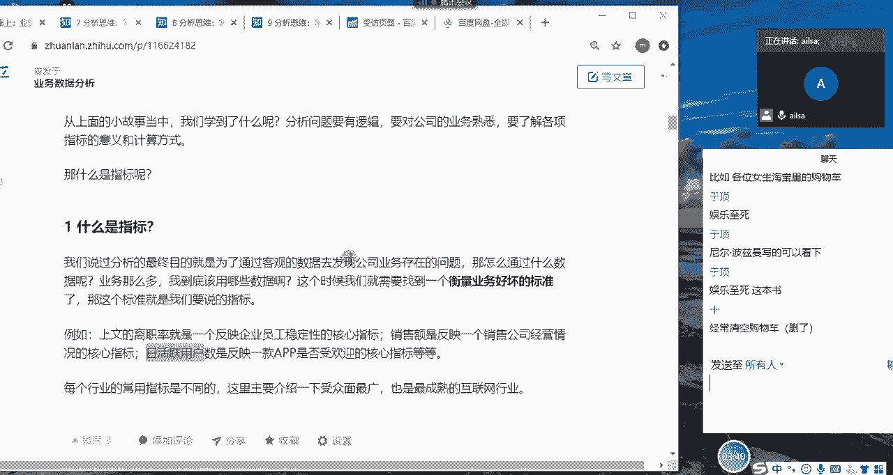

那我该怎么去了解一个业务呢，OK我们把笔记做到做到这里哈。

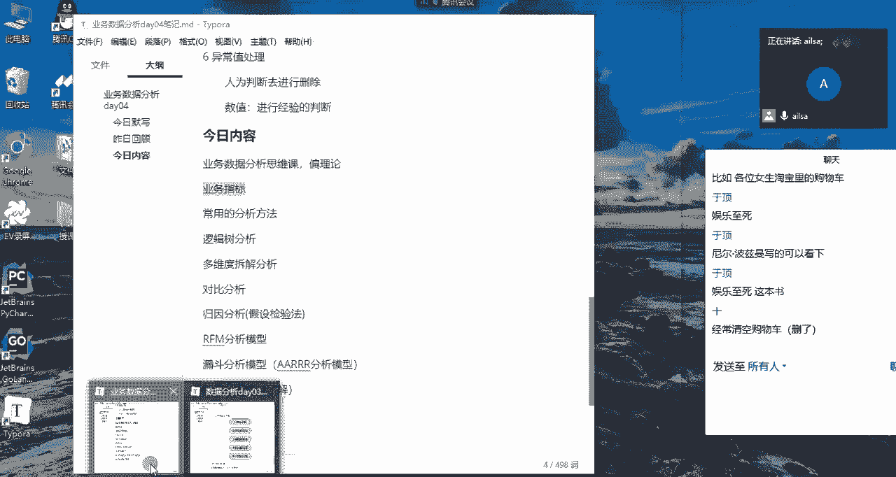

业务指标啊，我先说一下业务指标，它就是一个衡量啊业务好坏的标准啊，就是我们的业务指标，那啊我们为什么要去学习业务指标呢，就是我们需要了解业务，我们如何了解业务呢，啊如何了解业务。

我们可以通过以下三个方面，第一个了解业务，我们可以啊，就是我我们可以针对我们所在的行业，然后了解公司是啊做什么的啊，这个应该是可以了解的，做什么的，然后卖什么产品啊，啊什么产品，然后啊服务的对象啊。

有哪些啊，有哪些相关业务等等，这些这些是我们最基本的了解，那第二个的话就是，那既然我们了解了公司的基本业务，我们就要知道公司目前业务的一个经营情况，就是业务的好坏啊，啊到底它哪哪里好，哪里不好。

那这个时候我们就需要了解啊，了解相关核心指标，核心指标，然后去评判公司目前的一个业务情况，你比如说啊啊就是还是那个拿拿那个销售额，如果销如果说嗯啊，别人告诉你说公司目前经营不太好，那你就说哎这个不太好。

到底是怎么来度量，怎么来定义的呢，这个时候如果别人告诉你说，你看公司的销售额基本上平均是假设哈，平均是每个月10万，但是这个月只销售了5万，那我们就知道诶，他这个销售额确实是下降了一半，那就是不好了。

那这个销售额其实它就是反映业务的啊，一个好坏的一个标准了，这个明白了吧啊，就是我们主要的目的，就是发现业务当中哪些指标啊，存在一些问题，然后通过指标然后去发现问题，解决问题。

那第三个我们除了了解公司是做什么产品，然后有那些业务，然后还有我们的业务好坏，我们通过指标去了解，那第三个我们还可以从业务的流程上去了解，什么意思呢，你比如说哎我现在打开啊。

我给大家做一个详详细的演示哈，我现在打开打开啥呢，打开淘宝哈，打开淘宝，打开淘宝了之后嗯，嗯打开淘宝，然后我点进来之后，那我们知道哎淘宝这里他卖的东西啊，特别特别多，什么对吧，有服装啊，然后鞋帽啊。

玩具啊，家电啊，美妆啊，珠宝啊，运动啊，游戏啊，美食啊等等这些特别特别多，这就是公司的一些呃产品的范围啊，你可以做一个大致的了解，那我们通过它的一个销售额情况，去了解目前的一个。

而销售额就是目前的一个产品运营的一个情况，的的的的一个衡量指标，对不对，那还有一个情况就是说，我们如果要分析某一款产品，它到底好不好的时候，我们可以通过啊网站上的一个路径啊，业务的流程啊，路径去分析。

怎么说呢，就比如说我们要知道网站点进来之后诶，用户进入到了女装啊。

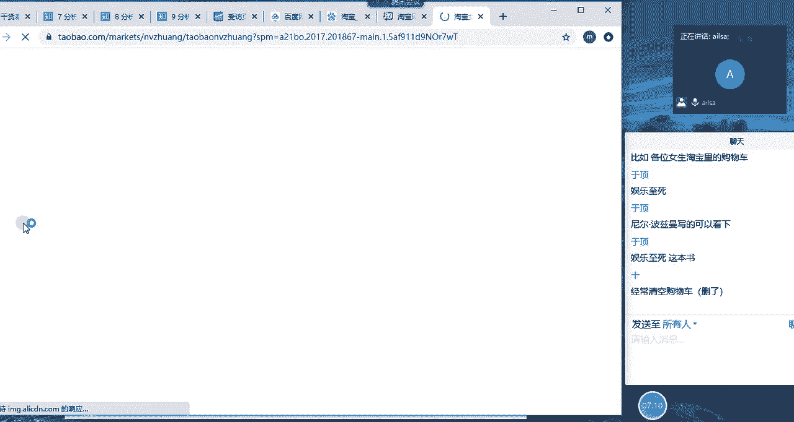

进入到女装之后，她应该点开的是这个女装的详情页，然后他看上了这款商品。

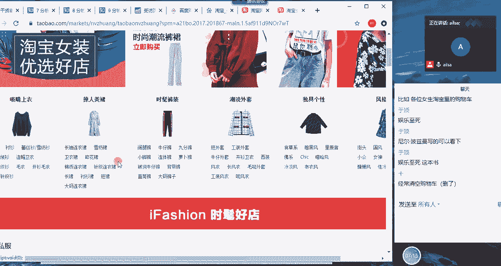

对不对，他看上了这款商品之后，他点进来就进入到这款商品的详情页。

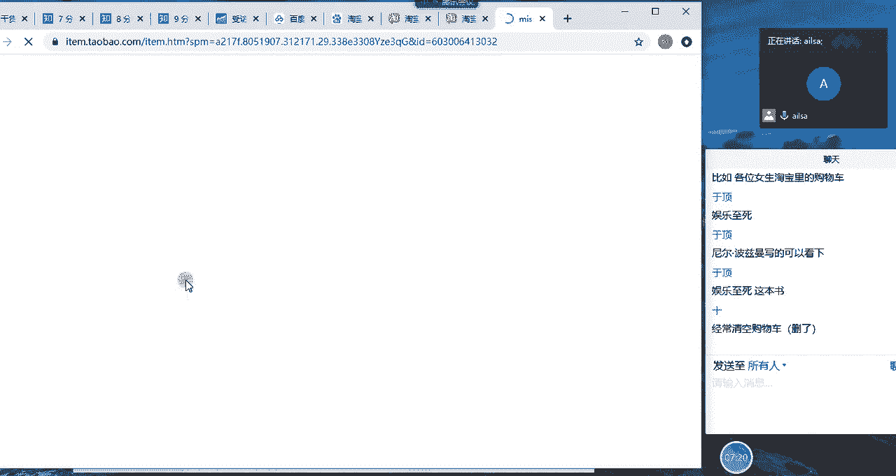

那进入到这款商品的详情页了之后。

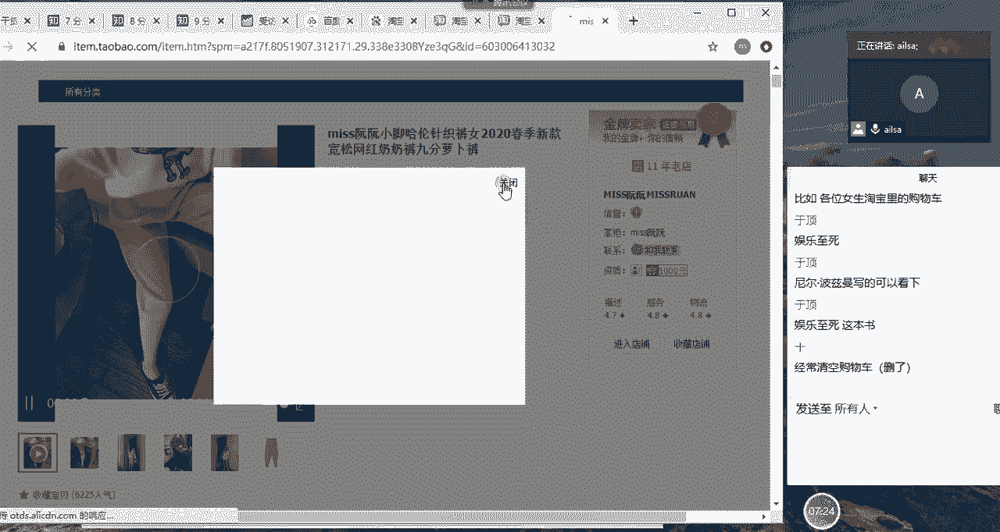

如果他觉得还不错，然后会看一下评论啊什么什么的，唉唉都OK对吧，都挺好的，然后这个时候他会怎么着啊，他会加入购物车。

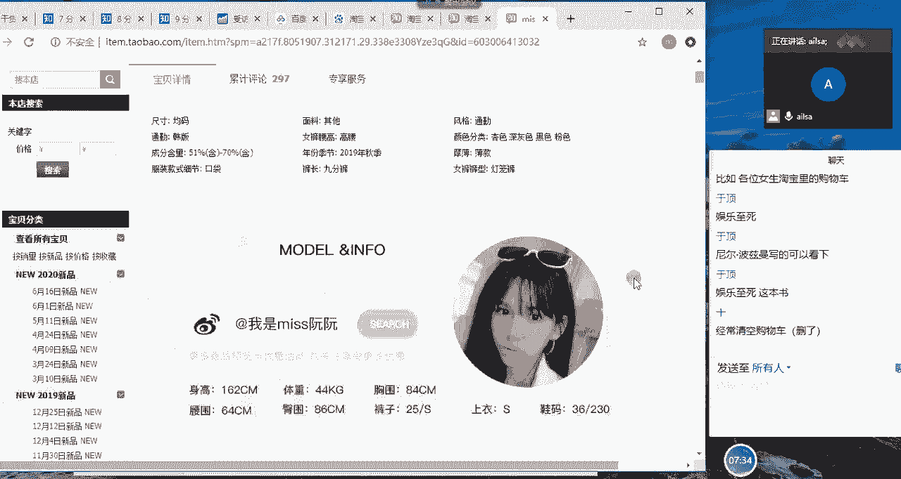

对不对，他加入啊，私下架哈，下架还放在这，OK好，我们看一下啊，这款啊什么东西，这个网站做的是有瑕疵的，OK我们看一下这个抢购的哈，嗯哎。

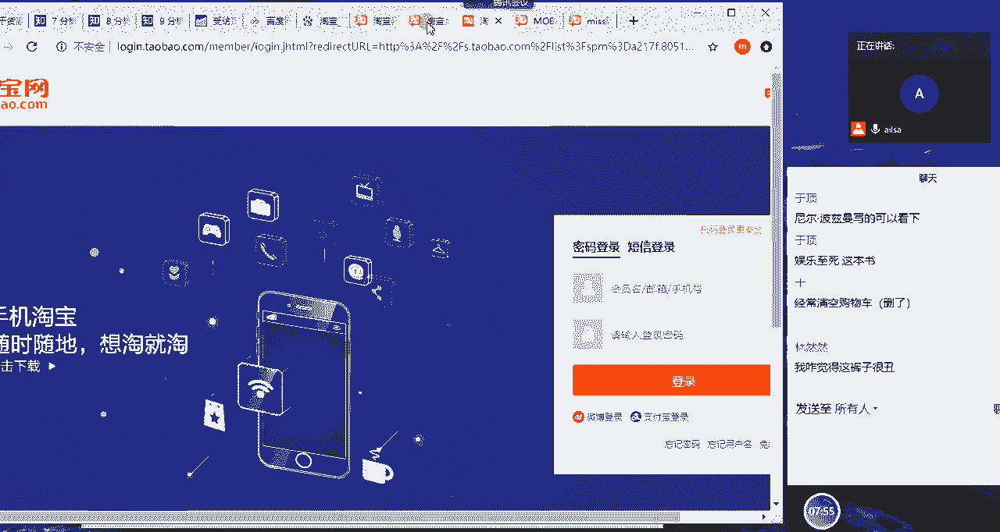

小灯王哪个裤子，这个裤子吗，这叫啊，这是叫奶奶裤吗，还是怎样，反正这衣服多的是哎你看这款商品啊。

如果说你觉得这款商品还不错。

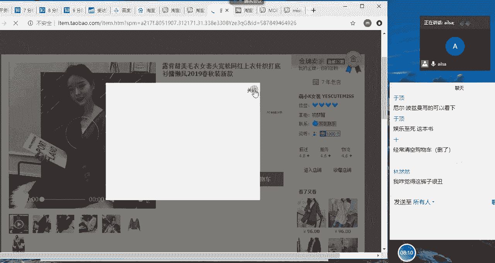

然后唉你又看了一下下面的那些东西啊，让我登我我才不懂呢啊。

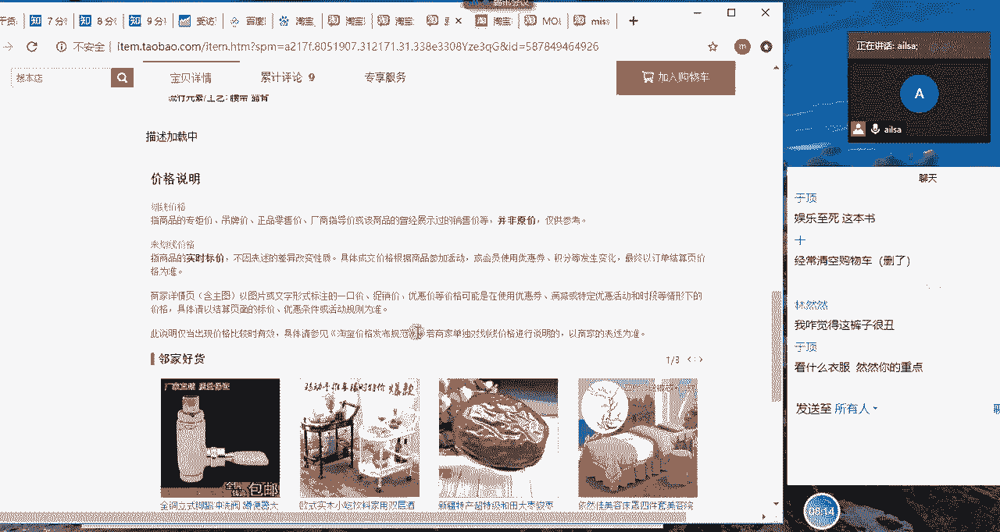

然后这个时候哎你看评价特别少，你有可能就就不看了哈，而且是系统做出的评价什么什么的。

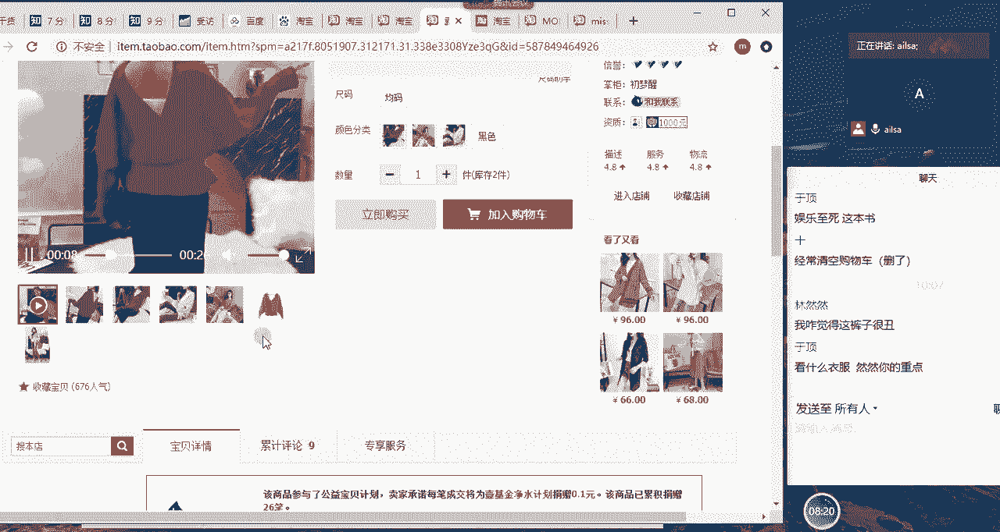

OK你假设哈假假设你觉得还不错啊，你觉得还不错，你就会有两个选择，第一个第一个啊立刻购买，第二个加入购物车，对不对，那如果说加入购物车之后，你还可以进行一个结算，对不对，那这样的一个流程你需要了解。

为什么要了解这个流程呢，是因为是因为什么，是因为你要分析某一款商品，它的一个，如果说它的网站销量不是特别好的时候，你要去分析用户点击了啊，首页多少次，然后有多少人进入到了详情页。

又有多少人进入到了这个产品，进入到这个产品之后，又有多少人加了购物车，到底是哪个环节出现了问题，你比如说假设看完这款商品之后，看完这款商品的人有100个人，那只有一个人点了加入购物车。

那说明这款商品是不是不太好，也就是说100个人看了之后，只有90个九个人都认为它不好看，那说明这款商品确实是不好看对吧，那我们就可以通过这样的一个分析，然后去定位到到底是哪个环节出现了问题。

这有这也就是说我们第二第三种，然后去了解唉我们的业务的啊一个方式，也就是通过我们的业务流程啊，缓解啊缓解缓解呃，呃确定啊哪个环节出现问题，出现问题啊这样的一个过程啊。

OK啊这就是我们啊因为有这样的一个需求，所以说我们要了解公司的一个指标，只有了解了公司的指标，你才能对公司目前的一个情况，有一个大致的掌握，那在这个的话我再给大家举一个简单的例子，你比如说好。

现在啊现在哈现在大家角色转换了哈，大家听我说哈，你比如说现在各位是我的投资方啊，现在我我我我是什么呢。

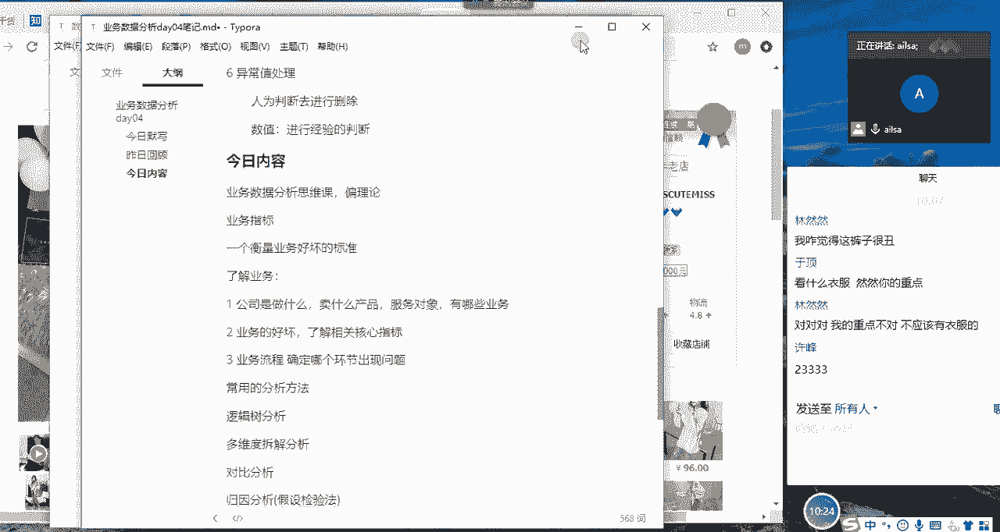

我是淘宝的啊，淘宝的一个店主哈，再假设我是淘宝的app的一个老板哈，现在呢我想让你们给我投资啊，你们给我投资，然后这个时候你说啊，各位哈，你说你们想让我啊想让你们想看到哪些东西。

然后才有欲望让你们给我去投啊，想一想就说你，那你就换个角度去说呃，我作为我的大boss啊，就说哎不是就是说你有什么，就是你投钱的目的不是为了赚钱吗，对你看，那那就是为了赚钱。

你要看到这个这个APP的一个发展的潜力，对吧，你投了一块钱，然后到第2年的时候你能赚100万，那其实这就是一个app的一个发展的潜力对吧，那我们该怎么，那我再给你介绍的时候，我就该怎么给你介绍。

我这个app到底有什么发展潜力，到底能给我的雇主带来多大的一个收益呢，其实我们也用到的是一些指标啊，对投资混啊对啊，那那我们会有哪些呢，你比如说啊，你比如说呃，我会跟你说唉我们这个app它有多少个啊。

用户数，因为只有用户啊，用户数啊多了，他才有可能在用户上产生价值嘛，对不对，你得先有羊啊，对吧对，你得先有羊，所以说得有一定的啊，就是用户基数，用户数一定要有的，还有就是我们的付费啊，付费用户数啊。

付费用户占比，我们可以这么说，你比如说你有100个用户啊，假设哈100个用户，然后你的付费用户占比只有1%，也就是说你只有一个用户是付费的，那对于公司目前来说，都没有人去对这个app进行一个付钱。

那我肯定觉得他们潜力不大，是不是，那所以说唉，那假如说你的付费用户占比是达到了百分之呃，50，比如说有50个人啊，都付费了或者80啊等等，这些，你会觉得说哎哎，那说明这个用户的质量还是很高的。

大部分用户过来之后都购买了商品，那在这个呃每一个用户的一个潜在价值，你比如说再来一个用户，他有可能付费率是很高的啊，对不对啊，所以说付费用户占比也是，我再给你要进行一个表述的。

还有一个就是啊企业的利润啊，利润率哈啊利润啊或者是销售额，一般一般都是利润啊，销售额哎，你看我去年我这个app赚了多少钱给公司，那他这个用户数又这么大，它付费用户占比又这么高，所以说它的潜力是无限的。

你就来投吧，呃就是保赚不赔对吧，包赚不赔的生意，你说你能不干吗，是不是你听完说完了之后，你就赶紧给我投资了，你就争着抢着给我投资啊，那大家知道啊，大家知道那个最新一季的向往的生活。

他们的投资方出现了一个这样的一个问题，就是之前的人的像就是人的这个这个综艺啊，都拉不来投资，他们的综艺是要往外拒绝投资，因为投资的人太多了啊，因为那还是因为什么，因为他们看中了这个节目。

给他们整个带来的一个收益啊，给他们做广告的一个效果，是不是嗯对你还懂得挺多哈，投资竞价哈，所以说这就是啊，这就是我们了解你看用户数，付费用户数，利润销售，这些都是我们的指标。

说明这些指标确实是能反映你的业务核心的，一些问题，所以说对于公司而言啊，对于公司而言，公司的内部的核心指标都不是对外公布的，所以你也不知道，反正因为这是他们的核心呀，对不对。

你也不知道他们到底是怎么来计算的，他们是怎么啊，怎么就是怎么来经营的啊，这样的一个形式，而且公司里面的数据的话也是保密的啊，大家大家进入到公司之后，一定要数据保密意识，不要随随便便就把数据发给别人。

特别是啊特别是你不太熟的人，即使是他属于公司内部员工哈，因为你把数据发给他了之后，它有可能对外泄露的时候，你是数据源头啊。

明白了吧，好那我们再接着往下说哈，刚才说到了淘宝这个的路径的一个问题等等啊，去掉OK哎那我们接着往下说我们的啊，我们的这个指标哈，那呃因为每个行业的指标都不太一样，所以说我们现在以互联网电商为例。

来给大家讲讲我们常用的指标，那我跟大家说，我讲了指标之后，那它第一个好处就是说我们对于电商行业，或者对于互联网电商行业，已经有了一个很清晰的认识了，这是第一个好处，那第二个好处的话。

就是说你在跟别人进行一个沟通和聊天的时候，或者是说你在进行面试的时候，别人提到了一个啊，提到了一个指标，你不知道就尴尬了，嗯然后有的人就说，那那我怎么可能不知道呢，他说中文我能不知道吗，啊不是哈。

在行业内啊，有一些缩减的英文指标，也就是它代表的是中文的意思哈，但它有英文的啊缩缩写，所以说比如说他说了啊，某某某啊，你你没听过，那其实就尴尬了哈，做这样的一一些东西哈，我们啊作为今天的一个讲解示例。

那我们分以下几种哈，一个是用户数据层面有哪些指标，还有一个就是用户行为啊，用户行为啊，行为数据啊有哪些指标，还有一个就是产品数据有哪些指标，大概就这三类哈，我们一个个来说哈，啊。

大家在这个过程当中有什么问题都可以提出来，因为这个的话是啊，因为每个人都用过互联网啊，互联网电商的产品哈，互联网的电产品都用过哈，所以说应该还是比较熟的，首先我们看第一个哈用户数据啊。

用户数据层面的话有一个日新增用户数，OK日新增用户数我们怎么来理解呢，啊其实就是说我们啊先啊对于某款产品而言，它每天新增的用户数量，什么叫新增呢，就是说一个用户第一次来哎我们叫新增啊。

那呃我们简单举个例子，比如说呃我给大家写的知乎的文章对吧，我我把链接发到群里，我说同志们，你们要关注我，然后你们以后看到的这个呃，就看到我这个文章就会有提醒，或者是说你就方便找到，那如果你关注了我之后。

因为你也只能关注一次哈，你不能关注多次哈，所以你关注我了，我了之后，那你就属于啊新增用户数啊对啊，那你就属于新增用户数，但是有的人说啊，我就是呃对它就属于新增用户数，然后比如说一款app，哎，比如说我。

我今天现在我给大家举一个实际的例子哈，啊因为我们都提倡健康生活，对不对，那我们要有就是要锻炼身体，所以说我这边有一款app啊，叫keep哈，keep啊，非常的啊非常的好用啊，啊我我一直都在用哈。

我我我是免费给客服打宣传了哈，然后大家可以下载这款app，然后里面有很多啊健身健身的视频，还有啊社区的一些分享，然后还有呃就是呃有氧运动，还有那个呃就是无氧运动，什么什么都有啊。

而且说适合小白到有经验的都可以啊，就适合的人群还是挺多的啊，然后如果说大家今天听了，我整个的一个推荐之后，第一次去下载了这个keep啊，那你就在今天的时候成为他的日新增用户数了，如果你是明天下载的。

那你就是明天的日新增用户数，明白了吧，但有的人就说有的人说，那我把这个app卸载了，完了我再下载的时候，不好意思哈，那你就不是日薪的用户数了，你你就是属于老老客户了，那有的人就说呃，那我怎么去评判呢。

就是你第一次下载的时候，他们的系统当中是会记录你的型号的，这个的话我们的手机上都有一个唯一的编码啊，对有一个唯一的编码，所以说它是能识别出来的，这就叫日新增用户数，这个我说明白了吧，嗯额说明白了。

大家如果听明白了，就给我扣个一，给我扣个一，嗯啊那这个呃大家想一下这个日新增用户数，它它既然我们刚才说一个指标，是反映一个企业的经营情况的呃，呃一个衡量对不对，那这个日新增用户数它反映的是什么呢。

它其实啊反映的就是一款啊商品的，一个啊拉新的一个效果，因为呃一般情况下就是如果说一款商品，它呃前期刚开始的时候啊，前期刚开始的时候他肯定要拉新，就是呃我的用户数越多，我对于我这个产品就越就会越活。

越就会越好嘛，因为我这个产品目的就是为了服务客户嘛，啊所以说啊它是啊，它是就是说嗯拉新的一个效果，那我们啊我给大家举一个很简单的例子，如果说你开发了一款新的app之后没有用户，那你该怎么去拉新呢。

啊怎么去拉新，大家遇到的，遇到的就是我们不说特别高大上的方法，就是在我们身边啊，就在我们身边的啊，如果没有钱做广告，那就比如说是你自己开发的一个app，自己创业啊，专业开发一个app，朋友圈可以。

然后还有一个大家应该在我们的街头见过吧，就是啊我给你一个小礼物，然后你给我扫个码下载一个app，对不对，这种的话就会就是这种的话，质量就会非常非常低，因为啥呢，我们一般情况下是属于趋于某种利益而做的。

某件事情，完全不是发自我们自己内心，不是因为这个app好，而我我们才下载，而是因为而是因为就是你给我了好处，我才去帮你做这个事情，那比如说呃确实某呃就是这款app，它的日薪的用户数在某一天特别高。

是因为他做了这样的一个活动，但有可能在第二天啊，第二呃就是在第二天就会下降或怎样的时候啊，然后而且还有一个情况，就是他可能日新的用户数比较多，但是它不活跃，你比如说我们下载了之后。

我们又不在里面做任何的操作啊，对他就不活跃，对于整个app而言，它又产生不了价值，那我们就在想，那既然我们都想到了这个原因，为什么别人还会这么做呢，大家想一想，为什么，啊是啊，我们可以想一想。

既然那他们创业公司也没几个人，然后也没有钱，他们为什么还要买那么多礼物，让大家去扫码，然后去下载他们的app，然后也产生不了价值啊，为什么呢，啊同志们有想到吗，他们为什么要这么干，他们傻吗。

嗯OK没有人回答是吗，他们是为了拉投资啊，他们是为了拉投资，因为他们前期没有钱呃，他们我这是我猜测哈，我个人的想法哈，因为你看我就是就是既然我前期拉不到投资，是因为我这个数据不好看，对不对。

那现在我的日薪的用户数达到了，那我整个的一个app app，整个的用户量也就已经达到了，那我再给我的客户，我的投资方去聊的时候，我就说你看我的app有10万个啊，有10万个用户。

它未来的发展潜力是非常非常大的，那你在经不住我忽悠的时候，你就啊你就投资了，结果其实这些都是僵尸用户啊，没有什么价值，但是对于我这个APP而言，我拉到投资之后，我就可以我就可以再进行接下来的操作。

然后去投广告啊等等这些，然后如果说app的内容质量还不错，那我有可能就会发展起来了，就是有一个有风险的投资，没办法，嗯知道了吧，嗯这个听明白了吗，OK听明白，给我扣个一，嗯啊这，这一般情况下。

就是针对那些比较不懂行的投资方才会这样，如果等懂行的投资方直接就去问，我不看你的用户数，我要看你的活跃用户数，接下来就是我们要讲的了，嗯啊对，就是对于不懂行的，他有可能会被骗，你看我这个哎呀。

基数特别大，怎么怎么着，但是他如果不看其他的指标的话，其实就被骗了，那我们还要看什么指标，看活跃用户数，那活跃用户数就相对于薪资用户数而言，它更能体现的是，它能够给网站带来一些价值的用户啊。

这个就比较简单了，你比如说我们啊，我们的微信群或者是我们的QQ群，因为我们拉这个群的目的，就是为了让大家共同的去学习，然后发一些通知，那如果说同志们在这个群里都不说话，然后我们讲师也不说话。

班主任也不说话，然后大家在这个群里都没有任何的一个活跃，然后这个时候呢那这个权就没有什么价值，那如果怎样让它产生价值呢，就是说，比如说老师在这个群里发了一些分享的资料，然后同学们在这个群里发了一些啊。

自己遇到的一些问题以及自己的一些看法，然后大家进行一个相互的讨论，这样整个学习氛围上来了之后，整个群就是有价值的，那你看每一个同学在这个群里发了一条信息，他其实就算活跃了啊，他就算一个活跃用户了啊。

然后大家都在这里面活跃的话，那整个群的呃就是活跃，就是这个学习氛围是有的之后，那大家的一个学习质量就会提高啊，所以说就这种活跃用户，他有可能就会给哦，就是我们的产品或者是某一渠道。

或者是某一网站带来一些有价值的，这样的一些用户，就是这个意思，那在其实在每个群里，你就会发现有一些永远不说话的，然后总会有那么几个就特别特别活跃的啊，啊这些活跃的就会带动啊，就会带动整个的一个呃。

整个的一个产品的一个啊质量往上提升啊，活云雾术怎么去定义哈，我再跟大家说一下怎么去定义呢，嗯就是呃每个公司其实都不是特别一样哈，然后行业也不是特别一样，但是大致啊分这么几种哈。

第一种就是说你比如说app啊，有一些公司就是说你只要打开我的应用，你只要打开这个app，我不管你在里面干什么，那我就算一个活跃用户数，大家看一下，其实这个其实就挺水的，为什么呢。

就是有些人可能是误点操作，比如说你做了一个广告，你打开了一个知乎的网页，他给你做了一个广告啊，我怎么怎么着，结果你不小心点了进去，那你虽然点开它了，但是你很快就退出来了。

那这种的话如果别人这么去定义的话，它就会比较水一些，但会有人这么去定义哈，那第二个就是登录了才算活跃你，那这就比如说我们的网站，我们的app，还有我们的游戏哈，大家都知道大家都打游戏啊，啊大家打游戏。

如果你不登录，你肯定打不了了，对不对，你包括我们的购物啊，你你不你不登录的话，你没办法下单，对不对，那你也就是浏览浏览，那对于就整个网站来说的话，是没有什么价值的啊，那第三个的话就还有一些就规定的。

规定的比较严格了，就是你产生了某些指定的行为啊，才可以算活跃用户，你比如说阅读类的，你要阅读啊，某些书的简介下载什么，你就是你做了这些操作，那你在今天才会算活跃啊，还有就是你设置了一些皮肤啊等等这些。

这些才算活跃，那嗯那像这个糗事百科这种就阅读类的，然后你如果只是打开，你没有看任何东西的话啊，它其实也价值不是特别大，那它可以定义说你下拉了好几页，然后待了多长时间，然后这样子的一些行为的话。

算活跃的话，相对于企业而言是比较严格的，也就是说这个活跃呃，就这个活跃的用户数量就会少，他们就会为了提高这个东西而，不断的去做更多的一些措施和改进，然后让企业啊在这个高标准的基础之上，发展的更好啊。

这个意思啊，这就是我们的活跃用户数，那说到活跃用户数啊，它会有按照时间的维度分为不同的呃，不同的一些一些一些好一些指标吧，有日活跃用户数啊，周活跃用户数和月活跃用户数，我跟大家说DAAU哈。

大家一定要记住这个词哈，D a u，DAO这个词一定要记住好，这就是我们的日活跃用户数啊，在我们的app，比如说一款app，他们经常叫的是日活啊，啊你你如果说大家在今后去面试的时候。

别人说哎呀最近公司的日活啊，或者是某段时间内的时间内的日活啊，不太好，你能分析一下吗，就是说你根本就不知道日活是啥的时候，其实你就尴尬了，对不对啊，所以说啊我们要记住，有有的人还会问DAU哈。

DAAUDAU哎，怎么怎么着啊，所以说这两个这两个俗话或叫行话，一定要记住啊，我们再接着往下看哈，那有了活跃用户数而言了之后，我们还有一个叫活跃率的啊，活跃率它其实就是活跃用户数除以总用户数。

这样的一个啊率的指标，那我们一般分析问题的时候，优先看的是绿哈，因为绿的话更能反映啊，更能反映一个产品的好坏，你比如说活跃率，当天的日活跃率不高的话，那说明它的整个的一个呃。

呃就是app或者是什么的时候就会存在，可能会存在问题，嗯对啊，是这样的一个全称，嗯这个一定要记住哈，DAU日活这两个词哈，嗯OK啊，那大家对于这个活跃用户数和活跃率啊，还有我们的DAU啊，日活啊。

这个有没有什么问题，如果没有什么问题给我扣一，我就讲留存率了，嗯一般会直接就是问DAO哈，问后面的WU和MAUYAU的就少一些啊，少一些，就是我这边经常遇到的，就是说DAO就是感觉我去我第一次听的时候。

我因为呃这个互联网的互联网这个东西的话，之前的话没接触，后来接触了，然后跟我说DAU哦，我说哦是什么呀，就觉得好高大上，结果自己一查啊，原来就是活跃用户数嘛，也没有什么对，所以说我还是我之前说的那句话。

当你对一个行业或一个知识不了解的时候，你总觉得说他无比的高大上，但当你真正去了解他，去学习它，去掌握它的时候，你觉得也就那样啊，所以不用把它看的特别特别牛哈，那包括你们到后面学到了机器学习，学到了算法。

你现在没有学，你觉得我去是不是特别难或怎么怎么的说的，当你真正学会了，掌握了它，你觉得just so so so真的还是玩的很转的哈啊前提，但是前提不要害怕他就是说呃打败的不是事。

打败的是你自己的一个心理啊，真的是这样啊，好像有点灌鸡汤了哈，反正我不会灌鸡汤哈，然后就瞎说啊，反正但是理是这个理儿嗯，OK我们看留存率哈，不先说哈留存率啊，这个东西我先举一个简单的例子啊，留存率啊。

我拿一个excel表哈，我不太会灌鸡汤，留留存率哈，留存率哎你看呃，留存率我们还是要从新增用户数来说起的，比如说第一天啊有100个人啊，成为我的新增用户了，也就是这100个人第一第一次访问我们的app。

然后到第二天的时候，这100人当中啊，只有啊只有20个人又访问了我的app，相当于是说第二天这100个人当中，只有20个人重新打开了我这个app，然后进行了某些操作，那到第三天的时候，第三天的时候啊。

然后这100人啊，这20人啊，不对哈，这100人，然后只有十个人啊，只有十个人打开了我这个app，然后到第七天的时候啊，只有五个人啊，到第30天的时候啊，只有啊假设哈啊第30天，第30天没有。

第30天的时候只有两个人啊，打开了app，它都是针对第一天而言哈，都是针对第一天而言好，就是说那就是这就是说在第一天当中啊，就是新用户啊，就是新用户过来的，然后在第二天这100个人当中只有20个人。

然后到第三那个天堂的时候，这100个人只有十个人啊，啊大概就是从这个依次减少的一个架势哈，都有可能啊稍微会多一些啊，但一般情况下都是减少的哈，到第呃第七天的时候有可能就五个人。

到第30天的时候有可能就是两个人，那在这里的话，这个第二天叫次日留存哈，啊这个用的也比较多哈，这个就是聊的，大家看这个，其实这个指标啊也不是我们想象的那么高大上，就是留存嘛。

额留存率也就是20÷100对吧，那第三天啊基本考试的不多，都是第七天叫7日留存，7日留存率啊，也就是5÷100 5%，那第30天是叫月留存率啊，月留存率是2÷100，那就是2%啊，这样的一个次日留存啊。

次日留存，7日留存和月留存率，那我们想一下留存率，它反映的是一个对于企业来说，它反映的是一个什么指标呢，就是说我好不容易把这个用户拉来了啊对吧，他下载了我的app，然后他成为了我的活，他第一次成在这里。

他肯定是新增用户的，对不对，他在后面的时候他走了，你说比如说我们拉来一个客户啊，我们打广告，我们怎么怎么着各种手段各种投资，然后我们花了100块钱，然后把这个假设啊。

平均每一个客户花100块钱拉过来之后，他没有给企业产生任何价值，他就走了啊，对于我这个企业而言，其实是特别特别吃亏的，那如果说所有的用户都这样的话，那我这个企业就是只赔不赚啊，真的是。

所以说我们最终的目的是希望他来了之后，留住他，并且说一直留住他，让他成为我们的什么忠诚的客户啊，忠诚的客户就是只要他有需求，他就会来到我这个网站，如果说我们是一个娱乐性的哈。

假设我们是一个娱乐性的产品啊，娱乐性的产品，我希望他每天都来玩儿一下啊，不管你花10分钟，20分钟啊，或者是2分钟，这我都希望你每天都花一定的时间，你有时间来娱乐的时候，你都在我的产品上。

而不是在我的竞争对手的产品上，我希望你都在抖音上啊，去花你每天啊一小时的娱乐时间，二一小时，而不是在，而不是在火山小视频，或者是其他的呃娱乐网站上，或者打游戏等等这些啊，啊当然了。

如果你每天都花在打游戏上一小时，那抖音这一小时就没有了，对不对，所以说那呃那抖音跟呃打游戏，这样的话，你只能二者选其一的时候，那那相当于是呃相当于是人游戏战胜了啊，抖音啊这样的一个效果。

所以说我们留存用户的话，它反映的是一个产品啊，一个产品质量或者是它一个健康程度的哈，我看一下这个语言怎么去表达啊，啊OK没有没有去说哈啊我们先看一下这个公式，它就是第一天访问你的应用。

在第N天还访问你应用的用户数，然后除以第一天访问你应用的用户数，这样的一个计算公式啊，啊，那我们看会员在某段时间内开始访问你的应用，经过一段时间内仍然继续会访问你的应用，被认作为留存。

留存率是反映的是电商留住会员的能力哈，就是留住会员的能力啊，留住会员的能力就是留存率，留存率一直是企业啊很关注的一个点，因为它只要留住这个用户，他就有可能在这个客户上产生无限的价值，嗯啊就是我跟大家说。

我这个啊就是我的我手机上是没有抖音的，然后我的苹果啊，pad上是有的，所以说一般情况下都是回，因为我不可能拿着pad去上班对吧，然后都是下了班，然后可能会看一会儿啊，但是忙的话也都不看了。

因为他好像真的是啊，真的是那个哎呀，也就是就是一看就停不下来的感觉啊，这就是我们的留存率啊，大家对于留存率有什么问题没有啊，如果没有问题，给我扣个一，嗯这些指标都要记得哈，啊你记住留存率是反映电商啊。

我们不更不用说电商哈，留存率是反映产品留住会员的能力就可以了啊，留住会员的能力啊就可以了啊，这是我们的留存率，那对于留存率而言的话，行业内会有一个模糊的标准，也就是四十二二十十的法则。

那就是对于次日留存率，如果能你能达到达到40%，那说明啊还不错还还不还不错，然后7日留存达到20%啊啊，然后月留存率达到10%，如果能达到这个标准的话，就是达到了行业的标准啊，当然了。

每个企业不是太不一样，如果说你在面试的时候，别人问你啊，你们公司的一个留存率的标准，你就完全可以说这个哈，完全可以说这个因为这个是行业标准，或者是说你在这个基础上略有下降和提升，也是可以的。

嗯这就是我们的留存率，那我们从这个用户用户层面可以看出来，就是说当一个用户新增过来之后，我们希望它成为一个活跃用户，对不对，活跃用户能给企业带来价值，那它那它带来一次价值之后还不够哈，我们要留住它。

让它永远的在我们这个网站上产生价值，持久性的产生价值，所以叫留存率，也就是从我们的用户层面一步一步的啊，让它呃让他在这儿啊走不掉啊，这样的一个过程嗯，那我们再从整个公司的啊。

整体上去看的一个另外一个指标，叫单位获客成本，什么意思呢，那就是说我们啊要对一款app或一个产品，或一个网站，我们开发出来之后，我们肯定是要拉新的啊，跟大家说啊，这个单词叫啊拉新啊。

就是拉来新客户啊这样的一个东西，但是我们在拉新的时候，前期肯定是要投入很大的成本的，我们要做广告啊，广告的话，我们有我们还要做那个百度的推广对吧，然后还要做啊，就是线下的一些呃。

一些传达等等这些各类的一些方式，然后我们的目的都是为了获取客户，那在这个过程当中，如果我们无限制的去呃去投入，然后获取出来的客户呢，呃就是或多或少，那我们都要嗯我们都要去做一个分析。

那分析一下我们获取过来的客户，到底花了多少钱，以及每个客户平均花了多少钱，这就叫单位获客成本，它的计算的公式是广告活动产生的投放费用，也就是我们前期投入的成本，然后与广告活动带来的独立访客数。

也就是说比如说你花了100万，然后去投去投入这个广告，最终这100万带来多少个独立访客呢，那比如说带来的是100个，那你整个的一个整个的一个获客成本，就非常非常高，他们俩直接相除就可以了啊。

那我们除了分析这个东西之外，我还们还会分析单位访客成本与，平均每个访客带来的收入啊，以及这些访客带来的转化率进行一个关联分析，什么意思呢，就是说你把这些客户拉来了之后。

这些客户在公司里到底买了多少个东西，也就是收入哈，那他买的东西越高，说明你获取的客户的质量就会越高，以及这些客户带来的一些转化率啊，就是说这些客户啊，因为这这这收入是看最终的。

那这个转化率就是说比如说我们的淘宝，你拉来了100个客户，他们到底是在呃购物车环节这个转化率比较好，还是在下单的环节转化率比较高等等，这些我们会进行一个转化率的一个关联的分析。

然后去分析用户的一些行为啊，那啊这边后面还解释了一下，就是如果说单位访客成本上升啊，单位访客成本上，也就是说我们前期投入的成本很高，但是我们的访客转化率，也就是说过来的客户非常少。

然后我们的整个的收入啊，收入也是没有明显的变化的时候，那就是呃我们在前期推广的时候赔本了啊，就是出现了问题哈，啊出现了一些渠道上的一些问题，所以就要进行一个相应的分析，嗯那这个意思哈。

这是我们的单位访客成本，这个也很重要，就是说它是评估你整个的一个推广效果，好坏的一个标准啊，你不能无限制地跟公司要钱说啊，投这个渠道，投那个渠道啊啊然后投了很多个渠道，结果获呃获取过来的用户啊。

虽然量大，但是质量不高的时候其实也不好，我们最终目的都是为了给企业增加收入对吧，然后去降低它的ROI这样的一个效果啊，大家对于这个有什么问题没有啊，没有问题给我扣一，嗯同志们这个听得懂吧，嗯听得懂哈。

OK嗯OK我们再看客单价哈，客单价啊啊对这个要做笔记啊，这个一定要做笔记，按照我这个思路去做笔记啊，然后我们看客单价，这个就是说嗯这个就是针对我们的老客户，或者是已经在我们的网站上买过产品的客户了。

那客单价它其实指的是，我们从这个呃理论的层面去看的话，他应该指的是就是客户付了多少钱，然后除以啊就是客户的一个呃总的销售额，然后除以客户的一个数量，然后获取到每个客户，他在我们公司当中到底花了多少钱。

这样的一个啊计算方式，那我们也可以在我们的实际过程当中，我们可以用订单来进行一个计算，也就是订单总额除以订单数量，然后来进行一个客单价的计算，这主要应用的场景是零售和电商，那对于我们的游戏类哈，游戏类。

大家大家想一想啊，我现在问一下你们打游戏花不花钱，同志们啊，给我回应一下，你们打游戏花不花钱，因为你在一个平台上打游戏，对呀，他目的就是就是让你花钱，你要是不花的话。

说明人这个app人这个游戏可能做的嗯，可能做的有点啊有点失败了，或者是啊或者是你应该花的时间不多哈啊，那这个A2PU呢，A2PU大家记住这个单词哈，A2PU它这个指的是其实跟客单价有点像。

我们可以看一下总收入除以总用户数，也就是说你这个呃游戏app有多少个用户，就用户应该是指的是注册注册以后的用户哈，啊做注册以后的用户，然后在这个当中这些客户花了多少钱，然后进行一个相除。

然后计算的就是说每个用户啊，从每个用户当中得到的利润是多少，也就是每个用户给这个app贡献了多少钱对吧，那你贡献的钱越多啊，说明每个用户啊啊，他整个的一个消费水平还是有的，所以叫A2PU。

那我们看A2PPU，它这个就是分母发生了变化，分母指的是付费用户数啊，那它代表的意思就是说，平均每个付费用户数的一个收入，它反映的是每个付费用户数的一个付费额度，也就是针对付费用户数而言。

它能够产生多少个收入啊，这样的一个对于企业而言，能够产生多少个利润啊，这样的两个指标A2PU和A2PPU，还有客单价，这个也需要大家重点的去关注一下，我对游戏完全是不感冒啊，因为我不会，我一点点都不会。

我最多玩一个数独，玩一个消消乐啊，就其他就不会了啊啊那这就是我们的用户啊。

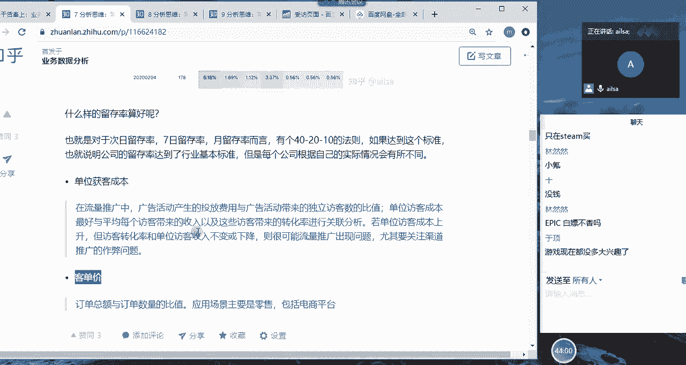

用户层面的一些数据啊。