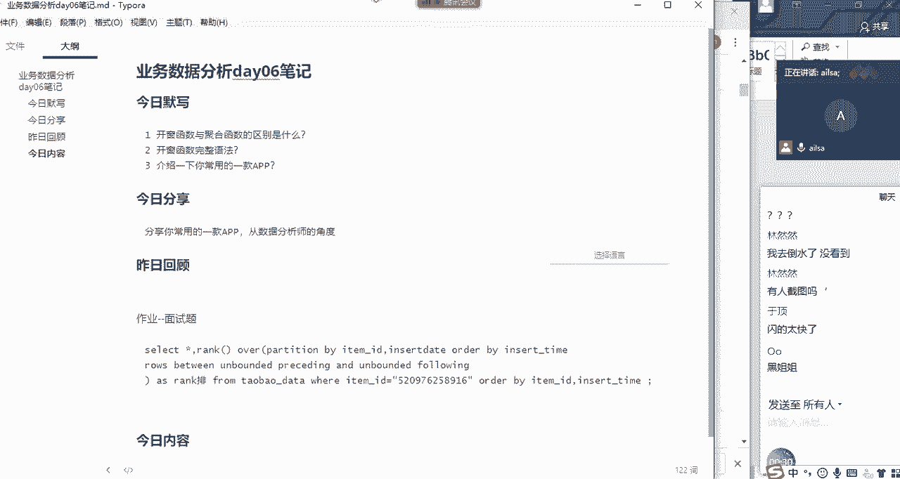
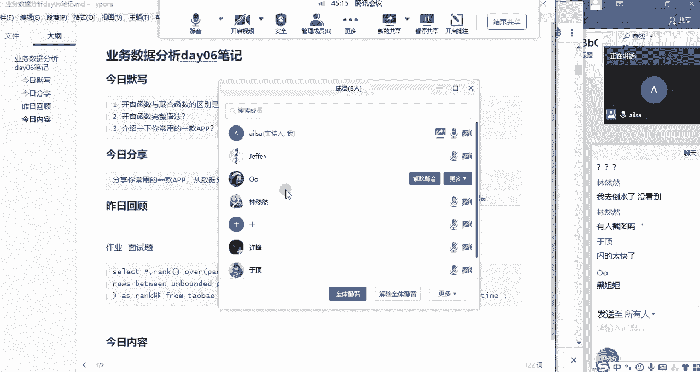
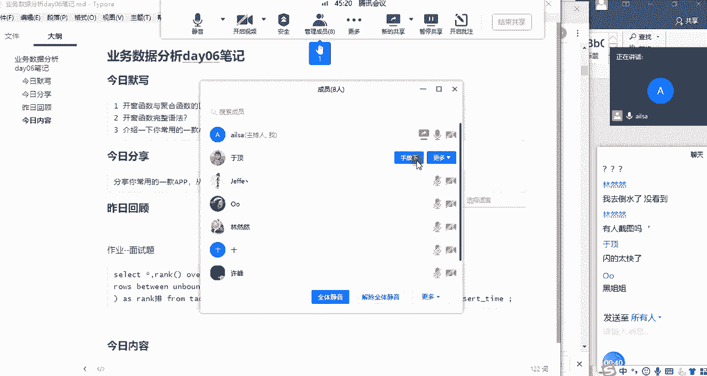
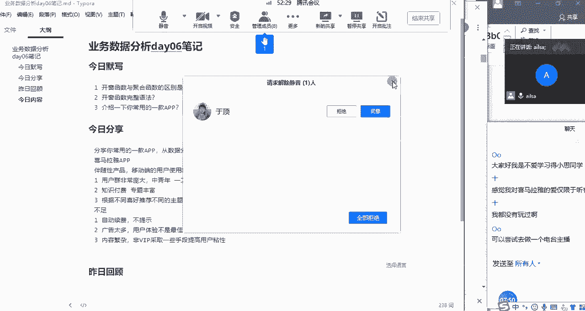
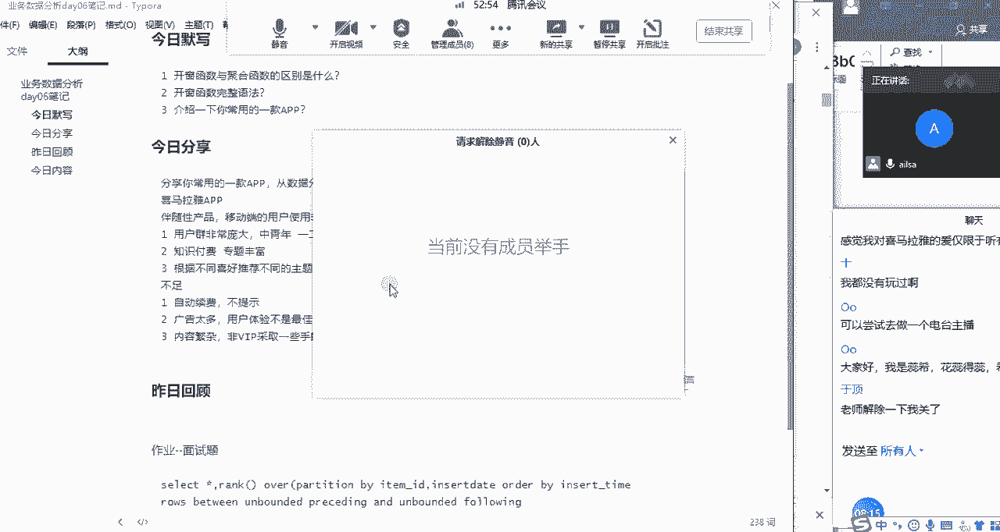
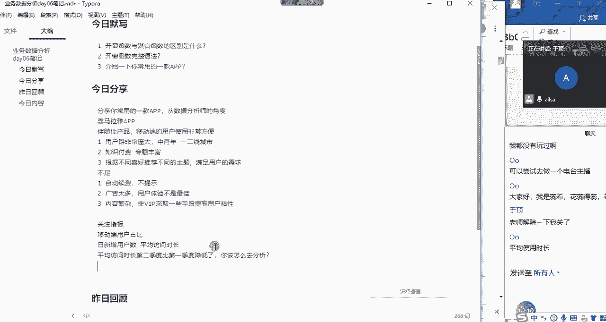
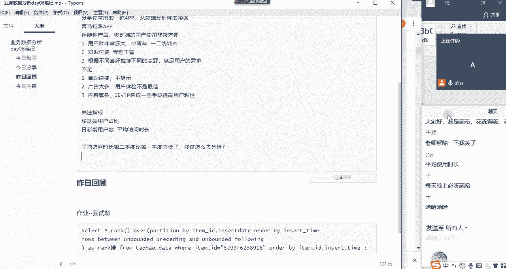
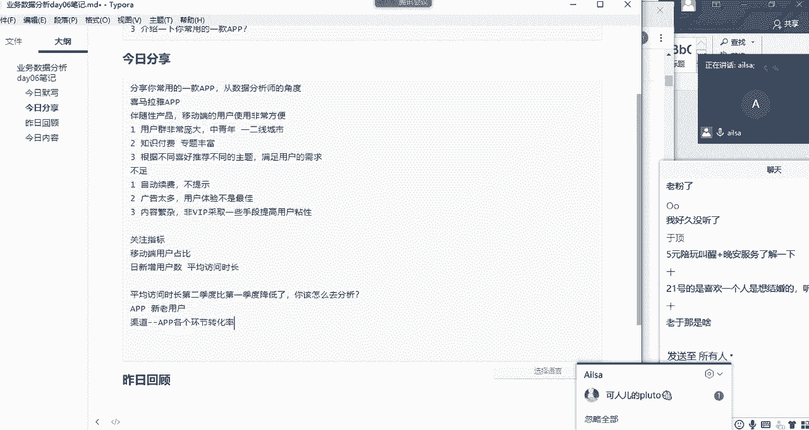
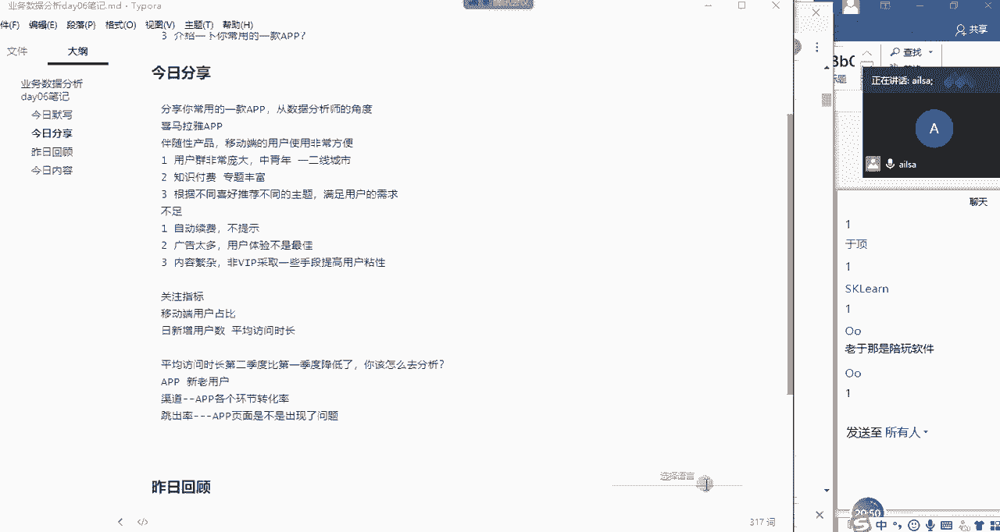
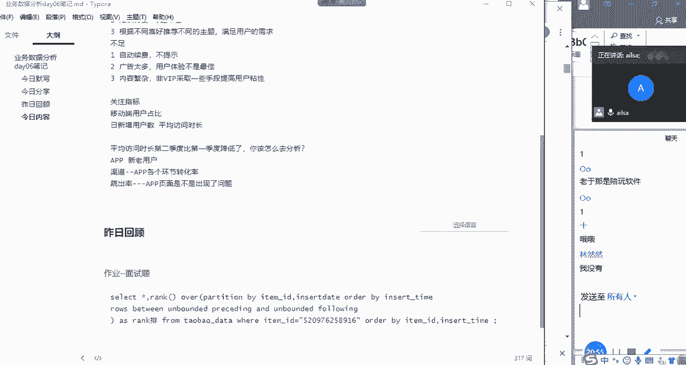

# 强推！这可能是B站最全的【Python金融量化+业务数据分析】系列课程了，保姆级教程，手把手教你学 - P75：01 APP使用案例分享 - python数字游侠 - BV1FFDDYCE2g

那接下来我们就进入到啊默写已经完成了哈，默写已经完成了，然后我们进入到今日分享的这个环节啊，然后唉我们昨天已经说好，让于鼎同学给我们分享一下常用的一款app啊，从我们专业的数据分析师的角度去讲一讲。

你这款app的一个啊使用的啊，使用的呃感呃，就是效果如何啊，你觉得它好的点在哪，不好的点在哪哈，然后我给开麦哈。

OK鱼鼎鱼鼎是哪个嗯。

一顶啊，找到了手放下。

哎你顶呢哦在这OK已经解除静音了哈，嗯hello，唉你可以简单的介绍一下啊，拜啊，我用这个app就是用额嗯自己用的嗯，虽然也不多，但是嗯这也会经常性的听一下，主要是他的呃听书或者是音频功能。

因为嗯怎么说呢，它能够在像我们的碎片化时间，就跟抖音或者是其他软件什么的，它能够在你的碎片时间，它能够嗯让你在手机端和移动端能够合理化的，也不能说是合理化的话，只能够随时随地能够嗯使用这个音频软件。

你接收的音频软件是哪个呢，不好意思，打断一下啊，喜马拉雅哈，呃因为像这种音频软件，它是一种嗯伴随性的那个嗯，有的音频是一个伴随性的产品嘛，那可以可以能够不管是你在做什么，你都可以使用它。

所以它对这个呃移动端的用户，能够嗯有很大的一个方便之处，嗯所以他的呃，尤其尤其是现在这个移动互联网呃，从以前的互联网发展到现在这个移动互联网，所以呃呃所以现在的用户数量就会越来越多。

然后所以它的用户规模会非常的庞大，而且他的第一个优点嗯，嗯而且他的用户群体是嗯，主要是覆盖到嗯一二线城市的呃，呃像呃呃年轻年轻群体，然后中呃中青年，然后群体嗯嗯嗯嗯，能够嗯嗯能够让他们能够去获取信息啊。

因为现在嗯在知识付费这一方面，他有很多都都去做这个做这个方面的那产品，知识付费的话呃呃是呃知识付费，对于这些人群来说，他们获获取信息的渠道有很多，但是应聘这个这方面，他们会，呃呃音频这方面啊。

最理想的状态就是我越来越好，我什么都不能干，我我我想啊，我想了什么，然后就可以嗯做到什么，然后音频这方面就是你点击了什么，什么都不用干，你只需要去听，然后你就你就可以去得到这些信息。

你就可以去嗯消化这些信息，所以呃呃音频嗯，喜马拉雅对于这个知识付费这方面，还嗯做的也嗯嗯非常好，然后他可以满足你的各种需求，然后嗯有非非常多的专题内容，嗯然后可以来让进行选择。

然后呃另一个方面就是现在是主播呃，做主播或者是做什么是呃一个趋势，或者是嗯很多人都喜欢这个做这个东西，嗯嗯所以而且喜马拉雅需要一个手机耳机，它不需要像视频主播那样，然后还需要去嗯嗯购买一些设备。

然后来嗯展示自己啊，他只用一个手机耳机，然后把自己的声音然后传递给大家就可以，然后对于一些非播音主持专业，或者其他的一些讲师啊，都会有一个很很友好的这个东西，它可以直接就可以去当主播。

也不会有特别大的门槛，就是他另一层另一个优点，然后嗯西嗯另外一个就是他的新用户进入app话，然后他会可以可以根据不同的喜好，然后来选择不同领域，然后现在呃大数据时代，然后它可以根据用户的行为。

然后来匹配和推荐它的内容，然后就是让每个用户来打开他的页面，就不会特别的一样，然后来保证用户挖掘感兴趣的节目，然后保持它的独特性，嗯我个人觉得它使用它的不足的地方，就是呃自动续费这个东西嗯。

第一个是呃自动续费，因为很多很多app它都会会去提示，然后就第一开始你嗯你付费之后它自动续费，它就会默认默认之后你选择，然后他就会每月自动扣费，有时你不想用了，所以那你还得再去找他。

不会有一个相应的提示作用，然后第二个就是很多app的通讯广告太多，这这也是他们收入的主要来源，所以我就是说，如果他可以凭借自己的平台，累积的用户偏好数据来把这些这个大数据。

然后可以为第三方公司提供咨询服务，然后可以拓呃拓展盈利渠道，然后适当的去减少一些呃VIP广告，或者是其他一些广告额投入额额，第三个就是他的嗯内容嗯嗯非常的繁杂呃，不像第一开始的话，他可能会少一点。

那因为现在版权问题，在中国以前是不会那么的重要，现在会越来越重要，因为版权纠纷这个问题嗯，你只要一产生了版权，版权就跟你这个东西它就会用就不能用了，所以你就肯定要暂时下架。

然后你的用就会很想想看又看不到，所以这个版权纠纷，所以你就需要提前谈好嗯，所以可以考虑一下，与多家音频平台建立一下合作关系，然后分享一下他们的嗯嗯资源，然后内容来相互补充嗯。

然后另外一个就是对于一些非呃，有非VIP用户来说，可以说用用户签到啊，分享啊，要求好友订阅专辑啊，然后来进行积分奖励，然后可以用这些积分来额积分，商城兑换一些商品，但是这些商品肯定不是。

但是不如那些个VIP商品，但是也可以使用，就是来可以这样可以来留住一下非VIP嗯，嗯我的我的想法就这些嗯好的，那我嗯那我问你一个问题哈，就是针对于啊你经常使用喜马拉雅。

然后呢你这边呢嗯也啊也很熟悉哈啊也很熟悉，然后就想问你啊。

就是如果说你是喜马拉雅的一个啊啊，很重要的角色，比如说你是他的首席的数据分析师，那你在呃整个app的初期啊，如果说你们要把喜马拉雅发展的很好的时候，你们关注的一个核心指标啊是什么呢。

然后昨天就是看了您的视频。

然后我就是您发的视频，我然后看了嗯，看了一下他的那个介绍，我感觉他初期的话，因为他一开始是先做web，然后再去做安卓rs，然后他其实主要还是去额，还是一个从互联网到移动互联网。

然后我感觉他的那个重要指标还是一个移动端，移动端的用户占比，然后是他一个重要的指标嗯，移动端用户占比，那它是相相比较谁而言，就是整个啊web端和移动端的，整个的一个总用户群中，移动端的用户占比吗。

对外部端加上PC端，那你这我觉得这是他们的一个初期的战略选择，所以这个对他们来说比较嗯，那假设我们就以因为我们今天聊的是app哈，我们就不管啊，就不管这个web端，然后就想问，如果说针对app而言，唉。

你想知道这个app嗯，就是目前发展情况如何，你应该是关注哪个指标呢，目前呃就是呃，呃日呃日回额就是日增日增用日增用户，日新增是吗，每日新增用户，然后日活嗯，日活跃用户，然后还有就是，嗯留存率嗯。

次日留存率啊，假设现对，假设现在假设假设现在就是说啊，只能说一到两个核心指标的时候，你应该关注哪些呢，因为一款APP的指标它有很多嗯，然后呃我们我就想知道说你们公司，或者是就是你对于这款APP而言。

你觉得呃哪两个指标是比较核心的，嗯就是日新增用户和平均访问时长，OK为什么是这两个呢，嗯因为一第一款app呃要看他的呃，因为用户是他的基本的那个基本的指标，然后就需要来需要这个用户总量来维持他的。

那这款app的呃成长的其他的一些基础业务，然后呃平均访问时长，来显示这个用户对你这个app的一个写真呢，喜爱或者是接受程度，然后能够看出来有多少用户群体，大概能够对这款app的呃接受活动会比较的嗯。

喜欢，能够从而能够针对这些这些个用户来呃转化呃，转化这个收入啊，或者是其他一些产品嗯，嗯OK那现在我就是现在啊假设啊喜马拉雅app啊，然后它的平均访问时长这个数据啊，在第二季度的时候，比第一季度啊。

整个的一个平均房市场都啊都降低了啊，针对这样的一个问题，你该怎么办，我们先呃，应该先看一下，第二季度是否有什么额营销活动啊，或者是呃，嗯或者是是否是对嗯，产额产品与一些产品进行了调整。

或者是嗯对VIP额费用啊进行了进行了调整，哎我想想这个方案是什，之前的多维多维度分析应该怎么想，嗯嗯啊就这么多是吗，暂时OK哈，没有关系没有关系，你这个自己再回去私下想一想，我等会会给你做一个提示哈。

那你这边可以过麦了啊，大家有什么收获没有。

刚才于余鼎同学是不是讲的挺好的啊，他因为我昨天给他发了一个，就是我分享了一个视频，然后就是嗯那个呃喜马拉雅的CEO啊，他分享的嗯，他们在啊开发啊，喜马拉雅app这样的一个过程当中的一个运营啊。

他们的一个运营的啊方向和指标，以及他们的手段啊，那其实他讲了很多关于业务方面的东西啊，那对于啊喜马拉雅app呢，我昨天还专门啊我我一直都有下载，但是我不怎么用，我昨天还专门去进京剧里面看了看。

我觉得就是可能大家主要用的还是听书，这个这个功能，因为嗯我们看书，你想一想，我们瞪了一天的，但电脑然后回来之后还要看书，就很难受，那我何不何不躺在床上听会儿书呢，对吧也挺舒服的啊，然后也都讲的特别好。

这是一个听书的这样的一个功能，那第二个功能我觉得比较好的，就是它里面会有一些主题的，就是每个人会也就是应该是主播类的啊，他会有自己的一个呃歌曲的啊，分享类似于这样的，然后的话他的歌曲啊，他后面是放歌。

但是前面他会说一段话啊，这段话就是相当于是引入这首歌的一个背景，然后就可以把你带入到当时的那个情境当中，如果说你跟他跟这个情境刚好有过类似的经历，感同身受的时候，你在听这首歌的时候是非常非常有感觉的啊。

对我就觉得哎呀，就是我就我就达到一个什么程度，就是说啊我听完这首歌之后，我就要去，我就要去网易云音乐里面去找这首歌，因为他没有，他不说歌名啊，我得去把歌词输进去，然后去找这首歌，找这首歌，找了完了之后。

然后我去是这是就是原来名字叫这个，我之前好像也听过，然后就把它加到我的歌单里面啊，这样的一个就是想以后想轮回听的那种，所以说我觉得他整个的一个啊给人，因为听歌本身就是一个嗯，就是一个很感性的一个行为。

就是说他可能会触发你的思想上的一些东西，包括你之前的一些类似的经历，或者是说啊你对一些事情的看法，或者是怎么怎么着吧，因为他他比较感性啊，它不像数学公式似的啊，就是理性思维。

所以说他啊这个我觉得做的也还不错，然后呃我看那个于鼎他在分析的时候，其实从哦好的地方不好的地方都说了啊，特别多，那喜马拉雅app呢，它算一款比较成熟的啊，啊现在对现在来说发展还不错的一些东西。

那它对于一款伴随性的产品的话，也就是说你在做这件事情的时候，你不耽误你做其他事情，这叫伴随性产品啊，你比如说你听歌的时候，你可以学习，你可以做家务对吧，你也可以聊天，你也可以睡觉或者怎么着都可以。

他这个是同时进行的，那呃对于这款产品而言的话，它的一个很重要的核心在于什么呢，就是说如果说你的听收听时长很短的话，就是你的在线时长很短的话，那说明你对这款app内容并不是特别感兴趣，如果是比较长的话。

那说明他们的app开发的，算满足了用户的基本需求啊，算满足了用户的基本需求，也不是说你这个app到底有多好啊，不是的，他就是他就是这就是他们的一个方向，他们的方向就是尽可能的让用户来，然后留住用户。

让用户每天都在我的app上花一定的时间，然后养成这样的一个习惯就可以了，对养成这样的习惯就可以了，所以说他的一个呃嗯他的一个在初期的话，它的一个很核心的指标就是一个平均访问时长。

因为如果他们的app刚上线上线了，完了之后平均访问时长特别短，那说明它内容不够优质啊，大家都不愿意去听啊，是这样，那久而久之也就被其他的竞争，竞争对手所代替了，竞争产品所代替的。

所以如果说他们在啊平均访问时长，让这个指标下降的话，对于整个公司而言。

都要把所有权公司的一个啊精力啊，或者说财力，或者是说整个的运营方向都七都要倾向于此，然后去想办法去解决啊，这个指标降低的啊，真正的原因，那如果说啊这个指标降低了，我们该怎么去分析，那在这里的话。

你看我已经精确到时间点了，就整个对于这款app而言，整个所有的内容哈，第二季度比第一季度降低了啊，平均访问时长降低了，那对于这个原因去分析的话，我们主要就是从app啊，app那这个方面啊去分析哈。

这个时候我们可以拆啊拆什么的，新老用户哈，因为新老用户它这个的一个特征不是特别一样，我们看到底是新用户的，整个的一个访问时长降低了，还是老用户的一个访问时长降低了，如果是新用户的话。

那是不是说啊用户刚进来是不是他看到东西，不是他不是他喜欢的，所以说他就走了，那如果是老用户的话，是不是我的内容嗯，就是更新的太慢，或者是怎么怎么着的时候啊，才造成了用户的一个流失啊。

或者是说不愿意在这个地方去待，当然这只是猜测哈，我们在后面都会去印进行印证，这是一个方式让分呃呃区分了啊，就是维度拆解新老用户了之后，我们还可以再往下拆啊，就是对于分别对于新老用户而言。

我们从啊用户的渠道开始，就是这些用户从哪里来啊，这些用户从哪里来，然后啊然后它的各个环节的一个转化率，这就指的是app各个环节了哈，看看app各个环节的一个转化率情况啊，转化率情况。

还有就是呃就是说看他哪个环节啊，环节出现了怎么了。

哦在呢哦哦不是这这个是啊。

这个是我的一个学生啊，app各个环节的转化率，我们先看app是否健康，然后在哪个环节上可能会出现问题啊，那分析完了之后呢，我们还可以这谁啊打断我的思路哈，我们还可以根据app的一个啊跳出率啊，跳出率啊。

大家可以想一想呃，就是平均访问时长，既然短了，那我们看一下它跳出率如何，在哪个页面上啊，跳出率比较高，我们是不是app的页面有可能会出现问题啊，是不是出现了问题，我们都可能去就是不同的维度和方向。

然后去拆解，是不是你比如说嗯有一个页面，它你一点进去，然后他就啊他就他就报错，或者是说啊，或者或者说他直接就嗯，呃就是呃它的前端JS或者怎么怎样写的太多了，然后特别慢，所以用户就不愿意待了。

你谁也不愿意等，对不对啊，谁也不愿意等，然后就觉得不好用，然后就不看了，是不是这个地方出现了问题，所以我们可以啊，根据新老用户不同的维度往下去拆解，再根据不同的一个流程的一个转化率，以及跳出率。

这样的一个啊每个每个页面的一个跳出率啊，这样的一个分析，然后去找到我们想要的问题，这只是一个思路哈，你们可以下去了之后再去找找资源，看看别人是怎么分析这个的啊，大家这个听明白没有，同志们听明咋啦。

呵呵啊对啊嗯OK哈嗯嗯是的啊，这听歌这个东西啊，啊有有时候你要听欢快的音乐，还挺开心的，你不要听那些伤感的，因为大家也都都是20多的年纪啊，谁也谁也不是没经历过那点事儿，是不是啊。

OK哈那我们啊今日的分享就到这里哈。

