# 强推！这可能是B站最全的【Python金融量化+业务数据分析】系列课程了，保姆级教程，手把手教你学 - P76：02 昨日回顾&今日内容 - python数字游侠 - BV1FFDDYCE2g

啊昨日的回顾哈，我们这个前面的节奏已经完事了哈，大家大家不用再讨论了啊。

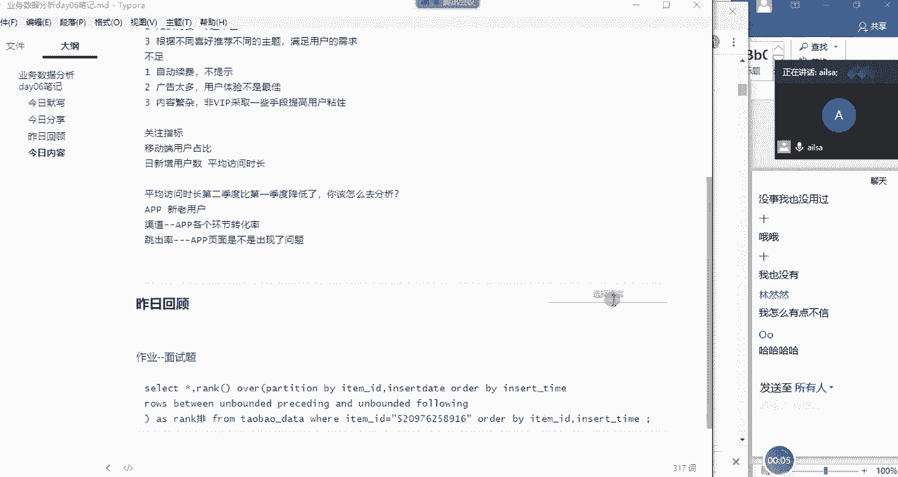

我们想一下昨天我们都讲了什么呀，嗯昨天啊我们是不是讲了一个很重要的知识点，叫开窗函数，对不对啊，我没有讲完，我今天还会再接着讲一讲啊，因为昨天可能有一些人啊，有一些人没有进行。

也就是没有完全的消化吸收啊，我今天再稍微再补充一点，然后再把之前的内容再巩固一下，嗯那我们讲了数据库MYSQL是吧，我们回顾了啊，回顾了库的啊，真增啊，删改查啊，表的增删改查对吧啊，然后我们重点讲了。

就是记录的增删改啊，然后查的话我们是啊讲的非常详细，我们讲了啊，就是单表啊，加多表对吧，那有的时候我们在进行多表查询的时候，我们在进行多表查询的时候，就是我们使用普通的SQL语句哦。

嗯哼啊我们使用普通的SQL语句的话，有的时候会写起来比较麻烦，你比如说你想筛选每个班级，或者是每个每科成绩的一个前两名的时候，我们需要用很多层嵌套才能够实现，那既然这种方式特别麻烦。

我们就可以采用MYSQL当中另外一种方式，也就是叫窗口函数哈，这叫开窗函数，窗口函数啊，然后的话他这种的话就是解决了我们啊，使用其他的一些啊聚合函数带来的一些困扰。

然后就去弥补啊这一这一这一方面的一个知识，也就是说我们使用它，在某些方面会非常非常的高效，所以啊我们介绍了窗口函数，那窗口函数的一个嗯要求是必须是MYSQL，8。0级以后的版本才会有，那之前是没有的啊。

但是如果说面试官问你啊，面试官问你，我们之前我们之前嗯没有哦，这样的一个窗口函数，如果假设啊，现在我的公司的数据库就是5。7啊，就是5。7，然后我让你用窗口函数，你能否给我实现啊，大家该怎么回答。

对于这个问题，同志们，嗯对于这个问题该怎么回答，就是说我现在版本是5。7，但是我还想用串口函数怎么办，跟他聊半天，在现在说话呀，耶怎么不说话了啊，我们对于这样的问题的话，我们对于这样的问题啊。

啊我们对这样的问题的话是可以实现的，但是我们是模拟啊，有点类似于模拟窗口函数来实现的，比较麻烦啊，你可以说啊，你可以说自己只是听说过，别人说可以，但自己没有尝试过就可以了，因为太麻烦了啊。

要模拟参数什么的啊，啊这个的这个就不教大家了啊，也没必要去学那个东西啊，它就是比较复杂一些的啊，那我们讲窗口函数，我们先说它的它的一个呃呃几种用法吧，一个就是使用聚合啊，聚合函数哈。

聚合开窗函数啊主要有什么呢，some对吧，哎sum求和，然后是有哦count计数啊对吧，然后X最大值最小值min啊，这样的一个聚合函数啊，也就是计算的啊，这些函数，然后的话是over啊，Over。

然后是基本上就是如果说是分组的话，我们就写partition by就可以了，pon by一个字段啊，然后如果要排序就是order by o r d r order by，然后如果不需要排序，就不需要写。

看实际一个需求字段就可以了，那这就是我们聚合函数的一种啊写法，大家看是不是也不难，对不对，然后如果说我们是用排名啊，排名函数的话啊，排名函数就是嗯也是可窗口函数哈，那我们用的是rank啊。

就是第一个是用number哈，ROGUNUMBERMBERROGUNUMBER啊，然后是啊rank啊，rank啊，括号，然后还有就是我们的dance啊，d e n s e dance杠rank啊。

RNK啊，Dsank，还有一个until对吧，然后这四种不同的排序方式，然后后面是over o v e r over，然后跟这个是一样的，partition by啊，是我们的分组根据什么什么进行分组。

那后面order by根据什么什么进行一个排序啊，啊这样的一个结果，排名函数我们还讲了一个针对啊，就是其他的我们还讲了一，我们还讲了其他嗯，其他我们讲的是一个lead函数和leg lead。

lead啊和lag啊，这个是什么函数呢，就是它是针对于你对于同两列啊，同一列数据相邻的数据进行一个呃，呃计算的时候相减的操作的时候，这个时候你可以通过lea的函数。

让它们顺序发生一些变化就可以了哈lag啊，然后我们还讲了first啊，first w i r s t first gun value啊。

和啊last杠value这个啊l s st last杠value这个指的是啊，如果说你里面有分组的话，它指的是你分组区域的啊，取第一个值，然后是分组区域的最后一个值啊，在这里的话，在这里的话。

我们上昨天去讲的时候出了点问题，那我今天又仔细的去找了一下资料，而是因为什么呢。

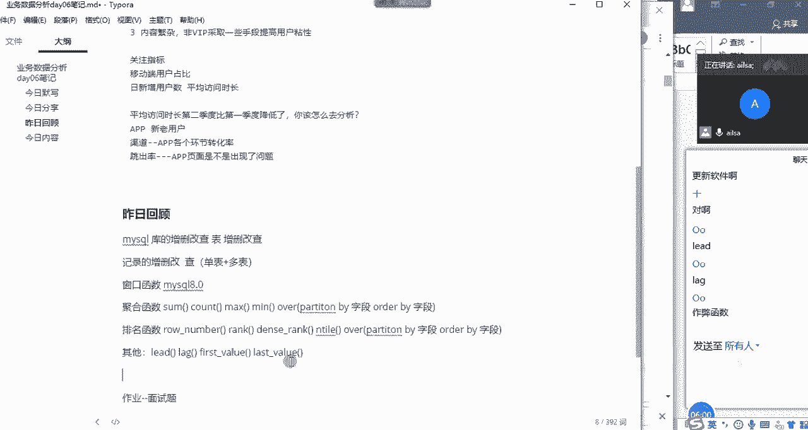

是因为我们在做这个嗯嗯开窗函数的时候。

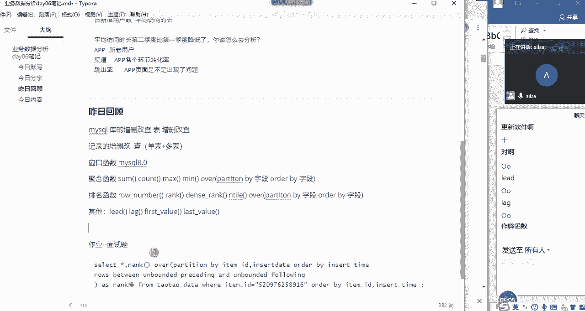

我们少了一个知识点，然后这个知识点叫嗯给大家看一下哈。

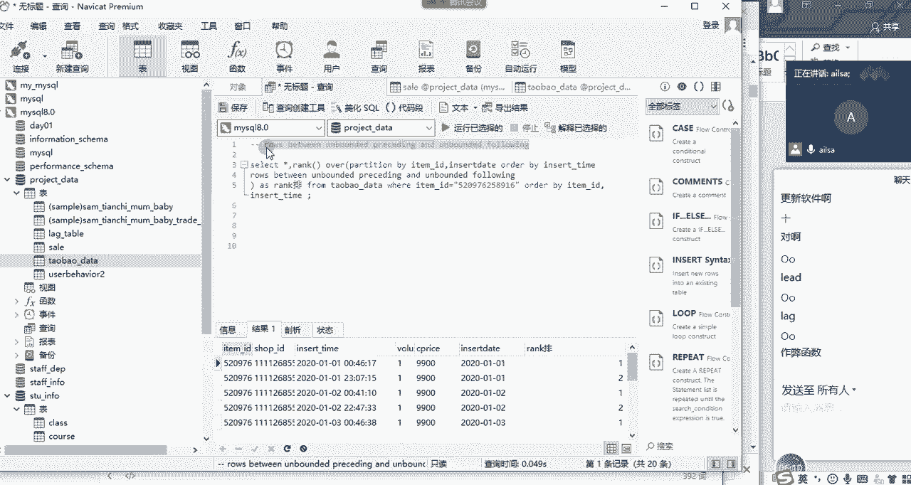

这个知识点叫啊rose between啊，UNBORED和process processing and de啊，And unboded falling，也就是说它可以指定啊，行看到没rose啊。

就是指定的哪些行啊，这个这个这个这个知识点的话，我等一下会进行一个详细的讲解，算是作为开窗函数的一个补充的内容哈，OK啊那我们这是昨日的一个回顾哈。

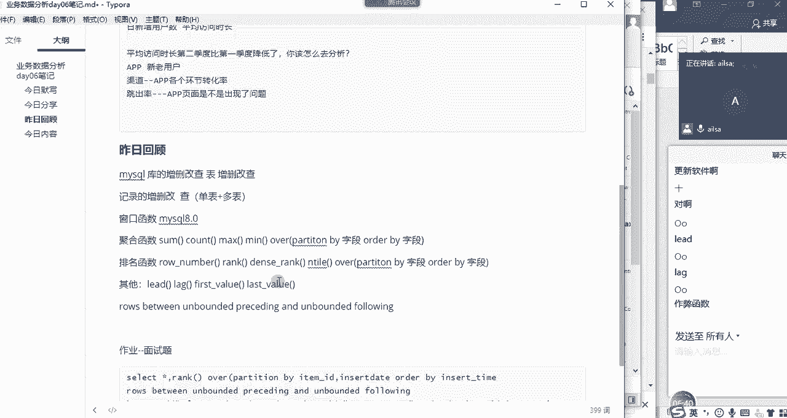

啊我们再来看一下我们今天主要讲什么哈，首先我们会把这个内容先补充一下，然后好今天的内容的话，我们是讲嗯。

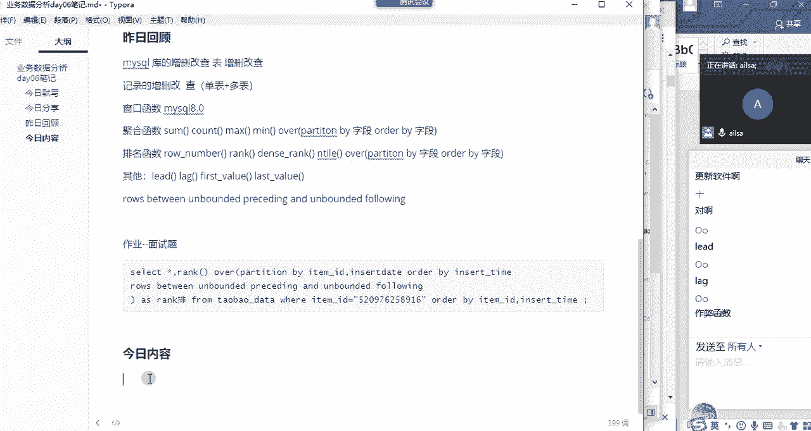

我们是讲统计学的知识哈，我们看啊时间点如果说能讲SSPSS，就讲SSPSS，如果讲不着的话，我们就明天讲。

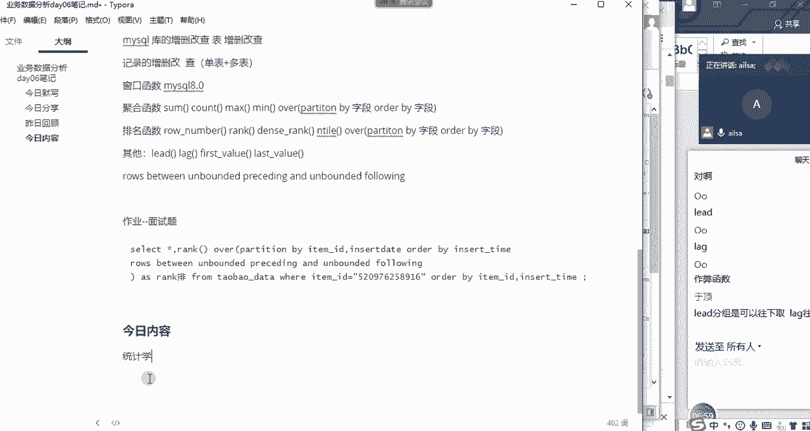

那统计学，我们今天主要我们统计学知识主要讲两大块儿。

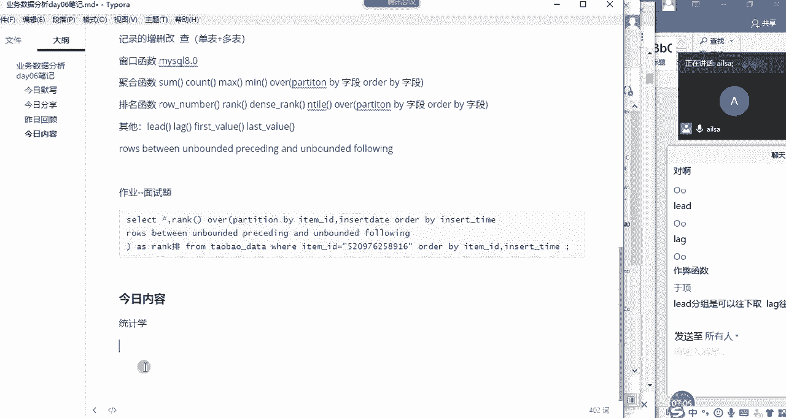

一个是描述统计啊，一个是推断统计啊，那描述统计就是有集中趋势啊，集中趋势和离散趋势啊，还有就是我们的啊分布的形态啊，啊分布的形态，正态分布，偏态分态啊，这样的一个东西推断的话，我们有嗯。

我们有概率分布啊，还有一个抽样分布啊，还有就是我们的参数估计假设检验啊，大家对于这个知识还还记得多少，还记得吗，嗯大学应该都学过啊，甚至有一些东西的话，你比如说概率问题，应该是高中就学过的东西对吧。

我们统计学主要讲这块，然后SPSS的话主要是操作哈。

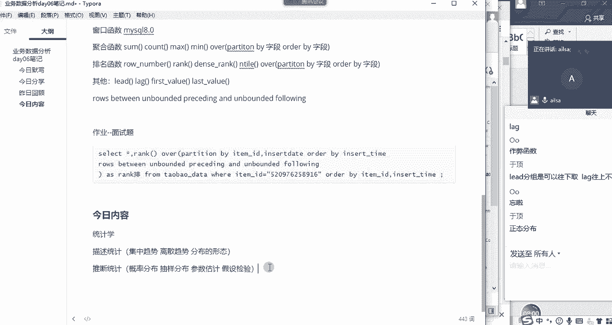

操作界面啊，就记得正态分布了，中心极限定理还记得吗，呵呵SPS我们主要是啊操作啊，页面操作的一些讲解嗯，我们接下来两天的时间能把这些内容讲完，应该就可以了，我们哦还会再介绍。

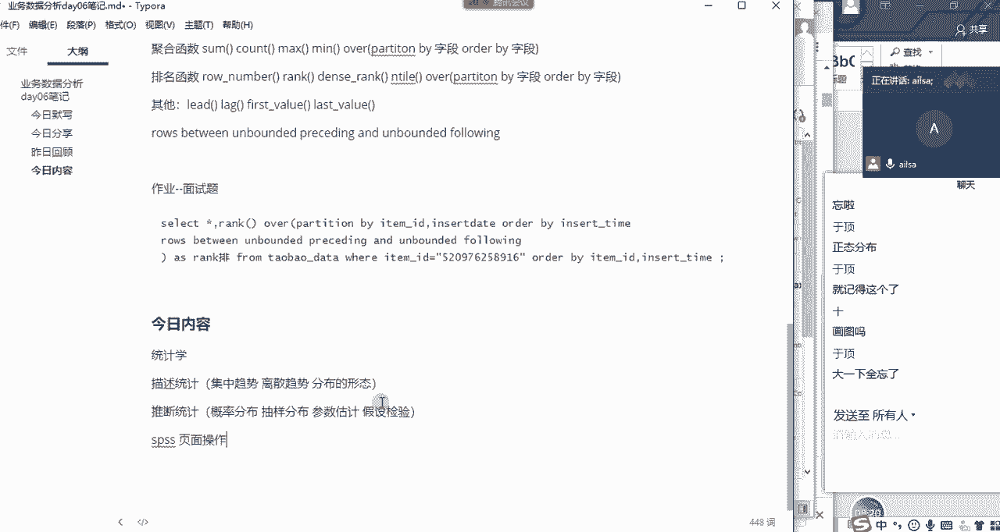

我们到最后会介绍一下啊，方差啊分析模型啊，啊方差分析模型和线性啊，回归啊，分析模型啊，这两个在统计学上的一些啊分析模型啊，啊，这个我们呃，我们我们这两天主要是把这些内容啊，讲完就可以了。

然后后面的话我们端午节是放假的对吧，端午节是放假的，我们应该是放假三天，三天回来之后再再上三天，再上三天，然后我的课就结束了，那后面三天的内容大概就是一个模型啊，然后是那个TABO啊，TABLO啊。

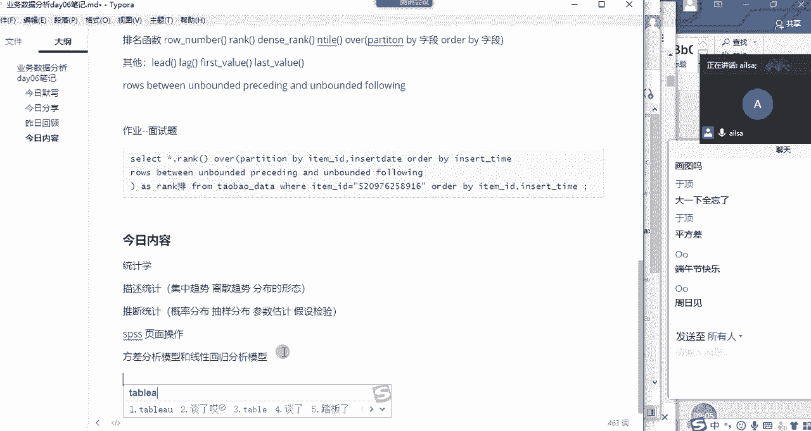

TABLO会讲，然后还有就是我们的啊案例，我会抽一天的时间专门给大家去讲这个案例啊，因为我现在要给你们的时间，给你们充足的时间去做哈，然后你们做完了之后，我再去讲的时候，你们更有感同身受的感觉啊。

这样的话会效果会更好一些，如果我现在讲了，你们听着哎怎么这么简单，我就不想做了啊，那这样其实是不行的哈。

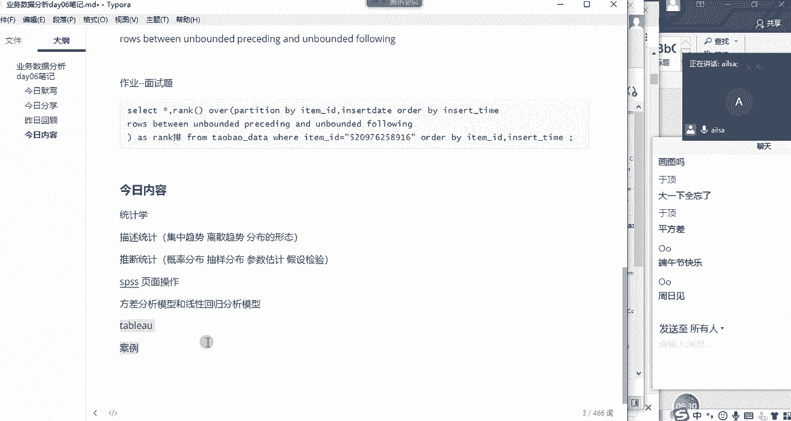

OK那我们今日内容跟大家说明白了哈。