# 强推！这可能是B站最全的【Python金融量化+业务数据分析】系列课程了，保姆级教程，手把手教你学 - P78：04 窗口函数面试题讲解 - python数字游侠 - BV1FFDDYCE2g

OK那我我们就把我们昨天布置的这个面试题，再给大家说一遍啊，我这边只是提示性的说，也就是说我把核心的点给你说一下，该怎么去做的，然后你自己啊，回去之后把整个的一个内容写完啊，这个题一点都不难啊。

我们先看一下整个题目的一个长相吧。

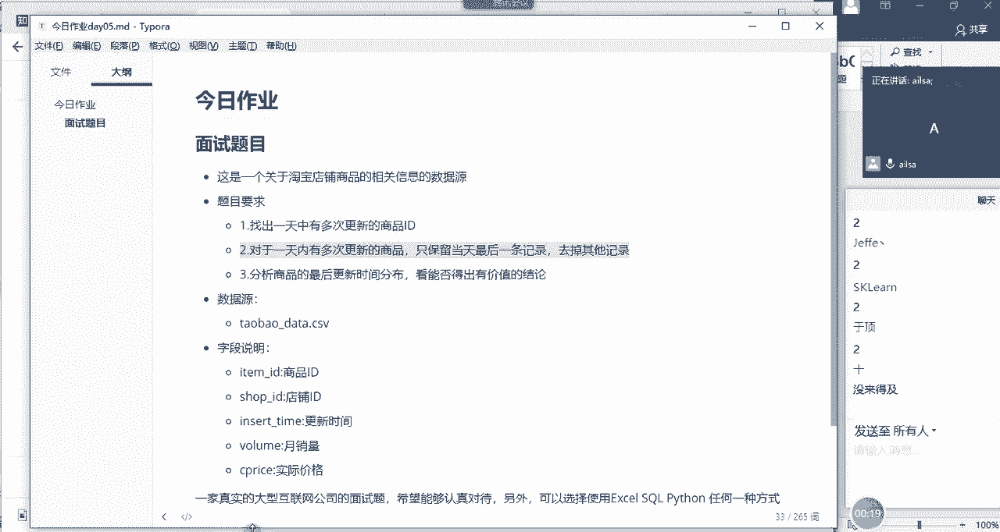

啊就是我们看下数据长什么样哈，好我们看一下数据长什么样，OK他应该是在我们的啊这里面的哈，我把这个数据删了哈，因为这个的话在我的博客当中是有的，select行from啊。

如果现在大家呃呃数据已经进数据库了，可以跟着我啊去练习一下嗯，哎那我们看一下这个数据啊，首先第一个是item id啊，这个呢就是我们的商品编号，第二个是shop id，也就是我们的店铺编号。

那一个店铺肯定有很多个商品，这个是毋庸置疑的，对不对，那第二个是insert time，也就是我们的啊插入的时间，我们可以理解为是更新的时间，那你看它每一天啊，更新的时间都精确到了秒，对不对。

然后后面的话我们就没必要去啊，看了什么是那个叫什么啊，哦follow me啊，这个就不用看了，然后就是价格，然后这啊这这一列要删掉哈，这一列等会我要用的，OK那我们针对啊这样的一个数据啊。

因为它原表应该只有前12345，前五行的数据，我们针对这样的一个需求，要想一个问题，首先啊首先是针对说啊一个商品，一个商品啊，在同一天可能会有多条更新记录啊，我们来查某一条的数据。

因为他这个数据量太大了，大家不好看，那我们查一下哈，查一下其中一条，我这边应该是有有写好的，稍等啊，哎比如说查一下这个啊，呃id为这个的，来来我们select city select xn啊。

From table，淘宝刚data，然后where，von item杠ID啊，等于哎我们查一下这一条记录，然后我们order by order by我们的insert杠time。

唉我们查出来这个之后我们看一下哈，我们看一下整个的一个啊整个的一个结果啊，首先诶这一个商品id，在这一天当中有两条更新记录，是不是有一个零点的，有一个23点的，对不对，那他其实一个就是在这一天当中。

最早的这个时间，一个是最晚的这个时间，那在第二天也是一样，一个零点，一个22点，第三天，第四天我们会发现他每天这这都是一款商品哈，它在每天都会有两条的更新记录，说明啊它就存在多次的一个情况。

现在我们想要实现的一个什么样的效果呢，就是啊就是对于这同一个商品id而言，对于同一天对不对，对于同一天我只要保留这一条数据就可以了，最大的这一条是不是，那对于做同一天来说，我只要保留这个就可以了。

对于这同一天来说，我只要保留这个就可以了，那大家针对这样的一个需求，想一下我们该用哪种方式去实现啊，应该用哪种方式去实现，好同志们来应该怎么去实现二者选其一，选对最大那个呢。

哦我直接提示我们可以直接用窗口函数哈，想一想，你想一下，它既然是对同一天同一天取同一条，取其中一条数据，我们是不是啊相减我为什么要相减呢，它俩相减取差值干嘛呀，就是正的我就取负的，我就不取，是这意思呗。

啊是这意思吗，啊正的话说明它大于它对吧，啊正啊这个这个不用立的哈，这个不用立的，因为我们不用在，我们就想我们就想知道啊，就是哪一个，比如说他有三条数据，还有三条，我们只想只想求一个最大的就行了啊。

如果说啊你要用lead的话，你比如说现在我举一个很简单的例子，你要用lead的话讲啊，我要画一个单独的图哈，啊画一个单独的图啊，比如说你要用lead，假设在同一天当中，你有三条数据。

有三条数据哈啊然后我看一下啊，第一条数据是啊11点的啊，11：30啊，第二条数据啊是12。58啊，50嗯，第三条数据是22。22点，然后你要用lead的话啊，lead是往下取一行。

也就是说12点啊会跑到这里啊，12点稍等啊，这个位置应该是啊，等会会调哈，这12。50啊会到这里啊，然后是22点对吧，然后我们把它挪到这个位置啊，那这个时候哎这个12。5是跑到这里，然后22点跑到这里。

然后你要进行一个相减的话，相当于是我们就假设啊后面的这个减，前面的这个它得出来的是一个正值，那说明它比较大对吧，那他得出来的也是一个正值，说明它比它大，那它俩我选哪个呢，你是不是还得去比较。

难道你让他俩在啊再相减一回，然后再啊再怎么着啊，再用一个lead，然后再把啊22啊，22点放在这里啊，22点放在这里，然后再相减哎，取出来又是正的，那我们最终就取它的值，那如果说你这个。

你这个一同一天的数据特别多的话，你是不是要往后无限制的取很多啊，所以在这里不适合用lead哈，lead主要是啊它主要的一个计算的场景，指的是两个相邻数据之间的一个差值的计算，相隔的时间哎。

到底是多长的时候，我们用力的，那这里啊这啊只想到了，只想了这两个这个两个数据的啊，OKOK呃后来啊于鼎又说是用last value嗯，对用last value我们可以取到最后一个值，是不是。

那呃我们我们就假设哈，现在我们就采用于顶的这种方式，我们用last value看一下怎么去写，首先我们要想我们要对它进行一个分组，对不对啊，那分组的话啊，我们是想在哪哪个组内进行一个进行一个排序。

然后取最后一个值呢，我们是商品id吗，是商品id吗，如果是商品id，我们取last value，比如说我们按insert time进行一个排序，最后一个时间假设是这个。

那我们取得的是就是在整个的分组当中，我们只取到了6号这样的一个，10：47：15这样一个值对吧，那现在并不是啊，现在我们是想取每天的最后一天，那这个时候我们的分组不仅仅是item id了，我们是有两个。

一个是item id，一个是insert time，它前面的这个时间对不对，是不是这个意思，是的话给我扣个一，嗯如果是是的话，那这个时候它是时间日期格式，那我们就要对它进行一个啊前面的日期的提取。

也就是这一部啊，这个是我最后我提取出来的哈，你们的数据里面肯是肯定是没有的，那现在我先把这个啊时间删掉，我给大家去做一下演示哈，我们删掉一列数啊，一列一列字段是out啊，out table填表。

On the table，然后是淘宝淘宝嗯，杠data嗯，然后是drop对吧，D r o p drop，insert gdate对吧，来执行，哦不加杠哈，OK现在我们删除成功了哈。

我们那我们再看一下我们的数据，前面这个就可以了，对你们那肯定是没有，因为我上午我我上午自己填的，Ok，那现在我们是不是想把这个insert time，里面的日期提出来啊，那该怎么提呢，我教大家哈。

首先我们要提这个新的一个字段出来的话，我们肯定要先新增一个字段是吧，那就是out啊，Table out table，然后是淘宝淘宝杠data哈，淘宝杠data，然后是ADD对吧，添加一个字段。

这个字段叫insert杠data好吧，Insert gun data，它是一个日期格式的数据，OK我们修改完了之后，点击运行，OK现在有这个字段了，OK那我们查询一下哈，select啊。

直接看前面就行了，直接看这个执行，OK我们是不是有这样一个字段了哈，那现在我们要对它内容进行添加，添加的话，相当于是我们截取颜色和time里面的，前面的日期的内容，类似于我们excel当中的分裂对吧。

那我该怎么去操作呢，啊这个是用的是日期格式的转换哈啊是我们啊，我们这个是要对这个字段内容进行一个更新，对不对，那应该是update啊，这个更新是没有table的，应该啊update表啊，set啊。

set一个字段，set什么呢，insert杠太对吧，然后它等于啥呢，它等于这个insert time提取一部分值，对不对，那它应该提取的是啊，Data to gun format。

唉就是我们的日期格式化的这样的一个过程，那第一个选择的是日期，那你到底对哪个日期进行一个格式化呀，我们是对insert杠太对吧，然后format指的是你要格式化成什么样啊，哎这个就很简单了。

就是百分号Y大Y，然后杠百分号M小M哈，杠百分号D啊，这样的就是年月日这样的一个格式嘛，对不对，然后我们给他执行一下，看一下，哎，这个时候我就不不需要加where了哈。

因为整个一列我都需要对它进行一个更新，就是我新增的列，所以说我要一次性新增所有内容，OK执行，怎么了，OK执行完了之后，我们再进行查询。

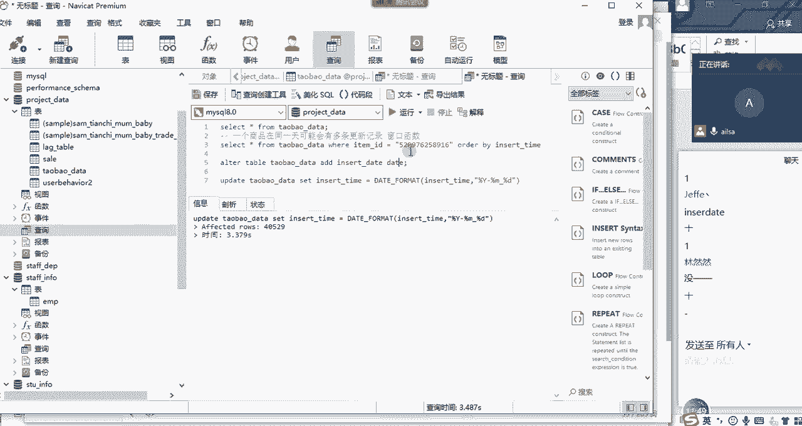

哎，哦稍等我看一下哈，为什么没有值呢，insert刚哎哎呦，我滴妈呀，咋整，我又犯了一个错误，也没有人提示我，这是这是这是银sir的，它哦，这个是应该insert data。

哎不不是insert data，现在已经晚了，现在已经晚了，你看这稍不留神，把我的元素就就弄坏了，那对于这种情况，我们该怎么办，还好我们是做测试哈，之前我们写的时候就是这种更新的操作。

一定要检查检查再检查哈，没关系哈，唉重新导入呗对吧，咱们有原数据啊，我的东西在这里是吧，删掉简单粗暴哈，但是在我们工作当中可不能这么干哈，哎呀我是一个典型的反面教材啊，给大家演示一下。

我们误操作了之后该怎么办啊。

啊当然这个演示也不是不是不对的哈，我们打开我们淘宝刚data啊。

OK没关系没关系，我是在给自己安慰哈，开始，高速地名嗯。

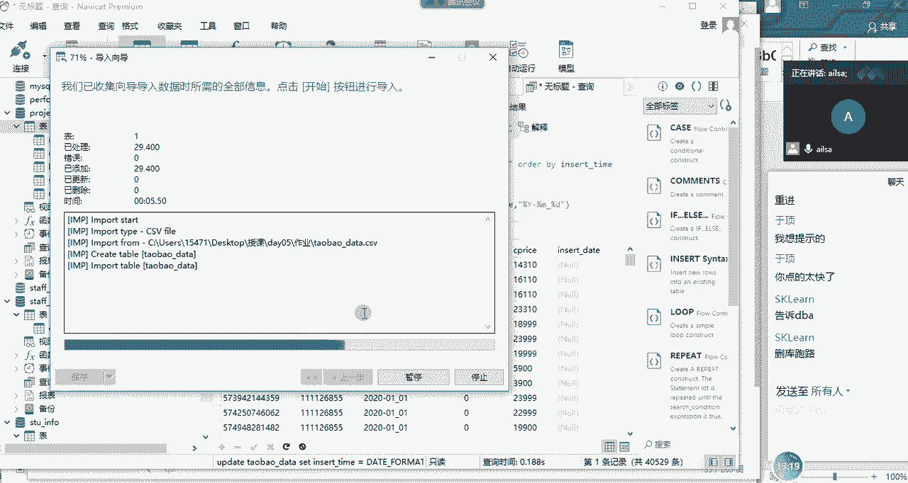

不好意思啊，对更新操作其实挺哎呀，那啥的，OK没有关系，现在我们的表是不是又进来了，好嘞啊，原数据原封不动的都放在了这里啊，很好哈，那接下来我们进行一个啊，进行一个添加字段的操作是吧。

哎我们先添加一个新的字段，Out table，淘宝ADD insert杠data啊，日期格式，现在大家这个内容添加进去没有啊，因为我操作失误了，所以你们应该有时间自己去操作了，啊，语法错误在。

哦table a没进去哦，OK啊可以了哈，然后我们查询一下我们原来的数据，OK没有问题哈，大家跟着我去做哈，大家跟着我去做，因为我现在速度慢了哈，然后update表明set insert杠啊。

杠data哈，我们要修改的是data日期，然后我们是根据什么进行一个更新呢，根据我们的insert time，修改成我们的YMD这样的一个格式对吧，OK现在没有问题了，应该哈没有问题了。

OK我们啊我们执行一下啊，insert杠data，OK我们再看查询一下我们的数据。

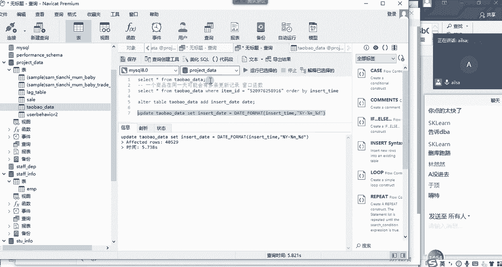

唉，好了对吧，这边就出现了我们所想要的一个结果啊，这就是我们所想的结果，日期啊出来了，那接下来我们要做的操作，我们要做的操作就是嗯，我先把这两个内容发发给你们，应该都好了吧啊都好了哈。

然后接下来我们就在想我们的分组，刚才有说到我们的分组是日期，但是我们又不仅仅是日期，因为我们要建立在一个商品下不同的时间段，它的一个最晚的这个时间点，对不对，那我们的分组其实是两个。

一个是item id，一个是insert time啊，一个是啊啊insert data哈这样的一个内容，然后我们写我们的函数啊，首先唉我们啊采用第一个啊，就是那个于鼎说的last value啊。

这样的一个值我们进行一个计算哈啊select星啊，然后逗号我们直接是last l a s t last gun value，我既然取的是最后一个值，那它的排序应该是从小到大，因为我要取最呃。

就是最最最最最什么啊呃最晚的那个值，然后我们last value取的值是insert time是吧，Insert gtime，然后是over嗯，over partition by分组，我们按什么分组呢。

我们按的是两个，一个叫item杠id，还有一个是我们的insert杠data对吧，如果我们按insert gtime分组的话，它每一个时间点都不一样，所以你分出来的时就不是啊，当天当中的一个组了。

而是每一个都是一个组，所以就没什么意义了哈，然后我们要按什么排序呢，all the by啊，order by insert啊，Insert gun，当然是按照时间进行一个排序，对不对。

OK我们写完了之后嗯，写完了之后，大家想一下，这个时候我需要加对于数据类型的限制吗，我需要加那那一行字吗，什么rose什么的，rose需要吗，好需要的话，给我扣个一，因为它默认的肯定是到当前行，对不对。

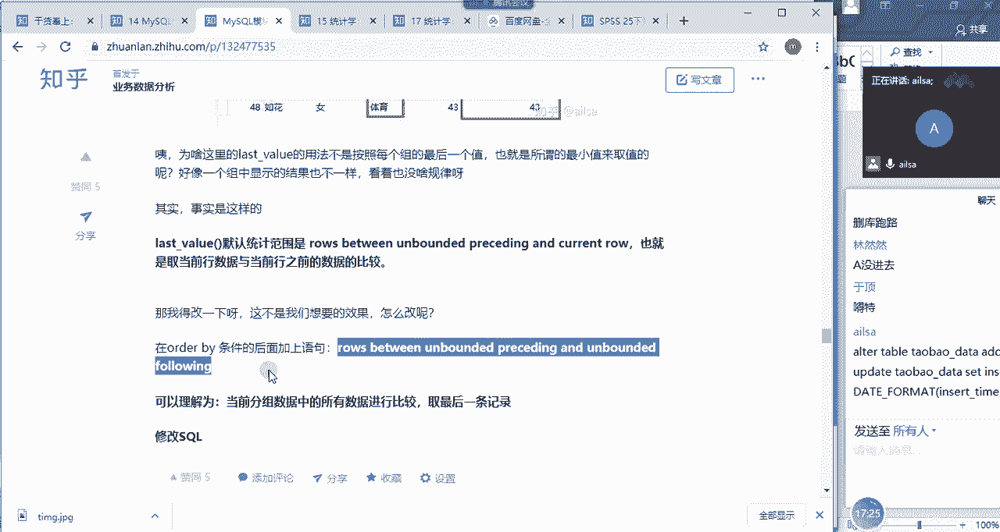

嗯没有人理我哈，需要吗，同志们需不需要，不需要，Last value，不需要吗，行那你说不需要我们就不需要哈，哈as你是建号，你是输入一时代是认同上一个操作还是怎样，as我们的需要是吗。

只要嗯as我们的，取一个新的名字叫嗯，叫我们的最大的时间max gtime，好吧，ma跟time，然后from啊from我们的淘宝杠，Data，没关系哈，我们看一看，我们看一看结果。

需要不然我这这个是查询，查询不需要还原数据哈，OK啊啊你这个啊你你明白过来了哈，我们先看一下，我们先看一下结果哈，看一下结果是什么样子的哦，我看select xing last value over。

我看在哪个地方，Out by，O瓦滴呀，哦这个地方多了个rose，嗯哼哦不加逗号。

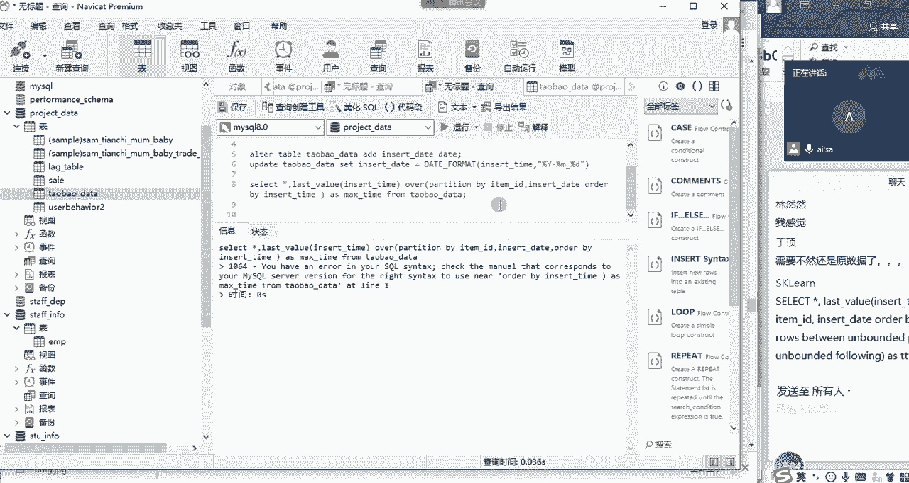

OK啊，好的然后我们接着往下看哈，接着往下看，这些都可以先取消掉哈，哎我们的Mac time，大家看到没有啊，我们我们得按照这个点啊，我们再加上这个条件，因为它数据太多了，我们看不太出来。

所以我们加上这个条件再试试，我们只看一条数据，如果这一条数据是没有问题，那就没有问题来，OK啊我们拉一下啊，这是我们的插入的时间啊，12呃，0。23点，看到我们的Mac time什么，看到没有。

它就没有了，对不对，他都是按照最后一条数据去取的话，那当然截止到当前行，最后一条数据嗯，这大家自己想一下，截止到当前行最后一条数据肯定是他自身啊，对不对，所以说我们这边是需要加的哈，需要加啊。

这个东西好，我们把这个复制过来嗯。

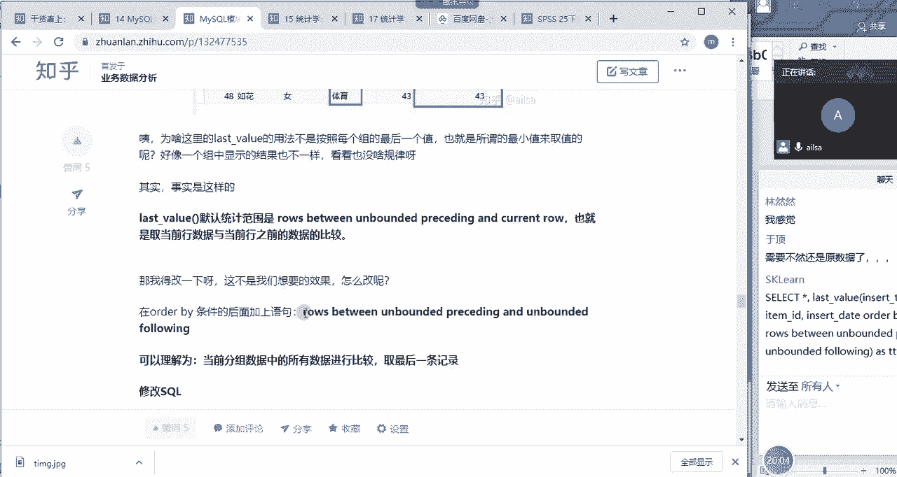

需要给他限定一下，在当前组当中是不受限制的，唉来我们再执行，唉我们可以发现它整个的一个值，都是取到最大了吧对吧，你看零一总共有两个，所以它分组之后它最大值就是23对吧，23。07没有问题，这个是22点。

这个也没有问题，好的，我们做完了这一步操作之后，接下来该怎么操作，你用的是last value还是first value，你用的是last value还是first value。

如果说你的是呃对的的话啊，那你看你的排序啊，你的排序是按降序还是升序，也有可能是因为这个原因哈，我看一下哈，嗯你看你的排序是升序，那应该没有什么问题，哦我看一下我的啊。

Oder by in third time，来我执行一下你的代码哈，嗯如果你要是按降序呃，按降序去排列啊，等会儿啊我们不能绕晕了哈，慢着嗯，别着急，我看一下，我看一下啊，然后预定的代码select星。

Last value，insert time啊，按照我们的整个的一个insert time进行排序，partition by item id啊，Insert data。

order by insert time啊，升序那最大的那个值是last value，OK我们在执行，嗯我们选择我们的条件哈，稍等，你要最好把这个条件写进去，因为量太大了，所以你看不太出来，OK哈啊。

你这边是完全没有效果的哈，没有效果啊，还是错的哈，你看我把这个我把这个条件给大家发一下，大家按照这个条件去走，你看如果说啊我们刚才看到啊，所以说我们这个如果是按照这种形式的话，我们肯定是要加啊。

是要加这个我们指定的整个的一个范围的哈，啊如果是first value的话，我们要取第一个值的时候，我们是按降序排列啊，就是这样去排列，然后我们就可以啊，不用加我们这一串数字了哈。

但是它整个的一个结果是一样的啊，你用的是嗯，稍等哈，我给你看一下你的代码，OK我们来分析一下，我们来分析一下建号的代码，Select xing last value。

Insert time over passing by item id，Uinsert，Data order by insert time，AACAAC是升序的意思，写不写都行啊，写不写都行。

也就是说我默认不写的话，代表就是升序，写了话啊，写也是一样的啊，啊所以说这个跟我那个是一样的好，OK嗯as from，OK这个这个跟我的是一样，没有问题哈，没有问题，大家对于这道题听明白了没有。

现在我们是不是把最大的时间给计算出来了啊，OK那我们接着往下说哈，我们的时间计算出来之后，我们接下来该做什么操作啊，那我问一下这个听明白了没有，听明白，给我扣个一，我看都写出来了啊，同志们，OK啊。

鱼顶吗，领，然后思敏，嗯然然没问题，好的哈，那我们看一下，接下来我们既然把最大的一个时间给找到了，之后，我们的最终目的是不是还是想取啊，前面这些值啊，也就是说你像这一条数据，这个它跟它不对应。

我们就可以选择不要了，对不对，那我们接下来的一个操作，我们如何过滤掉这些我们不想要的值呢，那其实就有一个呃我我这边的一个想法，就是说我直接加一个判断条件，就是他如果跟它相等，我就留下，如果不相等。

我就不要了，是不是，那这个这个时候我们就可以把最大值给过，给过滤出来，然后其他的值给过滤掉就可以了，那我们该怎么实现呢，我们可以把它作为我们的一个子查询，然后我们在这个基础上呢啊做一个子查询。

然后在这个基础上进行一个计算啊，as1吧，嗯然后我们直接是啊select x啊，from这个表啊，然后where什么呢，你这边在VR里面写应该也没有什么问题，就是不用嵌套也行。

但是那个语句应该呃需要把这一串的都写上，所以比较麻烦一些，我就直接嵌套了哈，VR啊，VR我们的呃，我们的max time啊，Mac time等于什么呢。

等于我们的insert i n s e RT insert gun time，是不是就可以了，哎我们试一下哈，我们还是加这个条件哈。

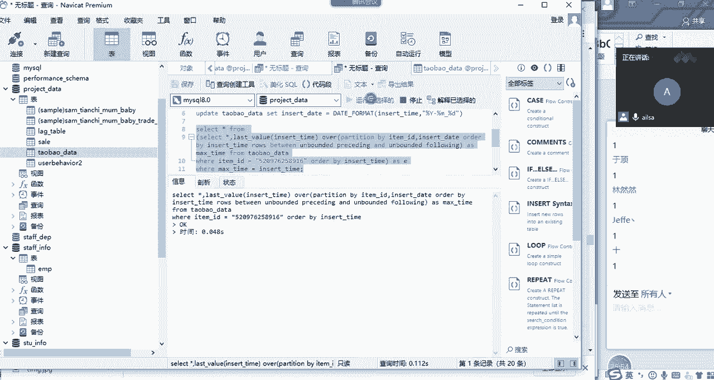

OK唉你看到没有，是不是每一天只有一条数据啦，都是最大的那条数据，那其实相当于我们的数据就已经筛选出来了，筛选出来之后我们就可以进行一个分析了，现在这一部分我们所提取出来的数据，就是我们所想要的结果。

那对于啊买呃数据库里面的数据而言呢，我们如果说只想要其中一部分，我们不可能说把其他数据删掉，我们只能说我们通过过滤啊，添加一些条件，提取出我们想要的数据就可以了啊，这就是我们的数据结果就已经呈现了。

那接下来你可以就进行其他的一些分析，什么什么结果的呈现就可以了，对不对啊，那大家对于这个有什么问题没有没什么问题，给我扣个一，或者是已经实现这样的一个效果了，给我扣个一，同志们有没有达到这样的一个效果。

达到这样的一个效果之后，我们整个代码就已经写完了，嗯那你这边如果说想把它形成一个总的代码，把VR这个条件去掉就可以了啊，这是我们总的一个数据啊，我这边不会把这个代码给大家发的哈，大家自己写。

OK这个就是我们所想要的一个结果了啊，这是我们的第一种方法啊，就是我们使用的是last value，大家想一下还有没有其他方法，嗯last gun value，我们还没有，还有没有其他方法，嗯好的。

First，first刚value，先把这个删掉，嗯好的，就建号写出来了吗，其他人呢，嗯OK哈嗯写出来之后，然后嗯我嗯我跟大家说一下，我们还可以用什么方法哈，我们还可以用max函数，大家想一下啊。

max函数也也是开窗函数啊，我们也可以用啊，最小值我想想啊，mean in不行哈，我们可以用max函数来实现啊，max函数来实现啊，然后我们还可以用什么呢，大家想一想，我们可不可以用排名啊。

啊我们可不可以用啊，我们的呃什么呢，我们的啊，我们的rank就行，我们的rank，因为我们取最大嘛啊，取最大那个值，我们得用rank，然后求出我们的排名，比如说他的排名有什么呢，那排名你在最后一列啊。

你在最后一列加上什么呢，好第一名，第二名，第三名，就是直接按照我们整个的一个insert time，进行一个排名，嗯嗯当然了，你还是要加上这一列的时间，因为你要对它进行一个分组排名嘛，然后四啊对吧。

四啊哎啊四，然后五啊这样的一个结果，然后你加完了之后，你直接取最大的这个排名，如果你是升序的话，直接取最大的一个排名，如果你是降序的话，你直接取第一名就可以了，是不是就实现你所想要的效果了。

那这就是这几种方法啊，然后大家在用的时候哈，大家在写这个的时候啊，大家在写这个的时候，只能啊第一种方法就不要给我演示了哈，第一种方法我们就已经讲过了，Last gun value。

我们就可以选择用max函数或者是rank函数，进行一个排名，然后再进行一个条件的过滤，你会发现说不管用max还是用呃rank，我们用max的话，它出来的还是一个max刚time最大的一个值。

然后再进行一个比较，那我们出rank的时候，它出现的是一个排名123456，我们取你如果是降序的话，我们就取第一名，如果是升序的话，我们就取最后一名对吧，然后进行一个条件的一个筛选啊。

就这样的一个结果啊，流程是一模一样的哈，那大家对于这个题啊，就是我们这道题我提示的关键信息，听明白了没有，听明白，给我扣个一，然后接下来你们今天要把这个做完哈。

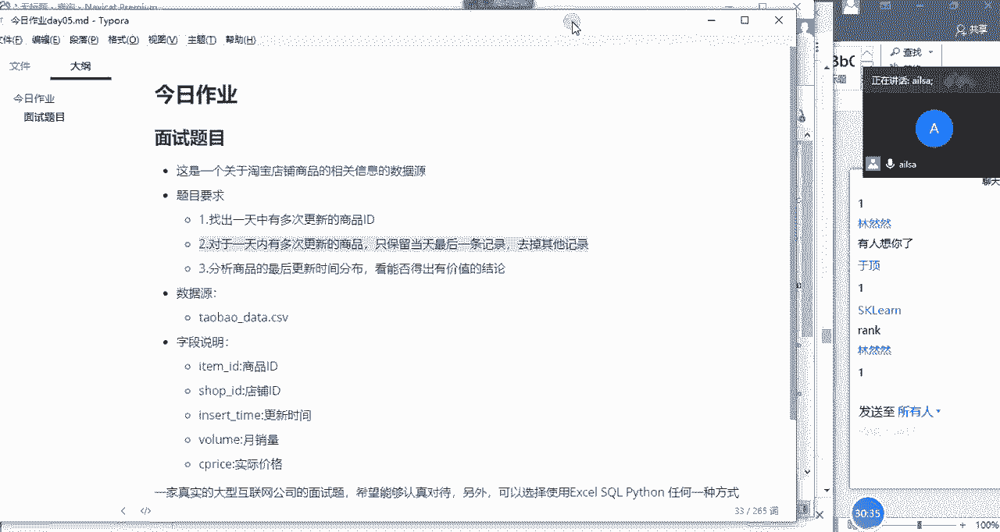

啊然后包括你要告诉我，它整个的一个呃有什么规律，它整个的一个更新，最后的时间分布有什么规律啊。

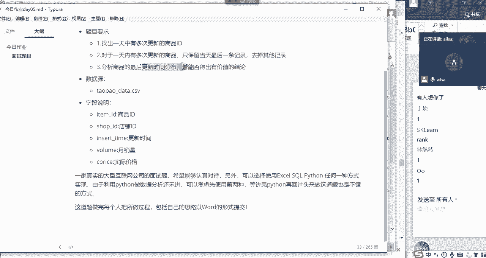

能够得出什么有价值的结论啊，我已经把核心的技术点给大家讲了哈，啊因为我们昨天讲的窗口函数，它刚好用到了哈。

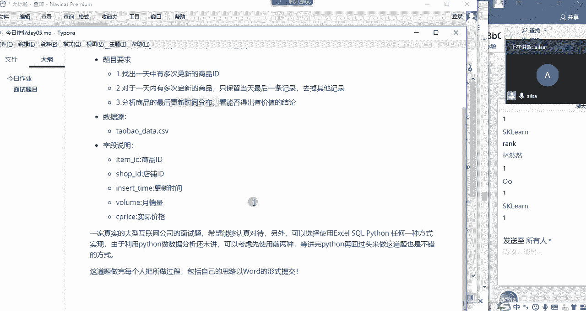

用到了啊这样的一个结果，然后另外大家也要想一想，我们用excel该怎么去实现，excel也是可以实现的，因为它这个无非就是查重嘛对吧。

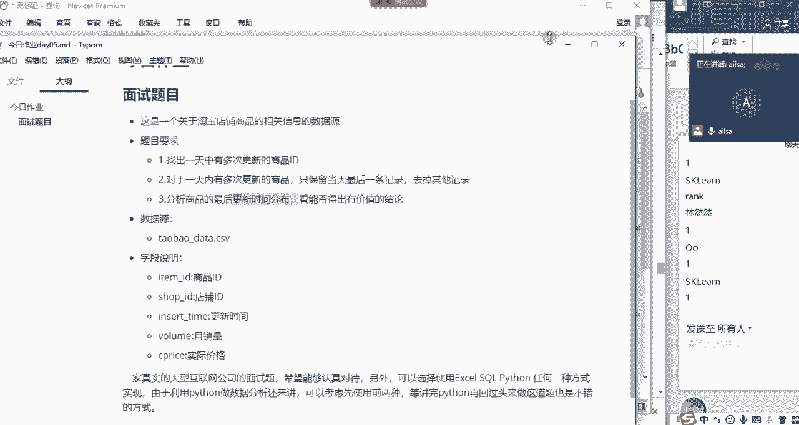

是不是去虫啊，那我们的excel其实讲了驱虫了，对不对啊，那你就是想一想，我驱虫的时候该怎么指定最大的那个值，而不是我随便去一条就行了啊，这样的一个结果。

