# 强推！这可能是B站最全的【Python金融量化+业务数据分析】系列课程了，保姆级教程，手把手教你学 - P79：05 描述统计 - python数字游侠 - BV1FFDDYCE2g

好啦，同学们嗯我们讲啊，我们讲统计学的知识，首先啊我们先讲描述统计好的内容啊，嗯我在讲课之前呢，先问一下大家，我们在高中大学学的统计学知识，还都记得多少啊，你想到哪些名词都可以打出来。

我看看大家的一个水平如何，嗯看到统计学能想到什么，还给老师了，老师也没敢接呀，老师说我不要，都有啥描述统计的概念，描述统计的一个知识点，内容还能想到多少，面熟哈哈，全忘了是吗，好的OK啊。

那我们先看一下啊，我们讲统计学都介绍哪些东西，首先呢我们先介绍一下概念哈，就是什么是统计学，然后什么是描述统计，什么是推断统计，然后以及我们统计在统计学上的一个研究的，一个步骤有哪些，最后呢。

我们今天主要的主题是介绍描述统计的内容，唉那我们先看概念哈，嗯那在讲这个概念之前呢，啊我就是课前小小热身哈，也叫小小安利哈，就是说哎我们在学统计学的之后，大家都觉得太过于理论化。

或者是说觉得他太枯燥了啊，没什么意思，那其实呢就是说嗯，统计学在我们的生活当中也是随处可见的啊，因为它是呃源于生活，但是又高于高于生活啊这样的一个理论知识，你比如说我们在生活当中或者在工工作当中。

经常会被这样的一个啊新闻所吓到哈，今年的平均工资啊，嗯平均工资是多少多少多少，你你一听完了，你说这感觉离自己差得好远啊，特别是特别是他们有时候会说在某一个城市，它的最低工资或者是平均工资是多少。

然后最后啊发布完这个新闻了之后，然后人这个播放新闻的呃，新闻的人就会说哎你的平均工资啊，你拖平均工资的后腿了吗，啊对会这这样的一个这样的一个小疑问哈，啊其实啊这个平均工资啊。

他也不一定说真的是平均工资哈，他有可能中间的一个差异性很大的时候，它并不是特别准确啊，你比如说有人说北京it的平均工资1万6，那你说在北京干了10年左右的，他们的工资啊，it行业。

他们工资达到56万或者达到十来万的时候，他整个就会拉高啊这个行业的一个工资了，嗯啊前腿都追不上哈，对我们可能啊因为这样的一个数据，然后让我们觉得哦，自己离这个标准好远好远好远，其实啊。

我们也不一定会认为说这个数据就是对的，因为大家经常使用平均值来去展示一些数据啊，啊，但是如果说对于一些啊差异性很大的数据而言，也就是说它整个的一个区间范围很大的时候啊。

比如说它这个区间范围很大，然后从100假设哈从100到10万不等的时候，它中间这个均值的话，代表代表的代表性就不是那么的强啊。

所以说我们在日常的生活当中，然后听到一些新闻啊，或者看到一些报道，然后他们如果运用了统计学的一些知识的时候，我们要具有怀疑的态度哈，我们不要对我们不要太过于相信啊，他们所统计出来的数据，大家都知道。

统计学这个东西，它既可以给人普及知识，也可以去啊撒谎哈啊，有很多啊，很多人就用统计学的知识巧妙地，然后去得出一些啊看似不可思议的全新的结论，实则的话是没有任何意义的哈，啊这个大家一定要明白。

我们在生活当中看到一些东西并不是，真正或者说并不全是啊准确无误的，严谨的等等，这些他们也不是专业的统计分析人员，而且即使是专业的统计分析人员，他们也不一定说得出来的结论都是啊，都是非常具有实践意义的。

有可能会具有统计学意义，但不一定具有啊具有实实际啊实际的意义，这样子看你们都在聊啥，我和马云的平均工资哈啊甘肃这边普遍非常少，3000正常，我们这边来签343千好啊，这个啊因为二三线城市的话。

稍微他们相比较而言，薪资就比较低低了啊，这个很正常啊，那我们看一下统计学的一些理论知识哈，我们先简单的引入一下哈，统计学它是什么呢，就是搜集啊收集处理分析解释数据，并从数据中得出结论的科学。

它又是一门科学，对然后我们我们是做数据分析的，所以说我们需要对数据进行一个啊进行一个呃，从呃数据内部发掘一些有价值的信息，然后运用我们的分析方法和分析工具，然后得出有效的一个结论。

那这个统计学在里面扮演什么角色呢，他就是基于我们的数据，然后然后通过科学，或者通过呃统计学方面的一个计算的价值，然后去帮助我们得出更具备啊说服力的，这样的一个结论的这样的一个过程哈。

那我们统计学呢它分两大模块，第一个就是描述统计，第二个是推断统计，描述统计就很简单啦，它就是对于整体数据的啊，就是对于数据进行一个总体特征的概述，比如说好比如说哈，现在我给大家提问一个问题啊。

你们来回答哈，比如说哎我给了你一张啊，咱们班啊，咱们班啊，上一次假设上一次你们进行了考试，给了你，你上一次咱们班考试的成绩，然后我想问你一下，比如说呃我是呃，我是你的一个隔壁班的朋友，然后我就会问你啊。

问大家说你们班嗯，你们班这次考试成绩如何呀，你现在是有你手里面所有的啊，全班所有人的成绩，你该怎么去回答，你们班这次考试成绩如何，你该怎么去回答，你想一想假设啊，因为这个这个题目，其实因为成绩这个东西。

贯穿了我们整个的一个上学的生涯，所以说你们面对这个问题应该是非常啊，非常知道该怎么去回答的，平均分看分布，OK平分最高分啊，嗯嗯那基本上我们再去回答这个问题的时候，就会说嗯就会说什么呢。

比如说他问你们班最近啊，这这次考试成绩怎么样啊，你说哎呀我们最高分考了99分呢啊，贼厉害啊，对，然后他说那那整体情况呢啊，整体情况大概平均分是78左右，那你的呢哎那你说我这边考了86啊。

一般般吧啊怎么怎么着，然后如果说是那种哦，还有就是我们上高中初中那种啊，全校排名的，然后我们就会说一下名次，而它整个居于啊，就是全校这十个班级当中啊，排第几等等这些对吧啊呵呵。

我这边差一点及格哈哈对它一般是先问总体，然后再关心到啊，关系到个人的一个身上，那我们从这个案例当中就会发现什么呢，我们在在对于很多个数据，或者是你看你一个班的所有的成绩单的话，它是很多个人的数据。

对不对，那我们不可能告诉他每一个人每一个人唉，就像读数据一样，每一个人每一个人考了多少分，我们只能告诉他一个大致的一个呃内容，那也就是说平均分哎，呃排名类似于这样的总体数据，那这个平均分而言呢。

它就是对于啊我们整个的一个数据，进行一个总体特征的一个概述，也就是说这个指标我们可以理解为这个指标，可以代表该数据的一个集中趋势的趋向啊，平均值是集中趋势的一个趋向啊，就是啊我们所有的数据都往这个呃。

78分靠啊，就这样的一个水平啊，这就是我们的描述统计，然后是研究数据搜集处理，汇总图表描述概括与分析的等统计方法，其实它就是对于数据进行总体特征的描述，哎那推断统计跟描述统计其实不一样了。

它比描述统计更高一个层次，为什么这么说呢，其实我们在做统计学方面的一个研究的时候哈，说的就很高大上了哈，统计学方面的一个研究的时候，我们这往往在很多种情况下，我们的研究对象的数据啊总体是非常大的。

你比如说啊。

你比如说你现在给了你一个研究的主题，你想啊统计一下啊，统计研究哈，你想统计一下北京市啊，北京市，然后是男性啊，啊男性啊啊比如说20~30岁啊，之间是否有哦房贷压力，假设哈，假设你这样的一个呃。

统计研究的主题是北京市啊，北京市是你的范围，然后男性啊是在20岁到30之间的男性，然后就是是否有房贷的压力，如果你想统计这样的一个主题的话，你要把北京市所有的男性啊，基于这个年龄段的。

然后把他们都数据都调出来，然后去分别的访问他们是否有房呃，呃还房贷的一个压力，那这样的一个工作量其实特别大，而且说这个北京市的人口，它并不是说啊并不是说是死的，它是活的。

就是说呃有人口流动流动的这样的一个现象。

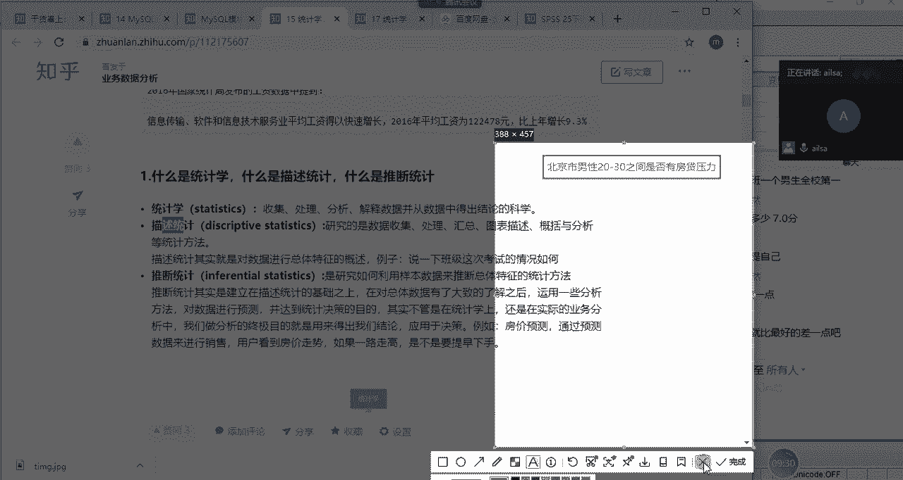

那我们呃对于总体数据而言的话，我们整个的总体数据都是在波动的，我们没办法去统一，那往往在这种情况下，或者是说我们在进行这样的一个统计，主题的研究的时候，我们一般情况下都是使用的什么呀。

对我们都是实行的抽样啊。

什么意思呢，就是说啊我对于啊这个北京市啊，北京市啊，男性哈，男性这样的一个人群，我随机抽取哈，一定是随机抽取哈，随机抽取，比如说随机抽取取100个人啊，对这100个人诶，这这样的一个目标。

我就可以实现对这100个人进行一个调查啊，然后呃然后访问，然后计算他们的一个是否否有额房贷压力，好房贷压力这样的一个结果我们统计出来之后，哎我们这个样本数据假设哈，假设我们的样本数据统计出来之后。

百分比啊有30%的人是有额房贷压力的，那我们就可以去大胆地推测啊，大胆的推测啊，总体有可能也是这样的啊，通过样本数据去推测总体的一个呃结果。

这样的一个过程就是我们的啊推断统计，什么叫推断，就是猜的意思呗，但是你要猜的话得是具有合理性，它就是研究如何利用样本数据来推断，总体特征的统计方法，这也是我们在进行统计研究的过程中啊。

就是基本上都是采用的这种方法哈，基本上都是采用这种方法，除非说啊你的数据源真的是包含了所有的内容，你才会使用总体的数据进行一个哦，哦进行一个分析啊，这样的一个过程，那我们再说回到这两个之间的一个关系啊。

推断统计就是建立在描述统计的基础之上，然后对总体数据有了大致的了解之后，运用一些分析方法对数据进行预测，并达到统计决策的目的啊，是这样的一个过程哈，那我们啊统计决策不仅是用来用做做，用作统计研究。

还可以用来解决我们实际的业务问题，我们的业务问题当中，也会融入一些统计学的知识，然后把我们的统计的整个的一个分析的结果，更具有客观的依据和理论的一个啊，需要啊这样的一个过程，统计学呢其实啊其实怎么说。

就是在有一些公司当中，可能会主要用到的是一些模型啊，统计学会用到一些统计学的模型，进行一些呃预测和使用这样的过程，但是会在一些企业当中，基本上也就是用到一些那相关的指标，你比如说描述统计一些指标。

然后应用到实际的分析的过程当中，是这个意思哈，好所以说我们学习统计学的话，对于呃整个的一个分析的过程，还是有很大的帮助的，这是第一个原因，我们要学的这个东西，然后第二个原因的话是。

因为啊我们在呃就是面试的环节的话，他们会考察啊，就是你的特别是刚毕业的大学生哈，他们会考察一下你的统计学的知识啊，理论基础是否扎实，然后以便说，如果说以后要做统计分析模型相关的啊，工作内容的时候。

你能够上任啊，你能够胜任这样的一个原因哈，好在北京挣钱，在二三线城市买房确实是这样啊，那我们看一下统计学的两大模块，我们主要讲哪些内容，首先描述统计的话，我们会分三种类型。

第一个就是它的集中趋势的一个讲解，第二个是离散趋势，第三个是分布形状，那集中趋势的话，我们会讲均均数啊，中位数和众数，离散趋势的话，我们会讲方差，标准差和四分位差分布的形状的话，我们会讲偏度和峰度。

那统计推断呢我们主要分的是概率分布，抽样分布，参数估计和假设检验，概率分布呢，我们会讲离散型的随机变量，和连续型的随机变量，它们分别对应的二项分布和正态分布，抽样分布的话。

我们会主要介绍的是中心极限定理，以及它所对应的T分布，然后参数估计的话，我们会讲一下点估计和区间估计，然后假设检验我们会检验，讲一下Z检验和T检验啊，这样的一个过程，然后预测类的话会有相关分析。

回归分析，方差分析啊这样的一个内容嗯，好这就是我们讲统计学大概啊覆盖的一些内容，是不是好熟悉啊，你们之前上课都讲过，所以说啊我在讲的过程当中，希望大家能够回忆起，你们当时在课上所学的知识哈。

好那我们先看第一个啊，问题就是统计研究的步骤，这个大概了解一下就可以了哈，就是说我们在统计学上，我们现在啊上升到理论层面了，就是我们先不说我们的实际的业务层，如果你在统计研究的过程当中。

我们应该有以下哪些步骤呢，就是我们首先对于统计研究的话，我们得有自己的一个主题啊，也就是我们在讲数据分析的过程当中，我们得有一个我们自己的一个需求啊，是一样的，我们要设计我们的主题啊，要明确研究的目的。

就是你此次研究的呃中心啊，中心的最终的目的是什么，然后提出假设，然后明确明确你的总体范围，确立啊，观察的指标控制研究中的偏移，给出具体的研究方案啊，这也太官方了哈，你就知道第一第一步啊要设计啊。

整整个的一个过程，然后第二步设计好了之后，思路有了之后，然后你开始进行一个搜集搜搜集数据，然后数据库啊，问卷啊啊，我们的统计研究，很大一部分数据是来源于问卷哈啊，就是问卷调查，然后研究一下数据库啊。

excel啊这样的一个数据的收集，然后接受数据的清啊，清洗我们叫整理啊，就是一定要把数据清洗干净，清洗干净了，你才能得出正确的结论，然后是给它洗澡吗，是啊把它洗干净了，你在做分析的时候。

你才具备一定的价值和意义，不然的话它里面有很多呃，杂乱或者是说不干净的数据在里面的话，那就不行，OK我们下面就是分析哈，分析的话就是统计描述，我们先啊对总体的特征啊进行一个呈现。

然后我们还要进行一个统计推断，从从样本啊，因为我们这个研究的数据肯定是样本数据，从样本信息Y到Y推到总体，然后然后呢我们还要去估计啊，它整个的一个总体所在特征的一个范围。

因为我们如果说得出来的样本的均值，直接定义为总体的均值的话，太过于武断了，那我们就定义它总体的均值在哪个范围，这叫参数估计，那定义好这个范围之后呢，我们还要去假设检验一下它是否是啊正确的。

这样的一个过程啊，就是我们在统计学上的一个研究的步骤啊，舒肤佳都用上了哈，这个简单了解就可以哈，那我们啊接下来再看一个例子哈，就是说诶我们有一个呃就是比如说有一个工厂，那这个工厂呢他每天啊。

他每天会有一个数据记录了啊，记录了某一个零件A哈，记录了某一个配件A在每天的一个领用量，什么意思呢，就是说啊他这个呃坏了，比如说某个地区是一个维修服务所啊，这样的一个工作场景。

然后他呃如果这个东西这个配件坏了呢，他就要就去领，然后他每天领的一个量呢在这里去计算了，然后我们就想我们就想分析一下，就是说我应该每天准备多少个这样的一个配件，来能够满足它整个的一个利用量。

如果说我准备的太多，会占用库存，如果说我准备的太少，那就不满足他的需求，就会造成用户体验不好，所以说我要定义出来一个比较好的，这样的一个呃，是这样的一个数量，然后这样的一个存储啊，存储量你既满足需求。

又不占用我的我的一个库存啊，因为我的仓库也是要花钱的，对不对啊，这样的一个结果，那我这个数据应该大家没有哈，我把这个数据发给大家，然后大家可以跟着我啊一步步去操作啊，你们现在应该还操作不了啊。

你们没有那个呃安装SPSS，我们下午再说哈，OK没有关系哈，这样的一个数据，现在我有了这样的一个数据之后，然后我想看一下哎，我想这个看一下这个数据目前是什么状态，大家想一下，那这个数据我们打开哈啊。

这个数据代表的是这是当天的一个领用量，这个呢是当天的一个零用量，每天不同的一个领用量，我想看一下它每一个不同的数量，所占的个数是多少，比如说呃领用领用两个的啊，有多少次连用三个的。

有多少次连用十个的有多少次，我想看一下它整个的一个分布，那这样的结果的话，其实就是说我们要绘制一个直方图，来看一下它的呃领用量，在啊，不同的数量上是怎么来进行一个分布分布的啊。

然后这里的话我嗯我是用的SPS来做的哈，啊，大家看一下是不是跟跟你们下载的长得差不多，那是不是跟excel长得也挺像的啊，表格啊这样的一个结果哈，还用破解哈，没关系，你们可以现在用不着啊。

看我演示就可以了，我主要是想给大家展示这样的一个结果，OK现在我绘制这样的一个直方图，我们点击确定哈，唉大家看一下，这个就是我每天的一个零件的流连，用量的一个直方图的展示，这下面的是零的次数啊。

从零次开始到100次啊，到80次应该是到80次都有这样的一个结果，我们会发现说啊其实在十次左右啊，十次左右的时候，这个地方零容量是最大的，也就是说P呃，就是有很多天或者说有很多次啊，零的为十次的。

这样的频率占的是非常非常高的，那我们从整个的一个结果上来去看的时候，其实我们第一眼看到的是什么呀，同志们，我们第一眼看到的是什么呀，我们第一眼是不是看到它整个的一个中心位啊，对不对。

也就是说它这边所有的值，对所有的值都往哪个地方去趋向于最高，那在这个最高的这个地方，也就是说它这个数据啊，就是占比很大的这个位置，那其它就是一个集中趋势的一个度量，接下来我们会看一下前后的区间。

也就是说它是从0~8是不等的，这个就是它的一个离散程度的一个度量，对不对，然后我们再看它整个的一个风度啊，它的到底是尖峰还是缓风啊，这样的一个结果，也就是说我们对于一组数据而言。

我们一般情况下考察的也就三个方面啊，哪三个方面呢，就是啊就是我们的啊描述统计哈，就是我们的集中趋势，离散趋势和分布的形态是不是海风啊，没有海风哈，就是风度和偏多哈啊啊OK哈。

那这就是我们三个主要表达的一个核心点，就是我们看到数据之后，我们首先看它往哪个方向去集中，然后再看它整个的离散程度是什么样子的啊，然后再看一下它它整个风度啊，是啊是尖峰还是缓风这样的一个效果啊。

那就是这三个方面，那既然我们第一眼看到数据啊，就看到这么多东西的话，那我们描述统计，也就是讲这么多东西的集中趋势，离散趋势和分布的形态，那我们先看集中趋势，OK我们先看集中趋势。

集中趋势指的是某一组数据，它往哪个方向去集中啊，它就是啊大家大家都会，大家都往这个方向去靠啊，就是要集中趋势啊，那对于一组数据而言，我们考察集中趋势的最常用的就是我们的均值，对吧呵，就是我们的均值哈。

均数啊其实就是反映我们集中啊，一组数据在数列上的一个平均水平，它既然是平均水平，他肯定是往中间去集中的，对不对啊，那这是第一个叫均数，大家都应该会计算吧，啊就我们总体均数和样本均数。

总体均数指的是我们的啊，我们的整个的一个数据量是代表总体的啊，但它就是谬，然后样本就是的话就是我们的X8啊，这样的一个结果，大家对于均数应该了解的比较清楚吧，如果没有问题，给我扣个一均数on。

OK哈啊相信大家都了解哈，这个就是日常的一个东西，但是我们对于均数而言的话，它有它的优点和缺点，它的优点是什么呢，高度浓缩了数据的精华，因为它代表的平均水平嘛，使大量的测观测数据。

变成一个很具有代表性的数值啊，嗯对吧，那这是第一个啊好处，而且它比较敏感，数据任何一个值发生变化，均数都会随之改变，因为它的计算方式是所有的数加和，除以它的个数，所以说只要中间有任何一个数发生变化。

它就会变化对吧，所以第二个特点就是它比较熟知，大家喜欢用，然后便于比较和传播，那它的缺点是什么呢，大家想一想，大家大家想一想，就是看缺点，第一个就是大锅饭，就是把各个观测的数据之间的差异性给掩盖了。

因为它只显示了平均数，第二个叫它受极端值的影响很大，也就是说这个数如果说极端值比较明显的话，那它这个数就不具有代表意义了，为什么这么说呢，来看一个例子哈，我还记得之前的时候嗯，就是啊就是马云哈。

他还就在就是在一个平台上说，他对钱啊不感兴趣哈，对钱不感兴趣，说从来都没有碰过钱，然后就听了还挺气人的哈啊那我们说到钱，那我们就说到工资对吧，哎工资比如说现在有1234，有四个人的工资啊。

然后张三是3000，李四是4000，王五是5000，然后马云呢是4万啊，假设马云是4万哈，他应该不止这些哈，我们只是举一个简单的例子哈，那我们用平均工资代表的是这组数据当中的，一个平均水平，对不对。

哎我们一平均发现大家的平均工资是1万3诶，这么一看感觉还不错哈，比如说是在啊啊北京啊这样的一个城市，工资1万3啊，也算过得去了，咱也不说高，也不说低对吧啊，能养活自己是完全没有问题的，还不错。

但是你仔细回过头来一想，这个张三李四王五，他们的工资都在5000以下，对不对，唉马云的工资在4万，你这么一平均，你跟人说啊，马云所在的团队平均工资是1万3人，马云可能现在就不高兴了，怎么着啊。

我一才1万3的工资，然后人张三也不高兴了，我才3000块钱工资，怎么就平均是1万3了，你这个数据有问题吧，对不对啊，啊是吧啊，所以说啊那对于这个平均工资而言，它既不能代表这些比较低的人的工资。

也不能代表这些比较高的一个工资，对不对，那他这个平均工资就没有什么意义，那为什么会出现这种情况呢，就是因为这个4万呢，它的它是属于极端值，也就是说它跟其他的最小值相相差的太大了。

所以说它呃由于平均值受到极端值的影响，它整体拉高了这个值，造成了这个值不具有代表意义，那面对这种情况，我们再用平均值就不太好了，我们可以采取什么值啊，我们可以采取中位数来进行计算，那什么是中位数呢。

来中位数啊，它其实特别简单哈，取一个最大，取一个最小，OK也可以哈，我们看一下中位数啊，从字面意思去理解的话，它就是位于中间那个数，看我画的头，看看我画的图有多丑啊，对它就是位于中间的这个数哈。

那呃那我首先啊，我们知道它是位于中间的这个数，但是前提是我们需要先对它进行一个排序，也就是从小到大进行一个排序，位于中间的这个数我们叫中位数，如果是奇数的话，就取这个数就行了，如果是偶数呢。

你比如说你中间这个数不对呀，它取不到，对不对，那我们就可以把中间这两个数加和除以二，得出我们的中位数就可以了啊，这么做就可以了，那我们再回到这道题当中，既然你说你使用平均值不合适。

那你使用中位数就合适吗，你看12334那位于中间的是4000和5000，他俩一加是9000，9000÷2是4500，4500这样的一个平均工资，其实至少它能够代表前三个了，对不对，它能够代表前三个。

那最后一个马云的他完全就可以不用代表了啊，4500这个值它确实是位于啊，就是这一组数字中的一个，中间的这样的一个位置啊，期待一个最高分，去掉一个最低分，嗯可以，但是这个例子就比较极端了哈。

因为如果说在我们的实际的分析的过程当中，这个4万如果差异性特别大哈，如果差异性特别大，我们可以完全把它当做异常值给它去掉，唉就是你们所谓的去掉一个最高分啊，就是可以把它当做异常值。

异常值这个异常值是怎么来定义的呢，就是说你加上它之后，它会对你的整个的分析结果，产生一个很大的影响的时候，你就需要把它去掉了，如果说它影响不是特别大，那我们就暂且可以不用管它。

OK那中位数这个东西我也介绍完了，它其实就是呃按照从小到大进行一个排序，位于中间这个位置的这个数就是中位数，它在一定程度上也反映了一组数据的一个，平均水平，那中位数既然能够弥补啊，平均数的这样的一个啊。

这样的一个这样的一个啊缺陷，那中位数有什么好处和优点啊，有什么优点和缺点呢，首先哈它的优点是不受极端值的影响，因为它是位置对吧，它是位置这样的一个结果，它极端值比如说你这个八改成100，那它还是4。5。

对不对，它不受你极端值的影响，然后好，然后在你看他在什么场景下比较适用呢，就是在个别极大或极小值啊，有具有个别极大或极小值的分布列中，中位数比均值更具有代表性啊，也就是上个例子当中中位数更合适一些。

那它的缺点是什么呢，啊他上他的缺点就是因为很多人啊，很多人不太知道中位数，它的传播性不是特别强，你比如说你在你的分析报告里面写上啊，就是某某某些数据中位数是多少，怎么怎么着的时候。

很有可能业务部门有一些人是看不懂的，因为他对于中位数的理解不像均值那么熟悉，所以第一个原因就是它不是所有人都能理解，然后第二个原因是的话是，他只考虑了中间的位置，其他变量值比中位大多大多少或小多少的话。

它没有反映出来啊，所以我们也只能看到部分的信息，它只是位于中间啊，这个位置因为它不受极端值的影响，所以说它只是一个位置的一个排序啊，然后我们只能也是只能get到部分的一个点好，那什么时候应用中位数呢。

就是啊对于对称性的数据，也就是说我们这个差异性并不是啊啊，就是对称性的数据就是它不受啊，整个一个差异性的一个影响的情况下啊，然后还有一种情况就是大家可以这么来理解，如果使用均数不合适的话。

你就可以采用均位数了啊，对如果使用均数不太合适，你就可以尝试中位数，也就是说中位数是均数的一个B呃，备选，如果均数比较合适，我们就没有举必要去考虑中位数了啊，该干啥呢，然后我们再看最后一个哈。

种树种树意思就是出现次数最多的那个数，主要用于分类数据哈，我们可以看这个数字上的数据，然后我这边举的这个例子也是一样哈，你比如说这有一组数据，然后每个数出现的次数都不一样。

那我们就计算发现三出现的次数是最多的，那出现次数最多的这个数，其实我们就称之为种树啊，啊这就这样一个结果哈，这个一般情况下用的倒不是特别多啊，用的不是特别多啊，这是那我们看刚才这个例子，也就是这个表啊。

这个表啊啊对我用这个哈，就这个表，那在这个地方，比如说十次左右的时候，它整个的一个频数是最高的，也就是说那它的众数其实就是最大的，它出现的次数最多嘛，对不对，OK那我们讲完了集中趋势啊，平均数啊。

中位数众数啊，大家这个听明白了没有，大家这个听明白了没有，听明白，给我扣个一，啊于鼎是真听明白了啊，开始各种意义了，OK那我们在excel当中想一下怎么去实现嗯，怎么去实现计算我们的平均数啊。

平均数简单吧，来你们现在都可以给我打出来了啊，同志们怎么计算平均数，怎么计，计算中位数怎么去计算我们的重数，OK啊，平均数是average，AVAVERAGE哈，avg是在我们的circle当中啊。

在我们的excel当中是av12age average，然后后面直接选择我们的内容，应该没有记错的话是241啊，Sharless，我们看一下啊，241没有问题啊，AVG大家都说了，平均数中位数呢。

还有人知道没中位数怎么来计算的，来等大家三秒，中位数，嗯嗯median哈，Media m e d i n，这是我们的中位数啊，中位数的计算，K中位数是11重数怎么来计算的，Ok mode，对的啊。

mood啊，mode你看返回一组数据或数据区域中的众数，出现频率最高的那个数就叫众数，我们还是选择241，然后看一下结果，OK众数是十，唉跟我们想象的一样哈，这就是我们的平均数，中位数和众数。

它是用它是我们的一组数据当中集中啊，集中趋势，集中趋势的三个重要指标体现啊，三个重要准备体验集中趋势，那接下来哎我就讲咱们的离散趋势，我们看了一组数据当中，哎，我们知道它整个是在十的这个地方出现。

次数是最高的，它主要往这个方向去集中，对不对，那它整个的离散哎怎么样呢，我们再来看一下我们的离散怎么来进行分析呢，大家想一想离散是相对于什么来离散呀，啊那肯定是你肯定是啊是这样的一个结果啊，你比如说啊。

你比如说现在啊我在这里吧啊。

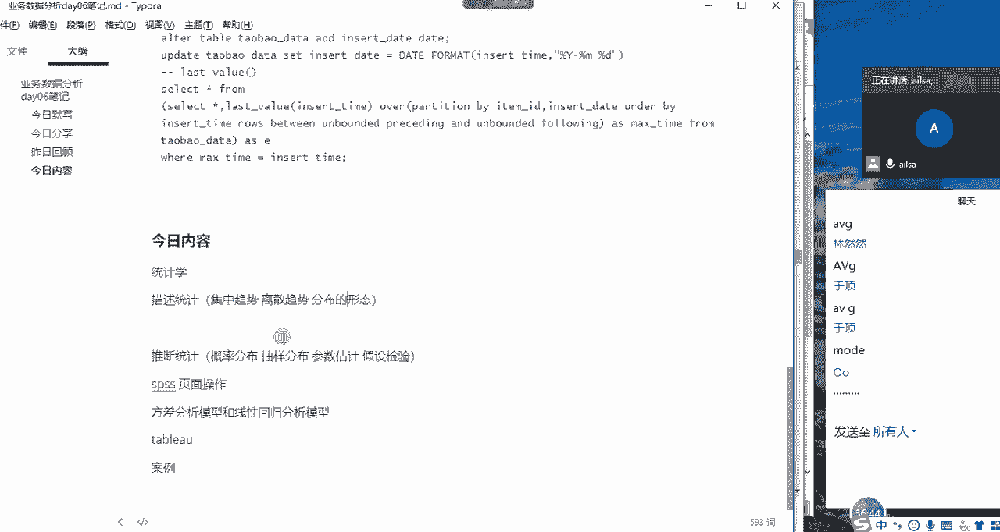

我在这里画个图啊，它肯定是相对于中间位置而言，它的一个离散程度，比如说这个数据，然后然后他这个啊他这个中间位置是啊，稍等啊，他这个中间位置是20，我怎么去计算它的离散呢，你比如说在这个位置啊。

在这个位置是18啊，那它们之间相差二，在这个位置是22，它这个位置也相差二，那它们的离散就是它这个数啊，实际的这个数，偏离它这个中间位置的这个数的一个差值，那这个一般情况下我们使用的是均值。

也就是说我们啊一组数据中的每个数，跟它这个均值进行一个相减，然后算出来这个差值就是它的一个偏离程度。

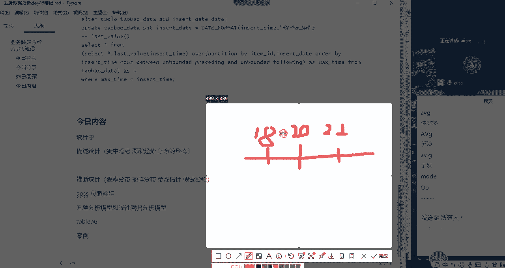

是不是这个意思啊，啊是不是这个意思，如果大家听懂了，我刚才的一个举例啊，扣个一，Uh huh，同志们嗯，我们的离散是相对于我们的数啊，相对于我们的均值而言，它的离散程度，所以说我们叫离均差啊。

我们整个的一个X代表我们一组数据当中啊。

你比如说我们的一组数据当中是有123啊，四五对不对，还跑了五六，然后我们的中间啊1237啊，我们中间位置是不是四啊啊，那我要算它的离散程度的话，就是1-4啊，2-4，3-4啊，4-14=0就不算了。

5-4，六，减去四，7-14，把这些减完的差值一相加。

不就是它的离散程度的度量了吗，对不对，哎那我们先把离均差算出来，算出来之后呢，我们再进行一个相加相加，不就出来这样的一个结果了吗，但是这样做真的对吗，同志们错在哪啊，我这样做对吗啊，我这样做对吗。

啊如果大家认为对，然后你就给我扣个一啊，如果不对扣二，然后告诉我为什么，一啊对，因为啥呢，我刚才举的那个例子当中，你看1-4哈。

1-4的话，他得的是负啊，1-4得的是三对吧，三啊，然后哦然后六减去啊，7-4得的是正三，如果说我一加和是不是变成了零啊，啊是不是变成了零，那我这样的话，他这个离散确实应该是六而不是零。

所以我要加上绝对值对吧，我要把所有东西都加绝对值。

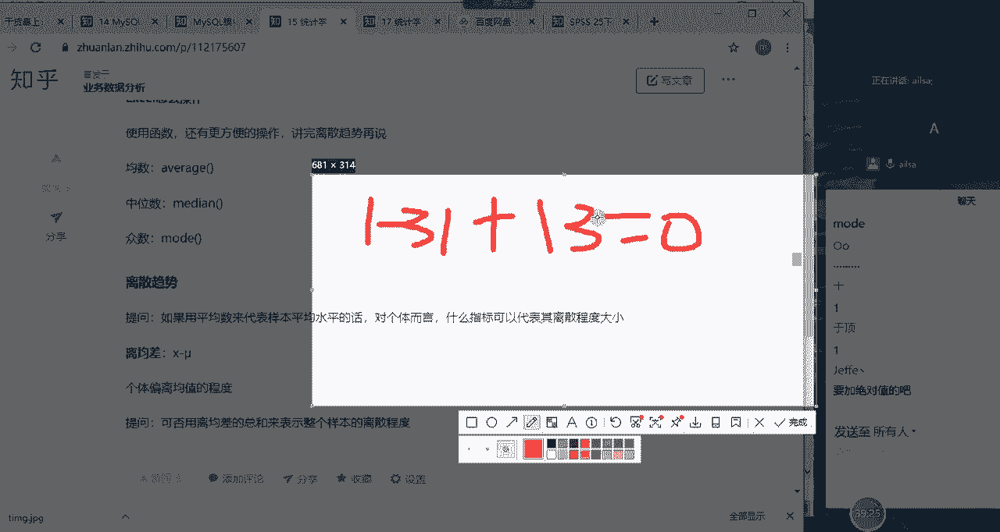

这样的话我才能够达到我所想要的效果，是没有问题的，然后我们就加绝对值，OK因为这样的话它会零会抵消，就达到我们所做的那个离散程度一个度量了，所以我们加了绝对值对吧，那我们加了绝对值之后。

大家都知道我们在实际的应用过程当中，绝对值的添加，它会影响我们整个的一个计算的啊，计算的一个啊复杂度啊，它会它会增强我们计算的复杂度，因为这个绝对值是不参与任何一个计算的啊，所以唉这个时候就在想。

我为什么不可以直接对它进行一个平方呢，我既把绝对值啊，就正负号给它去掉了，而且我还去掉了这个绝对值的，这样的一个啊计算的一个不可扩展性，对不对，那我们就用这种方式就是X减去平均值，然后括号加平方。

然后再把所有的值进行一个加和，然后到这里大家听明白了，没有听明白，给我扣个1OK哈，那啊其实啊这么算完了之后呢，我们还会受到一个影响什么呢，你比如说我这么算完了之后，我有两个样本啊。

我比较两个样本的一个离散程度，一个样本的个数是十，一个样本的个数是1000，那很明显，这1000个啊相差的数平方相加和它肯定是大的，对不对，这十个不管它再离散，它也比不了1000个数的相加呀，对不对。

所以说那这种去比较的话就就比较吃亏了，样本量少的反而占便宜了，那我们肯定不能让他这么干，那我们要除以它的个数，对不对，哎那我们最后就得出来我们整个这个方差公式，就是我们的一个呃呃。

每一个变量减去它的平均值的平方，然后进行一个加和，再除以它的整个的一个样本个数，得出来我们的方差的公式，大家对于这个了解了没有啊，理解了没有，如果理解了，扣一，嗯同志们，这就是我们的方差公式的由来啊。

从最开始我们计算它的啊相减，第二到后面发现它会抵消，所以我们加了绝对值，加了绝对值之后它不方便计算，所以我们改成了平方，那改成了平方之后，我们会发现样本量的大小，会影响整个一个离散数据的大小。

所以我们给它除以了N啊，除了对除以N这样的一个过程，就是跟大家一步一步推导出来，我们整个的一个方差公式啊，是这样的一个结果好，没有问题是吧，没有问题，给我扣个一，我刚才没看到，这个啊这个理解就可以了。

还需要背吗，嗯OK那其实刚才我们讲的是一个总体的方差啊，总体的方差指的是都用的是总体的数据哈，我们在最开始就已经讲过了，我们总体的数据其实是很难获得，但是我们在讲公式也就无所谓了哈。

这是我们总体的一个方差的公式，那标准差其实就特别简单了，你看你对它进行一个平方，那整个这个结果会越来越大，所以说我这边加上一个根号啊，加上一个根号，然后就是对于方差开根号这样的一个过程。

我们就叫标准差啊，这个就很简单了哈，我们对整个的一个西格玛平方，然后加一个根号变成了西格玛，西格玛之后啊，加根号啊，这样的一个结果就是我们的标准差，我们在计算啊，我们在计算我们的数据的离散程度的时候。

更多的使用的是标准差，为什么呢，因为它给我们实际的一个啊，实际的那个呃数据相差的会少一些，他这个加平方数据量会会大一些，sigma啊，对这是念sigma哈，C格玛应该是啊，应该是这么打的，西格玛C啊。

啊西格玛啊，加格玛下一个念啥，这这个念西格玛平方，这念西格玛啊，啊念的不对吗，应该是对的哈，啊但是我们这个总体哈，总体也就是我们总样本量啊，总数量哈，总的一个呃的要也就是总的一个样本的总体。

但是很很多情况下，我们这个样本的总体是获取不到的啊，所以说我们啊我们一般是获取样本的数据，通过计算样本的数据去推断总体的数据，那如果是样本的数据的话，它会略略略略微有所差别哈，他这个标准差叫S啊。

然后呢它除以的这个个数，它除以的这个个数是N减一哈啊，N减一就不是N了，因为它这个是样本数据，它这个均值已经定了啊，已经定了，所以说他这个自由度会变成N减一，大家记住这个就可以了啊。

这个又叫自由度的一个问题啊，啊所以说是N减一啊这样的一个结果啊，这就是我们的样本标准差啊，那我我们看一下，我们讲了啊，总体标准差，样本标准差以及方差啊，这样的一个计算离散程度的指标。

哎那我们再看下面这个例子哈，举个例子哈，唉举个例子哈，举个西瓜，西瓜现在正在畅销哈，比如说啊仓库里配件A的领用量与维修服务费，大家想一下，领用量与维修服务费，其实应该是差。

不就是整个的一个波动大小应该是差不多的，为啥呢，你利用量大代表你维修的多啊，你维修的多，所以说呃，所以说啊它的它的整个的一个离离散程度，跟整个的维修费的离散程度应该是近似的，哎他们的数据如下哈。

这个呃领用量呢大概是13。5件，平均哈A啊13。5件，然后它整个标准差呢是7。6啊，那维修费呢均数是247。9元，标准差是120。7元，现在我想比较一下，他们俩之间的一个离散程度啊，那你看一个叫7。

6啊，标准差是7。6，我用标准差去比较，对不对，7。61个标准差是120，那这个时候有的人就直接得出结论，说维修费的啊，整体的一个离散程度或波动大小是啊，是配是配件的多少倍，二七十四啊，这个应该是20。

20也十几倍，对不对，十几倍啊，然后那你直接就说这个维修费跟配件A，存在很大问题吗，大家想一想，我得出这样的结论，结论真的对吗，大家想一想，我得出这样的结论到底对不对，不对为什么呢，为什么不对啊。

为什么不对，为什么不对啊，那你明看你这标准差大小都在这摆着呢，那肯定肯定是这个意思啊，对啊为什么不对啊，首先它单位不一样，对不对，一个是一个这个配件，它是论件卖的，他这个呃维修费呢是论原卖的。

而且而且你一个配件，它至少它它对应的也不是一块钱对吧，单位不一样，它它们之间的比值也不一样，哎就是他们的计算单位和它们整个的一个大小，是不具有可比性的，那现在我就想我就想比较一下配件A和维修费。

它们之间的一个波动大小，我该怎么办啊，我们可以使用另外一个指标叫变异系数哈，什么是变异系数呢啊我们看这样一个案例哈，其实跟跟我刚才讲的就一样了哈，你比如说测量测量尺度相差太大，是没有比较意义的。

例如蚂蚁和大象的体重变异哈，比如说蚂蚁啊，蚂蚁的体重然后增加了一两，跟大象的体重增加了一两，它们的波动下大小，比如说大象的体重增加一量，完全跟没变一样，是不是，那蚂蚁的体重增加一两纳。

那完了他肯定是变大号了，对不对，它的态差异性太大了，所以说就是它们的一个测量尺度相差太大，是没有可比性的啊，那我们该怎么办，我们就可以使用变异系数，变异系数的计算方法，就是它的标准差除以它的均值。

标准差除以均值就比较好计算了哈，就是我们的7。6÷13。5，120。7÷247。5，我们把它归到0~1之间，这样去计算的话会更具有实际的对比意义对吧，那最后这边计算完了之后，配件A的变异系数是0。56。

然后维修费的变异系数是0。48，我们很明显啊，他们俩虽然差的不多哈，差的不多，但是配件A的变异的，整个的一个大小会略高一些啊，说明配件A整个那个波动性啊，比维修费会更哦活跃一些啊，是这样的一个结果。

所以说我们在进行对比啊，对比我们两个不同啊，不同类型的它的一个波动性大小的时候，如果它的尺度啊，测量尺度相差很大的话，我们需要用到变异系数，那什么时候用不到变异系数呢，你比如说好，你比如说嗯嗯嗯那个啊。

然然和建浩他们俩这次的考试成绩啊，或者说今年一年的考试成绩啊，那这个数据啊，比如说计算出来，然然的整个这个波动大小是呃是啊，是20。5啊，然后建号的是18。3，那对于这个成绩而言，大家都是一样的啊。

它的测量尺度也是一样的，就没有必要去用变异系数了，对吧啊，那你就直接去对比就可以了，很明显啊，然然的整个的一个嗯，整个的一个的成绩波动性比较大，说明他学习会受到情绪的影响，然后发挥略显不太正常啊。

这样的一个结论啊对啊，那个时候就不需要用到变异系数了，嗯啊所以说大家知道啊，我们另外一个指标叫变异系数啊，你记住这个这个就可以了，那我们再接下来介绍另外一个东西叫四分位数，什么叫四分位数呢。

啊就是啊他啊给大家举个简单例子吧，画个图啊，这个是竖着的啊，下面画一个横的哈，画一个横的嗯。

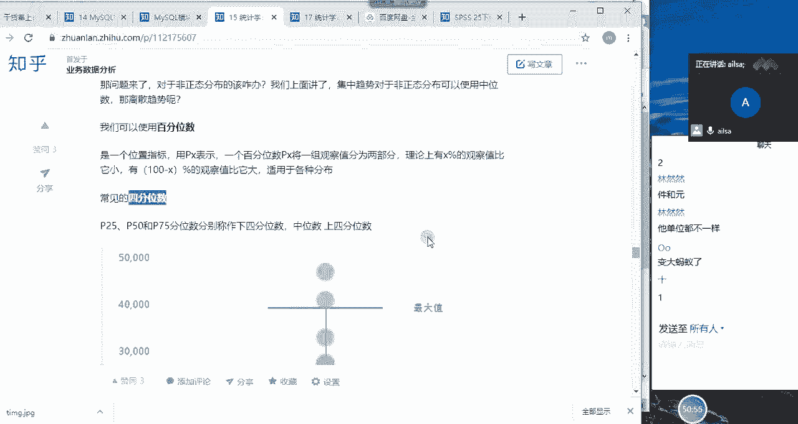

画一个横的，比如说啊比如说现在有一组数据，然后这个是最小值，这个是最大值，它分成四等份，第一份，第二份123123，再来一个1234对，四等份哈，画的不等哈，不好意思，画的不等。

然后这个第一个叫最小值哈，最小值这个叫最大值啊，打一下哈，最小值啊，在这里叫最大值，嗯最大值，然后这个地方呢叫上四分位哈，上四分位我看一下啊，对不对，应该是上四分位哈啊这个调上四分位啊。

然后这个中间啊中间有些人说叫中四分位是吧，不是哈，这个叫中位数哈，因为它也是按照从小到大进行一个排序，它叫中间这个位置叫中中位数哈，啊然后再啊再往上叫下四分位数，我看我讲的对不对啊，下四分位数啊。

这样的一个四分位的去判别，它也是按照从小到大进行一个排序的哈。

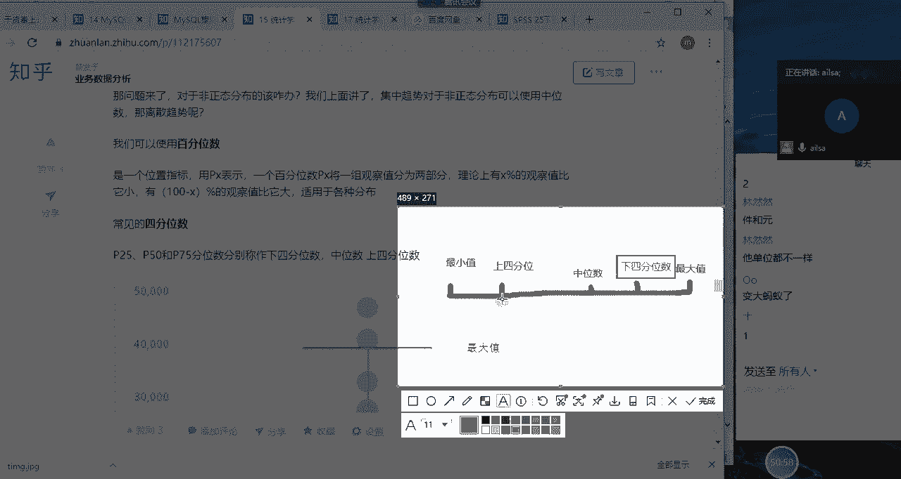

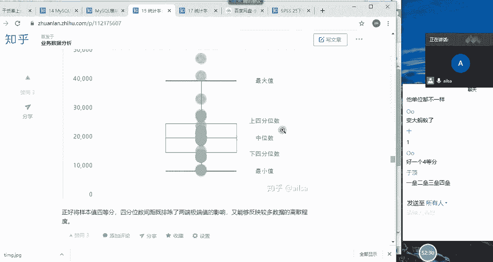

哦讲错了哈，不好意思嗯不好意思哈，我们的最下面是叫最小值。

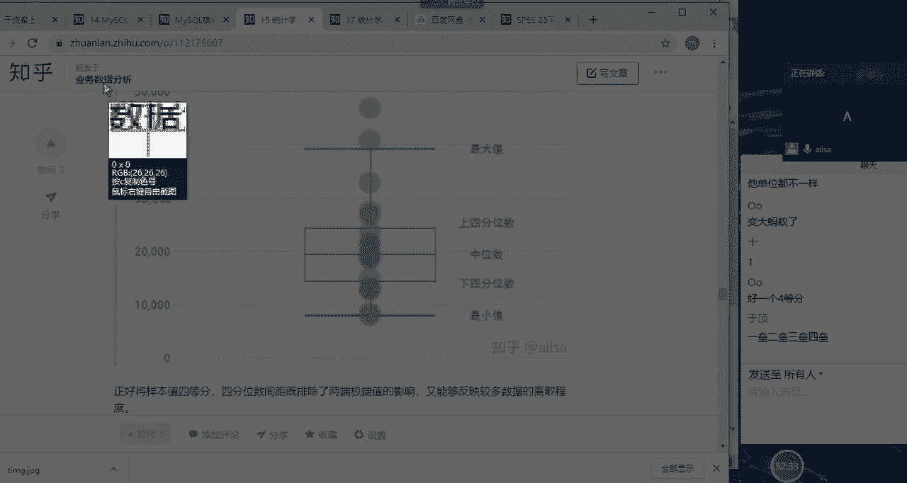

然后往上走，一个叫下四分位数，然后是中四分位数，然后是上四分位数，然后往上是最大值啊，这样的一个结果就是把一组数据拆分成四等份，然后中间这个是一个呃呃刚好两半，然后两半的话它是它就是中位数。

然后往下来走的话，这个是下四分位，然后往上来走，这个是上四分位，他这个也是反映数据，离散程度大小的一个度量啊，这样的结果，你明显发现这个图下面的数据有点偏啊，偏靠下哈，因为它这个数据比较往这集中啊。

中位数靠原则来讲，他应该集中在中间这个部分对吧，集中在中间这个部分才对，但是他明显往下集中，说明他这个数据偏小啊。

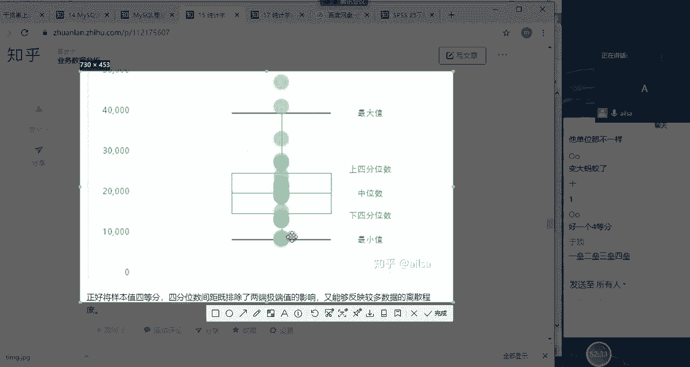

他的数据偏小啊，这样的一个额度量啊，就是我们的啊四分位数啊，那我们讲了我们的离散离散指标哈有什么呢，有我们的方差标准差，还有我们的变异系数啊，以及我们的啊四分位数，还有百分位数哈。

百分位数跟四分位数是差不多的，就是你这个百分位就是看你分多少个百分比啊，然后四分位的话，就是按25%分别分的啊，2%对，这个是25%至50%，75%，百分百0%啊，这样的一个划分。

那我们看一下excel当中我们怎么去实现，哎这些我们想要的指标哈，首先变异系数它等于标准差除以方差啊，除以均值哈，所以说它们它就是个公式，它没有函数哈，我们分别看方差，标准差，百分位数，四分位数。

我们还是拿这个例子例子哈，方差方差方差是啊，应该是Y，啊哇我们一般是S哈，你看S是基于给定样本的方差哈，OK我们选择它，你看它的组成部分是比较简单的，89。57方差，然后我们看标准差。

标准差它就等于是什么呢，std我们如果没有记错的话，ITD对ITDEV，然后也是SS啊，代表的是样本，然后它也是这些数据的组成，241哎，它的标准差你看就小了很多，方差，因为它是平方嘛，它是平方。

所以它会大很多，那接下来我们变异系数就不说了，然后再说我们的百分位数，百分位数百分位数的话，它应该是啊等于P啊，等会儿啊等于PE5PE啊，看啊这个哈，哦这个啊返回数组的K个百分点的值啊，是这个。

然后它组成部分主要两个，一个是数组你指定的区域啊，第二个就是你返回多少个百分点，比如说咱们返回60%吧，60。6%也输入0。6就可以了，然后我们看OK0。6啊，对应的这个值就是13，然后我们再输入0。

5，等会儿跟我们中位数对一下哈，0。5，然后A是11，是不是跟中位数是一模一样的，那就是百分位数，那我们看四分位哈，四分位哎，数四分位数啊，我们就是等于QU哈，应该是QU啊，QUQUTFILE哈，Qu。

Call five，我忘了怎么念了哈啊这个值，然后选择我们的区域，然后是241嗯，第二个值呢，你看它就分12345就是零是最小值，然后一的话是第一个半分位点，然后二是中值50%个百分点啊。

三是第三个四分位点，四是最大值，比如说我们现在选二吧，看一下对不对，我们的中位数确定，OK也是11，说明四分位数也是正确的对吧，这就是我们离散数据的一个实现的啊，计算方式哈，那接下来我们再往下看哈。

我们知道了它离散啊是这么来实现的，然后集中啊是我们的这几个指标啊，离散是这几个指标，那接下来我们看它分布的形状，我们分布的形状大概就是它的一个走势哈，它的曲线图我们分为什么呢。

我们分为偏度系数和风度系数啊，如果它的偏度系统啊，它偏度数刚好位于中间啊，就像正态分布一样，那就叫正态哈，叫正态，如果说是往左边偏就叫正偏态哈，往右边偏就叫负偏态啊，啊那这个风度系数也是一样哈，风度啊。

这是偏哈，这是我左右偏啊，峰度的话就上下哈，这个风度啊，这看就比较尖哈，就比较尖，然后这个就叫尖翘峰啊，这个比较平缓呢就叫平阔风哈，平阔风，然后位于这种正态分布。

这种这种的话就叫正态啊这样的一个分布形状，那对于这个呃分布形状的话，大家是了解就可以了，因为我们在考察的时候，对于这个的一个内容并不是特别特别多，我们主要就是离散和集中啊，分布形态的话就有偏度峰度。

然后这样的一些计算的一些指标，那那它是怎么来实现的呢，偏度是SK1W啊，风度呢是QURT啊，这样的两种方式我们实现一下哈，偏度偏度，偏度峰度偏度是等于啊S好等啊，S k w s k e w。

我们看一下这个函数的组成部分哈，它啊它就是数字啊，我们把这个数字选上，然后是241，OK唉这是它的偏度系数，我们看它是怎么着，它是偏度系数，它是大于零的是吧，那就有点像正偏态。

我们从这个数据上也可以看出来，它是有点往啊往左手边去偏的，所以叫正偏态，然后我们再看他的风度啊，风度是q coat啊，等于QURT啊，这样的一个啊结果也是选择我们的值就行了，他们的参数还是非常简单的。

OK16。25哎，看这个值就比较大了哈，那它应该是比较尖的哈，大于零就是勾肩的这种啊啊，然后这种是等于约等于零的话是正态，然后如果是小学生的话，就比较矮胖哈，叫平阔风啊，这样的一个啊啊这样的一个呈现。

那你看在excel当中，我们进行数据的描述统计的时候，有这么多个函数，那其实我们也可以在我们的分析里面，一次性来实现，怎么来实现呢，哎我们在数据选项卡下面有一个数据分析，大家看一下数据分析。

我应该咱们应该都有哈，数据分析有一个描述统计，点击确定，OK这边我直接选择汇总，然后输出区域我指定到这里，我指定到这里，然后大家看一下哈，啊这里合适吗，应该合适啊，输入区域我们要选择我们的这个数量哈。

啊这个时候应该是241，有没有在听同志们点击确定啊，这个时候啊啊我刚才讲的我们的描述统计，这些指标都听明白了，没有听明白，给我扣个一，因为刚才好像我问了大家了，应该因为之前也都学过，应该都还好一些哈。

OK那我们通过啊，就是通过描述统计这样的一个操作方式的话，我们直接就呈现了平均值，唉没有问题啊，那中位数没有问题，众数没有问题，标准差也没有问题，方差没有问题对吧，风度啊，风度偏度啊，最小值最大值求和。

你看这个描述统计，是不是把我们所有的想看到的值都体现出来了，这个观测数指的是我们当前的一个样本数据，当中有多少个啊数据内容哈，唉你看它通过描述统计，把所有的值都体现出来了。

这就是我们所有讲的描述统计的内容了，嗯好那我看一下哈，嗯OK那其实就没有了，这是我做的描述统计的一个集中趋势，离散趋势，还有分布形状的一个脑图。

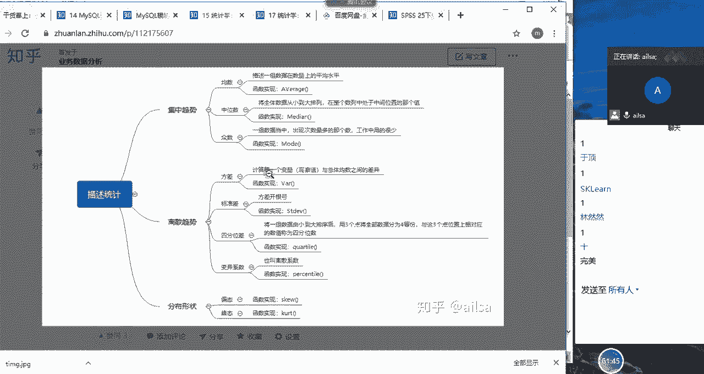

大家也可以自己做一下啊，这些内容其实就已经啊，算是我们描述统计的全部内容啊，就这么多啊，大家看，其实描述统计已经算是呃比较简单的，入门的统计学的知识了啊，这个内容都听明白了，给我扣个一。

嗯同志们相信不难哈不难。

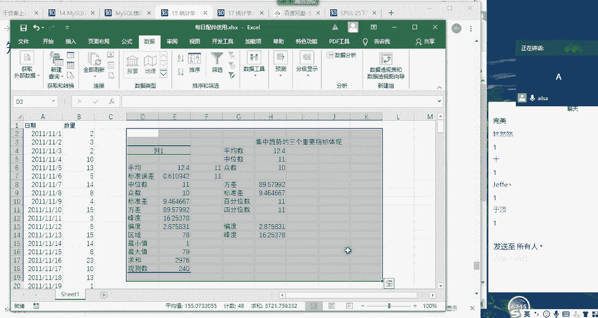

好的嗯。