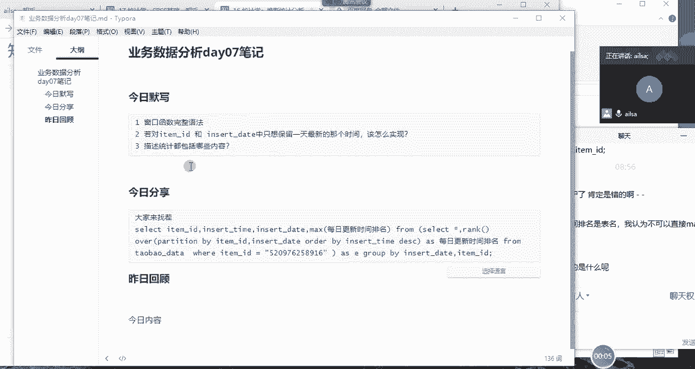
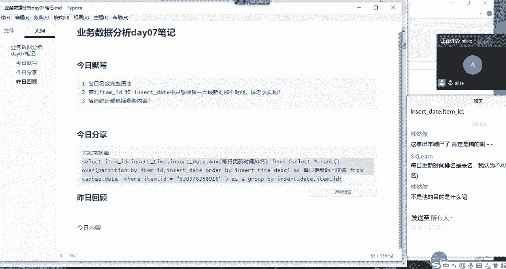

# 强推！这可能是B站最全的【Python金融量化+业务数据分析】系列课程了，保姆级教程，手把手教你学 - P81：01 窗口函数与聚合函数对比 - python数字游侠 - BV1FFDDYCE2g

呃那我们今呃刚才默写的内容，我看大家都写完了哈。

写的还可以啊，没有什么特别大的问题啊，因为本身也不是说呃特别难啊，昨天我们都讲过了，然后我们再看一下今天的今日分享，然后这个是昨天的面试题，有一个学生写的一个答案，然后我们来看一下他到底对不对，好吧。

哎，因为大家现在已经猜猜猜到他有可能是不对的。

所以说但是呢没找出来原因哈，哎我们一个个来拆啊，我们看这种比较复杂的嗯，SQL语句的时候，我们就是啊就是它有你看select什么什么什么from，这是不是有个这是你看从这里到这里，这是一个嵌套，对不对。

这边是一个子查询，然后我们就先把这个子查询的结果拿出来，我们先往从里往外看啊，从里往外看诶，这其实是一个子查询的表对吧，然后我先我们先看一下它这个子查询里面，想要表达什么意思，OK啊select星啊。

然后rank也就是我要对它进行一个排名，然后partition by也就是按照item id和insert date，进行一个分组，然后按照我的insert time进行一个降序的排列。

这是我的窗口函数的意思，然后这个窗口函数啊，你看SLG星逗号这个啊这个的一个整体，然后我给它起了一个名字叫每日更新时间排名，也就是说呃就是每天如果有多条记录的话，我给他做一个排名。

因为这边分组到了每天的一个插入的时间，对吧啊，那我这后面就是我的一个限制条件，我们先查询一下结果，诶，我查询出来这个结果之后往上拖动哈。

这是一个item id下的每天的啊，不同的一个呃就是更新的时间，那我这边是按降序进行一个排列的，对不对，那所以说如果我们想取最晚的那个时间的话，应该是取第一名，就是最大的那个值，对不对。

最大的那个值其实就是我所想要的一个结果嗯，然后我们再看外层，其实我们接下来只要啊，我们接下来操作是只要取到啊，只要取到这个一啊对吧，这个一哎就可以了，是不是想要达到这样的一个效果。

那我们看一下它是怎么来做的，OK那他得到这样一个结果之后呢，他使用了一个group by对吧，group by是我们的一个聚合函数，对不对，那我们看它是按照insert杠id和也和insert啊。

item id和insert杠data这两列进行一个分组的，对不对啊，那我们看它的一个查询条件是什么，它也就是说他要取最大的，就是最大的每日更新排名诶，最大的每日更日更新排名，他其实他想取的应该是。

你看一跟二比谁大呀，二大对不对，他好像取的不对哈，嘿他这个时候他会取到这个东西，他如果想取二的话，它最好是进行升序排列，它取最大值是没有问题，其实在这里应该是取最小值，对不对，最小值是一，对不对。

哎那我们先不管它哈，我们先不管它，我们知道这个点有可能会错了哈，那我们再看看它的查询，他查询了item id没有问题对吧，哎嗯然后还啊查询了啊，银色的data也没有问题。

大家看它这里面查询了银色的time，会出现什么样的问题呢，来同志们，我没有，我在聚合函数里面，我没有对它进行一个分组，但是我查询了这个字段，它会就是它会出现什么样的一个后果啊，之前我可是讲过的哈。

大家想一下这个会出现什么后果，就是我没有对它进行分组，但是我查它了，那它到底出来的是不是有意义的东西呢，只会得到一条是啊，怎么就只会得到一条这一条数据，它就是比如说你看我的我的分组是根据啊。

是根据我的隐私的data进行分组的，对不对，你看还有item id哈，那你看如果按照insert data进行分组的话，这有两条数据，分组之后应该会变成一条，对不对，它应该会变成一条。

因为分组嘛分组聚合就会合在一起，对它只会变成一条，那变成一条之后，我取一个max最大值，那应该是取到的是二对吧，我应该学到的是第二条这样的一个数据，那我这边查insert time，它会对应哪个值呢。

它是取的第一个值还是第二个值呢，啊我们之前是讲过的哈，就是对于这种没有意义的啊，没有意义的字段哈，它默认会取当前分组的第一条记录，是不是啊，是不是同志们，如果是给我扣个一，OK思敏没问题。

其他人呢建号呢，嗯那那我们从这个字面意思去理解的话，也就是说现在我取了一个max的最大值，也就是这个我取的是二对吧，然后这个insert time呢我取的是呃，因为它俩是一样的，所以聚合一条就可以了。

然后这个item m啊，item id呢我也是只要只要只要取一条就行了对吧，然后哎大概我也其实想要的结果，可能是这一条数据对不对，但是现在有一个insert time，它没有意义。

因为你没有对它进行分组，那这个时候他可能选择当前分组的第一条数据，现在第一条数据是它，对不对，那你最后的结果有可能是他他他他是不是，那我们看一下最终的结果到底是不是。

诶好像是的，对不对，哎你看我排名是二，然后对应的这个insert time是我的一个最晚的值，但是啊但是大家想一下，实际上在我的我的整个的一个详细表里，这个值对应的排名真的是二吗。

这个值对应的排名应该是一，对不对，所以说你这样写是没有意义的，但是但是你刚好歪打正着，哎你最终的结果却是对的，是不是，你就算结果却是我们所想到的一个结果啊，我们如果不看过程啊，如果不看过程看结果的话。

我们不看这个排名哈，我们就看这个结果，好像也没有什么特别大的问题对吧，哎没有问题，对不对，那有的人说，那这这是对于多条数据而言，如果对于一条数据呢，一条数据更简单了，它的最大值就是它本身。

所以你取出来还是一样的，是不是，那这个啊，对于这种机缘巧合，或者叫歪打正着的一个情况的话，大家理解我想表达的意思，没有啊，如果理解了，给我扣个一，然后我告诉大家该怎么去修改，嗯理解了没有。

这道题理解了没有，理解我想表达的意思没有好的啊，理解了之后，我跟大家说该怎么去修改。

首先我们先对里进行一个修的修改哈，首先呢它我们对它进行一个降序排列之后，我们想取到的值其实是呃第一名，对不对，是第一名，其实我再跟大家说一下窗口函数，它有一个非常大的特性，就是你在使用窗口函数的时候。

你不是生成了一列新的吗，那这个新的只会在原来的表的呃，就是行不变，列不变的情况下去新增这样一定的内容，那它既然原来的数据结构不发生任何的变化，我只要把它作为新的一列，进行一个条件筛选就可以了。

那在这里怎么去修改呢，就是我们在外层不必使用我们的聚合函数，我们直接啊select星就可以了，Select xing，然后where啊，where条件改一下啊，V啊V我们的每日啊更新排名等于一啊。

我们看一下，呃每日更新排名写的不对吗，每日更新时间排名哈。

唉那你看这样的话，我是不是就取到我所想要的结果了，其实就特别简单，因为我刚才那个结果为什么会出现那种情况，就是因为对于窗口函数的特性，还有聚合函数的一个呃特性，它们之间的一个区别没有了解的特别清楚。

你想一下，我们再从这个呃内层函数去想这个问题，如果你知道窗口函数，它这里面每一条记录都是独立的，或者说完整的，跟原来的数据结构不一样，现在我们的目的就是想从这个完整的数据当中。

筛选出我们所想要的这条记录，这条结果，那后面我们已经有编号了，对不对，那我们就是想取这个最大的这个值，那这个最最大这个值呢它肯定是一呀，对不对，因为你相当于你是取所有分组啊，分组当中的第一名。

你的意思就是，那这个时候你直接把排名等于一就不就行了吗，即使说哈哈，假设哈，即使说机缘巧合，这个地方不是时间，是分数分数，比如说有两个100的重名了啊，他们都是第一名，这个时候你你当然也可以取到前两名。

完全是没有问题的，所以说你就可以把它当成新的一列，作为你表的一个呃新的一个新增字段，然后进行一个呃条件的过滤，这种的话是对于窗口函数的特性，是体现的是最明显的，明白了吧，那我们在进行聚合的时候。

聚合函数它有什么样的一个特点呢，它是这样的，就是嗯它是啊，就是比如说原来啊聚合什么叫聚合呢，就是说原来有啊十条数据啊，比如说部门都是叫呃呃部门都是叫什么呢，都是叫啊教学部，假设哈都叫教学部。

然后这里面有十个人，哎我存了十个人，然后我想计算一下这个教学部总共有多少人，那我最终想要的效果就是啊，就是一行数据就够了，为什么呢，你看我就想要一个教学部，教学部啊，十人啊就够了啊。

那你看原来是十行数据，现在变成了一行数据，它整个是巨额，是聚在了一起，合并在了一起，然后进行了一个计算，这叫聚合，那开窗的话，它就是啊我们从字面意思去理解的话，它相当于在原来的原来的数据结构。

不发生变化的情情况下给它添了一些东西啊，打开了他的窗户，然后整个的数据就啊就比较好实现了啊，就是上帝给你关上了，关上一扇门，然后也不会把你置于死地，然后就会再给你开一扇窗，我们可以这么去理解哈。

就是原来的表都没有发生任何变化，然后你新增一列辅助列，哎，你可以把它当成一个辅助列，辅助列，然后帮助你去进行条件的一个过滤，这么去想就行了，我们呃聚合函数的话，我们一般是用来做计算的。

汇总计算聚合在一起汇总计算嗯，呃你的聚合的话，一般情况下都是多条记录变啊，几条记录这样的一个结果啊，OK同志们，大家嗯，大家对于这个聚合函数和开窗函数啊，以及当前这个例子啊，我说完了之后有没有明白啊。

明白给我扣个一啊，然然真的是，OK哈。

