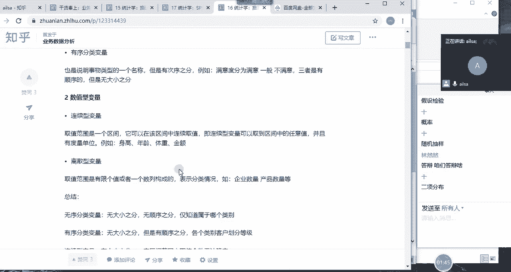
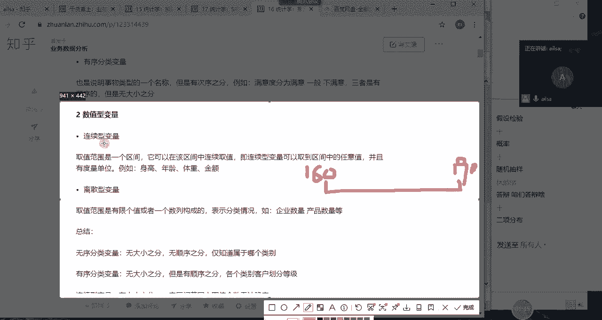
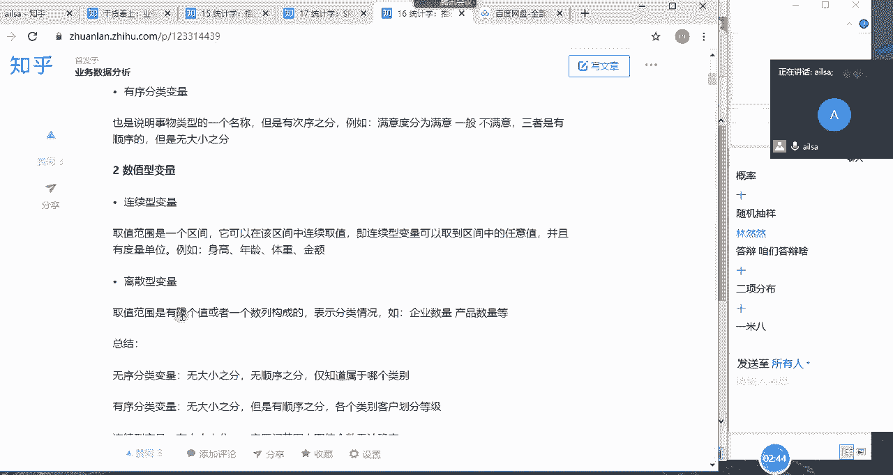
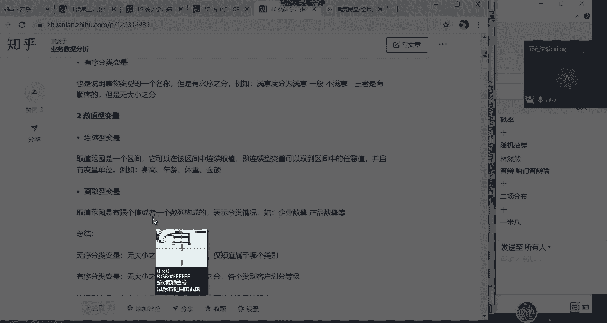
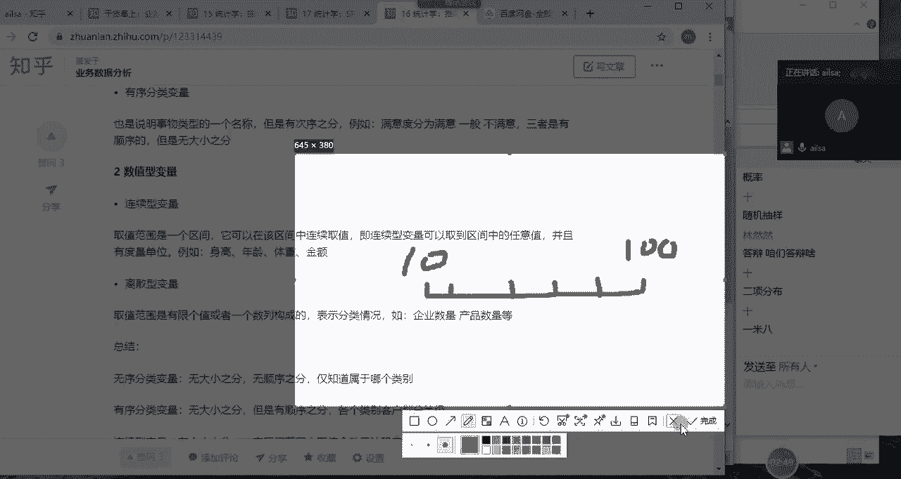
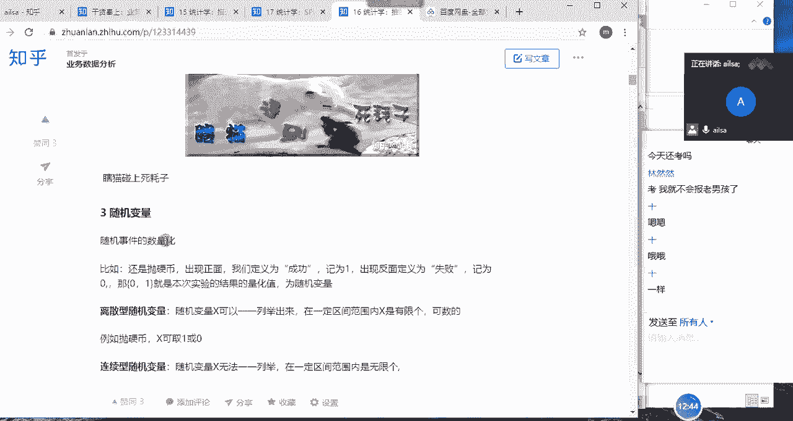
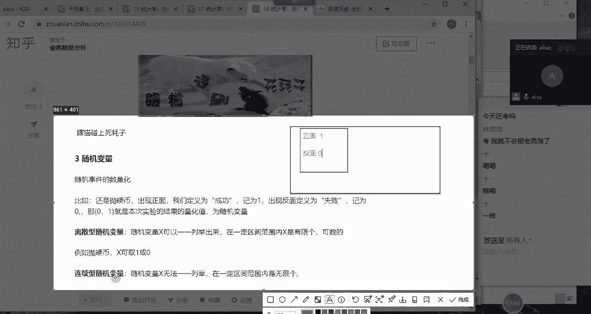
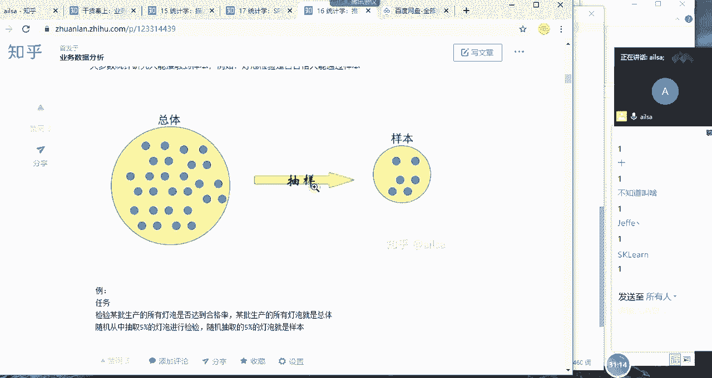
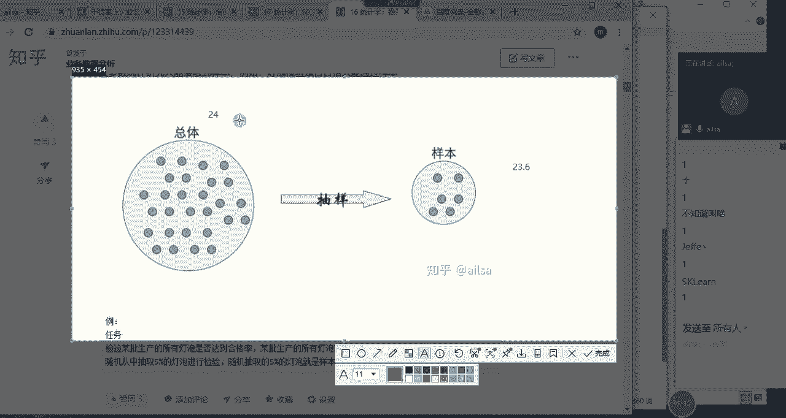
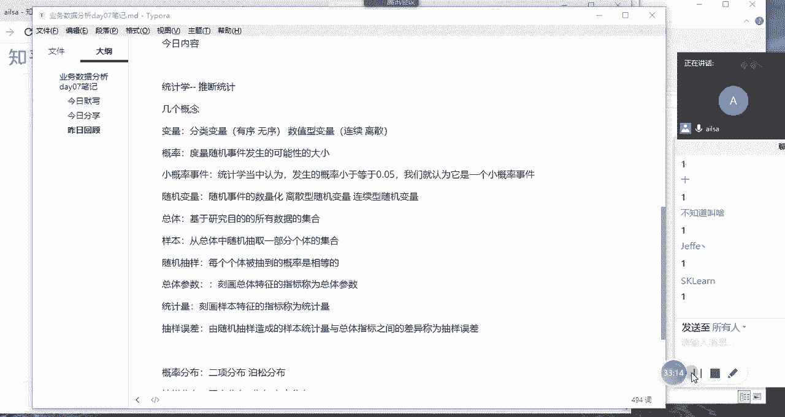

# 强推！这可能是B站最全的【Python金融量化+业务数据分析】系列课程了，保姆级教程，手把手教你学 - P83：03 统计学中的几个概念 - python数字游侠 - BV1FFDDYCE2g

答辩项目哈，我们答辩项目唉好我们进入到今天的啊主题哈，今天的主题，首先我们介绍统计学当中的几个概念，第一个概念叫变量啊，变量哎我们先写下来哈，第一个概念叫变量啊，等会儿讲完再写吧，第一个概念叫变量。

变量分两种，一种叫分类变量，一种叫数值型变量，什么是分类变量呢，啊就是有两又有两种分类，一种是无序，一种是有序，你比如说性别男女，他就属于一个分类啊，性别就是两男女，那他这个呢没有大小之分。

也没有说男的就比啊，就是有那个高低哈，大小之分没有啊，也没有顺序之分啊，还有血型啊，民族啊这些等等都是属于无序分类变量啊，那有序分类变量是指的什么呢，就是它也是一种分类，但是它有一定的次序。

你比如说满意度分为满意，一般不满意对不对，那他这个满意比一般的话就会高一个层次，就是有顺序这样的一个啊一个一个现象好，所以说有序分类变变量它是有顺序之分，但是你说满意和一般啊。

和一般之间它到底有没有差多大啊，这个是没有大小之分的，它只有顺序之分哈啊，分类变量是都没有大小之分，那无序呢是没有顺序之分，而有序是有顺序之分的，嗯那第二个是我们的数值型变量，数值型变量也分两种。

一种是连续性，一种是离散型，那什么是连续型呢，你比如说啊你的取值是一个区间范围，在这个区间范围内，它可以取到任意的值啊，举个例子哈，你比如说身高嗯，你比如说身高哎。

来我们看一下身高的话，我们都知道嗯，画个比岸我们都知道，假设哈假设在中国，我们的身高，男性的身高大概是1米6啊，1米6到啊2米之间吧，2米的少哈啊啊1米9吧，假设哈啊假设到1米9之间。

那在这个区间范围内，我们啊如果说他那个精啊，他的这个这个数据的精确度，如果足足够精确的话，它可以取到任意一个值，为什么呢，因为每个人的身高都不一样，可能就差个那个几毫米或者怎么着，但它总是差点啊。

差差一点，所以说像这种的话，在每一个点上，一个区间范围内，在每一个点上都有可能取到值的这种现象，好这种情况我们就叫连续型变量。

这样的哈连续性变量，然后我们再看离散型变量，离散型变量指的是在一个区取值的范围内，或一个区间范围内。

它取得的值是有限个的啊，什么叫有限个的，就是可数的啊。

你比如说啊你比如说什么呢，还是啊拿这个例子去举例哈，你比如说我们统计一下北京市所有公司的啊，公司人员的个数，那比如说我们统计了十家公司啊，十家公司，那他的人数呢从啊从十人到啊到1000人不等啊。

但是他取的值却是离散的，有的公司可能是20人，有的公司可能是80人，有的公司可能是啊啊七啊，那个九呃，那个八十八十五啊，有些公司可能是95人啊，这样的一个某个点啊，在某个点它可以精确到这个值。

那这种情况它就属于离散的，那在这个区间范围内，他取得的值是有限格的，哎我们就可以数可数的，有限格的，那这种就属于离散型嗯，离散就是一个个点，它们之间不联系，不连贯哈，这个意思啊。

所以说这是离散型的变量，那对于数值型的变量呢，它其实是有大小之分的，因为它可以它是数嘛，所以他就就有大小，那它还有就是呃它的一个区别就在于啊，取值的一个个数无法确定，就是连续性啊，如果说是有限的可数的。

就是离散型啊，那我们总结一下来说的话，就是无序分类变量它就是无大小之分，无顺序之分，有序分类变量它就是无大小之分，有顺序之分，然后连续型啊，变量它这个的话就是有大小之分啊，在一定区间啊范围内。

它的取值的个数是无法确定的啊，离散变量就是有大小之分，在一定区间范围内取值个数是有限格的，可数的这样的一个情况啊，那我们就称之为啊离散型啊，然后以下就指两种分类，一种是分类数，数据类型，一种是啊脸啊。

一种是数值型，然后每一种有两个分类这样的一个结果来，我给大家写一下哈几个概念，第一个我们介绍的是变量，那那变量呢又分为啊，又分为呃又分为分类啊，变量啊，这是一种说法哈啊这个说法有很多。

但大致都是这么多哈，分类变量和数值型见谅，对于分类变量而言，它又分为什么呢，它又分为呃呃有序和无序啊，分类变量，然后对于数值型变量，它又分为连续啊，连续和离散啊两种类型，我们为什么要讲这个呀。

就是因为我后，我们后面要用到随机变量的时候啊，就是有连续型随机变量和离散型随机变量，所以说我们要说到这个东西哈，而且我们在最后讲分类数据分析的时候，它也会涉及到我们这个变量的一个类型啊。

所以说我们要先介绍这个变量这个概念，大家对于变量啊理解了没有，理解了，给我扣个一，同志们嗯理解了哈，OKOK那我们看第二个概念就是概率了啊，概率啊，大家想一想概率这个知识点啊。

我们可能有一个专门的课课程，叫概率论与数理统计啊，它是啊，专门以概率作为作为我们的一个基础知识，然后展开的一系列的啊知识的一个扩充和呃，和和和讲解哈，那那本书虽然不厚。

但是是好像据说是很多科目考研必考的啊，内容哈，所以说概率这个东西还是很重要的，那我们简单来理解一下哈，啊我们要说到概率，首先我们要说到随机事件啊，什么是啊哼什么是什么是随机事件呢。

它其实啊大家看这个概率哈，它其实是随机啊，随机现象某种可能观察的结果称为随机事件啊，某种随机现象，随机现象，某种可能观察的结果称为随机事件，这就是我们的一个随机事件的一个定义。

可能观察的结果称为随机随机事件哈，那这个概率是什么呢，它就是为了描述随机事件发生的可能性的大小，你不可能说呃，就是说嗯他虽然是呃就是有可能发生，有可能不发生，但它到底发生的可能性大点大小是多少呢。

我们就可以通过概率来实现对吧，那它介于0~1之间，然后是经过大量的重复的实验而得出的结论，那我们在学概率的时候嗯，我们在学概率的时候，经常会拿抛硬币啊这个例子来进行举例，说唉我经过了1000次的硬币啊。

就是一直在抛抛1000次，最后得出来那正面朝上的概率大概是啊，不要不要讨论哈，大概是1/2对吧，那这就是啊，那这个意思就是说我们抛硬币这个随啊，抛硬币出现正面或者反面啊，这样的一个随机事件。

它出现正面这个随机事件的概率啊是1/2，出现反面，这个的一个随机时间的概率也是1/2哈，因为它只有两种可能的结果，这个这个结果是1/2，那另外一个肯定也是啊，就是1-2分之一还是1/20哈。

就是我们的概率啊，OK那我们再看一下什么叫小概率事件，小概率事件其实在我们的统计学当中，就如果说随机事件发生的概率，小于或等于0。05，大家想一下，就是这个事情的发生只有5%的概率。

我们就认为它是一个小概率事件啊，表示这个事件在大多数情况下都不会发生，因为它不发生的概率是95%，所以说啊你看你说这个事情，99%不可能发生啊，所以呢它那它那它不发生的概率是非常大的。

我们就可以称为小概率事件啊，呃那就是说我并且一般认为，小概率事件在一次随机事件中不会发生啊，就是说这种小概率事件啊，就是我们呃就比如说买彩票啊，大家都知道买彩票中概率的一个呃，可能性是非常小的。

如果你买一次彩票，你就中了啊300万，那这个真的是一个非常非常非常非常小的一个，概率事件哈，呃就是我们就可以完全可以，把它称之为小概率事件，那还有一种情况就是瞎猫碰到啊，瞎猫碰啊，碰上死耗子啊。

这种情况其实是特别啊小的一个概率哈，因为首先他是个瞎猫，它还是个死耗子啊，这种一般情况下都不会碰见，我们就可以称之为小概率事件啊，在这里跟大家说一个特别有意思的事情哈，啊怎么说呢，他们说啊就是一个人啊。

中彩票的概率，跟这个人出门被车撞死的概率是一样的，但是就是不知道为什么，大家从来都不担心自己被车撞死，而一直在梦想着呃，就是买一次彩票就中中的概率啊，就就会中啊，就会中大奖，所以说大家一直在买彩票啊。

对这个笑话大家听明白没有，突然插一个笑话啊，就是嗯出门被车撞的概率，跟买彩票的概率是一样的，但是大家从来都不担心自己被车撞，因为认为这是一个小概率事件，但是大家一直都在梦想着啊。

或者是一直都认为自己有可能会中彩票，所以一直在买彩票，呵呵就是一个人啊，人的一个啊，就是大家希望往哪个方向去发展的时候，虽然它概率很小，但是我们还是想试一试嗯，哎呀然然也参加高考了哦，参加高考啊。

参加考研了是吗，Sorry，好K哈，那我们这就是我们的概率哈，其实概率这个东西还是挺有意思的啊，还是挺有意思的，就是嗯我回头可以给你们找一些啊，我回头可以可以可以给你们找一些概率的题哈，就贼有意思。

而且啊，而且你会发现每个人的一个想法和思路，好像都不太一样啊，OK我们再看第三个哈，我再啊我写一下哈，我们接下来讲的另外一个概念的话是概率哈，啊概率就是啊来度量啊，度量啊，随机事件发生啊。

发生的可能性的大小啊，这个都知道哈啊那小概率事件小概率啊，事件指的是啊它这个发生的一般情况下，统计学当中认为啊发生的发生的概率啊，小于等于0。05啊，我们就认为它是一个小概铝事件啊。

并且在一次抽样过程中，在一次抽样过程中，我们就认为它不太可能发生啊，如果它发生了，那它就是属于小概率事件，OK那我们再看啊，我们再看随机变量啊，随机变量啊，是你看概率是随机事件的发生可能性，大小的度量。

那随机变量是什么呢，它就是随机事件的数量化唉他什么意思呢，什么叫数量化呢，你看我们在进行啊，我们在进行数据统计，因为它我们现在讲的是统计学，对不对，我们在进行数据统计的过程当中。

那硬币啊抛一抛一次硬币它出现啊，它有可能会出现什么呀，它有可能会出现正面对吧，它可能会出现正面，它也有可能会出现反面，那我们在进行结果记录的时候，我们直接记正面，直接记反面，还是直接记个成功，记个失败。

那这些都是中文的，我们不利于我们分析，那我们何不给它定一个值，唉让它去量化它，这样的话我们在做分析的时候就很好分析了，这个时候我们就可以把啊，把出现正面的记为一啊，然后出现反面的，然后记为零。

哎那零和一其实就是随机事件的数量化，我们称之为随机变量啊，啊那我们随机变量的话就分两种结果了，一种叫离散型随机变量，一种叫连续型随机变量，什么意思呢，就是说如果说在一个区间范围内。

它得到的这个随机事件的数量化是可数的，有限的，它就是联系离散的，如果说是无法一一列举，那它就是连续的啊，就是分两种随机变量的结果啊，一种是离散性。

一种是连续型随机变量，OK那大家对于随机变量啊这个概念明白了没有，诶啊思敏这边有什么问题吗，OK没有问题哈啊没有没有，OK我看你发了一个零啊，那你比如说这个连续型随机变量该怎么去呃，该怎么去举例呢。

你比如说要统计北京30岁以上男性的身高啊，每个人的身高都不一样，测量单位也在一定的情况下啊，数据是连续的，也就是说我们这个随机事件，是测量每个人的身高来做我们的随机事件，那它整个随机事件的数量化。

我们记录的就是每个人的一个啊，身高的这样的数量，那这个那这个身高到底是多高，我们如果说呃就是单位足够精确的话，我们是完全统计啊，就是在每一个点上，它有它都有可能取值，因为每一个人身高都差点意思。

对不对啊，都都都不是说完全一模一样的，你即使说你觉得两个人可能一般高，但是可能就如果你单位很精确很精确的话，他可能就差那么点啊，所以这属于连续型变量啊，离散型变量这个在我们后面做概率呃。

就是呃讲概率分布的时候会用到哈，所以我们在这里面先介绍一下，我们的随机变量嗯，我们看一下哈，随机变量，随机变量它就是我们随机事件的数量化啊，用来统计随机事件的一个结果，用数字来进行一个体现。

那它分为啊离散型随机变量和连续性啊，随机变量，好吧啊，这我们随机变量，然后我们再接着往下看，接着往下看，是总体和样本，总体和样本啊，这个就我们在讲统计学的第一篇的时候，相信老师已经讲了哈，什么叫总体呢。

它就是根据研究目的确定的所有个体，某项指标的观察值的集合，也就是说你研究的呃对象，它你包含了它所有的数据，这个叫总体啊，那样本呢就在这个总体的数据当中，你随机抽取一部分个体进行观察和预测。

那这个集合就称为样本，类似于这样的一个图形，就是说假设这是一个总体的话，我们有时候总体这个数据是没办法去获取的，因为它量太大了啊，不利于我们进行研究，所以说我们就从中啊一定是随机抽取，什么叫随机。

我等我们等会儿再去讲哈，随机抽取一部分作为我们的一个样本，然后我们对样本数据进行一个分析，然后进而推测我们总体的数据，这样的一个过程，就是我们统计学上研究的主要的方式之一啊。

那我们再看一下什么叫随机抽样哈，哎你比如说我举一个很简单的例子哈，讲随机抽样之前，我们举一个特别简单的例子，很很好理解哈，你比如说某一个工厂要检验啊，某批生产的所有的灯泡是否达到和达到合格率。

那它的整个的总总体的话，就是这一批生产的所有的灯泡对吧，就总体，那我们如果说对总体进行一个检验的话，那我们就要大，大家应该都知道那个灯泡的一个检验的话，主要看它的整个的一个照亮的时长。

应该是整个一个照亮的时长啊，啊等等各方面的去检验，那如果说我们像想对总体进行一个检验的话啊，那这个工厂也不用卖钱了啊，怎么着呢，把这搬把这一批啊灯泡全部都拿出来做检验，哎检验合格率达标了。

OK那你这个产品也都坏完了哈，因为他要看它到底到哪个程度呃，坏掉嘛，所以说如果没有达到那个程度啊，那说明他是OK的嘛，所以说那你这个成本就很高了，那一般情况下人肯定不是这么干的哈。

人一般检检验这种方式的话都是抽取一部分，然后检验一下，OK没有什么问题，然后就去推测，总体应该也没有什么问题，当然这只是大致的一个工具，不不具有啊，就非常准确的一个结果，但是啊这样的结果已经足够了啊。

已经足够了啊，这就是我们的总体和样本，那我们看一下刚才所说到的一个随机抽样，什么叫随机抽样呢，就是随机抽取一部分个体进行，观察和测量的过程啊，称为随机抽样啊，这说跟没说一样，那到底什么是随机啊。

就是说每个个体是否入选啊，是否一入选是不可知的，但是每一个个体入选的可能性的大小是一样的，也就是说大家都是等概率而被入选的可能，所以说这才叫随机啊，随机不等于随随便哈，那举两个例子，你比如说抽奖的时候。

那这个这个抽奖盒里面应该有很多小球球，或者小纸条，那这个时候你再去抽的时候，其实每一个东西你抽到的，你即将抽到的概率是一样的，对不对，因为你是随机抓的嘛，对不对，那这就这就叫随机啊。

那比如说啊我们经常会看在抖音上啊，或者在其他的新闻上啊，我们会看他们说我们从街头随机采访了五个人，然后呃调查某一项什么结果，大家想一下这个街头随机采访五个人，他确定是随机吗，同志们来回答这个问题。

街头采访这种形式啊，确定是随机的吗，啊如果认为是随机的啊，你就给我扣个一，如果认为不是随机的啊，那你就要告诉我，为什么怎么它为什么就不是随机的，如果说我想实现随机该怎么来啊。

我比如说我现在就要达到一个完美的随机采访，五个人，这样的一个效果该怎么办，嗯我该怎么办，其他人呢只有sim回答了，哎同志们想一想，如果说我想在街头随机啊，实现随机采访五个人，都是有安排的。

你看你这个就没有嗯嗯你这个就没有啊，就没有把你首先你要想一下随机这个东西的话，你要先把你的总体总体给它确定了之后，然后你再从你的总体当中随机去抽取，让它们概率相等对吧，首先你看你既然是采访街头采访。

你应该是比如说你这个接头，你你要比如说你肯定是在一个城市当中，或者是一个区当中，你要把这个所有的区，然后分多少个街头，比如说你分十个接头，然后你从这十个接头当中，你随机啊。

你随机抽出来一个A我现在是随机哈，随机抽出来，比如说就在我们的呃那个啊三里屯儿哎，我随机抽到了三里屯这样的一个街头，然后我去采访采访呢，那我要定位到三里屯，这里面到底有多少啊，到底有多少人。

我给这每个人都给他做了一个编号，然后做完编号之后，然后我就随机抽取这些编号里面的人，比如说我抽取了两个，那我就要去采访这两个人，对吧啊，这样的话才是一个随机的现象，也就是说你要保证你采访的这两个人。

然后还有你的地点，他都是等概率发生的才可以，当然了，这个很难做到，所以说基本上都是随便采访五个人哈，那你比如说我们再换一个环境，换一个能够实现的环境，呃假设现在嗯假设现在呢我们是线下上课。

然后呢啊同学们坐在坐在教室里，然后我呢作为老师，我接下来要提问一个学生，那现在我就出了这么一道题，我说接下来我要随机抽取啊三个人，然后上台去表演一个节目，大家觉得我应该怎么做才能做到真正的公平。

真正的随机啊，就是在一个教室里啊，一个教室里，这个时间点我们就确定了，就是现在在一个教室里，然后我们有假设我们有30个学生，30个学生，然后我要从这30个学生当中，随机抽取三个人上台表演，我该怎么去做。

才能够做到真正的随机和公平，怎么做，同志们，嗯我们可以有两种方式哈，有没有人想到的，对哎非常好哈，还有吗，嗯嗯其实是一个意思哈，首先我们可以采取啊两种方式，一种方式呢啊。

每一个啊对一种方式就是给每个人编上编号啊，编上编号，然后啊就是我这边随机抽取啊抽取，比如说1~30，每个人都有一个号码啊，然后我抽我抽取的是谁，那就是谁，这个就是随机的，第二种方式。

第二种方式就是啊我在我在我们的电脑上，然后做一个随机抽取的这样的一个软件对吧，然后我一点啊，他就一到30号嘣嘣嘣嘣嘣嘣嘣，然后我点停哎，这个时候它停了，然后就比如说选的是23号，那就是23号就可以出来。

这种也是随机的，你经常会看到我们在年会的时候，会有那个抽奖吗，嗯会有那个抽奖，然后无限的翻翻滚着那个每个人的姓名，然后每次快到那个人的时候，然后就会去喊停，结果就跑远了。

嗯对这种只是这种这种情况才属于随机哈，那比如说在班级里点名啊，如果是随便的话，那我就是看到谁就是谁，比如说我看到了4米，那我就会点4米，然后我我看到另外一个人，我不知道他叫啥，我我那我就不点了。

其实这种就属于随便啊，随机的话一定是基于概率啊上的一个概念，他们的一个等概率的发生啊，就是虽然我我不知道全班30个人，谁被抽取到啊，大家都认为自己是等可能被抽取的，对不对。

唉那这样的一个情况下才属于随机啊，啊很多时候哈我们听到的一些新闻啊，或看到看到的一些报道啊，或他们做的一些实验的时候，如果说他这个结论比较震惊或怎样的时候，有可能就是他们抽出来的样本不是随机的啊。

明白了吧，不具有代表性，那如果样本都是不是随机的，那整个的结论也不具有啊，也不具有那个实实际的意义了，OK那这就是我们的随机抽样哈，随机抽样和总体和样本来我给大家记一下啊，好总体啊，总体和样本。

总体和样本啊，我们先说总体总体，啊这个是谁，太吓人了，总体啊总体就是研究啊研究我们研究对象的啊，或者研我们基于啊研究目的的所有哦，所有数据的集合，只要总体啊，然后样本的话就是嗯就是从总体中随机抽取啊。

一部分个体啊做的集合啊，就是我们的样本，那随机抽样啊，什么是随机抽样呢，就是嗯嗯就是每一个每一个个体，每个个体嗯每个里被抽到的，被抽到的概率啊是相等的啊，这样的一个现象就是随机抽样。

OK那我们再接着往下看啊，然然是吗，哎呀OK哈，我们再接着往下看，是总体参数和统计量啊，这些其实应该都大家都应该都已经学过哈，我就带着大家去复习一下，那总体参数和统计量，什么是总体参数呢。

就是你看我们的整个的一个分析研究的目的，是不是分总体和样本啊，那对于不同的一个呃范围呢，我们的整个的一个啊，他的指标也也也有不同的一个叫法哈，那你比如说总体啊，它整个的一个呃就是对应的这些值啊。

反应集中趋势或离散趋势的，它它的值我们叫总体参数，一定要记住总体参数，总体参数有哪些呢，总体均值啊，总体标准差，总体啊，比例啊，有缪啊，西格玛，还有派哎，这些都是代表总体的哈，呃那统计量呢。

它就是代表样本的刻画样本特征的指标的，我们称为统计量，一般情况下，我们呃这基本上接触到的只有统计量哈，为什么呢，因为我们没办法去统计总体的时候，我们只能通过样本去统计，所以说我们的样本有样本均值。

样本标准差，还有样本比例，样本均值就是X8，样本标准差就是S，样本比例就是P，那我们一般情况下就是计算出来样本的均值，去推啊，去推测总体的均值X8X8，就是X上面有一横叫X8啊，明白了吗，不好打。

你知道吗，我当时在写啊，我跟大家说，我所有的知乎的文章，都是我一个字一个字敲上去的，然后特别是写到统计学这部分的内容的时候，我真的好痛苦，因为这些好多公式都特别难弄啊，不好弄。

它这个整个的一个编辑的环境啊，不是特别好啊，嗯就是总体参数是不可知的，你看但是往往总体参数是不可知的，而我所以说我们经常是通呃通过样本统计量啊，我如果说我们是通过样本相关的数据，去推测总体的话。

我们就可以这么去说，就是我们通过样本的统计量，样本的统计量去估算总体参数，那比如说我们通过样本的均数，去估算总体的均数，样本的标准差去估算总体的标准差，这样的一个过程就称之为样本统计量。

去估算总体参数啊，OK这就是我们的总体参数和统计量的概念啊，好我们写下啊，总体参数和统计量唉我们看一下怎么去表述的，总体参数是刻画总体特征的指标啊，总体特征的指标称为总体参数，你看它是也是有指标的哈。

那统计量呢就是刻画样本啊，刻画样本特征啊，样本特征的指标称之为统计量，OK吧啊，那大家对于总体参数和统计量这个概念，明白了没有明白，给我扣个一，然然扣个一，不知道叫啥好嘞，我知道你叫啥了，我专门记你的。

你说就咱们这些人是吧，一个手指头都数过来了，还怕啥呀，啊，我讲完这个概念之后，我们休息哈，好抽样误差，大家想一下什么是抽样误差，你你是我们刚才有说，我们经常都是通过啊样本数据去估算总体数据。

而且我们是通过啊，总体当中抽取一部分作为我们的样本，那在整个过程当中，虽然我们是随机抽样，但是难免会存在误差，因为它到底不是总体的一个比较严谨，这样的全面的一个数据，对不对。

他虽然对它是具有一定代表性的，但是它并不能完全代表，所以说他肯定会存在误差的，但是这个误差我们完全是可以包容进去的，我们看一下什么是抽样误差，就是许多总体指标是未知的。

需要用相应的样本统计量对其进行估计估计，然后由随机抽样啊，随机抽样造成的，样本统计量与总体指标之间的一个差异性，称之为抽样误差，举一个很简单的例子，我们通过啊通过这个总体数据啊。

然后抽随机抽样出样本数据。

计算出来的均值啊，计算出来的均值，假设哈计算出来的均值是啊，是比如说哈啊是多少呢，是啊23。6啊，就计算出来的均值是23。6，但是假设哈假设它总体啊总体的均值是24，假设哈我们只能是假设哈。

因为我们不知道哈。

我们不知道，所以说这样的之间的一个误差呀，我们就称之为抽样误差啊，这个误差是可以估计的啊，它可以估计一个范围哈，OK那我们看一下啊，这称为抽样误差，虽然在一次抽样研究中，抽样误差大小是随机的。

但是抽样误差在概率一意义下是有规律可循的，我们可以根据概率分布啊，啊我们可以根据这种规律，然后啊这种规规律就称之为抽样分布哈，哎那我们后面会讲到，我们的抽样分布都具备什么样的一个形式。

然后我们可以根据它的分布特征，然后去估算它整个的一个区间范围，让它整个的啊最后估算总体啊啊叫什么呢啊，叫总体特征啊，这总体参数这样的个值更具有精确性啊，这就是我们的抽样分布额，叫我们的抽样误差哈。

OK那我们把这个概念再写一下哈，是抽样误差啊，抽样误差，就是啊就是啊我们看一下由啊随机抽样造成的，样本统计量与总体指标之间的差异，称之为抽样误差啊，它虽然啊在很多种情况下是随机的。

但是它整个抽样误差是有一定规律，它符合某种的一些分布啊，我们可以根据这些分布来去估算它的一个区间，范围啊，这样的一个过程，OK那接下来就是我们的概率分布，讲的这个内容了，我们休息一下哈，好休息一下。

