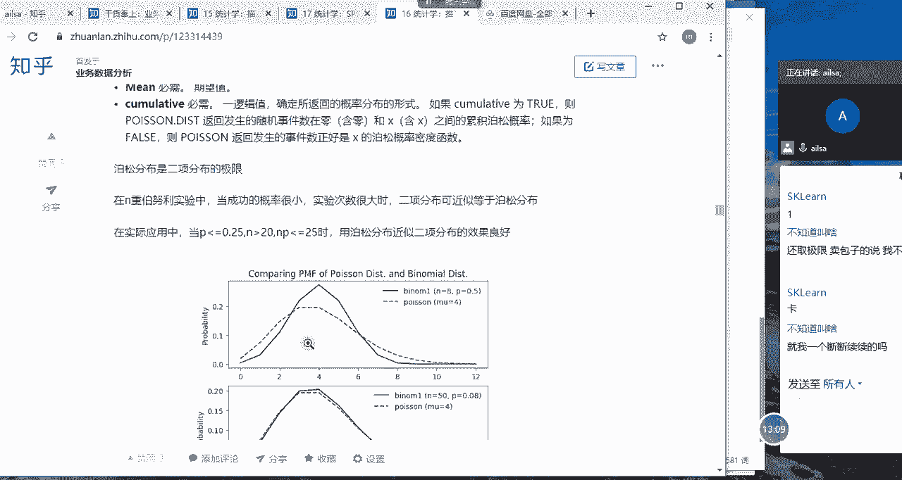

# 强推！这可能是B站最全的【Python金融量化+业务数据分析】系列课程了，保姆级教程，手把手教你学 - P85：05 泊松分布 - python数字游侠 - BV1FFDDYCE2g

我们接下来看嗯泊松分布，泊松分布的话，它是指在持一定的时间范围内，或指定的面积或体积内啊，某一事件出现次数的分布哈，我们看它有一个限定条件，就是在一定时间范围内或指定的面积或体积内。

某一事件出现的一个次数的分布，我们一般情况下，就是在一定的时间范围内来去研究这个事情，那它们所对应的随机变量的概率分布啊，我们就叫做嗯泊松分布啊，那你比如说在我们的实际工作当中。

有哪些是符合泊松分布的呢，你比如说某个企业中，每月某设备出现故障的次数，那它这个就属于指定时间范围内，某一事件出现次数的一个分布对吧，他这个时间范围是每月，然后这个事件呢就是说出现故障啊。

设备出现故障这个事件，然后它的分布呢指的是出现呃，设备出现故障次数，这样对应的分布就是泊松分布啊，那还有就是单位时间内，比如说呃，呃早上08：30到晚上到上午的12点钟诶。

到达某服务台需要服务的顾客人数，这个的一个事件的话，它也是符合泊松分布的啊，那接下来我就给大家举一个实际的例子哈。

假设哈假设咱们班啊，咱们班某个学生的婶儿婶儿，然后他开了一个包子铺哈，生意还不错，然后呢有一天啊就去他们家买包子，然后看到婶儿就一一筹莫展啊，问啊啥原因啊，啊原来是因为包子铺啊，六点到十点钟营业啊。

这是一个时间段哈，但是呢这一周啊就出现了很不好的情况，前两天呢包子蒸少了，不到八点就卖完了，那你说咋整对吧，人来一买没没卖的，一来没卖的，不是耽误做生意嘛，那后来呢吸取了教训，又觉得说啊又增多了哈。

这恐怕卖不完哎那他挣多了之后呢，他就没卖完，没卖完之后呢，你放着第二天，比如说是夏天，你放到第二天呢，它就不好吃了，不新鲜了，对不对，那你说现在这个婶儿啊给你提出了一样，这个疑问。

就是说你到底啊早上六点到十点钟，我们到底蒸多少个包子合适呢。

大家觉得我们应该蒸多少个包子合适，假设这是我们的数据，周一是30，周二是周一卖了30个，周二卖了70个啊，周四卖了，周三卖了40个，周四卖了60个，周五卖了50个，同志们，现在现在轮到大家出力的时候了。

作为一个对吧，大学生啊，家里人经常说，作为一个大学生，连这点东西都不知道吗，来来大家猜一下，我们不用我们不用盲目的去猜，我们就算一下唉，我到底取哪个值和值，到底是取最大值呢，还是取呃，就平均值呢。

还是取四分位数当中的75%那个数呢，我应该怎么嗯，怎么就是蒸多少个包子合适才能够进，不影响我做生意，然后也不至于哎我这个包子，剩下来同志们说出你们自大胆，说出你们自己的想法，假设就这么多哈。

假设就这么多，我让你大致估算一下，因为我们在统计学上啊，你样本量少的话也是可以估计的，只是说准不准的问题嘛，现在我就要求你不用不用特别准啊，但是你至少呃就这五天当中，你至少能满足四天吧，对不对。

我们可以不考虑结果，或者说你把你的想法说出来就可以，你这明显就是在找茬，自己算不出来还找啥，60为啥60咋算出来的，猜的估计的，没毛病啊，首先啊我们面你看只有建好一个人跟我互动。

其他人呢其他人是有其他人是不听课了吗，呵好OK我们看一下哈，面对这样的一个数据的话，嗯呵面对这样一个数据的话，我们首先想到的第一个啊，就是说我们就首先想到第一个，就是我们最熟的就是均数嘛。

我们就用均数试试呗，哎我们一算平均值是50个，我用50个，我们看一下，我们用50个的话啊，周二没有满足，周六周四没有满足啊，一一周五天有两天都没有满足，其实不太好。

对不对，这个数据不好，那我们该怎么办啊，有的人说啊。

呃那我们我们想一下哈，我们结合我们今天学的这个知识哈，叫波松分布在一段啊。

我们想一下哈，在一段时间范围内呃。

某个事件出现次数的一个分布啊，那我们该怎么来计算的呢，它的原理是这个样子的啊，我们结合这个实例去讲哈，那我们现在把这个时间段哈当成一段距离啊，然后每个包子的命运呢在这个时间段当中啊，大家现在想象一下啊。

这个包子是灵是有灵魂的啊，然后每个包子的命运只有两个啊，只有两个结果，要么卖出去了，要么没卖出去，对不对，那我们可以把六点到十点这个时间段，当成一条有长度的线啊，假设分成20等份。

假设在每个时间段上放一个包子啊，要么卖出去的，要么没卖出去，类似于抛八次硬币啊，啊抛八次硬币，然后要么出现正面，要么出现反面啊，这个时候他既然是只有两个结果，而且每一个boss的命运跟其他孢子没有关系。

对不对，那说明它是独立的，所以我们就可以用二项分布来进行一个计算，那也就是说在这20个县商中呃，在在这个20等份当中，20个包子哈，20个包子当中，然后剩下的没卖出去。

那就是C20乘以卖出去的一个概率的七次方，再乘以没有卖出去的一个20-7，这样的一个概率，对不对啊，这个能听明白吗，我们就把它哦分解成是我们的二项分布啊，如果能听明白，这个给我扣个一。

我看一下大家都在不在线哈，可别放假了，太浮躁也不行啊，哦怎么只有两个人，其他人呢，睡着啦，三个人我就等一下啊，只卖20个包子，假设我们不是分成20等份吗。

20等分OK哈，OK那接下来我们把这个20啊给它量化一下，我们不用20了，我们用N啊，假设我们把这个时间段内分成N等份哈，因为我们要想一下公式，它要具有一定的适用性，你不可能写死，对不对。

假设我们啊分成N等份，就是CN7乘以P的七次方，再乘以一减P的N减七次方，对不对啊，那这个时候就用到极限的一个想法了，就是说我们把这个呃N呐，这个N无限的啊无限的一个划分等分，就是呃这个N无限大哈。

就是把时间段越划分的越细越好，并且计算这个时间段内卖出K个包子一个概率，OK现在我们把N和七啊，把20和七全部都替换了，替换成N和K，然后乘以P的K次方，再乘以一减P的N减K次方。

这样的一个卖出去K个包子的概率，就是这样一个结果啊，这样一个结果，那针对于这样的一个结果的话，我们接下来就进行了一步一步的推导哈，这个推导我就没办法给大家讲了啊，大家只要明白就是一个点。

我们在这里啊进行了一段时间段的一个呃嗯嗯，等时间段划分的一个等份，然后对它进行一个极限的一个计算，然后最后最后最后得出来这样的一个公式啊，然后我们计算出来，假设每天准备65个包子，然后可以卖。

就是可以满足整个的一个概率为98。2啊，也就是说我们如果每天准备五六十五个包子，可以满足啊，它满足的这样的一个概率为98。2，也就是说可以满足大部分的一个啊，一个情况下还敢还取极限，卖包子的时候不卖。

这对就是，然后那你如果说你整个的一个估计的一个，结果值，能够达到98。2，这样的一个呃一个结果的话，说明你嗯就是还是算蛮准确的了啊，说明你准备65个包子还是不错的啊，没有关系哈。

那这就是我们在数学上的一些推导，如果大家有兴趣可以回去看一下，因为极限这个东西老师研究的也不是特别深哈。

那我们嗯通过这个excel当中啊，我们也有自己的函数叫哦，你看是不是叫泊松啊，泊松点dist啊这样的一个计算结果，然后我们把我们的65，就是我们最终啊得出来的这个准备多少个包子。

然后这个B8呢就是我们的平。

我看第八是我的平均数啊，最后一个是我们的显示的一个样式，然后得出来它整个的一个概率值是0。98啊。

来我们计算一下哈啊期望值哈，这期望值来我们把这个好没有数哈，来我们看一下。

我们直接在这里看哈，OK那我们这个啊这个我们写成他的期望值啊，期望值是50啊，来我们再看一下是0。983，然后我们再看一下它每一个参数的组成部分，第一个就是我们呃就是估算的，假设的那个多少个包子。

第二个就是他的期望，我们也可以称之为均值哈，期望是在概率啊，或者在随机事件当中啊，他所得到的一个均值啊，啊它跟均值有点像，但它不是啊不是一个概念哈啊然后最后一个啊，最后一个我看一下我的笔记里面写什么。

最后一个是逻辑值所返回概率分布的形式啊，如果为true啊，然后折是返回在啊啊它整一个累积的破损概率，如果为false啊，那正好是X的一个啊，概率密度也就是跟我们上一个差不多啊，一个是累积的。

一个是正好啊这样的一个结果，你比如说我们的X不是65吗，那如果你要选的啊，这个选的是true哈对吧。

这个写的是true对吧，这个不用去啊，不用去太过于研究它哈，如果你写false，等得了，我们看试一下false，时间就刚好是65，是这意思呗，啊false概率密度函数啊，报错了啊，这个不对啊。

啊没有写完，OK啊，这个就不对了，这应该是处，嗯累积啊，累积我们的一个分布函数，0。98。2好啊。

那我们总结一下整个泊松分布的话。

它其实就是二项分布的一个极限，也就是说嗯也就是说在N重伯努利实验当中，当成功的概率很小，实验次数很大的时候，二项分布可接近于泊松分布哈，它就是二项分布的一个极限，这个理解起来稍微是有点费劲哈啊。

但是嗯大家知道就可以了，然后这个说实话，这个坡松泊松分布和泊松分布在工作当中啊，好像比二项分布用到的还要少啊。

也不多啊，然后我们可以看一下，我们可以看一下它的一个分布，还卡是吗，OK哈。

