# 强推！这可能是B站最全的【Python金融量化+业务数据分析】系列课程了，保姆级教程，手把手教你学 - P86：06 正态分布 - python数字游侠 - BV1FFDDYCE2g

同志们，我们刚才介绍的是，我们的一个离散型随机变量的概率分布，那接下来我们就讲，连续型随机变量的概率分布哈，那连续型随机变量概量概率分布呢，它主要比较著名的就是正态分布哈，那正态分布又叫高斯分布啊。

是由德国的高斯提出来的，但是呢在同一时期，法国的拉普拉斯啊，他也提出来过，但是由于人家没有他名气高，所以说很多时候还是被叫为高斯的分母哈，高斯分布还认为是高斯提出来的，不过这个咱们知道就行了哈。

唉啊咱们知道这样有他就是拉布拉斯，曾经也提过拉布拉斯也是一个非常厉害的啊，厉害的角色哈，他也提出了其他的一些理论啊，嗯嗯嗯我们看一下，我们看一下整个的一个正态分布，它是什么个样子哈，什么叫正态分布。

我们讲这个理论之前，我先问一下大家啊，大家知道，如果说现在我想统计一下，我想统计一下啊，中国全中国啊，所有男性的身高啊。

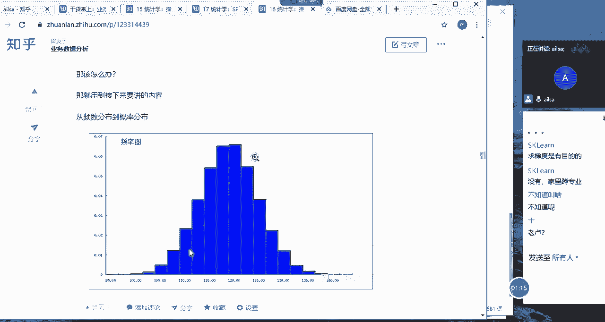

所有男性的身高，现在我截个图哈，好，所有男性的身高，身高，然后大家觉得说啊，大家觉得说那个就是因为它有一个范围嘛，它的范围大概就是1米6啊，我们假设我们就不统计特别小的这个，1米6到1米9之间。

那在这个范围当中啊。

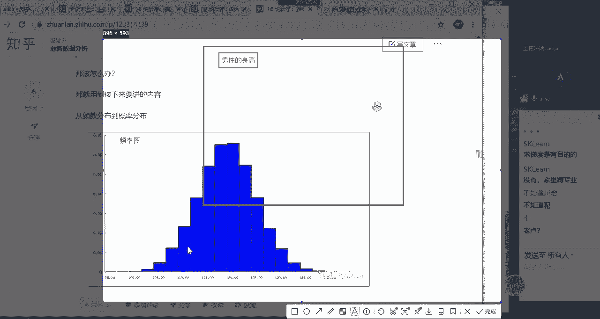

在哪个区间内，它的嗯它的整个的一个值占的比较多呢，啊不是费米问题哈，就是如果说我想统计啊啊就是全中国的呃，所有男性的身高，那大家觉得他会在哪个区间范围内，会站得比较高一些，就是比如说人经常说哎呀。

我一般个儿啊怎么怎么着的时候，是不是大致就是在嗯在175和180对，171 1米7到1米8啊之间，这一呃这一个身高占的人是比较多的，对不对对吧，那你再比如说啊，你再比如说人的智商哈，智商啊。

我们看一下智商哈，智商是从假设从55~145啊，这样的一个过程，基本上大部分人都是100左右，是不是啊，是不是这样子，85啊，85~115之间，大概也就这个水平，对不对，是不是这个意思，同志们。

同志们是是吧，那说明什么问题呢，就是说呃就是我们就是我们经常在说，就是大众啊，大众化，比如说我的身高是1米6，那我就说我属于一般个儿，因为很多人的身高基本上都是1米1左，1米6左右的一个范围啊。

那正态分布其实它就是什么意思呢，就是说它嗯它就是中间这一部分占的比例很高，然后两边低。

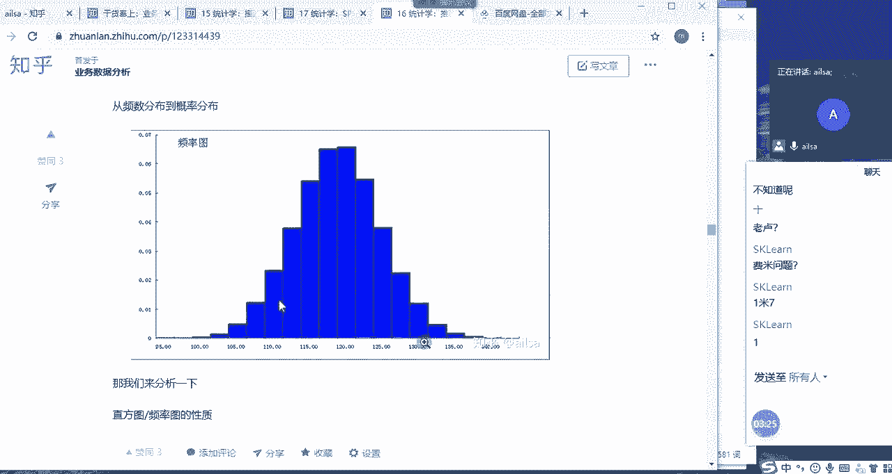

然后呈现一个中的形状啊，呈现一个中的啊啊，呈现一个中的这样的一个形状啊，这样的一个形状，然后我们就把它称之为正态分布，那正态分布的话，在我们的生活当中工作，当中以及方方面面，它都体现得淋漓尽致啊。

包括我们的智商，我们的身高，我们的生活水平，基本上大部分人都是位于中间这一块儿的，你比如说我们的生活水平，谁能说谁家比谁家嗯，就是好多少嘛，其实大部分都是一般家庭，那你比如说像这种啊。

像偏离这边的一些地方的话，真的有吃不起饭的吗，啊也少对不对，也特别少，现在啊，现在在中国应该有很少的乞丐或怎样的吧，都比较少，那你比如说有些妇道流油的，类似于马云这种角色，那是不是也比较少啊，对不对。

那大部分的人还是说有着房贷的压力，有着车贷的压力，然后有小孩，然后日常的有一些存款，但是也不多对吧，但是呃想出去玩的时候也是有钱的，这样的一个生活状态，位于中间这个水平，对不对。

这就是属于我们正态分布的一个规律，也就是说中间居多，然后两边居少，那他这个怎么去展示的呢。

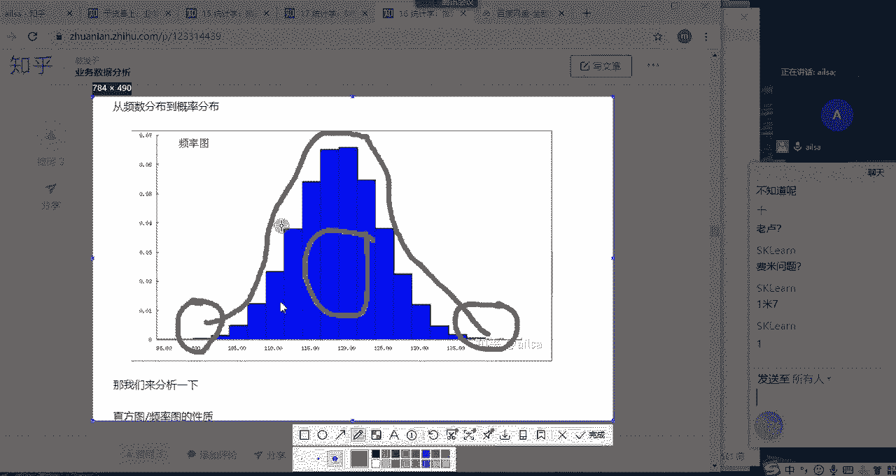

就是啊他这个呃连续型啊，我们再回到我们这个一个连续型，这个随机变量哈，连续型随机变量我们肯定是想计算它的概率的，那它这个概率是怎么来计算的呢。

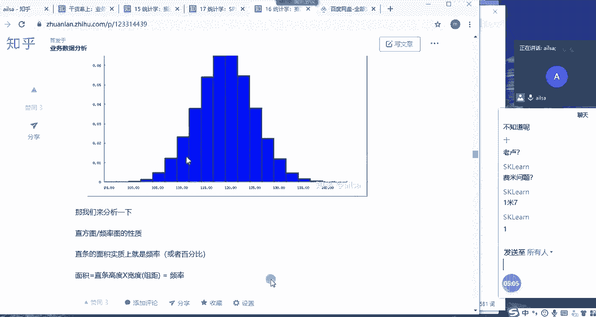

假设我们先看一下离散型随机变量的概率哈，离散型随机概氨根，是不是它如果数据量足够大的话，他是不是也符合正态分布啊，也就是它在这一个点，它在啊，他在这一个点啊，他在指sorry哈，它在这个点啊。

它在这个点上，它的概率对应的啊，对应的这个Y值是多少，对不对啊，Y值是多少，然后如果说他现在是离散型随机变量的话啊，不对，是连续型随机变量的话，那它取到每一个点的值都是有可能的。

如果说你想精确到某一个点啊，某一个点的概率的话，它其实只能是零，因为它取到每一个点的概率都是有可能的，所以说我们没办法精确到每一个值，因为它是连续性的，那我该怎么办呢，其实我们可以取到一个区间，对不对。

我们取到这个区间，然后去计算它的概率就可以了，那这个区间这个概率又该如何去计算呢，我们可以啊转化一下呃。

网还OK吗，啊网还OK哈，那我们可以转化成什么呢，我们可以转化成面积啊，你比如说这是一个直方图哈。

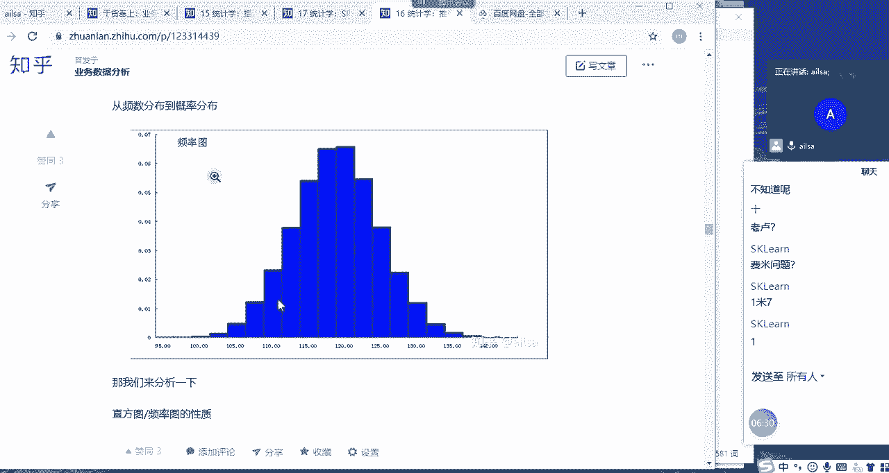

这是一个直方图。

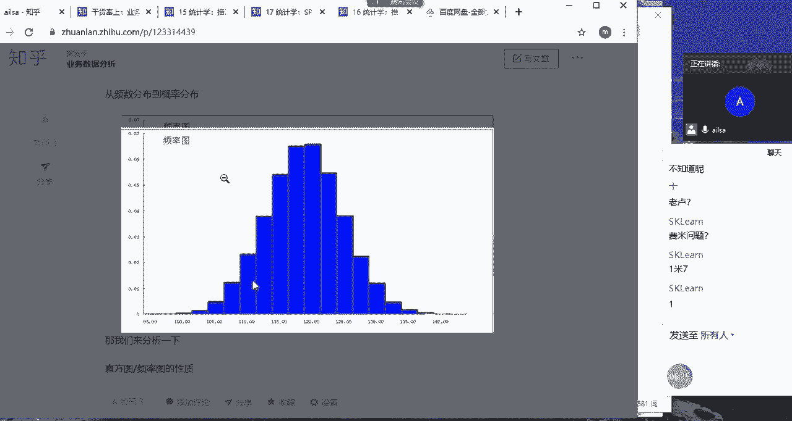

唉唉你比如说这是一个直方图，然后这这代表的是它出现的一个个数对吧，出现了一个个数，然后直方图这个的是一个长方形对吧，长方形的话，它代表我们可以通过面积进行一个计算，它的面积等于它的宽乘以它的长。

因为我们是绘制好的图形，所以说的宽是一样的，那长就代表它出现的次数对吧，哎那么汇入这样一个直方图之后，我们就可以知道，大概在110多到120之间，它出现的次数频率是非常高的啊。

那如果说我们想计算它出现的一个概率的时候。

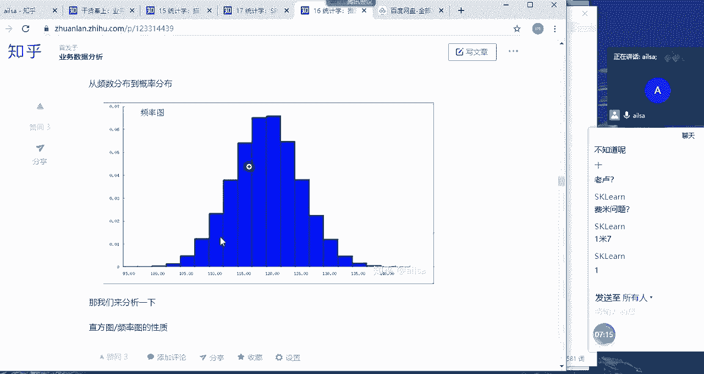

我们可以假设成这样，我们可以假设啊，稍等啊，我们可以假设它啊，我们把这个假设，我们把这个呃长方形分得足够细，足够细足够细，就是分的等块足够细啊，极限型的啊，它可能就可以连成这样的一个面积图啊。

连起来连成这样的一个面积图啊，然后假设我们把它的面积定为一，假设把它的面积定为一啊，0~1之间的这样的一个面积，然后如果说我们想计算，如果说我们想计算啊这一部分啊，这一部分的区域。

这一部分的区域的一个概率的大小的话，我们就可以通过计算它的面积来进行实现，那这种方式的话，就是我们计算连续型随机变量的一个，概率的方式啊，大家这个听明白了没有啊，我们只要通过计算分面积来计算它的概率。

你比如说整体是唯一的，这个面积占了整体的啊，假设啊占了整体的啊1/6，那它的概率就是1/6这样的一个结果啊，大家能听明白吗。

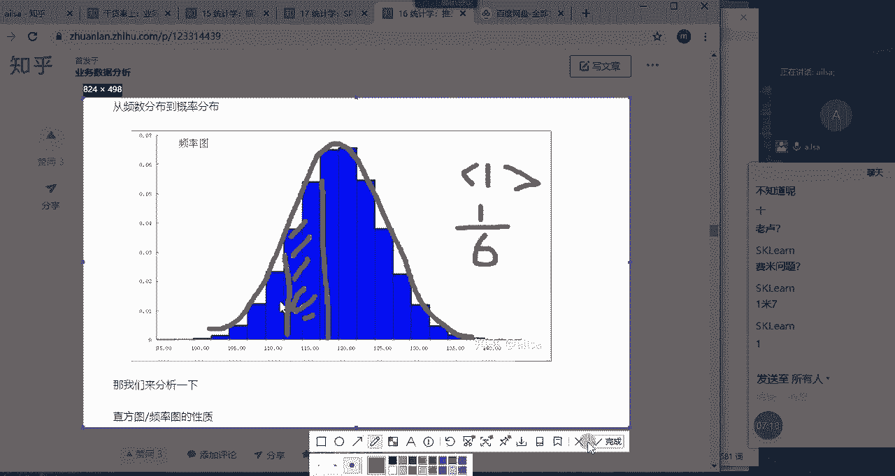

能听听明白，给我扣个一，能听到能听明白哈，相信我们在大学的时候也都提到过，这个正态分布，以及我们的连续型随机变量的一个，计算概率的啊这样的一种方式哈，那我们再接着往下走哈，啊接着往下走啊。

那我们呃就是如果说他啊，因为嗯我们默认如果默认它符合正态分布的话，我们就把它记作为X服从正态分布啊，什么样的正态分布呢，就是均值为缪啊，方差为西格玛平方这样的一个正态分布，我们就继承它为这样。

那它既然是一个正态分布，就是我们通过它分布的一个规律，来给大家总结出来，它有这样的一个这样的一个分布形状啊，那我们它也有它自己的一个公式，我们可以通过公式来去计算它的概率对吧。

那它的公式是它的公式是什么呢，它公式还很复杂，我应该没有放哈，完全没有放，那大家想一下我们每一个正态分布的话。

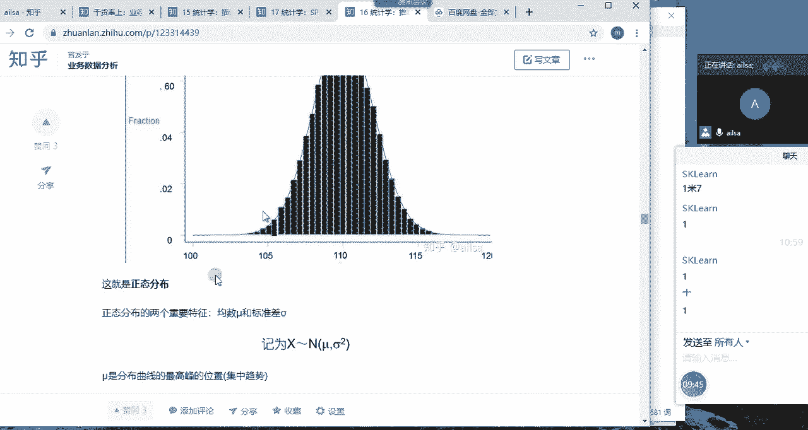

它对应的均值啊，它对应的均值是不是都不一样啊，啊我们看一下啊，它对应的均值，比如说这里是这个啊，对应的均值是这个，然后它的离散程度大概是这样的一个形式，那换下一个换下一个标，换下一个正态分布的时候。

它大概也是成这样的一个形状对吧，但是它的均值就发生了变化，它的一个呃方差也发生了变化，我们要进行一个重新的计算就比较麻烦。

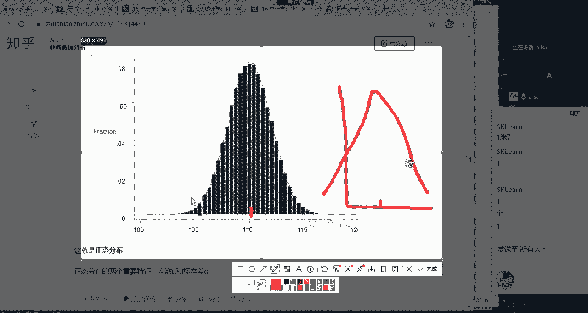

这个时候我们就提出了，它既然符合正态分布，我们何不把它简简化一下，简化成标准正态分布，那什么是标准正态分布呢，就是啊我再来画一个图哈。

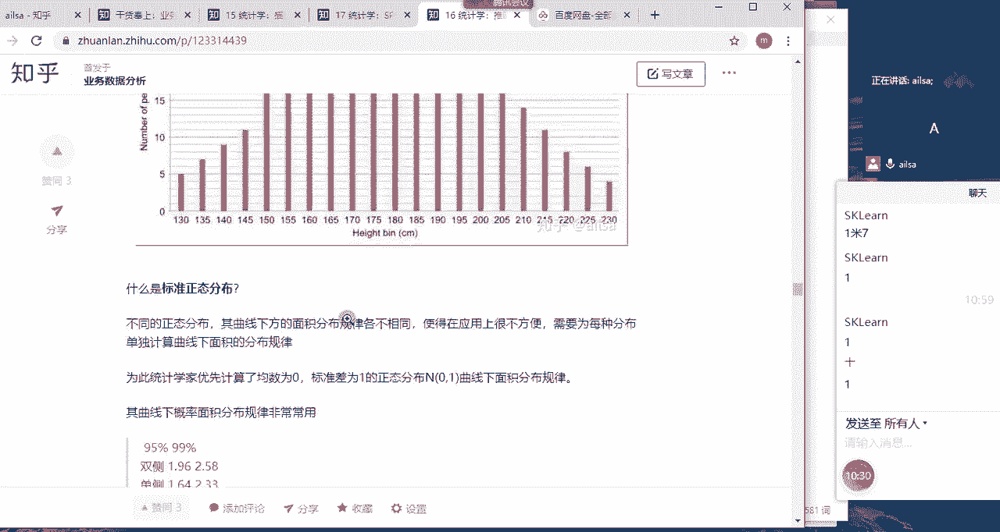

标准正态分布，就是假设我们原来的正态分布是这个样子的啊，这是我们的X轴啊，这是我们的Y轴啊，我需要画长一些啊，那假设我们的正态分布之前是这样的哈，画得比较丑哈，这样的话是比较这样的。

然后我对应的整个的一个X也就我的均值，它的中间这个位置，比如说是就是三嗯，然后它的方差啊，大概是比如说还是16，然后这样的形式我有很多个这样的一个形态，分布在不同的地方，我在计算的时候都要分别进行计算。

那我何不把这个啊把这个标准正态分布挪一挪，挪到这里嗯，挪到这里把它变成，把它的均值变成零啊，把均值变成零，然后标准差啊，方差哈变成一变成一，然后这样的话，它就符合我的标准的正态分布了啊。

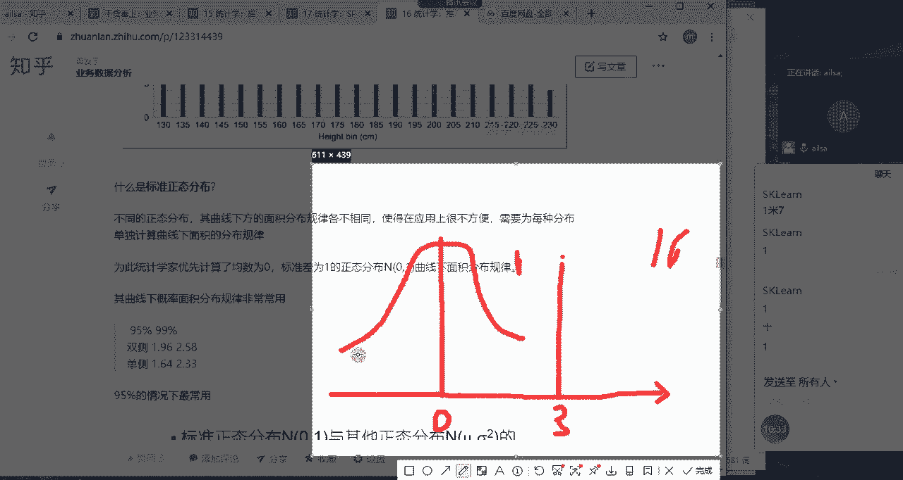

我们就把它转化成标准的正态分布啊，也就是X减去mu啊，那X呢就是我们对应的我们对应的那个呃，我们对应的那个根，我想想啊，稍等啊啊这是我们的一个标准正态分布啊，X就是我们那个均值哈，均值啊。

然后缪就是我们的标准差啊，标准差这么一个计算出来之后，让它服从啊，嗯服从我们的均值为零，然后标准差为一的啊，为方差和标准差其实是一样的哈，唯一的这样的一个标准正态分布，就达到了我们所想要的一个效果。

那基于这样的一个标准正态分布，我们在进行其他值的计算的时候就比较方便了，因为大家都大家都统一了嘛，啊对吧，是这意思哈，大家都统一了，然后我再进行计算的时候就比较方便，那对于这个呃标准正态分布啊。

我们看到这有一个95%的双侧，个体的一个参考范围啊，其实呃它是呃它是我们后面再讲哈，它是我们的Z值哈，Z1。96啊，对应的95%的，OK啊，那标准正态分布大家听明白了没有听明白，给我扣个一。

啊可能这一块讲的稍微是有点不是逻辑，不是特别清晰哈，希望大家哎呀，不好意思，我们再看哈，嗯这个也是我们标准正态分布的一个例子啊，来我们看一下吧，我们看一下举个例子哈，我们是如何根据正态分布。

计算我们的区间范围的哈，嗯首先唉我们看一下某个零件的长度，服从正态分布，然后平均长度为10mm，这个就是我们的平均值，然后标准差为0。2，问从该零件中随机抽取啊，正态分布的怎么说呢，没怎么用啊。

我只能这么说，没怎么用，可能是我的工作上用到统计者的话，会用到假设检验部分，但是这一块的话只是一个理念和想法，但是面试的时候会问啊，所以说大家还是要了解一下，从该零件中随机抽取一件，其长度不到9。

4mm的概率是多少，我们先分析一下哈，就是说我们有一个啊有一个数据。

它的啊它的平均唉，我们画个图哈，大家不要着急哈，它的平均平均啊长度为十，我们想一下我们这个零件的长度，平均长度为十，代表大部分的一个长度都在十左右，对不对诶，那它的标准差是0。2，代表它的离散程度。

假设假设是这样的，哈哈画太丑了啊，画太丑了，唉假如是这样的哈，大家理解一下哈，稍微往这边挪点啊，对往这边挪点啊，啊这个一还在吗，唉没关系了啊，假设唉它的平均长度是十，标准差是0。2这样的一个东西。

然后他现在想问你啊，这是我们的概率哈，这个面就代表这个概率，然后他问你其中长度不到9。4啊，比如说我们取一件一件，它的长度不到9。4的概率，那它应该是这个十在这，假设9。4是在这哈，假设9。4是在这嗯。

9。4是在这，他想问你的是就是不到9。4的话，我们把这个图在啊，不到9。4，也就是小于9。4这一部分的概率是多少，是不是不到9。4啊对吧，就从零开始，然后得得得到十是中间值，然后往上等等。

是这这些的个意思哈，我们要计算的这个面积是多少对吧，OK大家对，对于这道题听明白了没有。

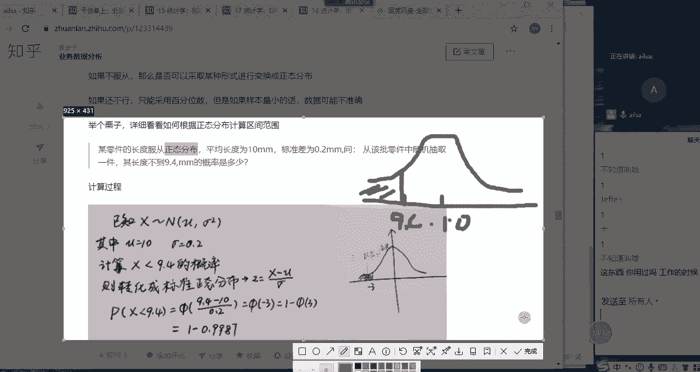

同志们，我们现在要求的就是这一部分的面积嗯，这一部分的面积，因为我们说它服从正态分布，不就是为了想计算它的面积吗，因为它如果服从正态分布的话，我们把它转成标准正态分布之后。

我们就可以求它这个概率是多少了啊，这个题目听明白了没有听明白，给我扣个一，OK那我们看一下我们怎么去计算哈，我们怎么去计算这个概率，然后我们先把它啊，我们先把它转化为标准的，你看主要是计算X小于9。

4的概率，然后我们的均值是十，然后我们的嗯标准差是0。2，我们先把它转为标准的正态分布，也就是先把我们的呃我看一下哈，我们的X啊，减去我们的均值，然后除以我们的C啊，除我们的西格玛。

把它变成一个标准的正态分布啊，然后这是根据我们的标准正态分布表，来计算出来的，然后大家现在啊，大家手里应该没有标准正态分布表哈，我告诉大家，现现在大家打开excel啊，现在大家打开excel。

我教大家如何做啊，算了，我把这个表发给你们，把这个表发给你们吧，你们啊我们的时间有限哈，啊应该放到桌面了啊，应该这个文件，来同志们把这个表打开，我们看一下怎么去找，哎我们对应的这样的一个呃值哈。

那我们也可以用excel去做哈，好大家，如果打开了这个表之后，我们就看一下，打开这个表之后，然后我们看一下哈，首先我们计算出来这个Z值哈，我们打开excel表，这个啊，哦没有打开，OK我们首先呢。

要看标准正态分布表的一个概率值，我们要求它的概率对不对，那我们先看我们计算出来的Z值是多少，Z值是三，对不对，唉我们找一下三啊，三对应的三对应的概率哈，现在我们把数据冻结一下啊，视图然后拆分对吧。

然后冻结窗口，OK那我们看一下三对应的啊，对应的是0。9987是吧，0。9987，这个三其实是它的Z值哈，因为我们转成了标准的正态分布，三对应的是Z值，然后它对应的概率是0。9987。

然后我们通过1-0。998G，得出来的概率是0。0013，也就是说我们啊如果说从零件中随机抽取一件，长度不到9。4mm的，概率是0。13%啊，也就是非常小的概率，说明可能性不太大啊。

就是这个地方可能性不太大，这就是我们计算好计算正态分布的一种方式，首先我们要把它转成标准正态分布啊，然后我们再对它进行一个Z值的计算啊，最后得出来它整个的一个概率，同志们这个听明白没有啊。

我们这个X就是我们的9。4哈，9。4，然后我们的均值是十啊，相当于是什么意思呢。

来我再带大家走一遍哈，啊你看一下啊。

我这个时候稍等啊，画个图，别着急哈。

我们把这个东西讲明白就可以了，因为这个正态分布还是啊比前，至少比前面两个都重要一些哈，OK现在哎我画个，我用这个吧啊，刷子是什，OK现在我画一个横坐标，画一个纵坐标好吧，哎你上来画一个纵坐标AKOK哈。

纵坐标横纵坐标，这是X啊，这是Y啊，原来的结构是什么样呢，原来的结构是这样的，啊原来的结构是这样的，然后这个是对应的是十，现在是十，然后我们看一下9。4是不是在这个位置啊，啊在这个位置。

然后我们想计算一下小于9。4啊，如果说你随机抽取一个呃一个零件，它小于9。4mm的长度的这样的概率，也就是说啊这个面积的一个概率是多少啊，相对来说会比较小一些，对不对。

那现在呢我们要把它转成标准正态分布，也就是说我们要把这个东西移到啊，这个均值移到中间，那也就是说我们换一个颜色哈，换一个粉色，我们把它移到这个地方啊，假设我们把它移到了这个地方。

那这个时候十是不是从十变成了零啊，它相当于是减少了十，对不对，那9。4它相应的要跟着他的图发生变化，比如它变成了这里，那应该他这个值应该等于多少呢，它减去了十，它也要减去十，所以说是9。4啊，减去缪啊。

就是减去均值，减去十得出来的一个结果对吧，得出来一个结果之后，然后它的标准差，标准差要变为一，因为标准正态分布是均值为零，标准差为一，我们如何让它变成一呢，就是除以它自己的一个标准差，西格玛啊。

也就是0。2，那它就会呃归一化进行一个处理了，这样我们就得出来唉，我们的整个的一个转化后的啊，这样的一个结果，这就是对应的Z值，也就是说这个值啊，你移动到这边之后，它对应的值。

然后我们把这个标准正态分布，还有一张表，也就是它对应的Z值是等于三的话，我们就从这张表当中去找，这个三对应的概率是多少，这个时候我们查出来是0。9987，但是它是负的，对不对，但是它是负的。

所以我们这边应该是一减去啊，就是就是这个这个符号，然后三它就等于一减去这个值，那我们得出来是1-0。9987，得出来就是0。0013，大家这个听明白了没有，我给大家把原理讲了一下，同志们啊，如果听明白。

给我扣个一，嗯听明白了哈，确定是听明白了啊，我们为什么要用这个公式，就是因为我们要移动它，然后再把它变成嗯归一化，这样处理说要除以他们的标准差啊，这样的一个结果，这就是我们的一个公式的来源啊。

我们的计算的话，我们是通过大家看我那个公式哈，大家看我这个表，然后我们这边是通过啊normal啊，norm点S点DISS，然后来实现的这个结果，他这个表是怎么来查的呢，跟大家说一下啊。

你看标准正态分布有两个表，对不对，两个表极其的像，一个是查概率值，一个是查Z值，这个是根据ZZ值啊，在这写哈，根据根据Z值啊，Z值其实是没有太大意义，只是你转化为标准正态分布之后对应的X值哈。

根据Z值差概率啊，差概率嗯，也就是这个Z值，就是刚才我画图这个地方这个位置它没有，它没有太大意义，但是你可以根据这个去计算它这个概率啊，然后根据Z值查概率是怎么查的呢，我们刚才的是不是三呢，我刚才是三。

所以直接对应的是这个，但是你这个0。0010。020。03，是什么意思呢，就是说有时候我们查出来的位置啊，不是三点整，比如说是33。3A3。03，如果它的Z值是3。03，我们就这么去找，先找到三。

然后再找0。03哎，是这个值，那所以说它对应的就是这个值，这个就是它的概率啊，明白了吗，那我们经常说的1。96，我们看一下哈，1。961。9，然后0。06放在这哈，这它对应的就是0。975，也就是说1。

96这个值，它对应的就是0。975的这个概率，这我们在正态分布当中百分之啊，5%啊，两边分别取5%，这是我们假设检验啊的一个啊区间，估计这样的一个值啊，是非常重要的，这个是根据我们的Z值查概率。

然后呢我们还可以根据我们的概率查查Z值，你比如说我们还拿0。975来举例，0。97597在这，然后再找一个0。05，也就是它的尾数加上它，然后就等于它对应的Z值就是1。96，看到没有，它俩是遥相呼应的。

也就是说一个是根据啊，根据啊根据概率查Z值哈，我们有时候他会给你给你概率值，然后让你告诉你Z值是多少，然后有时候会呃你计算出来ZZ值，让你查概率值啊，大家这个听明白没有，听明白，给我扣个一。

很多人刚开始查的时候应该不会哈啊，这个呃这个一讲应该也就会了，其他人呢，其他人思勉听懂了吗，嗯好的好了，这就是我们的标准正态分布，那在这里面的话就会有一个啊，就会有一个那个什么呢。

就是我们称之为一个标准误差，两个标准误差，三个标准误差的一个区间范围，这个是一个常识性的东西哈，你比如说在一个标准误差内，它是有涵盖了68%的，这样的一个结果值，那在两个标准误差也就是1。96哈，1。

96它就含了盖了95%的啊，就是95%这个东西大家一定要记住哈，因为我们的置信水平啊经常是95%哈，所以说它是大概1。96，大概等于二嘛，所以是两个标准差，然后如果是三个标准差的话，它大概涵盖的是99。

7%，这样的一个概率范围，唉知道这个就可以了，还知道这个就可以了啊，所以我我们刚才举的是975，975，是因为它是涵盖了95%，95的话啊，就是两边各零点啊，0。025啊，这样达到的一个结果啊。

明白这个就可以了哈。

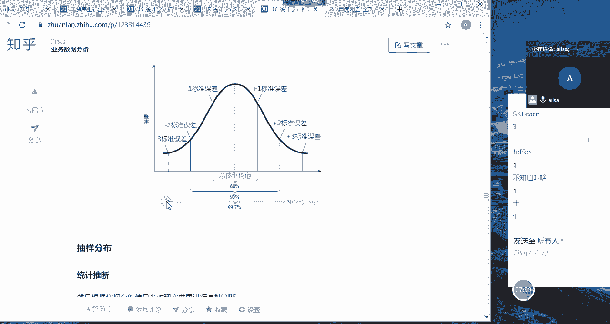