# 强推！这可能是B站最全的【Python金融量化+业务数据分析】系列课程了，保姆级教程，手把手教你学 - P90：03 抽样分布 - python数字游侠 - BV1FFDDYCE2g

OK那我们进入到我们今天的第一个内容，抽样分布哈，嗯那啊来打开我的啊，哎我们之前还讲了二项分布和泊松分布哈，等下去恢复，我们看一下，今天要讲的是我们的抽样分布的内容，稍等啊，到哪抽样分布哈。

哎呀好像有点问题啊，我看看嗯啊没有没有抽样分布，其实啊其实什么意思呢，你看我们有说到推断统计，它其实就是根据样本数据，然后去推测总体数据，那在这个过程当中哈，那我们在对对数据进行一个抽样啊。

抽样的这样的一个操作过程当中，他这个它这个过程也是有规律的啊，所以说我们会它这个规律呈现的一种分布，我们就叫抽样分布，嗯啊是这个意思，然后我们啊我们上节课讲了中心极限定理，我们等一下回过头来再讲。

然后我们先看啊我们的一个分布哈，那我们知道哦，就是从呃不管是抽样分布还是我们的概率分布，就是整个的一个呃分布特征上来说的话，就是所有的啊分布，就会最终都会呈现一个正态分布的一个效果，对吧，比如正态分布。

然后如果说它整个的一个变量，是呈现正态分布的，我们就可以把它转化为啊，标准正态分布这样的一个东西，那由标准正态分布，我们可以推导出来其他的一些分布，就是卡方分布，T分布和F分布。

我们看先看一下什么是卡方分布哈，这些都是理论性的啊，他就是说，如果说你这个随机变量满足了什么条件，然后它在这个基础之上又进行了一个加工，就可以推推出它是符合什么分数分布哈，这样的一个啊一个概念哈。

那卡方分布它主要解决的问题，就是方差相关的问题，我们在后面做方差分析的时候，会提到卡方分布哈啊，卡方分布的一个最终的一个使用，那我们先看一下卡方分布的一个概念，首先他说的是呃随机变量X啊。

一到XN相互独立，且xi啊112345啊服从标准正态分布，也就是说X1X223X四，它是服从标准正态分布的，那如果说他们是符合标准正态分布，这是他们的前提条件，那它们的平方和服从的就是卡方分布。

自由度会N的卡方分布，这就是他们的一个卡方的定义，那我们怎么去理解啊，我们要从以下几个方面去理解，首先这个这个我们就不说了哈，他就是由赫尔默特和卡皮尔逊啊，分别于1857年和1900年推导出来的啊。

所以说它也是一个推导公式啊，啊对吧啊，那它嗯我们假设哈，我们假设X啊是服从正态分布的话，那它服从正态分布，我们都知道它可以转化为标准正态分布，对不对，那他如何转化呢，我们就可以啊使用这样的一个公式。

就是X减去M除以西格玛啊，得出来的这样的一个结果，就服从的是标准正态分母，那我们假设这个东西哈啊我们假设啊。

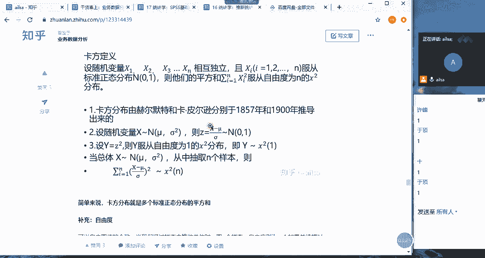

我们假设这个东西啊，它就是X啊，它就是这个X1X2X三，那它是不是就服从标准正态分布，是不是满足了这样的一个条件，那它的平方和啊，它的平方和你看平方和服从的就是卡方分布，因此我们就可以得出来说。

当总体啊总体X服从正态分布，这不是标准标准正态分布哈，这是服从正态分布的时候，那它的啊它转化为标准正态分布的平方，这样的一个结果就服从的是卡方分布，所以说我们可以这么来记啊，就是卡方分布。

就是多个标准正态分布的平方和啊，卡方分布就是多个标准正态分布的平方和，这就是我们的卡方分布，还只要记住最后一句话就可以了啊，卡方分布是多个标准正态分布的平方和，那它是怎么来的呢，我再说一下。

首先唉我们可以先设普通的啊，就是我们的呃样本个体哈，它每一个样本个体X它服从的是一个正态分布，那我们就他既然服从正态分布，我们就可以把它转化为标准正态分布，就是这样的一个公式，X减六除以西格玛。

他服从的是标准正态分布，如果说它服从标准正态分布，那符合我们这样的一个条件，那它的平方和就服从的是自由度为N的，卡方分布，就达到了这样的一个效果，就是我们推导出来的一个结果，那我们总结出来的规律。

就是卡方分布就是多个标准正态分布的平方和，同志们这个听明白了没有。

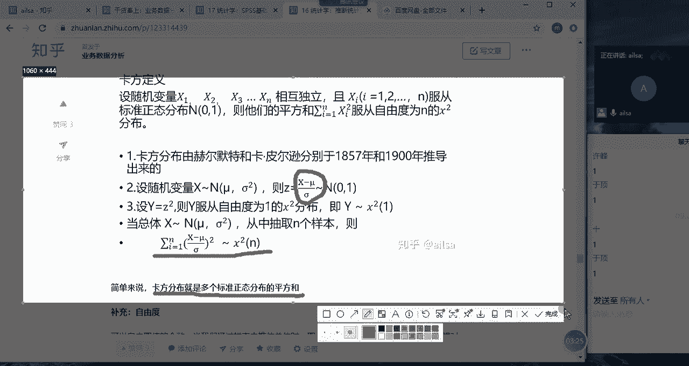

听明白给我扣个一，先这么去记哈，先这么去记，我们用到的时候再给大家进行一个详细的啊，就是啊再说我们该怎么怎么用，其实用的话也是啊，在SSPSI中套一下就行了，嗯嗯OK哈，这是我们的卡方分母。

大家一看卡方分布肯定是平方和哈，平方和啊，就是我们的卡方，因为他加了平方对吧，可以这么去说哈，那自由度我们在之前就已经说过了哈，他就是啊啊它主要是对于样本数据的时候啊，样本数据推推估总体是取N个样本。

自由度就是N减一，因为它有一个值啊，均值是定的情况下，它的自由度就是可以自由变换的啊，样本的个数啊，可以这么去理解，那我们看一下卡方分布的一个特点，首先它是不是平方和呀，对不对，他这个是平方和。

所以说它的变量值始终为正哈，始终为正，然后分布的形状取决于自由度N的大小，因为它这边啊啊他这边有事，我看看啊啊，学以N的大小通常为不对称的一个正片分布，但随着自由度不断增加出。

其实他这句话说的意思就是说啊，就是我们的样本量越来越大的时候，它其实会更啊趋向于正态分数，因为它是由正态分布引进过来的，或者推导出来的这样的一个结果，那它的期望就是N方差就是2N啊。

这是他记记他一下就可以了，那我们看一下卡方分布的一个分布图哈，唉这个是啊，这个是N等于一的时候是这样的一个形态，N等于四啊，这样一个形态N等于十，这样一个形态N等于20的时候，我们会发现。

当N就是因为我们在统计学上定义的是，小于30都称之为小样本，那大于等于30的话都可以称之为大样本，那大样本的话，我们都可以默认它是趋于正态分布的哈，我们可以看到这个结果，当它样本量逐渐增大的时候。

它也是趋于正态分布的啊，这是卡方分布，它都是正的哈，你看他都在这个区间内啊，都在啊都是正的啊啊这是我们的啊卡方，然后我们看一下T分布哈，T分布呢，其实它是呃嗯就是在一个论文当中提出来的。

所以他是一个学生的论文，好像是，所以他是以students s啊，T啊啊T作为比啊作为一个分布的命名了啊，CN的T哈，嗯T分布的话，它也是类似于正态分布的一种对称分布哈。

那T分布呢它主要用于是小样本数据，它跟其实正态分布特别像，他就是说样本量小的时候，你就可以他就是服从T分布，那我们看一下它的定义哈，它定义指的是哈，若随机变量X服从标准正态分布。

你看是不是从标准正态分布引进来的，就是X服从标准正态分布，则随机变量Y啊，随机变量Y这是X，这是Y服从自由度为N的卡方分布，它又从卡方分布啊引进过来，而且X和Y相互独立，那么它就是属于分就是T分布。

它的公式是这个样子的啊，就是啊服从标准正态分布的X然后除以根号下，服从卡方分布的Y然后除以N啊，这就是我们的T分布，那我们可以啊转化一下哈，你看X是服从标准正态分布的，对不对，那Y是服从卡方分布的。

那我们前面讲的卡方分布，它是这样的一个结果啊，就是它的一个标准正态分布的一个平方对吧，那我们可以把Y替换一下，替换成标准正态分布的平方，除以N这样的一个结果，那我们从这样的一个替换过来看的话。

它其实就是啊T分布其实就是标准正态分布啊，标准正态分布除以均方的根哈，什么叫均方呢，就是一组数的平方和的平均值啊，你看这是不是啊，这是不是一组数据的平方，然后它的平均值除以它的N的个数。

所以说啊T分布就是标准正态分布，除以均方的根，主要用于处理小样本数据哈，这是它的公式啊，如果说我们记不住也没有关系哈，其实他这些值都是，如果说是有的话，我们直接代入计算就可以了。

那我们主要掌握的是T分布，其实就是如果说它是小样本数据啊，而且它的样本里面的每一个变量，都服从的是正态分布，那你在还计算另外一些东西的时候，你就可以使用到T分布了啊，它主要处理的就是小样本数据啊。

如果是样本量大于等于30的，都是服从的，是正态分布，都用不到T分布，主要是样本量小于30的时候，会考虑到T分布这样的一个结果，那他的公式就是这个样子的啊，这么去记就可以了，好它没有什么啊。

就是一个分布的一个规律的一个呈现啊，就这样啊，啊我们可以看一下它的它的一个分布的啊图啊，就是随着自由度的增大，自由度就是N哈，那T分布逐渐接近标准正态分布，也就是说不管是卡方分布还是T分布。

以及接下来讲的，接下来讲的F分布，就是说它的N就是它的这个样本量啊，逐渐增大的时候，它也就都是趋向于正态分布这样的一个效果的，嗯那我们看一下F分布，F分布主要是用于均分之比，用来对比两个方差。

F分布的话，在方差分析啊，方差分析和线性回归分析当中都会用到啊，我们看一下，设随机变量Y与Z相互独立啊，且Y和Z分别服从卡方分布哈，分别服用自由度为M和N的卡方分布，则它们的一个比值哈。

则随机变量X就会有如下的一个表达式，则称X服从第一自由度为M，第二自由度为N的F分布，即为这样的一个形式，就是这样的，就是说如果说X和Z满足这样的一个条件，就是他们两个都服从的是卡方分布。

那它们的比值服从这样的，就是它们比值的这样的一个规律，就服从的是F分布对，就是这样，我有没有把大家讲蒙啊，太过于学术了，是不是你们在上学的时候，有没有对这一点有所理解的同志们，没有人理我，同志们嗯。

听得懂吗，啊我们的F分布的话，它这样的一个图形就是这样的呀，这个样子，就是说我们也是随着N的不断不断的啊，自由度的高等会讲一下哈，就是随着我们不断的一个呃呃N的一个增大。

然后它也在趋于我们的一个正态分布啊，嗯F分布主要是用于方差和线性回归里面的，一个啊，就是我们可以根据它如果服从这样的分布，我们就可以利用它这样的一个公式，然后套进去就可以了啊，其实这些这些分布的话。

就是说啊是我们他们得出来这样的结论，是因为他们研究推导过过来的这样的一个效果，而给我们出来的这样的一个结论，就是说如果满足这样的一个条件，你就可以用这样的一个啊分布啊，这样的一个公式。

然后套进来去计算它相关的一些数据，就这样的一个结果哈，自由度是什么呢，稍等一下啊，嗯嗯我这边应该有所补充哈，自由度就是可以自由取值的个数，嗯你比如说嗯你比如说举一个最简单的例子哈。

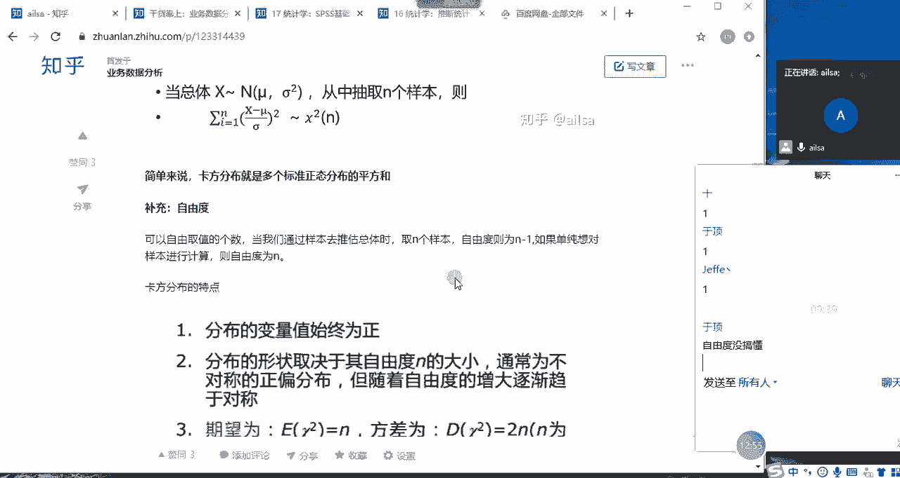

还我们就拿啊，我们就拿我们的嗯，我们就拿我们的方差来说，我们就拿我们的方差来说哈，方差来说，然后我们的方差计算公式，就是我们的每一个X对吧，减去它的均值啊，减下的均值，然后啊假设啊。

假设我们先这么去计算均值的平方对吧，均值的平方啊啊平方，然后除以什么呢，除以啊除以它的个数对吧，这是我们计算，这是我们计算方差的这样的公式，如果说啊如果说我们这个数据是总体数据的话，是总体啊。

现在分就是这个自由度，主要是分总体和样本数据哈的一个关系哈，总体数据如果说它是总体数据的话，我们的自由度就为N，因为你在计算这样一个结果的时候，就是它完全是不受影响的啊。

也就是说呃你可以自由取到的个数就是N啊，就是你的你的总体数据里面，你任意取都是没有关系的，那样本数据好，样本数据是这样子，我们是通过我不知道能不能给大家讲明白哈，样本大家想一下样本，我们是通过抽取啊。

抽取啊，抽抽取抽取一部分数据，然后去推估总体的啊，推估总体的，比如说现在看我们还是计算方差哈啊，我们还是计算方差的话，那这样一个公式啊，这个公式的话嗯它的自由度就是N减一，因为我们有一个值是固定的啊。

就是均值啊，均值啊对于呃样本数据而言，它是固定的啊，它已经固定一个值了，那它自由自由取值的个数就是N减一，我应该是没讲明白哈，我再读一下这句话哈，可以自由取值的个数，当我们通过样本去推估总体时。

取N个样本自由度就是N减一，如果想单纯的对样本进行计算，自由度为N嗯，是因为我们有一个均值是确定的，所以说我们确定了一个值之后，其他可以自由取值的个数就是N减一哦。

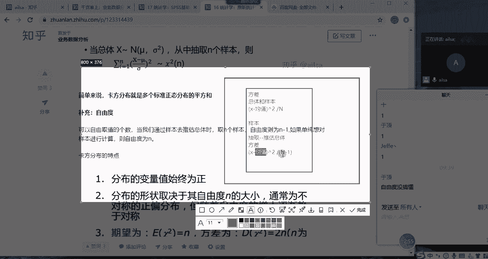

预定有没有搞明白，就是我们在进行啊样本数据和总体数据，样本数据去推估总体的时候，会用到自由度这个概念，其他的就没有啊，就是说你的样本数据去啊去推估你的样本啊，均值的时候是没有问题的啊，你的总体数据去做。

去计算你的总体的均值的时候也没有问题，就是呃就是在这种情况下，需要这样的一个自由度的一个啊减少好，如果说你没有听明白，我下去再查一下资料，然后我再给你详细的讲一讲啊，啊这是我们自由度的一个概念啊。

OK哈呃那就是这几个分布，我先给大家简单的介绍到这里，也就是说它这个分布呢就是我们的啊，就是数学家们，他或者是统计学家们，然后他们经过研究，然后得出来这样的一个规律，如果说你满足这样的条件。

那你他的另外的一个变相哈变相，然后就符合这样的一个分布的特征，然后你在后面就是你在后面做分析的过程当中，或者说我们在做统计模型的当中，如果如果说它符合啊这样的一个分布特征。

我们就可以根据他这样的一个结果，去相应的一个计算，这是我们的一个目的哈，你比如说正态分布啊，比如说我们拿正态分布去说，如果说它符合正态分布嗯。

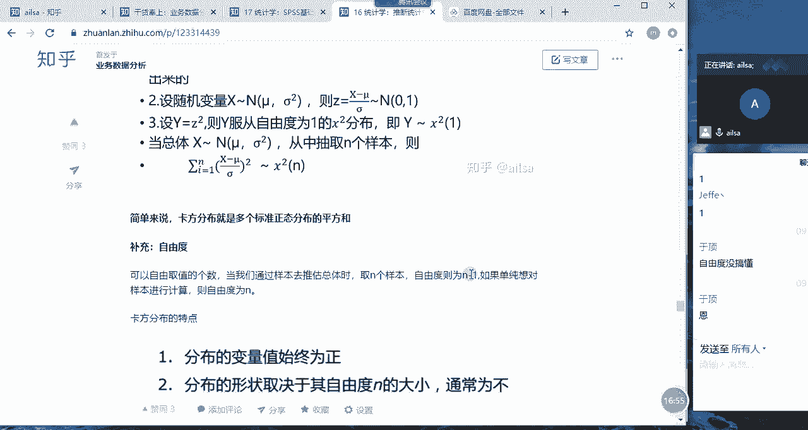

比如说啊这样一个东西啊，这样一个数据我们得出来的一个数据，它符合正态分布，如果说它符合正态分布，我们就可以通过这样的一个形式，把它转为标准正态分布，我们转化为转化完了之后，我们这些值如果我们有。

我们就给它带进来，然后求出我们所想要的结果，然后就可以去估计它的概率啊，估计它的整个的一个边界值，然后去做相应的判断，就是它符合什么规律，它符合哪个分布特征，我们就可以用它整个现成的一个计算方法。

去计算我们想要的效果就可以了，或者是去计算我们想要达到的结果啊，就这样的一个目的就跟我们套公式是一样的啊。

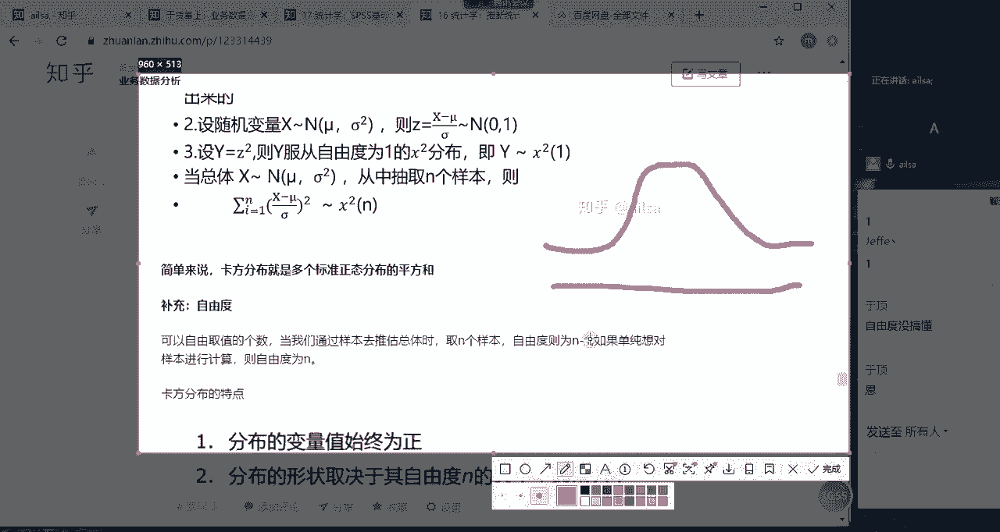

还是这个是这个概念哈，啊这就是我们分布特征，那我们在进行抽样分布的过程当中，有一个非常非常非常重要的呃定理，就是我们的中心体极限定理，我跟大家再重新讲一遍，我们的整个的一个中心极限定理的一个思路哈。

啊是这样的，就是画图哈，我们中心极限定理是嗯，就是嗯大家想一下抽样啊，抽样分布哈，抽样来，我先解释第一个概念哈，抽样啊啊如果说我想对啊，对总体进行啊进行抽取，随机抽取，随机抽取啊，呃一个样本哈。

一个样本，一个样本哈，什么叫一个样本，比如说这个我这个总体啊，总体数据量我不知道，但是我我随机抽取了一个样本样本量哈，样本量大家一定要样本量是100，相当于是我从一个研究对象当中。

抽取了100个个体作为我的一个样本对吧，作为我的一个样本，这个大家能听明白哈，100样本量是100，然后这100个个体构成了一个，我随机抽取的一个样本，然后对于这个样本我进行一个均值的计算啊。

均值计算啊，计算出来，比如说啊计算出来等于23，那我就我就可以推啊，我就大概可以估计哈，推估哈推估啊，推估总体总体的均值是二三啊，大家觉得我这样去做的话啊，我这样去做它整个的一个正确率。

或者是说准确率会高吗，中间的误差会不会很大啊，中间的误差会不会很大啊，同志们，现在给我一个互动啊，如果说我这么去计算，比如说我对总体随机抽取了一个样本哈，样本量是100，然后计算出来均值是23。

那我就大概能推估出来总体的均值是23，我这样的一个分析的过程啊，呃就是啊就是严谨吗，或者说他这个误差会不会很大，因为我们在进行抽样的过程当中，肯定会有误差，对不对，那啊你看思敏说我这样的一个过程。

误差会比较大的话，那我该怎么办呢，我该怎么办，哈多取点啊，只能这么要不要不多取点，是也就是说我就是这个样本量，我可以就是这个N唉，我可以多取一点，我这个比如说我取了1000啊，如果说我能取到1000。

我就取到1000，这样的话我计算的精确度比如说是23。2，哎，他是不是更精确了一些，是不是，但是大家大家有没有想过这样一个问题，大家有没有想过这样一个问题，你说我抽一次啊，抽取一次，抽取一次。

我这个精准度不高啊，比如说均均值啊，抽取一次均值是23，第一次是23哈，抽取第一次均值是23，那我我可不可以多抽几次哈，这样的话我我就会觉得说哎我心里好像有个谱，比如说我抽了五次，跟我抽了一次啊。

这样的一个均值计算结果的话，我是不是感觉更精准一些，那我比如说我又抽取了一次，抽取第二次，第二次，然后计算出来的均值呢啊，计算出来的均值是24，哎在我又抽取了一次哈，抽取第三次啊，第三次。

然后均值啊均值是23。23。8啊，然后等等哎我进行了十次，对我进行了十次，那我是不是得到了十个啊，sorry啊哎，哎呀我的妈呀，我进行了啊，不影响啊，不影响不影响哎，我进行了十次啊，我进行了十次啊。

然后这十次是不是有十个均值，十个均值对吧，CTRL加Z不起作用，我不知道为什么，OK我进行了十次，有十个均值，那你说嗯那你说大家想一下哈，大家想一下，因为我们总体的均值哈，我们总体的均值是不知道的啊。

总体均值总体均值mill是不知道的，现在我抽取了十次我的样本均值，样本样本有十个均值啊，那我再想一下这十个均值我到底该取哪个值呢，啊这十个君子我到底该取哪个值，其实也不太好确定对不对。

那这个时候啊咱们是不太好确定哈，但是人统计学家们他们发现了这样一个规律啊，什么规律呢，唉你比如说诶我在啊，就是这这个你看我抽取了一次啊，我计算出来一个样本的均值，我抽取了两次，计算一个样本的均值。

我这边抽取了十有十个样本的均值，那这十个样本的均值它最终代表了什么意义呢。

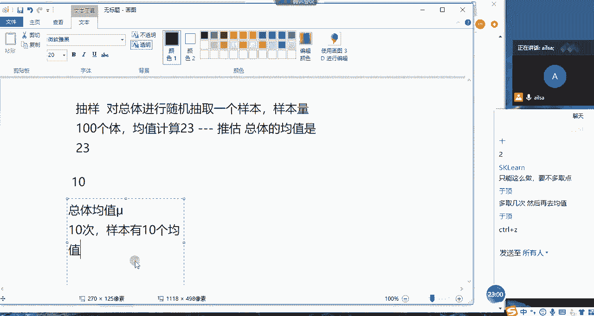

啊它代表什么意义呢，其实它是不是代表了，因为它这个均值啊，它最终计算均值肯定是在总体啊，在总体均值的周围进行一个波动对吧，哎你看这比如说假设总体均值是24哈，假设哈假设是24，它可能是在啊。

它可能是在24啊，24周围哎波动哎波动波动波动，比如说23的，25的，26的I等等，这些它最终呈现的分布规律，我们都知道所有的数据当你量足够大的时候，它都是趋于正态分布的，对不对对吧。

那你想我们每一个均值它的大小不一，你比如说有二三的啊，有23啊，有23的啊，有24的啊，有25的啊对吧，有25的啊，要26的等等，这些这个其实就代表了我们样本均值的一个，离散的程度，那它既然符合啊。

它这个样本均值既然符合我们的，就是当样本量足够大的时候，或者我们的重复次数足够多的时候，那它是趋于一个正态分布的，那它既然趋于正态分布，我们就可以把它转化为标准正态分布啊。

然后经过这样的一个思想步骤的一个研究。

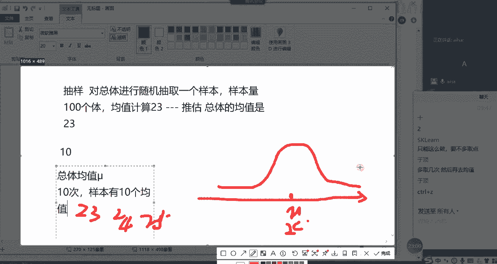

最后统计学家们得出这样的一个结论，什么结论呢啊就是呃呃样本均数啊，它最终服从的一个啊，正态分布呢是以谬啊为均值，然后方差呢是西格玛平方除以N，这样的一个方差的正态分布啊，就这样的一个啊分布的一个结论。

得出这样的一个结果，那画图的话是这个样子的，那我们最终得出来的一个中心极限定理，就是设均值为缪，方差为西格玛的任意一个总体中，抽取样本量为NN的样本哈，当N足够大时。

也就是说我们抽取啊抽取样本量这边是100的，改成N对吧，然后我们呃当N充分大，当然这只是一个渐进的一个过程哈，就是说越大越好，那样本均值X8，也就是它的均值的抽样分布，什么叫X均值的抽样分布呢。

就是说我们抽了很多次，有很多这样的一个均值，比如说有100个这样的一个均值，或1000个这样的一个均值，它们的整个的一个分布，它们的整个的一个分布是服从嗯，均值为缪方差为4X平方除以N的正态分布。

这就是我们从每一个总体当中随机抽取呃，一个样本啊，或者是呃随机抽取N个样本，它最终得出来的N个均值，它们的一个分布是服从，均值为缪方差为西格玛平方除以N的正态分布，这就是我们的中心极限定理。

这就是我们的中心极限定理，然后大家对于这个中心极限定理，然后我又说了一遍，有没有听明白，同志们听不白，给我扣个一，嗯那我再画个图再给大家加深一下印象哈，因为应该上回我应该也已经画了啊。

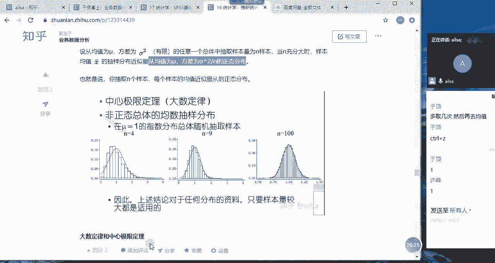

是什么意思呢，就是我们还是画啊，我这个图的水平稍微有点次哈，希望大家理解一下他这个嗯，比如说哈啊比如说中心极限定理哈，中心的，就比如说诶这个图这个服从正态分布，然后这些值到底是什么呢。

这些值其实这下面X轴的值，其实就是我们每一次随机抽取一个样本，计算出来的均值，你假设这个缪啊啊这个缪假设这是我们的缪，然后你计算出来的啊，有23啊，25啊，25，然后中间会有啊。

中间会有很多个点儿的点对吧，中间有很多个点儿点儿点儿，这都是你计算出来的每一个均值，它这个均值组成的这样的一个啊，这样的一个最终的这个数据集啊，这样的一个数据集，它服从的是方差为缪啊，对标均值为缪。

方差为西格玛平方除以N的正态分布，我们既然知道它服从正态分布了，我们就好算了。

为啥呢，因为我们可以按照正态分布的公式，给它转化成标准正态分布进行一个计算，唉这样的过程就可以了，这就是我们所想表达的啊，就是中心极限定理的这样的一个结果哈，啊OK哈啊，那其实啊在这个过程当中哈。

就刚才我画的图当中啊。

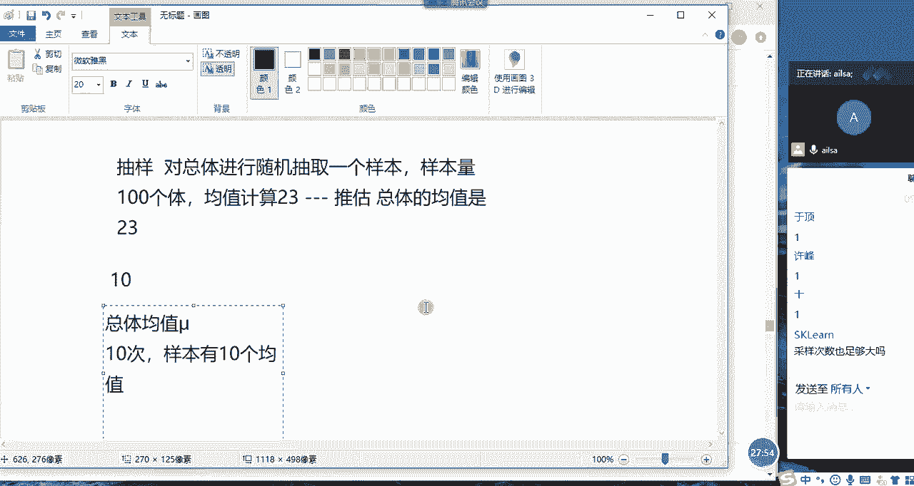

刚才我画的图当中，我们去诠释一下这个结果怎么去诠释呢，你比如说唉还是刚才这个图哈又重新画一遍，你比如说哎呀这个正态分布终于好看点了，采样次数也足够大吗，采样次数指的你啊指的是抽样的次数吧。

啊这个次数的话啊，当然是越大越好啊，嗯那也没有特别大的一个限制哈，啊就是你看我这个是均值对吧，均值然后我每次抽样计算出来的一个均值，一个均值，一个均值我们知道比如说这个均值是23。

哎我们第一次抽样得出来的是24，它们之间的差23讲，因为缪我们本身就不就是不知道的哈，我在这里面给大家举个例子，如果知道，我们就没必没必要通过样本去推测总体了哈，那我它俩之间一减得出来的是不是误差呀。

因为我们抽样，我们抽样的目的，不就是想通过样本特征去推估总体特征吗，那它们之间的一个差异，就是我们称之为抽样误差，那这个误差到底是多大，或者是怎样的一个形式呢，其实我们就是通过它的一个啊方啊。

标准差来进行体现的对吧，那我们通过中心极限定理。

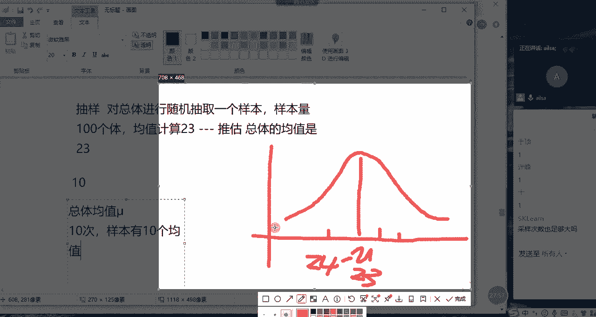

我们通过中心极限定理，然后就是知道它的标准差，它的方差是西格玛平方除以N，那它的标准差就是西格玛除以根号N，对不对，那这个就是它的误差，它的误差我们称之为标准物啊，这是一个概念哈，标准物O啊。

那这其实啊其实这样的一个结果，就是我们所想表达的啊，讲这么多，其实就为了后面啊，后面再进行知识型串联的时候，会用到这个知识点啊，嗯啊这只是我，因为你看西格玛还有这个缪啊等等。

这些都都是这都是总体总体参数，对不对，哎，那我们其实更多的时候是用样本来进行计算的，所以说我们需要把西格玛换成S对吧，哎通过样本啊，样本标准差进行一个计算，那在这个过过程当中，我们知道了总体啊。

我们知道了我们的整个的一个样本均数啊，是服从正态分布的，那我们完全可以把它转化为标准正态分布，这样的一个公式进行一个计算，那我们知道这个公式之后，接下来所有的操作都可以基于这个公式进行。

相应的啊结果的推导哈就非常方便了，OK这就是我们想讲的中心极限定理啊，采样次数你指的是你指的是我们的抽样次数吗，嗯建好对，那我们对于抽样次数的话，嗯就是说我们只能说呃就是当然是越多越好啊。

越多你会越精确啊，这样的一个结果没有说啊，它因为它是一个它是一个呃他是一个什么呢，无限的这样的一个呃这样的一个概念，就是渐进的这样的一个概念，渐进哈就是当然是越越大会越好，但是也没有说啊。

就是嗯的有一个数字的限定哈，只能这么说啊，渐进啊，渐进啊的思想，越大越好啊，也没有说就是呃就是有一个文那个数字的限定，OK哈那我们抽样啊，抽样分布就讲这么多内容哈，来我给大家带大家回顾一下抽样次数。

没不是哈，抽样次数指的是你对于总体数据抽一，抽了多少个样本，那每次抽取的个数称之为样本量啊，一定这个概念哈，你抽一次哈，你比如说你从总体中啊抽取一次啊，抽取啊一次啊，抽取一次称为啊一个啊。

称之啊啊称为就是叫样本啊，叫一个样本，那这个样本到底有多大啊，叫样本量啊，样本量样本量100，那就是100个个体啊，明白了吗，是这个意思哈，OK明白了哈，那我们简单来总结一下我们的抽样分布哈。

我们讲了啊T分布，卡方分布和F分布，以及我们的中心极限定理哈，啊中心极限定理啊这样的一个概念，嗯嗯嗯OK好。

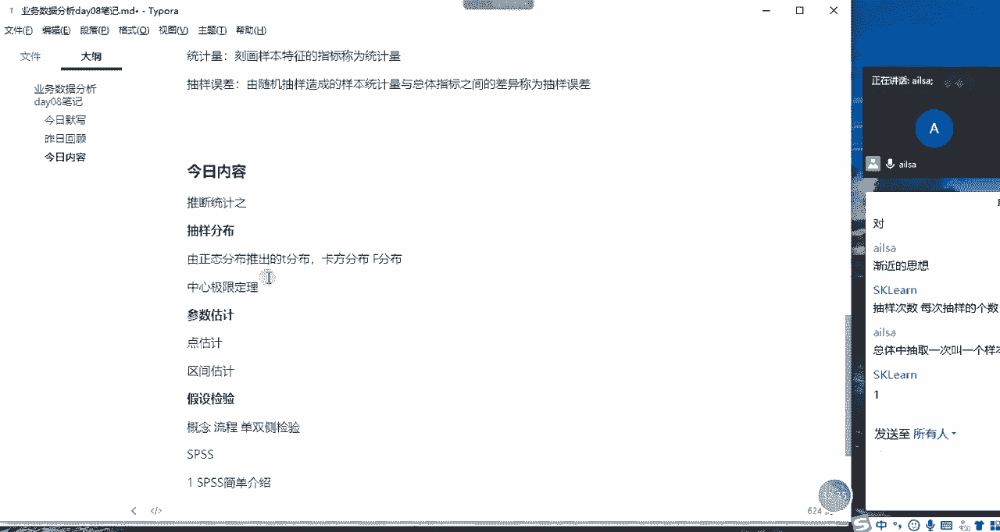

我们需要休息一下是吧。