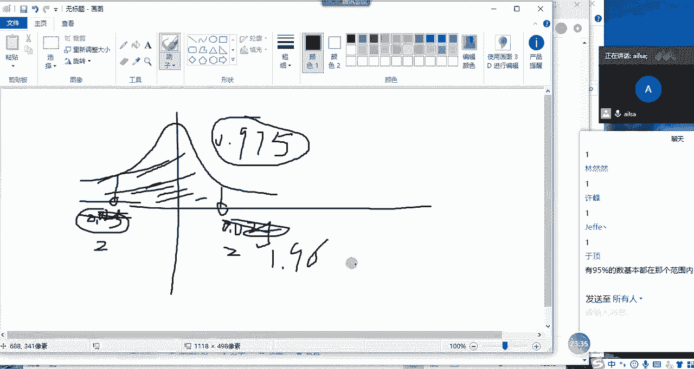
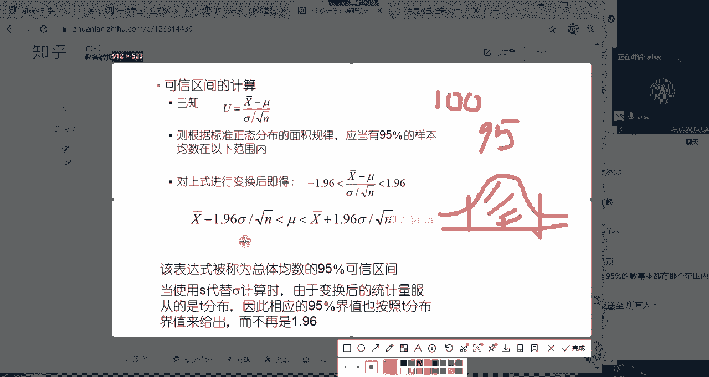
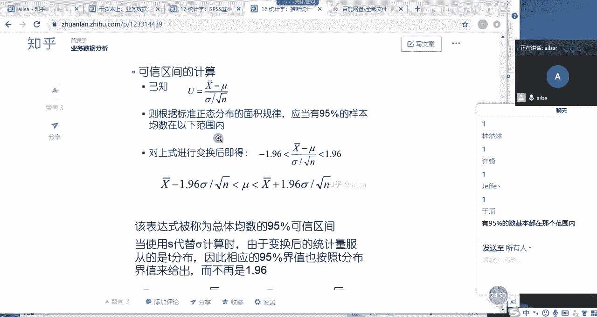
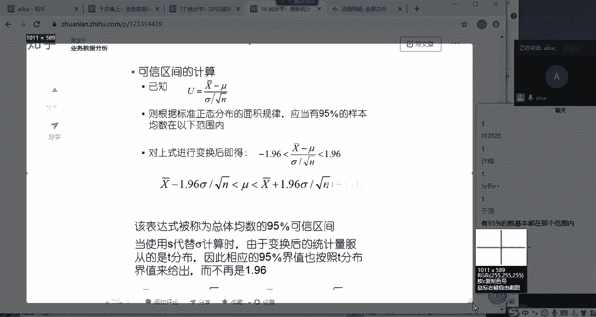
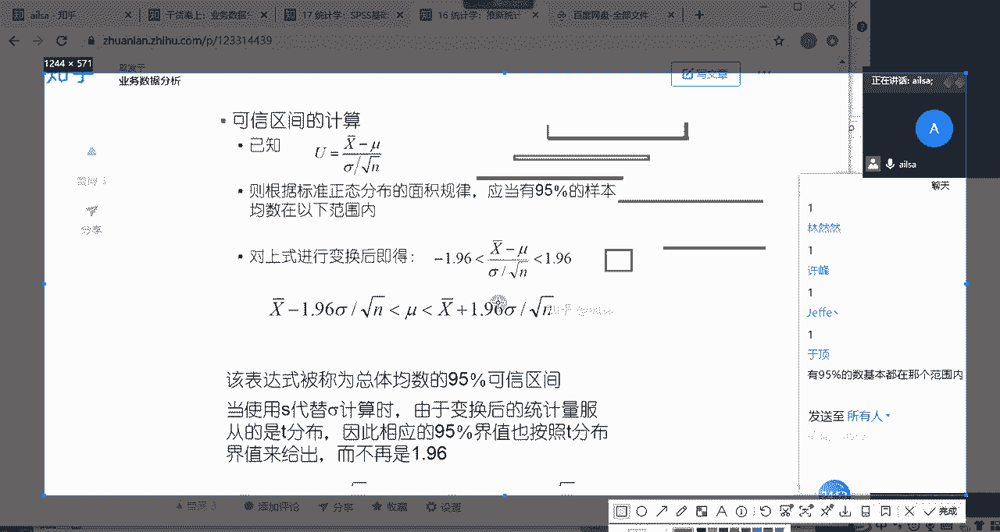
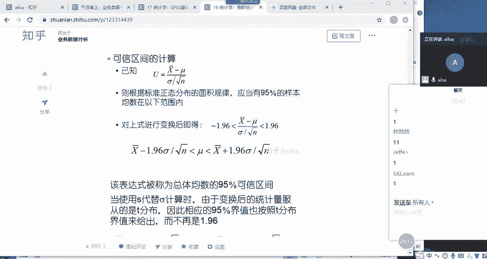
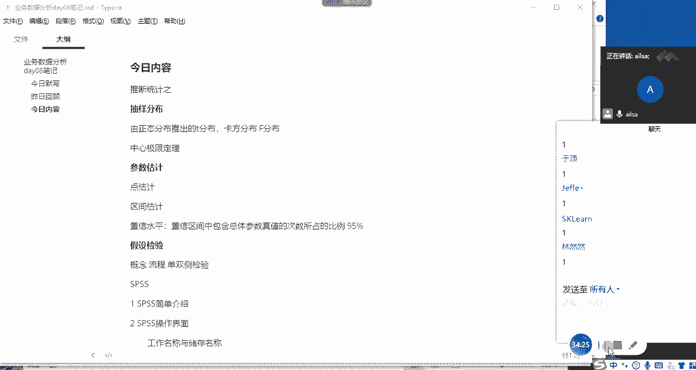

# 强推！这可能是B站最全的【Python金融量化+业务数据分析】系列课程了，保姆级教程，手把手教你学 - P91：04 参数估计 - python数字游侠 - BV1FFDDYCE2g

OK同志们，我们接下来讲参数估计啊，参数估计是呃，我们会讲点估计和区间估计啊，我们先先看一下什么是点估计，然后再说什么是区间估计哈，好我先重新打开一个什么，打开新建，同志们。

我们刚才举了一个特别简单的例子，就是我们从总体啊中随机抽取啊，随机抽取啊，100个啊，100个个体啊，作为我们的样本啊，作为我们的一个样本对吧，做我们的一个样本，然后嗯然后我们计算出来的均值啊。

均值是R3对吧，然后我们就大胆啊大胆推测哈，大胆推测我们的总体嗯，总体均值也是R3对吧，我们刚才说这样的形式太也过于啊，太过于不严谨了是吧，不够啊，不够严谨，那我们采取的方案是什么呢。

我们参与的方案就是可以多抽几次，对不对啊，多抽几次，然后我们再去推估这个啊，这个我们的整个的一个均值，它的一个分布的啊规律啊，呈现的是一个正态分布，那什么样的正态分布呢，就是方差为缪，方差为谬。

我们的哎均值为缪，方差为西格玛平方除以N这样的一个正态分布，对不对，哎那现在我问大家，我们推测出来这个总体之后啊，啊推出来这个总体之后，我们就去啊做一个啊23啊，去估算它总体的为23。

这种啊这种方式哈我们称之为铁估计啊，为什么唉这个东西我不太会用呀，啊我们称之为点估计哈，也就是说我们通过均值啊，这一个点或这一个值诶，我们去推估啊，推估总体退出总体的一个均值啊，这样的方式啊叫点估计啊。

就是一个点啊，就直接就是推估它的总体的均值，那这种点估计的方式啊，点估计的方式是啊非常不严谨的哈，或者是非常模糊的啊啊这样的一个过程，那如果说你看我们在生活当中是怎么估计的哈。

你比如说同志们现在跟我互动哈，你比如说哎你过年回家啊，然后嗯然后咱们都假设咱们都是做it的哈，然后你大姨家的孩子说他想从事it行业，她想学编程啊，然后他问你，哎你现在不是在it行业吗。

你给我说一下工资啊，工资大概是多少，it行业的工资你会怎么说呢，嗯工资怎么样呢，你会怎么说，唉，同志们，嗯同志们你会怎么说，哎说正事啊，说正事，嗯就是你的大姨，然后问啊，我就是说想从事it行业。

现在it行业的工资怎么样啊，这个问题，然后我们该怎么回答啊，快点，你不用说你做多少人，没有说你的工资，人问的是这个行业的工资，你不是在这个行业里吗，嗯同志们该怎么回答，嗯好，那再比如说哈。

再比如举一个简单的例子，再比如说你假设你现在去面试，你面试，然后面试官问，面试官问啊，你的期望薪资是多少，你该怎么回答，同志们，你该怎么回答，嗯你面试时，面试官问你的期望薪资多少，你该怎么回答。

来15K嗯还有吗，还有吗，其他人呢，怎么没有人跟我互动，okay好嗯嗯嗯，那再再问一个问题吧，再问一个问题嗯嗯然后呃假设哈嗯假设问你，你明天啊，你查你帮我啊，你帮我查一下啊，查一下明天的天气气温是多少。

同志们这个该怎么回答，嗯这该怎么回答，北京你所在的地方，你所在的地方，你所在的地方嗯，对你所在地方的，我看我的捧的捧哏啥时候能出现啊，你们一个个的真的是不忘点脏擦呀哈行，算你们赢了，我输了唉。

那你比如说我们在回答第一个问题的时候，it行业工资是多少啊，像这样的一个东西的话，嗯我们一般情况下啊，比如说是亲戚朋友告诉你的话，因为我们这个行业它的整个的一个岗位水平啊，工能力水平也也不都一样。

对不对，也不都一样，那这个时候我们在回答的时候，经常是给一个范围，对不对，你说嗯大概也就嗯刚入行的话啊，刚入行可能是10~15对吧，然后干个两到3年可能是呃如果能力还不错，然后15杠30啊，15杠25。

然后如果说啊往最高的架构师方向去发展的话，那就30K以上了对吧，唉这都有，这是月薪哈月薪，然后这样的一个范围啊，月薪啊，这样一个范围啊，你可能会是这么去给别人回答的啊，别人说哦未来发展前景还不错对吧。

唉15刚开始十开始，然后到后面两到3年，三到5年，然后如果做的好的话，往架构师方向去发展，那就30K以上还不错对吧，嗯那就这样的一个他给定的肯定是一个范围，给定一个范围的话。

才代表你回答的问题更谨慎一些，那比如说你面试的时候，你在如果面试官问你期望的薪资，如果你直接答一个很准确的数字的话，如果说这个数字不是啊，不符合该公司的一个招聘的岗位的一个要求，或者过高啊。

这样的一个行为的话，其实对于你面试的过程很不利，你一般情况下我们可以给他给一个区间，你比如说给一个13啊，13K刚16啊，16k，这个时候，虽然哈虽然面试官会人为性的直接认为。

你可能工资不低于13K就行了，但是你可以跟面试官有讨价还价的余地，也就是说你给他的一个期望薪资是一个范围，那如果说他给到你13的话，你还可以在网上要要你，比如说嗯。

就是我觉得我个人的能力应该是15左右啊，十或者15K，然后的话你网上争取一下也是没有问题的，但是如果你直接给了一个定值的话，你是完全没有啊没有聊的余地的啊，这样啊这样的一个过程。

但是这样的话你就会有一个额区间范围，会有一个回旋的余地对吧，那再看一下天气啊，天气气温的话，气温因为一天的气温变化是呃，呃不不是一个恒温，对它不像那个温室里或者室内这样子。

所以说室外的气温的话肯定是一个变化的呃，范围他肯定会给你，比如说现在的气温应该是25啊，刚35对吧啊，假设哈25杠35℃这样的一个范围，然后这样的话就涵盖了一天当中所有啊。

天气的一个气温情况会更准确一些，所以说我们会好，我们通过实际的生活当中的例子，会发现给定一个数值范围，虽然说它不够精确，但是它确实能够呃，在很大一定一定程度上，包含了你所要表达的内容啊对吧。

你再举一个例子，比如说呃我们经常会去通过一些人，然后去估算一些东西啊对吧，你比如说你看到了一个男生，然后你看了你大概对比了一下他的身高，然后你说哦这个人应该是在呃1米1米，1米76到1米79之间啊。

或者是1米8零之间，而这样的一个范围的话，就会让你的回答更具有全面性对吧，更具有全面性，然后的话啊对你要说哎你的身高是1米78，结果人是1米79，那说明你回答错了，但是如果说你的身高是1米76。

到1米79之间，哎啊那这个时候你的回答就是正确的，所以说我们会发现，其实你要估计一个点跟估计一个区间，它整个的一个准确度的话，区间好像会更具有哦，具更高的一个准确性，但是在这里区间啊是也是有啊。

在这里区间啊区间也是有范围的哈，也不是说你你如果给一个很大的区间的话，也没有什么意义，所以说肯定是在一定的区间范围内啊，最大包括你所有结果的最大，可能这样的一个区间范围才有意义的。

你比如说那你说你举一个很简单的例子，你说我推估啊，我推我我估计哈，我估计每一个人在中国，每一个人的身高应该都不低于就不低于哈，50cm啊，啊想想50cm啊，就是说成人啊，成人应该都是在50cm以上。

那你这个范围其实很大啊，那你这虽然说你包含了很多，真实的这样的一个结果，但是它却对于分析来说就没有特别大的意义了，知道了吧，就比如说你们举的这些例子哈，啊明天的气温应该不低于零度吧。

这种就属于区间范围过大哈，我身高不高不到1米9对啊，这种就属于过大了，我年薪不高啊，嗯比较喜欢比我高的，说不定能带我长高，那你这个啊是是不是说不定是一定不哈，OK哈，那其实我们对于这个区间会发现。

也就是说在一定区间范围内，我们的区间有意义的话，它更能够反映我们整个的一个真实情况，对不对，那这个区间估计到底是怎么啊，怎么来进行计算的呢，我们还是嗯我们还是拿均值啊，来拿均值来进行举例哈，如果说啊。

如果说啊我们还是拿刚才的一个例子哈，现在还是随机啊抽取啊，抽取一个呃样本啊，样本量啊，样本量100，然后计算出来的均值，计算出来的均值啊，均均值是23啊，假设是23哈。

现在啊现在假设哈假设啊总体总体参数啊，总体均值哈，总体均值是24啊，假设总体均值是24，然后我们我们计算出来的均值是23，我们就说总体均值是23，那说明我们怎么着说错了，对不对，哎我们就说错了。

我们这样啊，就比如说均值是二三，我们就推测或推估啊，推估总体均值为23，那我们就说错了，对不对，那我们说错了，这样的一个结果我们该怎么去纠正呢，我们也不知道总体均值是24啊。

这个时候我们可不可以给一个范围，那这个范围到底怎么来计算呢，大家想一下这个范围我该怎么来计算，来同志们到你们发挥自己的想法的时候了，这个范围该怎么来计算呢，这个范围到底到底是个什么东西呢，啊不要闲聊了。

现在该开始思考这个问题，这个范围该怎么来限定，来同志们快点，来要用到我们的中心极限定理哈，用到我们的中心极限定理这样的一个想法，它它有它是服从正态分布的，对不对，没有想法吗，有什么想法没有。

如果没有想法，给我扣个二，没有想法是吧，OK那我带着大家去想哈，这个东西你看好近似正态分布两个点，它区间啊对啊，你看你这个你这个哦总体均值是23，然后假设总体均是24，那你要说它总体均值是23的话。

那说明我们就说错了，我们要给一个区间哈，那给一个这个区间，我们要我们还要给一个值什么值呢，就是说我们给定这个区间，它大概能够包含总体的啊多少对吧，就就是说这个嗯，我们经常使用的是一个95%啊。

这样的一个东西哈，但是这个95%在这里这样的去理解，好像还不是特别准确哈，呃我想想啊，呃假设我们的均值是23啊啊23，然后啊然后我们呃我们进进行了多次的抽烟哈，进行，多次抽样，我们是不是进行多次抽样。

会得到多个啊，多个均值啊，多个均值，然后它们是服从啊，是服从正态分布的，对不对，试图中正态分布，然后是以mu为均值，然后是我们的sigma西格玛啊，西格玛平方啊，除以N，西格玛平方啊除以N啊。

为我们的方呃，西格玛平方除以N和我们的方差的啊，这样的一个结果对吧，这样的结果，那大家想一想，大家想一下，现在唉我要进行一个区间估计啊，我要进行一个区间估计的时候，如果说我进行了100次的抽样啊。

进行了100次的抽样，100次抽样，然后我得到了100个均值哈，100个均值啊，然后我希望啊，我希望这100次抽样，然后得出来的啊，这100个均值它有95%哈，或者是100个区间哈，100个区间啊。

它能有9%，就是有95个，有95次包含了我的总体均值，如果能达到这样的一个效果，然后我就可以认为啊是OK的啊，因为我们知道达到95%，这样的一个效果的时候，是相当相当于来说，你这个估计的这个总体的均值。

算是比较啊比较准确了，所以说我们有一个95%这样的一个，置信水平，啊置信水平啊这样的一个概念，95%的置信水平，那也就是说在95%的置信水平下，我的整个的区间该怎么来进行一个限定啊。

就是我们的区间估计的一个思想啊，这样的一个思想哈，那这个95%呢，就是呃很多人理解为是95%的概率，也就是什么呢，就是说比如说我我这个区间哈，我给定一个区间范围之内，它有95%的概率。

能够包含整个的一个总体的均值啊，其实不是这么来理解的，它是你可以你可以这么来计算，但他理解的时候指的是我有100次抽样啊，然后有95次啊，就是包含总体均值啊，占的次数占的比例有95次。

符合这样的一个情况的情额情况下，然后我计算它整个的一个区间范围，然后大家这个听明白了没有听明白，给我扣个一，好听明白，给我扣个一，OK哈啊只要明白这个置信水平的意思就可以了，然后我们这个95%。

我们也可以理解为概率啊，我们可以理解为概率，但它真实不是这个意思哈，那就是说我给你95%的置信水平，然后你给他呃来定义这个区间啊，区间怎么来定义呢，它这个就需要用到对啊，是的，有95%的。

有95%的整个的一个区间范围，包含了总体均值啊，是这个意思哈，嗯然后置信水平为95%的时候，那我们该怎么去计算它整个的一个区间，它的区间的一个公式就是根据我们的中心啊，标准正态分布啊来得来的。

就是我们这个公式来给大家看一下嗯，就是我们根据标准正态分布的一个概，就是那个面积的规律，应当有95%的样本均数，在以下范围之内，什么意思呢，就是说这个他应该服从的是我们的标准，正态分布哈。

因为本身我们的样本均值它服从的是缪为均值，西格玛平方除以N为方差，的这样的一个正态分布，那我们想把它转化为标准正态分布的话，就是我们的均值减去我们的缪除以我们的啊，它的标准差哈。

那标准差就是西格玛除以根号N，这是我们的标准正态分布的公式，大家没必要去纠结这个东西哈，那这个东西哈，这个东西如果说它要满足95%这样的，一个概率的时候啊，这样一个概率的时候。

我们就需要查一下我们的正态分布表，那在95%的情况下，它这个图形是这个样子的哈，它这个图形是这个样子的啊，它这个图形啊稍等好，它这个图形是这是我们的啊，这是我们的标准正态分布哈，Sorry。

标准正态分布，如果说要满足95%的一个，概率范围的话，它是因为它是双边对称的，所以他这边和这边是一样的，那这个范围是95%，那这两边呢分别是零点啊，这边是零，就两边面积加起来是0。505。

那就是零点分别是两边分别是0。0225哈，0。0250点，因为它要除以二啊，0。025，然后这样的一个啊我们的Z值啊，我们的啊不是我们的概率值啊，sorry啊，我们的概率值就是这个面积是0。025。

这个面积是0。025，我们要查出来这个值是多少，然后再进行一个判断，OK我们从这个表中查一下，那我们是要根据好，根据我们的概率去查Z值，那我们看一下这个啊，这个的面积是0。975哈。

这个面积是我看稍等哈啊，等会儿啊，1。96哈，那就是0。975这样的一个啊一个范围哈，概率怎么去说这个东西呢，sorry呀，我想想这边是0。05，那边是0。025÷22分之，阿尔法是0。025。

然后它分别就是0。975这样的一个概念，所以它对应的值是1。96哦，1。96就它这个Z值，它这个ZI啊，1。96是这边哈，是这边啊，是这边的一个值，然后呃就是，这边的面积啊就是0。975，975啊。

加上0。025刚好是一啊，这边的Z值就对应的是1。96，因为它是双侧，它是双侧，所以说啊它两边分别是啊，分别是0。025，我们在计算的时候，我们需要取的是0。975，这个值明白了吧。

嗯那这样我们算出来它这个值就是1。96啊，那对于这个标准正态分布而言，它的啊它的一个公式是这个样子的，对不对啊，那我们需要做的一个操作，就是我们要计算它这个谬啊，它这个谬它的一个取值的范围。

就是它的一个它的一个嗯就是区间范围，这个意思哈啊那这个谬怎么来计算呢，就是均值啊，因为这两边要乘以这个Z哈，它乘以这个Z，然后Z是1。96，所以是均值加减啊，乘以这个1。96。

再乘以西格玛除以根号N这样的一个区间范围，那这个区间范围其实就是我们啊，在呃总体均数在95%的置信水平下，然后它整个的一个区间范围的一个计算方式，同志们，同志们，这个听明白了吗。

就是如果说我们想计算一个区间范围的话，我们要给定它一个条件，就是他这个要你要满足有多少多少的，这样的一个比例的一个样本，均数的一个取值范围在这里，然后根据这个啊比例，然后我们可以把它当作概率。

然后去计算它相对应的这个值，然后就可以去计算出来它整个的一个区间范围，其实相当于什么呢，其实你可以这么去理解，我们在进行正态分布的过程当中。

还我们在利用它这个正态分布的过程当中啊，然后啊你看这个均值啊，现在它是均值，对不对，那它整个的一个分布的这个形状，其实就是它的误差大小，我们把这个误差范围哈，我们把误差范围大概能够确定到。

就是取它整个的一个95%的水平下，然后涵盖所有的信息就可以了，啊也就是说呃我们进行了100次啊，举个例子哈，我们进行了100次抽样，其中啊只要你能够满足，只要你能够满足，有95次啊，有95次的抽样啊。

945的抽样包含了总体均值，这样的一个区间范围啊，就可以了。

这个大家能明白吗，同志们如果能明白给我扣个一，如果不明白跟我说什么原因啊，就是哪点没听明白，就是我们想确定这样一个区间范围，然后能够达到说嗯有百是五九十五%的，这样的样本均数都在这个区间范围内啊。

都都都包含了我们的一个总体的均值。

这样的一个效果，你比如说哈，你比如说这样。

我们想达到什么样的效果呢，就是我们计算第一个区间范围啊，假设哈我们抽第一次啊，抽取的一个啊，就是根据这个公式哎，我们计算出来这个区间范围是这个样子的，假设这个均值这个均值均值这个均值在这哈。

这是我们的均值啊，这是我们均值第一次啊，这范围在这哈，我们看在这个区间范围内，对不对，然后第二次抽取的这样的一个范围，是这个唉是这样的一个范围，是这样的一个范围，你看是不是也包含了它。

那第三次呢我们又抽取了一次哎啊，区间范围大概是这样，好像也包含它了，对不对，完它然后第四次哎，是结果是这个区间范围也包含它了，第五次在这儿没有包含对吧，有一次没有包含。

然后也就是说我们确定了这个区间范围，能够在100次的一个抽样过程当中，有95次都包含这个总体均值，能够达到这样的效果就可以了，这就是我们想要得到的啊，这个95%是可以变的。

就是说你可以说能要需要达到99%，需要达到90%，它只是对应的Z值不一样而已，因为你这个概率值不一样，你包含的样本量不一样，那你整个的一个分布的啊。

分布的整个的一个结果也不一样啊，同志们这样听明白了没有听明白，给我扣个一，OK哈，OKOK嗯嗯应该是说明白了哈，我们确定这样的一个区间，其实这个95%对应的就是我们要计算，我们不我们现在如果不抠啊。

不抠原理的话，我们的意思就是说，你给我95%的这样的一个概率，然后我计算一下它对应的啊，它对应的一个好对应的一个范围啊，这样的一个范围，然后我计算一下mu的取值就可以了，我现在根据这个公式，我想计算缪。

那就是啊，那我们就看一下它整个的一个取值范围，就是这样的一个过程啊，因为它正态分布是对称的，我们如果能大达到95%的话，就是这个啊这个大部分的一个区域，那我们其实从另外一个角度去分析的话。

从另外一个角度去分析哈，当然这不是原理，什么意思呢，就是说你经过此次的一个抽样啊抽样，然后你进行了一个区间的估计，你能够实现95%的信息你都能涵盖，那OK就可以了，也就是说还有另外一个解释。

就是说你进行了100次的抽样，有95次你都包含了正确的值，也就是说你的答对率啊，你比如说你你的整个的一个，你比如说现在都进行核酸检验，对吧，假设进行核酸检验，我们有100个人他去做检查。

然后有95个人检查出来都是正确的，也就是说它就是阴性，就没有什么问题，那也就是说有五个人检查，假设是假设哈，他本来就是阴性，它检查出来阳性，那这就属他的错误率，那这个95%呢，就相当于包含了大部分啊。

大部分啊正确的一个值啊，就可以了，我们没有办法，我们没有办法达到百分之百，因为要达到百分之百的话，样本数据去推估总体的百分之百的正确率的话，是非常啊精准的，这样的一个效果啊，很难。

一般情况下99%就很不错了，我们这是从我们的大面上去理解，这样的一个概念，它实际上指的是就是100个样本啊，你100个样本，然后你计算出这样的一个区间，然后其中呢有九十五九十五个样本。

在这个区间范围内都包含了总体的均值，如果你能实现这样的效果就可以了，OK哈我应该说明白了哈，这就是我们的整个的一个区间，估计我们可以看到这个公式是怎么来的，那其实这个公式就是我们的Z值啊。

就是我们的Z值，你看X减去mu除以它的标准差，就是我们的Z值，现在我们如果想达到95%的这样的，一个样本均这样的一个效果的话，就是涵盖95%的这样的一个，面积的时候，我们就可以通过我们的正态表。

通过面积哈，还通过我们的标准正态的一个概率，去查我们对应的Z值啊，就是0。975，因为他这是单侧，他这是单侧，单侧，单侧得出来结果我们两边分别是0。025，点025啊，0。025这样的一个值。

所以说它对应出来1-0。025，就是0。975哈，0。97+0。005，就是0。975，它对应的值就是1。96，那它这个1。96是在哪体现的呢。

就是在这里哈，啊它这个1。96就是这个样子的啊，我们知道这标准正态分布肯定是中间是零，然后它把就到这儿啊，到这儿，它计算的整个的一个面积是95%，95%，然后这个对应的是-1。96啊，这个对应的是正1。

96，那它大概啊这是Z值哈，Z值没有意义，因为它主要是为了为了转成标准正态分布Z值，然后95%的一个概率面积，它对应的Z值是1。96，大概是两倍的标准差，相信大家这个比较熟悉了哈，然后九十百%分之90。

它对应一个Z值，然后99%大概对应的是三倍的标准差，这样的一个效果，然后这个面积就是95%啊，这样的一个结果啊，就是我们所要所想要得到的，那它那它的一个取值范围呢，其实就是根据这个公式来进行计算的啊。

因为呃Z值我们有了，那我们希望它整个的一个面积在啊，就是对应的Z值在-1。96到1。96之间，它的一个面积是95%，我们主要是求这一段呗，那就是把这个代入公式就是大于-1。96，小于正1。96。

然后计算可得它的整个的一个谬值的取值范围，就是在这个之间，那我们如果不看医德九六的话，那大概的意思就是说，你看你西格玛除以根号下N，这个是不是我们的标准物，也就是说你在进行多次抽样的过程当中。

它肯定存在误差，对不对，那这个其实就就是我们的标准物，然后再乘以我们的啊，乘以我们的ZZ值，就得出来的就是它整个的一个误差，也就是说它其实的一个范围，就是在整个的一个呃啊X均值加减上。

它的误差大小其实就是它的一个区间范围，想想也是这样的，对不对，这个我在解释完之后应该也都已经明白了，如果都明白了，给我扣个一同志们，其实就是它的均值跟它的一个标准差的啊，嗯就是加减啊，加上它的加减上。

它的标准差就是它的整个的一个区间了啊，其实想想也是这样，想想也是这样，因为它误差嗯，如果说你能确定它误差大小的话，你直接相加不就行了嘛，对不对，加上就是它的一个最大范围，减去就是它的最小范围。

那在这个区间范围内，我能包含95%这样的一个样本均数额，就95%这样的一个概率面积，其实就可以了，嗯OK哈啊，我相信这个样本区间啊，样本区间啊就是置信水平跟大家说几个概念，一个置信水平95%。

这就叫一个置信水平，什么叫置信水平呢，啊什么叫置信水平呢，致信水平就是我们嗯就是嗯稍等稍等一下，突然间卡壳了，置信水平其实就是置信啊，智信区间啊，置信区间啊中包含总体参数，总体参数嗯，真值啊。

什么叫总体参数，真值就是真的总体参数真值啊，真值啊的次数啊，所占的比例，什么意思意思呢，就是说呃就是说我们确定好的这个区间范围哈，你看这个区间范围是随X均值的变化而变化的，因为你每次出现X均值都不一样。

对不对，但是后面其实是一样的啊，就是在这个致敬啊，致敬区间中包含总体参数真值的一个次数，所占的比例就是置信水平，你比如说95%，就是意思就是说从100次抽样当中，然后这些你设定好的置信区间。

然后包含总体参数的次数为95，那这样的一个比例就是我们的置信水平，OK同志们这个智性水平听明白的，扣个一，啊如果都听明白了，我们就进入到假设检验了，有什么问题。

