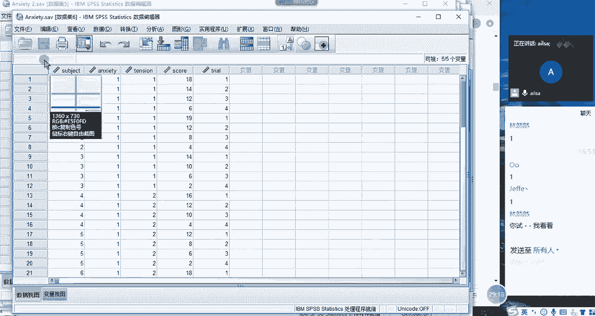

# 强推！这可能是B站最全的【Python金融量化+业务数据分析】系列课程了，保姆级教程，手把手教你学 - P95：08 SPSS常用操作 - python数字游侠 - BV1FFDDYCE2g

同志们坚持一下哈，坚持一下，我们接下来讲SPSS的常用操操作哈，常用操作唉我这个普通话也是醉了哈，然后唉我们先讲数据的录入啊，有的人说这个用讲吗，我也觉得不用讲啊，那我就给大家做一个稍微的演示吧。

你比如说嗯我要给大家演示一下嗯，这个SPS在录入数据的时候到底是有多智能，比如说我现在录入了一个性别嗯，大家看哈，跟着我去操作哈，你随便打开一张表，然后录入性别啊，跟着我去操作，嗯如果录入录入成功了。

按enter键，大家看我去他是不是都给你显示出来了，但是不太对哈，不太对，因为我们的性别其实是什么，是我们的啊字符串啊，点击确定，我们可以改一下，我们的宽度其实没必要这么宽，对吧啊，其实四啊二就可以了。

然后呢哎啊哎跑哪去了，怎么出现两个，然后我们的整个的一个嗯哦宽度啊，宽度宽度四啊，然后我们整个的一个标签，其实我们啊也可以解释哎，这解释不解释都无所谓哈，因为性别这个谁都知道，我们可以啊性别啊啊。

然后我们这值其实可以给它设置成一或者是零，对不对，那这个时候我们该怎么去设置它这个值呢，我们啊点击这个啊省略号，然后点击进来，然后选择一，然后我们可以输入标签是男嗯，然后点击添加啊。

然后我们再输入一个零啊，输入女啊，点击添加，这样的话我们就把它变成了啊，这样的一个用值，显示实际内容的这样的一个形式，就这么去编辑就可以了，那我们再往后走，往后走，这些都可以不用管。

然后我们这个性别它属于什么名义数据对吧，它是无序分类，所以说它就自动给你显示出来了，你看是不是特别智能啊，大家有没有啊，有没有有没有录入成功，有没有录入成功，录入成功，给我扣个一，同志们，好的哈。

那我就简单的演示一下，我们在进行SPSS当中录入的这样的一个效果，很明显它是基于统计方面的一些呃特殊的情况，然后进行的一些呃就是方方便快捷的操作方式，对吧啊，就他的特点就是基于统计学的知识啊。

非常的呃非常的高效，也就是说他这个统计知识的一个氛围非常浓哈，OK那我们的呃这个录入我们就讲这么多啊，非常的简单，我们接下来看查找与替换嗯，查找查找与替换的话，这个跟我们在excel当中是非常像的。

它它的快捷方式也是CTRL加F，我们调取查找和替换的，这样的一个啊啊窗口啊，或者数据视图这样的一个窗口，然后我们查找，比如说我们查找嗯，查找北啊，北京吧，查找北京，然后查找下一个啊，找不到啊。

字符串我们看一下哈，我们包含北京不行吗，包含北京查找下一个找不到字符串，北京怎么可能哦，那知道为什么吗，但大家知道为什么找不到北京吗，啊谁能告诉我，谁能告诉我为什么找不到北京，这不是有北京吗。

而且我使用的是包含关系，啊对它实际它它查找的是它实际的值，那如果说我这边输入难，我能不能找到呢，我们再试一下啊，他可以，大家看南是可以找着的，为什么北京又找不着呢，我们看一下实际的值哈，你再查找啊。

这样也找不着难了哈，也找不着难了，但是刚才还挺奇怪的哈，我们找难就能找着对吧，然后我们再试一下，我们再试一下，我们看一下哈，找一下学生，找一下学生已经被隔离了，学生OK找不到学生啊。

字符串学生我们看一下隐藏，这也没有什么，这还挺逗的哈啊，这边也是数字，看到没有，看到没有，这是数字哦，我知道为什么了，我看一下哎，这里面这里面没有啊，这里面的性别只有一列，我还以为我刚才输入的那个啊。

造成了这样的一个结果呢，还挺逗啊，我们看我们把鼠标定位到哦，它有这个列哈，它有这个列的显示哈，现在我把鼠标定位到S0，我再选北京试一下哈，围巾诶就可以了，就刚才他有列的选择，不好意思啊，同志们。

我无知了哈，还有这个列的选择，它就是指定某一列，然后进行一个选择，比如说现在我选择啊234啊，哎他只会选择最后一列，你看到没给它定位到列哈，定位到列，然后我刚才不是想看学生嘛，然后我就定位到S5。

然后再查找学生，学生查找下一个，OK有了对吧，OK啊，也就是说我们在我们可以发现，它跟excel还不太一样，它是根据列来进行查找的，那我们看一下替换是不是这样子哈，替换来我们查找的内容。

查找内容是北京哈，我还以为北京被隔离了呢，啊查查找内容是北京啊，S5列车查找内容是北京，我们看一下，那他肯定会报错，因为S5没有北京，这个时候我们选到S0，然后把北京替换成首都啊。

然后我们可以点击啊全部替换啊，已完成搜索对吧，哎我们可以发现嗯，我看看啊，替换内容，查找内容，北京替换内容，首都这也没给我替换哪，找不到搜索字符串，因此未进行替换，怎么就找不到北京了呢。

OK我们查找下一个，看到没有，可以查找到替换内容为首都哦，这是替换搜索不到字符串北京OK哈，出现问题了哈，比如说现在我把100北京哈，可能需要啊，100北京替换成100首都试一下，还是找不到点包含关系。

哦同志们来帮我看一下什么原因造成的替换啊，替换我们这边查找的内容是100，北京，我们是可以查找到的，对不对，我们查找下一个，OK没有问题，查找下一个没有问题，现在我要进行替换的时候啊。

查找内容查找是100美金，替换内容是首都，怎么就不行了呢，同志们想一想，同志们想一想，找不到搜索字符串int未进行替换，难道我这个替换的内容，必须是在这里面的内容吗，来我们再重新试一下哈。

我们把它呃100北京替换成200上海，来试一下，来我们在这里哈，搜索不到字符串，100美金怎么能搜索不到呢，可以的呀，我的S0是没有问题的呀，这不是按S0吗，同志们O那我们在进行替换的过程当中。

我们发现了一个很重要的问题在于什么呢，因为我们的SSPSS它有这样的一个功能，就是它可以啊，它可以去通过设置不同的值，来去显示不同的一个啊，无序分类变量和有序分类变量这样的一个结果。

那我如果说对于这种比如说男女，它实际的值显示的就是一和二对吧，那对于啊你比如说对于这个城市而言，它实际显示的值是一百二百这样的一个数值，去代表整个的一个文本的值，那对于这些东西而言。

我们在进行替换的时候可能会出现啊，就是我们意想不到的问题，那就比如说我在进行查找的过程当中，哎我在进行替换，比如说我选择性别这一列，我输入了男之后啊，我输入了男之后，然后我想替换的内容。

比如说替换成啊难啊难啊这样的一个结果，这个时候他可能就会啊找不到这样的一个值，因为难，其实是我们所想看到的一个表面的一个值，实际上它存的是一对不对，所以说他有可能会找不到，那对于这样的一个情况。

我们面对这种情况的话，我们尽量的是在这里面啊，比如说我们的性别，我们可以在这里面进行一个更改啊，这样的一个结果，比如说我们把它改成男男，然后把它的数字改一下，这样的一个效果，在这里改的话会比较统一一些。

在这里改的话可能会出问题，所以说我们在进行替换的过程当中，尽量是对原值进行一个替换，什么叫原值呢，就是说它实际值跟显示值都是一模一样的，这种情况进行一个替换，好吧啊，那大家对于这种情况，我刚才说的。

我们研究了半天啊，然后如果没有什么问题给我扣个一啊，我们暂且得出这样的一个结论，如果说呃大家后面再遇到这样的一个情况，突然发现是因为别的原因造成的，可以再进行一个更改啊，这样哈啊进行一个纠错啊。

这样的一个过程哈，OK那我们接着再往下走哈，往下走看我们的计算字段啊，什么是计算字段呢，就是说我们在整个的啊我们的SSPSS当中，如果说我们想对某一类进行一个计算的话，也是可以新增的。

在我们的数据下面有一个啊转换下面有转换，下面有一个计算变量啊，大家点击一下转换计算变量，然后点击这里面之后，我们这个目标变量可以是一个新的，也可以在原来的基础上进行一个设置，比如说现在我把年龄这一个啊。

年龄这个字段啊，然后让它分别加上十啊，加上十，然后我还让它显示的是年龄，年龄是S3哈，S3啊，然后我还在原来的值的基础之上，进行一个计算啊，就是更新原来的字段内容，然后点击确定。

然后他会说要更改现有的变量吗，点击确定啊，这个时候哎我这个值就已经更改了啊，你看啊更改了没有，刚才是30吗啊我们再重新做一遍哈，啊我们记一下，第一个是30哈，我们加了三之后，应该是会变成33来。

我们点击转换计算变量啊，然后S3啊，S3就是我们的啊年龄哈啊啊对，23就是我们的年龄啊，哦我们是加的十哈，那也就是说等一下30会变成40，对不对，我们看一下，点击确定啊，确定啊。

然后我们再回来看哎是不是变成40了，那说明它的整个那个在原来的数据的基础之上，进行了一个计算，然后我们还可以新增啊，我们还可以新增，比如说计算变量，然后新增一个新的字段名，比如说叫啊，就叫new啊。

new刚啊，AH哈啊，就是新增的一个变量名叫牛刚edge，新的啊，新的这样的一个年龄，是在原来的基础之上加上十，我们再试一下，点击确定啊，然后啊再回来唉，我们看到我们新的字段名应该是在最后哈。

最后的new age，你看它变成了50，它的格式呢是因为啊我们默认显示的是数字，然后我们可以把小数去掉啊，这样的一个啊结果就可以了，这就是我们的计算字段啊，大家这个应该没什么问题吧。

也就是说我们跟excel一样，它也可以生成新的新的内容，进行一个相关的计算，但是它是通过唉我们这样的一个啊，对话框的一个形式来实现的啊，OK啊，如果没有问题，给我扣个一哈啊，扣个一，没有问题。

给我扣个一，我没有收到啊，好的啊，没有问题哈，那我们再接着往下看哈，接着是我们的排序啊，这个排序就比较简单了，排序的话你看我们在excel当中，如果说对某一列啊进行一个排序，比如说按年龄进行一个排序。

我们如果单列进行一个排序的话，就是右击选择升序或降序啊，非常简单，比如说升序啊，降序哈这样一个结果，但是我们往往在很多种情况下，是需要啊对多列进行一个排序的，对不对，那如果对多列进行一个排序的话。

我们是在数据选项卡啊下面有一个还稍等啊，我看一下数据选项卡下面有一个啊个案排序，那个按排分两种，一叫个案排序，一个叫变量排序，我们先说个案排序，个案排序我们都知道在SPSS当中。

个案指的是以每一条的数据，相当于就是对每一条数据进行一个排序，我们选择个案，然后你就可以选择你要排序的一个字段内容了，就可以对多列进行一个同时的排序，那你选择的这个顺序越往上前就会越优先啊。

你比如说现在我选择城市啊，进行一个升序排列，然后再根据城市的不同，对年龄进行一个降序的排列，唉这样的话就是一个多列排序，他先优先根据城市进行排序，当城市相同的时候，它会根据你年龄进行一个降序的排序。

我们点击确定看一下，哎总共生成了一个代码哈，这个时候我们会看到说北京啊，你看先按北京进行一个排序，然后在北京排这样的一列的相同的情况下啊，或者是说呃这个字段内容相同的情况下。

按照年龄从大到小进行一个降序的排列，这就是多啊多列进行一个排序的方式，啊啊那啊我简单说一下吧，嗯那在excel当中啊，在excel当中它是怎么啊实现多列排序的呢。

我应该在我们之前讲excel的时候没有讲啊，在这里跟大家进行一个对比，其实是一样的啊，我的文件坏了是吧，没有关系啊，哦我们打开应该是，哦应该是word06，销售数据啊。

OK我们打开这个之后，比如说现在我想根据不同的地区，然后按照销售数据进行一个排序，这两列同时进行一个排序的话，那我们就可以在X当中也可以实现啊，那它的单列排序我都我们都知道哈。

比如说我们要对某一列进行一个单独排序，就是排序降序对吧，点击确定，这个时候它就是哎这一列进行一个，单独的降序排列，如果是多列的话，我们可以选择自定义排序，大家看第一个。

第一个就是最关键的或者是最优先级最高的，叫主关键词排序，我们可以根据我们的大区啊，大区，然后选择降序，然后我们还可以再添加条件，根据我们的销售数据啊，销售数据进行一个啊，升序或降序都可以点击确定。

这个时候你看同一个地区，然后它进行一个升序的排列嗯，在华南地区，然后进行一个升序的排列对吧，哎这样的一个结果就是excel实现多列啊，排序的一个效果图，我们叫自定义排序，在这里哈啊我们叫自定义排序啊。

在这里啊就可以进行一个相关的操作，如果说你不想要了，你就删除它就可以了，啊啊等等，这样的一个操作非常的简单，跟这个是类似的啊，跟这个是类似的，OK我们再回到我们的SPSS当中。

大家对于刚才这两个操作有什么问题没有，啊有什么问题没有，没有问题，给我扣个一啊，扣了是吧，我已经有点迷糊了，不知道哪个是哪个了，没有关系哈，我们接着往下看，这是排序，然后看数据的拆分好。

什么是数字的拆拆分呢其实很简单，就是数据的分组啊，我们看一下哈，在数据啊，然后有一个呃稍等哈啊，我们看啊，数据有一个拆分啊，拆分文件啊，在这里啊，大家大家应该能跟上吧，啊我讲的啊。

刚才那个EXEXCEL操作可以不用跟哈，点击数据有个拆分文件，我们点开它，我们可以给它做一个比较组啊，比较组这样的一个操作，然后呢比如说我们按年啊，我们按城市吧，按城市啊给它分组依据啊。

我们看一下它会有什么样的效果哈，就是你分完组之后，它默认就按程序进行一个分组了，然后那我们怎么去体现呢，啊大家跟着我走哈，跟着我走，现在我点击啊数据下面有个拆分文件啊，拆分文件大家应该操作完了哈。

点击比较组，然后把城市拖进来，OK拖进完了之后，我们点击我们的分析，然后做一个描述统计，哎我们就做最简单的描述统计，按照我们的呃年龄啊做做一个描述统计，点击确定，大家看到没有。

我这边如果说我不对它进行一个拆分分组的话，它只会显示所有的数据，然后整个的一个年龄的相关的最大值，最小值均值，然后标准差方差这样一个显示对吧，那如果我给他做了一个分组之后。

它默认就按这些这些分组条件进行分组，然后对于每个组进行一个成绩呃，进行一个相关数据的显示，大家有没有出现这样的一个效果，如果出现了，给我扣个一，同志们，OK出现了哈，那我再演示一下呃，大家再跟着我走哈。

我再演示一下，我们把这个分组啊，把这个分组的条件给它去掉啊，我们使用完了之后啊，如果说呃你使用完了之后一定要去掉，去掉之后我们再重新来做一下啊，现在去掉了哈，我们再重新来做一下。

看一下什么效果分析描述统计描述啊，我们还是按年龄对吧，点击确定，这个时候大家看他就没有分组了，也就是说你在这个拆分文件的情况下，就是说你想对不同的一个分组，进行不同的分析的时候。

你就可以选择就是这样一种形式，但但是当你用完了之后，你一定要记得归位，因为不然你做其他的分析的时候，他也会默认先给你进行一个分组，按照不同的组，然后进行一些啊数据的分析和统计啊，这样的一个结果啊。

这是我们的拆分哈，还有一个筛选，让我们看一下筛选，筛选的话其实就是数据，然后选择个案就是筛选了啊，筛选的话相当于是你给定一定的条件，他现在的话是没有筛选条件的，所以是所有个案，然后你就可以啊。

如果条件满足什么样的一个结果，然后你就可以给他一个筛选，你比如说现在我想筛选一下id小于十的，小于十的这一部分数据啊，大家跟着我走哈，id小于十的这一部分数据啊，输入输入完了吧，输入完了，我们点继续啊。

点确定啊，点确定，这个时候我们再看一下，我们回过头来看我们的数据哈，啊，这个时候我们可以按照我们的id，进行一个排序哈，我们按照升序进行排列，大家看到前面这些都是小于十的，没有问题。

但是到后面大于十的数据之后，它不会自动的不显示，他会在前面这个地方画一个斜杠啊，画一个斜杠，大家看到没有，在我们对一些写法当中，你画斜杠的意思就代表啊，就这这个不算数啊是吧，或者这个去掉的意思哈。

他就是这个意思，然后你在啊，你你别看它这个数据都在这里面去显示，但是你在做分析的时候，其实它这些数据就没有了，你比如说我们还是做我们的分析描述，统计描述啊，然后我们还是对年龄进行一个分析。

那你看现在我们刚才的数据是，1147条，那现在的话就变成了36条，所以说它只是对于筛选那一部分数据，做了一些描述统计分析，如果大家已经实现了，这样按照我这个操作已经实现到这一步操作了，然后给我扣个一哈。

如果还没有的话，就我就再等你们一下啊，再进行一个筛选，完了之后，我们达到我们所想的效果之后，我们一定要记得把它取消掉啊，选择个案，然后点击所有案个案，不然你在接下来做其他的分析的过程当中。

他还是这一部分数据哈，所以说会影响我们的结果啊，我们点击确定，这样的话我们就取消掉我们所有的筛选了啊，也就是说我们在最后讲的两个操作，一个是筛选一个数据的拆分，这两个东西的话你用完了之后啊。

或者说你加上这些条件之后，你要进行一个取消的操作啊，不以免影响后面的一些分析好吧，那我们呃SPSS的常用操作已经讲完了，那接下来我们讲数据管理，数据管理的话，也就是说我们在建立在一定的数据的基础之上。

然后主要还有其他的一些操作，比如说数据的汇总，我们在excel当中，其实可以通过数据透视的方式，实现数据的分类汇总，那在SSPSS当中，它可不可以实现数据的分类汇总呢，当然啊也是可以的哈，是在我们的啊。

稍等哈，是在我们的数据下面哈，数据下面有一个啊汇总啊这样的一个啊对话框，然后我们分界变量指的是你的分组变量哈，你按哪个地方，然后去分组啊，然后这个时候我们假设是按城市啊，按不同的城市。

然后去计算人员的个数吧好吧，按不同的式去计算有多少个人，然后第二个就是变量的摘要，嗨就是我们汇总的变量，比如说现在我们就拿性别来进行一个啊汇总，然后我们求什么呢啊sorry哈啊拿性别啊。

然后我们看一下我们要求什么哈，你看在这里的话就有很多个汇总的函数，我们要求的是个数，对不对，那我们看一下啊，我们求的个数，这里面有没有苗摘要和平均值，中位数总和标准差，特定值，第一个值。

最后的学校价值个案数，那就是个案数呗，对吧啊，加权啊这样的一个啊结果啊应该是嗯，那我们用计数就可以了对吧，计数的方式，计数的方式进行一个计算，我们试一下啊，点击确定啊，啊就是我们来啊确定啊。

这样我们看一下结果哈啊结果在哪呢，错误了，不好意思啊，我这个分类汇总写的有问题啊，我们再试一下哈，哦数据汇总我们写个简单的哈，这个我应该选没问题啊，你先去掉，我们按照城市，然后汇总年龄的均值。

哎我们试一下哈，我们回去了，OK我们选一下函数啊，汇总我们的均值平均值，这样的一个方式，我们再进行继续计算一下哈，计算一下，确定，哦稍等啊，那我们刚才执行刚才的一步操作之后，它会先生成一列啊。

刚才操作是没有问题的，它新生成一列啊，放在这里就是我们的均值按照不同的城市，它呃它进行一个不同的年龄的平均值计算，然后同一个组当中它的一个均值是相等的啊，那如果说你想计算它的整个的不同的城市的。

一个人数的个数的时候，我们可以采用啊汇总，然后点击我们的性别，然后在这里的话啊，在这里点击性别，然后在这里我们可以选择个案啊，个案数也就是我们的啊，就是计数啊这样的一个方式，然后点击继续。

然后点击确定啊，好这个时候我们需要改一下啊，需要改一下名字哈啊函数我们需要改一下名字，加群啊，怎么改名字来着，啊没有关系啊，我们点击确定覆盖，我们覆盖原来的值来看一下啊，原来的值的话啊，我们拉到最后哎。

这个时候就是我们新生成的那这一列，其实就代表的是不同的组，它的一个人数啊，就在这里了啊，我们看一下啊，后面啊三百八十七三百八十二哎就不一样了，对不对啊，这样的一个结果就是我们进行分类。

混子汇总的这样一种方式哈，啊这是我们SSPSS当中的好，OK这个应该明白了哈，然后我们再看一下数据重组啊，数据重组是什么样的呢，我们先看需求哈，这个时候大家跟着我操作，我们打开一个文件啊。

我们打开一个文件啊，就是我们的A啊，A文件，你打开看一下，哎哦哦不不是问题，Sorry，然后我们打开啊，我们打开的我们的，我们打开我们的呃这个这个文件哈，啊这个文件啊打开之后我们看一下嗯。

然后我们再打开一个刚才的那个，啊跟它类似的这个文件，OK哈啊我这个文件坏掉了啊，我重新打开一个你们的文件，应该呃不太一样哈，我们要打开原始文件啊，这里面有一个这个东西，我估计它会覆盖。

OK大家看到这个文件没有啊，大家看到这个文文件没有，这个的文件。

我们看一下它有什么特点哈，我们看这个文件啊。

它有什么特点啊，首先哎我们先分析一下这个文件是用来干嘛的，它是前面调查每个人的一个呃一个心理状况，或者是呃这个精神状况哈，然后他有焦虑紧张，然后啊然后每个人然后对不同的一个症状，有1234。

要有不同的一个一个评分，然后分以下四个情况，然后我们原来的一个统计的方式是这样的，一个人一条记录，也就是这个人在不同的特征方向上，他的打分是多少啊，然后第二个人在不同的一个方向上啊。

就是以不同的维度上打分是多少，那对于这样的一个形式，不利于我们进行一个分析，我们想要什么效果呢，就是说这一个人有四条记录，然后每一条他的结果是多少，有点像流水账这样的一个形式，那我们可以把它转化过来。

该怎么去转化呢，大家想一想，就是我想要的效果是这样的，我刚才打开那个表哈，嗯我刚才打开的那个，那我再打开一下，哎我们想要的效果是这个样子的啊，我们想要的效果是这样，就是这一条数据啊。

就是他这个特征啊，或者它这个症状，1234它是分四行来记录的，哎这样的一个形式的话比较利合。

利于我们做统计分析，但是刚才那种形式就不太啊就不太利于，所以说我们想啊要由啊这种形式，要这种一条记录转化为四条记录，这样的一个格式转换啊，就是有这样的一个需求，我们现在要实现哎，该怎么去操作呢。

接下来我们就看一下，然后它是在我们的数据选项卡，下面有一个重置啊，数据选项卡下面有一个重置啊，重构啊，重构大家跟着我操作哈，数据选项卡下面有个重构，我们点击它，它分三种情况，我们只讲前两种。

因为第三种情况是转制啊，行转列列转行这种就没有什么技术含量，我们先看第一种什么意思呢，他就说你把第一行记，他就把一行类似于一行一行这样的记录，然后根据某一列，然后转换转换成啊。

然后这样的一个形式也叫宽啊，宽型转啊，这个就是宽转转长形啊，宽型转长形这样的一个形式，我们看一下怎么去操作，首先我们先选择这样的一个啊形式，因为这种结果才是我们所想要看到的，然后我们点击下一步。

然后这个时候你是不是想让1234，转换成这样的一个形式啊，哎他的意思不是啊，他意思是你是不是想要根据1234，然后这样去转换啊，因为你看哎1234，然后这边就转换成1843啊。

然后252564667啊对吧，这样的一个形式，OK这就是我们所想要的啊，就是我们只对一列进行一个转换，然后我们再点击下一步，哎这个时候啊他要是让你根据啊各案组标识，我们不是使用的个案号了哈。

我们使用的是选定变量，我们这个变量叫个体id，因为个体id是唯一的啊，是唯一的，我们根据它去生成以下四个不同的维度，然后我们的整个的一个转换的目标，就是我们这四个我们把它选到这里来就可以了。

嗯大家走到这一步了，给我扣个一，OK哈OK我们再点击下一步，好点击下一步，然后您希望创建多少索引变量，我们只希望是一列就可以了，我们就直接选一个，然后再点击下一个啊，这个时候啊就出现了啊。

我们所想要的效果啊，这个就无所谓了，我们就直接点击下一步啊，这也是默认的下一步，OK啊，点击完成，然后我们看到我们重构了之后啊，重构了之后，我们所要达到的一个效果就是这个样子的，什么意思呢。

就是说诶我这一行当中啊，我这我这一行当中现在变成了四行，然后它的索引就是代表一个唯一的值，然后代表刚才的我们的trans，一串S2串三串四，然后代表了1234，然后它每一个代表的是不同的值来进行区分。

针对每一个用户，这就是我们所想要达到的效果啊。

大家看到了没有，如果实现了这个效果，给我扣个一哈，这就是我们格式转换的一种形式啊，这种形式如果你要是不会的话，你要复制粘贴很麻烦的啊，特别是在excel当中啊，这种形式啊。

好像嗯得使用高级的数据透视才能够实现啊，比较麻烦一些啊，在这里的话就相对简单一些，OK那我们啊有的时候就是需求还是需求哈，有些时候啊可能我们不需要这样的一个形式，我们就需要额刚才这种横向板的形式。

那我们该怎么去操作呢，我们也可以转换回去哈，怎么去转换呢啊就是点还是点我们的数据，然后点呃我们的啊转换画完了，我想想搁哪呢，等我们的重构还是点这个好，这个时候我们就不选第一个了，我们选第二个。

将选定个案重构为变量，就是把这种竖向的转化为横向的哈，我们点击下一步，然后这个时候我们的标识变量啊，还是我们的啊个体id，然后我们的啊索引变量的话稍等哈，索引变量跟刚才会有所不同。

他这个的话就是呃我们选择的不是我们的症状，评分了，是我们的索引啊，索引啊是这个值，因为它才是唯一能够区分这个症状的一些东西，我们点击下一步，然后这个选择默认的就可以了，点击下一步，默认的下一步啊。

默认的点击完成啊，确定唉，大家看，这个时候我们就实现了我们所想要的效果，就是每一行，然后对应的一条数据，它对应的是1234对吧，哎这就是我们所实现的这样的一个效果，如果实现了这个结果，给我扣个一。

嗯嗯实现了是吧，OK好那这是我们数据转换的一种形式啊，那接下来我们再看数据文件的合并，唉，有些也就是说我刚才要给大家做操操作的，ABC3个文件哈，什么意思呢，来我把先把这个关掉，影响我的发挥啊。

嗯那我们把A文件先打开哈，打开A文件好，打开N文件，然后我们再把B文件打开，打开B文件，我们看一下他们俩之间有什么区别哈，我们可以发现A文件和B文件，它的字段内容是极其的相似的，对不对，他都有id。

都有sex，都有age，然后都有身高，然后只是说我这个啊B文件多了一个体重对吧，多了一个体重，然后这个身高这个字段名跟他不太一样，那我想让两个表的字段啊的数据哈，行数据啊合并在一起，那对于这个没有啊。

没有身高啊，没有体重这一列的话，我让它自动生成，然后的话这边没有就空着就行了，然后让他们的数据啊像拼接一样。

就是这一这一部分的数据啊，这一部分的数据啊。

然后给它放到这个下面，因为他们的内容都差不多嘛。

我们是属于拼接啊，这一部分的数据给它挪到啊，这一部分的下面去啊，然后形成这样的一个总的内容的一个拼接哎，这样的一个形式哎，把它放在这个地方啊，把这个地方形成一个拼接这样的一个需求。

那我们就要用到数据的合并，我们在进行数据的合并，是在我们的啊，稍等啊，是在我们的我们直接选择啊B文件吧。

B文件，然后在我们的数据啊，数据下面有一个合并文件，我们选择添加个案，什么叫添加个案呢，就是添加行啊，明白了吗，添加行，然后我们选择我们添加个案的数据集，就是A啊，如果你没有打开的话。

你可以选择外部的数据集，点击确定，然后这个时候他就啊给我做一些提示了哈，什么提示呢，你看id sex和age，它三个字段的内容都是一模一样的，所以说它自动生成一个新的活动，数据集的一个变量。

但是现在有三个它识别不了，我们需要手动操作啊，大家跟着我去操作，首先这个H我们都知道代表的是身高和hit，它其实是一个东西，对不对，我们可以直接让它配对诶，放在这里就可以了，然后这个W是weight。

这只有啊，就只有那个B表，有A表没有，我们可以把它直接拉过来就可以了，然后我们点击确定，唉，这个时候我们再看一下，来，我们再看一下，它就实现了我们所想要的效果，刚才是不是只有啊。

刚才我们看一下A表的数据，其实就已经过来了啊，放在了这里，合并在了一起，那这就是我们对于行方向的，或者是对于个案的一个数据合并的一个形式啊，大家实现这个效果没有实现，给我扣个一，实现了吗，同志们。

还没有是吗，是在我们的数据下面，然后有一个合并文件添加个案，然后选择我们的数据集，然后这个时候，然后你它因为它两个其实是一个东西，所以你可以直接按住CTRL键，选中它，直接配对，放在这就行了啊。

然后这个我们可以单独添加在这里，当然如果你不想要，你也可以不要啊，这样的一个过程好了吗，好了是吗，好的好的好的好了可以了啊啊可以了，然后我们刚才是对于个案的一个合并，那接下来我们再操作一个对于啊。

变量的一个合并，我们看一下哈，我们打开我们的day08啊啊这边有个C表哈，我们把C表打开看一下哈，文件啊，打开数据数据有个C表，我们看一下，我们接下来要演示的是对于变量的一个合并哈，大家看一下。

然后对于这两张表而言哈，这两张这两张表而言，id相同的情况下啊，weight啊，我们要想对weight进行一个啊合并，比如说这边啊在这里啊，要把它对应的weight给它添加进来。

比如说因为这个id26812，你看这里啊有一个二是吧，268没有12对吧，268在这里的时候，然后他的weight其实是空的，看到没有，它的weight就是空的，然后我们想根据id给它添加进来。

我们来试一下啊，还我们还在这个表里面进行操作哈，然后我们点击呃点击我们的数据，然后选择啊我们的合并文件，我们选择添加变量，哎我们选择C啊，数据集继续啊，这个时候啊我们是啊，我们看到这个我看一下啊。

好我们就基于键值的一对一合并，然后点击确定，我试一下啊，OK它新增了一列哈，它新增了一列，因为我们是对于啊列的一个合并啊，新增了一列，然后把对应的268 12的值添加了进来，哎这样的一个效果啊。

这是我们列的一个合并，嗯大家对于这个啊这个有什么问题没有，没有是吗，OK哈OK啊，那这就是我们数据合并的内容，来我们看一下啊，只有只有一个人没有问题吗，其他其他人有没有完成，同志们SA有没有完成。

看一下哈啊，那我们接下来看一下标识重复个案哈，K数据合并啊，都完成了吗，好的，来我们看一下标识重复个案，它是在我们的呃数据选项卡下面，然后有一个哦，我们看一下哈，有一个标识重复个案。

标识重复个案在这里哈，然后我们点击这个，然后定义匹配的名称，依据什么意思呢，就是说谁和谁同时重复才叫才才叫重复哈，才叫标识重复个案，所以说假设我们定义为id和月份啊，id和月份应该不会重复吧。

啊我们再看一下哈，啊同时重复哈，同时重复，那我们比如说就拿啊城市和性别吧，他们俩同时重复的还挺多的啊，性别OK啊，那我们选了之后啊，也就是说啊城市和性别同时重复的时候啊，它就会呃被标记。

然后我们点击确定啊，这些都是默认的啊，点击确定看一下唉，这个时候我们就会发现重复的个案有114，幺个啊，占99。5%，这样的一个比例，说明重复率还是很高的哈啊，这个其实我们可以让它作为。

我们排虫的一个依据，比如说我们判断一下某几列，如果同时重复的行到底有多少个，大概去区分一下，然后他这个重复个案的个数好就可以了，这是我们标识重复个案的一个使用的方法，有没有有没有做到这样的一个效果啊。

这个其实没有什么实际意义啊，我们再重新做一个案例试一下啊，把这个表删掉，比如说现在我们选择啊标识重复个案，我们选择什么呢，不选择性别了，去掉它嗯，想想啊，职业来我们试一下，职业试一下嗯，OK啊。

职业也很多哈，职业相同的重复干1141个11114个啊，然后主个案是33个哎，也就不重复的，有33个啊，这样的一个结果，OK大家这个重复个案这个操作明白了吗，可能应该是不怎么常用哈啊不怎么常用啊。

如果说做出来这个效果了，给我扣个一。

