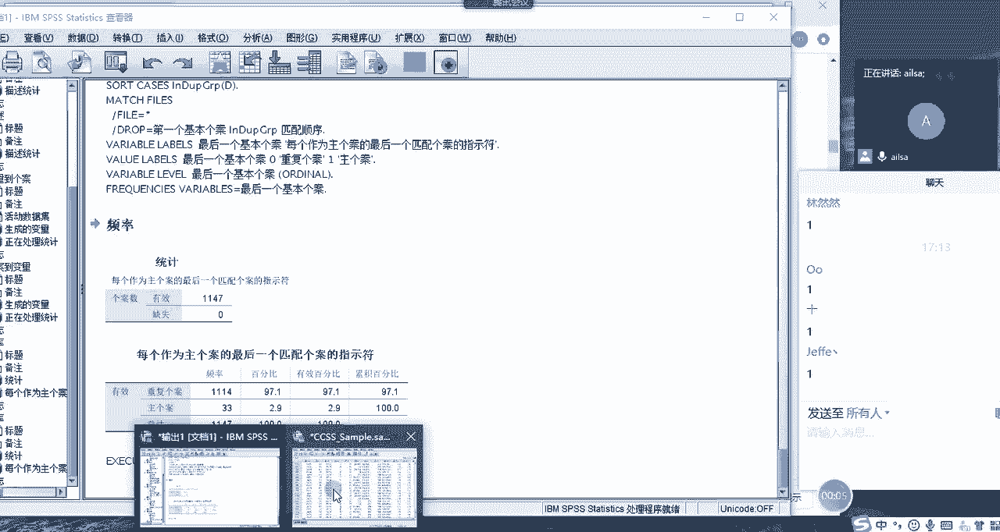
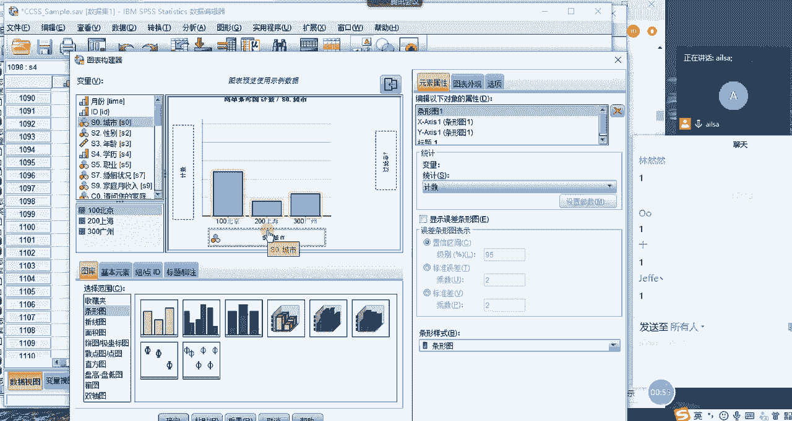
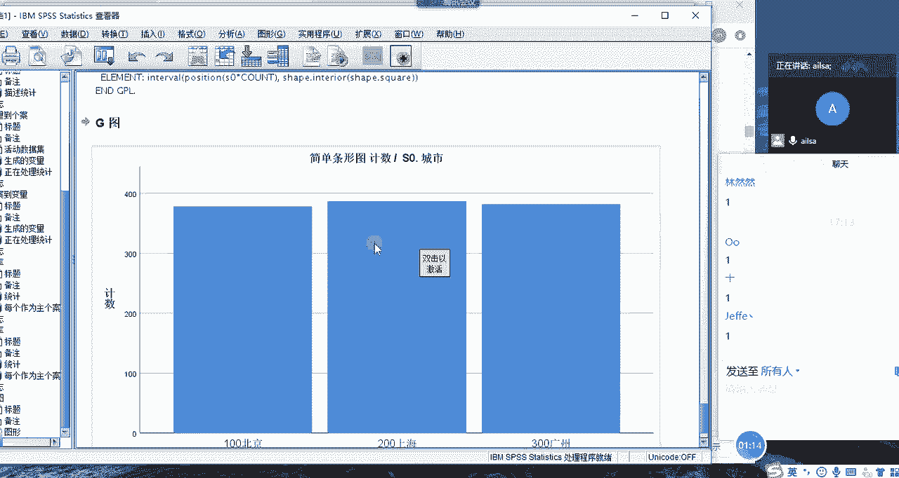
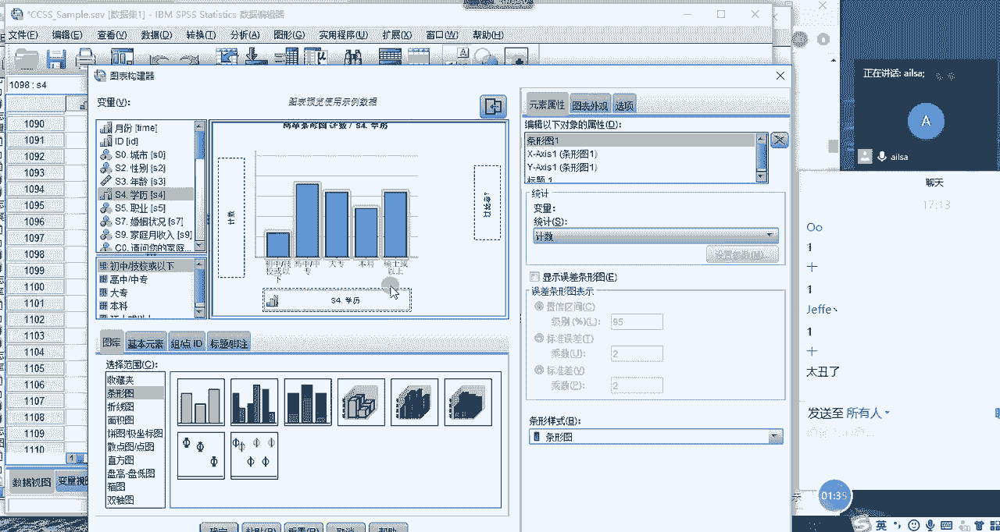
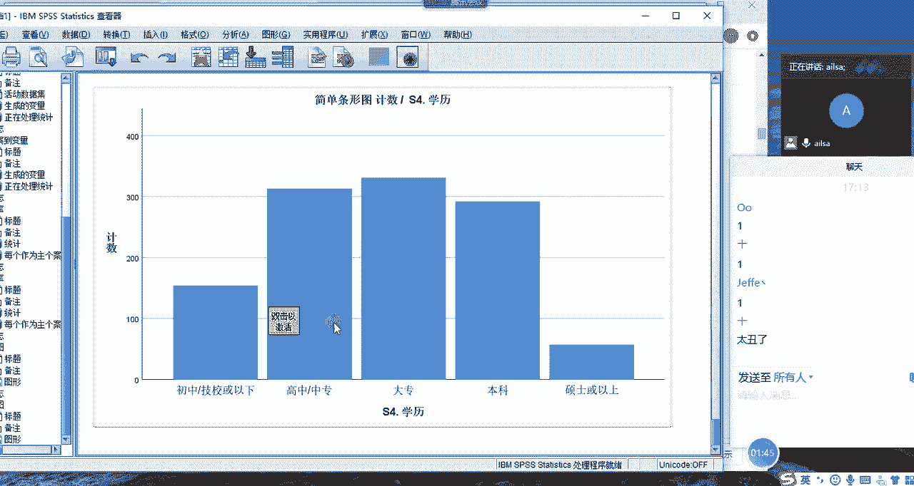
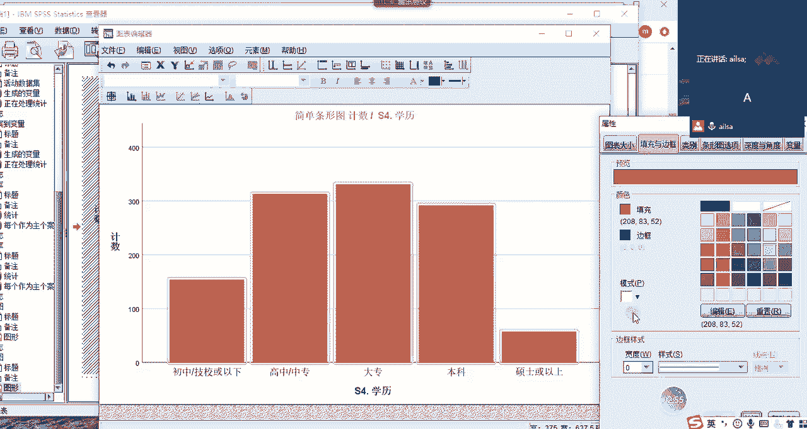
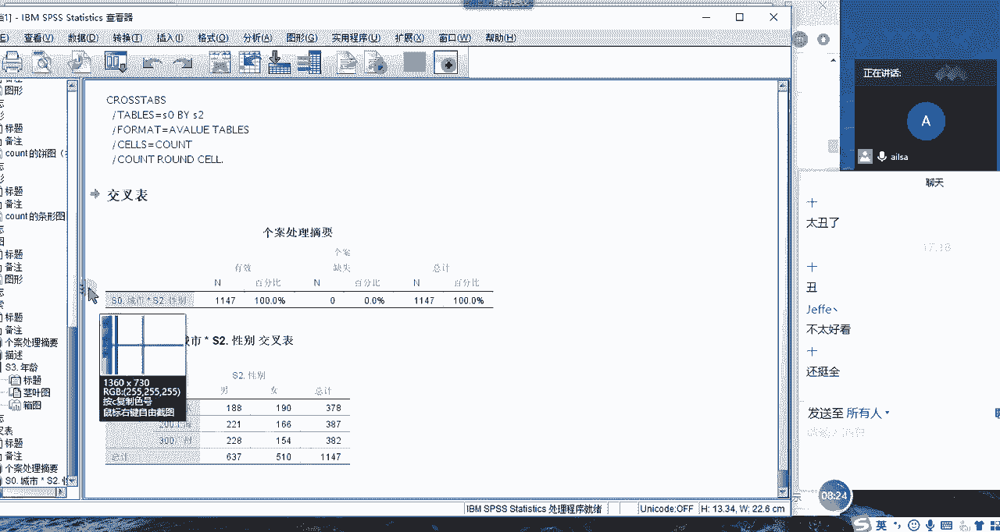
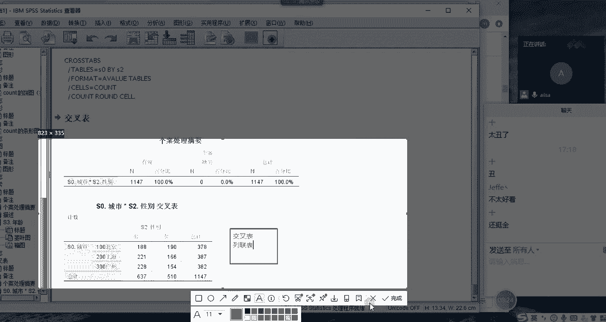
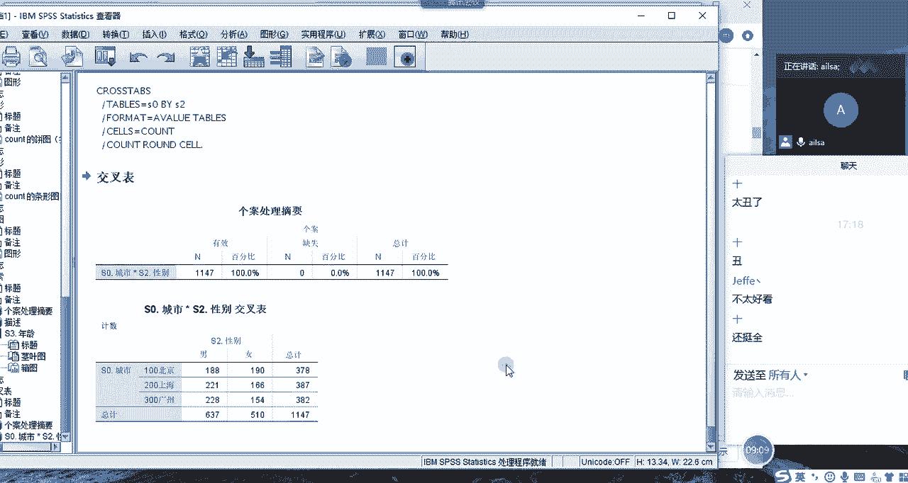

# 强推！这可能是B站最全的【Python金融量化+业务数据分析】系列课程了，保姆级教程，手把手教你学 - P96：09 SPSS图表 - python数字游侠 - BV1FFDDYCE2g

哈我们接下来讲图表啊，图形唉在SPS当中如何构建图形。

还是结合这个表哈，怎么构建图形呢，我们在我们的图形这里有两两种方式，第一种方式就是我们采取图表的构建器啊，来操作哈，大家跟着我去操作，点击图形，第一个图表构建器诶，点击完了之后。

现在我接下来有很多这样的一个图表，对不对，我们就拿最简单的柱状图哈，把它拖到这里来，拖到这里来之后，它就会显示一个图表的一个基本的结构，相信我们在讲excel图表的时候，大家也都明白。

那我该怎么去选择我对应的字段呢，也是拖拉拽的形式哈，比如说现在我想看一下，每个城市的一个分布情况，也就是说每个城市的人数大概是多少，我们只要把城市拖到这里就可以了，不用做任何的操作。

然后我们点击确定看一下，啊，这个时候他就给我显示出来每个乘数的人数啊，计数的情况，因为每个城市你看人数差不多哈，所以说整个的一个图形不是特别好看，那我们再换一种哈。

这就是我们最简单的图形的构建的一个方式哈。

我们再换一个，这个太丑了哈啊那我们还是点图形啊，点图形图表构建器啊，然后我们额选择什么呢，我们选择学历啊，学历把他拖出去就可以了啊，我们选择学历啊，作为我们的整个的一个人数统计。

然后我们再看一下整个的一个效果。

唉这个就好看一点了是吧，然后不同的啊学历，它对应的人数到底是怎么个情况。

哎这个就可以了，然后如果说我们想变，不要说太丑了，不要说太丑了尬了，唉，那如我们就可以对它进行一个，简单的一个编辑了哈，比如说加加颜色啊，加颜色啊，这是我们的，因为我选的是标题哈啊标题啊。

这个时候标题就可以加颜色，我把鼠标定位到哎，我的整个的一个啊柱状图上面哈，我不怎么用这个图形哈，我一般主要用主要用那个嗯啊，分析模型会用到一些哈，比如说直方图什么会用到一些。

比如说现在现在我选择了这个区域，然后再改一个颜色，我们应用一下哈，这个说是背景哈，背景，然后我们如果说想定位到啊，现在我定位到这个柱状图上了，然后我再改它的颜色怎么改，OK啊，稍等啊。

好我们这时候啊给它改成这个颜色，我们试一下哎，就实现了这样的一个效果，也就是说其实跟我们excel有点像，就是你选择了啊。

这是我们的一个图表的一个编辑器哈，当然这个巨丑啊啊这个更丑啊啊，然后你当你选择了某个区域之后，然后你就可以对它进行一个图标，大小填充与边框类别，然后条形的选项深度与角度变量，这样的一个设置啊。

这样的一个过程就可以了，嗯看他这个优势不在图表哈，优势不在图表啊，不要这样优势不在图标啊，优势在于他们的统计分析哈，然后啊我们还可以啊，我们还可以怎么着呢，我们还可以通过另外的一种形式。

也就是说在图形这里面，大家看到有一个旧对话框，然后我们可以选择我们所想要的图形，比如说我们选择饼图吧，嗯个案的摘要点的D，唉它就会出现这样的一个对话框，然后其实是一样的，哎我们的行和列。

也就是我们这个图形的行和列嗯，现在我想看一下，嗯你性别吧，最简单的性别头套行，哎那我们试一下啊，还不行啊，啊我们的城市套列，我试一下啊，还不行，定义分区定义依据，我们把乘数放到这里啊，这样就可以了啊。

试一下啊，这是不同的城市它对应的一个数据哈，因为他这个差不多啊，他就差不多按照还要按照性别啊，因为我选了两个，这也太丑了，丑爆了，大家画出来什么效果，还是用这个吧，这个其实就是旧对话框啊。

我们看一下条形图，我们选有简单的，有粗壮的，有堆积的丑是吗，我们选择简单的定义一下啊，啊然后我们可以根据啊，因为他这个全都有分类数据哈，不太好弄，比如说现在我根据啊呃性别吧，最简单的分类分别类种确定嗯。

他就按照不同的性别，然后进行一个计算啊，这样的一个过程哈，啊丑是丑了点哈，但它主要它主要的功能，还是用来做统计分析模型的哈，这个图表只是它嗯或者是他辅助的一个操作哈。

那大家不用对它进行一个很大的一个期待，就可以了啊，这边这边的一个就是图表构建器的话，就是你先啊，比如说你现在要改一个图表啊，比如折线图，然后你把它拖到这里来啊，他就改了，改了之后呢。

然后你把你想要的这个东西呀，或者你这个类别啊，然后拖到这里面就可以了，比如说现在我拖城市进来啊，它又是一个折线图，怎么这么多类，这只是一个技术而已啊，我的妈呀，换一个，因为这个肯定是有很多个。

然后我们再拖一下啊，这个就变成一个了哈，就是一个计数哈，刚才肯定是按什么什么进行分类了，好我们试一下啊，这是折线图，因为它这个变化不大哈，哎他这样的一个效果，就是你们知道SPSS是可以用来构建图表的啊。

就可以了啊，当你需要在SSPSS当中构建图表的时候，就可以啊，在这个地方，然后进行一个相关的操作，你比较丑是吗啊，不太好看，还是不太好看，可能是我画的问题啊，可能是我画的问题，不会画。

可能他比较经常用的是直方图啊，之前给大家画过那个直方图还是挺好看的啊，因为还是统计学上可能会多一些啊，那最后我再给大家讲一个就是我们常用的分析，这里面我们在后面一看。

其实这边有很多统计上的一个分析模型相关啊，回归啊，降维呀这样的一个生存分析啊等等这些特别多，所以说我们可以发现统计学生的知识，跟SPSS进行一个交互的话，他的你看贝叶斯这些东西很多。

我们其实有很多都不知道，但是我们也没有必要去知道所有东西，因为他的每一个分支领域，它都是有太多太多高深的东西在这里了，那我们常用的就是描述啊描述统计里面的探索，哎，比如说我现在想对年龄啊。

进行一个啊相关的分析的过程当中，我们就可以对它整个的进行一个描述统计，描述统计的话有我们的均值中位数方差，标准差最小最大，全局四分差偏度和峰度这样的一个结果，那我们还可以设置什么呢。

我们还可以设置我们的交叉表啊，交叉表，交叉表是针对行和列而言的，你比如说我想看一下不同城市，他的啊性别分类情况，我们就可以啊进行一个查看，这个时候什么叫交叉表呢，就是它的行方向有分组，列方向也有分组。

然后它们组成的这样的一个交叉，然后计算的一个啊这个所计算的一个个数啊，这样的一个结果就叫交叉表，也叫列联表啊，列联表，交叉表哈。

交叉表我们在后面会讲，分类数据分析会用到这个交叉表，非常全哈，交叉表，然后你叫列联表啊，独立性检验什么的会用到啊，列联表这样的一个啊形式。

我再给大家演示一下交叉表的一个使用方式哈，点击我们的分析，然后点击描述统计，然后点击交叉表就可以了，嗯啊把我们想要交叉的这个啊行，就放在行方向的一个分组列，就放在列方向上的一个分组啊，这样的一个结果。

同志们，嗯这就是我们SSPSS要讲的所有内容。

