# 强推！这可能是B站最全的【Python金融分析+量化交易】系列课程了，计算机博士精细讲解，底层原理+项目实战，看完即可就业！人工智能／深度学习／机器学习 - P1：1.课程内容介绍 - 口喜口合口合y - BV1su4m1u7TS

麦克阿瑟上将表示，这次教程很牛，狠心学不会，阿瑟会帮你锤爆这个阿婆主，嘿嘿嘿嘿嘿嘿，关于实战课程，我们的内容安排，咱们课程当中主要涉及到了三大模块啊，分别是啊我们的Python数据分析和处理。

在这个数据分析处理当中会给大家去讲啊，怎么样用Python诶去玩咱们的数据，怎么样处理数据，怎么样分析数据，然后呢，第二模块是涉及到我们的一个金融数据分析了，也就是说我们会拿到一些股票数据。

对股票数据当中唉，我们都能做哪些操作，做哪些个分析，以及呢对这些时间序列啊，咱们该怎么玩诶，这个是我们第二部分，第三部分我们要选择一些量化交易的策略了，比如说咱们现在写一个策略。

那这个策略究竟能够挣多少钱呢，咱们要在啊，这个历史数据当中来做这样一个回测，通过回测咱们来分析分析，我们这个策略到底是好还是不好好了，这个就是咱们的三大核心模块，向大家简单介绍一下。

一会儿会给大家来看我们的详细的大纲，接下来给大家先来看一下，就是嗯咱们在讲解过程当中。

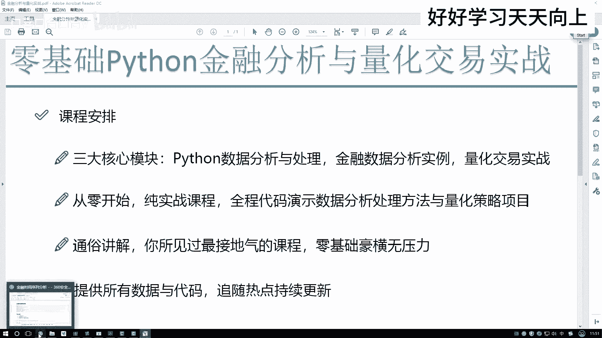

会用到的一些工具吧，现在啊就是我打开这个界面啊，就是我们课程当中啊讲解的一个界面了，咱们这个课程啊是没有PPT的，不会给大家去讲诶，这个金融的知识也不会教你怎么去炒股，我们的重点是在Python当中。

怎么样实现出来这些任务，怎么样把我这个任务给他做出来，怎么样去分析诶，怎么样做回测，怎么样得到一个结果，所以说我们的重点是什么，全部要放到代码当中，整个的课程来说，它是一个纯实战的一个内容啊。

每节课我们都给大家讲啊，在代码当中我们会怎么去做，所以说最核心的就是我们怎么样用Python处理数据，去玩数据，去做回测来去完成我们的一个量化交易的策略，好了，这个就是我们课程界面。

可能大家现在对这个界面还不太熟悉，没关系啊。

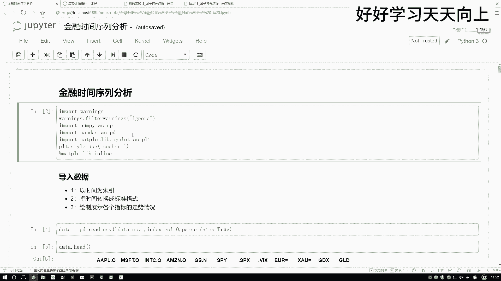

等咱们正式课程当中，我会详细给大家去讲，我们这些工具该怎么样去用啊，咱们这个代码该怎么样使用起来，在讲解过程当中啊，咱们全部的课程内容啊。

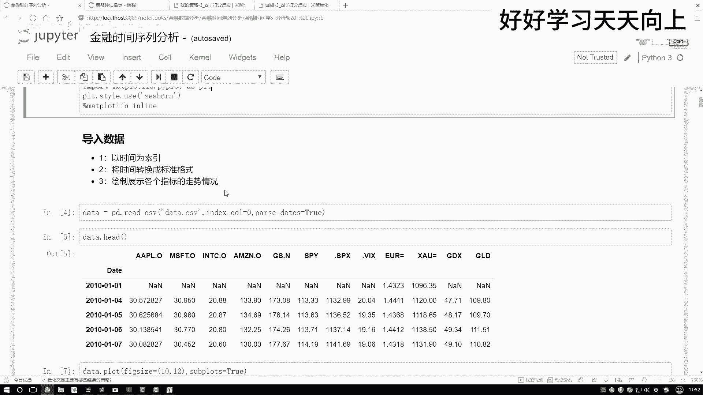

都是以这个实际数据为例子，给大家来做这个引入的，会给大家去讲啊，在这个数据分析当中，以及金融数据，还有时间序列当中一些常用的分析。

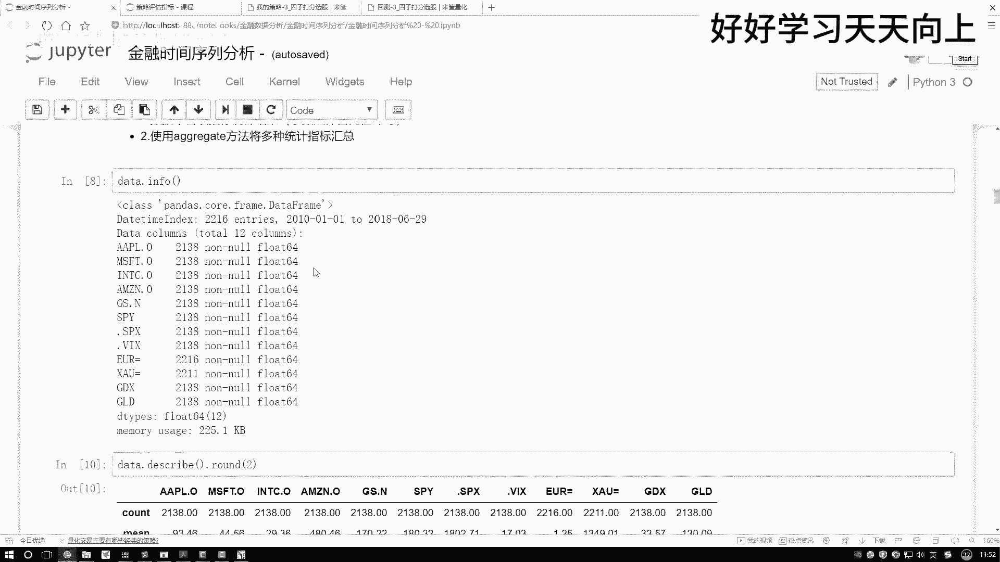

还有统计方法，咱们一步一步该怎么样去做啊，这个是我们的第一个模块，相当于我们要掌握这些Python工具包的使用方法。

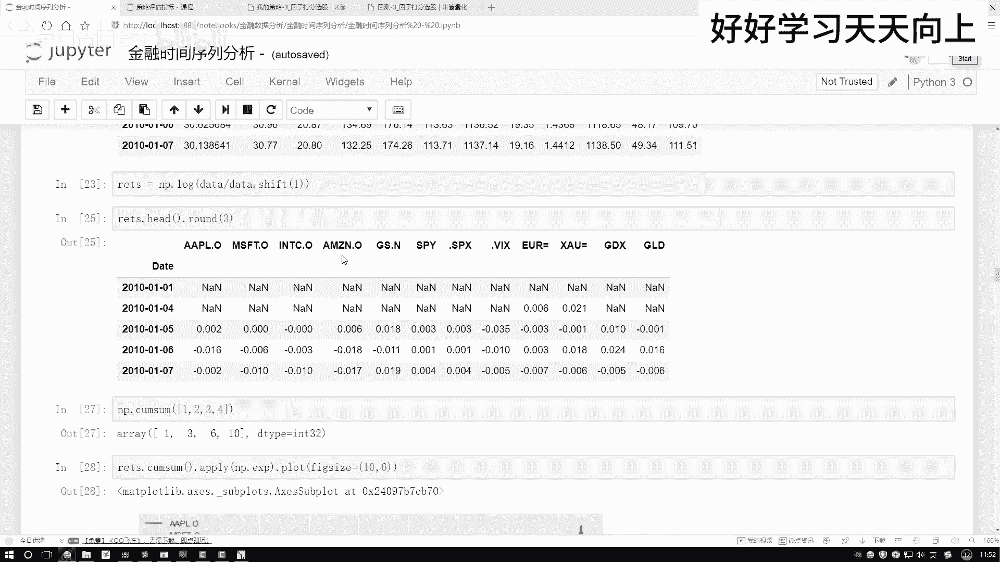

以及呢对金融数据咱们该怎么样去玩啊，这个是咱们的一个notebook啊。

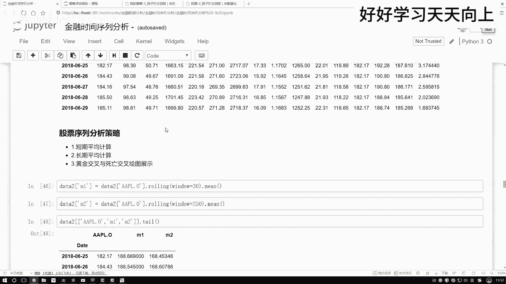

主要给大家演示我们怎么样用Python这些工具包，并且能完成一些数据分析的案例的。

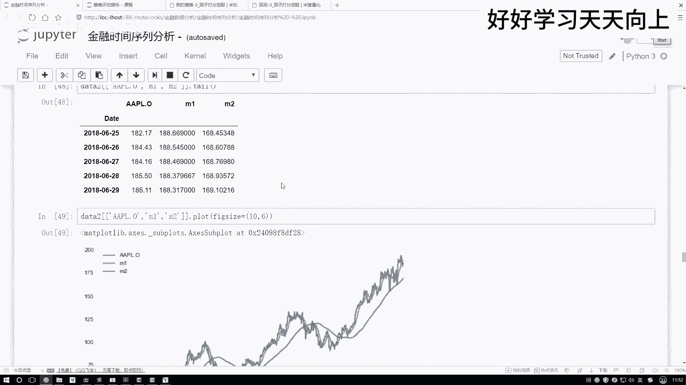

然后呢我们再来看下一个下一个当中啊，这个也是类似的，这里就是我会给大家讲，接下来我们要用到的一些回测的平台，比如说现在我有了一个量化交易策略，我脑子有个好想法，我说我想把这个策略给它实现出来。

然后呢看一看这个策略在历史当中吧，比如说从这个19年到20年这么一年吧，如果说我用我的这个策略，咱能赚多少钱啊，咱们要玩这样一件事，也就是一个量化交易，在6号交易当中，我会给大家去讲啊，每一种指标诶。

比如说一些回撤收益啊，还有一些超额收益，咱们都该怎么样进行获取，以及呢各个指标它都是什么样的一个含义。

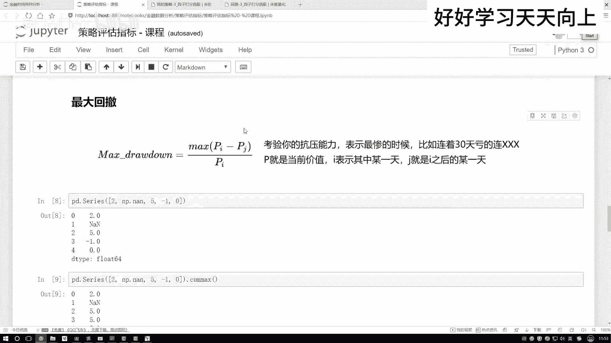

并且呢要把咱们的项目，还有我们任务应用到哪儿啊，应用到我们的一个回测平台当中，什么叫做一个回测平台啊，这个就是咱们实际写一些回测策略的时候，会用到的一款工具，我先不介绍。

等咱们政治课程当中会详细给大家去讲啊，这些工具唉，这些平台我们怎么去做，这里是这个意思啊，就是当我们现在有了一个策略之后，我想把这个策略啊，像我刚才说的用到历史数据当中看一看呢。

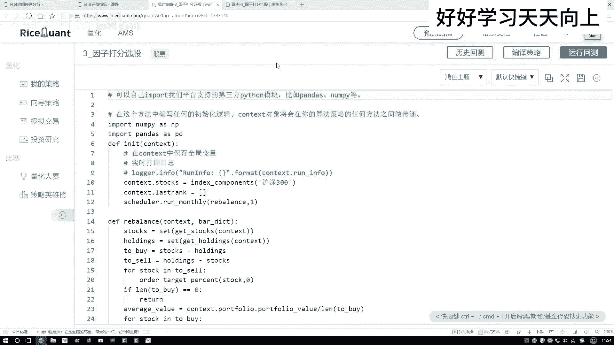

咱的一个回测结果啊，你看这里我们写了好多策略啊，就是会有一些方法以及计算。

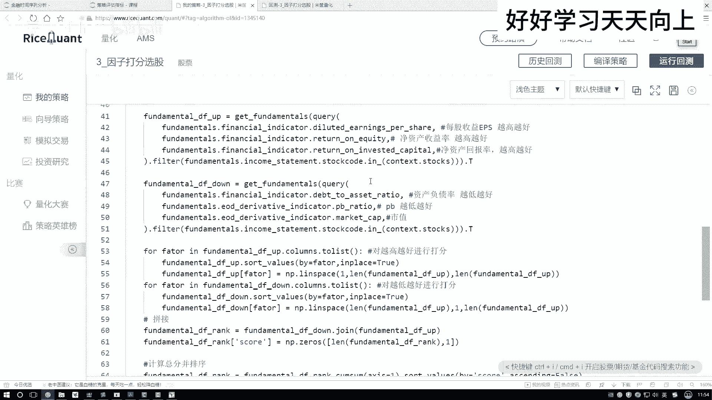

还有一些筛选，然后呢写完作业之后，我们要运行一下，运行完这个策略之后啊，我们可以看一看啊，在这个一年或者是3年五年当中啊，如果用咱们当前这个策略，我们得到的一个结果，或然后呢我们还会跟这个大盘啊做比较。

也就是咱们当前我们的一个回测收益，跟一个基准收益来比，诶，咱们到底是赚了还是赔了，以及呢当前我的一个策略来说。

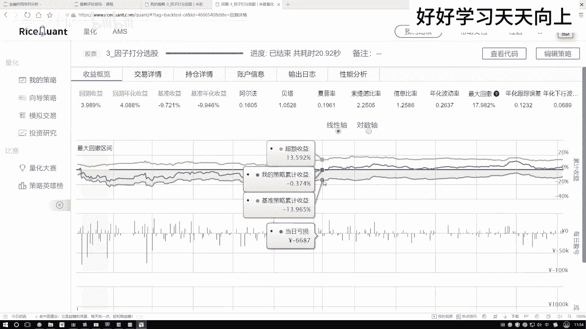

给我来能带到能给我带来的一个超额收益诶，是有多少的，这个就是我们的一个分析，还有展示的一个结果，相当于啊这里哎我们去写策略，然后呢接下来我们会执行策略，得到咱的一个结果，在这个基础当中。

它包括了我们详细的一个就是交易的详情啊。

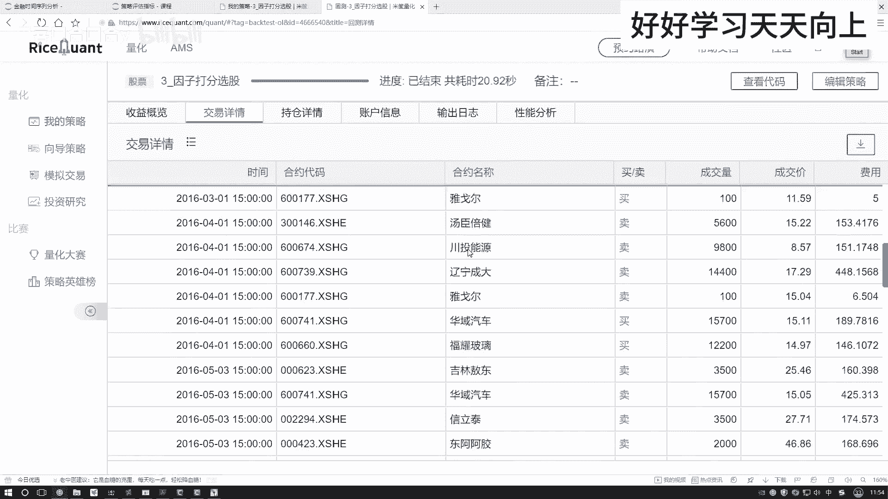

在这里每一天你买了什么东西，买了什么东西，以及当前你的一个持仓情况啊，还有你的一个账号的信息，比如说啊我给你十块钱，然后呢经过了一定的周期，唉比如说是个3年或者5年之后。

看一看这笔钱让你糟践的还剩多少钱了，到底最后啊咱们是一个赔了还是一个赚了行了，这个就是在我们的一个回归平台当中。

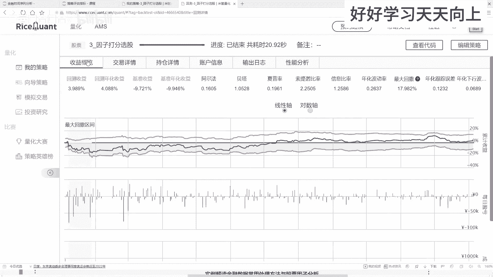

我们可以观察到的一些指标值好了，这里给大家简单介绍了一下，就是我们的几个核心模块，刚才我也说了，就是我们的客人来说是从一个零基础开始的，大家如果觉着就是以前啊我对Python不熟悉，没关系啊。

我们课程当中会先给你讲Python怎么样去用，Python工具包怎么样去用，以及呢怎么样把Python融入到这个金融数据，还有量化交易唉实际的项目当中的，所以说啊咱们的唉是一个零基础开始。

纯实战的一个课程，我们的核心重点啊，都是放到怎么样在代码当中实现诶，我们这几个功能，并且呢咱们在讲解过程当中啊，我的一个风格就是会比较通俗啊，用一种比较接地气的方式来给你去讲这个东西，诶。

这个工具包怎么样去用这个策略唉，咱们怎么设计，怎么样在平台当中完成咱们这样一个项目，所以说咱们这个策略是一个零基础，豪横无压力啊，这是咱们的风格，然后呢，并且啊在咱们的学习过程当中。

为了方便大家自己做练习，诶，自己做些小任务，我会给大家提供咱们课程当中啊，所有我们但凡涉及到的这些个数据，还有代码啊，就是但凡用的东西我们会全部提供的行。

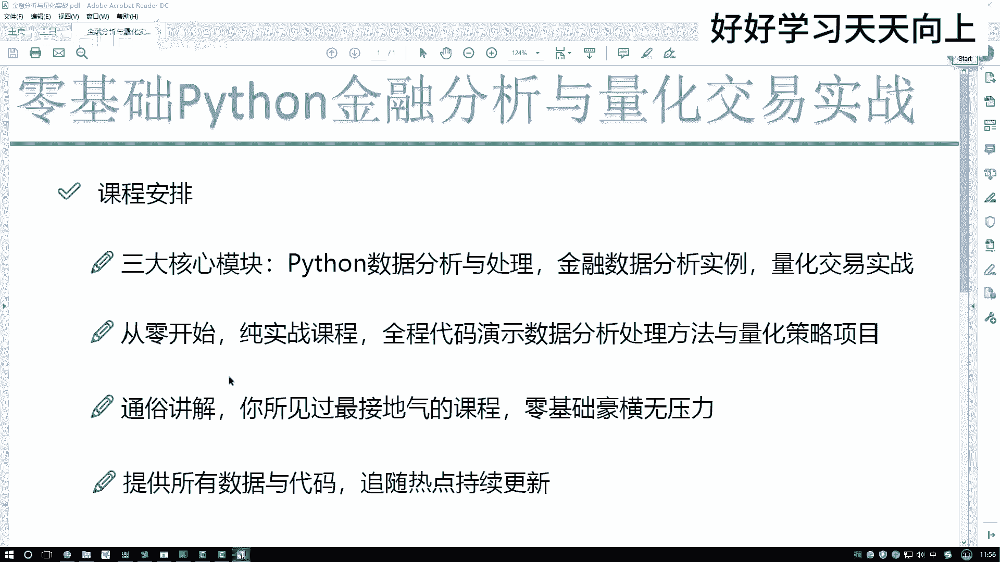

最后给大家看一下我们的一个课程大纲吧，大纲当中啊，咱们也是分了三个模块。

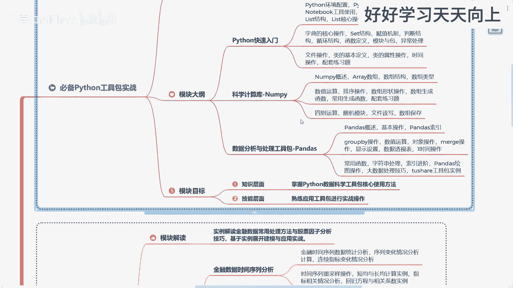

我一个一个给大家说一下，第一个模块就是一个Python必备的工具包实战，咱们刚才既然说了，哎我们的课程它是一个零基础无压力的，所以说第一个模块我先给大家去讲啊。

Python当中唉最基础最核心的一些知识点，以及呢咱们课程当中会用到这些工具，我们该怎么配置，怎么安装啊，这是第一模块，我们要打基础的，并且呢我们还会讲，Python当中两个非常重要的工具包。

后续啊也是我们主要依赖的一个叫南派啊，主要是做一些数值计算的，第二个呢叫pandas，主要是做一些数据分析，还有处理工作的，这个是我们第一模块当中啊，主要是讲诶跟Python相关的分析。

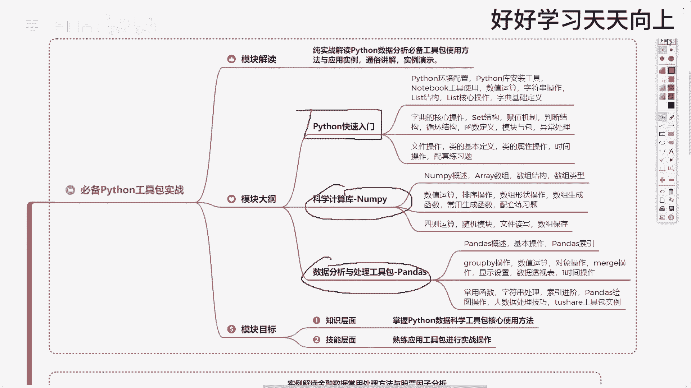

还有处理的这些工具包，咱们该怎么样去玩，然后呢第二模块，第二模块，我们要过渡到这个Python的金融数据分析当中，在这里啊我们也是一个纯实战内容，会拿到我们实际股票数据跟大家去说，一个股票数据来之后。

我们该怎么样去分析，怎么样去做建模，诶，怎么样做统计，并且呢在这个量化平台当中啊，我们该怎么样去使用这个平台来完成，我们第一个回测的一个项目，看一看我们的策略，在历史的数据当中，咱们到底是赔了还是赚了。

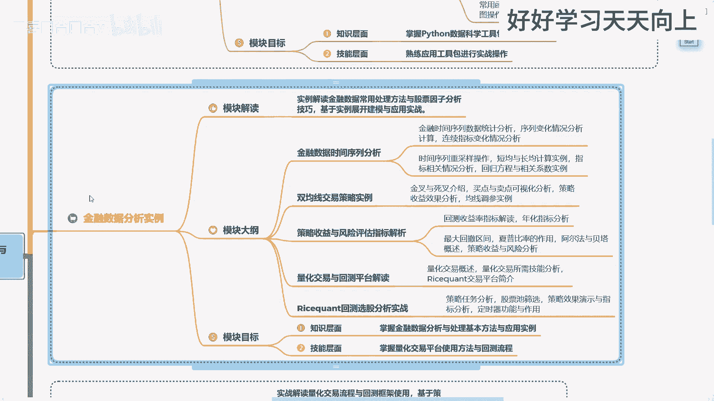

以及我们各项指标是什么情况，第三模块。

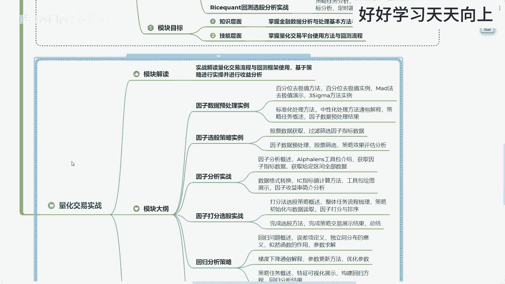

我们就是要深入到这个量化交易当中了，会给大家去讲量化交易当中，我们一些常用的经典策略，以及呢唉我们一些实际操作过程当中啊，数据我们该怎么处理，因此我们该怎么样去分析实际制定出来的策略。

我们该怎样进行改进，怎么样融入到这个历史数据当中，并且能获得一个诶比较好的一个收益的结果。

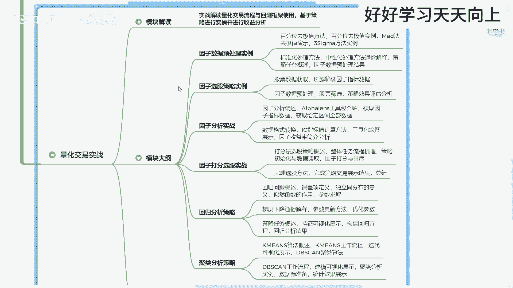

好了，这个就是我们课程大纲当中啊，主要涉及到的三大模块，跟大家简单的做了一个介绍行了。

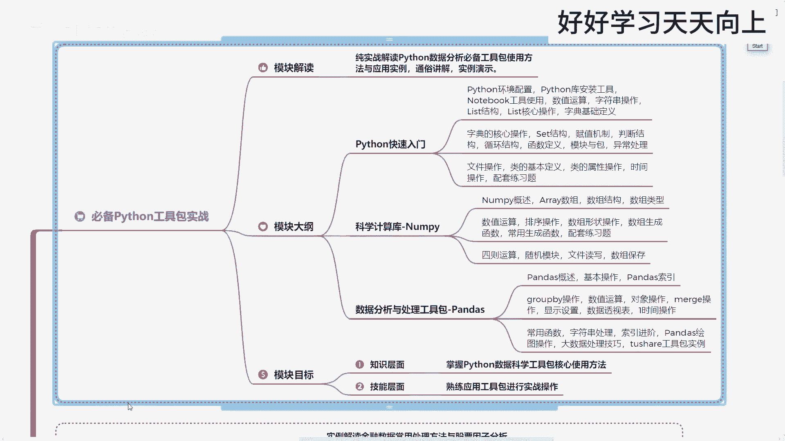

这个就是咱们第一节课来说，我们的一个主要内容吧，给大家简单概述一下咱们课程的内容，以及呢我上课的一个风格，还有啊就是我们会涉及到诶哪些个知识点。

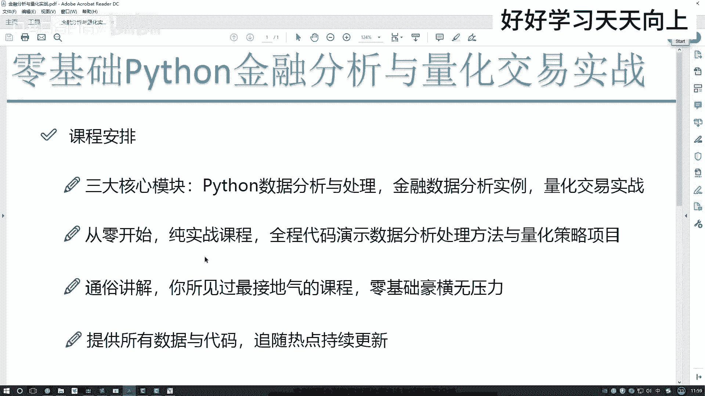