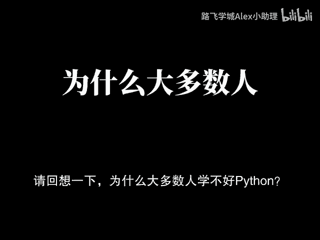
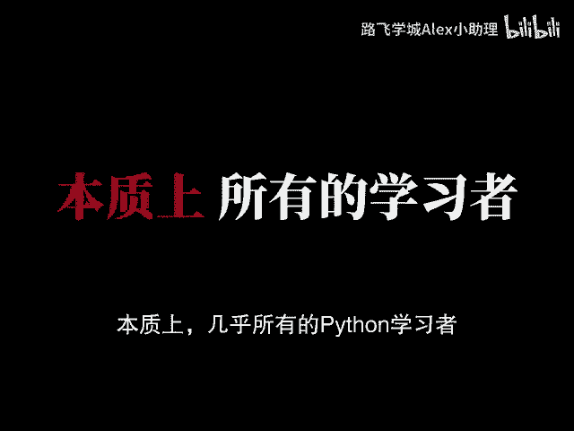
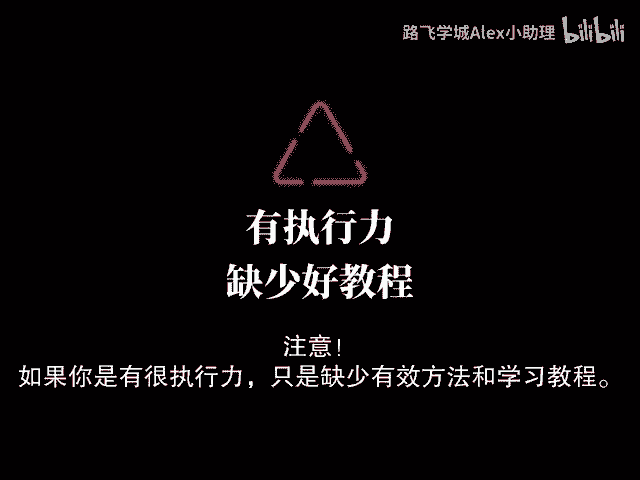
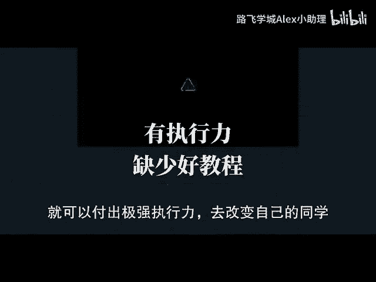

# 强推！这可能是B站最全的【Python金融分析+量化交易】系列课程了，计算机大佬精细讲解从入门到项目实战，看完全程即可就业！ - P1：00 课前先导 - Bug结丹期 - BV1eRUBY8ExU

哥您说那不是激情，您说的那是pon pon Python。

你是你是你是程序员，你还Python，几乎所有的Python学习者，现在的编程水平根本配不上你的努力程度，你不要误解，我没有说你们多努力，而是Python学习这件事本身就极其简单。

是你所处的环境灌输给你的信息，把Python学习这件事妖魔化罢了，我要带给你的是对Python学习的趣味，我也很明确的告诉你，想学好Python根本不需要天赋，本质上靠的就是记忆力。

完全可以通过高频次的重复，利用练手案例实战来强化理解掌握，对于很多人而言，实际上完全可以学到，原本连自己想都不敢想的编程水平，啧啧啧，请仔细思考一下，♪ 为什么很多人学不好Python ♪。

♪ 可以在弹幕上留下你的观点 ♪，这些其实都是次要的，♪ Python作为一种广泛使用的编程语言 ♪，♪ 其应用范围非常广 ♪，♪ 泛 ♪，从简单的脚本编写到复杂的数据分析，♪ 机器学习 ♪。

web开发，自动化运维，♪ 游戏开发等各个领域 ♪，从表面上看，Python要学习的内容确实非常多，然而这并不意味着，你需要一次性学习完所有的内容，但是几乎所有人都有个通病，♪ 每天起早贪黑 ♪。

♪ 起得比鸡早 ♪，睡得比狗晚，没日没夜的学，今天学点滴，♪ J狗 ♪，明天学点爬虫，后天又学点前端，一个月以后发现好像啥也没学会，还怨天尤人，说自己没有天赋，努力了却没有得到应有的回报。

实际上不过是无效努力，自我感动罢了，我无意给大家刻意营造所谓的焦虑，说的不过都是事实，请回想一下，为什么大多数人学不好Python。

总结概括就是两点，一极为不科学的学习路径，二极为低下的学习方法，就像那些效率低到令人发指的课堂，1000多个小时，一堆啰嗦的颜值舞物，你还硬着头皮听，甚至放假刷回短视频。

还要被很多学习博主的10分钟学会拍摄，诸如此类的方法所误导，怎么可能学会看到这里的同学，可以在弹幕上扣一个666。

说明你还是很有耐心，是真心想要学好Python的，本质上几乎所有的Python学习者。

整个学习阶段踩的坑都是有极强共性的，但是这些问题没有人帮你解决，我也整理了Python学习常见问题，100问可以作为你的参考，我可以很明确的说，很多人完全可以学到，自己连想都不敢想的编程水平。

不过是低效的学习方法和错误的学习路径，限制了自己的上限，这套课程是老师VIP内部Python全系列，高级架构师课程，Python中入门基础版核心基础，首次发布最新的Python小白教程，从零开始。

针对零基础小白和基础薄弱的同学学习，全程干货细讲，这个时候弹幕评论区一定有人说了，绷不住了，懂了又是一个卖课的，我可以很明确很坦诚，很直接的说，这个视频就是广告，而且还是拿很多钱投出来的广告。

后面我要推广的课程就是我的目的之一，但就是这个广告视频会帮助很多人预习，注意如果你是很有执行力，只是缺少有效方法和学习路径。

给到你明确学习方法和规划之后，就可以付出极强执行力去改变自己的同学。

这套视频可以帮你改命，但是如果你只想看点励志视频，感动自己，妄图看一会视频，一套大招课程就可以逆天改命，执行上三天打鱼两天晒网，对不起，这套课程帮不了你，耶稣也帮不了你，如果还要认为我是一个镰刀。

就可以退出这个视频了，毕竟天不润无根之草，佛不度无缘之人，啧啧如果你已经看到了这里，那么恭喜你，本期的重中之重，马上就要给大家透露一下了，你可以发送任意一条文字的弹幕，证明你没有中途退出。

那些看一半走了的就真的太可惜了，看了半天都没有看到重点，所以你们准备好了吗，我想告诉你的是，网络上成千三万0散的编程教程，没有一个完整的体系，看的越多，你就会越感到迷茫痛苦，甚至想要放弃，时间消耗了。

却没有获得应有的收获，这也是不少网友的真实处境，我想告诉你的是，编程小白，如果不打好基础，东拼西凑，盲目想挑战高难度的项目，基础没打牢，却只去求成，你的编程生涯将会走得无比艰难，我想告诉你的是。

在这个人人具有副业，互联网，人工智能快速发展的时代，掌握一门在家就能接单的技术是多美的事，为了让零基础的小伙伴学起来没有负担，你们的学习思维导图我也全部准备好了，还有视频中所用到的软件安装包。

激活码以及各种项目源码，练习手册，课件等等，评论留言111即可全部免费白嫖，如果看到这里对你有所帮助的话，请给老师一个免费的一键三连吧，让更多想学习编程的小伙伴看到这个视频。

接下来我们从P2开启这套系统课的学习吧，♪ 梦想在每个清晨敲打我心房 ♪，♪ 送你片汪洋 ♪，♪ 现在就启航 ♪，♪ 勇气是信仰 ♪。

