# 强推！这可能是B站最全的【Python金融量化+业务数据分析】系列课程了，保姆级教程，手把手教你学 - P1：1.数据分析秘笈介绍 - python数字游侠 - BV1FFDDYCE2g

各位同学大家好啊，那么这个接下来这段时间呢，就由我带着大家系统的去学习一下，我们Python当中数据分析这样的一门课程，那么首先呢先自我介绍一下，我的名字呢叫做张晓波，那么大家可以叫我波波老师啊。

那么我从事这个教育培训讲课，这样的一个行业呢已经有几年的时间了，那么之前呢在百度地图从事了4年的，开发岗的一个工作，那么在百度地图的后期呢，我主要是做这个数据分析，跟机器学习相关的一个开发工作。

那所以说咱们整个的一个课程的一个设计，也是围绕着我当时在百度地图积累的一，些个经验，包括所涉及到的技术站制定的，咱们整个的一个课程，那所以说大家如果能够系统地，将我们整个的课程进行一个学习。

那么相信各位一定是可以找到一个，数据分析相关的一个工作，OK吧，那么这一小节呢啊，咱们主要就是对数据分析呢，进行一个初步的一个介绍，让大家能够知道什么是数据分析。

我们学完数据分析之后可以做怎样的一个工作。

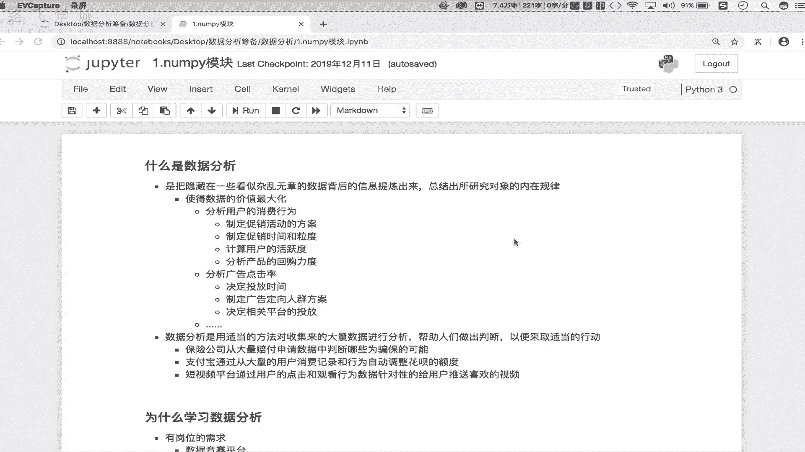

OK吧，那么首先咱们先来看一下这个初步的一个概念，何为数据分析对吧，那这块的话啊，我没有把这个它官方文档当中，一个比较学术性的概念抛出来，这块的话是我举了一个比较形象化的概念。

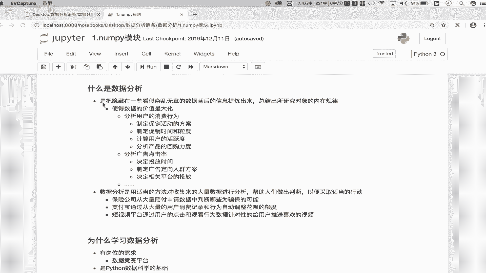

来给大家去阐述一下何为数据分析，OK吧。

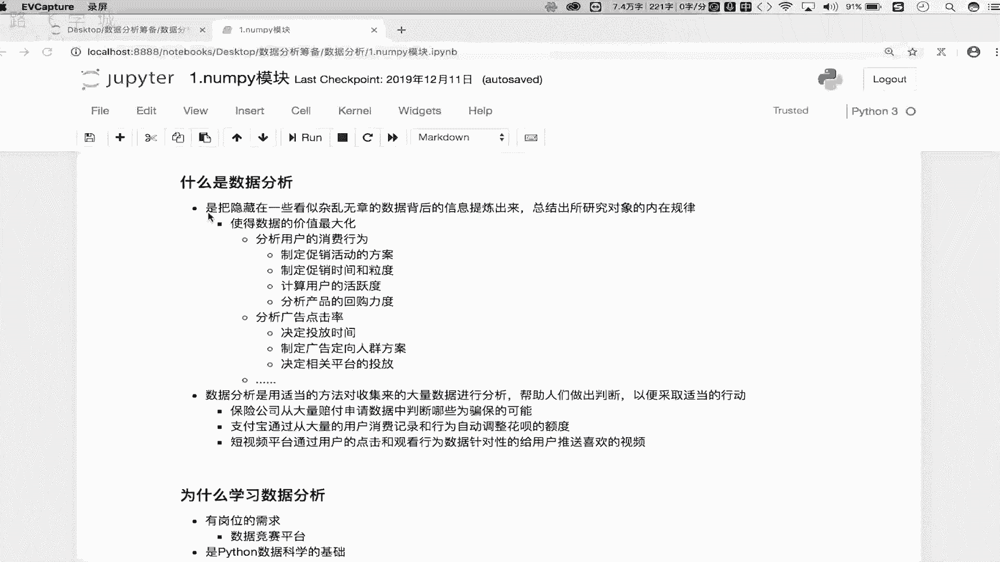

那就是说我们所谓的一个数据分析啊，就是把一些看似杂乱无章，且量级比较大的这些个数据，背后的一些有价值的信息提炼出来，并且可以总结出这些数据所存在的一个，内部规律，那这样的一个简短的概念。

就是我们数据分析所对应的一个概念，OK吧，还是比较好理解的，是不是啊，所以说再强调一下咱们的数据分析，主要是对一些看似杂乱无章的这些个数据当中，提炼出一些个有价值的信息吧对吧，那么这些有价值的信息。

也可以称之为是这些个数据所存在的，一些个内部规律，那么这些有价值的信息，包括这些个内部规律，可以帮助我们实现很多不同的功能，OK吧，那我们来举个例子哈，你比如说，那我们现在已经知道了。

这个数据分析的一个初步的概念了，对不对，那么你想那数据分析它最有价值的一个意义，或者说它最大的一个作用是什么呀，这块先给大家进行一个阐述，OK吧。

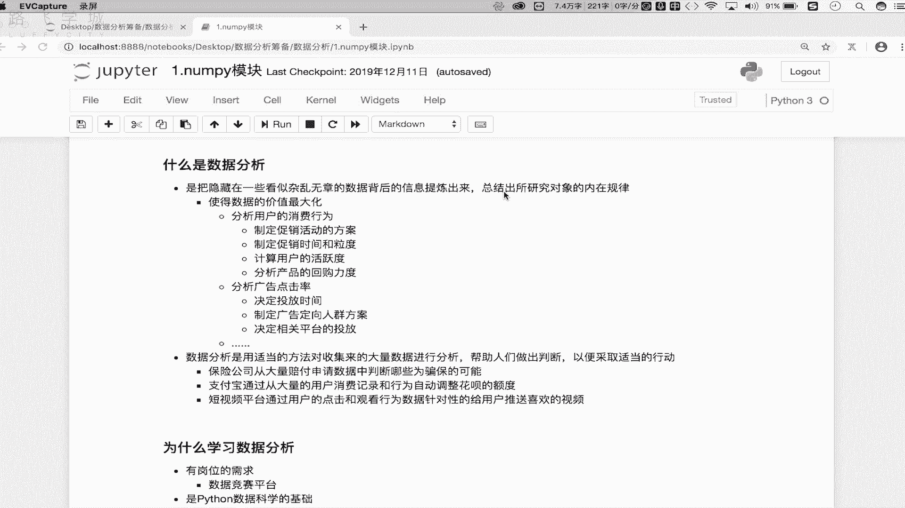

那这块的话就简单的来说，那么我们所谓数据分析，它最主要的一个作用，就是可以把我们数据的价值最大化，那这一块的这个价值，主要是体现在咱们的一个综合收入当中吧，对不对，那么各行各业。

它都是需要有价值的一个产出的吧对吧，那么我们就可以基于数据分析这样的一个技能，可以使得咱们的一组原始数据让它的价值，让它的利润对吧，能够产生一个最大化，OK吧好，那么这个如何使用咱们的数据。

能够让它价值最大化呢对吧，那么最大化的这些个数据对吧，那有怎样的一个意义呢，那么来举这么几个例子。

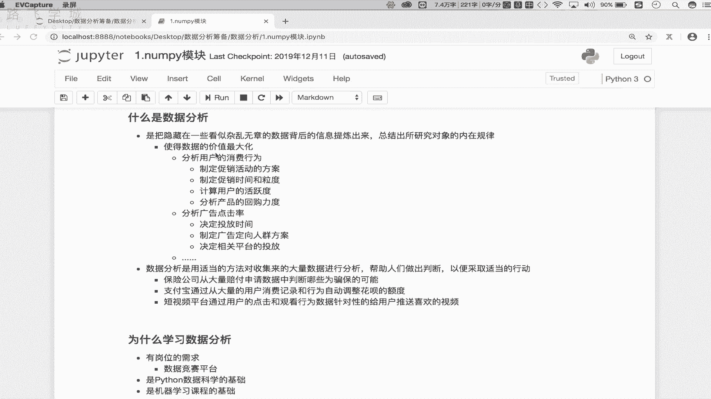

你比如说哈，那么咱们可以基于我们的数据分析，这样的一个技能对吧，可以去分析咱们用户的一个消费行为，OK吧，那就是说比如说有一些商家对吧，他想对吧，制定一些个活动方案来搞一些促销。

那么这些个促销的方案怎么制定呢对吧，那么你促销的一些个时间，和你促销的力度又怎么去衡量呢对吧，包括你想知道你的一些个往期的一些个，消费用户对吧，他们的一些个回度，包括他们的一些个回购能力到底是怎样。

那么都可以使得这个商家，基于他们往期所产生的这些个消费记录，对应的这组数据进行一个系统的分析，那么分析出来对应的结论，咱们就可以用来去制定咱们促销所对应的，一个方案对吧，可以去制定咱们促销的时间。

和我们促销的一个力度，并且我们还可以计算出我们对应商品，它的一个回购的力度到底是怎样的，OK吧，这是一点，那么还有一点指的，就是说我们在各大平台当中对吧。

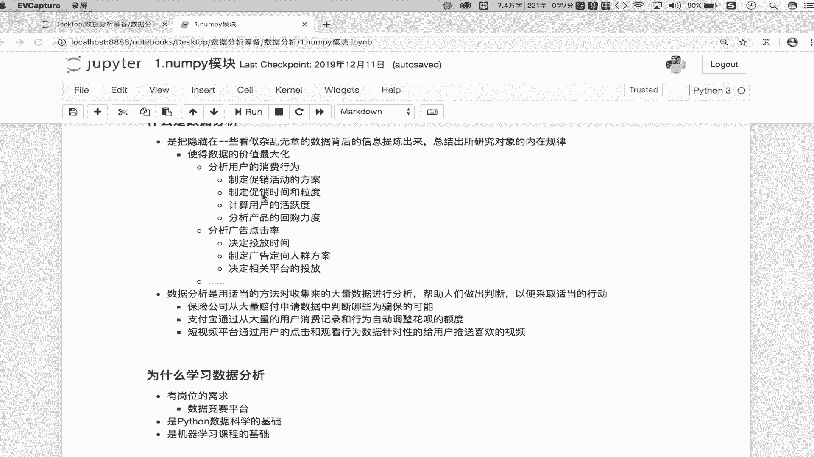

都会看到一些个广告的投放，是不是，那么你想这些个广告的商家，他在投放广告的时候，他会不会事先去制定相关的策略去设计广告。

去选择指定的平台去投放广告的。

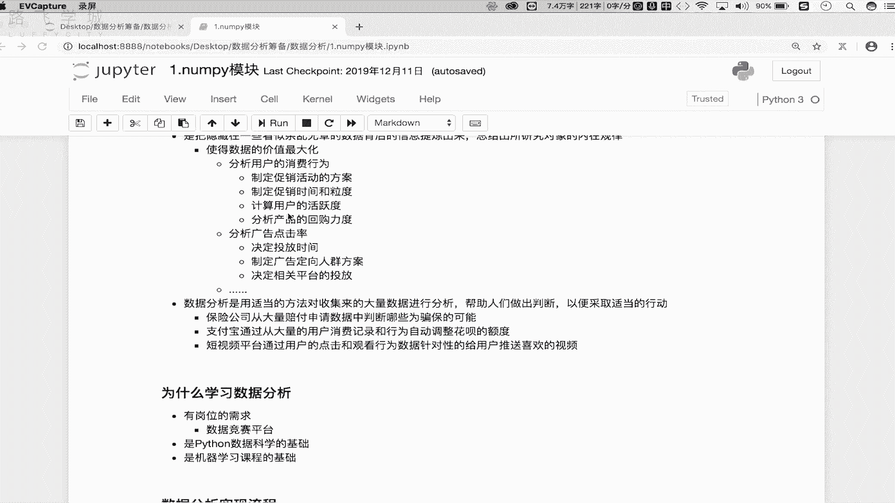

那么这个广告它的一个投放时长，或者广告它的一个播放时长，那么怎么制定，能够更加切合用户的一个观看的一个行为呢，对不对，那么这些也是可以通过网七的这些个用户，对于广告，观看广告。

点击的一些个历史的行为数据进行一个分析，然后将分析的结论产生之后，我们就可以去制定我们广告的投放时间对吧，也可以针对性地去制定我们广告的内容去符合，去吻合相关定向人群，对不对，并且我们也可以去决定。

那我的广告是投放在哪些平台呢，是投放在ITE呢，还是投放在腾讯呢对吧。

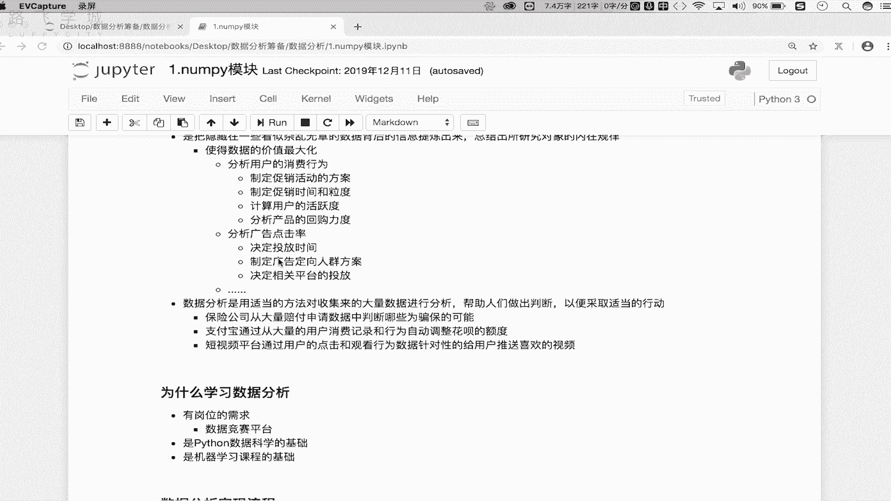

都可以基于往期的历史数据进行一系列的分析，最终得到指定的结论之后，可以帮我们制定相关有效且价值。

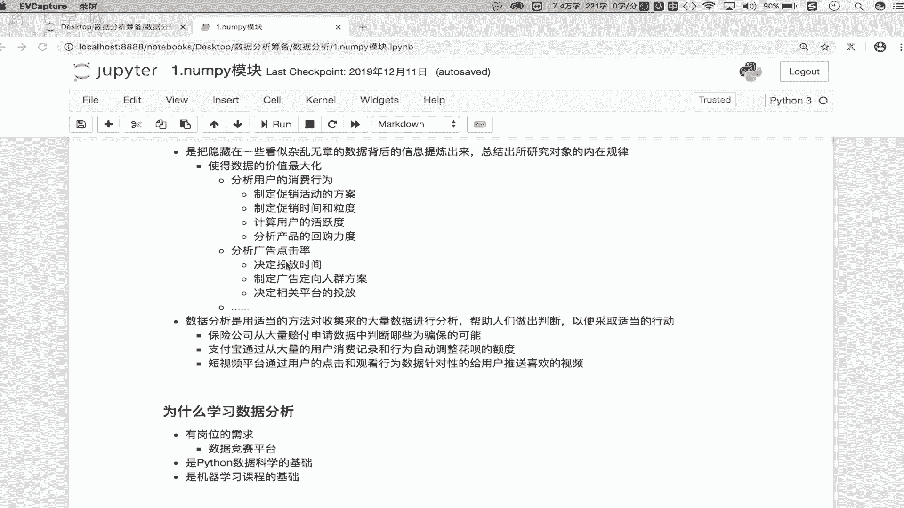

最大化的一些个策略，是不是，那这块的话，咱们就通过这两个例子，阐述了什么叫做数据价值的最大化吧对吧，对往期的历史数据进行一系列的分析，咱们就可以找出这组数据内部所存在的一，些个规律。

或者找出一些个有价值的信息，帮我们使得我们整个的一个价值收入，利润的一个最大化。

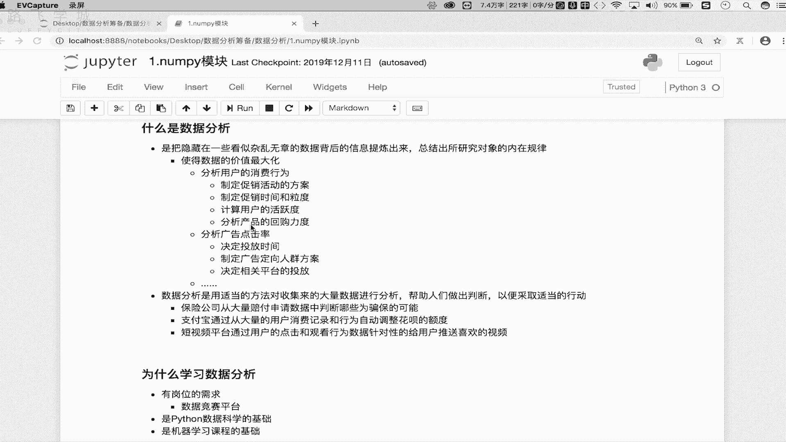

对不对，OK吧，那我们还可以从另一个点来分析。

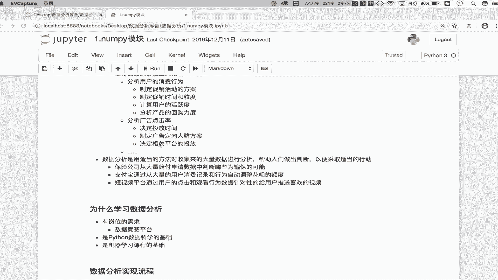

来阐述咱们数据分析对吧，它的一个作用包括它的一个概念。

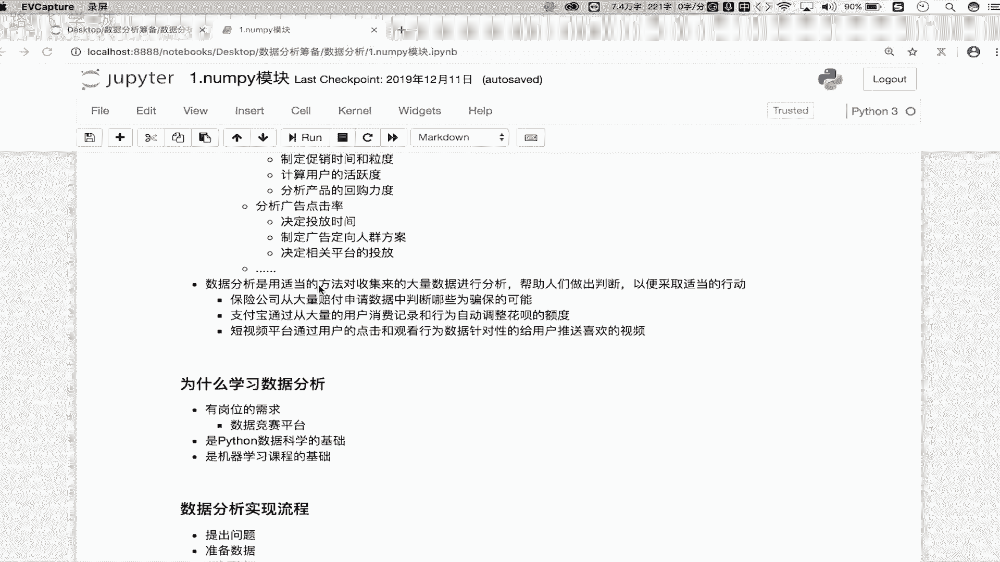

那看第二点就是说咱们的数据分析啊，是用适当的方法，对收集来的大量的数据进行产生一个分析对吧，那么最终分析出来的结论，包括我们分析出来一些有价值的信息，可以帮助人们做出一个精准的一个判断对吧。

那基于这样的一个判断，可以帮助我们采取合适的行动，然后让我们的一个价值，让我们的一个利润能够得到一个最大化的保证。

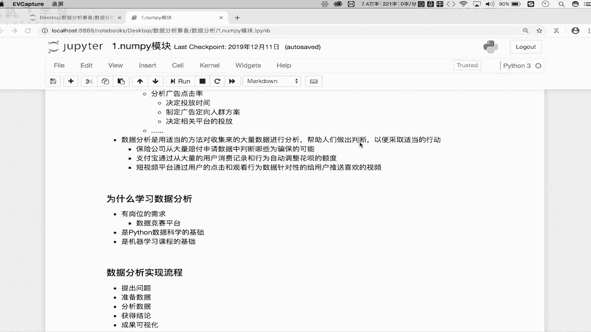

对不对，那再比如说这块又给大家举了这么三个案例。

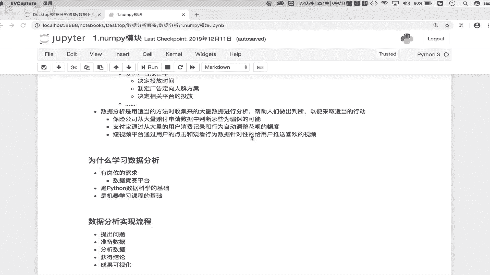

第一个例子，你比如说那保险公司，可以从大量往期的这些个用户的赔付，申请的数据当中可以精准的分析，且判断出有哪些是骗保的一些个可能吧，那你要知道那骗保对保险公司的一个什么呢。

一个一个这个收入是有一个非常重要的一个，影响吧对吧，所以说那么我们的保险公司内部，一定是有相关的这些个比较专业的，高精尖的这些个数据分析的专员对吧，可以对往期的这些个赔保的数据进行一个分析，对吧。

那如果再次来到一组新的赔保数据的话，那我就可以断定这个赔保数据到底是啊，它的一个可能性到底是多少，对不对，再者说我们的支付宝当中的一个花呗，它的一个额度，那为什么每个人的额度可能都是不一样的呢。

那么这个支付宝它对花呗的额度是怎么制定的，怎么协调的，是不是，那肯定支付宝内部也是有相关的，这些个数据分析的专员，能够对大量用户的一个消费记录，和他的一个消费行为对应的，这些个历史数据进行系统的分析。

最终得到指定的结论，可以基于这个结论为衡量的一个标准，去设定相关用户他花呗的一个额度呗对吧，你再比如说我们的一些个短视频平台，它的一个啊呃视频的一个推送，包括一些广告的一些个推送。

它也是一定是基于大量用户的一些个观看行，为的数据对吧，可以知道用户的喜好，可以对我们用户进行一个精准的画像，那对用户的一个画像，也一定是基于用户他长久以来所产生的，这些个观看的行为数据进行一个系统分析。

对不对。

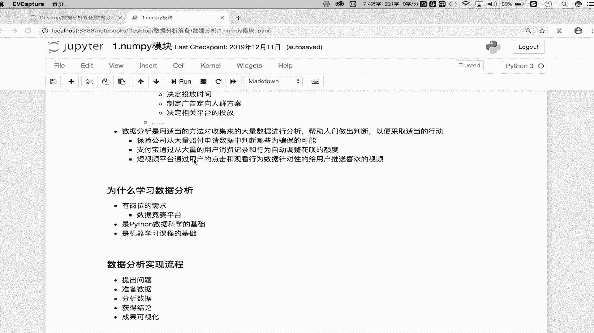

那从这几点我们就可以大致的初步的感受到，我们的数据分析它有怎样的一个作用。

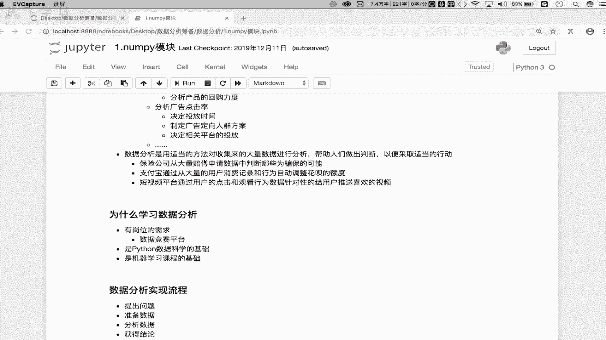

并且数据分析可以作用在我们生活当中的。

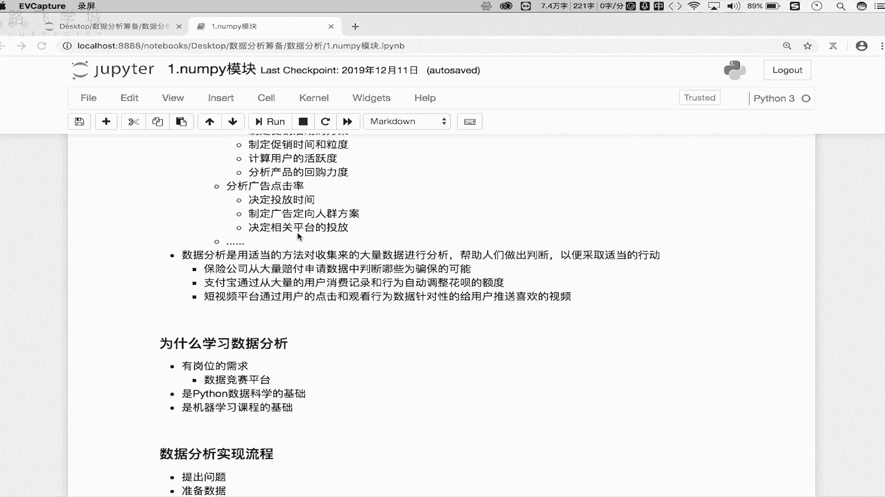

哪些方方面面，对不对，OK吧，好。

这块呢是对我们数据分析这样的一个专业技能，进行了一个初步简短的一个介绍，OK吧。

那么接下来为什么咱们需要学习数据分析呢，那首先这三点大家务必事先要了解。

第一点是有岗位的需求的，那大家也可以去找一下相关的招聘的平台，比如说现在比较火的boss直聘对吧，那我们可以从boss上去搜一下，相关数据分析岗位的一些个需求量对吧，你可以看一下。

那数据分析需要我们掌握哪些专业技能，包括数据分析这个岗位，他的一个需求量到底是有多大。

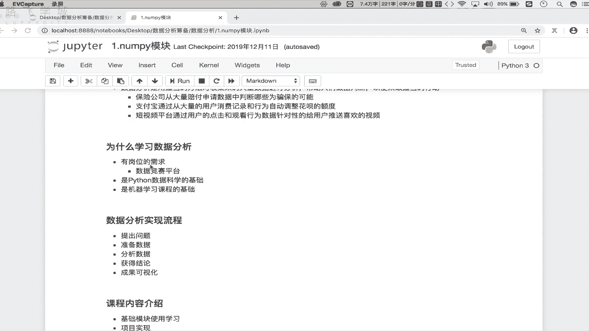

对不对，所以说我们的数据分析，目前是有相关岗位的一个需求的。

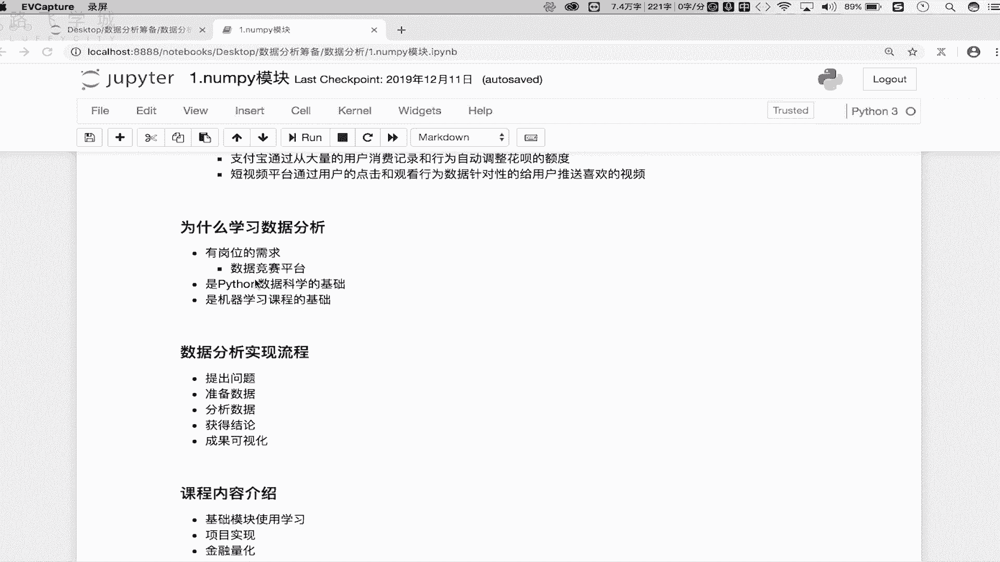

那还有点就是说，那比如说之前我们能够接触到的一些个，比如说啊移动端的开发，包括我们网站的开发，这些专业性比较强的开发岗位工作，是不是主要是适用于互联网整个的行业当中啊，那咱们的数据分析的岗位。

他的一个咳需求面会更广一些，为什么呢，因为我们知道，那现在我们各行各业啊，现在各行各业都会有数据的一个产生吧，那各行各业甭管是我们的传统行业，还是我们的互联网的新兴行业对吧。

不同的行业它都会有相关数据的产生，那么这些个数据最终都是需要基于数据，能够让这家企业它的一个价值，它的一个利润能够最大化，那怎么实现呢，就需要有相关的专业人才对岗位。

对这个企业所产生的数据进行系统的分析，可以使得这个岗位的价值能够实现一个最大化，对不对，因为我们说数据分析，不光可以使得我们的利润最大化，也可以帮助我们的岗位，对历史的相关的数据进行一个剖析或分析。

能够帮助企业做出正确的决策，是不是，所以说第一点是有岗位的一个需求，那除了有岗位需求，现在有很多在校的大学生，他们都在关注数据竞赛的相关平台，你比如说现在这个数据竞赛平台比较火的。

国内的我们有阿里的天池，对不对，还有京东啊，还有国外的cargo等等这些数据竞赛的平台，那平台它的一些个用户呢，大量都是这些个在校的大学生，或者是专职于企业做数据分析，做机器学习相关的一些个人员。

他们会在这些个数据竞赛的平台当中去接单，对吧，比如说那有的一些个企业，它可能会将企业内部所需要处理的一些问题，对吧，他可能自己解决不了，那怎么办，他可以把这些个问题，包括把问题所相关的数据。

都放到数据竞赛相关的平台当中，他会他会发布一些个赏金对吧，那如果有专职的人员，能够把这个问题给他进行一个剖析或分析，得到指定的结论反馈给企业，那么就可以拿到企业所发出的这些个赏金，OK吧。

那么这些个数据竞赛的平台，大家也可以去关注一下，OK吧，那你怎么去搜呢，打开百度，在百度里边你就可以录入数据竞赛平台，那么它就会给你告诉你有哪些比较常用的，比较火爆的数据竞赛的平台。

大家也可以点进去注册一个账号对吧，看一下它里边所发布的这些个任务。

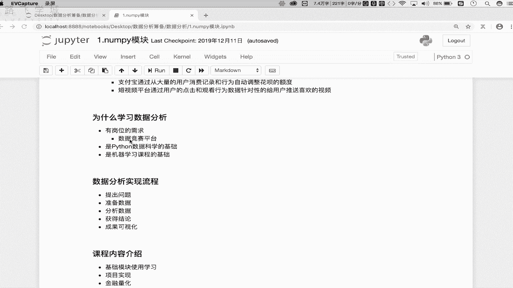

企业所面临的一些问题到底都是有哪些。

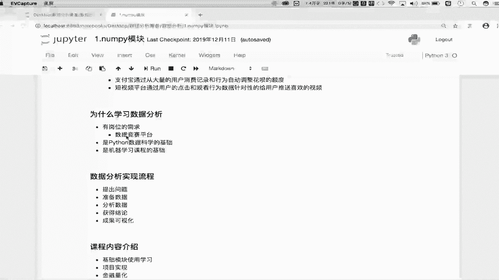

对不对，那么从数据竞赛这个平台当中你也会放，你也会看到，那么这些内部所驻扎的这些个企业，不光是互联网企业，还有比如说一些个传统的制造业的企业，都是有很多的，OK吧，大家可以去关注一下，那么第二点。

咱们的数据分析是我们Python数据科学的基础，OK吧，那我们都知道我们Python的整个的优势就在于，它实现爬虫，实现数据分析，实现机器学习，它的力度是比较大的，对不对。

那就是说它的优势主要是用作于机器学习，或者是数据分析的吧，对不对，那么你在进行数据分析，包括在后边进行机器学习的过程中，一定会需要用到大量的相关的数学运算，那么这些个数学科学运算。

它的一些个基础都已经被我们的Python封装好了，OK吧，那就是说在咱们的Python数据分析，整个的一个啊到框架或者模块当中，已经给我们集成好了，大量各种各样你想得到的或者你想不到的数据。

或者说数学科学对应的模块，那基于这些个模块，咱们就可以进行任意形式的数据分析，包括任意形式的科学的数据运算，OK吧，那么第三点啊，我们的数据分析是机器学习课程的一个基础，那有的同学可能日后想要往这个。

机器学习方向去转对吧，那你转的一个前提是你一定要有相关的基础，那么这个基础指的就是我们的数据分析，OK吧，那也就是说，咱们数据分析是机器学习的一个基础，那如果基础你打的比较牢靠。

那么日后想往机器学习这个方向去转的话，就会有一个很好的一个铺垫了，OK吧，那么这三点就是说为什么咱们要学习数据分析，那么最起码目前各位哈，那这三点肯定，其中有一点是吻合。

你现在想要学习数据分析的一个需求的吧。

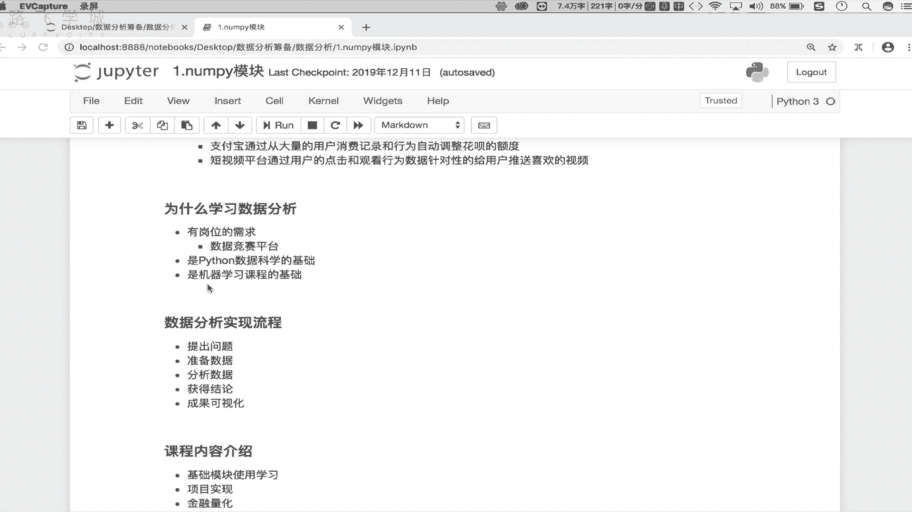

OK吧，那所以说这三点知知道之后呢，接下来咱们来看一下数据分析。

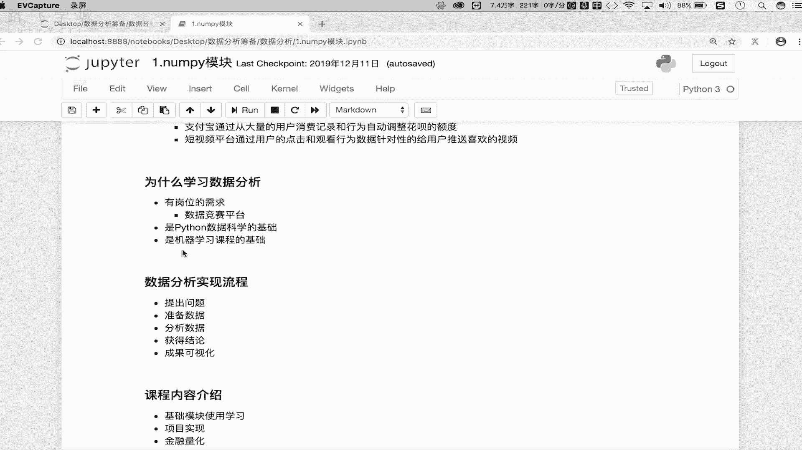

它的一个实现流程是什么对吧，它的一个初步的实现流程如五下五步啊，如五下的这五步啊，第一步一定是提出问题对吧，那问题产生了之后，我们需要去采集或者去准备对应的数据吧，因为没有数据的话。

我们是没有源头进行分析的吧，一定是要有数据的，是不是，那我们的数据可以是由其他的职能部门，给我们提供，或者去购买数据，或者由咱们的爬虫去网上爬取指定的数据吧，那数据准备好了之后。

我们就可以通过咱们数据分析相关的模块，相关的技能对我们的数据进行指定形式的分析，分析完了之后，咱们可以获得对应的结论，是不是，那结论有了之后，咱们还可以使用可视化的技术，对我们分析出来的结论。

基于我们的，比如说散点图啦，我们的直方图啦，线性图啦，进行一个成果的可视化的展示吧，那么这五步就是咱们实现数据分析的一个。

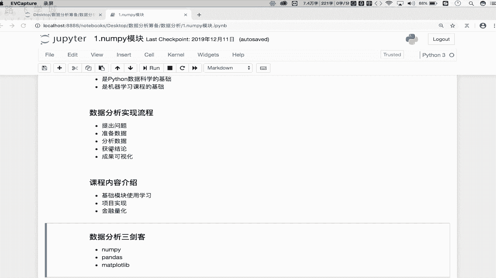

基本的五步流程，OK吧，那这个流程咱们知道了之后呢，最后一点咱们来看一下，咱们整个课程的一个内容介绍，那整个课程的话咱们可以分成三部分去学习，那首先第一部分一定是我们基础部分吧，那么在基础部分。

我们主要是带着大家能够去掌握，咱们数据分析相关模块的一个初步的使用，那么每一个模块，包括模块当中所封装的这些个工具类，工具类当中的相关的方法，包括它的属性能够掌握了之后，我们就可以对相关的数据产。

这个这个这个进行一个初步的分析，OK吧，那首先是第一个基础模块的使用，那第一个基础模块的使用，在学习的过程当中一定会多多少少有些枯燥，因为我们知道在学习模块，无非就是需要讲解模块的一个导入模块当中。

相关工具类的一个作用，工具类的一个使用吧对吧。

这是第一部分，第二部分，当我们的这些个基础的模块掌握之后。

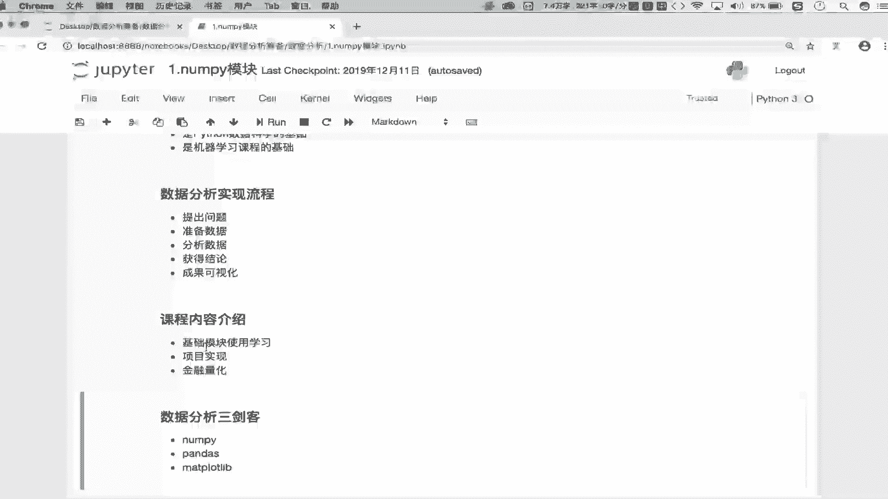

咱们就可以把模块代入到咱们的项目当中，那这块我们所涉及的项目有很多，并且这些项目都是企业内部真实的需求，所产生的项目，OK吧，那么咱们就看一下，这些个企业内部所面临的，需要分析的问题有哪些。

那么这些个问题，咱们可以给它基于需求的一个制定对吧，需求制定好了之后，我们可以使用咱们学习过的，相关的基础的模块对吧，对我们的需求对应的数据产生一系列的分析，我们也可以将分析出来的结论。

制定相关的什么的记录，包括可以把我们的结论，然后使用相关可视化的工具，给它进行一个展示吧，OK吧，那除了这个真实的企业内部的实战项目之外，我们还会给大家去讲解一些金融量化，所对应的知识。

那现在呢这个数据分析，其中有一个比较重要的落地的一个方向，就是金融量化的行业，比如说相关的金融公司是吧，它会需要招一些懂得金融的，懂得数据分析相关的专业人才，使用数据分析的技能。

对相关的金融产品进行一系列的分析，进行一系列的量化，OK吧，比如说最典型的一个，比如说咱们如果哈想去科学的购买股票的话，那么我们一定不是跟风，跟着大盘的指示去购买相关的股票吧。

这样的话你的一个收入可能不是那么可观，那相关的这些个金融，包括一些个这个证券机构，他们可能会推出一系列的这些个策略是吧，购买股票的一些个策略，那么这些个策略可以使用一定的价钱卖给你。

那么你买了这些个策略之后，就可以根据指定的策略进行股票的买和卖，那这个根据指定科学的策略进行股票买卖的话，就可以最大程度上，保证你的一个股票的一个收入，对不对，那么这些啊策略的制定。

就是咱们在金融量化当中需要学习的内容，那也就是说在咱们整个的课程当中，也会带着大家去看一点，这个金融量化所对应相关的技能，我们也可以使用金融量化，结合着数据分析，去制定一些股票购买的一个策略。

比如说我们会制定一个叫做双均线。

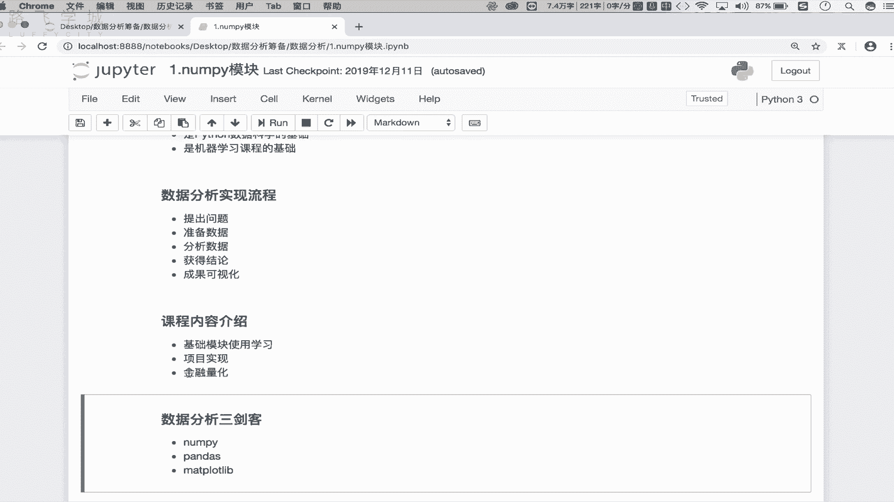

或者叫做小市值等等相关的策略。

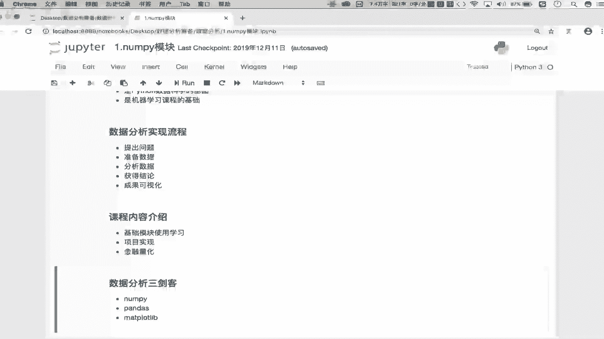

OK吧，所以说咱们整个的课程当中，第一是有基础内容的一个讲解跟学习，那基础内容咱们学会之后，一定是基于咱们的实战项目，去巩固咱们的基础内容，是不是，并且这也让大家能够很明确地感受到。

如果日后在公司内部做数据分析，这样的一个开发岗工作的话，咱们到底是怎么去实现的，怎样的一个开发流程，OK吧，那如果各位啊有对金融感兴趣的，那么你的关注点也可以放到我们的金融量化。

这样的一个课程讲解的当中吧，OK吧，所以说那么这一小节，咱们主要就是对我们整个的课程进行一个。

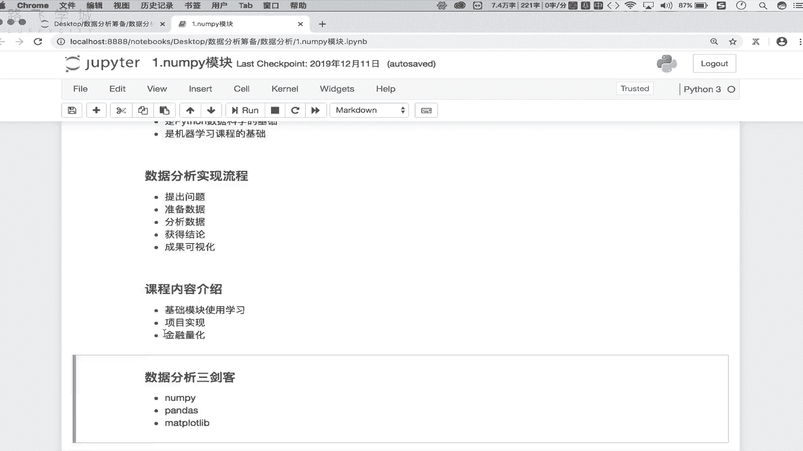

初步的一个介绍，OK吧好那么从下一小节开始。

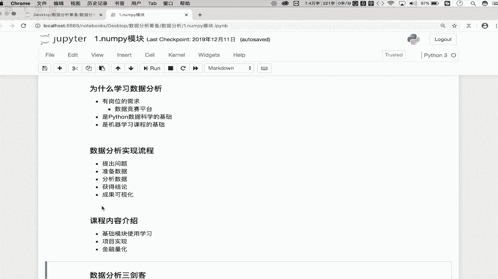

咱们就正式开始咱们整个的一个内容。

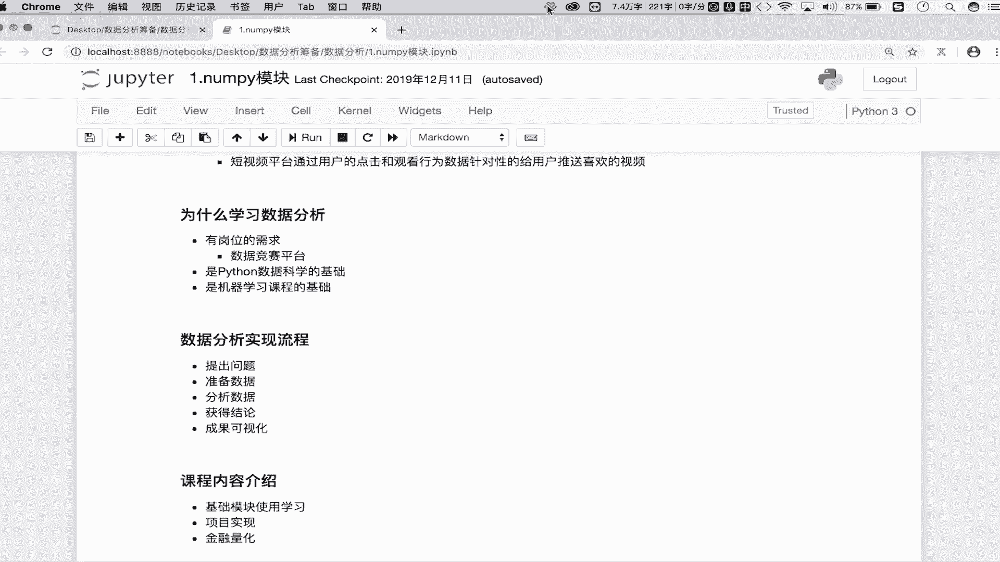