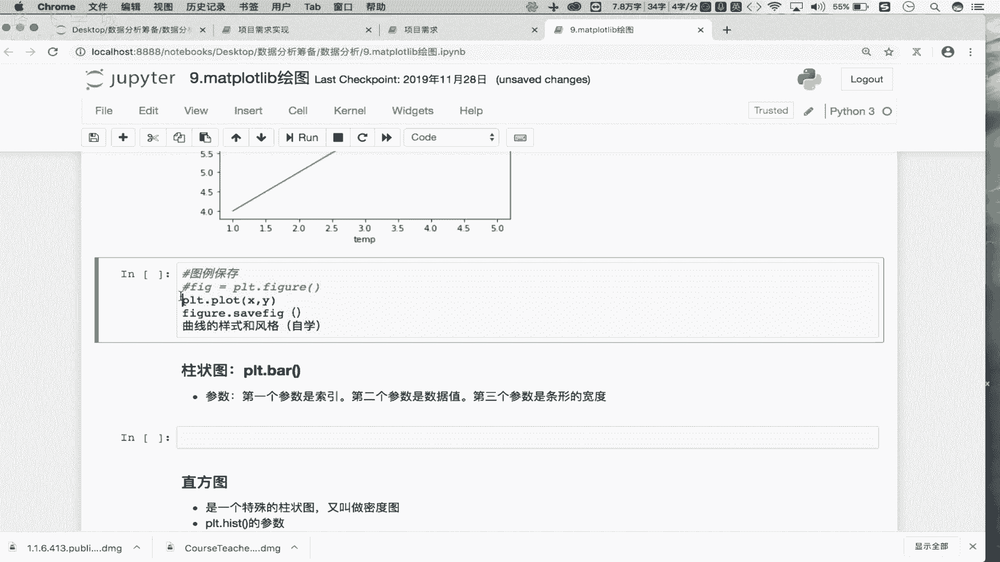
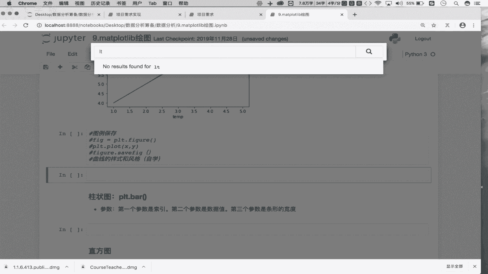
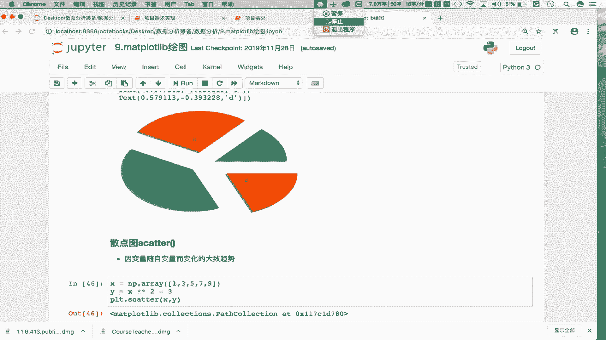

# 强推！这可能是B站最全的【Python金融量化+业务数据分析】系列课程了，保姆级教程，手把手教你学 - P26：绘图操作~1 - python数字游侠 - BV1FFDDYCE2g

那么同学们，那么这一小节的话，咱们就来看一下这个绘图啊，绘图的话我们用的是might platlab，这样的模块进行的一个绘图操作，那么也就是说，咱们在第一小节给大家介绍数据分析的时候。

我们介绍过数据分析的三节课，对不对，这节课依次是我们的nike pandas as，跟might platlab吧，那么前半的NIKE跟我们pandas as我们已经学完了，是不是只剩下最后的一个剑客。

叫做might plat lib，那么这个模块主要是用于绘图的对吧，那么你想一下在咱们的数据分析当中，为什么需要绘图呢，是因为我们可以通过相关的技术手段，对我们的一组数据展开详细系统的一个分析。

那你分析出来的结论，或者分析出来的一些个重要的操作，那如果想向你的上级领导进行一个汇报的话，那么是不是把相关的结论，基于图例进行一个展示，那汇报的效果会更加的明显呢，对不对。

所以说在这咱们就看一下这个绘图，怎么进行绘制啊，那么在这块的话，我们重点绘制的是一些二维的图形，比如说我们会绘制一些个线性图，柱状图，直方图饼图，还有我们最后比较重要的一个叫做3D图，OK吧。

那么这几个图例掌握了，那么意味着咱们数据分析当中，图像绘制的这些个基本操作就可以搞定了啊，当然我们的might play lib，还可以帮我们绘制一些三维的图形，比如说一些玫瑰图啦，极地图啦。

这些都是可以的，但是呢我们只需要掌握这些个二维图里，图图像的一个绘制就可以了啊，因为这些个用的是比较多的啊，用的比较多，那其实这个绘图的操作，其实咱们不用系统的去讲，大概看一下它的一个绘制的流程。

和一些注意事项就可以了，为什么呢，因为绘图的话它也是调用我们matt plot lib，这个模块当中相关的方法跟属性，就可以进行一个绘制，OK吧，那么在这首先我们看一下这个线性图怎么绘制，那在这儿的话。

首先我们先把对应的模块导一下，Import，导一下might plant lib，点py plot pas p RT对吧，用它进行一个绘图操作就可以了，在这的话我们用一下DEI吧，ISNP对吧。

先把这两个模块导一下，那么接下来在这的话，我们先来看一下线性图怎么进行一个绘制，OK吧，那在这的话看第一个需求，我们需要绘制一个什么呢，叫做单条线的一个线性图，那它怎么去玩呢。

你比如首先我们绘制线性图的话，就是绘制一个这个二维的一个坐标是吧，在二维的坐标当中需要绘制单条的线性图，你想一下，那么我们的二维坐标是由X轴跟Y轴的，是不是，那我们想在X轴跟Y轴当中绘制一条线段的话。

那么意味着是不是需要有两组值啊对吧，比如我X等于NP点array ok吧，这块我就写一个数据源吧，是12345OK吧，那么我们的Y就等于X加上一个3OK吧，那现在XY是不是对应的两组值对吧。

这两组值啊各自是不是有个数啊对吧，各自有五个数啊，那么我们知道X和Y之间所存在的关系，是不是X加三等于Y啊对吧，那把这样的一个线性关系绘制到我们的坐标系，当时怎么绘制呢。

PRT第2plot是进行线性图的绘制，把XY传进去走，你看一下，现在我们就绘制了一条直线，对不对，这条直线一定是满足我们的Y等于X加三，这样的一个线性关系，对不对，OK吧。

所以说plot适用于绘制线性图，那么这个plot需要传入两组值吧，一组是X，一组是Y，是不是，那这样的话我们的一个线性图就绘制出来了吧，对吧，第二个，我们还可以绘制多条多条线的一个线性图啊。

那多条线的一个线性图怎么绘制呢，好在这我们去看一下PLT点r plot，我们还是可以先把我们的XY传进去，可以吧，这不是一是不是一条线段啊对吧，好plot再调一下plot好，这传一个X加1Y减二。

可以吧，那现在你会发现那在这plot掉了两次吧，XY是我们的数据源，是不是，那在这个第二个plot中，我让X加上一个1Y减去一个二，那X可以加1Y可以减二吗，可以吧，VXY分别是两个NT。

是不是好在这找，你会发现现在这就有两条线段吧对吧，第一条线段是由他绘制的，第二条线段是由plot绘制的吧，这是第一种方式啊，这是第一种方式，那其实我们还可以有第二种方式。

PRT点r plot就是在plot当中传入两组值啊，两组不同的XY就可以了，XY好，然后的话我们在这呢再传，再传一个什么呢，再传一个X加1Y减二，看一下，现在我们这两条线是不是还是可以绘制出来啊，对吧。

那就是说你可以连续掉两次pouter，也可以在plot中传入两组不同的XY，那这样的话就可以绘制多条线性图了，是不是OK吧，多条线段啊好看，第三个，我们可以在这呢设定一下，我们绘制的这个坐标的一个比例。

那就是说通过这样的一个操作，咱们可以横向或纵向的拉伸我们的一个坐标，可以把我们的坐标进行一个，等比例的放大和缩小，OK吧，这怎么去做呢，PRT第2plot好，首先在这XY。

比如说你现在看这个图是比较小啊对吧，你想给它放大一点，或者看它比较大，想给它缩小一点，怎么去办呢，那在这的话我们就可以调用我们的这个什么呢，叫做figure plt，点，叫做finger好。

这里边有一个参数叫做finger size好，这给他传一个X轴跟Y轴的比例就可以，比如说我X轴是五，Y轴是九，那就是X轴和Y轴它的比例是五比九吧，对不对，那是不是我们的Y轴要长于我们的X轴Y走。

看一下啊，那在这的话我们来看一下这的一个效果吧，现在是不是没有任何效果啊对吧，那这块的效果没有出现是为什么呢，是因为我们的finger啊，finger的调用一定要放在我们绘图之前，一定要放在绘图之前走。

现在有效果了吗，是不是我们的这个整个的啊，这个二维的一个图例就纵向的拉伸了对吧，但是你看这块X轴跟Y轴，它的刻度是没有任何变化的，只是将我们的这个图像横这个这个这个横，横向或纵向。

进行一个等比例的一个拉伸或者缩小吧，对不对，它的刻度是没有任何变化的啊，那在这你要保证这个fire一定要放在啊，放置在绘图的，放置在会图的，绘图的plot方法之前吧，否则是没有作用的，是不是，OK吧。

这样的话咱们就可以等比例的放大或缩小，我们的一个坐标啊，接下来看一下设置图例啊，这个图例是什么呢，OK吧好在这我们来看一下啊，怎么去设置我们的图例，那首先在这我们还是p RT d r plot。

比如说我XY对吧，还有一条线PRT第2plot是X加1Y减二，可以吧，现在是不是有两条线段，那么这两条线段到底哪一条线段是XY，哪一条线段是X加1Y减二呢，你是不知道啊，那怎么办。

在这我们给他加一个图例啊，那在这的话给他加一个label的参数，Level，然后这个level的话，比如说我们叫做AAA好下边的level，叫做BBB走，你看一下这没有任何的变化，对不对。

那这个level指的是不是我们的每一条线段，的一个标识啊，对吧好，我改一下叫做XY，这个是呃X加1Y减二对吧，以字符串的形式设定是标识啊对吧，那我去执行是不是没有任何效果啊对吧，那怎么办呢。

那在这PLT点掉一个叫做legend，legend好，legend是说让我们的这个什么呢，这个图例图例生效啊，生效之后看下效果走，你看一下，那这块的话我们就知道，那么这个什么呢。

这个蓝色的线段是我们的XY是不是，那剩下一个颜色的线段，就是我们的X1和Y减二吧对吧，这个是我们图例OK吧，那么这个图例的话，它其实在legend当中，还有一些参数可以被我们去调用，什么参数呢。

第一个叫做N，看一下如果n call等于二，说明我们的这个图例是不是有两列组成啊对吧，那如果没有的话，默认情况下它是由一列组成的，对不对，有一列组成啊，那这块的话是它的一个小的一个参数。

那么这个参数其实我们可以不要吧对吧，用它默认的形式是不是就可以了对吧，这个是我们的图例啊，这个是我们图例好，那么接下来接下来除了图例之外，这呢还有一个操作叫什么呢，叫做设定轴的标识。

就是说我们可以给我们的X轴，Y轴设定一些个标识啊，这是什么意思呢，比如说p RT d r plot对吧，这我们就传X跟Y呗，对吧走，你那X轴表示什么，Y表示什么呢，你不知道是不是，那怎么办。

在这我们去设定什么呢，设定标识PLT点x label，比如说x level是什么，是我们的这个温度可以吧，Tap，那么Y轴呢PRT点plot，不是plot的，是这个y label啊。

比如说他是我们的距离，OK吧，走你会发现那X轴跟Y轴就会有相关的什么呢，标识了吧对吧，当然我们还可以这样PLT点title，给我们整个的一个坐标设，跟给我们整个的一个坐标的一个图例，设定一个title。

我们叫做dist and，type走，你看见了吗，那这样的话就可以给我们的轴向设定相关，不同的标识吧，我们就知道哎，哪个轴向表示的各自是怎样的含义吧，对不对，这是给我们的这个啊线性图设定。

我们的这个轴向的标识啊，轴向标识，那接下来还有一个什么呢，叫做图例的保存，图例的保存啊，就是说当我们的图像绘制好了之后，我们可以对其进行一个保存吧对吧，进行一个保存，那这块的话我们怎么去保存呢。

看一下我们这的一个操作啊。

操作，那首先在这我们还是PLT。

比如说我们就保存谁呢，保存它可以吧，简单一点吧，我先绘图啊，先绘图，好图像绘制出来了吧，那这个图像如果有了之后，接下来我们要保存，那怎么保存呢，在这首先我们需要有一个什么呢。

有一个finger的一个对象啊，finger对象finger就等于好PRT点r finger，好首先在这第一步是对象的实例化，是不是好对象实例化，然后的话第二步是绘图，第三步的话是保存图片。

finger finger点点什么呢，这叫做save f i g，OK吧，在这进行图像的保存，那图像保存的话，这里边的话会有一些个参数啊，参数看一下think啊，Save think，它有哪些参数呢。

首先有一个叫什么叫做f name吧，就是你把它存到哪吧对吧，好存储一给他设定一个路径，存到当前目录下，叫做123点PNG，可以吧，走你看一下，那现在执行完了之后，我们看一下当前的这个目录当中。

有没有123点PC走，你有了吧，是不是给他保存好了对吧，那这个是我们保存的操作，在这你要注意一下啊，注意一下，那么该对象的啊，串建一定要放置在plot绘图之前，否则你的图像是保存不了的，OK吧好。

那下一个就是我们曲线的样式和风格，这个的话我们就不讲了啊，因为这个呢其实很简单，你比如说什么意思呢，比如说在这啊，我PLLT点r plot是吧，我们绘制XY这样的一条直线吧。

那个直线的样式或者颜色我可以给他改一下，比如说C是不是color的意思，等于red走颜色是不是变了对吧，当然还有什么呢，还有什么透明度啦，线型的典型的都可以去设置啊，都可以设置啊。

那这个设置的话其实我们就不讲了，到时候你自己上网搜一下就可以了，OK吧，比如说在这的话，我们还可以设定透明度，透明度是阿尔法吧是吧，阿尔法阿尔法，等于一个0。5，没错了是吧，逗号啊，是吧。

这也要透明度吧是吧，然后的话这还有我们的什么典型线性啊，线性就是我们的啊LSTYLE，看有没有这参数啊，看这啊，Long weight，这个指的是我们的一个这个线段的一个宽度啊，对吧。

然后这块是market size，是我们典型的一个尺寸，然后的话自己看这个LISTYLE，LISTYLE是我们的一个线段的一个样式吧对吧，last style啊。

那这个lifestyle的话我们可以给他给他给他指明啊，给他指明，那这块指明的值下边应该也有啊，应该也是有操作的，看这啊，看这参数介绍吧，PARAMS参数介绍XY还有什么呢，f mt d等等等等啊。

大家可以自行的去看一下啊，自己去看一下啊，那这块的话咱们就先不说了，先不说了啊，那这块就是它一些个样式的一些个制定啊，样式制定的话，无非就是说改变一下我们线段的颜色啦，透明度啦对吧。

它的一个样式到底是直线呢，还是一个什么阶梯状呢，还是一个什么什么的是吧啊，这块的话各位自己去看一下就可以了啊，那基本的操作我们能够掌握9OK了啊，就OK了，这个是我们的一个线性图的一个绘制啊。

就这么些重要的操作，掌握了它就足以了啊，就足以了，下边是我们的柱状图，柱状图的话，各位一定能够知道柱状图长什么样吧对吧，那这块的话我们就来看一下状图怎么去画，还是我们有X和Y吧对吧。

X和Y那在这看下PLT点B啊，你看一下柱状图就有了吧，X轴是我们的12345，我们说Y不是等于X加三，是不是OK吧，那这块的话我们的Y你看就是从1~8，是不是从1~8吧对吧。

这是我们的一个柱状图的绘制啊，当然柱状图的话，你可以PRT点，就是我们的x level，Y level，也可以给我们的X轴跟Y轴设定标识吧对吧，还有一个叫做BH，就说把它躺过来是不是就可以了，对吧啊。

知道它的含义就可以了啊，那这块是我们的一个柱状图的绘制，叫做PRT点bar是不是就可以了，传入XY两组值吧，对吧好，接下来看直方图啊，看直方图这个直方图就比较特殊了。

首先你要知道这个直方图又叫做密度图吧对吧，它是用来统计密度的，什么叫密度呢，比如说我这有个X哎，哎有一个data吧，data等于1122234566666667，8950OK吧，那现在只有一组数。

这组数当时你告诉我谁的密度大，最大是不是六啊是吧，什么叫密度呢，就是说这个一组数据当中谁出现的频率越高，那么意味着它在这组原始数据当中，的密度就越大，是不是啊，那我们的直方图是用来统计什么呀。

统计我们一组数据当中，某些数据出现的一个频率或次数吧对吧，谁的频率跟次数越大，那么意味着它的密度越高呗对吧，那这怎么回事呢，PLT点啊，叫罗hist taste，OK啊，haste这块的话。

我们需要传一个参数里的BS啊，BS它有一个默认值啊，默认值应该是五，好像是几来着啊，这个none表示的就数五啊，那这块我们给他指明下是十啊，是十棒次，表示是我们的什么呀，柱子的个数吧，走你看一下哎。

没有传这个data是吧，会发现现在这的话，我们就绘制了这样的一个什么呢，类似于柱状图的一个东西吧对吧，那这组图当中啊，我改成15吧，15根柱子让它稀疏一点啊，20，看一下这组柱状图当中。

你看谁的柱最高啊，是不是六所对应的这个值最高啊，那么意味着在原始数据当中，六的密度是最大的，是不是是吧，这的这个柱高表示的就是我们的密度的大小吧，柱子越高，那么意味着柱子所对应的这组数，它的密度就越大。

是不是OK吧，当然你会知道这个柱子，它肯定表示的不是一个数吧，你看这个最高的柱子，表示的是不是，从五点几到六点几范围的一个数啊对吧，那就是说你看这块的棒子是我们柱子的个数。

那就是说这个图当中一共显示了20根柱子，那么为什么你看起来没有20根柱子呢，是因为有的柱子的柱高是零，那柱高为零的话，那么它就不显示了呗，你看这根柱子，它的柱高是不是快到六了，就是六吧，对不对。

那柱高有值的话才会显示柱高为零，是不是就不显示啊对吧，为什么会有20个柱子呢，就是说我的20个柱子，分别表示的是20组值吧，你看这个hist返回的第二个值啊，第二个值这第二个值一共是有20一个数。

为什么20一个数呢，是因为每两个数表示的是一根柱子，所对应的一个范围，OK吧，你看零到0。45是一个范围吧对吧，那你看零到0。45这样的范围，柱高是为零，为什么为零，是因为在我的原始数据当中。

是没有零到0。45范围之间的数的吧，你看第二范围是0。45到0。9，第二根柱子有吗，看第二个柱子这块是不是也没有啊对吧，第三个柱子是0。9到1。35，你看这个0。9到1。35之间范围的一个数。

那么我们这个看一下原始数据当中，有没有这样一个值呢，是不是有啊对吧有吧，有的话，有几个是不是有两个呀，就是第二根柱子呗，第一根柱子是零到0。45啊，零到0。45是有的，是不是零啊对吧。

所以第一个柱子是不是一啊，对不对，所以说啊这块就是说这个什么的，这个返回值的第二个啊，它表示的是20一个数，那么意味着就是20个范围吧，一个范围表示一个柱子吧，那参这个返回的第一个值啊。

返回的第一个值是说，那么每个范围所对应柱子的高度是几倍，你看就说零到0。45这一个范围，柱子的高度是不一啊，好，那么0。45到0。9，这个范围之间的柱子的高度是不是零对吧，0。9到1。35。

这个柱子的高度是不是二啊，以此类推吧对吧，那如果把它改成十，意味着是不是十个柱子呀，十个柱子意味着这有十个数表示十个范围对吧，那0。0到0。9，这个范围之间的柱子高度是不一啊，0。9到1。8。

柱子高度的值是不是二啊，以此类推吧，OK吧，那在这你想给它柱子稀疏一点的话，就把这个柱子的个数给他设的大一点，是不是就可以了对吧，这个就是我们的直方图，也叫做密度图吧，直方图叫做密度图。

它是用来统计密度的，密度指的就是说用来统计咱们一组数当中是吧，每一个数它所出现的一个频率，对不对啊，好接下来是我们的饼图，那饼图的话我们就看一下它的样式吧，饼图这块我们调的是PIEOK吧。

plot点pie啊，也是传入一组值，就可以看到我们的饼图吧，对不对，然后你看这啊，总体看0。20。30。1，那这个就不是整数了吧，不是整数表示的就是比例呗，就说我的饼图是由三部分组成，第一部分占20%。

第二部分占30%，第三部分占10%吧，是一个不完整的饼图吧，那如果是总数呢整数的话，你看这走你就表示什么呀，表示把十一二十二三十一十五这四个数，它们在整个数据当中的百分比，可以给我算出来吧，对不对。

当然有一些样式也可以制定，比如说在这啊，我们可以调用labels labels，就是说将我十一二十二，三十一十五对应的这个饼图部分的标识，给我设定出来啊，是吧，你看这个标识是不是离圆心比较远呢。

我们让它离圆心近一点怎么办，加一个label distance等于0。3，这个0。3指的是到圆心的距离走，看是不是到圆心的距离，右键了对吧，后边还有一个什么呢，还有一个叫做呃这个AOTOPCT啊。

Auto p c t，这个表示说帮我自动计算出每一个饼图部分，所占的一个比例吧对吧，这个六表示是保留小数点后位的六个六，6666个数吧对吧，这是固定格式啊，固定格式好，下边一个是我们可以干什么呢。

可以在这儿去通过这个这个explode，去设定每一个组成部分到原先的一个距离吧，当然这些都是在制定样式，是不是都是制定样式吧对吧，这个饼图也很简单，最后一个叫做3D图啊，三点图三点图的话。

它适用于用于显示，用于展示自变量啊，因变量随自变量而变化的一个大致趋势，那首先我们知道X比如说啊X等于NP点，第2array ok吧，好这里面放的是13579OK吧。

那么我们的Y就等于X的平方减去3OK吧，那现在我们看一下XY是不是满足，满足某种形式的线性关系啊，括下来啊，乘二吧，我不让它平方了啊，啊这错了是吧，这个列表吧，这是我们的数据源，是不是好XY是不是有了。

那现在你看XY是不是自变量，Y是不是因变量啊对吧，因为自变量的变化会导致因变量的一个变化吧，对吧，那Y是因变量，那就是因变量，随着自变量变化而大致的一个趋势，那这我们就画一下PLT点scatter。

这需要传入两组值，一个是X1个是Y好走底，这就不是线了，对应的是一个点，看见了吗，OK吧，那比如这我是平方呢，这是不是个抛物线啊是吧，那这块就不是线，而是一个什么呢，是由点组成的吧对吧。

那这所展示的是我们的自变量跟因变量的一个，什么呢，关系的一个趋势吧，对不对，关系和趋势啊，这块就不用画线了，这画的是点，OK吧，那这一共有五个数，对应的不就是五个点吗，对吧，这个是我们的散点图，OK吧。

那么这些个散点图啦，包括我们的柱状图了，包括我们的线性图啦，这些图例都会在我们最终的一个，终极的实战项目当中都会用到，OK吧，到实战项目当中我们再去巩固，那现在你要知道每一个图怎么去绘制就可以了。

OK吧，这个是我们的mason path lib绘图的一个基本操作，这些掌握了就足以了，OK吧，当然你要知道matt play lip只能绘制一些个静态图，OK吧，这些一定是静态图，不能动态吧。

不能点击，也不能有任何的其他动态样式，是不是都是一些静态图，OK吧，好，那么下一小节，就是我们最终的实战的终极项目了啊，那个项目完事之后呢，我们整个的数据分析的课程也就结束了，OK吧。

