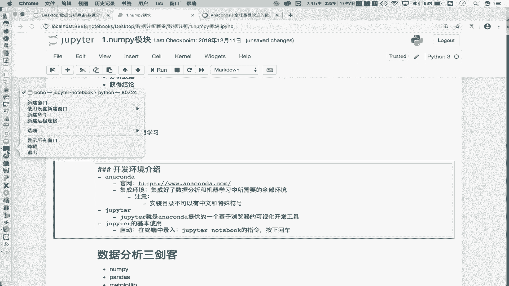
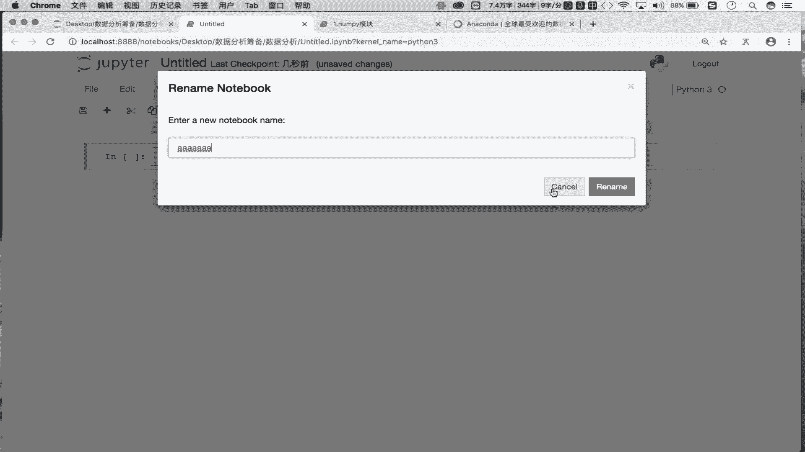
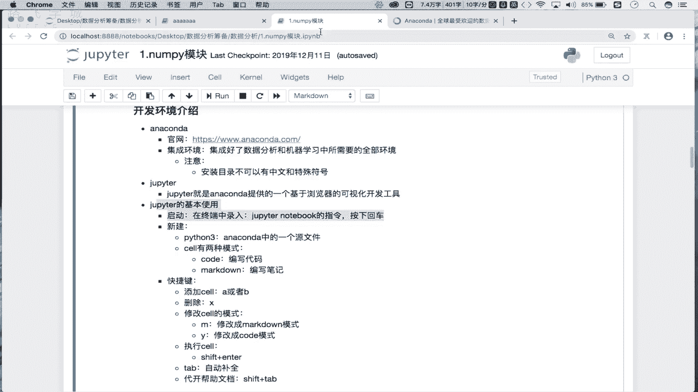

# 强推！这可能是B站最全的【Python金融量化+业务数据分析】系列课程了，保姆级教程，手把手教你学 - P2：2.修炼前的准备-环境搭建 - python数字游侠 - BV1FFDDYCE2g

对这个数据分析呢进行了一个初步的介绍，包括对我们整个的一个课程内容，也进行了一个介绍，OK吧，那么这一小节咱们就来看一下，咱们数据分析所对应的一个开发环境，搭建的一个流程，OK吧，那么首先大家看到哈。

我的屏幕当中所显示的这个工具，就是我们数据分析开发的一个环境对吧，我们在这并没有采用使用我们的这个PYTHM，对不对，而使用的是一个叫做主patter的一个开发环境，那么这些开发环境。

各表示的是怎样的一个含义呢，我们逐步的来进行一个讲解，首先我们先来看第一点啊，第一个叫做anaconda啊，anaconda它是一个什么东西呢，首先这个啊，我把它的官网呢已经给大家粘到这了。

大家可以打开这个官网去看一下这个anaconda，它的一个基本的一个介绍，那这块的话咱们就不领着大家逐一的去看了，这我只需要对encounter进行一个初步的介绍，就可以了，好吧。

那么首先我们要知道encounter它是一个集成环境，集中环境OK吧，那首先大家能够理解什么叫做集成环境，是不是，那就是说这样的一个ANACCOUNTER，这样的一个环境已经给我们集成好了很多。

这个数据分析，包括机器学习开发的一个环境的OK吧，所以说集成环境这个encounter指，就是说它已经帮助我们这个集成好了，数据分析和机器学习中啊，所需要的，全部环境，那就是说如果我们想要进行数据分析。

包括机器学习的一个开发工作，首先我们需要先在自己的本机当中安装好，Encounter，那么这个encounter是一个集成环境，它帮我们集成好了，数据分析和机器学习所需要的全部环境。

那就是说如果在你的本机当中已经安装好了，And accounter，那么意味着我们就可以使用我们本机集成好的，encounter这样的环境进行我们的数据分析，包括我们机器性相关的开发工作，OK吧好。

那所以说on accounter它是一个集成环境，那么各位啊，我们需要从官网当中好，这儿有个下载，是不是点击下载去下载encounter，这样的一个安装包，下载安装包之后呢。

然后双击对其进行一个安装就可以了，OK吧，那么这个细致的一个安装流程，稍后我会给大家上传一个，这个word所写的一个安装流程，大家也可以根据安装流程进行指定形式的安装，也可以，那你需要注意哈。

我们所使用电脑的这个操作系统的环境不一样，你需要下载不同的encounter，比如说你用的是Mac版，用的是LINUX版，用的是windows版，需要在这去下载指定操作系统对应的encounter。

这样的一个安装包，OK吧，那么好，那么安装包下载好之后，其实就是我们的傻瓜模式进行安装，直接是下一步下一步就可以了，OK吧，那么在安装的过程当中需要有一些注意事项，第一个啊，你的这个安装目录啊。

安装的一个目录目录啊，这个不可以有中文和特殊符号，那就是最好你就把它装到我们的C盘，或装到D盘某一个盘符的根目录下就可以了，OK吧，你的安装目录不可以有中文，OK吧，否则这样的一个集成环境。

在使用的时候会有问题的好，首先是encounter的一个介绍，跟他的一个初步的一个安装，它的一个安装流程，直接是下一步下一步点击就可以了，OK吧，那么细致的安装流程，我会给大家上传一个word形式的。

安装流程的一个文档，大家也可以照着文档去安装，OK吧好那么接下来是主per，那主PTER是什么呢，我们介绍一下啊，主peter或者叫做杜比特啊，他就是我们的and康德提供的一个。

基于浏览器的可视化开发工具，那首先我们有了开发环境之后，我们还需要有可视化的开发工具，是不是啊，那么这个可视化的开发工具，就可以基于它进行我们相关数据分析，包括机器学习的一个代码的编写。

包括代码的一个执行都是OK的，所以说当我们的UNACCOUNTER装好之后，其实它已经帮我们集成好了，这样的一个基于浏览器的可视化的开发工具，叫做JUPITER，OK吧。

那所以说JUPYTER是不需要我们单独安装的，只需要把and counter装好之后，我们就能用JUPYTER了，OK吧，所以说你只需要知道主per就是我们的encounter，帮我们提供好的。

一个基于浏览器的可视化的开发工具，我们需要在主per这样的一个开发工具当中，进行数据分析，相关代码的一个编写，包括执行，OK吧好那么这个JUPYTER怎么去用呢，看一下它的一个使用哈。

使用首先它的一个使用的话是，第一步是我们要知道怎么去启动啊，怎么去启动，那启动的话我们只需要在我们的这个终端中啊，录入，路上的录入，一个叫做主per note，notebook的指令啊。

然后的话按下回车即可，你比如说在这的话，我可以打开一个什么呢。

打开一个终端，OK吧，好录主pter note book，按下回车即可，按下回车之后。

它会帮你启动你默认的浏览器，OK吧，浏览器启动好了之后，会发现它可以显示这样的一张页面对吧，这个页面里边所显示的，就是你当前的一个指定目录下，所对应的一个目录结构，OK吧。

那这个是我们主per的一个启动，那所以说这个主PYTER，是一个基于浏览器的可视化开发工具，所以说当这个指令在终端当中录入好了之后，它会给你启动一个服务，并且将你的浏览器打开。

并且在浏览器当中访问指定的工具啊，你所看到的就是这样的一个界面，OK吧，那这个界面所表示的是某一个目录结构下，对应的一个对应的一个这个目录，是不是，那这个工具怎么去使用呢。

首先啊在这的话我们需要进行一个什么呢，进行一个新建，我们主要新建什么呢，好看一下，那我们启动好了之后，这儿有一个new，是不是我们可以new一个什么呢，new一个python3即可啊。

这个python3所对应的是我们and accounter，这个集成环境，帮我们新建了一个源文件，OK吧，一个源文件，你看下边这是什么，你看是这个folder，就是帮我们新建一个文件夹是吧。

这个是帮我们新建一个任意后缀的文本文件吧，对吧，我们最主要新建的是python3，OK吧，好写一下，就是我们需要新建一个python3，它所表示的是我们的啊，那，CONDA中的一个什么呢，源文件。

OK吧，原文件我们需要新建一个源文件，在原文件当中写代码进行执行，OK吧，那这儿的话你看一下，我点击python3走。

他就会给我新建这样的一个文件吧，OK吧，那在这是它默认的一个文件名，我可以给他改一下，比如叫做AAAAAAA可以吧，改完之后呢。

然后我rename一下，然后返回上级目录，看一下这块是不是多了一个AAAA，点IPYNB的文件啊，那这个后缀是点IPONB，它指的就是我们新建好的一个，基于and conda的一个源文件，OK吧。

那源文件新建好之后，你看这里边的话，默认是不是只有这么一行对吧，这一行我们给它起个名字叫做sell，OK吧，叫做sell，那么这个sell干嘛使的呀，你看这个sell里边呢。

我们是可以给他写指定内容的吧对吧，写指定的相关的内容啊，那么内容写好之后，我们就可以在这去执行我们所写好的内容，OK吧，那是不是意味着我们可以在这写代码呢，不知道试一下。

看我这写一个print biu biu，我们是不是可以执行一下，怎么执行呢，你看前边这块有个run，是不是点一下吧，走诶，你看不执行，看到我们的执行结果了，对不对。

所以说我们可以在cell当中进行相关相关代码，相关笔记，相关注释的一个编写吧，编写完了之后，咱们可以对其进行一个执行，是不是，OK吧好，那么然后呢还有一点需要我们注意一下啊。

那就是说我们sell呢是分成不同模式的啊，sell有两种模式，一个是code模式，一个是什么呢，Mark down模式，OK吧，那我们看一下，那怎么去更改，怎么去查看它的模式呢。

你比如说在这我选中了excel之后，你看这那这默认显示是不是扣的呀，那么意味着我现在所新建的这些个cell，都是code模式吧对吧，都是code模式，那我想修改这个模式怎么办好，我点一下这个下拉箭头。

把它改成markdown看一下，那么第二个cl就被我修改成了markdown模式，那么这两个模式有什么区别呢，对不对，写一下code模式啊，是用来用来编写代码，就是编写我们程序的吧。

而markdown模式的sell是用来编写笔记的，是有区别的对吧，那各位你在编写笔记的时候也应该用过markdown，对不对啊，所以说这个markdown就是我们之前下好的一个。

编写笔记的一个软件叫markdown，只不过它已经被集成到我们的主拍者当中了吧，对吧，那咱们去试一下吧，好那现在你看这有一个什么呢，这个cell我们一点击它会发现这是markdown模式吧。

那我就编写一个笔记呗，基于我们的这个呃markdown它的一些个操作指令，我们可以在这去制定比值的样式吧，比如第一小结我们讲的是什么呢，基础指令对吧，然后呢我们去执行一下走，看一下这块基础指令。

就根据指定的样式制定好了吧对吧，所以说甭管是markdown模式的cell还是code模式，SL是不是都需要进行一个运行才可以啊对吧，进行运行才可以啊，好那这个是我们的一个sell的模式。

那然后的话我们还可以去新建SL，比如说我在这点击一下这个加号点，就可以在这去新建一个SL，是不是，那新建的cell，默认情况下是不是markdown是一个cod模式，SL对吧。

我们还可以把它选成markdown，把它修改成markdown模式，SL是不是都可以啊，对吧好，那接下来的话哈，在这我们重点是讲解什么呢，讲解一下我们的一些个快捷键有哪些呢，第一个添加cl ok吧。

那在这我想去新建一个SL的话，怎么办呢，我只需要按一下A或者按一下B即可，你看我按A是不是在当前选中cell的上方，创建一个CEL对吧，那我选B的话，是不是在当前cell的下边插入一个CEL啊对吧。

所以在这插入SL，我们可以用一下A或者B这样的一个快捷键吧，能添加就能删除吧对吧，删除我们就用什么，就用我们的X就可以了，X就指定删除了，OK吧，删除这样，那然后的话还可以去修改cell的模式。

好怎么改呢，我们可以看一下哈，比如说现在我选中的最后一个cl，它默认是code模式啊，我按一下M走是被修改成了markdown模式，我再按一下Y就修改成了code模式了吧对吧。

所以说修改模式一个是什么呢，M1个是什么呢，Y是不是啊，那么点击M是说这个将sell模式修改成什么呢，markdown模式吧对吧，markdown模式啊。

而我们的one是说将我们的sell修改成code模式，对不对，修改成code模式啊，这个是markdown模式，好接下来的话还有快捷键是什么呢，就是我们的一个执行塞啊。

我们说甭管是markdown模式的塞啊，还是我们的这个这个这个code模式，虽然说都得执行啊，怎么执行呢，统一的快捷键是什么呢，shift加enter走是不执行了，走不又执行了对吧。

叫做shift加enter啊，到这shift加enter好，还有一个快捷键就是我们的type type，什么意思呢，type指的是自动补全吧对吧，代码的一个自动补全功能啊，我们之前是不是用过呀。

还有最重要的一个叫做什么的，打开帮助文档，OK吧，那这一块的话就是我们的这个shift加上什么的type，就可以了，咱们可以去试一下，你比如说在这哈，我写了一个什么呢，写了一个print，是不是。

那我不知道print怎么用怎么办，看我选中print，然后按一下shift加tape，就可以打开这个print这个函数，它的一个帮助文档吧，根据帮助文档介绍。

我们就可以知道这个print这个函数怎么去用，是不是OK吧，那这个就是我们所常用的基于主per的快捷键，OK吧，那么快捷键咱们掌握之后，那么我们接下来就可以使用这些个快捷键，进行指令操作了吧对吧。

比如说在这我想新建一个CEL怎么办，按下A吧，新建了一个code模式下，是不是在这我就可以编写代码了吧，那一个cl里边只能写一行代码吧，不是excel里边你写一行也行，写多行也是可以的。

OK吧都是可以的，那就看你的一个个人喜好吧对吧，所以说这个是咱们主per的一个基本使用，那么意味着接下来咱们就已经掌握好了，我们数据分析，整个的一个开发环境搭建的一个流程了吧对吧，再回顾一下。

第一是需要让我们去官网当中，下载一个anaconda的安装包，然后对其进行一个安装，Anaccounter，它指的是咱们机器学习和数据分析，所对应的一个集成环境吧，集成环境装好之后。

我们就可以使用集成环境当中，给咱们提供好的一个基于浏览器的可视化，可视化的开发工具，叫做主per，是不是主POR，这个基本使用，下边我们是不是说了，OK吧，所以说各位。

那么接下来你们一定要根据我的一个介绍，将我们整个的软件开发啊，所涉及到的环境进行一一安装，安装好之后，接下来咱们就正式的介入到咱们整个数据分析，代码实战环境当中了。

OK吧好。