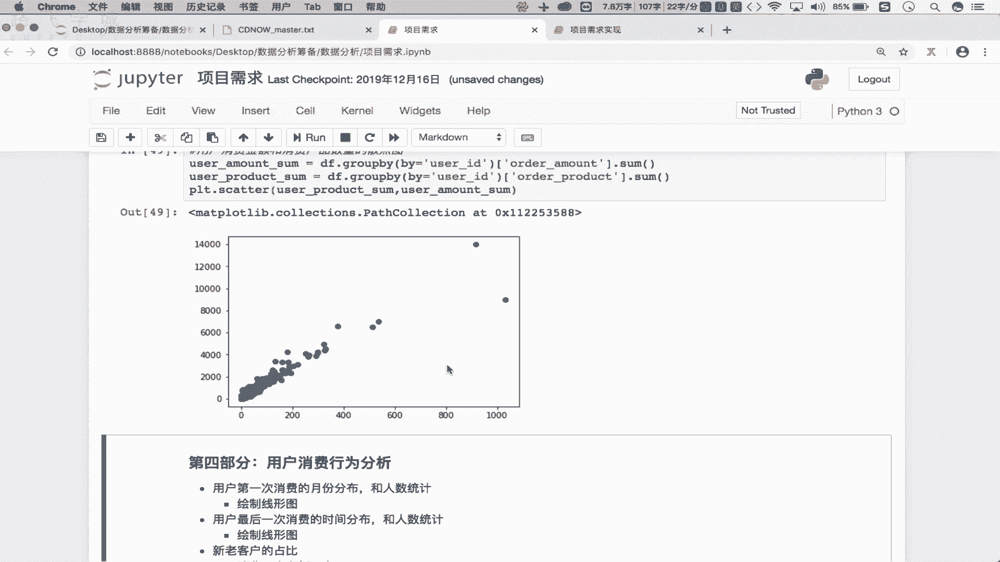
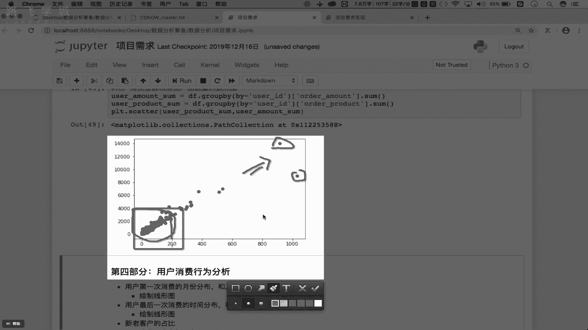
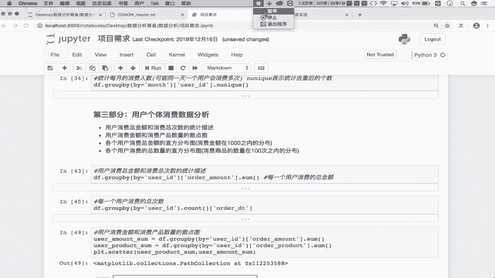

# 强推！这可能是B站最全的【Python金融量化+业务数据分析】系列课程了，保姆级教程，手把手教你学 - P30：4.用户个体消费分析~1 - python数字游侠 - BV1FFDDYCE2g

第三部分的第一条啊，我们说要求我们算一下这个用户消费的总金额，跟消费总次数的一个统计，对不对好，那这咱们求一下啊，那这块我们求的是什么，是所有用户呢，还是每个用户呢，那第三部分。

我们主要是对我们用户个体消费数据，进行的一个分析吧，那么所以说在这我们求的是不是每一个用户啊，对吧，那就说那么每一个用户他的一个消费的总金额，怎么去求呢啊，每一个用户消费的总金额，那重新来。

这是基于我们的用户做分组啊对吧，第2group by，首先这块by等于什么呢，等于咱们的user gu id，是不是我们要求的是每一个用户消费的总金额，对吧，在这把金额求出来吧。

金额是我们的这个额order杠啊，mount这一列是不是，那在这是不是求一个和就可以了对吧，那这求出来的是我们的每一个用户，他消费的一个总金额，对吧啊，这求助是每一个用户消费的总金额。

OK吧好然后接下来我们还需要求一下什么呢，每一个用户消费的什么呢，总次数是不是好求每一个，用户消费的总次数对吧，那在这的话还是基于我们的用户组分组吧，group by对不对。

这块就是by等于还是user杠id，那这块的话我们要求总次数，那这怎么求次数呢，OK吧，次数就是说我们看一下我们的每一个用户，到底消费了多少次吧对吧，消费多少次啊，那就是说我的这个什么的。

这个用户id在我们的原数据当中出现一次，它就表示消费一次吧对吧，出现一次就消费一次，那在这咱们就直接统计下什么呢，每一个分组对吧，每一个分组对应的组数据当中，用户这个这个数据的行数吧。

不求一下count呀对吧，那在这咱们就求出来了啊，在这我们看一下那每一个用户啊，每一个用户的话，它的一个消费的总次数，咱这就有了吧对吧，到这儿我们直接取出其中的一列，是不是就可以了对吧。

比如说我们这就取出我们的这个uh order gun，如果这不取的话看一下，如果这不取的话看一下，那就说我们的用户id看这个表啊，那UID是一，一这个用户是不是只消费一次啊。

二这个用户是不是消费了两次啊，三这个用户是不是消费了六次啊，对不对，当然你也可以把这个data frame当中的某一列，是不取出来啊，取哪一列，那是取任意的一列就可以了对吧，取任意的一列啊。

多少杠DT对吧，那么这一列当中所存储的，不就是我们的每个用户，他到底消费了多少次吗对吧，那就是说我的这个用户id啊，在我们的原始数据当中出现一次，出现几次，是不是就消费了几次啊，对吧好，那这个也好说啊。

也好说，那接下来看下边的，我们说要求出用户消费总金额，跟消费产品数量的一个散点图，看一下这个散点分布图吧对吧，这我们首先需要有两组数据吧，第一组数据是用户消费的什么呢，总金额。

那这块还是针对我们的每个用户吧对吧好，我们求一下是呃user user杠啊，mount杠sum是每个用户消费的总金额对吧，那这我们刚才是不是求出了d f d r group by。

不根据我们的用户id进行一个分组啊，我们要求的是不是这个总金额是order杠啊，mount在这求一个sum是不就可以了，OK吧，那现在这所返回的啊，看一下这所返回的是不是serious啊对吧。

这个serious里面存的就是我们的每一个用户，到底消费了多少钱，是不是OK吧，还需要求出我们的每一个用户，消费产品的数量吧是吧，user杠什么的，parro duck杠。

sum是每个用户消费产品的数量啊，df dr group by是不是根据我们的用户的分组对吧，还是根据用户做分组，呃by就等于这个是user guid吧对吧，然后求出什么呢，将我们的这个消费消费的数。

消费产品的数量拿出来吧，是叫做order杠pro duct对吧，在这是不是求一下消费数量的和啊，走那这两个值是不就出来了，我们要绘制散点图，是不是散点图怎么绘制啊，PLLT点叫做scatter。

对不对好，这是传入什么的，X和Y吧，我们说X是自变量，Y是因变量吧，那谁会导致谁的变化呢，是这个购买产品的数量导致金额的变化，还是金额导致额产品数量的变化呢，那应该是我们买的多，花的钱是不是也多啊。

那X应该是自变量，自变量就是我们的这个什么呢，这个购买产品的数量吧是吧，是它好，那么我们的Y就是我们的这个消费的金额吧，对吧好走，看一下这样的一个省点分布啊，看一下，那么在这个散点图当中啊。

在这个散点图当中，你会发现是不是在这个区域啊，这个区域散点分布的比较密集啊，对不对，那么意味着我们大部分的用户啊，大部分的用户，他所购买购买商品的数量都是200个以内吧，是比较多对吧，消费的金额是啊。

4000是吧，在这个局部的区域啊，对应的用户的数量是比较多的吧，你看这些零零散散的用户，你看这个用户跟这个用户是消费额的金额，跟消费产品的数量都比较多啊，那这些大用户啊，这些重要的用户是比较少。

大部分的用户还是停留在我们的，这个购买产品的数量是200，消费金额是在4000以里的呀。

对不对，通过这样的一个散点分布，咱们就能够知道我们大部分的用户，他的一个购买产品的数量，包括它的一个消费总金额的一个分布情况吧，对吧，所以说大这这个这个什么这个，7万多条的消费记录，对应的大部分的用户。

他们整个的一个消费啊，消费还是平均分布在我们的这个什么的消费，是在200个产品，总金额是4000这样的一个部分当中吧，OK吧好，那这块的话是我们的这个分类图的绘制，看下一个啊，下一个。

嗯在这儿咱们要求出每一个用户消费总金额的，值分分布图，那在这的话，咱们重点求的是消费金额，在一天之内的分布对吧，就是说我们要找出哪些用户，他的消费金额是在一天之内的。

并且把这些用户进行一个什么进行直方图，直方图我们说叫做密度图，是不是啊，统计一下这个密度分布啊，那这块怎么去实现呢，首先在这的话，咱们要求的是每一个用户消费的总金额吧对吧。

并且总金额是分布在一天之内的吧，那这怎么去做筛选的好，首先是d f d r group by，咱们可以这么去玩啊，by等于什么呢，user杠id是根据我们的这个用户去分组啊，d r sum一下。

首先我们先求和，那这点sum的话，咱们求的是说根据用户分组，分完组之后，每一组当中什么的和啊，那原始数据是不是只能是，只能由我们的用户id啊，用用户id跟消费产品的数量，跟消费的总金额是不是求和啊。

那消费的时间是不能求和，因为它不是数值型数据吧对吧，那在这，首先我们要求的是消费金额在一天之内的呀，怎么办，我点儿query一下，可不可以，Query，query是不是做条件查询。

你要知道query只能作用在DFM当中吧，那这个表达式返回的不就是一个data frame吗，data frame调query，5号，我在这做一个什么查询，查询查询条件是什么呢。

是我们的order杠什么的啊，mount应该是小于等于1000，是我们的消费金额在一天之内，对不对好，那现在我们这所返回的这样的一个新的data frame，它所对应的用户。

他的消费金额就是在一天之内的吧对吧，我们要算的是什么呀，算的是我们的这个这个消费的总金额，那在这的话我们就不要这个order product了，就直接把我们的总金额取出来啊，对吧。

好在这直接中括号是取列索引，那在这不就有我们的这个什么呀总金额了，那这所返回的这个series，不就是我们的每一个用户消费总金额吗，这个总金额都是在1000之内的吧，不会大于1000吧对吧。

不会大于一切啊，在这我们要绘制我们的什么呢，直方图啊，这是怎么绘制直方图呢，你想绘制直方图的话，我们知道直方图我们调的是哪个呢，不点hist呀是吧，hist好走，你看一下，那这块的话。

咱们的直方图是不是就画出来了对吧，画出来啊，会发现哪个柱子最高啊，是不是第一根柱子最高对吧，那这块的话我们的第一根柱子对应的看一下，对应的这个范围，大概是从0~0到80之内吧，是不是0~80啊。

大概是不是啊，0~80或0~100吧，也就是说这个范围之内啊，这个范围之内对应的柱子最高，那就是说我们绝大部分的用户啊，绝大部分的用户，他的一个消费的总金额都是在哪啊。

是不是都是在我们的这个100之内啊，是不是100之内，对不对，你看消费户消费金额在100之内的，一共有多少，是不是一共有这个1万7500个人的，对不对啊，有这么些个人啊。

那这块咱们就是求出了我们的销售金额，在一天之内的一个什么呢，一个直方分布的一个情况吧对吧，哪个柱子高，说明这个高所表示的就是我们的这个这组啊，这组serious所对应数值当中，哪些数值出现的密度最高。

是不是啊，那么密度最高，就表示这组数在原始数据里边出现的频率越多，频率越多，就意味着，那么这组数所对应的这个消费是最多的吧，是最多的，对不对好，那再看下一个啊，下一个说我们要求出什么呢。

消费的什么消费的消费次数吧是吧，看下消费数量啊，求出各个用户消费的总数量的折分布是吧，我们不求所有的，只找出我们的消费商品数量在100之内的吧，不跟上边的是一样的呀是吧。

先根据我们的d f d r group by，先根据什么的，我们的用户做分组吧对吧，我们最终要求的是这个消费的数量啊是吧，消费数量啊，好sum一下，在这是不是求出所有的用户他的一个什么呢，消费的啊。

总金额跟数量啊是吧，我们现在想要的是数量是在100之内啊，怎么办，点QUERY是做一个条件查询，我们的条件是说这个消费数量，是小于等于100个吧是吧，走不有啊，最终我们要的是谁。

要的是我们的这个呃消费产品的数量啊，是不是金额就不要了对吧，SONY拿到一个series吧，好那这个series里面所展示的是我们哪些用户，是不是这个用户消费购买的数量，购买产品的数量是在100以内。

所对应用户id啊，你看123456789十，一定会有某些用户是不存在的吧，不存在的这些用户说明他的消费呃，消费产品的数量是大于100的吧，我们是不是还要画我们的什么呀，这个直方图啊，不点HIIT一下。

SONY想想这两个图是不是几乎是一致的是吧，几乎一致吧对吧，我们会发现大部分的用户哈，大部分用户，他所消费的购买产品的数量是在十个，你看这第一根柱子大概的分是不是0~10啊。

说0~10就是说购买产品的数量是0~10，所对应的用户是最多的，是不是对吧，是不是得到这样的结论啊，知道吧，这块是我们的一个密度图，直方图是不是柱高表示的是不是密度啊，OK吧，那这块是我们第三部分。

是对我们的用户个体消费，对应数据进行的一个分析，OK吧好。

