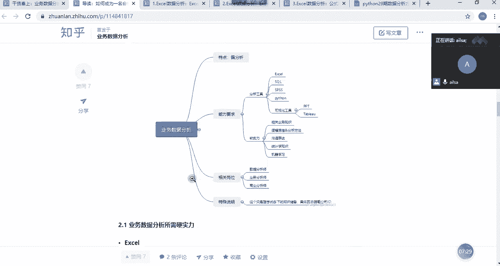
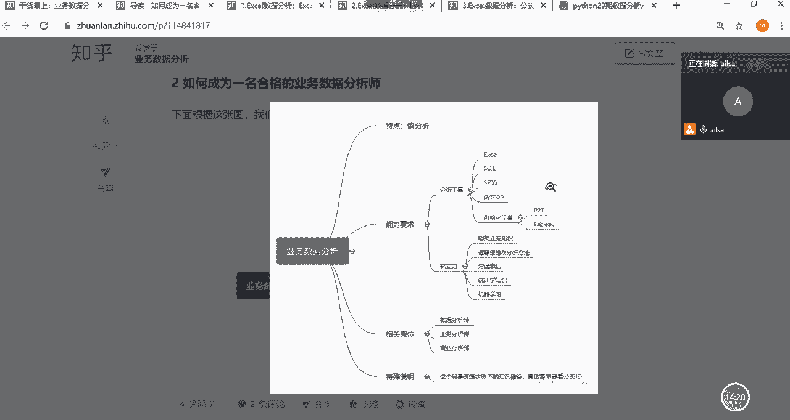
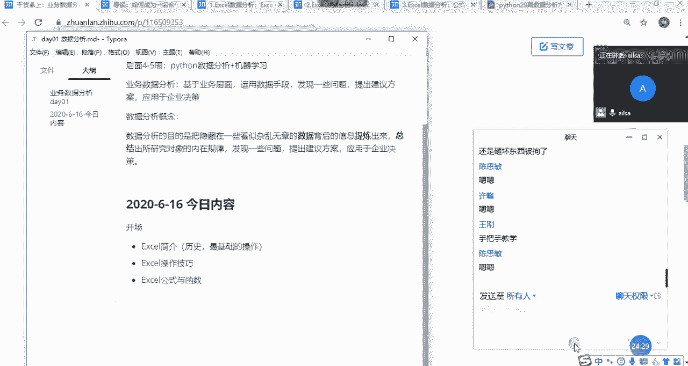

# 强推！这可能是B站最全的【Python金融量化+业务数据分析】系列课程了，保姆级教程，手把手教你学 - P33：02 课程内容介绍 - python数字游侠 - BV1FFDDYCE2g

OK那我们如果说想做一个业务，数据分析的这样的一个岗位的时候，那我们需要嗯，那我们需要呃有以下的几个的知识的去讲解哈，首先呢我先给大家介绍一下什么是数据分析啊，数据分析呢。

就是说我们从非常官方的说法来说的话，它就是指啊收集上来大量的数据，然后运用分析方法分析工具，然后加以进行一些一些分类汇总，然后提取有价值的信息概括总结，形成有效结论啊什么什么的啊。

其实这个巴拉巴拉一大堆也嗯也看不太清楚哈，那其实我们简单来说的话，它就是把我们给出的一些特别多的数据，然后去提炼出来啊，总结出有价值的信息，然后我们从中会发现一些规律，然后针对这些规律呢。

我们发现一些问题，然后提出自己的一些啊建议方案，然后应用于企企业决策，然后促进企业的发展，其实这就是数据分析一个啊很重要的好，很重要的一个作用，那我们啊在这里面写一下数据分析啊。

数据分析它其实就是呃呃我们刚才的这个概念，我可以直接粘过来哈，就是隐藏在一些杂乱无章的啊，杂乱无章的一些数据，然后提炼出来啊，研究内在规律，然后啊我们要啊发现一些问题，然后提出建议方案哈。

因为你的分析一定要有价值啊，才可以说明你的分析是有意义的，提出建议方案稍等啊，提出建议方案，然后应用于企业决策，那我们说完这个概念之后啊，可能大家对于这个的理解还啊，可能还不是特别的清晰。

我们举两个例子哈，嗯首先我们先看接下来的一组数据，嗯在这组数据当中我们看一下这个是地区，这个是城市哎，这是日期品牌车型，那我们简单来看的话，它其实就是嗯一一个什么表呢，就是一个某某个呃某个企业。

它不同地区的一个车型的一个销量的表对吧，哎我们可以看到售价销量和收入，那我们如果说给你这样一张表的话，其实你是也看不出什么来，对不对，他也没有什么嗯什么意义所在，所以说你也你也不知道该怎么办。

但是如果说啊你是做数据分析的，你通过这一组数据，然后通过对比的分析方法，然后啊通过展示图形的方式啊，给它做出来这样一个图表，那我们就可以看出呢，啊发现一个什么样的规律啊。

发现诶西北提车的销量是不是最高啊，哎是哎而而西南地区的销量是最低的，那这样的一个规律，你应该得出什么样的结论呢，哎是不是西北地区既然销量这么好，那有什么原因的存在呢，是不是我们可以这么去分析一些问题。

但是在这里需要跟大家强调一个点哈，因因为它这个销量高，有可能是某些地区的门店会多一些，所以说如果你简单的这样去对比的话，是没有太大意义，那我们在这里呢假设它的门店数量是一样的诶。

呃那么西北地区销量很高的话，就说明它是不是有很多或者是有一些优势，他自己在运营方面或者是企业管理方面，门店管理方面有什么好的点，然后已造成了这样的一个现象，其他地区可不可以去学习啊。

然后去模仿这样的一个呃结论，那对于西南地区而言，它销量的如此之低，那他要去分析自身到底存在哪些原因，然后去改进优化，对不对，那如果说大家都朝着这个方向去发展的话，那如其他地区也慢慢的销量逐渐的提升。

那对于企业而言的话，它是不是整个的话就企业就会呃，往好的方向去发展，那这个就是一个很简单的数据分析的一个，价值的体现，对吧嗯那我们再来看一个例子啊，还是一个车型哈，还是一个车型，然后我们可以看到啊。

它的整个的一个销量的维度发生了变化，诶它是一年的一个销量，那我们给到这一组数据之后，唉其实我们也看不出什么来，但是我们通过对比分析画图，哎我们就会发现一个很大的一个规律，什么呀。

它的整个的一个5月份的销量，是不是都特别低呀，那这其实就是我们通过数据分析，发现的一个规律，那这样的一个规律，让我们去分析它背后到底是什么原因造成的，那针对啊可以从各个层面哈去分析。

这个我们在后面都会去讲该怎么去分析，那我们假设分析出来的这样的一个结果，是因为市场的突然发生的一些啊变化，也就是说比如说啊，就比如说我们的疫情啊这样的一个情况，然后造成的额就销量的断崖式的一个下滑。

那这个时候我们就再去想啊，有的人就说了，你这个数据已经呈现在这里了，那我也我亡羊补不，我现在已经是没办法去弥补了，对不对，其实没有，你发现出这样的一个问题之后，我们要去想，如果说以后再遇到类似的情况。

我们该怎么去积极地应对，也就是说，我们是不是应该提高一下市场的敏感度，然后去啊采取更多的A方案，B方案，然后去保证，就是企业不至于在遇到突发情况的时候时候，遇到这么大的一个啊销量的一个冲击啊。

给企业带来了带来了很大很不好的一些影响，其实这个也是我们整个的一个，数据分析的一个价值所在啊，那我们从上面两个例子当中哎，大概能够呃看到的就是说我们数据分析哈，它其实就是运用专业的分析方法和分析工具。

然后发现数据背后隐藏的规律，然后我们呢就是把它总结分析，然后得出有价值的信息，然后用于商业决策啊，这就是通过科学的手段去管理企业，而不是说像ALEX去讲的，就是我就是拍一拍脑门儿就就这么去干就行了。

那这样的话其实存在很大风险，但你通过数据的话，它就是比较客观一些啊，这就是我们讲的什么是数据分析啊，就是刚才我们提到了这样的一个呃，概念的一个呃解释，那大家对于数据分析这个的理解啊，我看一下哈。

理解有什么问题吗，啊都听明白了吗，OK听明白的话给我扣个一哈，啊哈OK哈嗯行，那我这一块算给大家讲明白了哈啊啊，对建模型的话，就是对于比较复杂一些的分析的话，我们会通过建模型的方式去实现。

我们所想要的效果哈，那既然说我们数据分析啊，嗯就是这么重要，那我们应该学什么东西，才能够找到一份数据分析的工作，或者说才能够成为一个合格的业务数据分析呢，那接下来我们看一下我们需要具备哪些能力哈。

啊那我们需要具备的能力呢。

其实啊其实有两个哈啊，两一个就是我们的硬实力，简单来说一个就是硬实力，一个就是软实力，因为你要做分析，你不能凭空想象，对不对，你肯定是要用工具唉来去呈现，所以说你要学习excel啊。

对你要学习数据分析的工具啊，对这个肯定是必须的必备技能哈，那你除了学习工具之外，你不能成为你不可能只会工具，那样只是一个机器人而已，所以你要具备一定的思维，对不对，所以说我们分这两大格呃。

东呃那个需要掌握的技能，首先对于数据分析工具而言，我们啊最开始啊要掌握的就是excel哈，好他是一个必备技能，但他却不是一个呃，就是呃就是很重要的一个技能哈，因为初入职场，大家都会excel，你不会。

那那其实就很尴尬了，而且你作为一个数据分析师，你肯定是要会的哈，所以说我们的课程在设计的时候，也以excel作为切入点，因为它啊是在工作当中，几几乎人人必备的一个呃操作工具哈，也是比较简单啊。

然后易学的对于数据分析师而言也是啊，在处理一部分数据的时候也是非常啊，这非常容易上手，而且非常高效啊，所以excel啊一定是要学习的，第二个就是circle哈，大家在好。

大家在这样的课程当中也学过MYSQL了哈，所以说我们在讲这部分circle部分的时候，就是简单的回顾，然后重点讲一下我们的多表查询啊，然后会给大家嗯，会给大家讲一个案例。

然后把我们的circle融入进去，那对于circle的学习相对来说会比excel还要重要，因为现在大部分公司，他们的数据都不会仅仅是存在excel当中了，因为数据量级都有了。

所以说基本上都是存在数据库当中，那存在数据库当中，你要进行数据调取，肯定是要用到circle了，所以说啊circle在我们不管是面试的时候，还是我们日常工作当中的时候，肯定都是一个很重要的一个工具。

那下面就是SPSS，这个是一个专业的啊统计分析软件啊，就是什么叫统计分析软件呢，就是它的针对于统计学的知识啊，用的用得非常的呃非常的多哈，所以说学习SPSS，需要建立在一定的统计学的基础知识之上。

你才能够玩转SPSS，那对于目前的企业而言，SPSS呢它并不是说每家企业都用哈，有一些呃，我我发现就是说比如说一些传统型的企业，他可能用到的会更多一些，但是不排除其他公司用到一些统计模型的时候。

也会用到SSPSS，所以掌握SSPSS也是一个加分的项，但是在这里没必要说唉，大家特别特别精通SSPSS啊，因为你不是如果说你不是统计学专业出身的话，你学习他的话是相对来说是有点吃力的啊。

那接下来就是我们的Python了啊，Python对于大家来说，就是无非就是简直就是一个啊，非常好的一个加分项哈，因为啊现在很多企业在做数据，业务数据分析部分哈，我说业务数据分析部分。

他们有一些嗯有一些操作啊，都是比较呃麻烦和频繁的，那你用MYSQL啊，不你用Python的话，你做一些自动化的东西的，实现的话是非常高效的，所以说现在很多招聘的呃GD上哈，也就招聘要求上很多都会写。

说哎会Python的话是一个优先或者加分项啊，这样的一个那东西哈，所以说啊大家还是有很大优势的哈，啊那下面最后一个就是你做完数据的处理啊，啊这些东西之后，然后你还要做一个很重要的工作。

就是你的数据可视化，因为你做出来的一个数据结果之后，你更多的是要给你的上级，你的你的合作伙伴，然后你的业务部门去汇报，这个时候你要通过数据可视化的形式，给他们去呈现，那首先你得会PPT对吧。

然后你也得会一些专业的数据可视化工具，比如TABO啊，这个还是很专业的哈，啊他就是就是是一个国外的软件，然后国内也有类似的哈啊，但是TELLA来说相对来说是比较专业的，在很多层面都设计的呃。

很高很很很厉害哈，嗯那我刚才说的就是这部分的一个啊硬实力，也就是我们需要掌握的分析工具，那接下来就是软实力啊，软实力其实啊这个东西就比较含糊哈，你说我怎么去啊，我怎么去啊，提升这个呢。

其实在前期的时候哈，如果大家有工作经验的话，我们可能在工作当中慢慢会积累一些，如果没有也不要紧，我们会给大家讲一些东西，这个其实是需要在工作中不断的去，无形当中去啊修炼的。

你比如说啊如果你进入了某个行业，你肯定要知道相关的业务知识的，那如果说你在没有进入到这个行业之前，你可以通过啊就网上找一些资源，然后别人写的一些东西，然后去了解也是可以。

那第二个的话就是逻辑思维啊和分析方法，这里这一点很重要哈，我们啊在工作当中有一些，如果说你没有很强的一个逻辑思维能力的话，那你在分析问题的时候就就感觉杂乱无章的，不知道从什么下手，所以就很难受哈。

呃然后呃，所以这一方面我们在课程当中会涉及一些，然后还有一些分析方法，也就是说既然你说做数据分析，要用专业的数据分析工具，OK我学会了，但是还有一些专业的啊分析方法呃。

联合我们的分析工具去进行一个呃融合，这样的话你才能做出一个很有深度，或者是很有价值的这样的分析成果啊，所以这个也是要有的，然后以及这个沟通表达能力，这个就不说了哈，不仅仅是数据分析的岗位啊。

其实你在公司当中任何一个岗位，你都要具具备一定的沟通表达能力哈，因为我们的人是一个群体哈，人与群体，那就必然会要沟通啊，那还有就是后面的统计学知识和，机器学习的知识的话，这个就是对于我们的数据分析而言。

需要掌握的理论知识，也就是说原则来讲，他应该在我们大学的时候，就应该具备这样的一个能力了，那因为我们在大学的学的课程呢，相对比较理论化学术化，所以说我们在我们的课程当中会融入一些啊，更多接地气的啊。

这样的一个实际案例去呃理解我们的理论知识，好吧嗯这就是我们需要具备的软实力和硬实力。

嗯那我们既然具备这些能力啊，需要具备这些能力，所以我们的课程是怎么来设计的呢，我们看一下我们的课程大纲，哎，我们也是基于这样的一个内容来给大家设计的，首先呢我需要掌握excel的一个操作哈。

有基础操作操作技巧啊，还有就是公式与函数，以及我们进行数据可视化，也就是我们的图表和数据透视表啊，这样的一个在我的日就几乎哈，就是每个人或者每个数据分析师，在日常的工作当中使用excel。

无非也就这几个方面了，那我们讲完了之后，有的人说，那我学完了之后，我不知道我自己到底能不能行，到底学得怎么样，那这边给大家会准备一个实战案例哈，这个东西的话，这个案例是我自己找的，它不仅仅可以说啊。

练你的excel的一个数据处理能力，而且还要加上一定的一个分析能力，但是分析的还是层次比较浅的啊，主要是为了让大家有一个代入感哈，OK那这是我们excel的数据分析，那第二个的话就是我们的指标了。

其实这一部分哈，大家可以发现，在我们最开始发的那个课表里面是没有的啊，是没有我们的这个分析思维的，这是我后期加进来的，因为呃我这边啊也在想，就是说如果说只教大家工具的话，确实是啊教起来也比较简单。

或者大家学起来可能也没那么吃力，但是如果不自不融入一些，我们在工作当中的一些指标和分析方法的话，那我们在不管是在面试的时候还是工作当中，其实还是还是缺点什么，所以说我在这里面会给大家带入一些。

而我在工作当中啊经常会用到的分析方法，以及我常见的一些业务指标，那讲完了这个之后，我会给大家准备一个案例，就是我们的目前比较就应用比较广泛的电商嘛，它的一个呃基于网站上的啊，一些数据的一些分析。

这个的话就需要大家把自己学过的分析方法，和业务指标啊这些融入进来，然后再结合我们的excel的一些能力，然后去做我们的分析啊，相当于进行一个啊训练啊这样的一个形式。

那第三部分就是我们的一个circle啊，circle部分，SQL部分的话，这部分就是我们尽量简单的去啊，回顾一下我们之前学的内容，因为我们学的MYSQL已经非常非常详细了，我带大家去回顾。

然后重点是我们的多表查询，然后我们学完了之后，我也有一个实战的案例，这个也是基于淘宝天猫的一个用户行为方面的，一个数据给大家做的一个实战案例，大家要自己去写啊，那呃写完了之后。

相当于你对于啊前面讲过的分析方法，还有业务指标以及circle都进行了一个训练啊，也就是说把我们前面讲的东西又进行了一个，进一步的一个加深的训练，那我们第四部分的话啊。

先相当于哈你不学第四部分和第五部分，你只要学学会了123哎，你这个业务部分内容其实就差不多了，那我们第四部分的统计学的知识的话，主要是针对啊那些啊，就是在学校学的不是特别好的。

然后我们呃讲一下统计学的话，主要讲描述统计，推断统计啊，然后SSPSS以及我们的模型啊，就是简单的模型给大家进行一个讲解，统计学啊，基础的话，其实是融入到我们的整个的一个分析啊。

方法和分析思路当中的一个理论基础，如果你不会呢，其实你也可以做，但是如果你会了呢，你在想问题的时候就会更加理论客观一些啊，这样子哈是一个呃也是一个必备的吧，啊嗯那最后一个就是我们的TABO啊。

TABLO就是一个数据可视化的专业软件，我们会讲一些比较呃常见的啊啊分析的图表啊，啊这样的一些东西，大家可以对比一下，我们讲了TABLO之后，就知道用excel做图表跟TABLO做出表。

它们之间的一个差别了啊，就可以看出来人家其实是还是挺专业的啊，啊这就是我们的一个课表啊，就是前两周主要就讲这些东西啊，好的啊，那大家对于这个稍等哈，大家对于这个有什么问题吗，我把聊天调出来哈，Ok。

啊理工科学的概率论数理统计可以啊，嗯好的好的好，大家没有什么问题的话，扣个一哈，嗯扣个一哈，好的啊，我看都没有什么问题啊，都没有什么问题啊，我们把就是我们这两周的课，大概的去介绍了一下啊。

稍等我看一下时间，OK哈，那接下来我再讲，最后一个就是我们今天要讲什么东西哈，我们讲完这个之后，然后我们就下课休息哈啊，因为今天我们是第一天开数据分析的课，所以说内容不会特别多哈，这一点大家倒是放心啊。

然后因为每一次开新课的时候，大家就会发现啊，内容都不会特别多，因为是为了让大家有一个接受的过程，那呃我们也会发现我刚才讲完了，我们所有的一个啊学习的内容之后啊，大家也会知道。

好像诶跟我之前学的jungle学的啊，学的一个Python什么面向对象啊什么什么的，是不是都没有什么特别大的关系啊，那其实这个点就这个就很好啊对吧，就是跟之前的MYSQL有有关系之外。

其他的都关系不是特别大，那你就是一个啊重新排名的一个机会了哈，比如说之前学的特别好，那到这个地方其实也不一定哈，之前学的不好的也没有关系哈，大家现在是统一起跑线是吧，OK哈嗯对需要下载excel啊。

我因为王刚这个我也不知道是怎么个回事哈，因为我们之前拉了一个群，然后跟大家都说好了，需要下载excel文稿有吗，OK哈那我单我私下再跟王刚单独沟通哈，我们说一下今天的内容哈，今天啊今日内容。

嗯今天是二零啊，2020年6月16号，唉是一个很好的日子哈，六杠666大顺啊，希望大家天天顺利，我们看一下今天主要讲，首先我们今天啊要进行了一个什么呢，进了一个开场。

我就是啊开场啊讲了一下我们的要学习的内容，然后我们接下来会介绍嗯，介绍excel简介，连接会讲什么呢，会讲一下它的历史啊，不讲excel历史啊，讲电子表格的历史，也就是整个的一个电子表格的发展历史。

然后还有就是我们会讲一下最基础的操作，嗯啊讲完了之后我们会讲啊，这是我们的excel简介的内容，然后第二个我们会讲一下excel的好操作技巧，可能在没有接触过excel的时候。

大家都觉得说A是不是它内容特别多哈，啊其实没有啊，基本上我们今天就可以把他的一些啊，操作技巧啊，啊还有重点的操作都已经讲完了啊，excel操作技巧，我们大概有7~8个技巧去给大家讲解。

然后第三部分我们会讲解excel的啊，excel的公式与函数哈，公式与函数是excel当中，非常非常非常重要的一部分哈，我们啊也会在今天讲讲解哈，那我们每次课讲完了之后哈。

啊就是特别是操作类的课讲完了之后，我们都有啊对应的练习题啊，所以说大家这个呃倒放心啊，就不会说哎我学完了之后，会不会不知道自己到底会不会的时候，哎我们这边都有练习题，那我们今天主要讲的就是这三块内容。

如果上午讲不完，我们下午可能会抽个一到两个小时再进行讲解，这个看具体一个进度好吧，嗯然后我再说一下哈，因为我们这个班呢是小班教学，也就是说大家整个的呃班级人数不超过十人，那呃其实我完全都可以照顾到。

每一个人的学习的一个情况，所以说你要是有什么问题呢，就在可以在我们的一个聊天里面，然后去呃去说，然后我如果在课上可以给你解答，就解答，课上解答不了，我就课下跟你沟通啊，呃就是说有什么问题都可以跟我说。

而且说大家只要有不明白，不明白的都可以抛出来，我们小班教学很大的一个特点在于什么呢，就是真的是能够保证每一个人都能学会哈，啊学不会咱们就可以啊，放慢进度，因为就这么几个人啊，明白了吗。

对手把手教学其实就有点类似于一对一了啊，因为人人比较少，所以说大家交的钱还是挺值的，你比如说你如果说唉，这个课是七八十人或者五六十人的时候，老师根本就照顾不到你，你学你学不会。

然后完了你又不好意思说的时候，老师也不知道你学不学得会，所以说啊到最后害的还是自己知道吧，所以我还我我是比较喜欢小班教学的，因为大家啊就是第一次开课，然后大家都认识了，对不对，然后都比较熟。

有什么问题就直接说啊，好吧嗯，那我们就休息一下哈，我们现在按09：30，然后我们9。50回来。

