# 强推！这可能是B站最全的【Python金融量化+业务数据分析】系列课程了，保姆级教程，手把手教你学 - P34：03 Excel简介 - python数字游侠 - BV1FFDDYCE2g

好嘞哎我们开始今天啊正式的内容讲解嗯，哎很简单哈，我们首先来介绍介绍一下excel的一些，简单的介绍啊，简单的介绍excel啊，首先我们先介绍历史啊，啊。

其实excel呢它属于它属于电子表格哎的的一类哈，所以说我们介绍电子表格的一个发展史。

那世界上第一款电子表格啊，不是excel哈啊那个时候还没有excel，在1978年的时候。

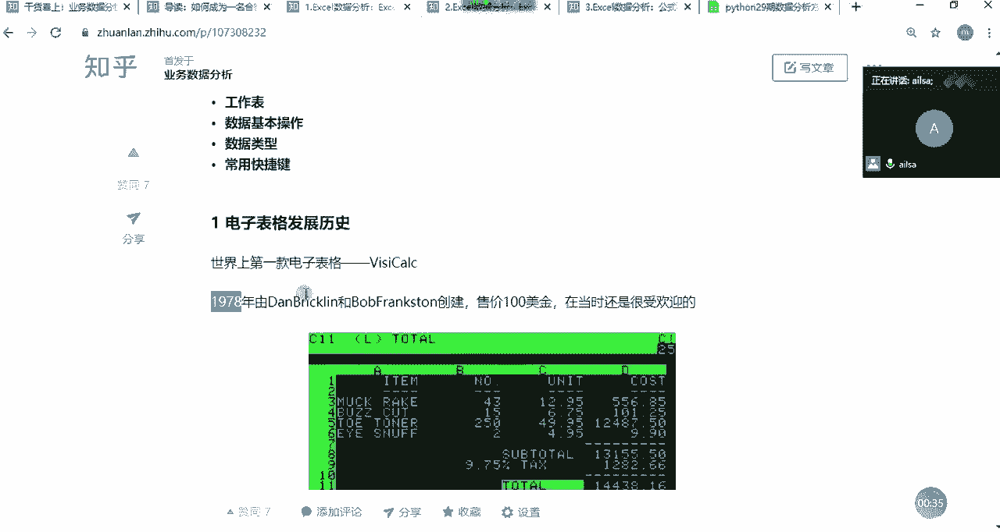

然后发明了一个叫vc cock啊，这个一个上线使用它，这个啊是我们第一款电子表格，是用来做数据处理的哈，当时发明这个呃，这个软件的一个原因在于什么呢，就是之前是没有电子表格的，那他们怎么用来计算呢。

就是手算哈啊，写在纸上，写在黑板上，然后手算不管是教授级别的还是小白级别的，都是这么来进行计算的，然后有个学生就在想，这样也太麻烦了，我改一个数，然后其他数都要进行一个修改，所以说他就在想。

我可不可以设设计一款电子表格，那vc cock就应运而生了，我们可以看一下这个的截图哈。

嗯我们看一下它这个电子表格呢，啊我们可能现在好像有点像算术式是吧，那其实我们不要看内容，我们可以看它的一个列，ABCDA跟现在的excel是不是有点像，它是不是由列和行组成啊。

1234567是不是一个二维表啊，说明当时的时候在进行一个数据处理的时候，它的结构已经定型了，就是列有字母组成啊，行是由数字组成这样的一个结构，然后进行数据的一个计算，那当时发明了之后呢。

还是很受欢迎的哈，100美金也不便宜哈，很受欢迎，那为什么它我们只是称它为第一款电子表格呢，是因为后来发明的一个叫lotus，123的电子表格比它还要好用。

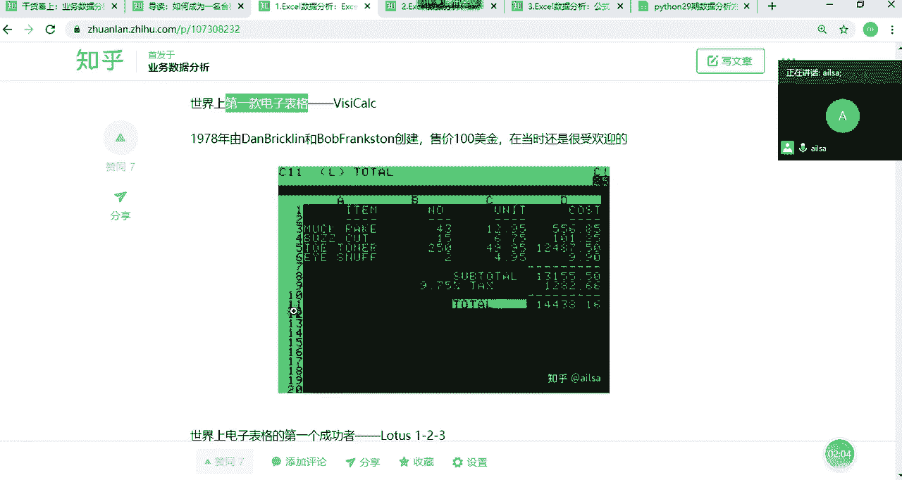

所以说它称为第一款，它称为一个成功的电子表格，那既然它是成功的电子表格，为什么我们现在用的是excel呢。

这又要讲到接下来的一个故事了，就是他当时发明了这个lotus，123了之后呢，我们可以看从个界面上来看哈，这边唉有图表唉，竟然当时就已经有图表了哈，还有我们的表格唉，excel的一个数据处理。

据说他当时还承载了一个小型数据库的，这样的一个功能，所以叫123也就有三个三大功能来组成的。

所以说他一经问世啊，也是销量非常非常的好啊，当时售价是495美金啊，一看就很贵哈，但是啊还是非常好用哈，但是他当时我们看1983年，那个时候windows操作系统还没有盛行对吧。

所以说它当时开发的应该是DOS的一个系统啊，适用于那个的一个软件，那我们看一下接下来什么时候excel上场呢，就是就是啊，当时啊微软公司他们也发明了电子表格，因为他们也看到这样的一个市场。

他们早在1982年，也就是比他还要早一年的时间，就发明了第一款电子表格叫multi plan，但是呢唉他没有人家lotus123好用，所以说就败给了lotus123啊，那唉据说哈当时因为这这个事件。

微软公司还专门召集了所有的高层，以及他们的技术研发人员开了一个会，然后讨论一下我怎么才能够开发一个软件啊，然后能够既继承了lotus123的优点，又比lotus123还要好用。

唉这样的一个会议还据说还是秘密会议哈，那开发召开了这样的会议之后呢，在1985年的时候，他们推出了excel，那excel它其实就是multi multiple的一个呃更新。

然后而且它继承了lotus123的，很多的一个优点，但是他当时开发的时候是Mac系统的哈，首先推出的是呃Mac系统的excel，那他当时1985年推出来之后呢，也并没有说哎特别特别厉害。

直接就把lotus123给打败了没有，他什么时候打败的呢，就是不是因为excel多么多么好用哈，是因为操作系统的问题，那微软公司它呃到1987年，或者是那几年的时候开发了windows操作系统。

好非常非常受欢迎哈，呃那其他的系统几乎都没有windows系统好用，因此呢呃微软公司采取了这样的一个方案，他把excel和windows操作系统绑定，唉这样的一个销售手段其实是很厉害的哈。

啊那就这个时候大家觉得windows好用，excel a好像也跟lotus差不多也好用，所以说唉那个时候excel就开始畅销了，那lotus123是怎么败下来的呢，不是因为它功能的问题。

还是因为操作系统的问题，它既然windows当时比较盛行的话，它就要开发出适合于windows操作系统的，这样的一个啊这这样的一个版本，但是他开发的不好啊，可能是因为NOA的123。

自身软件的一些兼容性的问题，所以说唉大家都用的windows操作系统，但是noa lotus123又不好用，那直接就采用了excel啊，所以说后来excel就成为了啊，目前市场上啊第一霸主哈。

也就是说电子表格以后就是excel的天下了啊，那后来呢，就是据说微软还把罗塔斯公司给收购了哈，把x lotus123还给收购了哈，那我们看一下接下来这几年，excel的一个发展的历史哈。

它其实每年都在不断的迭代更新，那90年九零年的时候推出了E呃，excel3版本，92年推出了excel4版本，然后93年的时候推出excel5版本。

那这个他在93年的时候还把excel绑定进了microsoft office，我们都知道office它有什么excel啊，word啊，PPT啊这样的一个组成，它绑定起来之后。

相当于也是一个呃就是办公软件的一个呃，嗯就是呃捆绑销售，然后在1994年的时候呢，他还支持了VBA哈，VBA是一款啊，是一款啊，就是依附于excel的一个后台的编程语言哈，啊大家可能不是特别了解哈。

我之前学过vb a哈，自己在工作当中学的，他就是说主要是为了实现excel自身的啊，一些操作的自动化啊，这样的一个功能，所以说其实excel还是很强大的，人，也有自己的编程语言是吧。

哎所以说不要小看它哈，我们可以看到当时的一个界面哈，93年唉，当时一个界面跟当时的电脑还真有点像哈，这种突出的一个标签的一个设计啥的。

嗯然后95年的时候推出了九五版本哈，也叫七版嗯。

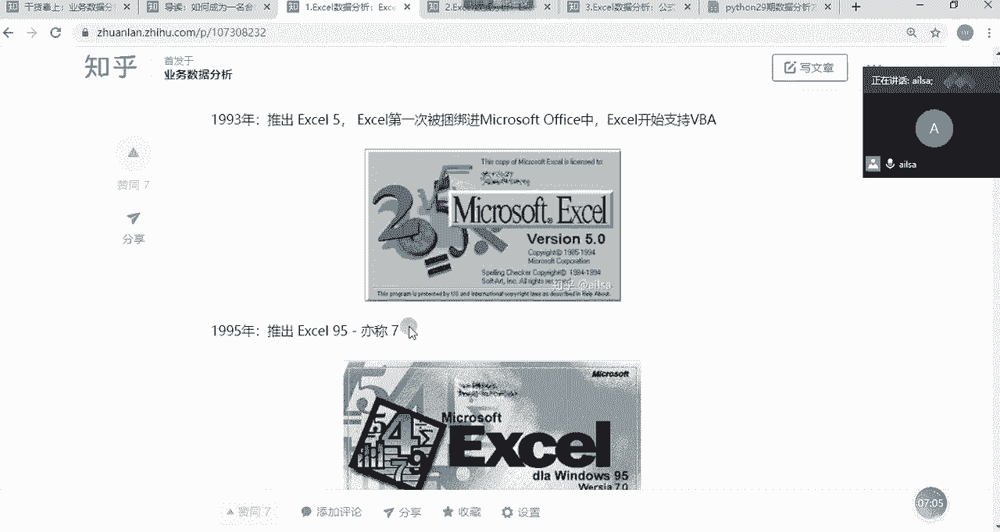

那我们可以看到诶版本有了明显的更新哈，有点像有点像什么。

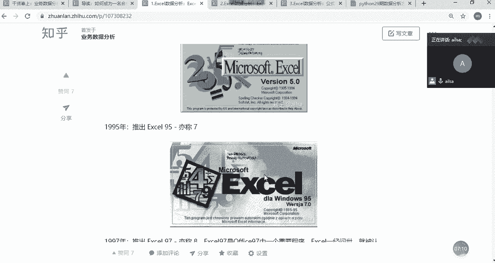

有点像涂鸦哈，就是这个以色彩还是比较的啊，比较的炫酷哈，可能跟当时的一个审美有一点关系哈，在我看来好像也还一般哈。

不是特别的专业哈啊那我们看97年的时候。

97年推出了一个九七版哈，也叫八，我们九七版啊，九七版是一个很重要的转折点，为啥呢，它推出来了之后啊，九七版好在很多功能上都进行了一个更新哈，他所以说他当时被认为是功能非常强大。

使用非常方便的一个电子表格，我们可以从这个界面上去看的话啊，它整个的一个呃外观啊啊都比较接，就结合现在的一个审美了嗯，九七版是一个很重要的版本。

那在99年的时候推出了啊，推出了啊excel200，然后191年是XP，其实这几个版本在相对于九七版而言的话，没有特别大的更新，那03年推出了零三版哈，零三版也没有特别大的更新。

但是哈有一个很大的特点在于什么呢，零三版在中国哈，在我们国内啊非常受欢迎啊，为什么呢，它它既然相对于九七版也没有特别大的更新，为什么他会这么受欢迎呢，其实我觉得应该跟当时的中国的计，算机发展有关。

在03年的时候，中国计算机应该有一个很大的一个发展进步，所以说啊所以说我记得我刚进公司的时候，还有一些很老的电脑里面装的都是excel，2003啊，它这个版本是相对比较老的。

那在接下来这几年呢就是06年啊，零七版，10年，一零版以及13年的一三版，还有现在的一六版，还有一九版啊，这样的每次的一个版本更新，那从零七版之后，它整个的一个外观上啊，内容上啊。

功能上啊都没有特别大的变化了，只是变得越来越智能，越来越美观而已啊，这大概就是我们excel的一个发展史，那在整个的excel的发展的，版本更新迭代的过程当中，我们需要记住几个版本哈，一个是零三版哈。

因为我们在工作当中经常叫九七杠，零三版，可能是因为他们之间的版本，差异性不是特别大哈，所以我们叫九七杠，零三版，就其实就指的是零三版，然后呢还有一个就是零七版啊，零七版啊，呃零呃零七版啊这样一个版本。

然后最后就是一零版，一六版，这其实都差不多了，唉这几个版本的话，在工作当中和现在的一个公司当中，用的比较多的啊，就是这几个版本就是比较老，或者是比较传统的公司，有可能还有一些文件使用的是零三版。

但大部分都是零七版，一零版了啊啊一六版的倒不是呃倒也有啊啊，因为一零版跟一六版其实差不多，但是功能上没有一六版新哈，啊这是我们的一个呃整个的一个版本的介绍，大家一会我就会跟大家说。

我们介绍这个版本的意义所在哈，哎我看一下大家的一个反馈啊，对于这个有什么问题吗，啊WPS比office草用的多，呃这个呃仁者见啊，不仁者见仁，智者见智哈啊就每个人在使用啊，就是软件的时候。

我们不能说哪个软件特别特别好啊，哪个软件特别特别差，因为你比如说现在我们讨论一下，世界上最好用的编程语言啊，可能啊，我们花一天的时间也讨论不出来一个结果哈，那对于这个工具的一个使用的话。

看个人的一个喜好，以及每个人他最开始接触的那个版本，可能他用WPS用习惯了，他就觉得哎比较好用，但是嗯你比如我，我从一开始接触电子表格的时候，我就接触了shake ce啊。

所以说所以说我就觉得excel特别好用，你能把我怎么滴，对不对啊，没有哈，这个这个看个人的习惯啊，啊但是就他有可能在某些方面啊，只能说他有些在某些方面，他可能唉设计的比较合理，比较人性化。

还有一些在那些方面的一个东西，但是我们从目前市场上来说哈，市场上来说，使用嗯excel或使用微软产品的还是占很大多数的，所以说我们讲的是excel，是因为这个啊这个问题啊，WPS现在也是有会员制了。

所以说有些功能你还是要花钱的，我我我我是了解到的啊，因为没有用过好吧，那我们就简单的了解一下历史哈，大家看我们的课程是不是非常的轻松啊，轻松哈，OK我们接下来啊就要进入我们整个excel的介绍了。

那我们在讲excel之前，我是不是要建一个excel文件呀，哎那我们新建一个这样的一个excel唉，大家看这是不是一个文件，那这个文件其实它就叫什么呢，叫工作簿，excel的工作簿哈。

我这边命名为excel简，嗯就是他的文件名，然后大家再看哎工作簿哈，工作簿啊，不念报哈工作簿，然后我们可以看一下它的文件名的一个后缀哈，我们要研究一下它的后缀名是XLSX，这个后缀名呢是在零七版及以后。

就使用的是XLSX了，所以我这边要介绍一下版本哈，我这边要介绍一下版本，因为我们在后面进行一个呃，跟其他数据分析进行一个交互的时候，就我们会用到这个哈，然后EXO简介，我们刚才讲了历史。

然后重点介绍一下工作簿啊，工作簿这么写的哈，工作部啊，这叫工作簿，然后会介绍一下版本啊，后缀名为XLSX的，就是零七版以后都是啊啊XLSX，然后XLS的啊，这个版本的是九七杠零三版。

我们就不往前再追溯了哈，往前再催促大家都没有出声的哈，所以说也没有必要哈啊，所以说我们啊在工作当中也就到啊，也就到零三版就结束了哈，所以说唉大家看一下我们的版本，大概是是两个九七杠零三版啊。

那我介绍这个版本有什么意义呢，我跟大家说一下，就是呃呃就是说你的高级版本，你比如说你的零七版本是可以打开你的啊，零三版本的，也就是说高级版本可以打开低级版本哈。

但是啊但是你的零三版的一个excel的程序，是打不开零七级以后的一个文件的，明白吧，低级版本打开打开不了高级版本，所以说我有咱们在进行一个沟通的时候，不有同学说他的电脑安装的是零三版，那就不行。

因为我们的都是零七版及以后了，所以就打不开，所以必须得用零七版及以后的，那对于零七版及以后，比如说零七版，一零版，一六版和和呃呃一九版，这样的话它们就很具有很好的兼容性了，它们都可以打开啊，这个样子啊。

大家明白这一点就可以了，我们主要区分这两个，那我们呃在那个进行数据分析交呃，工具交互的时候，比如说你要导入啊excel的文件的时候，它会提醒你后缀名啊，是XLSX啊，还是XLS，你就要明白。

它主要是为了区分这两个版本而已啊，因为在我们国内也就到零三版就结束了啊，好吧哎这是一个版本，我应该讲明白了哈，嗯OK那我们再接着往下说，既然我建了这个文件，我是不是要打开它呀，啊双击它就行了哈，这废话。

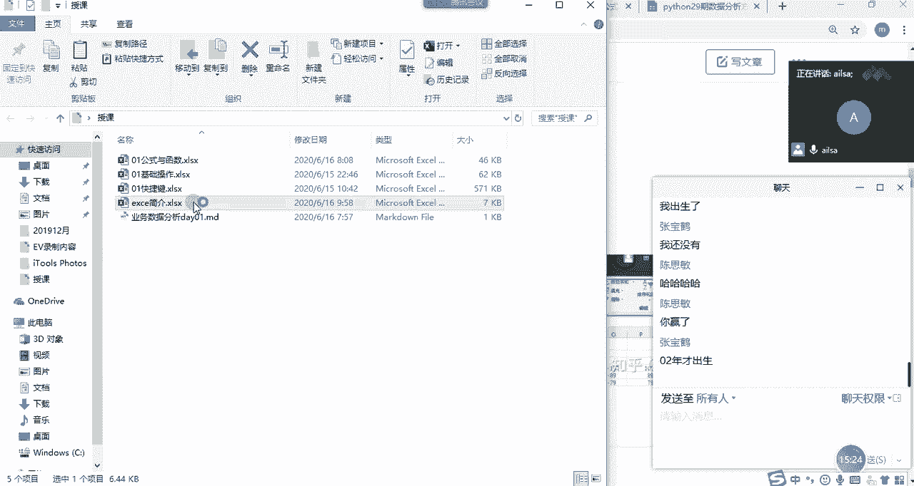

OK我们再打开这个文件哈。

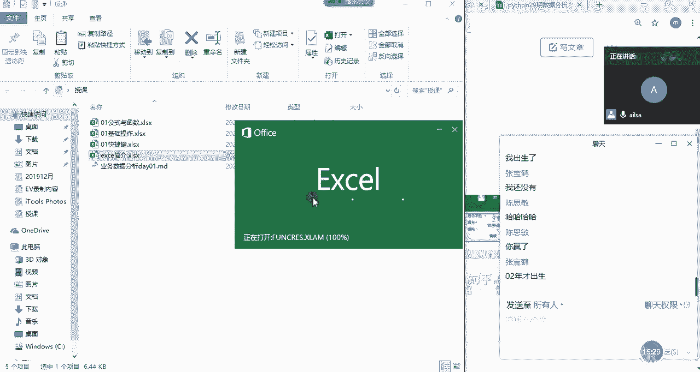

我们打开这个excel工作簿了之后，相当于是启动了excel的一个程序哈，excel程序已经启开了，然后这是我建的一个excel的工作簿，好稍等啊，工作簿我需要把大家的聊天切出来。

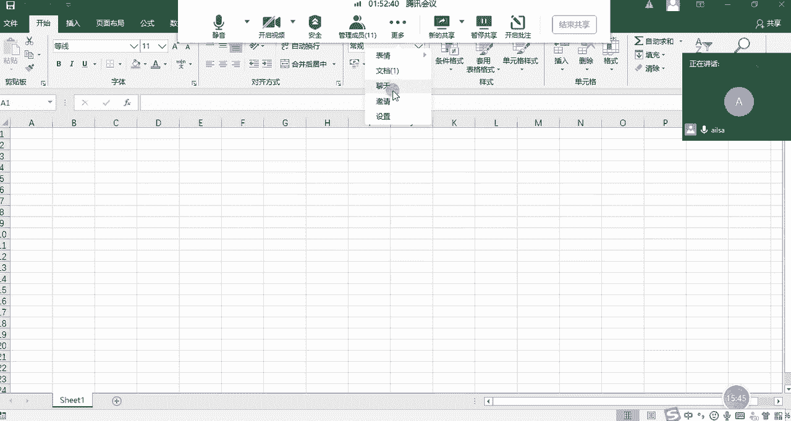

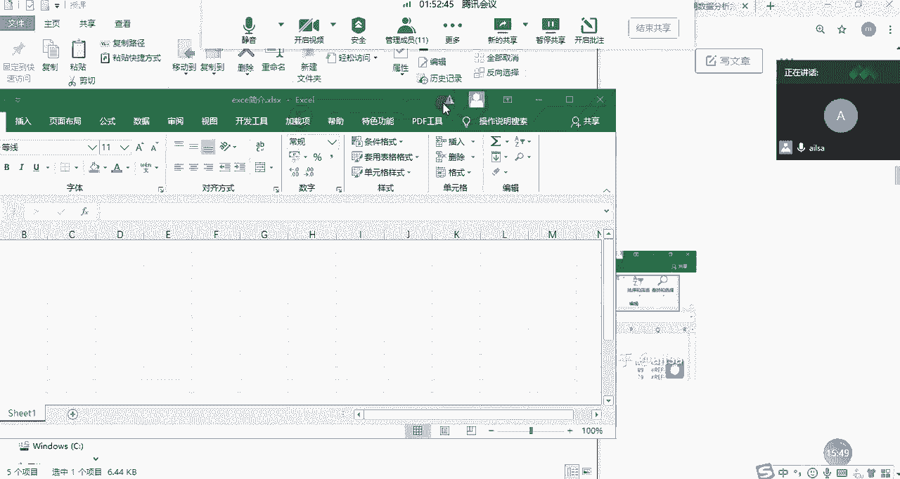

OK啊我那我们打开这个工作簿之后啊，我们从上往下给大家做介绍，首先呢啊我们看一下这一部分区域，这一部分区域哈叫功能区，什么意思呢，就是说我要在这，接下来做excel的其他的相关操作的时候。

我所有的功能都放在这里了，那我们都知道excel是一个图，就是那个什么标签式，或者是叫点点点的这样的一个操作形式啊，图标式的一个操作，所以说我只要点某一个功能，它就可以实现。

那你看它还会按照不同的一个功能，进行一个划分，你比如说开始这里主要是一些常用的功能，那插入这里呢主要是插入一些诶功能，那页面布局就是布局相关的功能，公式呢就是公式与函数相关的功能，它有不同的分类。

那这一个个分类叫什么呢啊叫什么呢，叫选项卡标签哈，也就是说我在接下来的过程当中讲，诶，请你定位到公式选项卡标签，就指的是公式选项卡标签下面的啊，什么什么什么功能的啊，这样的一个介绍就是这样子的。

数据选项卡标签下面的分列功能哎，你要知道怎么去找啊，哪个功能啊，这是选项卡标签，这是我们的功能区哈，我跟大家说一下啊，我们在介绍啊，第二个就是功能区啊，功能区有一个选项卡标签，还这样的一个介绍。

然后我们知道了这个呃功能区了之后呢，哎这边有一个小小的操作技巧，什么呢，就是啊我们如果哈假设假设你要给老板去汇报，汇报你的一些数据的时候啊，然后呢你比如说这个电脑屏幕比较少的时候。

你会不会觉得它占了很大的面积，那我们想隐藏它该怎么去操作呢，啊其实特别特别简单啊，双击它就行了啊，有的人说哎呀不行不行，你把它隐藏了，我要把它展示出来啊，那该怎么办呢，啊也简单，再双击一下就可以了啊。

知道了吧，如果你不知道这个功能的话，其实啊其实也其实呃也也可以哈，因为你不对，他不对，他做操作也可以了，但是你知道的话，你可以灵活的去应对不同的一个工作场景哈，但有些人不知道就很尴尬哈。

我给你讲个特别逗的一个笑话啊，之前部门来了一个新人，然后呢啊然后他让我给他看一些表。

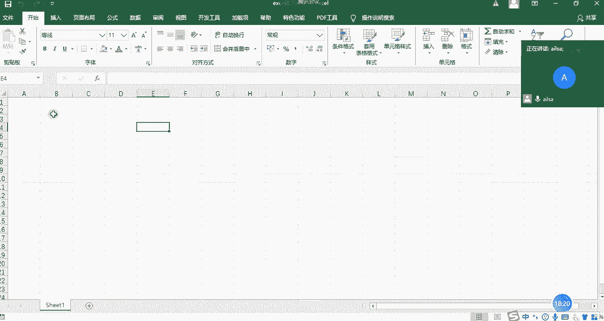

然后这个表数据量特别特别大，然后我就觉得这个功能区有点费劲。

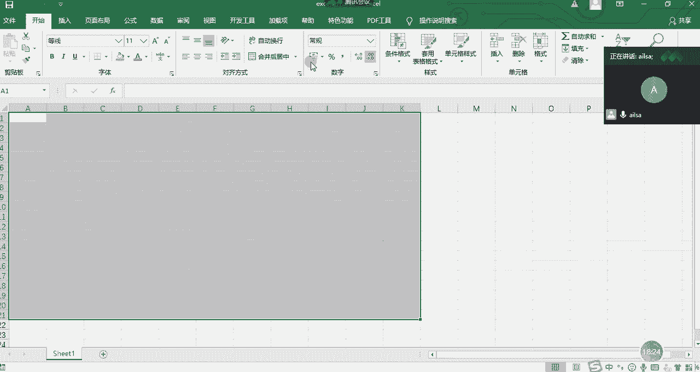

我就给他双击进去哦，双击进去了，然后跟他看完了之后，我就走了，后来呢他对这个表进行一个操作的时候啊，他是这么来操作的，点开选项卡，然后啊给它加了一个颜色，完了之后鼠标定位唉哟怎么隐藏了，就再点开再操作。

再隐藏，再点开再操作再隐藏，然后我过了过了几天，我又去看的时候，我说你为什么要这么干呢，他说你给我隐藏了，我不知道该怎么办了，我说你双击就行了啊，其实这是很很小的一个点啊。

啊所以说啊知道这个还是有好处的哈，那我们再接着往下来走哈，往下来走，我们看这个地方，大家看到没有，这个地方B3是个什么东西呢，我们可以想一想，我们在讲电子表格的时候，第一款电子表格vc cock。

它是不是它的列是不是由字母组成啊，它的行是不是由数字组成是吧，那行和列所组成的这个东西叫什么呢，叫单元格啊，啊叫单元格，那我定位到这个单元格之后，这里面显示的A1是什么呢，我们很明显知道A指的是列。

一指的是行，它代表的是单元格的地址，也就是说A1代表的是什么呢，单元格的，单元格地址啊，就是说我们在啊这整个的一个excel表里面，我可以对它进行一个唉值的一个啊输入啊，存储等等这些。

但是我要想用的时候，我直接对于地址的引用就可以了，这样的话如果说我这里面值发生了变化，那也会相应的发生变化，其实这就是excel的一个很重要的一个特点，那你比如说如果你不用excel做存储。

你把数字写在黑黑板上，黑板上它是一你改了，比如说哎我们画一个白板哈，好画画。

OK画图哈，哎比如说啊这是我的一个啊，大家能看到吧。

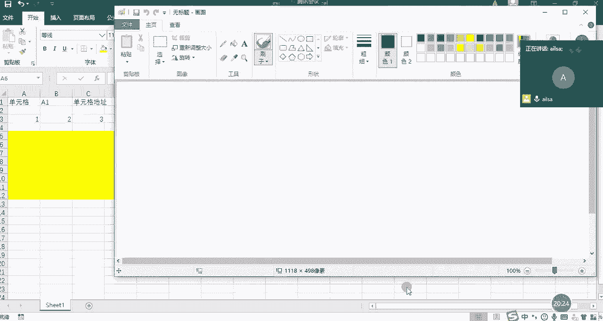

我为什么我这个聊天啊，大家能看到的话，给我扣个一，我聊天老是调不出来，对有有些人找不到的话也挺逗的哈，OKOK都能看到哈，现在啊现在我给大家，比如说我现在是一个黑板哈，我在这里面唉。

我在这里面啊输入123啊，很丑哈，超级丑，然后这个时候我想计算一下，1+2加3+3等于多少，是不是，然后我就在黑板上写A等于多少，等于等于等于多少啊，然后我写了好多好多行这样的一些数值的计算。

那其中有一个数发生变化了，比如说它发生变化了，换换成了五，那我整个的一个值是不是也要发生变化，对不对，哎这样的一个形式，但是excel不用哈，你比如说你这换成了五，然后我在这里面进行一个加和啊，他他。

哎你看它变成了九，我改成了六七，哎它相应的就发生变化了，那我对于地址的引用就非常的方便了哈对吧，哎这就是它的一个很大的一个特点，OK那我们知道了这个它的地址组成哈，这一定要记明白哈。

它的地址组成是先有列啊，再有行，在某列的第几行，代表的就是它这个单元格的地址，OK我们讲完了之后，我们再看一下这个地方诶，我把鼠标定位到这里，它显示的是A1，我把鼠标定位到这里，它显示的是单元格地址。

那它这里显示的就是什么单元格的值，是不是哎那嗯确实是哈，我看到的是单元格，这里面显示的也是单元格，OK那在这里给大家介绍一个小的点哈，比如说我在这里面输入了一个公式哈。

在excel当中输入公式需要加等号的，等于A1，哎大家看一下会发生什么样的变化哈，OK这里面我们看到的是不是A1是吧，哎它等于A1，所以他最后计算出来的结果，哎就是公式计算出来的结果是A1。

但是你看这里面显示是等于B1，也就是说这里面显示的是这个单元格，最原始的值对吧，诶那我们肉眼看到的是结果，在他这里单元格里面显示的是最原始的值，所以说你想知道这个单元格里面，具体显示的是什么值的时候。

你就可以在这里去看，或者是说你把这个单元格双击进来，你也能看出来啊，有时候我们不需要声音的话，直接把鼠标定到这里，就知道他要显示什么内容了，那我们在做公式的时候，经常这么在这里面去看。

你比如说鼠标这里面显示的是不是11，那我把鼠标定位到这里，它显示的就是A3加B3加C3啊，这样的一个结果，啊这个听明白了没有，嗯OK啊，明白了，给我扣个一，我接着往下讲，OK哦，三个四个五个，其他人呢。

好嘞啊，我们在每次呃回答和响应的时候，因为我们就九个人，八九个人，所以说大家每个人都要回复哈，我这边看到大家回复了之后，我就接着往下去讲啊，那我们刚才介绍了我们的整个的一个，单元格的组成。

那我们再介绍一下，我们整个的一个啊数据的区域，那这里面的话其实就是我们来存数了对吧，哎我们进行一个数据的存储，然后进行一个处理，然后进行一个最后的数据计算，然后数据分析，数据图表展示等等。

这些都在这里面去操作了。

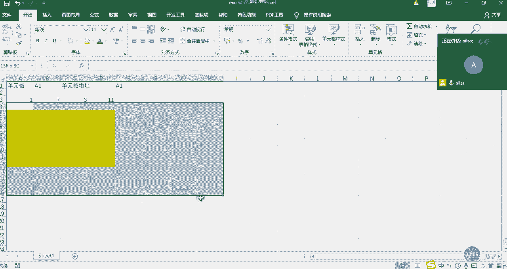

那我们今天不讲那么多哈，我们今天就先认识一下，这里面这每一个单元格哈。

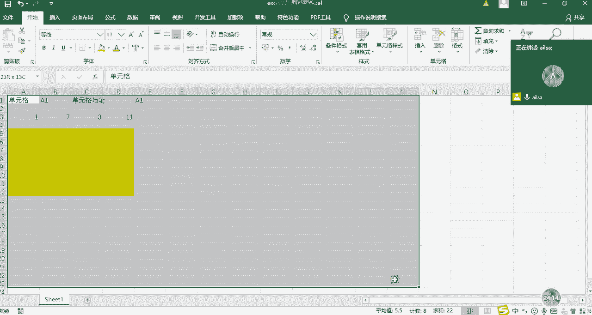

唉其实好像没有什么可讲的，对不对，在这里我给大家说一下，我们就了解一下它的最大值吧，我们想知道它有多少行，哎这个数据表这个工作表到底能存多少行呢，哎我们看一下它到底能存多少行哈，唉我们先不看哈。

先问一下有人知道吗，有人知道吗啊，它有多少行，有人知道吗，猜一下它能存多少行啊，65535，这是老版本了哈，OK诶看有个聪明的人哈，1048576行哈，那怎么就是100多万哈，我们怎么去看呢。

OK哈有没有人一个个往下拉到最后的哈，没必要哈，我跟大家进行一个简单的操作，大家看我啊，哎1048576行哈，我说怎么进入到这里的呢，啊我现在不告诉你哈，等到讲到我们操作的时候再告诉你哈。

那我们看一下它有多少列哈，OK再考察一下哈，有多少列，看有没有人知道哈，有多少列，A到Z啊，XFD啊，XFD大概是多少列啊，OK哈非常好，16384列哈，我们怎么去看呢，哎大家可以看一下。

看我怎么来操作的啊，嗯啊这个就是到了我们的XF点啊，FXFD哈，这个是灵气板及以后啊，大概能存啊这么这么多这么多数据哈，那零三版的话其实存的会更少一些哈，OK这是我们在这个单元格里面能存这么多数据。

我们大概只了解一下就可以哈，就给大家开个一个小的玩笑哈，啊我发现啊建浩是个厉害的角色哈，因为呃也没有人这么闲，然后去了解它到底有多少行，多少列哈啊它能存100多万行啊，但是啊跟大家说excel哈。

你的数据量达到了10万啊，就建议不要使用excel了，它虽然能存100多万，但是你的电脑扛不住啊，你的数据量如果达到10万之后，你每做一次操作，你的电脑就会卡得要死。

所以说如果说你的数据量级有点大的话啊，大家尽量是用编程语言来实现，用Python去打开，然后去做相应的操作，那哎说到这里的话，跟大家说一下，我们在哎我们在进行面试的时候哈，如果是大家是初级分析师的话。

唉你跟人说我会Python，哎，我还会excel，人家就问，那你能给我介绍一下Python excel的区别吗，啊其实它们都是都可以用来做数据处理，但是如果数据量级啊，我们数据量级是有个区分的。

如果说比如说啊数据量比较小，而十条百条千条万条的这种的话，我们excel去做会更加更容易上手，而且他做的很快，那如果说你的量级很大，你用excel打开就比较慢的话，建议是用编程语言。

用Python去打开，然后去做去做操作会更快一些，那这是第一个就是数据量级，第二个就是我们针对一些分析的维度的时候，如果说是比较简单的维度，用excel可以实现的话，我们尽量使用excel。

因为编程语言它相对来说开发的效率是低的，你比如说我们excel的一个鼠标操作，你要写编程，你可能要写两行啊，他的一个开发效率是有低的，我们要根据我们整个题目的一个难易程度，以及数据量的大小。

然后去区分明白了吧，OK那我们简单说到这里，然后我们再接着往下来说啊，说我们的嗯，说我们的一个工作表哈，大家看到没有，我打开我新建了一个工作簿，好了之后，它会给我默认带一个shit1对吧。

这个shit1是什么呢，就是我们的一个工作表，我们刚才说了，它有16384列和1048576行，哎，这是一个工作表，那这个时候我们看有个加号，对不对，那我再点开它，点开它诶，它要我默认了一个希特二啊。

很多人念哈，我跟大家说是骂人的哈，所以它念啊，不要不要不要不要闹笑话哈，我们再点一下唉，C4啊，记得五唉，这样的一个啊一个工作表的一个添加哈，那我们说明了一个什么问题呢。

就是说好像一个工作簿可以建很多张工作表，唉对吧啊，那其实就是呃其实就是这样的，就是一个工作簿可以建多张工作表，就像你的日记本一样，一个日记本包含了很多个页，那每一个啊页里面都可以存很多个数字。

也可以写很多个日记对吧，哎这样的一个结果，那对于这个工作表我们有哪些操作呢，哎我们第一我们可以给它进行重命名，因为它默认的是gt1嘛，那重命名有两种方式，第一种方式就是双击哎修改名字啊。

比如说重命名重名啊，一啊这样的一个方式，那第二种方式就直接啊直接右击哈，右击点击重命名也是可以的啊，这两种方式都是可以啊，我一般双击就可以了哈，双击比较简单，这是第一个操作方式。

那第二个的话就是我们可以右击，然后有什么呢，唉我们可以看一下它有工作表标签的颜色，我们可以把它标注为黄色，大家看到没有进行一个特殊颜色的标注，更有利于你的工作的一个梳理，哎比如说这个标成红色的话。

就更它它比较重要一些，这是颜色的标注，这是第二个操作，那第三个操作的话，它还可以进行一个删除，这个就不用说了吧啊，因为我们在学任何东西的时候，你要会新增就得会删除哈，因为不然的话就很尬了，就没学完哈。

啊就要删除删除就可以了啊，这是比较简单的一个操作哈，OK我们再看一下，对唉没毛病，是哈O那我们再接着啊，接着往下来走的话，就是我们讲一下工作表的移动和复制啊，什么时候我们要用到移动和复制呢。

就比如说哎假设哈，大家现在假想一下这个表呢有很多个数据，然后呢领导给你发了啊，这么一张表，就只有这个希特有数据，他说你要对这个表里面进行一些呃，修改或者是更新操作，然后完了之后给他发一个新的版本过去。

然后啊你作为一个职场小白，然后去了之后呢，啧你改错了，你知道吗，你改错了啊，然后你想恢复到原来的，它最开始发给你的那个状态，然后你就撤销啊，撤销啊，撤销啊，发现还是没有改完，怎么办啊怎么办，大家说。

啊对大家说怎么办啊，大家有什么方法没有啊，如果说这个数据只有一份，然后你还改错了，然后现在想要啊，关了保，假设你已经保存了，因为你隔的时间比较长了嘛，啊撤销没有撤销到最原始的状态。

有可能你就是说没有撤销到你那个关键一步，因为它撤销也是有几步的，比如说五步啊啊这个没有关系啊，你可以给你领导再要一份啊，对不对，但是嗯对，但不没有，这你可以跟领导再要一份，因为他手里是有原表的。

但是这个就不是给人的印象就不是特别好，因为有可能领导在忙，或者是说呃他在开会，然后他还有就是他脾气不是特别好的时候，他觉得你这人工作太马虎了啊，嗯没有没有那么严重啊，嗯那我们基于这种情况。

就是说做数据分析啊，一定要谨慎，所以说在领导，特别是领导发过来的一个重要文件的时候，你一定要备份，对这句话说对了，一定要发过来之后先建立一个备份，如果说你不单独复出来，复制出来一个excel也可以。

你怎么着呢，你可以直接啊把它保存为两个啊，工作表一模一样的，那我们怎么来操作呢，你比如说这是一张啊很完整的工作表，然后你右击然后选择移动或复制，然后点击建立副本，你比如说你把这个副本移植到最后。

然后点击确定，这个时候我们会看看到有两个一模一样的表，在这里了啊，这样的话相当于是你已经有一个副本了，然后你在这里面怎么改都可以，因为你已经呃有有一个最最完整的版本，然后然后去给你做保底啊。

那有的人说哎我不这么操作也可以啊，我直接把这个表全选，然后复制出来，然后新建一个工作表，这么去操作也是可以，当然是可以的，但是它可能会在格式上啊，然后等等方面会有发生一些稍微的变化。

所以说我们针对于这种啊，一就是所有的内容都全部一次性复制的时候，我们就可以采取移动或复制这样的一个操作，那我刚才讲的是复制的功能，也就是建立备份的功能，那我们下面讲移动的功能，你比如说你这个工作表呢。

唉你想调整一下位置，那你就需要移动，对不对啊，啊当然了，现在版本比较比较都比较厉害了哈，我们移动诶你拖一下就行了对吧对，你想偷哪儿就偷哪儿呗对吧，这样就可以了，那如果说呃我们想啊采用另外一种方式的话。

就是右击点击移动或复制，我们可以给它，我们这个时候就不用建立副本了，我们可以给它指定一个位置，比如说指定到最后啊，或指定到谁的前面都可以点击确定哎，它就移动到这里了，这是一步操作好，那我刚才讲的哈。

讲的A大家说哎就是也很简单，对不对，都是针对一个工作部而言的，如果说现在想让你把这个工作部，移到一个新的啊，或者是另外一个啊工作部的里面去的时候，把这个工作表移动到另外一个新的工作。

就是工作部之间的一个交互的时候，该怎么去操作呢，啊这个时候我们要先建一个新的工作簿。

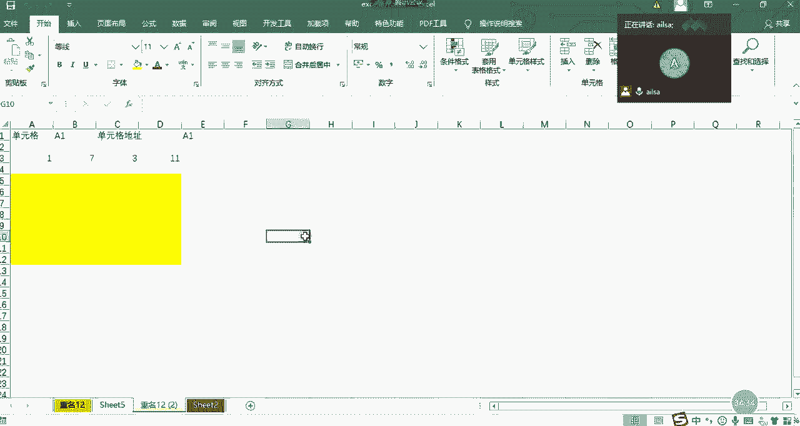

CTRL加N啊，啊我们看哎是不是建了一个新的哈，我们快捷方式后面会学哈。

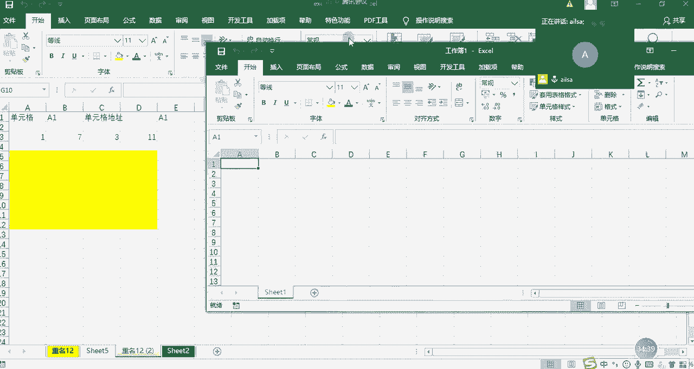

那我新建了一个之后呢，现在我想把这个工作表移动到这里。

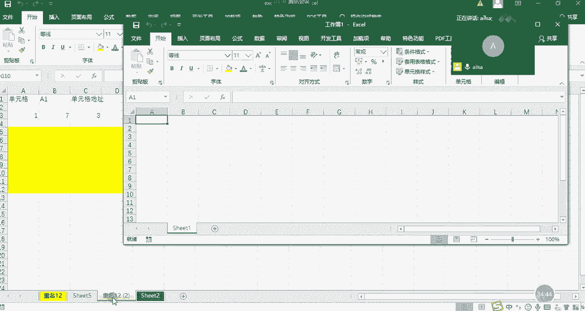

我们该怎么去操作呢，还是右击，然后选择移动和复制，选择什么呢，选择先选择我们的工作部，大家看到没有这个工作部，然后选择我们新建的这个工作部，就叫工作簿一，然后选择它，然后再选择指定的位置。

如果你想复制的话。

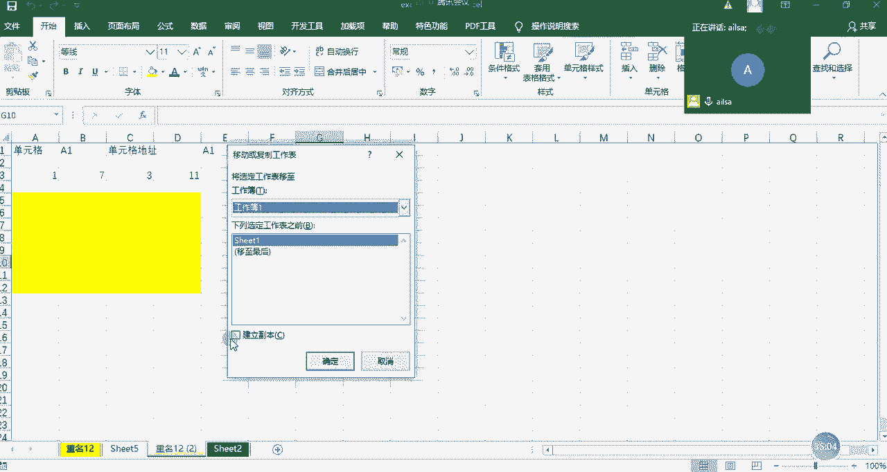

就建立副本，如果不想复制，直接移动的话就直接点击确定，大家看一下是不是就到这里来了。

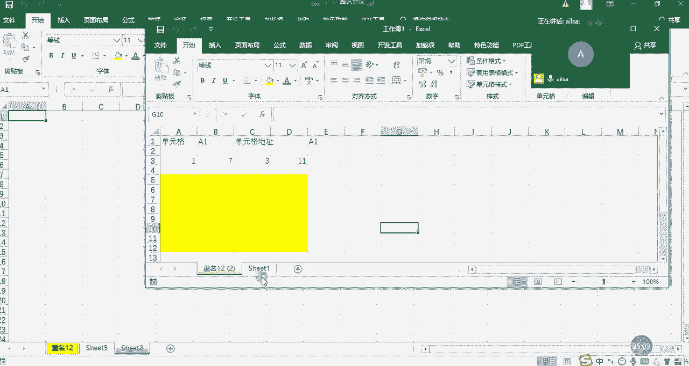

这又是不同工作部之间的一个交互，是吧啊，大家这这一块儿听明白了没有，听明白了，给我扣个一，嗯好的啊，那没有什么问题哈，那我们简单的去总结一下。

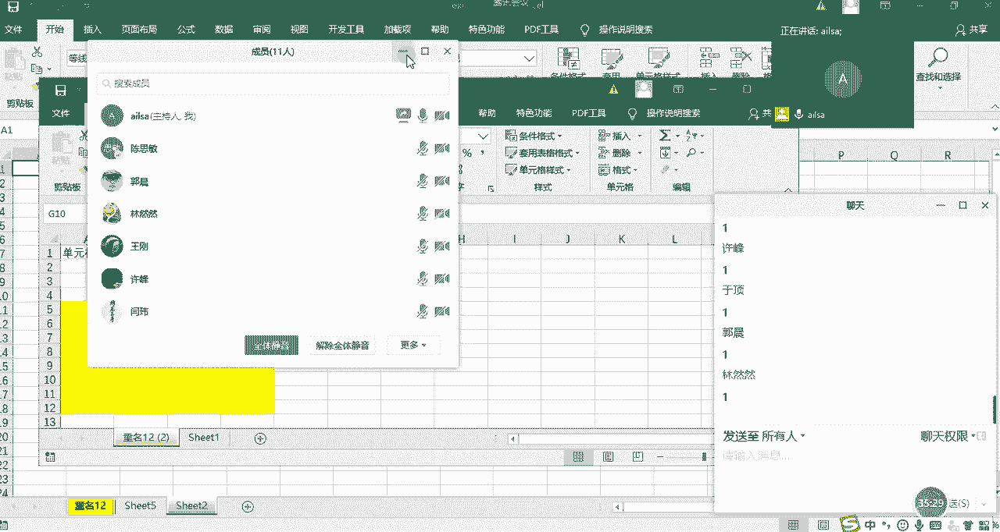

总结一下我们刚才讲的东西哈，因为我刚才没有做总结，OK我们讲了功能区，然后讲了单元格地址哈，单元格地址我们可以把它写成A1，然后还讲了我们的工作表，工作表讲了什么呢，有重命名删除对吧，还有啊移动和复制。

还有什么就是添加啊工作表颜色对吧，讲了这四个功能。

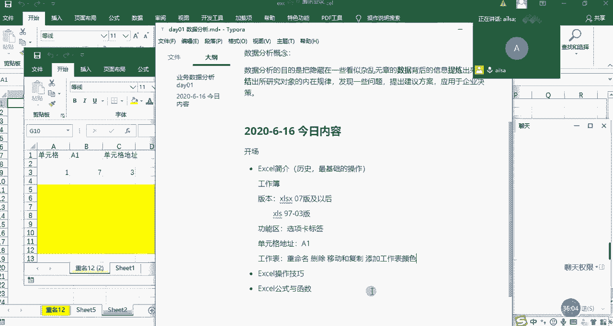

OK然后这四个功能，那接下来我再介绍一个，介绍一个我们的工作表当中的一个功能，叫什么呢，叫啊冻结和拆分窗口啊，大家可以来看一下怎么来操作的哈。

稍等一下，我喝口水。

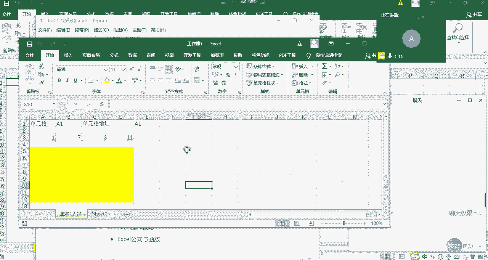

OK我们有的时候呢我们在进行嗯，整个的一个表格的设计的时候啊，那我们如果数据量比较大的时候，我们希望比如说我们很多种情况下，我们的啊我建一个新的哈，给大家说一下，我们的首行都是标题对吧标题。

然后我们的单列当中都是我们的一些分类，你比如说部门啊，部门一啊，部门二是这样的一个格式，那我们在进行这样的一个操作的过程当中呢，我们有时候数据量比较大，我们需要进行一些下拉的操作。

那在下拉的操作过程当中，有时候我们的标题就不见了，我们就不知道这一列代表什么意思，那我们就想让第一行第一行进行一个冻结，或者是第一列进行一个冻结，那我该怎么去操作呢，啊很简单哈。

我们就在我们的哈视图选项卡下面啊，这叫视图选项卡下面的冻结窗口，我们选择冻结首行，这个时候我们看到有一条啊稍微粗一点的线哈，我们再往下拉，唉我们的首行就啊冻结了啊，那我们要冻结首列该怎么去操作呢。

就是选择冻结，然后冻结首列，这个时候我们看到列方向有一条很深的线，那我在往右拖动的过程当中，我们的A列是不发生变化的，这就是冻结首行首列啊，大家大家啊了解这个就可以了，然后有的人就说老师啊。

我不想我不想冻结首行首列，我想冻结我想要的啊，我自己想拆分好的，你比如说想冻结前两行，前两列，哎这种自定义的形式能实现吗，啊当然也是可以的哈，啊难不倒老师哈啊有点像自说自话的声音，我看一下啊。

so嘎OK哈，我这个因为我在之前的啊，之前的就是给人分享的时候，别人有问到过这个问题哈，那我们讲一下该怎么去实现，唉如果你想冻结前两行和前两列的时候，我们看一下它是不是有个交叉点在这里啊。

哎这不是前两行前列的交叉点好，那我们就把鼠标定位到这里，然后点击什么呢，点击拆分，OK我们要需要把那个取消掉吗，稍等啊，把鼠标定位到这里，然后点击拆分，OK点击拆分了之后，我们看到它出现了一条很粗的线。

就是在我们的这个交叉点的左上方，出现了一个很粗的线，这是前两行前两列，这个时候我们先拆分了之后，再点击冻结窗口哈，这个时候不是冻结手环，也不是冻结手链了，就是冻结窗口，OK我们点击完了之后看到没有。

有两条很深的线，我们在往下拖动的过程当中，我们的前两行是不发生变化的，我们在往右拖动的过程当中，我们前两列也是不是发生变化的，所以说你要是想自定义冻结的话，你需要对它进行一个拆分。

那拆分的一个特点在于什么呢，只要是这个单元格的左上角的一个交叉点，它所对应的行和列都可以进行啊一个分割啊，这样的一个过程就可以实现了，嗯OK呃，动结合拆分，明白了吗，明白了，给我扣个一。

好啊我讲的都不难，对吧啊，都挺简单的，相相啊，我我我相信大家应该都听明白了，因为这对于编程而言，这简直就是小儿科哈啊啊，这就是一小小的知识啊，积累起来的，OK那工作表和工作簿以及excel的简介。

大概就是我们介绍excel就介绍到这么多了，那接下来我要给大家介绍的是介绍的是一个啊。

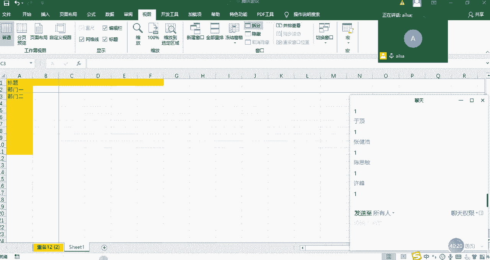

什么呢，是我们的快捷方式哈啊这个其实不用保存啊，刚才是我做例子，诶稍等一下，我打开咱们的快捷方式，我也给大家发了哈。

真的有点慢。

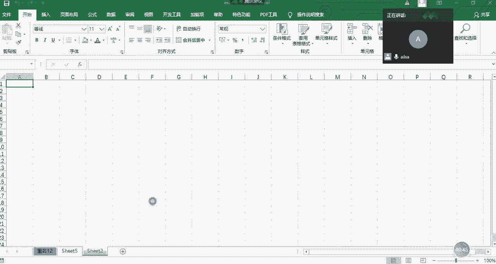

OK我们看一下我们的快捷方式，其实讲快捷方式这个东西的话还挺好玩儿的。

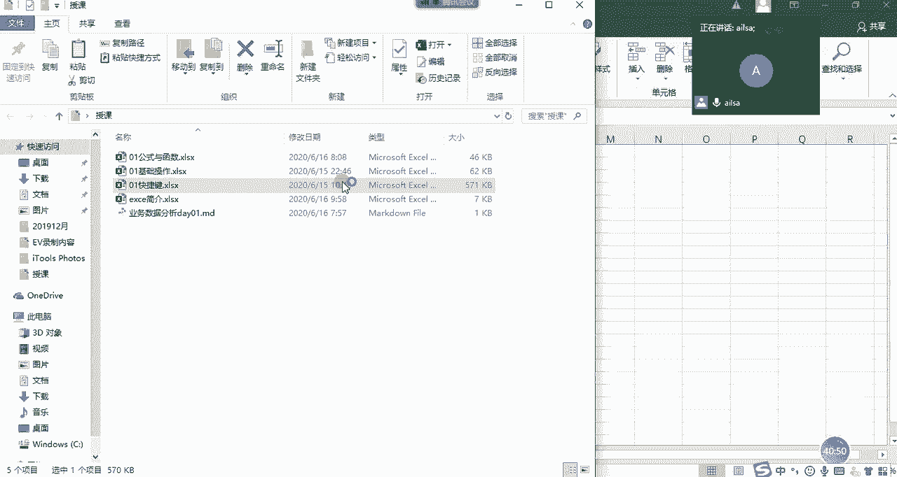

嗯就是你要是不知道呢，哎你自己就用很棒的很笨的方法去实现，但是你要是知道呢，你就觉得唉就是你要是知道。

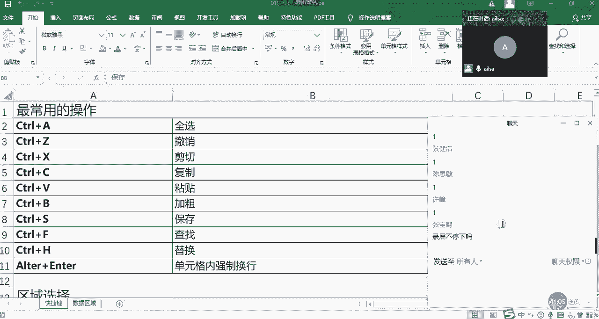