# 强推！这可能是B站最全的【Python金融量化+业务数据分析】系列课程了，保姆级教程，手把手教你学 - P35：04 快捷方式操作 - python数字游侠 - BV1FFDDYCE2g

那我们讲解快捷方式，好，快捷方式呢，这个是为了提高我们在工作当中的一个，工作效率的，如果你不知道这些快捷方式，你也可以去操作，完全没有问题啊，但是啊你要是知道的话，你的工作效率会得到一个大大的提升。

这是一个好处，那第二个好处呢就是你这个快捷方式啊，你要是会用的话，嗯然后你在某些会议上，特别是领导在的时候，哎你给他夸夸夸一点，然后人也看不出来，你键盘到底操作了什么的时候。

然后领导就会觉得我去这个员工牛啊，是不是以后有好事就得想着他，是不是就是有点炫技的那种感觉，但是但是低调而不奢华的感觉，你知道吗，因为别人确实不知道你该你是怎么去操作的，唉所以就就是很很神秘哈。

所以大家啊还是学点比较好的，就是对于我来说的话，因为我有一些操作操作习惯已经定型了，操作的次数太多了，所以在学一些快捷方式的时候就比较难学，但是你们不会因为你们操作的呃次数比较少。

你们一上来就用快捷方式，用习惯了就比较厉害了，明白吧，我们先讲最常用的快捷方式哈，最常用的快捷方式是啊，第一个全选CTRL加A啊，为什么是CTRL加A呢，啊我给大家说一下A是什么意思啊。

在英文当中A代表or，所以说是CTRL加A，它这个全选啊，有一个啊，对对对啊，CTRL加R他这个全选有一个条件啊，什么条件呢，是好必须是连续区域哈，连续区域的啊，比如说你的数据去断层了，那就不好意思啊。

连续区域你比如说我举一个最简单的例子，我在这个数据区域当中，这个数据区域当中，我们看好像没有什么不连续的，我们CTRL加AA好像都可以全选，那如果说我在这里面插入一个空行，然后我再把鼠标定位到这里。

再CTRL加A的时候，大家看一下下面的数据就啊获取不到了，也就是说它必须得是连续的，那单行的空白跟单列的空白也是一样的，我在这插入空白的一列，再CTRL加A，那这也是选取不到的啊。

那如果说有的人说哎你这是一个区域，那如果说我对于某一列当中的一个空白的，比如说我在这里面删了一个，那大家可能看不出来哈，他确实是删了哈，因为他这个比较长，啊他这个比较长，你看他是不是空的。

那这个时候我把鼠标定位到啊，定位到这个地方，然后再CTRL加A的时候啊，sorry啊，因为我想选的是单列，所以我需要把两边的都给他空出来，这个会有点宽啊，两边的这块空出来，这个时候我在鼠标定位到这里。

CTRL加A稍等，这是没啊，太狂了，这个我在CTRL加A，OK你看他这个地方的话，它就会只选择，而只选择它所不在的一个呃，区域里面的一个范围哈，所以给大家找到这个东西太多数据了，所以说啊那就是强调一点。

CTRL加A，不是说啊就直接就是所有的数据都能全选，它是在有一定的条件下哈，OK那我们接着往下讲，这是CTRL加A，必须是连续区域，那第二个的话是CTRL加Z撤销，这个大家都知道吧，嗯CTRL加Z撤销。

这个都知道哈，然后CTRL加X剪切啊，这个也不用讲哈，这个经常会使用的，CTRL加C复制，CTRL加V粘贴啊，CTRL加B加粗，这个也经常用吧，是不是啊，大家给我个响应对吧，CTRL加S保存啊。

查找再说一下，查找还在听吗啊，我看没有人响应，OK哈OK在在OK那我们这几个比较常用的，我们就就一带而过哈，我们说一下查找，查找的话是CTRL加F，那CTRL加F呢，我们调取的是查找的对话框。

它为什么是啊，呃CTRL加F为什么是查找，是因为find对吧，find查找的意思，我们在这里面输入查找的内容就可以了，嗯OK哈，那我们再接着往下讲，是CTRL加H替换，大家看到A查找和替换。

不是在一个对话框下面吗，怎么还分两个快捷方式哈，其实啊一样的哈，你比如说CTRL加H，我点击一下它出来的就是替换的啊，查找内容和替换内容，如果大家不想记，就想记一个的话就记查找完了之后，你如果想替换。

直接点到替换这里就可以了啊，明白了吧，OK我们再讲一个单元格内强制换行啊，这个有很多人好像不是特别明白哈啊，有很多人我在工作的时候，然后会有人力的人们来，他说唉我想在单元格内强制换行，怎么去操作。

我跟大家说一下什么叫单元格内强制换行，你比如说我想输入你好诶啊，这个时候如果我输入世界啊，但是我想让他们啊分两啊，分两行去操作，这时候我可以按住alt加enter，然后它就可以实现拟好事件啊。

这样的一个操作，你就是说强制给它换成两行，有的人说哎你这里面不是有自动换行吗，你为什么还要啊进行这一步操作呢，大家看一下什么叫自动换行，你比如说呃认识你们真开心，然后我们看一下。

这是它会超出这个单元格位置Y的这个地方，那我点击自动换行呢，它会根据它自定的一个宽度，进行一个适当的调整，这是叫自动换行，那强制换行就是当你没有达到这个宽度的时候，你还想让它显示两行的时候。

你需要进行的这一步的操作叫强制换行。

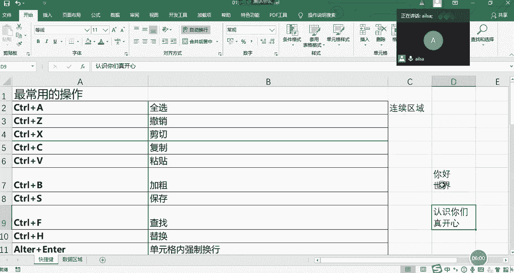

按alt加enter键来实现，好大家对于这个常用的快捷方式听明白了，没有听明白，给扣个一，45我们现在讲多久了，我们把这个快捷方式讲完吧，讲完再休息好吧，还有我的嗓子好像有点，OK那我们接着往下讲啊。

我们的区域选择啊，区域选择这个的话啊，如果说大家现在打开这excel哈，打开这excel，跟着我来操作，好吧啊，跟着我来操作，不要不要说哎我就我就听一下，我就知道了啊，要自己尝试一下。

哎好像能不能实现啊，那我们看一下区域选择，第一个是home啊，什么叫home呢，就是家的意思呗，啊，那我们看一下它是移动到工作表某一行的开头，比如说还是我们的数据区域哈，数据区域，然后把鼠标定位到这里。

这个时候我按一下home键，你看他是不是跑到这一行的开头了啊，如果说你整个很多很多个列，然后你想回到你的最左边的时候，你就可以按一下home键，哎，这样就可以实现了，这是第一个。

那第二个呢是control加home哎，我们看一下它怎么来实现的，这个用的是非常多的哈啊这个是用的非常多的，你比如说哎你看我这个数据量特别特别特别大，对不大，特别特别大，其实也不大哈。

也也就才嗯几千行而已，然后现在呢我鼠标定位到这里了，我对它进行了修改，现在我想回去，我是不是要这样去拉，这样是不是很难受，那如果说我用CTRL加home键，大家看一下，它自动回到了我的A1单元格。

也就是我家的位置，对于整个工作表而言，AA1单元格，相当于是你整个的一个工作表的出发点，所以说它称之为加，称之为home，CTRL加home是经常用的，大家这个一定要记一下。

然后CTRL加shift加home哈，这个是怎么个意思呢，我们可以来试一下，CTRL加shift，比如说我鼠标现在在这里，然后CTRL加shift再加home，大家看一下，他选中了这个位置。

到这个位置的所组合成的区域啊，这样去呃快速定位到某些区域，比如说鼠标定位到这里，CTRL加shift加home，然就实现了这这两个对角所形成的数据区域好，这是CTRL加shift加home啊。

大家的操作能实现吗，自己可以试一下啊，思敏自己能操作实现吗，没事啊，我给大家数据了，我们可以打开我们的快捷方式，可以是吧，好的啊，这个我们的会计方式一定要经常练习哈，如果但是不需要大家所有的都掌握哈。

可能你养成一些习惯就可以了，好的习惯就可以嗯，然后我们再看CTRL加shift加向下箭头，向下快速选择连续的区域，什么意思呢，就是你看我们可以看一下哈，我们这个表大概是3000多行，其实也不算太多。

但是如果说我想选择这一列的时候，我这么去拖好费劲哈，我的手指头都按的疼，那我这该怎么快速选择呢，CTRL加shift加下键，大家看一下，是不是快速选择了这一部分的数据区域。

那现在我想回到我的整个的工作表的开头，CTRL加home就回到这里了对吧，我不仅可以选择单列，我还可以选选择多列，进行一个CTRL加shift加下箭头唉，就可以实现我们所想要的一个数据区域。

现在是CTRL加啊home哈，CTRL加home啊，是的呃，回到这里，然后我们对于多行而言，是实行的是CTRL加shift加向向下箭头，什么是向下箭头，大家知道吧，点A也可以，什么意思，CTRL加A吗。

嗯向下箭头的话指的是我们小鼠标的四个键诶，向上向下，向左向右啊，这样的一个四个键啊来实现的啊，大家都知道吧，知道给我扣个一，好好的好的好的，可能是略有延迟，OK那我们再接着往下讲。

既然我向下向下的箭头可以选择向下的区域，那我们当然也可以选择向右的箭头，比如说我现在定位到这么几啊，这么几行，然后CTRL加shift加向右箭头啊，就快速选择了啊，这是有哦，稍等我看一下。

OK这个是向下是没有问题的，好我们也可以，我们也可以直接这么去选，也是可以，如果说我只想要定位到数据区域的话，我看啊，啊这里面有个空呃空列哈，因为如果有个空列的话，我们也没办法去选择它。

我们呃要选择的是连续的啊，连续的数据区也是一样的，CTRL加shift加向右的箭头，然后去选择我们连续的数据区域，而这几个都要必须是连续的，如果有某列某行有空白的话，也是定位不到的。

你包括呃就是我们CTRL加shift加向下箭头也是一样，比如说现在我把这个删掉，然后鼠标定位到这里，然后CTRL加shift加向下箭头啊，它也只会定位到这里而已啊，所以说空格还是很讨厌的哈。

我们尽量不要有空格嗯，OK啊，那我们呃选择数据区域啊，刚才已经说到了这些哈，我跟大家说啊，我们的CTRL加home啊，然后CTRL加啊，向下向右箭头，向右箭头是经常用到的啊，是经常用到的向啊不对。

向下箭头经常用到啊，向右的话倒不怎么经常用到哈，然后前后左右箭头也不怎么用到。

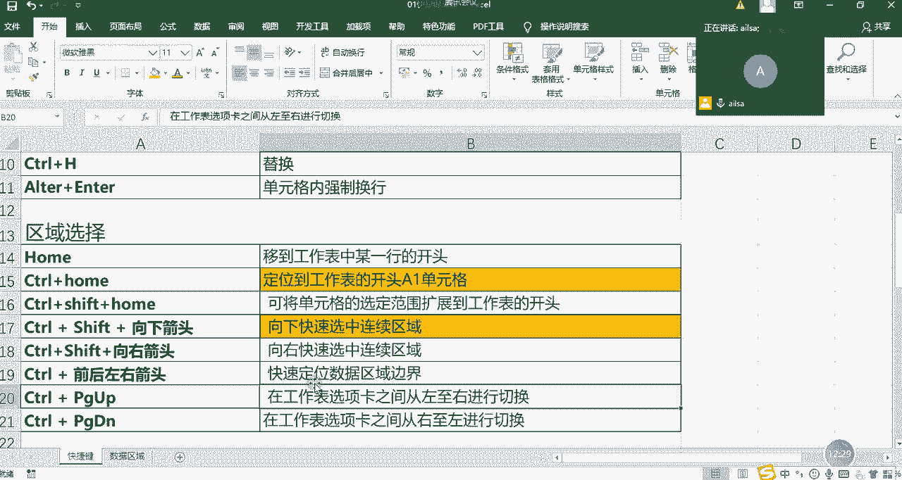

我们看一下什么叫前后左右箭头呢，比如说鼠标定位到这里，CTRL加向右箭头，它就会定位到啊我们所在区域的最右边，然后CTRL加向下箭头，就是我们连续数据区域的最啊下的一个地方，也就四个角吧，哎向下左右啊。

左啊左好到这里，然后上好到这里啊，这一个一个角的一个位置的切换好唉，那我们再看后面的CTRL加page up和CTRL加page down，这个其实是工作表之间的一个切换了。

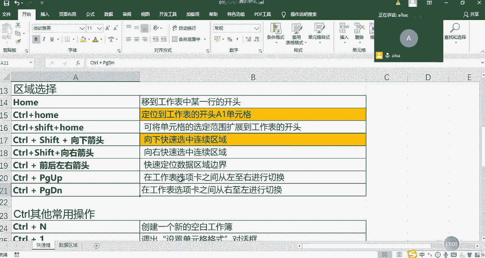

那我再多建几个哈啊。

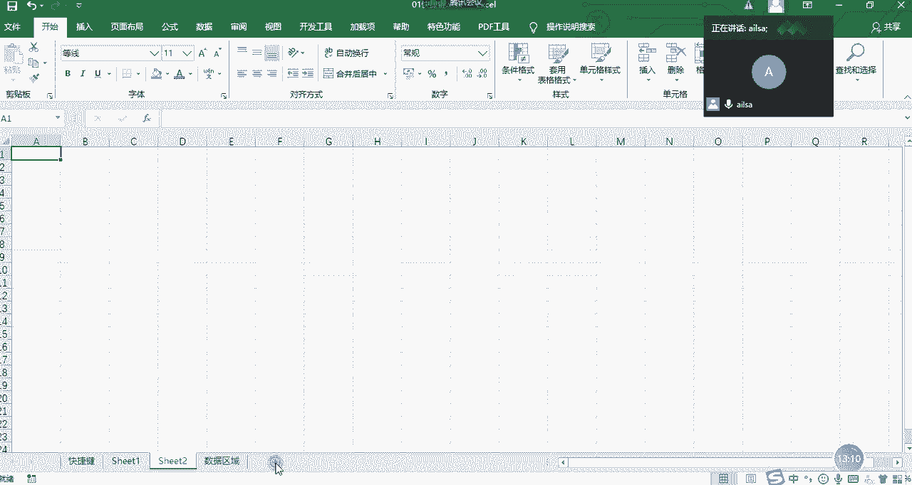

工作表之间的一个的切换，你比如说鼠标定位到这里，up是不是上啊，down是下，所以说CTRL加down诶，你看可以直接看工作表，然后加up哎，上一个上一个，如果你的工作表很多的话，你就可以这么来切换。

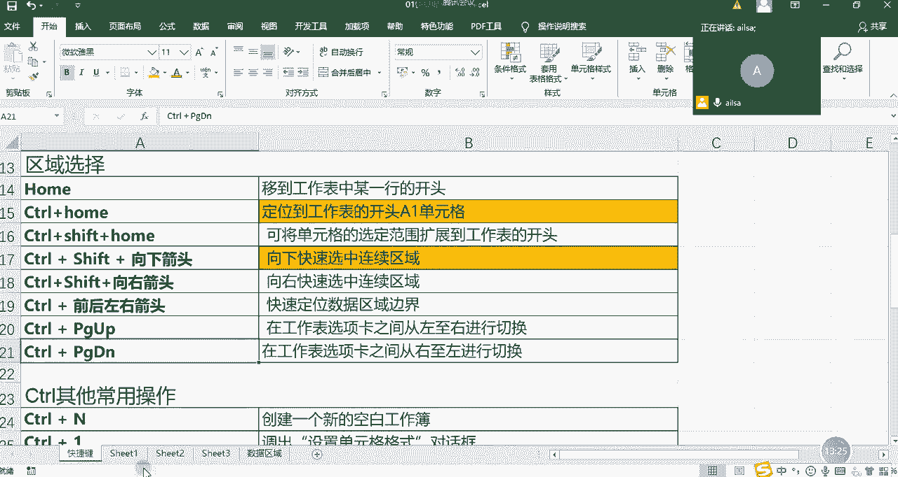

OKOK啊。

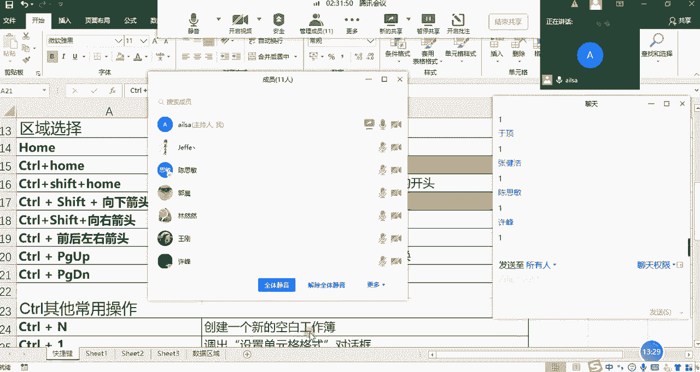

我们这是我们常用的区域的选择哈，嗯OK我们再往下走哈，往下走就是其他操作了，其他操作的话也会经常用到，我们看一下第一个CTRL加N，我刚才有没有操作，我们啊，前提是哈这有个前提。

比如说你现在没有excel程序的一个启动，就是没有任何一个excel工作簿的一个打开的话，你是不能用CTRL加N的，那我们CTRL加N是新建一个工作簿。

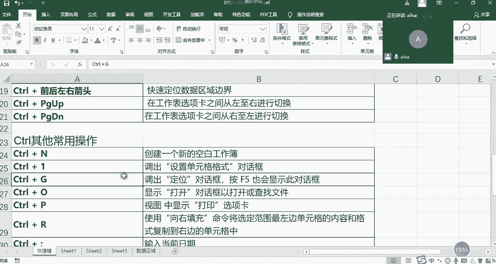

在前提是有一个工作部，在的一个情况下，我们可以直接新建一个工作部，它的命名的话是以工作部开头，后面的1234默认的一个顺序。

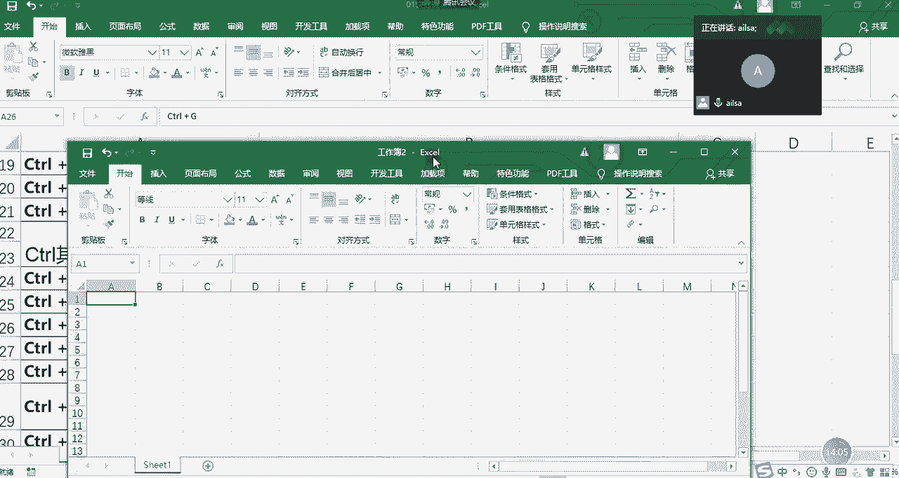

然后去命名好，这个就嗯记一下，然后CTRL加一啊，这个是我在工作当中经常用的，CTRL加N也是哈，CTRL加N啊，这个东西不知道的人还真不知道哈，啊挺逗的啊，就是你给他给人家哎。

你鼠标CTRL加N出了一个新的之后，人不知道哎，你觉得诶怎么弄出来的，哎好奇怪，是不是啊啊这个还是要学习的哈，CTRL加一的话就是设置单元格格式哈。

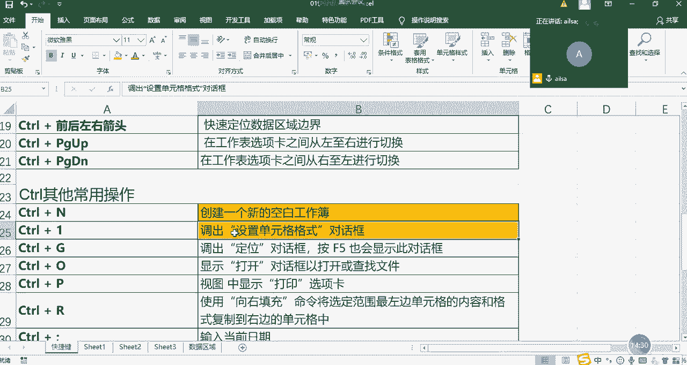

那我们看一下CTRL加一诶，调取的是设置单元格格式的一个对话框，我们经常会对单元格的一个格式啊，数字的格式，然后字体的格式还有填充的格式进行一个设置。

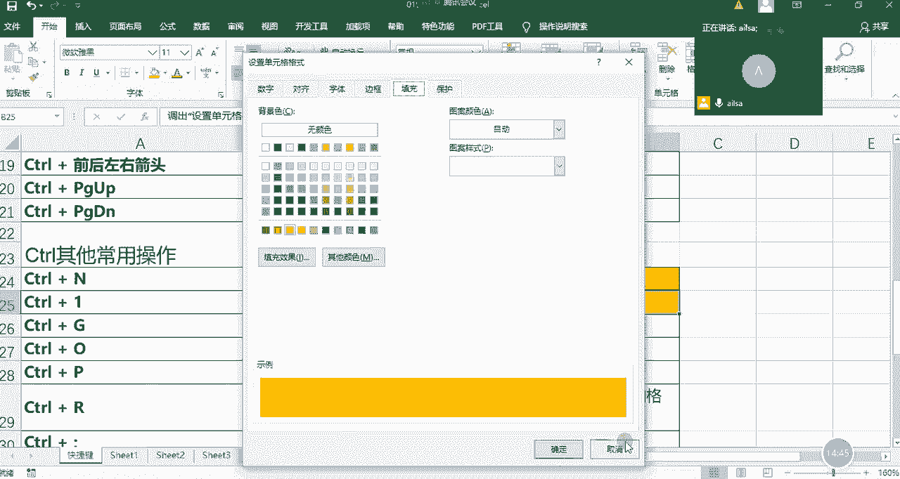

如果你不知道CTRL加一，那你怎么去设置单元格格式呢，当然也可以啦。

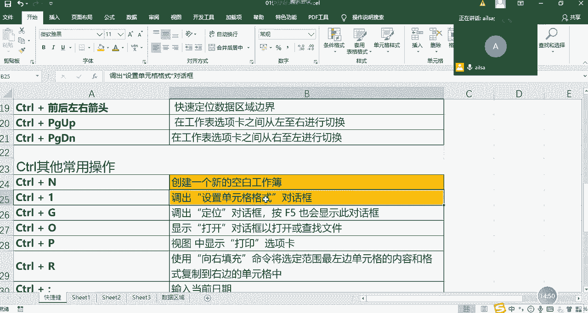

右击然后选择我们的设置，单元格格式也是一样的啊。

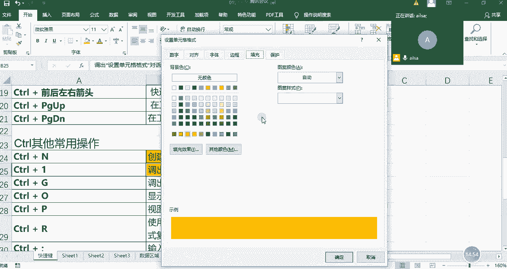

就是但是你用CTRL加一会更高额，会更高效，而且是更炫酷一些哈，然后CTRL加G啊，是定位哈，因为GPS啊代表是定位功能，定位功能也会经常用到啊，这个我们后面会讲，大家记一下，先记一下啊。

这里可以不用不用做了解，CTRL加O唉，大家看一下CTRL加o open的意思，所以是打开打开模，比如说现在我CTRL加O哎。

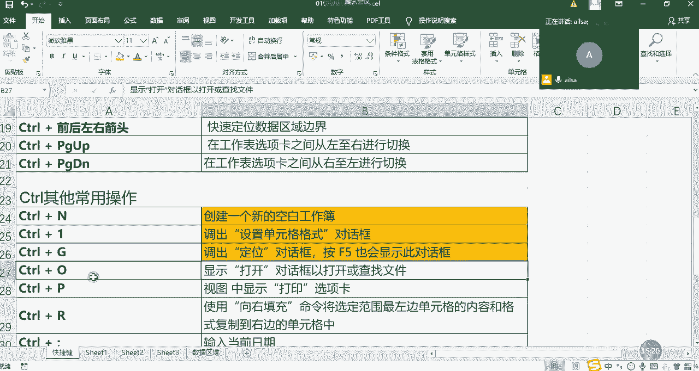

他是不是要指定我到底打开哪个工作表啊，对不对，那也比较呃，你要是不会，那也你也只能是点文件，然后打开这样的一个操作啊。

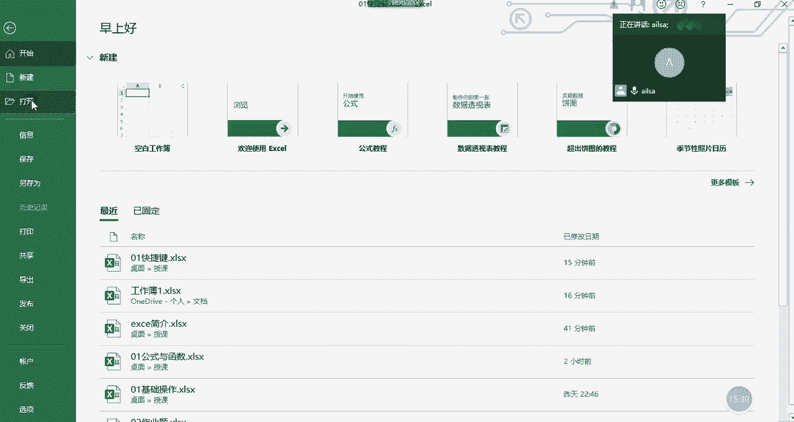

啊，其实每一个快捷方式都是都是对应有操作的哈，只是说你用快捷方式的方式去打开而已，CTRL加P是打印哎对吧，打印如果有打印机，就直接CTRL加P就可以了。

然后CTRL加R哎，我说一下CTRL加R向右填充的一个方式哈，你比如说现在我想复制这里面的内容啊，到这里的时候，我要先选中它，然后再选择后面的空白单元格，然后选择CTRL加R。

它就会把我当前第一第一个的内容在后面啊。

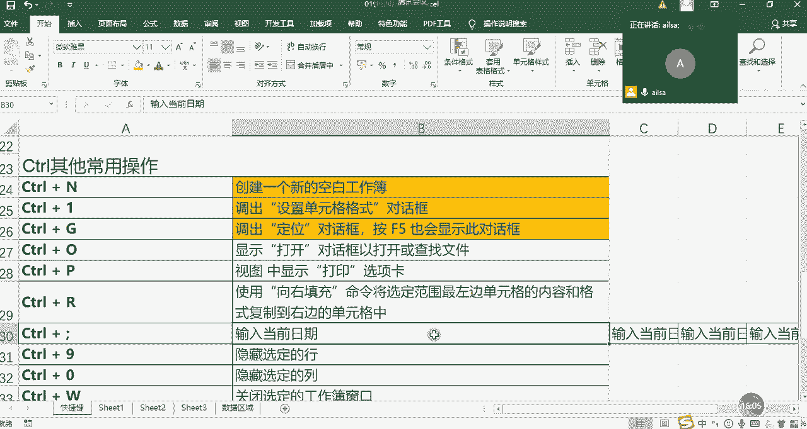

去复制这样的一个CTRL加R填充，自动填充的一个效果，那还有一个叫什么呢，还有一个叫CTRL加D唉，大家想一想，我在鼠标选择这些东西之后，CTRL加D啊，就是向下填充，D是down的意思。

R是right的意思，我向右填充和向下填充。

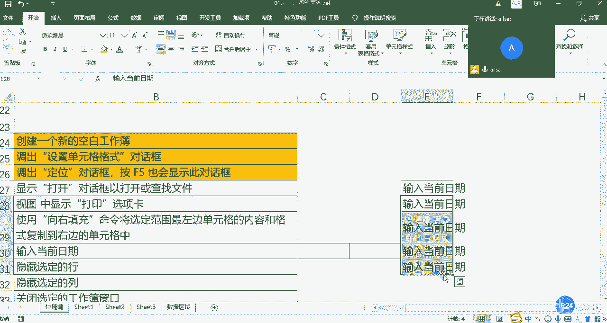

OK我们再往下走的话，就是CTRL加分号啊。

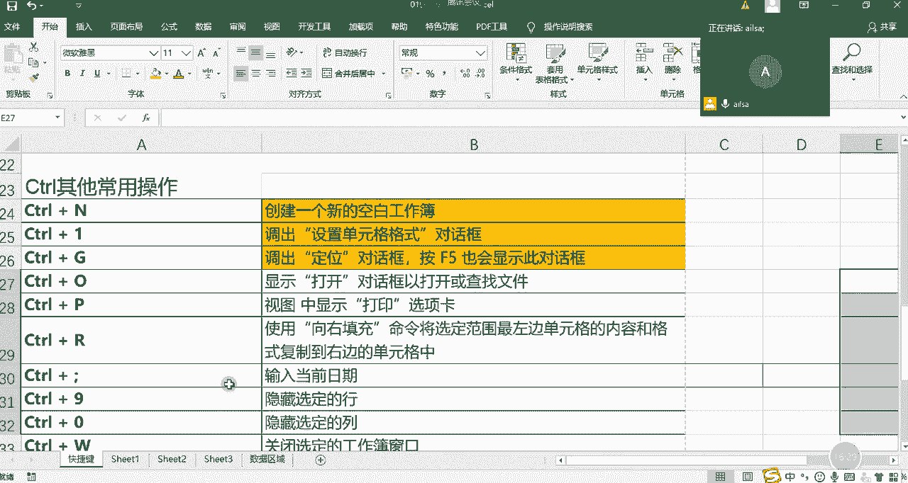

CTRL加分号，其实啊这个好像很少有人知道，唉，啊CTRL加分号就是直接就是把当前的日期啊，给它显示出来了啊。

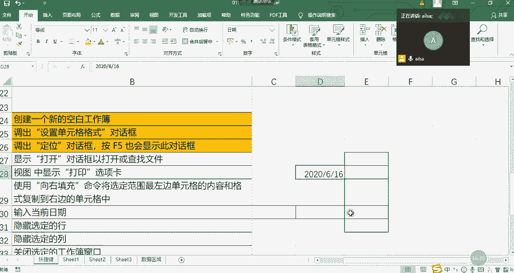

很高效哈，很快啊，好用的不多哈啊用的不多啊，然后CTRL加走隐藏当前行。

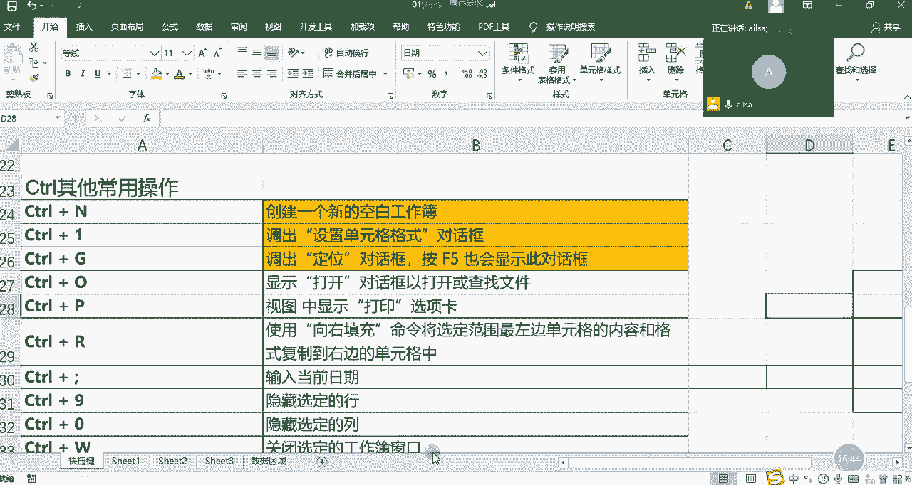

CTRL加零隐藏，选定列哈啊，那就是选定的行或列啊，整行或整列哈，这个东西大家自己回去试哈，因为这个不常用啊，真不常用哈啊，CTRL加W是关闭工作簿，我们刚才是不是打开了一个工作簿二啊。

那这个时候我CTRL加W它就关闭了，而且不提示你保存哈，所以说这个还是要慎用哈啊要慎用嗯。

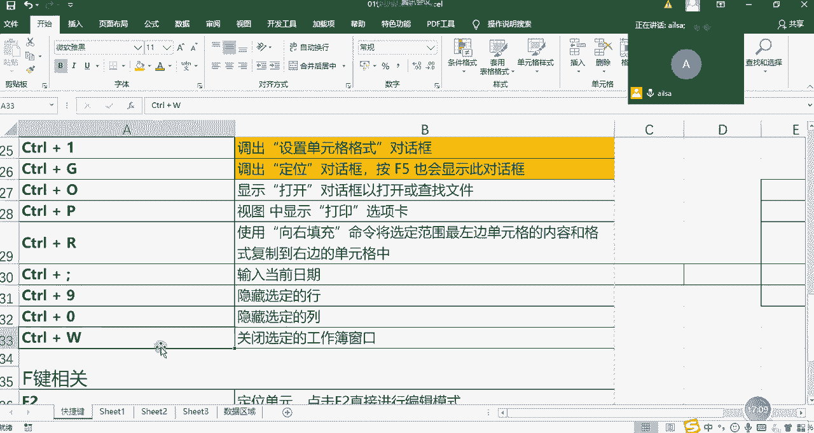

OK我们再看一下大家的一个效果哈。

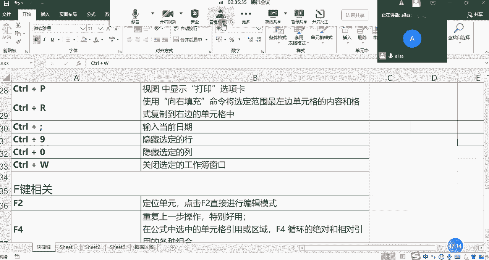

啊，大家对于刚才我讲的上面这几个快捷方式，有什么问题没有，因为这个可能比较枯燥，我就带一下嗯，Hello，没有啊，因为比较简单哈哈，OK我们最后再说一下F键F键啊，F键的话就是F2啊。

我们可以点选一下F2，可以看一下，看一下F2，啊比如说我现在鼠标在这个单元格里面，我点一下F2，唉，大家可以看到有什么变化没有，是不是我进入了编辑模式啊，我刚才是不是选错模式，你看单元格哈。

单元格现在是选中模式，然后按F2就可以编辑模式了哈，啊其实还没有双击进来快呢哈啊对啊，看你看你自己啊喜欢哪种方式吧，嗯这是F2F2定位到单元格，然后进行编辑，那F4呢唉F4很好用哈，和大家演示一下。

比如说现在我插入了一行，然后我要插入很多行啊，然后我点了一次之后，这个时候我按F4哈，control啊，CTRL加F4啊，不会啊，就直接F4哈，那大家看到没有，它会重复我上一步操作哈。

哎我我没有剪插入哈，它直接就重复了我上一步的操作，可以看出它是重复重复上一步操作哈，但是大家对于这个操作而言，不是说所有的操作他都可以重复哈，它大概是我这边大概总结出来的话。

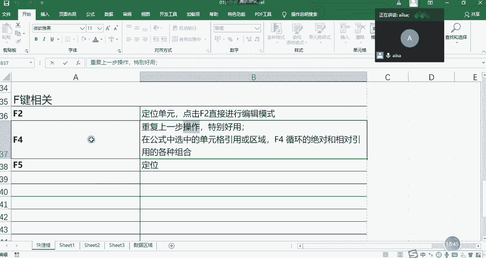

就是你对于单元格的一些啊，鼠标类似于鼠标这种操作的话。

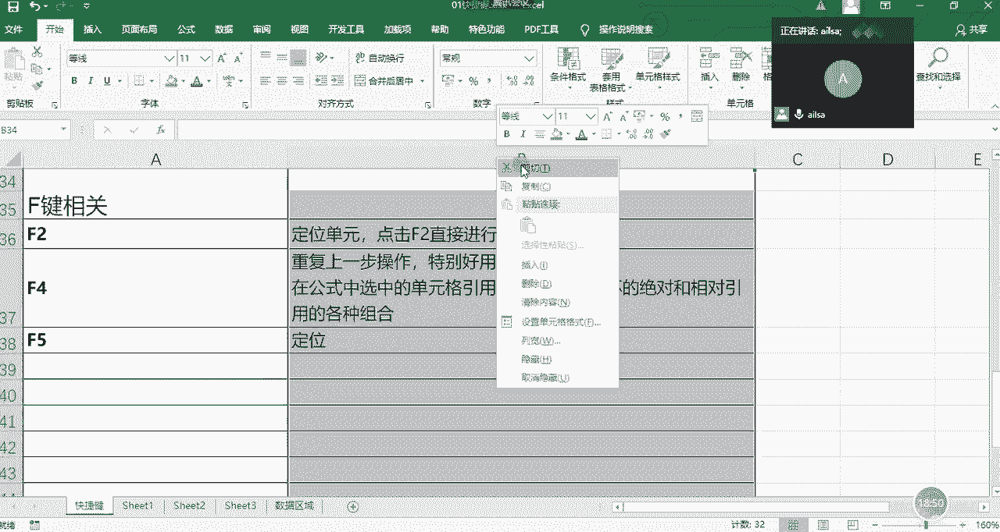

它是完全可以识别，然后重复你上一步操作的，比如说你在这里面输了，你好他是不重复的哈，他是没办法重复的，它只会针对你鼠标性的一些操作，然后进行了一些重复，OK啊F4我们在后面讲公式与函数的时候。

还会讲到它的一个循环引用的一个组合啊，也是非常高效的，F4F5大家可以看一下，F5也有定位的功能，我们刚才说啊，我再跟大家考一下哈，啊我看大家有没有听懂哈，我们刚才讲到的定位功能是怎么是什么。

除了F5之外，除了F同志们刚才讲的定位功能，除了F值F5之外，还有什么对CTRL加G哈，GPS大家一定要记住，我们记快捷方式的话，刚开始可能觉得有点懵哈，可以啊，采用自己的方案去记哈，GPS定位。

然后也可以用F5来实现都可以，OK那我们快捷方式啊就讲这么多哈啊，我们回去之后要自己去慢慢的练习去适应，你可以选择记其中的十个左右，你比如说常用的我们就不说了哈，CTRL加CCTRL加V，CTRL加X。

CTRL加Z，CTRL加B这种比较常用的我们就不说了啊，然后自己单独再记5~6个不常用的，然后基本上就能够，解决工作当中的大部分问题了啊，没必要全部记哈，没必要全部记啊，我在这边只是给你们多介绍了几种。

然后把这个删掉哈。

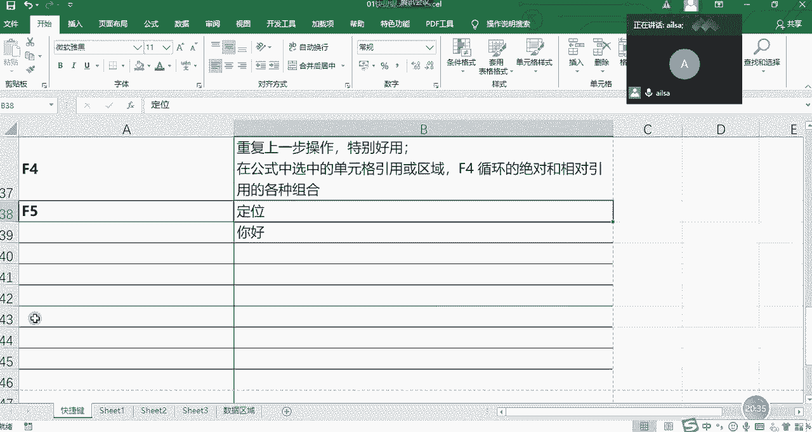

影响我的美观。

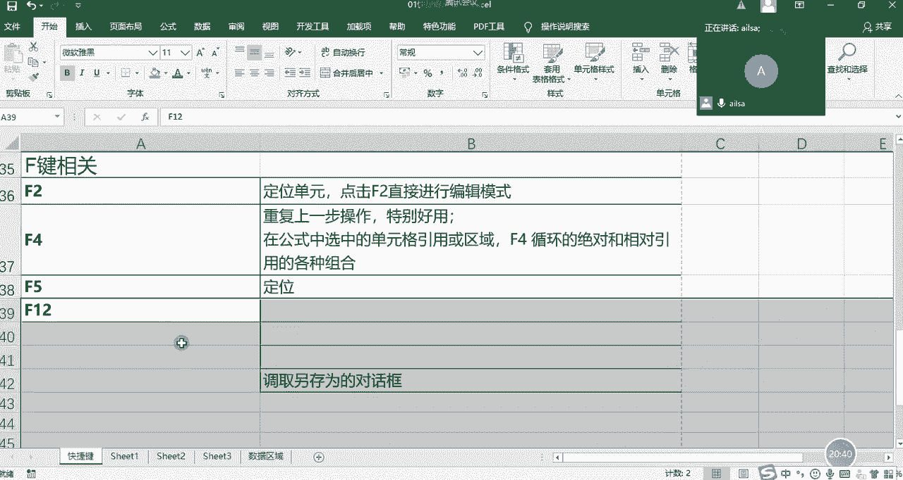

还有个F12，F12不怎么常用哈啊，调取另存为的对话框，也可以使用F12，大家看啊，调取另存为的一个对话框，自己回去，要一定要一个个试哈，一个试，那放到这里啊。

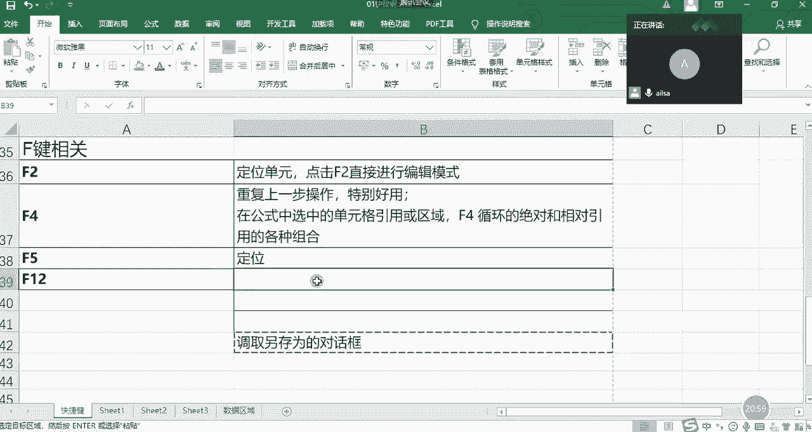

OK那我们快捷方式就讲完了哈。