# 强推！这可能是B站最全的【Python金融量化+业务数据分析】系列课程了，保姆级教程，手把手教你学 - P36：05 Excel操作技巧 - python数字游侠 - BV1FFDDYCE2g

好的，那我们接下来讲解的，就是我们的excel的操作技巧了。

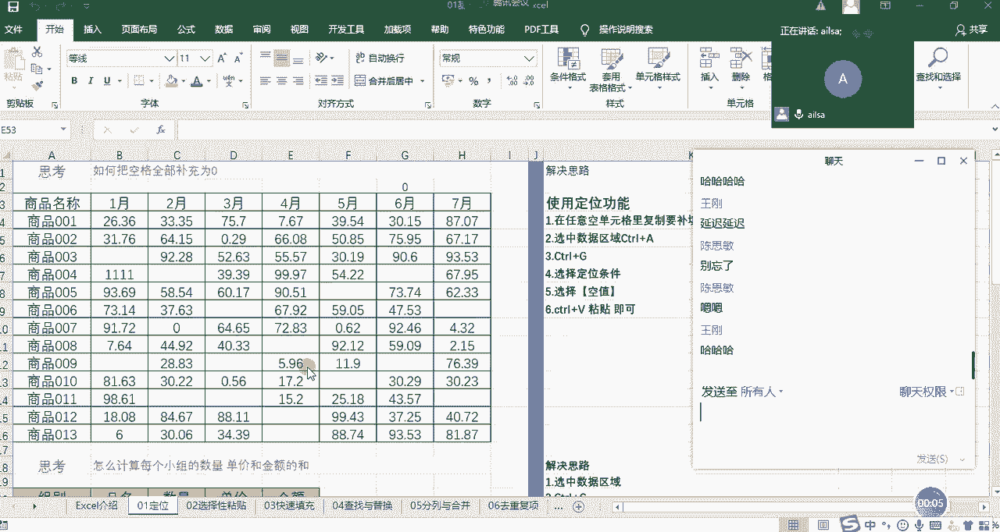

那相对于excel的简介而言，他的操作技巧就有一定的难度哈，我们先看一下，我们先看一下我们主要讲哪些东西哈，我们主要讲的操作技巧有哪些呢，有以下七个方面啊，我们尽量在上午讲完，一个是定位。

一个是选择性粘贴，快速填充，查找与替换，分裂与合并，还有去除重复项，日期时间规范啊，日期格式规范，这些呢就是在我们的工作当中哈，我们做数据分析啊，之前有一个很重要的步骤叫数据处理。

那我们在进行数据处理的过程当中，这些操作技巧都多多少少会用到，而且是经常被用到，所以说我把它总结下来，然后给大家进行一个讲解，好方便我们日后在进行数据处理的过程当中，更加的高效。

也更加的让我们的数据变得更加规范好吧，OK进入今天的主题，首先第一个我们讲的是定位功能，那我们结合一个实例哈，也不仅一个实例哈，很多个实例来给大家展示，这个功能到底是怎么来操作的。

比如说唉我们现在进入到一个业务场景当中，领导给你发了这样一张表，唉啧这张一张表看似没有什么问题，但是领导有洁癖啊，数据洁癖这个很可怕哈，他说你这个空格我看着真不爽，你给我填成零吧。

哎你接到这样的一个任务之后啊，你觉得领导嘶啊，确实是呃，反正领导让干啥就干啥吧，谁让他给我们发工资呢是吧，那我们就一个个填对吧，我们第一个思路就一个个填，这也没几个嘛，对吧啊，一会就填完了。

但是呢如果他给你发的数据量特别大啊，特别特别大，那你说你你说你一天往那一坐。

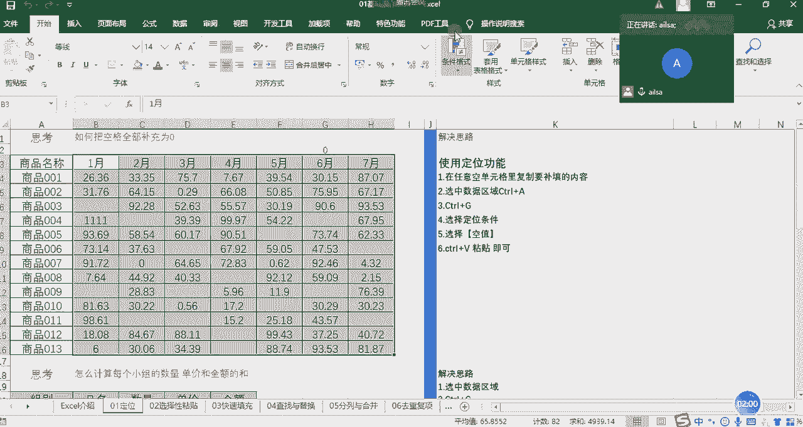

啥事不干啊，光填这个零是不是感觉啊有点啊有点麻烦哈，替换哈啊思敏说替换哈，我先给大家讲我今天要讲的功能，好吧嗯啊替换也是可以的，我今天要讲的功能不用替换就可以实现哈，怎么来实现呢。

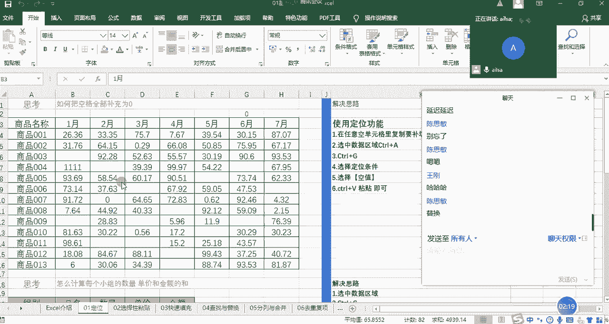

我们用定位功能看一下怎么来实现，首先第一步我们先复制一个零哈，啊先复制一个零，选择这个零，然后CTRL加C复制一个零，然后选择我们的数据区域，完了之后我们CTRL加G啊。

我们刚才讲过了CTRL加GGPS的G哈，定位功能，OK我们选择定位条件。

这里面条件有很多，我们没办法一一介绍，但是我们先说解决这道题，我们该怎么去操作，我们点击的是空值，因为这里面我们想定位到一个个的空值对吧，我们点击确定唉，然后我们发现oh妈呀，空值全部都被选中了。

对不对，选中了之后我们该怎么去操作呢，我们刚才是不是CTRL加C了，然后我们直接CTRL加V嗯，大家看一下我所有的零都被填充上了，OK我看一下大家这个听明白了没有，大家这个听明白了没有，听明白。

给我扣个一，最好自己啊操作一下哈，跟着我的思路自己操作一下，看能否操作成功哈，我给大家再操作一遍哈，操作一遍的时候，我说一下大家经常犯的一个错误哈，就是说啊我们在这先取消掉哈，哎CTRL加Z撤销。

我们复制CTRL加C了之后，然后选择我们的数据区域，CTRL加GGPSSG选择定位条件，选择空值，点击确定，这个时候哈，这个时候我的鼠标不要乱点哈，你鼠标乱点了，你这些全部都搞完了哈。

比如说现在我就是想点一下鼠标，OK啊，你这个全部都没了，所以说你还要再重新定位一下定位条件，选择空值确定，然后CTRL加V啊，这样才行，所以说我们在定位了之后，鼠标不要乱动哈，不要乱动。

你的鼠标直接CTRL加V就行了哈，我这边有详细的步骤去给大家讲解，该怎么怎么去操作。

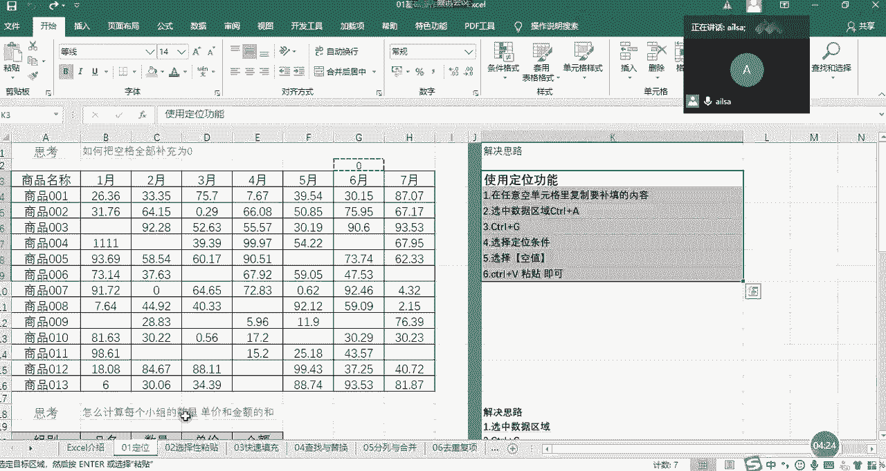

然后在我的博客当中哈，在我的知乎账号当中，我这边也有动图，然后去演示该怎么去操作，相对于啊我可以说哈我这课件做得还算啊，很详细啊，很贴心了哈，所以说啊大家手动操作一下。

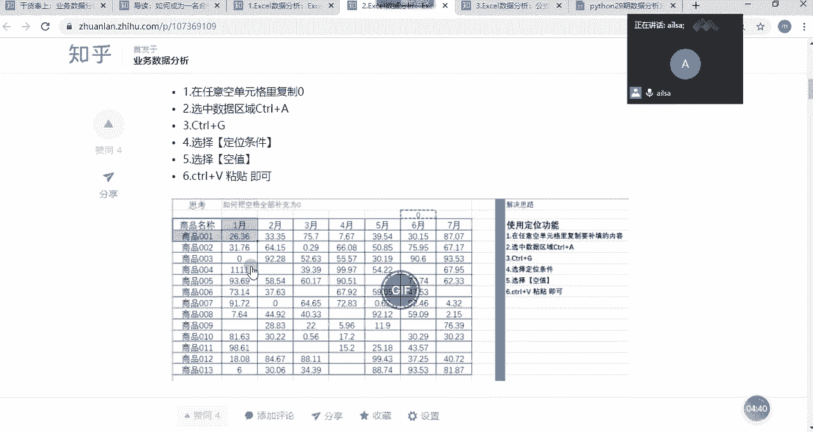

然后不会了，还可以再来看哈，OK我们再回到我们的操作界面。

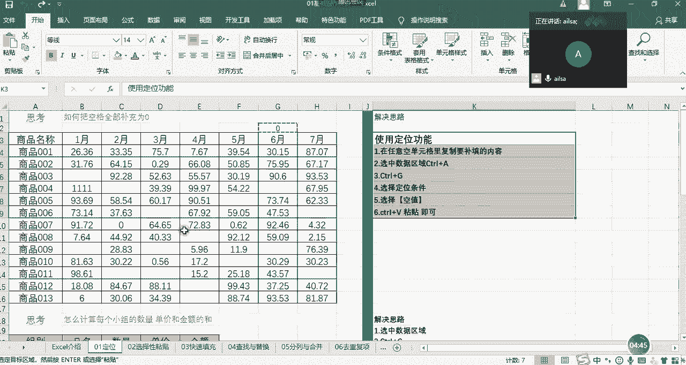

然后这个功能我就讲明白了哈，我们接着再往下来讲，哎，第二个业务场景是什么呢。

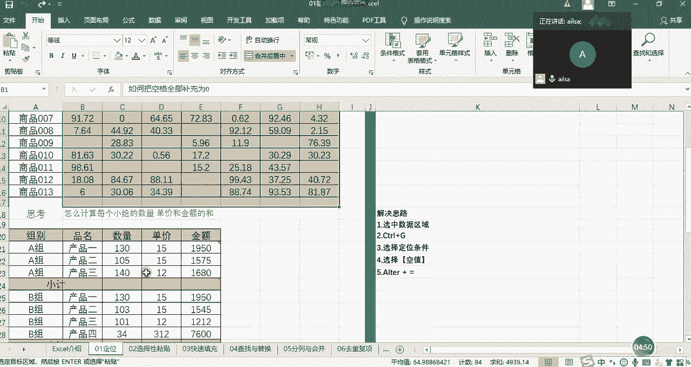

就是说他给了你一张表格，然后领导说哎呀这边有一个计算一下，每组的一个总计。

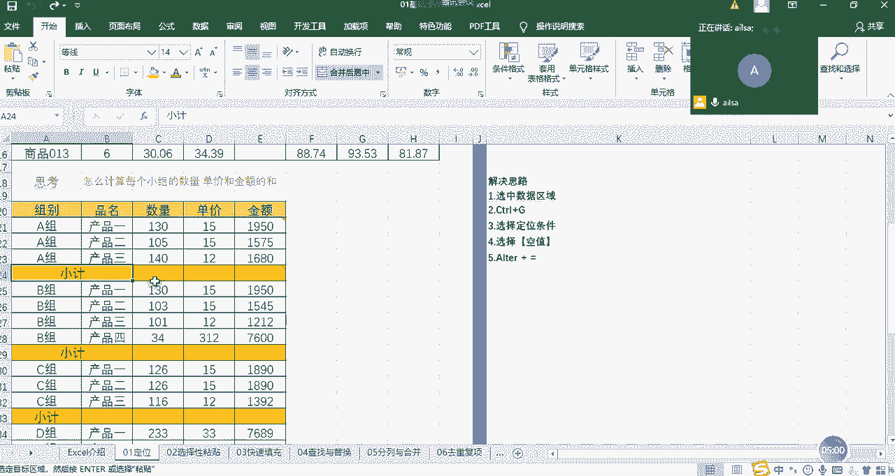

你比如说数量单价金额，你给我算个加和吧，哎你一看还加禾，好像之前啊，假设哈假设你之前学过一个学过一个函数啊，叫sum函数加和函数哈，大家都知道哈，然后啊，然后诶，我基于这个函数进行一个计算不就可以了吗。

你看我多厉害，领导给我派了一个活，我还能用到公式，哎呀妈呀，我太厉害了，这个时候你就这么去写的哈萨摩啊，然后嗯然后选我们的单引号，后面我会讲公式，在这里不想讲哈，我们选择它，然后点击啊，诶是不是实现了。

这个时候你还会你还学会了拖动，你一拖动，哎呀妈呀，全部都计算出来了，是不是，那接下来你是不是还要这样的去操作，还要这样操作，如果你这个类名，或者是你这个组别特别特别多的时候。

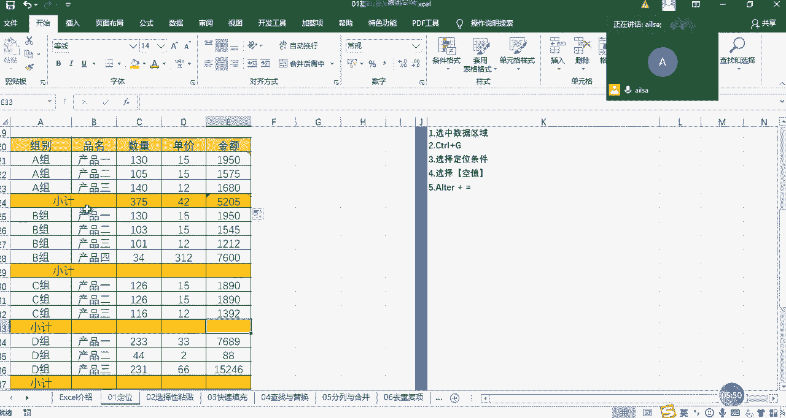

你这么去做，是不是也没有想象当中那么厉害呢。

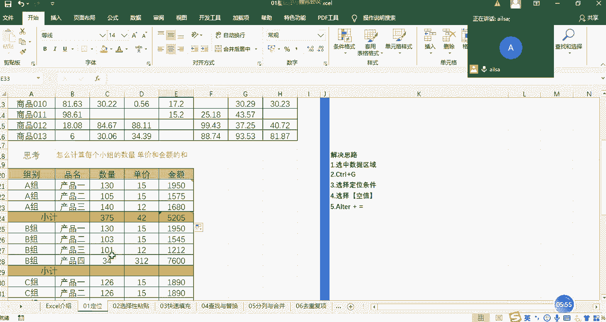

哎对我们最厉害的是一键实现，对不对，那我们也可以用定位，我们该怎么去实现呢，我们第一步还是这一步就不需要复制粘贴了哈。

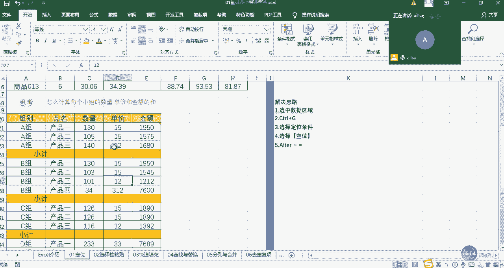

因为我们要进行一个计算了。

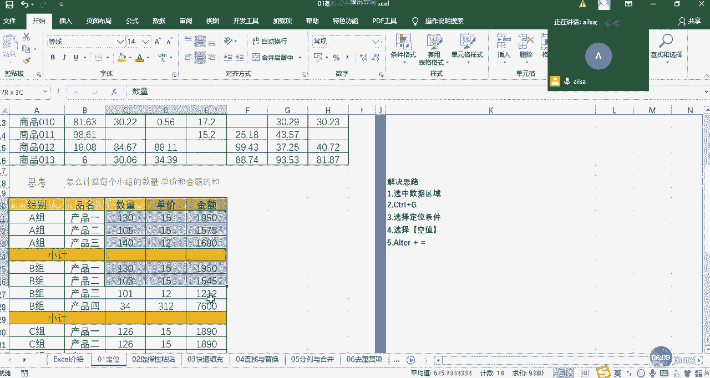

我们还是选择我们的数据区域哈，我为什么不CTRL加A呢，是因为这边有合并单元格，到时候去识别空值的时候，可能会受到一定的影响，所以我就选择这一部分数据区域，然后我再CTRL加T哼啊，选择我们的定位条件。

然后选择还是选择空值，因为我们要定位到空值，空值了之后，诶，我把这些空值选择完了之后，我是不是要对它进行一个加和的计算啊。

啊大家要知道我们excel也是啊，我刚才动了一下鼠标哈。

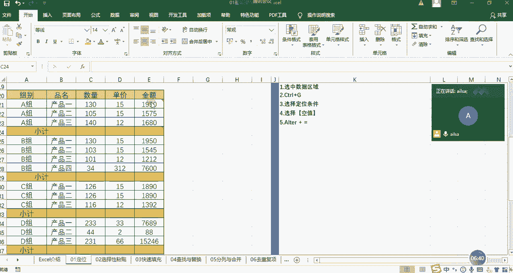

sorry ok我们重啊，我们重啊，刚才应该可以重新来的。

我们再选择一下，然后啊CTRL加TGPS定位条件，选择空值嗯，这个时候我们该怎么去操作呢，我们这边有一个自动求和，大家看一下啊，大家看到没有，它这里面有提示out加等号。

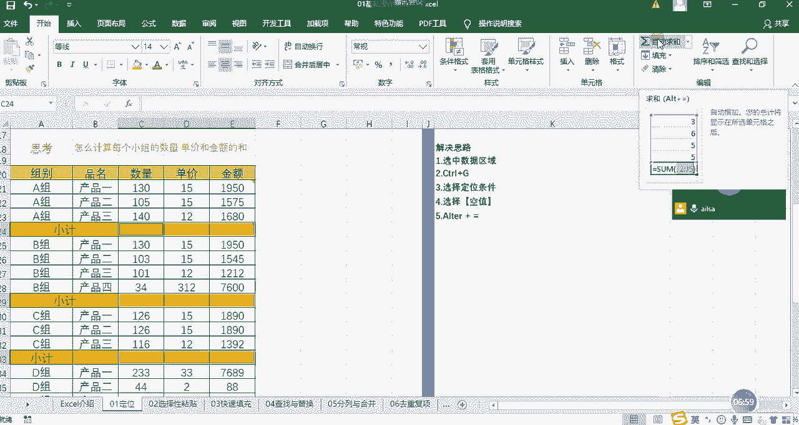

对不对，我们先选择自动求和A全部都计算出来了是吧。

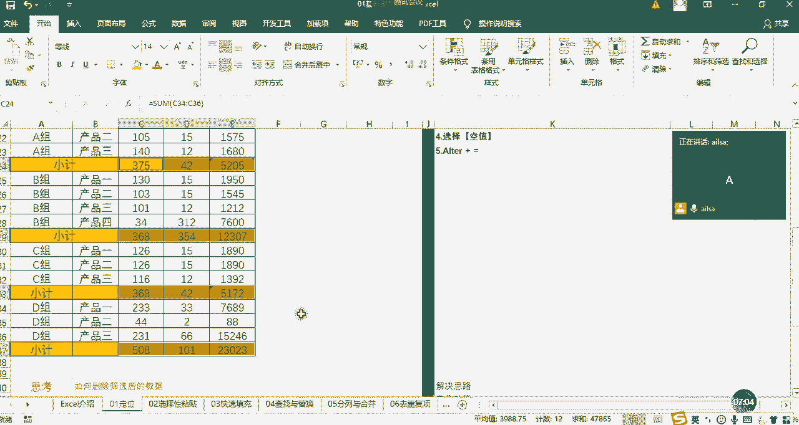

唉这就是一个啊操作技巧，那刚才既然说可以out加等号，那我们也可以输入out等号啊。

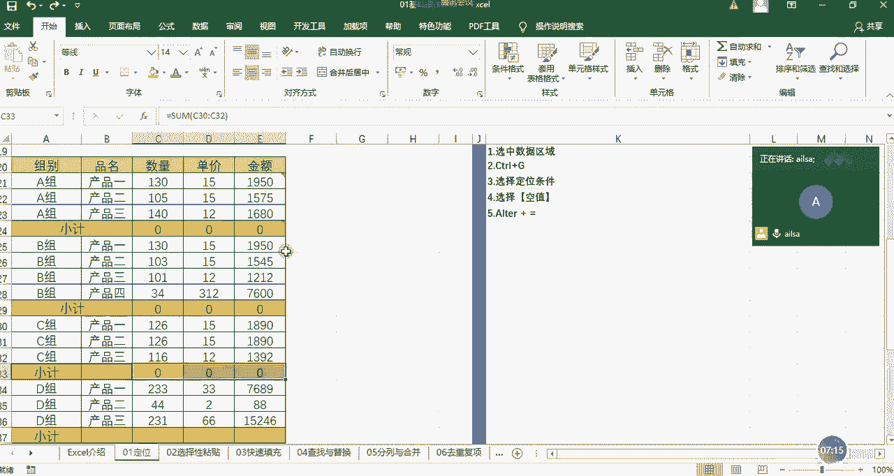

这样也可以计算出来啊，这样的一个效果，这也是我们定位的一种方式，它还可以进行一个定位到空值，进行一个快速的求和啊，这是第二个业务场景啊，OK大家这个听明白了吗，OK听明白给我扣个一好的好的。

自己私下一定要去自己去做练一练哈，不要听完就觉得简单就不练习了，OK我们接着往下看第三个业务场景，第三个业务场景啊，不需要做什么的操作是什么，就是在我在工作当中经常会遇到这样一个问题。

就是啊就是我们在进行一些数据啊，清洗的过程当中，有一些数据可能我们不想要了，比如说啊我们筛选一下这两款车型吧，唉我也不太认识哈啊这两款车型，然后现在我不要了，那我要直接进行删掉就行了。

大家可以看一下筛选功能，其实就是啊怎么着呢，就是对于某一行进行一个隐藏，你看这是47行，那48行是不是隐藏了，我还可以拉出来，大家看到没有，是不是可以拉出来啊，就它就是把它的一个行宽变成零了而已啊。

所以就是一个隐藏的功能，然后19行显示出来了，现在我要进行一个删除的过程当中，对于一些啊老版本或者是excel老版本而言的话，他有可能哈我们只能说他有可能存在这样的bug，就是你把48行也删掉了啊。

这样的一种情况，所以说我们对于删除数据的话，还是非常非常非常谨慎的，那为了保险起见，我们也可以用定位功能进行一个啊保险的操作，怎么来操作呢，就是选择这两你要删除的行，然后CTRL加G。

然后选择我们的定位条件，然后选择这个时候就不是控制了哈，这个时候选择的是可见单元格，什么意思呢，就是说呃隐藏的东西你肯定是个不可见的，那你接下来的操作就是针对可见的单元格而言。

所以我们点击确定再进行删除，它就绝对不会把你呃没有筛选到的内容给删掉，以保证你数据的一个准确性和完整性啊，这里我就不进行删除了，因为这边涉及到我写的一些东西哈，啊这个大家应该明白吧。

OK这就是我们的一个定位的操作嗯，定位操作啊，这以上三个案例都没有问题，给我扣个一，我们接着往下讲，选择性粘贴，好的好的好的，非常好啊，非常好。

大家都在认真的听课哈，选择性粘贴啊，我们看一下选择性粘贴是什么意思呢，就是说啊我在进行粘贴的时候，选择哪些格式或条件，对不对，那我们先结合第一个业务场景哈，第一个业务场景是啊，第一个业务场景是这样的哈。

唉发福利了哈，你看这个是员工的一些基本的工资啊，工资表哈，员工姓名，入职日期部门，然后基本薪资浮动薪资，应发工资，然后呃然后什么社保啊，公积金啊，税呀，最后十发工资在这，然后呢。

哎我们不是马上要放端午节了嘛，对不对，那公司说哈，你这个放那得发过节费啊，对不对，我要在你所有的工资的基础之上，每个人再多花2000块钱哦，太好了，这公司什么公司这么好，对不对。

那我要进行一个2000块钱的一个加和的时候，那其实很简单对吧，你直接让它等于，然后加两间哎不就行了吗对吧，这么简的东西，然后我再双击下来，嘿这不就实现了吗，就可以，这样也没有问题，但是我们可以不用公式。

直接用啥呢，直接用我们的操作就可以来实现，给大家演示一下怎么来实现的哈，我们为了保证我们的数据的一个核对，我们先把它选择，然后复制到这里，然后大家看一下哈，我是怎么来操作的，首先它既然是选择性粘贴。

那我肯定要复制的，对不对，那我先复制它，然后再选择我这些的数据区域，然后我右击，然后选择性粘贴，大家看这里面有很多个选项，对不对，我们不用一个个来看，我们就看要点一个加运算哈。

我们看能出现什么样的一个效果，确定A好，我所有的工资都加了2000，你看我通过啊选择性粘贴这一步操作，都能够实现数据的计算，这样的话会更加高效一些，就是选择性粘贴的其中的一个很重要的功能啊。

OK我问一下大家啊，这个在工作当中有用到过吗，经常用excel的人啊，王刚这个你用过没有，王刚同学没是吗，思敏同学，OK好啊，这个其实我不是说它有多么高效哈，这是其中的一个操作技巧啊，什么叫技巧呢。

就是说啊绕过常规的方式，然后采用比较高效的方法，然后去实现你所想要的效果啊，啊不叫投机取巧哈啊对，然后所以说你没有用过也没有关系，如果你觉得好用，你就用，如果你觉得还没有你之前操作的操作的。

那种方式好用呢，那你就采用你之前那种方式就可以了，我给你给大家说exx x excel的操作方式有很多，没有好坏之分啊，也也有可能在某些效率上会存在一些问题，但是啊但是如果数据量不是特别大的话。

都差不多啊，好嘞，那我再接着往下讲哈，接着往下讲，我们第二个啊，第二个选择性粘贴的一个呃呃嗯的场景啊，就是我们可以看到这里面啊啊看一下哈，我们可以看到这里面的有一些很多的一些计算，对不对。

那我们如果说想去除里面的公式的话，比如说我刚才在这里每一个人加了2000块钱啊。

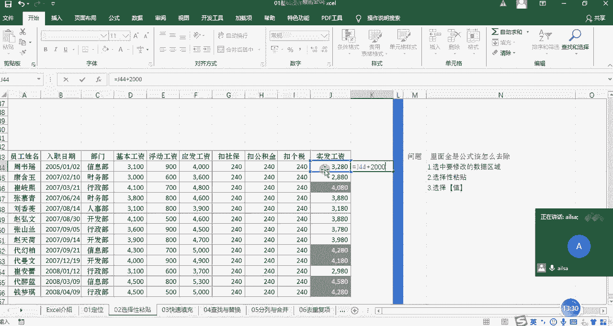

这个时候哎我们看一下哈，加了2000块钱，这是我的最终工资，对不对，这是我的最终工资啊，然后现在你把这个数据呢要发给老板，但是老板才不关心你这个啊，这这么多一堆的东西到底都有啥呢，是不是，那怎么办呢。

你需要对他进行一个数据的一个整理啊，比如说老板说我就看一下最终工资哎就可以了，那你需要把前面所有的数据都怎么着啊，都删掉，结果你一删除，发现你的最终工资报错了，为什么呢。

因为你在这里面进行了单元格的引用，对不对，那你引用这个单元格，如果你把这个单元格删掉了，它就没有值了，那个数据当然也就错了，所以说我们在进行一个公式的操作的过程当中，我们一般情况下要进行一个公式的去除。

然后让它保留最终的值，那该怎么去操作呢，也就是说就是我们的选择性粘贴，CTRL加C，然后右击选择什么呢，可以直接选择这个值是一样的，我们也可以点选选择性粘贴，选择数值，然后点击确定。

这个时候我们看一下里面啊，在这看哈，大家有些人不知道说哎你怎么看里面有公式的，我们在第一节课讲的时候，就说这里面显示的是它实际的值，那这个时候我再进行删除啊，我们看一下啊。

是不是就达到我们所想要的效果了，这也是选择性粘贴，然后比较常用的一个功能啊，我们可以看一下选择性粘贴好，首先得复制哈，不然你怎么选择性粘贴，这边有啊，就是粘贴原格式，粘贴值，粘贴公式，然后还有转制啊。

还有我们的格式，然后呃真题链接，这个我们就不一一详细的去讲，然后大家可以自己私下的去啊练习一下，你比如说你比如说我现在选择了部门和工资啊，应该选择人啊和工资，现在我对它进行一个转制。

我们可以看一下达到什么样的效果啊，转制哎，大家看一下它是不是就从竖排变成横排了，这就是一个格式的转换啊。

OK嗯那我们看一下选择性粘贴啊，大家有什么问题没有，OK没有问题给我扣个一，好的啊，那我们接着往下来讲就是快速填充，让我们看一下什么叫快速填充呢，就是我们excel我们都知道进行一个数据的录入。

处理等等这些操作的，对不对，那我在录入的过程当中，我该如何去提高它的录入效率呢，你比如说你这边要录入一个序号一呀，234哎，一个录入是不是特别麻烦，那怎么着呢，有的人说哎呀你往下拖不就完了嘛，对不对。

填充序列哎，你看是不是就可以实现了，我去好高效啊，啊，如果说对于一个啊呃假设哈，对于对于一个从来都没有接触过excel，的人而言的话，他觉得这个功能实在是太厉害了啊，其实一点啊一点技术含量都没有哈。

哈因为啊它就是一个啊，它本身就是一个智能的电子表格，它肯定在某些方面会给你做的比较智能一些哈，所以说这叫自动填充哈，我们没必要一个一个去填，然后它不仅仅可以填充连续的数字，它还可以填充等差数列。

你比如说2468十，2468十，我该怎么去填充呢，他这个时候就不能单独输入一个，单元格的内容了，它需要输入两个，然后再进行下拉，大家看一下两个内容之后，诶，我什么时候下拉呢，有的人就会问。

这个时候大家看我的鼠标哈，看我的鼠标，然后在鼠标移动到我的右下角的时候，出现的是一个从空啊，从空心变成实心了，对不对，17的双十字啊，十字然后往下拖动啊，大家看一下，2468十也就出现了我们的等差数列。

那对于数值是这样，对于日期也是一样，比如说我输入了一个日期，我在往下拖动的过程当中，它也会发生相应的变化，那有的人就问你，这个它能识别出来是每个月有多少天吗，啊，当然能了，它是根据系统来自动生成的。

看到没有，3月1号二号三号这样就可以了，OK啊看一下大家的一个状态，OK啊，那我们再想一下，我们想一下一个问题哈，嗯啊那为什么这个excel能实现自动填充的功能，我们知道了数字，我们知道了日期。

它能填充等差数列等等这些，那它什么都能填充填充吗，啊那我们比如说我们现在举个例子，我们都知道姓氏哈，张王李赵他能不能填充，我们试试啊，张啊我们看一下诶，他能填充张王李赵诶，哎这人太厉害了啊。

这词太厉害了啊，现在哈我给你们啊做一个任务哈，你们自己在自己电脑上试一下，能否填充为张王李赵，也就是输入了章之后往下拖动，看能否出现张王李赵啊，大家现在进行操作一下，好如果说可以的话，给我扣个一好。

我等大家一分钟，哇一堆章是吗，不能是吗，不能思敏可以吗，好OK大家想一想，为什么不能呢，为什么我的电脑就比你的电脑要智能一些呢，啊其实我们要你看我们在学任何东西的时候啊，都要想到一个原理。

它这个它这个是怎么智能来实现的，其实它没有大家想象的那么高大上，它其实就是在就是在后台设置的，那我这个张王李赵，对我这个张王李赵是怎么出来的呢，就是它有一个自定义的一个列表，我们有一些是它设置好的。

有一些是如果说你根据你自己的一些需要，你也可以进行一个自定义，那我们看一下它在哪里哈。

首先点击文件啊，我操作慢一些哈，点击文件，然后点击我们的选项。

好在我们的高级里面，然后拉到最下面有一个编辑自定义列表，大家找到没有好。

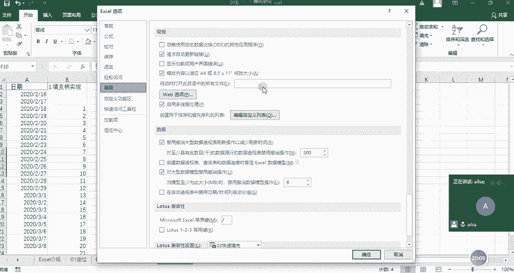

我点击面慢一些哈啊找到了给我扣个一，我们接着往下走啊，这一步操作要跟着我来，找到了吗，高级下面的一个自定义列表，要拉到最下面才能看到，啊找到了扣个一好的，那我们点进来啊。

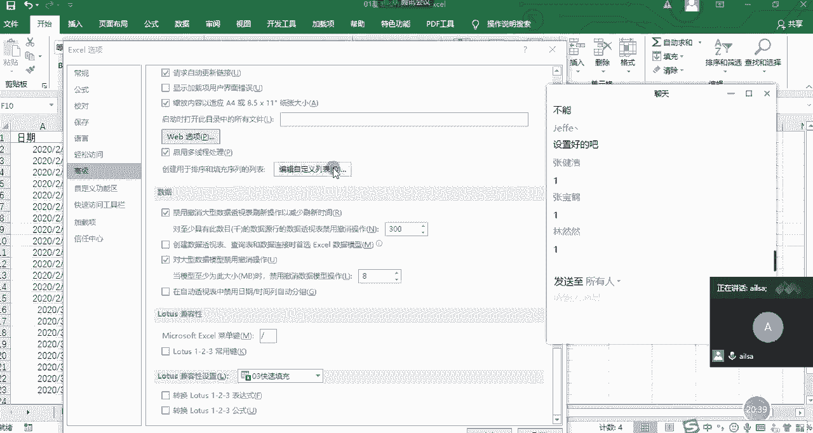

点进来之后大家看到没有，oh my god啊，这里面就是他们定义好的一些东西，大家看到我的张王李赵没有啊，我还定义了部门一部门二部门三，哎这就是我自己自定义好的，那如果说你在工作当中经常会嗯。

用到你一些自定义的东西的时候，你就可以在这里面去设置了，是不是可以提高你的工作效率哈，当然了，如果领导不知道，你给他一展示，他还觉得哎绝了哈，我这个员工招对了哈，我们先删除它，先看一下怎么来实现的哈。

哎我们先学一下怎么来实现的，首先我的鼠标先定位到一个新序列，先选中它，然后在这个新序列当中我输入我所想要的效果，那比如说是张I王李赵啊，大家跟着我设置哈，唉，我们可以看到我们的格式是不是呃。

每一个分类都是占一行啊，这样一个一列排下来的，这样子我们输完了之后点击添加诶，看到就有了，对不对，然后就有了之后啊，哦我们这个时候点击确定，大家也点击确定啊，在这里也点击确定。

然后你们再试一下张王李赵可不可以实现，嗯如果说可以实现的话，你就再扣个一给我，我再接着往下讲，可以了是吧，那就说明其实我们只要在后台设置了什么，然后他就可以实现相应的操作了对吧，那我们再接着往下看哈。

我没讲完啊。

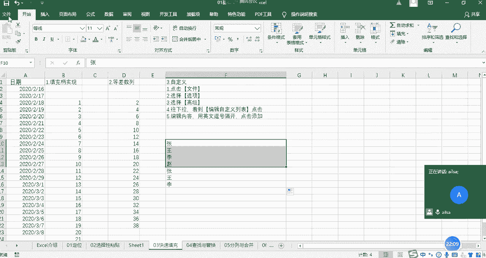

我们的选项，然后我们的高级啊，在我们的拉到最下面。

然后编辑自定义列表，然后我们刚才编辑的是这样的一个形式，那我们还可以怎么去编辑呢，我们还可以比如说我以部门一部门二为例哈，部门一，然后我们可以以英文逗号隔开啊，这样的一个编辑哈，部门一部门二啊。

逗号隔开，部门三逗号隔开啊，这样的部门我们四把逗号隔开，就是英文状态下的逗号去隔开，点击添加它也是一样的，你看我这边啊，输了之后，它就会自动变成一呃呃，就是每一行每一行这样子，反正就是就是另外一种方式。

你自己怎么输入舒服，你就选择怎样的一个形式就可以了，我们再点击确定，然后我这边也验证一下我刚才输入的部门，我们一啊，我们一，再往下拖动哎就是有了对吧，就是我们所想要的一个效果。

这就是这就是这就是我们整个的一个呃，自动填充的啊，快速填充的这样的一个效果，可能很多人知道唉，我前面可以这么去操作，但是却没有人去研究过A，它到底是怎么来实现的，明白了吧。

OK哈因为这个是大家跟着我去操作的，相信每个人都会了哈，我们接着往下走，是查找和替换嗯。

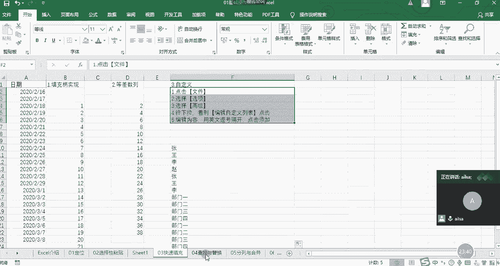

查找和替换呢主要是啊，其实这个功能啊怎么说呢，我们不管在哪个软件当中都有查找和替换，那接下来我讲excel当中，就是我们的数据量比较大的时候，我们在进行额数据的呃，呃呃数据的一些呃处理的过程当中呢。

我们需要用到啊，查找和替换这样的一个功能来啊，我们先看查找查找的快捷方式是什么呀，查找的快捷方式，OK现在我考一下啊，OKCTRL加F哈，大家说说整个的一个答案的时候，一定要加control啊。

你光一个F键是实现不了的，对不对，CTRL加F嗯，然后我们那我再考察一下哈啊啊，替换替换的快捷方式，okay i大家知道怎么去记这个替换吗，就是你看CTRL加FF是查找的意思。

那CTRL加这CTRL加H呢就是换啊，换的意思啊，就是中英文一定要结合哈啊，对我一直嗯，我也不知道他这个他这个英文到底是什么哈，但是觉得从换的角度去理解的话，好像更简单一些嗯，OK那我们说完了快捷方式。

我们接着往下说怎么去操作，首先这个的一个CTRL加F，我们先看第一个例子，怎么查找姓名的员工啊，首先呢我们整个的一个啊查找默认是模糊查找，什么意思呢，只要代理的单元格它都会被找到。

比如说现在我输入了一个理查找，全部大家看到没有，我们的纸里面只要带理的啊，只要在理的都会被找到啊，都会被找到，这是一个查找很简单的一个东西，那呃你比如说你要查找叫什么李诗的，哎，我们再精确一些，李师。

诗歌OK李师的，然后我们看查找全部哎，是不是他的李师和李师师啊，也就是他就是默认的是模糊查找，如果说你想精确查找，当然也可以啊，对吧啊，那我们可以选择选项诶，这里没有区分大小写单元格匹配啊。

区分全角半角，这个不倒不怎么用，我们就选择区分单元啊，单元格匹配就可以了，我们再点选查找全部，这个时候只查找到理事的内容，对不对，这个是我们的模糊查找和精确查找嗯，那这个查找的是值对吧。

那下面有的人就说唉。

比如说我这里面有一个啊黄色背景，红色字体的一个东西哈，假设哈我这边给大家简单举个例子，那现在我想查找这种特殊格式的啊，这个内容我该怎么去查找呢，唉这个我们也可是可以的哈。

啊那就是在这个我们看这设定格式哈，我们先把选项取消掉，然后我们再点击选项，这就有格式，格式的话，你就选择你想要的格式进行一个查找就可以了，当然了我们内容要取消掉，然后格式的选择有两种方式。

第一种是直接点选格式，就是你设置它的填充为黄色，字体为红色这样一种形式。

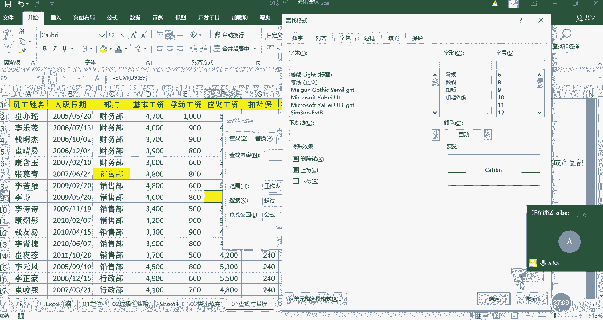

那还有一种形式就比较简单了，既然你这个格式是从单元格里面去查找的，那你就可以从单元格里面选择你要查找的格式，选择它诶，是不是我们可以看一下是不是黄色背景，红色字体，然后我们再点选查找，全部就查找到了哈。

我们把单元格匹配取消掉之后，查找全部啊，我只查到一个查找到一个，黄色啊，黄色背景我再次试一下啊，红色字体一样的哦，因为它是数值啊，因为它是数值格式，可能是因为这样的一个原因造成的哈。

嗯如果说我们不不选择这个东西的话，我们再从这个格式去设置的话，看一下填充数字啊，它这边才能是自定义的这种格式了，因为他这边啊有一个千位分隔符，比如说我们选常规呢，点确定好。

再点击查找全部，无法查到内容哦好吧，我们私下再去试一下吧，啊这种格式的选择我们可能有两种，它两种是不一样的，因为所以说才会出现这样的一个问题，现在我再进行最后尝试，最后一步操作格式刷一下啊。

看他能否啊查找到哈，应该刷的是它，OK我们再试最后一次CTRL加F，然后格式我们选择我们的单元格格式，选择这个，然后进行查全部，它是不是就查找出来了，查了几个看一下，OK3个就是我们的数值开导出来了啊。

说明这个销售部跟他不是一个，跟它不是一个格式啊，这样的一个形式，OK那我们再接着往下走，这是我们的格式的查找，那既然查找是这样子的，那我们看一下替换是什么样子的啊。

那在这里我们可以看到我们再一次跳调出来，我们这个查找的一个对话框的时候，它还是保留着原来的一种形式，对不对，那我们需要把它的清除查找格式才可以清除它，也就是说我们在学任何东西的时候。

你都要知道你该怎么去设置，你该怎么去清除啊，你该怎么去新增，你该怎么去删除这样的一个功能，肯定都要学全的哈，OK那我们看一下替换啊，这个就简单了哈，替换啊，我们把这个取消掉啊。

替换比如说我们把销售部替换成产品部哈，那我们看一下哈，销售部替换成产品部，我们在替换之前，为了保险起见哈，保险起见，我们先查找全部看一下，我们看一下我们查找的内容诶，好像有点问题哈，它这个东西的话。

其实我们不想替换这个东西是吧，还有这个也有这两个其实是我们不想替换的，但是他如果查找到的话，它就会全部把这些替换掉，所以说我们在进行替换的时候，像这种修改的操作，我们也需要谨慎一些。

那我们该怎么去操作呢，就是我们要选中唉，选中我们要替换的区域，你既然不想替换这些东西，你就不要选中它，如果说你你刚才我也没有选中，因为它如果不选中的话，它默认是这个整个工作表的啊。

所以说我选中我的数据区域，然后再选择CTRL加H替换，然后再选择查找全部，我们可以看一下，我们可以看一下是不是就是我所想要的效果了，然后我可以CTRL加A，然后把我们这部分内容选中，然后直接全部替换。

OK啊，完成了18所替换，那我的整个的一个销售部就替换成产品部了，那在这这个进行替换的过程当中，如果说你有格式的一个替换也可以实现，只要设置它的格式就可以了，啊啊这个可以自己自己有兴趣可以练习一下哈。

O呃那我们刚才说了查找也说了替换，对不对，那我们啊再讲一个，就是我们在Python当中学到的一个，正则里面的通配符哈，我们在这里叫通配符哈，在Python里面叫正则，那我们在进行查找的时候。

有时候我们的模糊没有那么那么的模糊，也就是有一定的具体性，你比如说我现在要查找姓李的三个字的啊，三个字的一个呃呃三个字的一个员工的时候，那我们就可以首先我们先选选择单元格匹配哈。

啊这个时候我们看问号代表的是问号，代表的是一个啊对吧，我们在Python里面也是哈，代表一个就一个，那既然是三个字，我们就是礼两个问号，两个问号，然后点击查找全部，我们可以看一下哈。

哎姓李的三个字的都查找到了啊，这就是我们的通配符的使用，那星号其实就是代表零个或多个，也就是说任意一个它都可以代表你，比如说我想查找以诗结尾的，我们可以看一下，以诗结尾就是开头不管有多少个数字了啊。

星号然后诗，oh诗歌好诗啊，这样结尾的我们再看查找全部是不是就查了，查找到了以诗为结尾的啊啊这样的一个内容，这是就是在模糊的基础之上，相对精确的一个使用方法，叫通配符好吧，那我们查找与替换啊。

就讲这么多内容，大家都听明白了，没有听明白，给我扣个一，好的嗯好的。

那我们接下来看啊，分列与合并哈，分列与合并好，分类与合并啊，大家能不能稍等我一分钟，我上个厕所好吧，我把声音关一下啊，有点尴尬，好的同志们，好的好的好的嗯，没事，多一个人最好啊，然后我回来了。

刚才啊刚才上了个厕所哈，都回来了吧，都上厕所了啊，OKOK啊，那我们再说分类合并，我们看一下还有多少啊，好分类合并去重复项日期啊，时间规范哈，我们还差三个内容啊，讲到12点应该是能结束。

我们看一下在我们的日常的工作当中，有时候别人给到的表呢其实也没有那么规范，因为别人记录excel的水平，也不会说让我们想象当中的那么高端，那他给我们的一些数据，比如说给了我们这样数据之后，现在领导说。

你看这一个单元格里面存储的内容都不是啊，都不是啊，自己想要的内容，那我想对它进行一个分裂啊，我们该怎么去把它分裂啊，成甲喜欢excel这样的一个三个单元格的内容呢，哎那这个其实就用到的是分裂的功能啊。

我们看一下怎么去操作哈，我需要新建一个啊。

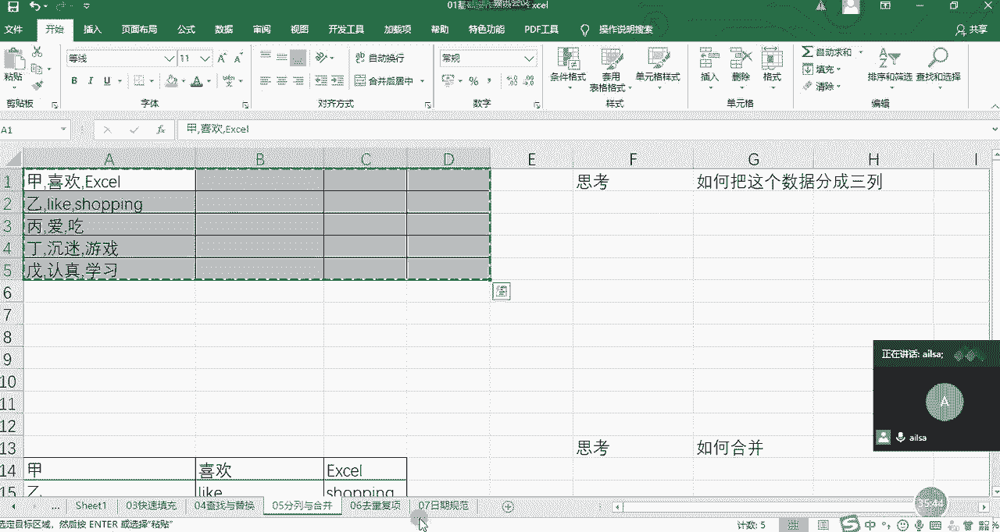

新建一个，然后嗯新建一个这个东西之后嗯，跟大家看一下哈，啊应该是能够看得清楚的，分裂功能在我们的日常生活当中哈，用到的也是很多，它不仅仅可以用来分裂我们的这个内容，它还可以啊有其他的操作。

我们在以后的讲解过程当中，大家就会感受到，首先啊分裂是在我们的数据选项卡下面，我们先选中它啊，额数据选项卡下面我们有一个分裂的功能，然后点击点击这个之后，大家看到我有两个选择，第一个是分隔符号。

第二个是固定宽度，很明显我们知道他这个是用英文的逗号隔开的，所以它属于分隔符号的一个呃一个分裂，所以说我们点击下一步，然后这里面有分隔符，你到底是什么分隔符呢，唉我们这边是逗号哈。

如果说你这边有的不是这边所有的选择，你可以选择其他，那我们在选择逗号之后，我们可以看到有一个数据预览，他就给我们预览出来，你是不是想这么分呢，诶好像是的，对不对，哎那我们再点击下一步，点击下一步之后。

大家看到这里，这是指的是它的输出格式啊，就是如果说你输出的是文本，你就选择文本，是日期，就选择日期，然后我们输出的是不是常规，那就选择常规，然后还有一个目标区域，也就是说你输出了这个东西之后。

你到底想放到哪个位置，你看如果说我们不想复制A类的内容的话，那我们可以选择什么，我们可以选择BE啊，放到他后面这个地方，然后我们再点击完成啊。

替换它，哎，这个时候我们就可以实现，我们所想要的一个效果了，这就是分裂的功能，最基本的啊分裂啊，那我们在进行分裂功能的操作了之后，哈啊我这边要停一下啊，啊大家啊，大家就嗯自己刚才操作了没有啊。

要自己手动操作一下，我现在等大家半分钟，嗯操作完了之后给我扣个一，啊其他人呢嗯大家不要懈怠哈，一定要跟着我的思路去走，手要动起来嗯，好的，两个人完成了，其他人呢不会吃饭去了吧，应该现在饭还没做好吧。

啊要做好了是吧，OKOK都差不多了哈，嗯差不多了，我们再往下去走哈，既然你分列分完了之后哈，哈现在领导就是一个奇葩哈，他说你分完了之后，你能不能给我合并在一起啊，沙雕是吧，OK没关系哈，我们可以的。

就是领导的激发需求，我们都可以实现，只要你足够强大哈，那怎么办呢，哎我们excel当中也可以进行一个合并合并，我们使用的是连字符，这边要用到简单的简单的公式啊，选择它，然后选择我们的连字符。

大家看一下连字符是怎么来打出来的，按住shift键加七哈，七啊，就是连字符相当于把这些连在一起，就进行了合并了，是不是跟啊Python去比，这个excel简直就是太好用了对吧。

哎这个时候我再往下去拖动就可以了，就可以实现了，这是我们的连接，就是分裂与合啊，分裂与合并哈这样的两种形式，那我介绍完了这个操作之后呢，再给大家介绍一个2013版，EXO的20313版及以上的。

一个非常快捷的一个方式，叫CTRL加E哈，真的是一个我从知道了这个CTRL加E之后啊，我就觉得真的无敌了啊，我给大家看一下它到底有多无敌，你看我这边输入了甲喜欢E对excel，对不对。

那这个时候我选择这一列，然后我直接按CTRL加E啊，大家看一下会出现什么样的效果哦，他是不是已经按照我所想要的方式给我实现了，然后这个里面也是一样，CTRL加一，然后CTRL加E。

它只能一列一列来实现哈啊，所以说我们就会发现，你给了它一定的规则之后呢，他就知道你想干嘛啊，对非常的智能，所以CTRL加E就可以实现，那下面这个也是一样，你比如说甲喜甲喜欢excel。

然后我把这个东西复制出来，复制成数值啊，这里面公式我复制成数值，然后我在这里CTRL加一啊，大家看一下它是不是也实现了，也就是说只要你的规则哈，只要你的excel里面的规则足够明确。

它就能够去识别出你到底想要什么，也就是说它就是你肚子里的小蛔虫，他就能猜出来，你应该是想要实现这样的效果，然后就可以帮你去实现，OK那现在大家操作一下，CTRL加E。

没关系没关系啊啊大家现在操作一下CTRL加E啊，来实现一下，把实现好的能够实现的给我扣个一，好可以哈啊可能大家平常不怎么用excel哈，如果说经常用excel的人而言的话。

知道CTRL加E这个功能的时候，其实还是很很很开心的哈啊，因为他们有很多的，其他的一些数据处理的过程当中，有些奇葩的，他们要使用很复杂的公式，有时候才能够实现，但是你用CTRL加E真的是啊很方便。

只要你的规则啊比较明朗一些就可以，哦只有于鼎实相了吗，其他人呢，我们再等半分钟哈，好的嗯，我们不等了哈啊自己没有时间了，自己私下的再试一下哈，我们接着往下去讲出重复项，好重复项这个东西哈。

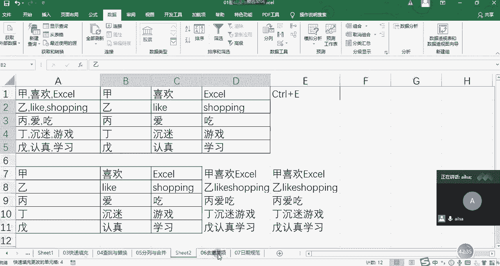

在工作当中竞争真的是啊，数据处理，数据清洗必嗯必然要操作的一个步骤，我们看一下怎么去啊，去除重复项啊，那我们先带入到一个业务场景当中，比如说对于这一张表而言的话。

唉它的整个的我们可以看这是item id，我们大概知道item是类别类别id，然后店铺的名称啊，SHOSHOP不是店铺吗，店铺的id，然后一个insert刚time啊，这有点像我们数据库啊。

存的表也就是什么意思呢，你比如说这个是一个淘宝的店铺，然后他淘宝店铺里面有很多个商品，它的商品的页面呢大家都涉及过页面对吧，页面有时候需要进行呃，就是产品的呃更新迭代啊这样的一个更新。

然后这下面什么的更新时间，那它相当于就是说，对于一个店铺的一些商品而言，它有可能一天当中进行了多次的一个更新，现在我给你的一个需求是什么呢，我不管他在一天当中进行了多少次啊，我只要其中一条数据就可以了。

也就是说我只要它在哪一天更新了就可以啊，这样的一个操作啊，那我们需求明白了之后，我们把这个数据啊考出来啊，考出来放到一个单独的excel当中嗯，首先呢我们想一下，既然它是对于天这个维度的啊。

进行一个驱虫的话，那我这边是不是坚持到了时间呀，那我要先把时间给去除掉啊，先把它的日期提炼出来，对不对，那我们提炼日期的话，我们可以观察一下它这个是不是可以分裂诶，好像中间有个空格，对不对。

那我们就可以通过分列的方式来进行实现，我们选择我们的数据选项卡下面的分列功能，然后选择这个时候我们就要选择固定宽度了，因为它是一个空格，我们选择固定宽度，点击下一步哎，我们可以发现选择固定宽度的时候。

你可以自己拖拉拽哈，哎这个时候我们选择这个空格的位置，是不是我们所想要的效果啊，啊然后我们再点击下一步，我们输出的时候就不是常规了，而是日期嗯。

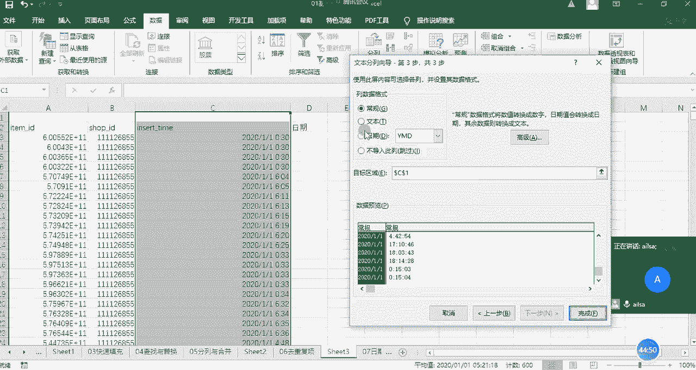

我们点击完成，点击确认，然后这个时候就可以了，但是我们会发现好像时间也带上了，这个时候没有关系，它只是显示的问题，因为它原来的这个单元格的是日期时间格式，我们只要给它改一下，改成日期格式就可以了。

我们点击确定，OK就可以实现了，那我们把日期提炼出来了之后，我们就要进行一个判断，item id和日期，他俩同时重复的时候，我们就可以删除了，对不对，那我们看item i de人本来是文本格式。

结果你一复制出来之后，或者是你进行了一些操作之后，它变成了数字，所以他特别大，那我们怎么把它进行改一改，改成文本呢，啊这个时候我们用到的也是分列功能。

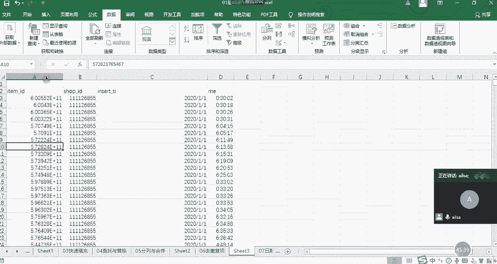

选择它，然后点击分裂，然后点击什么呢。

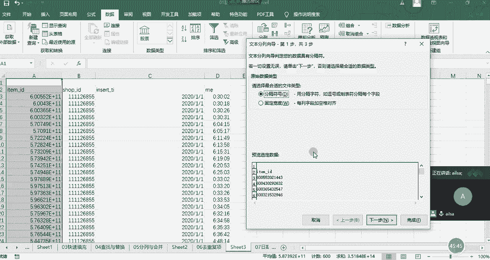

什么都不点击啊，对点击下一步，点击下一步，什么都不点击，输出的时候选择输出文本。

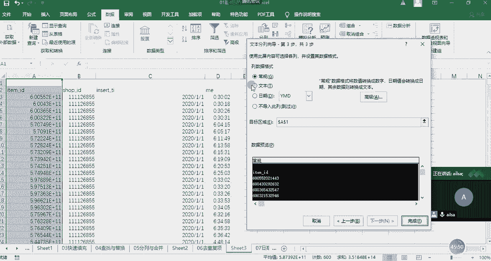

点击完成好，大家看很简单啊，就输出出来了，这就是分裂的一个很大的一个啊使用方法，那接下来我就要进行一个，删除重复值的一个操作了，那既然是A列和C列同时重复时我才删除，那我们就可以这么来操作。

在数据选项卡下面啊，这个删除重复项它是个很小的点哈，大家一定要看啊，数据选项卡下面有一个这个看到没有啊，这个删除重复项啊。

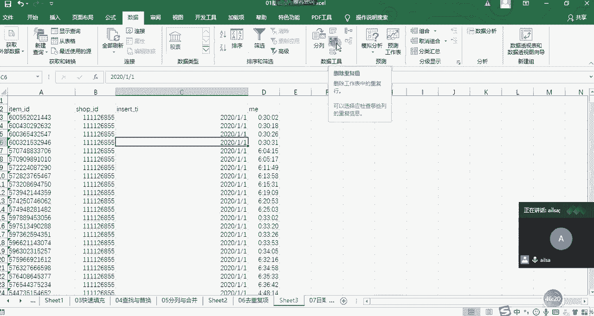

点击它啊，等于它之后我们会发现有几列全部都全选了，那代表什么意思呢，就是如果说你所有的列都打了对勾，代表你这些列同时重复时才被删除啊，那当然了。

我们只要选择item id和啊insert跟time就可以了，也就是说我们的item id和插入的时间，他俩同时重复时，我们就删除就可以了，我们点击确定哎，上面写到发现14个重复值将其删除。

保留了585个唯一值，这就是我们把重复值删掉的一个操作。

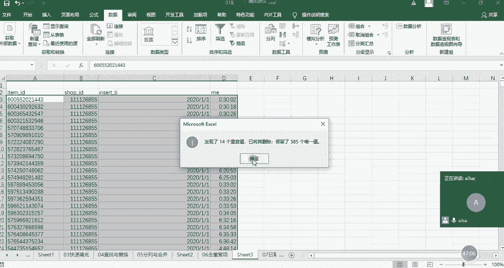

OK大家啊，大家自己操作一下啊，按照我刚才的一个步骤，然后操作完了之后，如果没有问题，给我扣个一，还在吗，都没有操作完，是不是慢慢来，别着急，有需要再讲一遍吗，再讲一遍，我就给你们再重复一下。

怎么没出来数字啊，呃你那边有没有对它进行一个分裂，然后输出文本操作，能截图看看吗，啊这边能发截图吗，可以发微信嗯，有其他人完成的吗，没有完成，我就再重新讲一遍，OK又完成的，好的好的好的。

那我就不重新讲了，好吧啊，可以可以可以，这个不难哈，嗯然后我们那我们接下来就哦，因为这个用到了分裂功能啊，然后再进行一个删除啊，这样的一个操作，我们在进行接下来的最后一个日期啊。

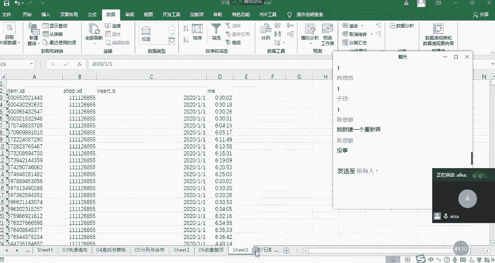

日期时间的一个规范，那日期时间的一个规范呢，在我们的数据处理当中啊，特别是别人给过来的一个数据哈，别人给过来的数据就是比较糙哈，所以说他这个日期时间非常不规范，你比如说对于这个而言。

这个点其实这个点你说他错吧，好像很多人都这么去写，但是对于我们的系统而言，我们的日期不是这么来记录的，我们的日期正规的应该是2014杠，一杠二对吧，这样的一个形式，这才是日期时间格式。

但有些时候你给别人就说诶你不能这么去写，你应该这么去写，那对于毫无数据分析呃思维的一个呃呃呃，同事或者是啊人员而言，他举的都一样，对不对，但是我们在后期进行一个公式和函数，的引用的时候，差别其实挺大的。

因为他在这里面其实是其实是一个文本格式，而不是日期格式，我们该怎么去啊进行一个规范呢，啊其实这个就用到了之前最开始的时候，思敏提到的一个呃替换的一个操作，也就是我们啊也讲过的一个CTRL加什么。

CTRL加H的一个操作，那我们先选中哈，这个时候我们就要先选中了，因为其他的地方啊有可能也有点，所以没必要去替换，那我们需要把英文状态下的一个点，英文状态下的点输入，然后再输入英文状态下的杠。

哎我们输入了之后先点选查找全部哦，那这个点是中文的吗，稍等中文没有点，查找全部OK没有关系，我们把这个点复制出来，可能它会有空格什么的啊，这个都有可能应该是有一个空格，空格应该是不影响啊，没有关系哈。

我们再试一下，CTRL加H，OK那这个时候我们再查找全部，查找全部哈，我刚才我刚才犯了一个错误哈，跟单元格匹配了，没有任何一个单元格有点的哈，哎那我们这边查找到了之后。

我们看一下是不是所有的日期都查找到了，查找到了之后，我们就要进行一个CTRL加A的选择，然后进行一个全部替换，诶，完成了一个替换，我们关闭，这个时候，我们看到它也已经替换成我们的日期格式了啊。

那如果说啊，有可能你进行了一个杠的替换了之后，他这边不是，那你就可以把它梳成啊日期格式啊，这样的点击确定，然后就可以实现啊我们所有想要的操作了，也就是说把点替换成杠，然后替换成杠。

如果原来的还是文本格式的话，你设置成日期也就可以了，如果啊假设哈如果你还没有实现。

你就可以采用分裂的功能啊，分裂的功能真的对于格式的一个统一很重要。

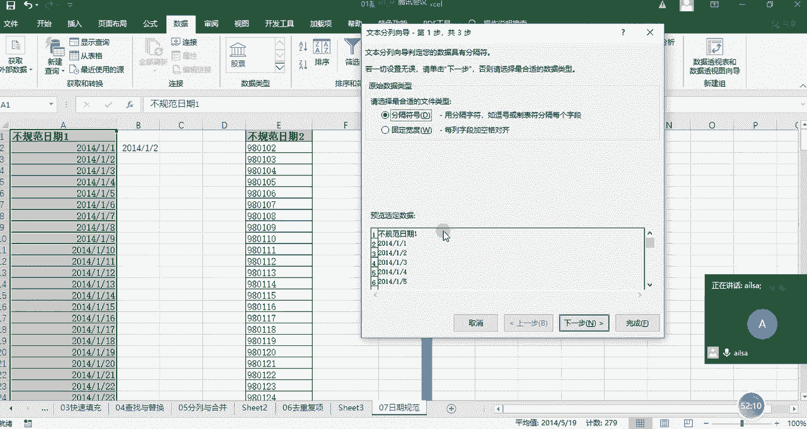

你输入什么呢，你什么都不前面什么都不要操作，然后你直接按日期格式去输出，它就会统一的给你替换成日期的一种格式啊。

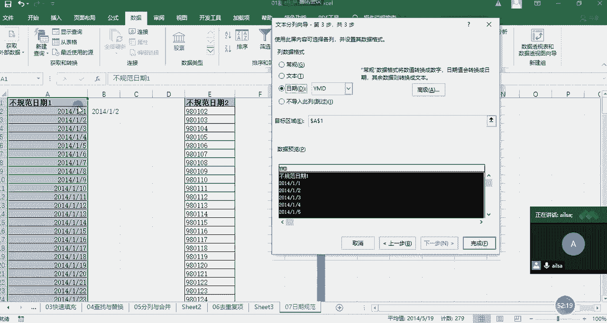

就可以了，这是这样的一种形式，那还有这样的一种，就是类似于我们啊，我们经常用的计算机的那种思维方式的话，那我们可以通过拼接的方式来实现，也可以通过函数，我们先看这个函数啊，这个函数应该没有学过哈。

我们在后面如果有机会，我们就可以再给大家讲一下，我们先看下这个函数，这个函数很快哎，大家看一下哎，输入这个函数没有出现问。

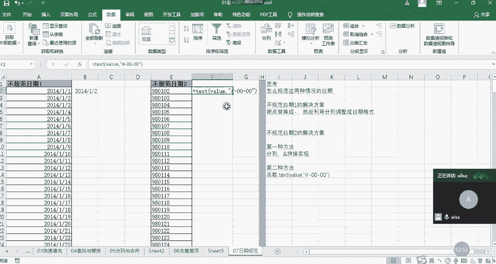

没有出现所讲的效果，为什么呢，是因为它是文本格式，文本格式是识别不了公式的。

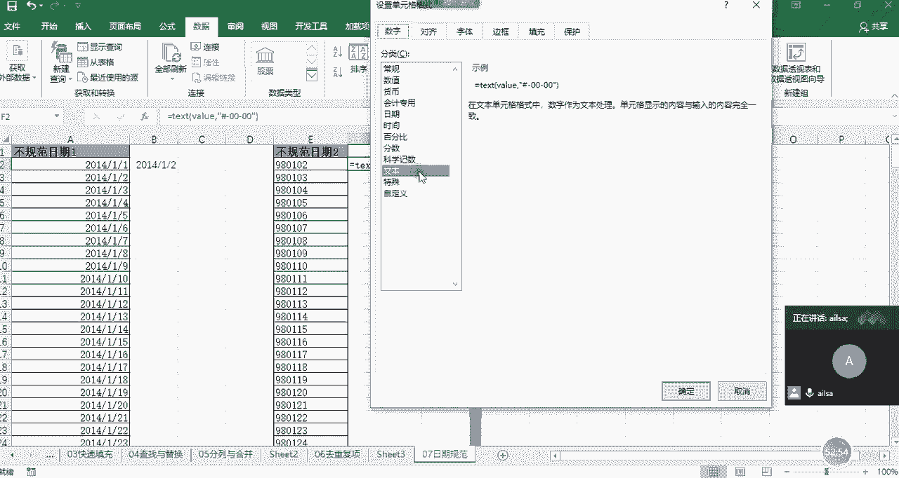

所以我们选择常规点击确定，然后再双击进来，再按T键啊，它又出来了啊，这边报错的原因是，因为我这个应该选中的是单元歌啊，你看一下啊，这个时候我们再需要加上一个二零就可以了，对吧，然后进行一个操作。

这是我们用公式来实现，那当然今天我们不讲这个内容哈，我们不讲这个，我们讲怎么通过拼接的方式来实现啊，有点麻烦，稍等一下，我喝口水哈，拼接方式我们就是用我们的连字符来实现，首先我们会发现它啊。

他前面都少了一个什么啊，他前面应该都少了一九啊，1998年啊，199几年这样的，所以说我们首先拼接的是我们的一九啊，这样的一个字符串，然后加上我们的连字符，然后我们需要拼接它的啊，拼接它的啊。

前面两个内容对不对，然后再是中间两个内容，再是最后两个内容，但是因为我们现在没有学函数，所以说我们需要对它进行一个什么，进行一个切啊，就把它切成三等份对吧，前面俩中间啦，最后俩。

所以我们现在还用不了公式，我们要对它进行一个切割，唉我们要插入这些，然后我们选择它，然后选择我们的分裂，看又用到分裂了，这个时候我们就用固定宽度，你别看它没有空格，我们也可以用固定宽度，我们怎么用呢。

我们可以通过诶大家看到拉鼠标哈来拉鼠标，按照每两个进行一个分割，然后点击下一步，然后我们就按常规格式去输出，或者文本格式也都可以，我们按文本格式吧啊输出点击确定啊，大家就可以看到这个是年，这个是月。

这个是日哈这样的一个结果，然后我们就可以使用嗯连接的方式，然后首先我们先输入一九刚才的内容，然后连字符唉，我们的年，然后粘了之后，后面是个啥，后面直接连月吗，其实不是我们要连一个杠对吧。

一走就是连杠多少对吧，然后再连一个月对吧，然后再连一个杠，再连一个杠，再连一个月啊，日啊，这样就可以了，我们看1998年1月2号，这样实现了之后，其实还没有完成，因为这里面是有公式的。

所以我们要把它替换成啊，你换成值好，我们看一下，这里没有公式的，但是这里面虽然没有公式了，但是它也不是日期格式，因为我们都知道日期格式是这样显示的，所以你还需要再一步分裂哈。

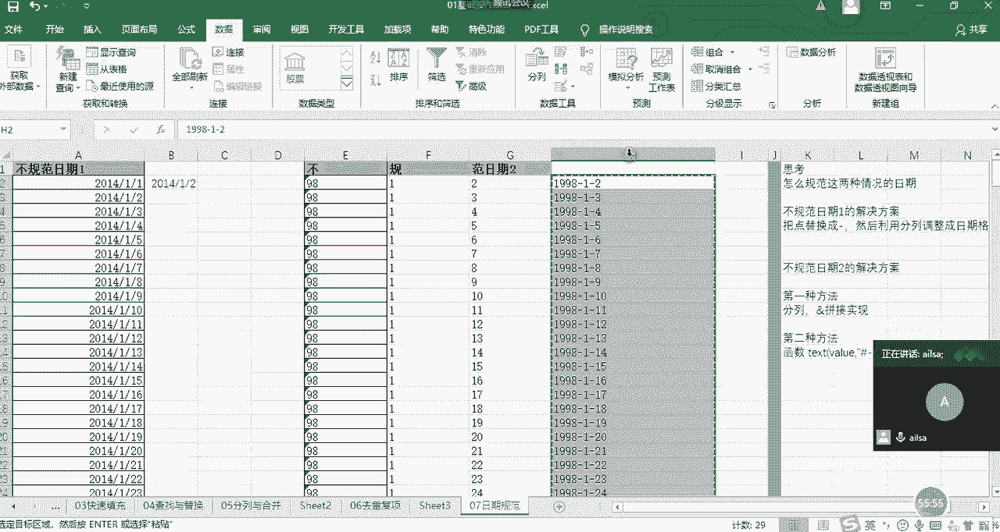

把它分裂成日期格式，日期啊。

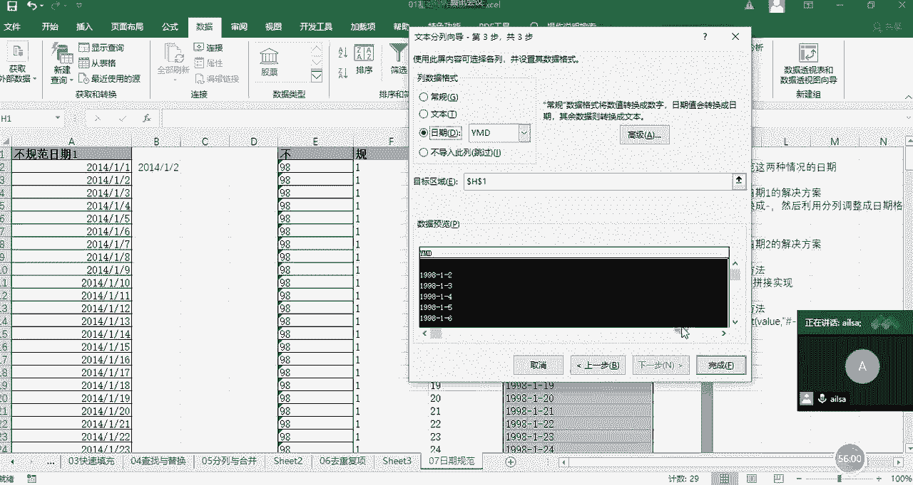

完成好，这个时候我们就所达到了我们所想要的效果，同志们，同志们，我给大家一分钟的时间，一分钟的时间，然后把这个实现，嗯实现完了之后，然后我们今天啊就讲到这里了。

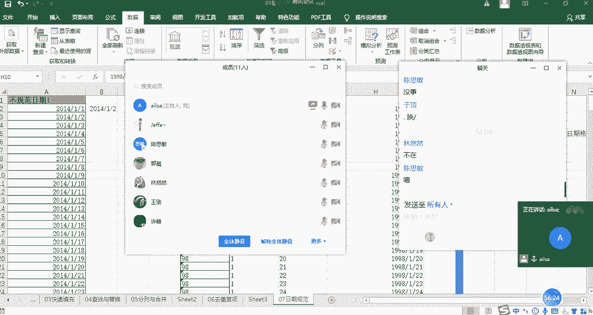

我先把啊视频啊。