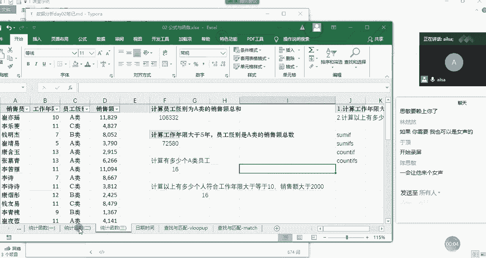
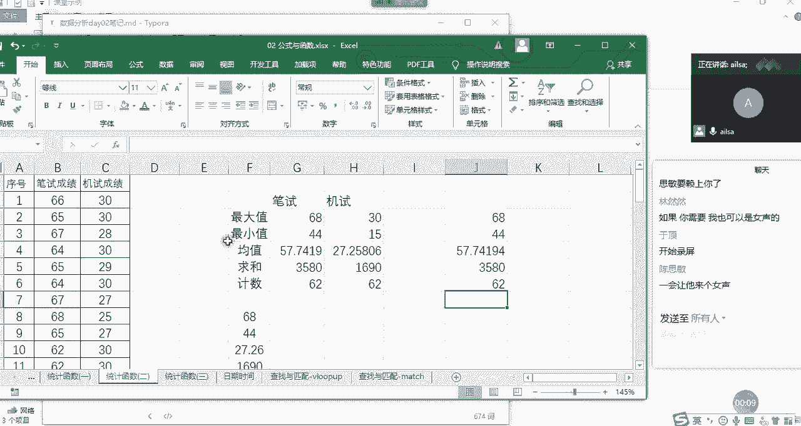
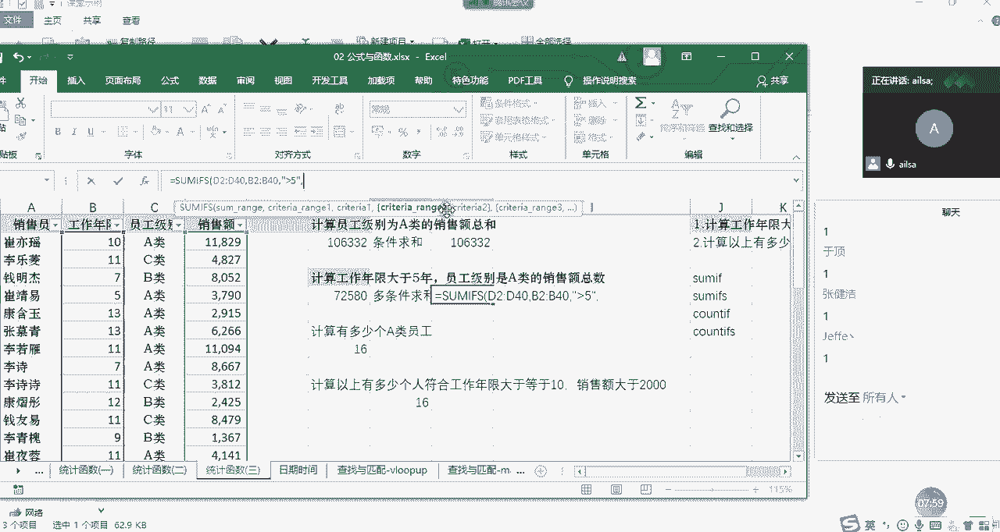

# 强推！这可能是B站最全的【Python金融量化+业务数据分析】系列课程了，保姆级教程，手把手教你学 - P42：06 统计函数2 - python数字游侠 - BV1FFDDYCE2g

好我们开始讲解接下来的统计函数哈，唉我们刚才讲了。

我们刚才讲了嗯，最大值最小值，均值求和基数这些都比较简单的。

那接下来我们就讲有一定难度的哈，上一个阶段的啊，这样的一个啊这样的一个呃函数，哎我们看一下，我们先看我们的一个需求哈，我们结合需求去想该用哪个函数去实现啊，首先第一个需求的话。

就是计算员工级别为A类的销售额总和，哎我们看一下它首先计算的是不是总和呀，哎那我们学的总和就是我们的sum函数，但是咱们在这个基础之上啊，他又给了我一个条件，叫员工级别为A类的销售总和。

那我们可以总结来说，他应该想让我啊使用的是一个条件啊，求和对吧，条件求和给定一定条件进行一个求和，那我们也有对应的这样的一个函数，等于什么呢，some if我们学过sum了，是求和，那我们也学过条件啊。

就是我们的逻辑函数是if if，那它俩是可以放在一起使用的，就是我们的sum if f函数，对满足条件的单元格进行一个求和，我们看一下它的函数组成部分分三部分啊，第一个就是我们的range。

也就是说你现在给定了一个条件为A类，那我这个A类啊，它这个条件在哪个区域当中，那我们看员工级别是A类，是不是在C列啊，那首先我们要选择的就是我们的C列的值哈，系列的值，然后选择完我的一个区域了之后。

我们点击英文状态下的逗号，这个时候我们看第二个就是指的是条件，你的条件是什么呢，我们看我们的条件是员工级别为A类，所以说我在这里面直接写A类就可以了，他就知道你想表达什么意思呢，AA类啊，这样去表达。

然后我们看第三个组成部分叫SUGRANGE，就是我们的求和区域，那既然给定了你的员工级别是A类的，这样的一个条件之后，你想对哪一列进行一个求和呢，唉那我们的求和区域就是我们的销售额对吧。

我们选择我们的销售额作为我们的求和区域。

然后我们按右括号进行一个NT键，唉看到没有，我们这个时候就计算出了员工级别为A类的，整个的一个销售额的总和，那在这里大家不要闲聊了哈，要听我讲啊，在这里的话，唉，我们呃可以看到。

我在这里面只是举了一个简单的例子啊，那我们一般情况下，输入函数都是为了批量实现的，所以说在这里的批量指的是这个A类，有可能会A类，B类，C类，这样分别进行一个求和的时候。

我们就可以用sum if f进行一个拖拉拽的形式，进行进行一个实现，明白了吗，这就是some if函数嗯，OK那我们来总结一下哈。

some if函数啊，还是我们的统计函数哈，some if函数它的组成部分啊，它因为它是条件求和，所以第一个的话就是我们的条件区域啊，第二个部分就是我们的条件，第三个组成部分就是我们的求和区域啊。

这嗯大家可以看到啊，就是如果说你在日常的工作当中，记得不是特别清楚的时候。

其实excel都会给你做提示的啊，如果大家英文不是特别太差，都可以看出来到底是什么意思啊，我再强调一遍，这个是我们的条件，区域就是条件就是求和区域，好吧，大家现在手动操作一遍，然后哦没有问题，扣一好。

抓紧时间，我给大家半分啊，思明好快啊，我给大家半分钟的时间，哈哈啊，其实边操作边练习的话啊，边听讲，这样的话相当于大家有参与感，然后啊就不会犯困啊，或怎样的事会效果会好一些啊，虽然我们讲课的进度啊。

稍微会慢一些，但是效果会很好啊，啊主要是因为咱们人少哈，人多的话，我可能就不会啊，等着大家去一个一个去敲了，我们的条件求和啊，私密完成了，其他同学呢是不是又在闲聊，所以没有完成，然然啊。

你叫他就好了哈好嘞，好的，现在是三个人，四个，好的好的，那我们接着讲下面这样的一个案例哈，这样一个需求啊，我们是刚才是员工级别为A类的一个，销售额的总和，那下面是工作年限大于5年。

员工级别是A类的销售额总和，我们会发现他的条件变多了，对不对，不仅仅是单列了，不仅仅是针对员工级别，还要针对工作年限，唉这样的一个啊条件进行一个销售额的总和，然后我们就发现哎你对一个条件我会多个条件。

我该怎么办呢，啊其实也有它的一个计算方式哈，我们可以看一下多条件求和啊，怎么来实现的啊，我们既然有some if，这个时候大家可以想一下脑洞，你比如说我们的number代表一个数字。

那numbers是不是代表两个数字，那我们的sum代表一个球，一个条件进行一个求和，那多条件是不是加一个S就可以了，来我们看一下哈，some if啊，它不给我提示哈啊，没有加等号。

所以它不给我提示啊等号some if诶，好像真的有SUS对一组给定的条件啊，指定的单元格进行一个求和啊，其实它的一什么叫一组呢，就是说你有很多个啊条件，进行一个指定的一个求和啊，是这个意思哈。

就是多条件求和，那我们看一下，多条件求和的一个函数的组成部分，第一个叫SUGRANGE，就是诶一上来就是我的求和区域是吧，哎那我们的求和区域就是我们的销售额这一列，我们选择它按住shift键啊。

这样就可以了啊，这是我们的求和区域，那第二个部分是什么呢，第二个部分就是我们的条件区域一，唉我们就知道啊，他后面可能会跟很多个啊条件区域啊，很多个条件哈，很多个条件，这是条件区域一。

条件条件区域二条件这样的一个形式，那我们的条件区域一就是工作年限哈，这个啊啊我的鼠标啊被我咬了一口之后啊，只坚持了这么点时间哈，啊废了啊，OK我们选择它啊。

这是我们的条件区域一啊，往下拉哈，条件趋于一，然后我们的条件是什么呢，条件是大于等啊，条件是工作年限啊，大于等于啊，大于5年，没有等于哈，那这个时候我们该怎么去表达这个大于5年呢。

啊我们是这么来表达的哈，还是啊在双引号，然后下面啊里面输入什么呢，大于五就可以了，它就能识别出来，这是我们的条件区域一条件，那我们再看后面是我们的条件趋于二条件。

那我们就要选择我们的员工级别来往下走，往下走。

然后到这里好，我们再往上拉哈啊，这个时候我们的条件是A类，那我们跟刚才的是一样的对吧，没关系啊，没有鼠标的话，刚好我在操作上会慢一些，大家能看得更清楚一些，现在大家要跟着我啊去手动的操作。

然后我们看一下最终结果，72580，这就是我们多条件求和的一个函数的啊，讲解，那我们会发现一个什么问题呢，我们在单条件的时候啊，我们的求和区域是放在最后一个位置的啊，我们前面是条件区域条件对吧。

但对于多条件而言的时候，这个时候会怎样呢，就是说他也不知道说你后面到底有多少个条件，所以他直接把求和区域放上来了，第一列你后面想有多少个就添多少个，这样的话会看起来更清晰一些。

我就知道你到底想对谁进行一个求和，然后你的条件啊又巴拉巴拉这么多啊。

这样的一个形式的呈现啊，下面我啊来给大家做一个啊SUF的一个啊，总监SUF啊，是它这个函数的组成部分的话，就是我们第一个是我们的求和区域啊，这个有略有不同哈，然后第二个就是我们的条件区域一啊，条件好。

还有就是条件条，条件区域二，条件啊等等等啊等等等啊，这样的一个组成啊，就是我们的some EFS多条件求和，我们对于单条件求和的话，直接叫条件求和就可以了，嗯条件求和啊就可以了。

这是我们的some和some if，接下来我们再看求和是这么来实现的。

那计数呢啊啊我要问一下哈，some EFS大家都完成了吗，没有问题，给我扣个一，好的啊，建豪没问题，四面没问题，好我们现在听课的就六个人吗，六七个哈，好的好的，然然也没有问题行。

那我们接下来讲count函数哈，那我们之前说count是计数，那既然有条件求和，会不会也有条件计数呢，啊当然是有了哈，你看我们要计算A类员工有多少个啊，这个其实count会比SAM更简单一些。

因为它只要对某一类进行一个计数就可以了，它不用指定专门的一个啊呃求和的区域，我们看他直接好，它直接就是啊value啊啊稍等啊，count if哈。

我们的count if我刚才写了一个count count啊，我们看到有哈，哎我们看到有单田要求和啊，单条件计数还有多条件计数是吧，Count if s，所以它们是啊异曲同工的哈啊，我们看它组成部分。

第一个就是range，也就是说你要对哪一列进行一个计数，比如说啊我要对啊，因为在这一列当中它有一个条件，那我们的所有的区域就先选择这一列啊，所有的区域都先选择这一列，然后啊这是我们的条件区域。

然后条件是什么呢，条件就是我们的A类啊是一样的，在这写，在这写比较方便一些，A类这个时候他会做接下来哪一步操作呢，就是说他直接把A类的员工筛选出来，进行一个计数就可以了，因为计数并不要求它必须是数字呀。

必须是什么什么，它只要能筛选出这么多条记录，他直接算一下有多少个也就可以了，所以说他只有这两个组成部分，我们按enter键发现它确实A类员工有16个。

这就是我们的count if会比some if要简单一些，那对于多条件计数，你比如说这个是工作年限大于等于十，然后销售额大于2000的啊，这样的一个计算方式的话，我们该怎么去啊，完成呢。

我们看一下我们需要使用的就是count if，也就是多条件进行一个计数，哎我们看一下它的组成部分，首先第一个就是条件区域一条件，那其实我们会发现它跟SUF4而言的话，它就少了一个求和区域啊。

啊它是根据他的条件判断出来多少条数据，进行一个计数就可以了，它第一个就是我们条件区域，我们条件区域是工作年限，我们选择工作年限，然后往下来走，往下来走，然后到达我们的啊最下面啊。

这是我们的条件区域一啊，然后条件是什么呢。

条件是大于等于十，那我们的条件可以这么去写，在文本的情况下啊，写上大于等于十啊，那大于等于十，然后这是我们的条件趋于一啊，条件一，然后我们再看条件二，就是我们的销售额大于2000。

那它的区域就是销售额这一部分往下拖动，拖动到后没鼠标真的有点麻烦啊，然后我们的条件是什么呢，大于啊大于等于啊2000啊，大于等于2000，也是这么来实现的，嗯大于等于2000，OK啊，大家跟着我操作哈。

这时候按enter键哎，就实现了我们的一个count if的一个计算嗯。

那接下来我总结一下，好总结一下count if它是一个条件计数，它的组成部分是条件区域啊，和条件这样的一个组成，这必须是英文状态下的逗号啊，这是我们的条件计数，那第二个就是我们的count aps啊。

就是我们的多条件基数，那它的组成部分就是条件区域一啊，条件一，然后是条件区域二，条件二啊等等等等等等啊，啊这样的一个啊这样的一个文字表达，这叫多条件技术，那到截止到目前为止，我们的统计啊。

统计函数就基本上就差不多了，也就是说跟那个我们统计学相关的，或者是啊这样的一些函数啊，掌握这么多基本上就够用了啊，大家对于以上哈，以上这些统计函数有什么问题没有啊，没有问题扣一，好的啊，那没有什么问题。

