# 强推！这可能是B站最全的【Python金融量化+业务数据分析】系列课程了，保姆级教程，手把手教你学 - P46：10 数据透视表简介 - python数字游侠 - BV1FFDDYCE2g

OK好的，同学们，那我们啊接下来讲解我们的数据透视哈，好像很官方的样子啊，没关系啊，哎我们讲解数据透视，这个数据透视是一个什么东西呢，其实啊我们通过一个啊需求来给大家讲一下，我们在实际的啊工作当中。

如何去发挥数据透视的一个优势的好吧，还什么那个业务需求呢，首先我们看一下，比如说唉领导给了你这样一张表，我们可以看出这个表大家很熟悉了哈，之前也见过诶，就是某一个地区啊，很嗯这个城市。

然后它的不同的品牌的不同的车型，它的一个销销售数据对吧，销量收入这样的一个数据，然后领导啊，假设啊假设我是你们boss哈啊，然后呢嗯我给思敏发布了这样的一个任务，我说思敏，那你把这个哎。

你把这个数据给我整理成这样行吗，哎我明天要给领导呃，给我的啊客户，然后去展示一下，我们整个的一个啊公司的业绩啊，你接收到这个需求之后，大家接到这个需求之后，想一想我们该怎么去实现啊，我们啊的一个啊效果。

我用我们经常之前学的那些内容的话，买不起哈，没关系，买不起也没关系，现在买不起不代表将来买不起啊，大家有什么好的思路没有啊啊现在畅所欲言啊，你觉得我啊想要把这种一种形式，然后实现成这样的话。

该怎么去操作，相当于就是说我对每某个品牌，然后进行一个汇总啊，求它的销量和收入的总和，对不对啊，有没有人有思路，好大家大家都叫思思啊，好亲切哦，哦不是，We look up。

we look up是匹配的，这个是有点计算的，你比如说奥迪这里面是一条条的数据，但是在这里面你比如这个80，它来源于这些啊，所有的数据的加和啊对吧，啊还有没有人有其他思路啊。

对啊你看啊郭成就想到了SAM，因为我们有点类似于条件求和对吧，哎啊OK思敏说的也没有问题哈，啊我们看我们先说some AP，他这个是不是我们的条件是我们的品牌，然后我们的求和区域就是我们的销量和收入。

对吧，这可刚好可以用到我们刚学的一个sup，然后我看于鼎的思路，按照品牌进行一个排序，然后分表插入空行啊，筛选复制啊，私密的是筛选复制啊，相当于于鼎和思敏的思路都是对于操作啊，操作的方式。

然后进行实现的，那我们一个个来看啊，我们先看第一步，就是说我们想实现这样的效果的话，我们用最开始的那种呃方式啊，就是我们筛选，那我们就用筛选我们筛选奥迪一奥迪，奥迪是个好车啊，啊对我们筛选奥迪。

然后把我们的销量呢拉一下，来看看看看有多少个哎，这里面哎你看我们的excel里面这边是有记录的，求和是96，对不对，唉那个计数是六啊，怎么着，那求和，我就可以把这个销量的和填到我这个表里面。

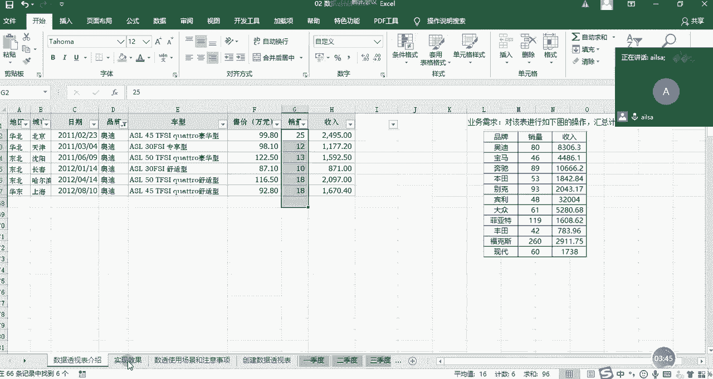

奥迪啊，奥迪A销量是80哈，我们就可以可能我后面数据修改了哈，我们可以这样填到96，然后收入的话我们再进行一个加和唉。

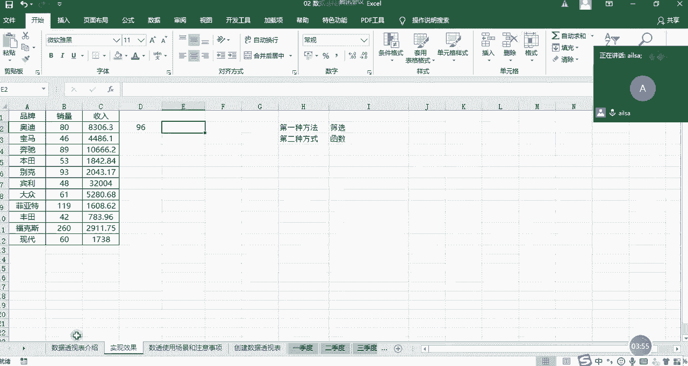

我们再拉一下，我这边数据可能会有变动啊，这个没有关系，9903。1，然后我们再填到这里面是吧。

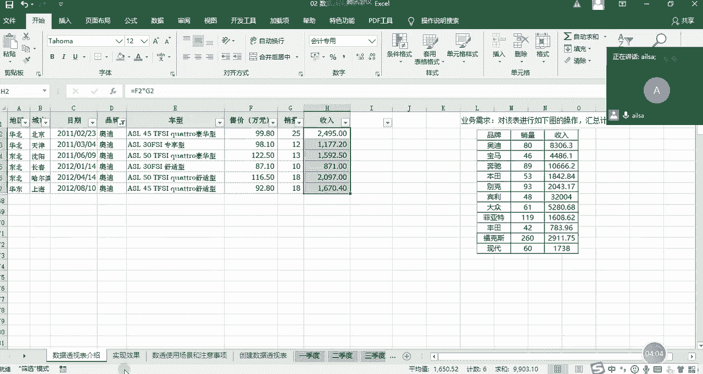

一个个的进行每个品牌的一个填写就可以了，那如果说啊我们的品牌就这么多，那我这么来实现的话，也大概10分钟，20分钟也就实现了，对不对，但是我们会发现。

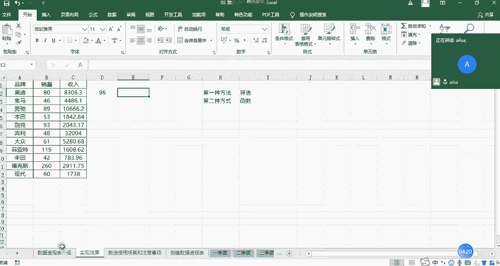

我们在进行这样的操作过程当中，来回的去进行手动的填数的话。

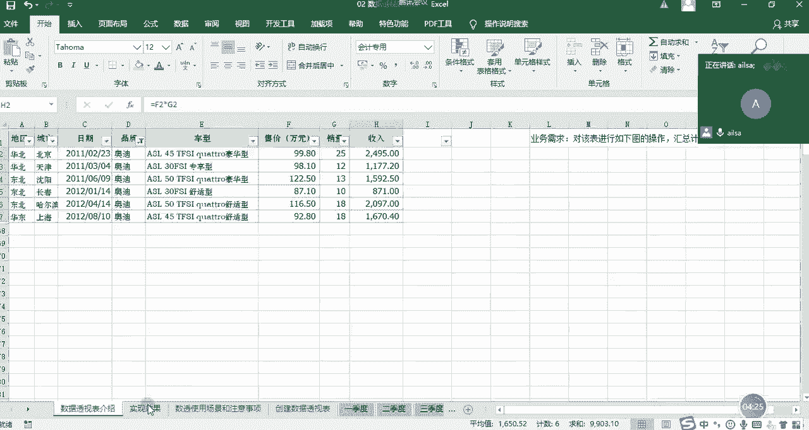

其实是比较麻烦的，而且还容易出错，所以我们第一种方法筛选的话是相对来说啊，最嗯啊最直接也是最基础的一种方法啊，相对来说没有那么高效，那我们再看第二种方法，第二种方法刚才有人说了哈，我们把建号说的。

我们用的是some if函数对吧，我们用函数来实现，我们刚学过，那我们就练习一下吧，好吧，怎么来做呢，首先呢我先输入sum if函数，因为它只有一个条件，就是品牌，然后我们的区啊就是我们的啊。

这个呃区域也就是我们这个条件啊，这个品牌所在的区域是在这个工作表当中，你看我们刚才讲函数的话，从来都没有讲过跨工作表这样一个情况，现在我们点选它，然后哎呀不好意思啊。

我这边需要把这个先取消掉，不然的话这曲线都会存在问题啊。

大家大家别看我这个操作比较笨哈，是因为我没有鼠标哈，所以说我用键盘的话会稍微麻烦一些啊，然后我们的第一个是我们的区域啊。

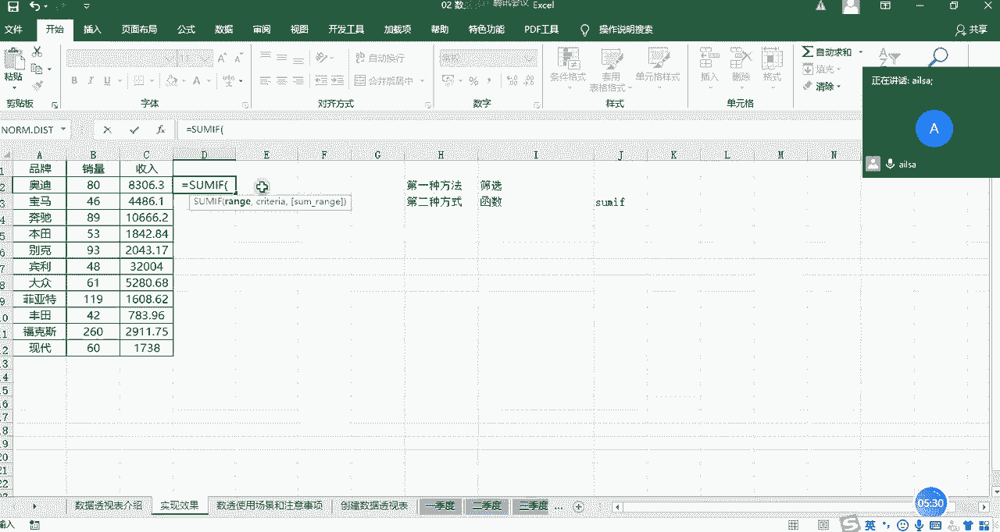

我们选择我们的品牌哎，往拉到后面到这里啊，然后这是我们的品牌区域。

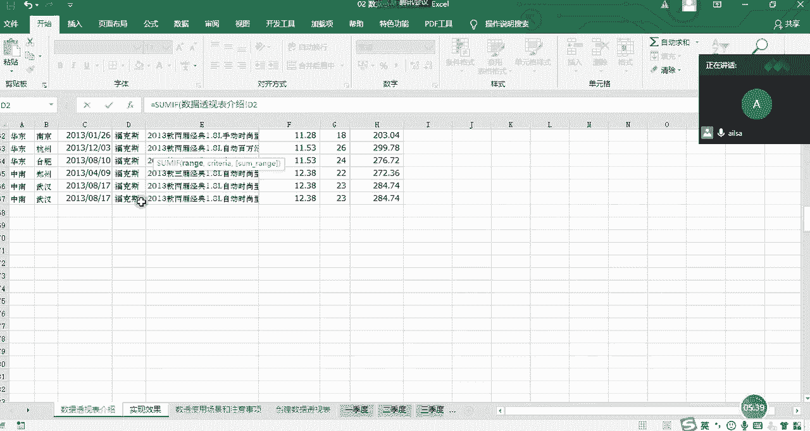

然后我们再回到我们这里来，大家看到一个出现问题了哈，好这应该是数据透视表介绍好的一个，第二我刚才切回来的时候可以改哈，数据我本来想讲一下这个数据透视表介绍啊，啊第二啊，第二到第67。

这是我们的一个呃条件区域，我们可以发现在不同的工作表之间，他啊如果说不在本工作表下面，如果你使用公式的时候，它会带上这个别的工作表的名称加一个叹号，这个地方大家不要随意更改，好吧。

嗯知道是这种格式就可以了，然后第二个就是我们的求和区啊，就是我们的条件区条件，那么条件就是奥迪对吧，那那这个时候他也会在这个里面加上这样的，一个啊效果啊，啊就是我们的整个的一个工作表的名称。

然后第三个就是我们的求和区域，求和区域应该是啊，我们回到这个表里来。

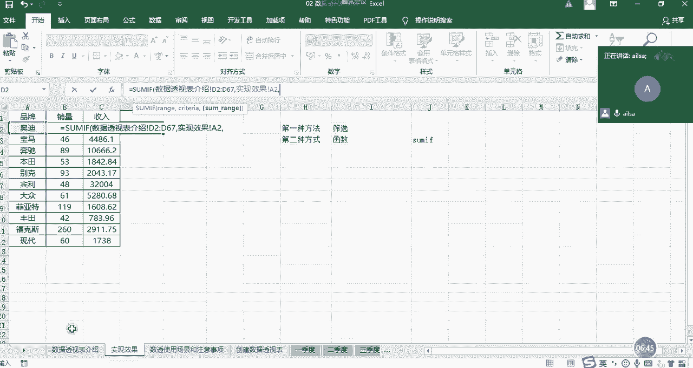

然后选择啊，选择我们的求和区域应该是销量和收入，那我们需要一个个进行啊选择，这个时候我们选择它啊。

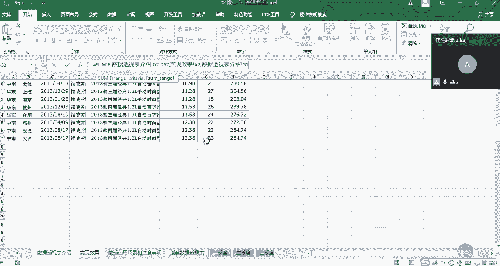

然后我们按右括号就可以了，我们的这个销量就出来了，我们看96是不是跟刚才是一样的啊，然后往下拖动啊，这个时候我在往下拖动的过程当中，大家一知道我们应该注意什么吗，啊我们应该注意我们的区域是不发生变化的。

所以需要在我们的区域，这里加上绝对引用的符号啊，这个时候我们按F4哈F4，然后还有我们的整个的一个求和区域，也是不发生变化的，稍等一下求和区也是不发生变化的啊，这样但是我们的这个条件。

奥迪宝马奔驰这个其实是希望它发生变化的，所以这个我们就不动哎，我们按enter键，然后再往下拖动，就实现了我们所想要的效果，你看是吧，就实现了我们所想的效果，你看下面都是因为数据可能会有更新。

所以会有略微不同，这个倒没有关系，然后这是我们的一个销量的计算方式，那下面就是我们的额收入的计算方式，我们看一下它俩的区别在哪呢，它俩区别就是我们的求和区域不一样，从G变成了H对不对。

那我们就改一下就可以了，这个时候我们如果想复制这个公式的的话，我们是双击进来啊，或者是你单击进来也可以进行编辑状态，然后把这个公式选择唉，选择了之后CTRL加C，大家选择完了之后。

记得一定要按一加ESC键哈，ESC键，然后让它还原回来，不然的话你这个公式有可能会啊被覆盖啊，不信你可以自己去试一试哈啊，在这里面我复制进来，复制进来之后，我需要把G改成H就可以了啊，G改成H改成H啊。

然后这个时候就是我们的整个的一个，销售额的一个计算啊，这是我们用函数来实现的，是不是相对来说也比较厉害，但是我们会发现，我们在进行一个操作的过程当中，区域的选择呀，然后只等等这些的时候。

其实还是略微有点麻烦，对不对，OK我看一下大家的反馈啊。

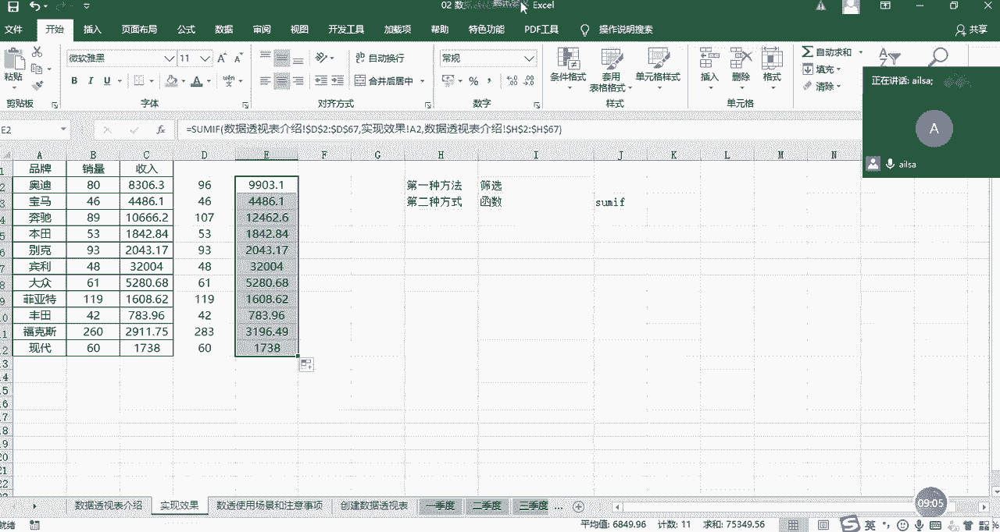

大家对于刚才我讲的这个操作啊，理解的扣一。

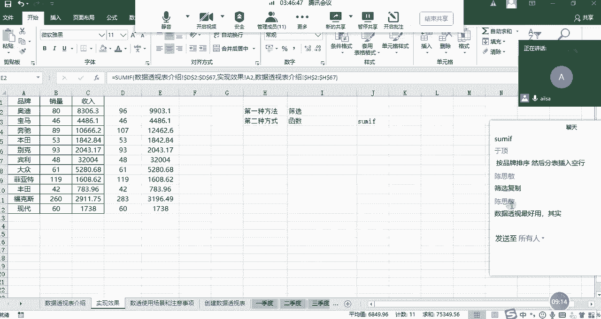

嗯理解的扣1OK，那我们讲了这两种方式之后，那接下来我给大家讲一个啊，更高效的方式就是我们的数据透视，我们看看它是怎么来实现的，数据透视的实现方式啊，第一步啊我们可以在啊这里啊这里来实现，第一步。

我们需要在把我们的数据哈，把我们的鼠标啊不要定义在不要放在这里，也要放到我们的数据区域当中，你不用选择，不用全选你的数据区，你只要放在这里，他就知道你想干什么了，然后点击插入选项卡，下面的数据透视表。

点开了之后，我们看一下这个创建数据透视表的一个啊，我们需要动的地方，首先第一个就是他的选择的区域，它默认给你选择了A1到H67，我们看一下是不是我们所想要的效果，A列到H列是没有问题的。

那是不是到67呢，哎呀也是就是我们整个连续的数据区域，OK没有问题，这是一个我们需要动的点，第二个的话，就是我们选择放置数据透视表的位置，他你如果选择新工作表的话，他会单独给你放一个新的工作表。

但是我这里为了演示，我就给大家放在当前现有的工作表当中，如果你选择了这个之后啊，你需要告诉他一个位置，就是说你要放在这个excel当中的哪个地方，那怎么告诉他呢，就直接选一个单元格位置就可以了。

很简单哈，我们选择这个位置哎，就出现了它哎G6这个位置，然后我们点击确定，点击确定了之后啊，我们可以看出来他这边有一个数据透视表字段，我们该怎么来实现呢，哎我给大家先啊进行第一步操作啊。

因为我现在没有鼠标啊，这比较费劲哈，我们先看一下我们想要的是品牌，对品牌进行一个分类汇总，对不对，那这个时候大家看我的操作，我把品牌拖到行方向啊，我们把这个拉一下诶，他这个行标签里面就出现了各种品牌。

对不对，假设我把它拖到列方向上啊，sorry啊，我把它脱掉哈，如果说我不想要它了，我就可以把它脱掉啊，啊删除字段，这个时候就没有了，那我如果把品牌啊拖到列方向上，还好吧啊。

这个时候他就会在列方向上去出现这个数据，对不对啊，那我们再把它删掉啊，删掉移除这个字段，那我们还拖到这个行方向上，我们看我们有了这个不同品牌的一些分类之后，我们想对这些分类进行求和的操作。

那对哪些字段进行一个求和呢，是对销量和收入，对不对，那我们把销量拖到直方向，我们看一下诶，他这个销量是不是已经求和了，他这个求和是怎么来的呢，其实是在这里有一个设置啊，设置值字段设置啊。

这里面有可以计算的类型，求和计数平均最大最小乘积，你看是不是特别方便，也就是说，我们对某一个分类进行这么多的一个计算，它都可以满足，现在我们默认的是求和，那刚好满足我们的情况是没有问题的。

那接下来我们还要对收入进行一个求和，我们就可以把收入拖到我们的知识方向，A销量和收入都有了，看到没有，那其实我们从简单的来说的话，我们通过拖拉拽的形式就可以实现，对数据的进行一个分类汇总求呃。

分类汇总的计算这种形式啊，或者这种方式就叫做数据透视啊，通过对数据的呃呃一些整合，然后达到我们所想要的效果啊，啊这个听明白了没有，你TM白给我扣个一，听明白了哈，这就是这就是我们数据透视表的一个用处啊。

它就是用来进行快速的啊分类啊和分类汇总啊，进行一个计算啊，这就是它的一个呃要一个来使用的场景啊，那对于数据透视表而言哈，你们在后面学到Python的时候哈，就是后面讲Python数据分析的时候。

你就会又会发现一个很大的特点，就是啊他有一些操作方式真的跟excel好像好像啊，因为在啊Python里面它也有数据透视，它也有分组啊，分组叫group by。

然后数据通知的话叫啊table of vote，还是table pri o t啊，你们到学到的时候就可以知道了，真的啊，你学了excel之后，你再学那些东西啊，就简单了很多，因为你的思维已经定位到这种。

二维表的一个形式了，那我们讲了数据透视啊，怎么去创建的啊，这样的一个形式之后，我们再讲一下数据透视它的一些满足的条件啊，或者说我再介绍一下这个界面，首先行方向，你拖动了字段之后，它会在行的这个地方显示。

如果你在列方向去放的话，它会在列方向显示，然后值这里面的话，它是根据你不同的分类进行一些相应的计算，你到底是求和计数最大值最小值，大家先记住这三个简单的分类，然后如果说你不想要了。

你直接把它拖出就可以了，如果你想要你把他拉进来啊，拖拉拽的形式很简单，那我们在使用数据透视的时候，有什么注意事项呢，啊那我接下来说一下啊，并不是所有的数据都能够满足，做数据透视的一个要求啊，首先的话。

因为我们会发现数据透视它其实是对于列明啊。

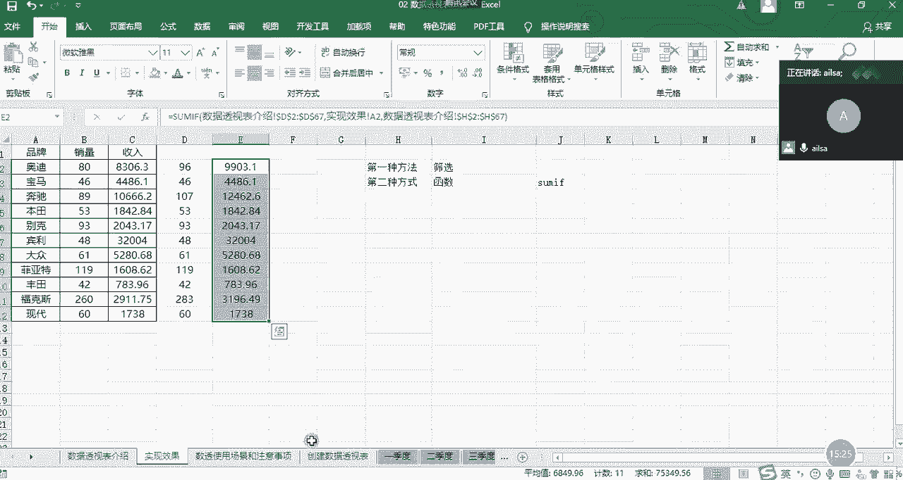

有一定要求的，因为它列明要放在这里进行一个分类，所以说我们的第一个注意事项就是，它的列名不能为空，不能重复，因为你重复了它就识别不了你到底想干嘛，为空的话，它也不好去识别，所以说列名要保证完整啊。

而且不能重复，这是第一个，第二个的话就是我们尽量在我们的数据表里面，不要有空值啊，不要空值，然后这样的话，就是避免我们在进行数据透视的时候出现啊，就是就我们叫可以叫残缺值，或者叫嗯错误值这样的。

所以说我们可以填充为零啊，保证我们的数据完整，就是这里面的数据的话就有点，因为这里面设置了哈，设置了一个零就显示斜杠的这样的一个操作，哈啊啊，所以说啊我们尽量把它保持完整啊就可以了。

就跟我们数据库里面的数据一样啊，啊就是正经的流水流水账的那种啊，标准的一个数据格式，还有就是不能用合并单元格，因为我们都知道哈，比如说在这里我给大家讲，在这里我给大家加了一个合并单元格。

我给大家看一下合并单元格的原理啊是什么，我们把鼠标定位到这里之后，我们看到这里一五啊，一五代表的是这个合并单元格的上面的这个，也就是说你在所有的合并单元格当中，它只会默认左上角的这个东西。

如果是两列的话，它也会默认左上角的这个东西，那如果对于多列而言，其他的列它会默认为零啊，而且它会影响到还有数据透视的一些操作啊，就比较麻烦一些，有可能它的车型啊就有一个为空的，那你就不知道是什么东西了。

所以说啊不能有合并单元格，还有最后一个就是要保持数据的类型的一致，特别是数值型数据而言，为什么这么说呢，如果说你这个里面的数值，它你存了文本格式，那你在进行计算的时候，它是不参与计算的。

那你这个预算出来的数据就是错的啊，所以说尽量保持我们的数值型的数据，都是数值类型的，而不是文本类型，特别是文本哈，它完全识别不了啊，完全识别了呃，那个文本类型的啊这样的一个数据。

所以你只要满足这几个条件，那你在做数据透视的时候，它就是啊比较完整啊，比较正确啊，然后也是比较能够符合我们所想要的效果的啊，这样的一个结果啊，数据透视有这几项要求。

那我最后再说一下数据透视的一个应用场景哈，什么时候唉我们需要用到数据透视啊。

往下稍等哈，我看嗯。

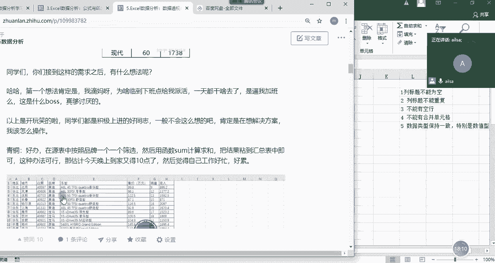

啊首先呢就是我们的数据量比较大啊，我们在进行函数的计算或者操作的计算的时候，比较繁琐的时候，我们就需要用到啊数据透视，第二个就是我们希望快速的制作整理啊，分析各类报表的时候也是需要的。

然后还有就是数据源经常发生变化，并且要经常分析和处理最新数据的时候啊，我在下午的时候会给大家讲，我们如何进行数据的更新啊，数据源的选取啊等等这些，然后还有就是像快速洞，洞察数据背后存在的意义的时候。

我们就可以用数据透视，其实简单来说。

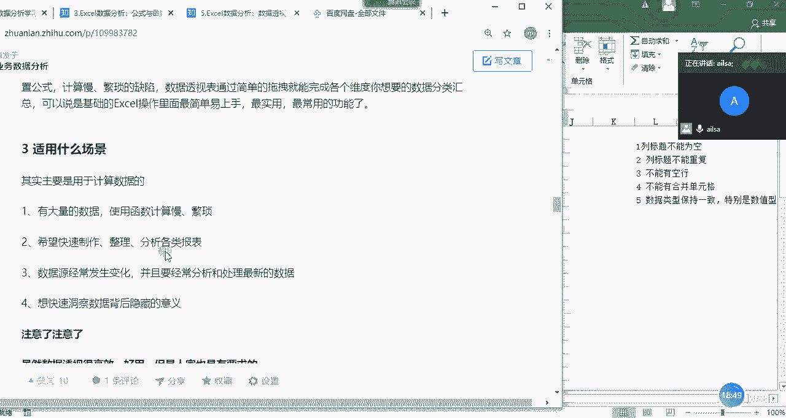

它就是对数据进行一个快速的分类汇总计算，然后达到我们所想要效果的这样的一个目的，这就是我们的数据透视啊啊那我们看一下哈啊，什么是数据透视表啊啊我等会会把这个补全，我在这里就不详细说了。

然后大家对于数据透视表的创建，有什么问题没有，嗯没有问题，扣一，其实特别简单对吧，你直接选择插入，然后选择数据透视表，然后再把你想要的字段拖进来就可以了啊，啊三步走啊就可以了就可以实现了，好吧嗯OK哈。

那我们下午的时候啊。

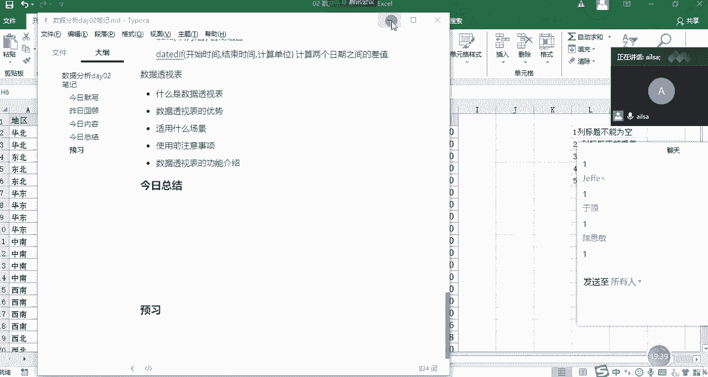

会讲解数据透视表的其他的功能，然后包括我这个知乎文章里面写的所有的功能，我们都会讲完，然后讲完之后，然后大家就可以写作业了，然后下午我们是三点开始啊，大家对这个有什么问题没有。

