# 强推！这可能是B站最全的【Python金融量化+业务数据分析】系列课程了，保姆级教程，手把手教你学 - P48：12 数据透视表常用功能 - python数字游侠 - BV1FFDDYCE2g

那接下来我们就讲解数据透视表的啊，一些呃呃常用的功能啊，我这边给大家记录了几种情况，然后我们可以根据这几种情况进行，每一个问题的解决，然后它对应的也就是我们数据透视表的，相应的功能的操作哈。

呃下面那我们接下来演示的时候，还是以一张单独的数据透视表进行一个演示，这样的话我们会更加清晰一些，OK我们先看第一个问题啊，数据记错了需要更改，该怎么更新数据透视表，OK我们想一下，比如说现在给了你啊。

这还有筛选，我把筛选取消一下啊，强迫症患者，OK那现在这样的一个表格，我们首先给他建立一个数据透视表对吧，我们在新的工作表当中给他建立一个，这是一个新的啊系统，11这是一个新的啊工作表。

然后我们模拟一下刚才的场景，比如说别人告诉你这个数据存在问题，什么问题呢，就是这个销量啊啊奥迪的销量不是25，而是30就少了五个，对不对，那我们刚才知道奥迪的销量大概是113，对不对。

那啊不我我得我得先创建完之后再改哈，K25哈，我们先啊给大家看一下我们的整个的一个品牌，它的销量的啊，计算OK奥迪是啊，怎么变成96了，OK没有关系哈，96就96哈，OK奥迪现在的一个销量总和是96啊。

那接下来啊，我把这个数据改成30，他记错了，改成30，那你看我这里面肯定是不变的，对不对，因为我已经创建好数据透视表了，那我该怎么去操作啊，啊我刚才的操作是什么呀，把它删掉，再重新建一个数据透视表。

是不是，那这样是不是好笨呐，是不是，我这个每一次，如果说我这个数据透视表特别复杂的话，我每次建完了之后数据更改了，我要重新再拉一遍，岂不是很麻烦吗，嗯那我们也有自己的操作方式哈，我们不用删除。

怎么来操作呢，大家往上看诶，这有一个数据透视表工具啊，你看我把鼠标定位到这里，它就没有了，对不对，这个功能区域好厉害啊，怎么怎么一会儿有一会儿没有啊，这又是一个什么样的功能区呢，这个叫啊这个呃。

这这是叫一个上下文选项卡，诶你看上文下文叫上下文选项卡，那这个上下文选项卡呢，它是针对某一些特定的功能而出现的，也就是说如果说你的鼠标没有定位到这里，没有数据透视表这样的一个功能。

它就不显示你定位到这里，它才会有这个功能，那我们看一下呃，它是否有更新的功能，它现在还是96，是不是我们点分析，然后我们看有一个刷新，我们点击它，然后点击全部刷新诶，你看96+5是不是101。

我们的数据就发生了变化，也就是说如果说你的数据，你的整个的一个原数据里面的，某些数据发生变化了，你只要在啊上下文选项卡当中的分析标签，下面的刷新啊，点全部刷新就可以了啊，大家不用区别它俩之间的关系啊。

点全部刷新就可以了，然后它就会实现我们所有内容，内容的再次更新啊，大家对于这个问题啊，我刚才讲的这个有什么问题没有，OK没有什么问题给我扣一，就是我们的数据刷新功能，好的嗯好的，没有什么问题。

那我们再讲第二个现象啊。

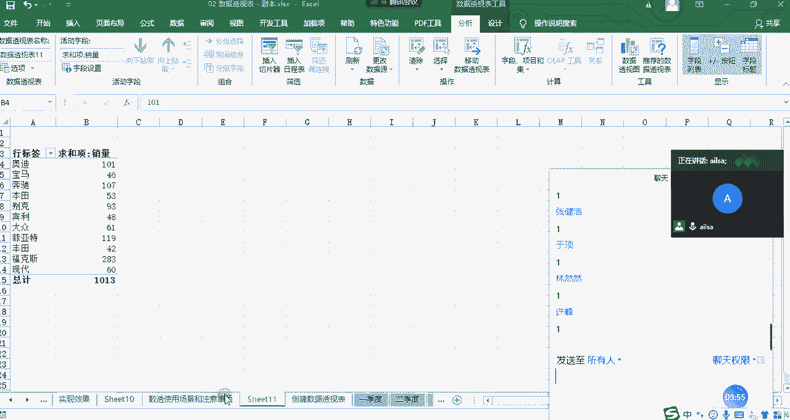

第二个现象是什么呢，就是我们刚才的是数据记错了，那现在呢就是数据源的内容啊，新增啊，新增了新增一行或者一列，那数据透视表它会不会啊，需要我们再进行一个刷新呢，或怎样呢等等一系列的操作啊。

那比如说啊我们新增呢分两种情况，第一种情况是在我们的数据区域的内部，进行一个更新哈，大家看清楚了，现在呢我给奔驰啊，奔驰加点内容，现在我选中它，然后我们看一下奔驰这边的呃，呃销量是107。

然后我给它加一列啊，加一行，然后我们的销量看到没有，是七，对不对，Ok，那相当于说那奔驰这边的数据应该再加上七，才可以，那我们再看一下，回过头来我们看一下啊，奔驰的数量发生了变化吗，刚才是多少。

啊发生变化没有，我刚才忘记了，啊奔驰的数量有发生变化吗，需要再更新一下，对不对，我们再更新一下试试看哈，这个时候我们点击分析，然后点击刷新，OK啊，需要更新一下。

我们会发现如果说我在数据的内部增加了一行，那我只要在这里边刷，点击刷新，它就会把这个数据更新出来，对不对，那接下来我再说一种情况什么呢，就是既然在内部可以，那我在底部可不可以呢。

也就是我们的数据区域的边界，哎我们看一下我对福克斯这辆这这种车型哈，然后进行一个添加，我们看到销量是增加了23，然后我们在这里看一下福克斯是283，我们看数据有没有发生变化，点击刷新，全部刷新，诶。

怎么还是283，OK大家告诉我这是什么原因，嗯现在大家可以畅所欲言，为什么我的一个宝马的数量啊，而不是啊奔驰的数量能刷新发生变化，而嗯福克斯却不行，是因为车的问题吗，啊是因为人车好吗，还是怎样啊。

大家有什么想法没有，OKA对，很很好，是因为什么呢，你看我们在进行啊数据透视表的时候，我们有我们的一个数据源，对不对，我们看一下我们的数据源。

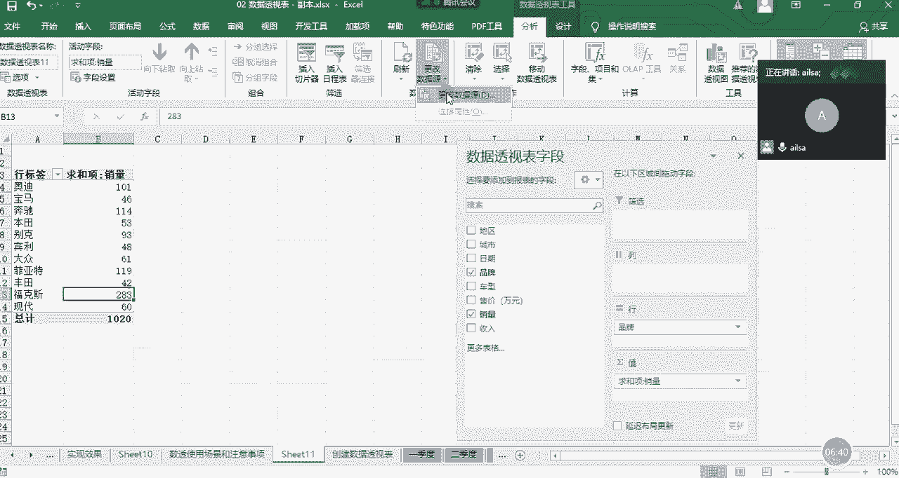

他选择的是A1到H68，A1到H68到哪到这里，也就是说我们在最开始创建了，创建的时候，我们已经指定好了这个区域，那我在它的区域内部进行一个添加的时候，是完全没有问题的，因为它都属于这个范围之内。

但是如果我在它的外部添加了一行之后，那不好意思，我就选择不到了，所以说面对这种在底部或者是边上，进行一个添加的时候，你需要做的操作是啊是什么呢啊。

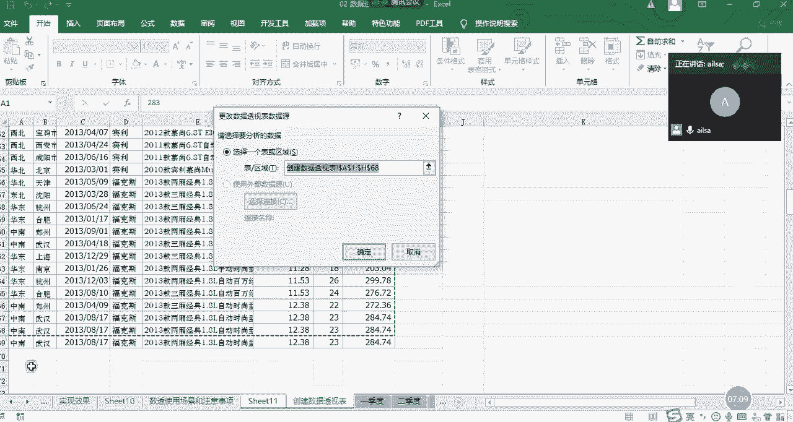

选择分析，然后选择更改数据源。

你要把它数据源进行一个重新的划分，划分到69。

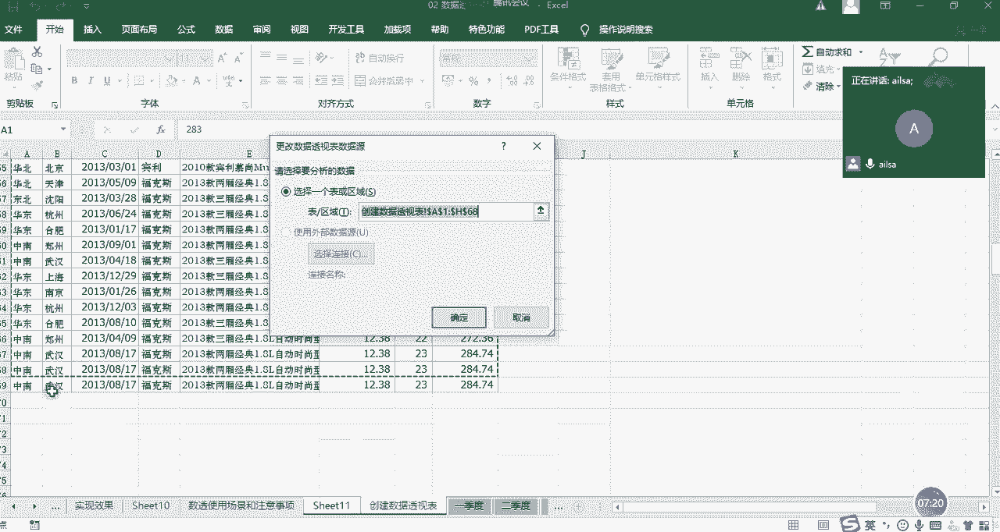

然后点击确定，我们再回过头来啊，看一下福克斯的数据是不是已经发生变化了啊，这就是我们对于前两种情况的一个区分，一个是啊，一个是更新数据啊，一个是更改数据源这样的两种操作啊，大家不要小看这个啊。

大家不要小看这个这个现象哈，我现在给你们把这个问题抛出来了，你们才会发现，但是如果说你初初学这个数据透视表的时候，你可能添加了一行，你真的不知道它为什么数据还是不对啊，有时有可能你核对了半天。

因为你对它的一个底啊，就是它的一个呃，呃介介就是它的一个整个的一个原理，不是特别清晰的时候啊，就有可能会犯这样的一个错误，嗯啊我见过很多同学啊，他们第二个问题，然后实现不了数据一直错的话。

他们采取的采取的方案很简单啊，删掉重新做就是了，好的对啊，这样的话数据就对了啊，他们有时候还挺可爱的，然后还找到我说唉，为什么我第一次做的时候就是好的啊，就是不好的，我删掉它还要重新做就好了呢。

而是因为它不能更新的能力吗，啊其实嗯嗯呵呵，简单暴力，是的啊，啊就是因为你可能对某些小点不了解而已啊，啊人家数据透视表没有那么傻啊，人家也很智能的好吧，那我们前两个问题就讲完了，我们讲第三个问题。

第三个问题是想要对计算的结果，按照一定的顺序排序怎么办，哎我们看一下这个是什么样的一个场景哈，你比如说现在我统计出来了这些啊，不同品牌的车呃，车的一个销量，现在我就想看一下哪款车的销量最高，对不对。

那我想对它进行一个排序，怎么排呢，唉我们想我们最啊，最原始的方法就是用我们功能区的排序方式嘛。

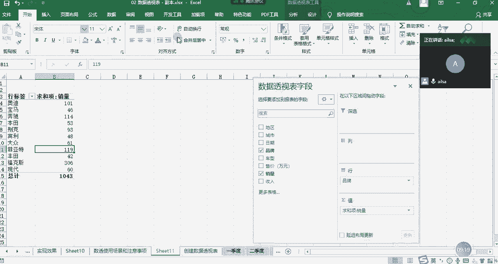

对不对，那我们功能区的排序方式，我们先选中它，然后在我们的排序和筛选当中点降序，对不对，点击哎，它提示我你不能这么干对吧，我是数据透视表，我不是你普通的一个一些报表啥的啊，你不能这么干啊，好吧啊。

那不能这么干，我怎么办呢，我们看诶这有个下拉小三角，我们去看一下，我们点选它，哎发现这不是能升序和降序吗，我们选择降序耶，这数据好像没发生变化诶，但是我们看一下这个行标签，现代是X对吧，奥迪是A。

他好像是把这个行标签进行一个排序了，但是我想要的是销量进行一个排序，对不对啊，这个升序和降序不好用诶，我们看到还有一个其他排序选项，我们点进来，我们在这里可以看到哦，原来可以在这里哈。

比如说我们可以选择升序或降序，然后就有两个选项，就是我们的列标签，大家看到没有，是我们的列标签，一个是品牌，一个是我们的啊，求和项销量，那我们是按求和项销量来进行排序的，点击确定。

OK那我们整个那个销量排序就出来了啊，这个功能也有很多人不知道哈，他每次啊，那我跟大家说，如果说别人不知道这个功能该怎么，别人该怎么做哈，很简单，我不能在数据透视表里面去排序，简单啊，我把它复制出来。

单独到一个表里，我在excel里面排序不行吗，啊当然也可以哈，但是如果你想，你想在对这个数据透视表，再进行其他的操作的时候，你做出来之后还要再重新进行一个排序，就比较麻烦一些哈啊。

OK大家对于这个排序啊了解了吗啊，如果没有问题，给我扣一，哎ice思密有什么问题吗，好的啊，没有问题的话，我们接着看第三个现象，好第三啊，第四个现象就是想要在数据透视啊，的基础之上增加计算列啊。

以及啊想要在数据透视的基础之上增加计算行，我们看一下这两种情况是什么样的一个需求哈，首先呢啊我们这边嗯好，我们这边再拉一个收入哈，再拉一个收入，这边是收入和销量，现在呢我想我想计算一下。

就是它的整个的一个单价啊，到底是多少哈，就是收入除以销量这样的一个计算方式哈，叫均价啊，我们可以理解为是均价啊，啊我在这里面只是模拟一个场景哈，我想就是我想在数据透视表的基础之上，增加一个计算项啊。

啊这个时候我该怎么去操作，有的人说那不简单吗，直接等于收入除以啊，销量不就可以了吗，这还用教吗，是不是哎没有毛病哈，我们往下拉看一下，不行啊，这个这个实现不了，因为它本身我们可以看到这个公式就这么长。

所以说他不能这么干呃，数据透视它本身提供了啊，这样的一个功能是在我们的啊，上下文选项卡当中啊，我们给大家去看哈，首先先记住第一个问题，我们想对某一列啊，某两列或者多列进行增加一列的计算的时候。

我们的鼠标应该定位到我们的列方向上哈，定位到这里，定位到这里都可以哈，这也可以，然后在我们的分析里面有一个字段项目合集，我们点击它有一个计算字段，然后在这里呢在这个计算字段的对话框当中啊。

我给大家演示一下该怎么去实现，很简单，首先名称的话，我们就输入是均价，这个是自定义哈均价，然后公式呢公式大家看到没有，它有个限制条件，它必须是字段之间的一个关系，看到没有。

所以说我们的应该是收入额除以销量对吧，这就是我们的公式，然后我们点击确定啊，OK是然后进行一个替换，这样它就出来所想要的效果了，这就是我们的一个均价的计算啊，那你看它是不是在列方向上增加了一列。

这就是叫计算项啊，我为什么要强调在列方向上叫计算项呢，因为在行方向上它就不叫计算项了，我们看一下在行方向上出现什么样的一个啊，新的啊，新的名词嗯啊我们在定位上，我们看我们把鼠标定位到列方向的时候。

它这里面是计算字段哎就没有了，我们哎看到有个计算项是灰的，对不对，那计算项其实就是对于行方向而言，那我需要把鼠标定位到我的行方向当中啊，定位到行方向当中，然后再选择它，看到没有计算项就可以使用了。

我们点击它之后，那他既然是在行方向上的，所以它只能针对行之间的一个关系，进行一个计算，我们这边可以计算一个差值啊，差值计算什么呢，计算啊，宝田啊，宝马和丰田和宝田，宝马和丰田之间的一个销量的差异。

哎我们可以试一下哈，他们之间的一个啊各个数据的一个差异吧，我们可以试一下，首先它的公式就是我们选择宝马啊，宝马OK选择它，这就是我们的一个内容减去我们的丰田啊，点击这个，然后点击确定就可以了。

你看新增了一个差值，然后它的差它的销量的差值，它的收入的差值以及它的均价的差值，就可以实现了，这就是我们的计算项和啊，这就是我们的计算字段和计算项啊，大家对于这个听明白了没有，嗯啊这个功能不常用哈。

你只要知道就可以了啊，如果说嗯就是我跟大家说一下，如果说我们在啊以后的工作当中，他问到了excel啊，excel的一些啊高级点的技巧的时候，你就跟他说excel呃不呃，excel数据透视表。

哎我这边经常用啊，它不仅仅可以进行一些分类汇总，它还可以啊新增一些计算字段和计算项啊，如果别人知道的话啊，如果别人不知道，他就不会往下问了，如果别人知道，他可能还会问一下。

那你给我说一下这个计算字段是怎么来完成的，你就可以跟大家说一下这样的一个效果，如果他不知道，他绝对不会问的哈，因为呃呃因为他不知道到底是怎么来实现的，他也不敢问啊，这个很正常，OK这个问题讲完了之后。

我们接着往下看下一个问题啊，就是啊第六个了，如何动态筛选数据透视表的内容哈，这个啊我们用的是切片器啊，切片器啊听起来特别特别高大上哈，特别是我们在面试的时候跟别人说啊，我会切片器啊。

别人就觉得哦好像挺厉害的样子哈，我们把这我们只显示销量哈，这样会比较简单一些，然后我们把啊地区拖到啊我们的行方向上，哎大家看到没有啊，我们就显示了这样的一个格式哈，这样的一个格式之后嗯。

有没有人觉得说不好看啊，好我先问一下哈，大家觉得好看吗啊好看的扣二老扣一啊，不好看的扣扣扣一，好不好看是吗，OK不好看，我们可以调整一下哈，最后还是扣个一哈，我给自己挖了个坑，OK啊。

我们可以调整哈啊就是因为你们要说不好看，所以我要进行一个调整哈，不然的话我们没法往下讲了，首先大家看一下啊，大家看一下啊，我们该怎么去调整呢，这个其实是一个缩减的一个符号啊，这个其实如果说没有啊。

在excel当中见过的话，还觉得挺高大上的，其实用不着哈，用不着啊，我们可以把它去掉，在哪去掉呢，在这里啊，大家看到没有，这是不是灰的呀，灰的代表选中的意思啊，这里的灰是代表选中的意思，我们点选它诶。

就没有了啊，就没有了嗯，然后我们现在的操作，不是要对这个格式进行一个调整吗，那我们这个数据透视表这个字段，这个这个呃对话框就不需要了，我们就可以把它删掉了，对不对，我们把它删掉啊。

然后那这样的一个形式呢，其实还不是我们日常生活当中看到的，比较顺眼的这种形式，那我们还可以再进行调整，你比如说我把它转换成列表的形式，那是在我们的设计里面啊，设计里面有一个报表布局，我们点击它。

然后是以表格的形式呈现，那我们以表格的形式呈现的话，唉他下面有汇总什么的，如果说我们不需要汇总啊，我们不需要汇总，我们还可以取消掉，那在哪里呢，也是在呃我们的设计选项卡下面的分类汇总。

这里我们显示不显示分类汇总就可以了，那其实我们刚才也有说到，对于我们展示类的表格的话，我们是希望它能够合并单元格，这样看起来更美观一些，对不对，那我们想让它合并单元格嗯，怎么来操作呢啊一个个合并吗。

还是用我的那种快捷方式啊，当然都不是哈，嗯数据透视表自己有哈，在哪呢啊这个很少有人知道哈，在分析里面啊，在选项里面再点一个选项啊，然后在这里啊，在这里啊就是布局和格式。

这里有一个合并且居中带标签的单元格，我们点击确定啊，大家看到没有，它已经呈现出这样的一个效果了，这个相对来说的话，是我们对数据透视表进行了一个格式的啊，略微的一个调整哈，啊相对来说会比较美观一些啊。

啊这么去调了一下，大家觉得还可以吧，O啊非常好啊，我就等着大家问这个问题呢，哈啊啊我我先问一下大家，这样去调整了之后，是不是跟我们日常见的表格会类似一些，也就是有点类似于我们做成的一个。

现有的数据报表的一个形式，对吧啊，如果觉得OK的话，点一哈啊扣一，OK哈OK那我再解答啊啊解答，刚才你们也不用真名哈，我又忘了那谁了哈，是间号啊，不是减号啊，好吧，那我回答这个问题哈。

对话框删掉之后怎么打开哈啊当我啊，当我第一次哈，或者是前两次使用数据透视表的时候，这个问题困扰我了很久嗯，我每一次啊，觉得他的那个对话框特别碍事的时候，我把它删掉了，我就永远都找不到。

后来我只能啊我只能怎么操作呢，把这个删掉啊，就是把我的整个数据透视表全都删掉，然后重新建一个，它不就出来了吗，啊对呀，你这种方式就很简单呀，但是你不觉得很傻吗，你好不容易调整好了格式。

完了之后你要删掉重建，对不对，那当然他肯定能删掉，肯定也能显示啊，不然人人那么傻嘛，对不对，所以是在这里哈，大家看到没有，我点一下要出来了，再点一下它就删掉了啊，点一下点一下点一下点一下，明白了吧。

明白了没，同志们明白了，给我回复一下，刚才问的那个同学，好的嗯好的好的嗯好的，大家知道在这个地方哈，就是你只要点一下它就会显示，再点一下它就隐藏了，包括加号啊，还有字段标题哈，这个我一般这个都会显示的。

嗯啊那我们再接着往下说，就是我们如何对这个表格啊，对这个数据透视表如何进行一个筛选啊，第一个高级筛选的功能叫切片器，好我把这几个字儿砸上哈，什么叫切片器哈，听着很高大上啊，那啊，它在数据透视表当中。

也是属于比较高大上的一个部分了哈，点击分析，然后点击哦，我看看啊，嗯插入切片器，看到没有，插入切片器，然后这个插入切片器，它什么叫切片，我们都学过切片哈，它是选取一部分类似于筛选的功能。

这个它的意思就是你要根据哪个字段进行切啊，我们是根据地区和品牌进行切啊，当然你可以啊，根据你自己的需要进行一个选择，点击确定，这个时候大家看到出现了两个啊切片器啊，我该怎么去操作呢，大家看我操作哈。

首先我点击了东北，看到没有，这边只显示东北，这就叫动态显示图表，是不是特别简单啊，动态显示表呃，那个嗯那个数据透视表哈，再点击华北，OK这显示华北，有的人说我既想看东北，又想看华北，没有问题。

我们按住CTRL键选择就可以了啊，这样是不是东北和华北都出来了，然后你还可以看这两个地区下面的不同的品牌，比如说我只想看奥迪A，它只显示奥迪啊，本田啊，别克宾利诶，你看他是不是只显示一个地区啊。

那说明另外一个地区没有啊，哦是这个意思啊，啊是这个意思好吧，这就是我们筛选啊，这是我们的切片器，如果说你这个条件不想要，你可以直接点上面的一个叉啊，叉掉就可以全部都选中了，这个点差诶。

全部都选中选中出来了，然后比如说你只想看宝马，这个时候他会把宝马所定的地区全部都出来，本田啊这样的一个筛选啊，是不是啊非常的好用，就是我们的切片器啊，其实讲完之后你会觉得啊，也没有自己想象的那么难啊。

就你会发现啊，大家如果听明白这个切片器了，还有我刚才的讲的那些内容的话，给我扣个一，好的嗯，呃其实我跟大家说，当我们对某一个知识领域不懂的时候，我们总结了说它是不是特别难，或者是说啊特别啊可望而不可及。

但你真正接触了之后啊，你会觉得啊好像也就这么回事，也没有那么难啊，啊跟那个嗯跟大家大家认识新朋友是一样的，比如说你对一个朋友不是特别熟的时候，你就觉得说我去他也太优秀了，然后这也好那也好的时候啊。

但是但是当你真正的跟他成为好朋友，好哥们儿的时候，你会发现他臭毛臭毛病一堆哈，其实是一样的，唉也就那样啊，大家大家都是普通人嘛啊是这个意思哈，所以说啊数据分析啊，也不是说啊特别可望而不可及啊。

还是很接地气的啊，我们可以看得出来，OK我们接着往下走哈，接着往下走啊，然后啊如何根据某个类别拆分多个工作表啊，这个是什么个意思呢，啊是这样的啊，对于这个切片器啊，我们讲到这之后。

有的人说哎呀我不想要了，我怎么删掉它呢，因为你会创建你的，你就得会删除啊，不然的话摆在这咋整，你又把这个数据透视表删掉，重新做吗啊，当然不需要哈，大家看到没有，我现在没有选择它的时候，它是正常的。

我如果一选中它，它的四周是不是有一个小框框啊，我们直接按delete键啊，就删掉了哈，按delete键啊，这是比较啊比较快速的哈，按delete键直接就删掉了啊，这样的一个操作方式，那接下来我再讲啊。

就是我们的如何根据，比如说现在我想根据这些地区，让他们每一个地区都生成一个工作表，然后发给不同的地区负责人，那这个工作其实在我们呃，在我们的实际当中也会啊，有这样的一个工作内容，比如说有那个分公司啊。

这样的一个数据的拆分，那我该怎么去实现呢，它这个是需要用到我们的报表筛选功能唉，我们可以看到这里，然后我把地区拖到我的筛选这里，然后我们可以看到啊，现在它在这里面已经没有显示了。

它放在了我们的筛选功能下面，然后我在这里面可以进行一个下拉选择，东北哎，它又出现在东北，选择华北，它又出现了华北，有的人说我想选东北和华北地区呢，那你可以选择选择多项唉，然后选择东北和华北地区两个地区。

那现在我想根据这两个地区，生成两个不同的excel表啊，那这个时候我们需要的做的操作是这样的，选择分析啊，选择选项下面有一个显示报表筛选页，点选，你是不是要对地区进行一个筛选和生成确定啊，大家看到没有。

东北和华北地区，分别的数据已经出现在这里了啊，这就是我们所想要的一个效果啊，这个是生成报表哦，报表生成筛选页这样的一个操作啊，好吧啊，在这里还可以再进行多次筛选哈，OK啊那大家对于这个听明白了没有。

就是生呃，就是拆分啊，拆分表的这样的一种形式，啊还有人笑咋滴啦，啊如果啊如果没有问题扣一哈，我们接着往下讲，好的嗯嗯好的。

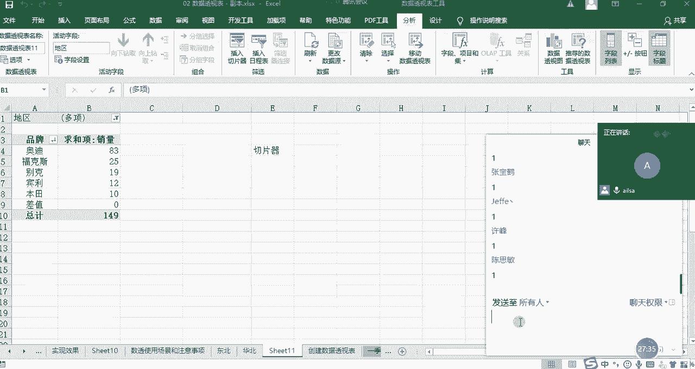

我们接着往下讲啊，讲最后啊，呃呃最后两个问题就是如何合并多个excel表，那这个需求是这样子的啊，比如说现在有第一季度的表，第二季度的表，第三季度的表，我们会发现它的表啊格式都一模一样。

现在呢我想让你给我分析一下，前三个季度的一个汇总表啊，有的人说啊，我们学过什么啊，复制粘啊，复制选择性粘贴加和这样的一个形式，因为他的姓名的顺序也都一样啊，当然你那个操作也是没有问题，那在这里。

我教大家一个数据透视表的高级的操作，叫多重合并哈，好多重合并，然后我们这个操作方法呢，首先我们要一个多重合并的一个对话框，它这个功能的话，在我们的前台的功能区当中是没有的。

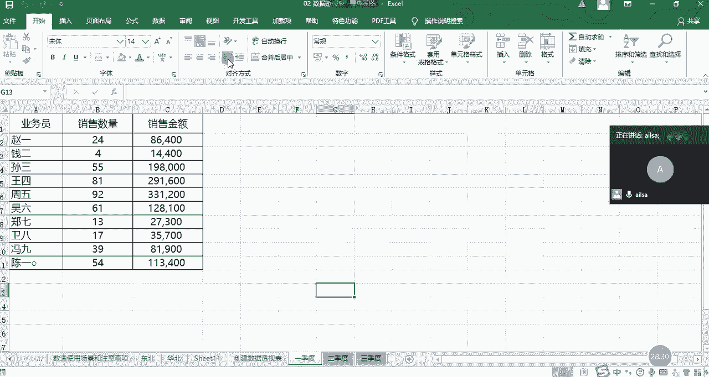

所以说你需要设置一下，怎么去设置呢，就是点我们的文件啊。

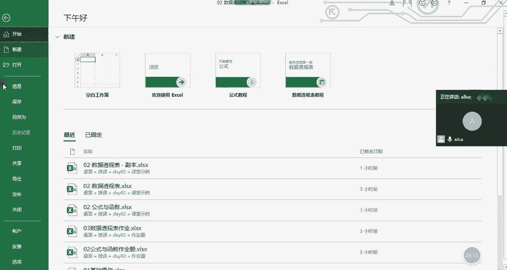

点选项啊，然后有一个自定义功能区啊，然后在下拉当中有一个不在功能区的命令，我们再往下走，往下走啊，要拉好多嗯，我们看到没有数据透视表和数据透视向导，这个我们要把它拉到我们的整个的，你看这些。

就是我们整个的一个前台显示的内容当中了啊，这个时候我们需要把它拉到我们这里面去，怎么去拉呢，你首先要给它建一个组哈，因为我之前已经见过了，我在这里面要删掉它，我先删掉，我看啊，现在已经不能选择了。

好删除好，OK我先删掉，然后我选择它，我直接点击添加的话，它会提示我啊，你需要新建一个组嗯，那我该怎么去操作呢，就是说我一般习惯性放在数据下面，因为它是一个啊数据处理的一个一个方式。

所以说我们点选数据这个选项卡，然后这个分组哈，这个分组，然后点新建组，我们可以完全不用命名，然后直接点击添加它，就到这个组里面来了，那我们再回去前台看一下。

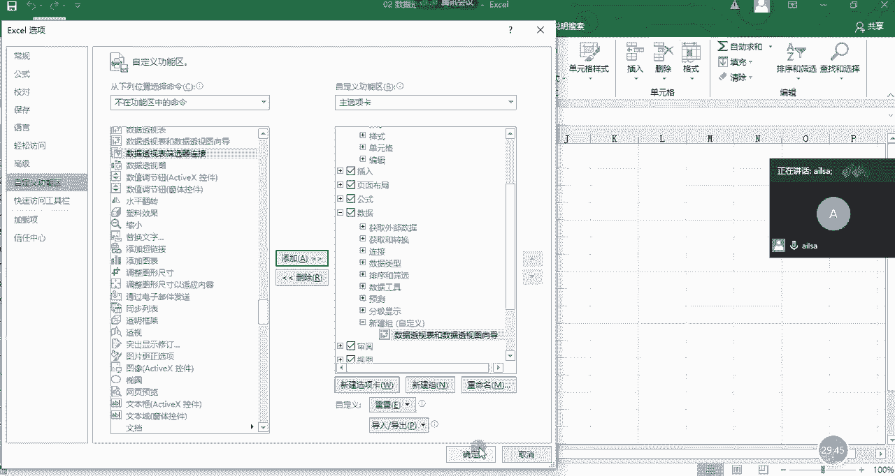

在我们的数据选项卡下面，是不是就已经有了这个数据表和数据透视表，和数据透视图向导啊，这个东西啊，我们需要有这个东西，嗯啊这个大家跟着我自己设置一下好吧，设置完了之后给我扣一。

需要我再带你们重新设置一下吗，哦可以了是吗，如果需要的话，我可以再重新演示一遍啊，如果不需要的话，大家直接给我扣一就可以了。

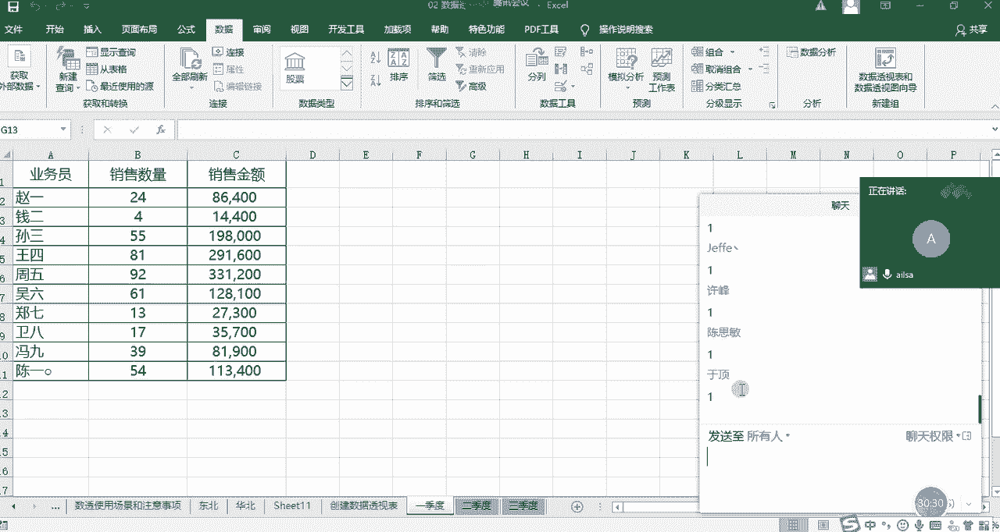

啊就是在我们的文件选项卡下面嗯，然后有一个选项按钮。

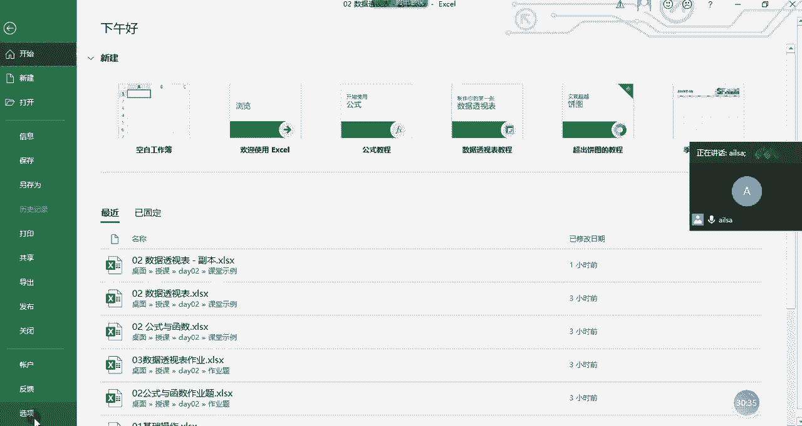

然后有自定义功能区，然后我们大概拉到中间部分啊，我们要选择啊不在功能区的命令，然后我们拉到中间部分左右的时候啊，有一个数据透视表和数据透视图向导，我们呃要点击添加之前。

需要在我们的数据选项卡或者任意选项卡啊，你自己的个人习惯哈，然后新建一个组。

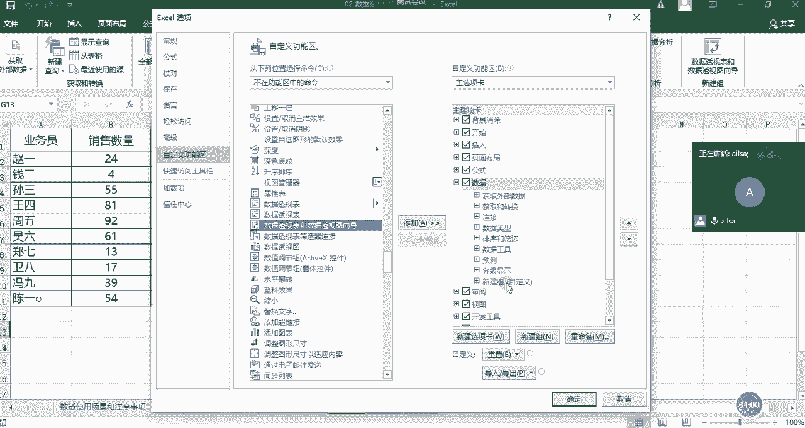

然后再添加进来就可以了啊，OK大家都实现了吗，啊实现了给我扣个一，我刚才没有看到，好的啊，那我再接下来去操作啊，还这个该怎么去实现多重合并嗯，那我再讲一下哈，如果说你不想设置这样的一个功能啊，也没关系。

因为我们有快捷键，这个快捷键是什么呢，啊你估计这会儿应该有学生说，老师你为什么不早点说，对不对，我们的快捷键叫啊alt加D加P啊，out啊，稍等啊，alt a LT哈，加D啊，alt加D加P哈。

稍等我再试一下，alt加D啊，看到没有，alt加D啊，加P啊，print的P哈啊，P好就可以了，嗯嗯我之前第一次讲这个东西的时候，有的有的学生就说，老师你这个三个键我怎么按呢，啊对不对，我们先按前两个。

然后先不着急，然后再按P它就出来了啊，所以说这个它的一个快捷方式就是out，alt加D加T也能调出来，就是你没有它也可以，你直接用这个快捷方式也能调出来，我之前以为呃一直以为他只有这种快捷方式啊。

后来我才知道他也可以在后台设置哈，这样的话其实就不用，因为我老是忘这个快捷方式，我当时记了好久啊，OK哈那我们调出来了之后，我们看怎么去操作哈，很简单了，那我们就选择多重合并A往下去走。

然后这个都默认设置，然后再点选下一步，我们主要就是在这里面选择我们的区域，然后先选择第一部分的数据区域，然后点击添加，记得一定要点点击添加哈，不然就白选了啊，再点击啊，选择我们的数据区域，点击添加嗯。

然后再选择我们第三个部分，哎你看他已经默认帮我选择好了哈，还挺智能，我们再点击添加，然后点击下一步啊，我们在新的工作表去实现这一步操作。

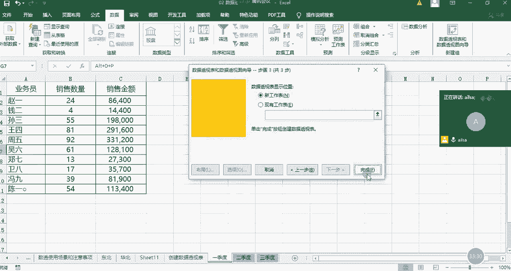

点击完成啊，看到没有，他已经把我啊，这么多人的所有的数据都已经统计好了，这就是多重合并的一个体现。

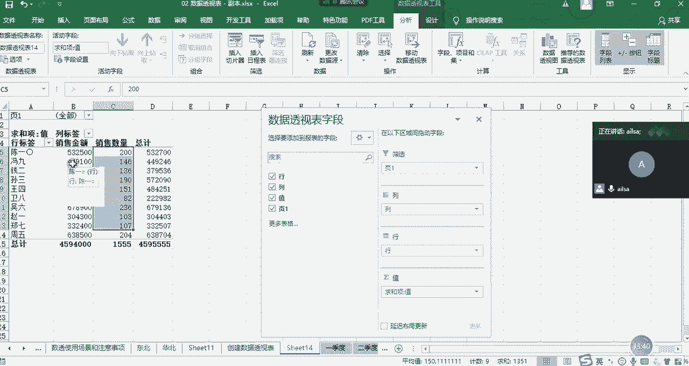

就是他可以把很多个工作表啊，的一个前提是他们的格式啊，内容啊都要极度的相似哈啊，这样的话他才能够实现这样的一个方式啊，OK大家对于这个啊有什么问题没有啊，没有问题扣一，啊这个有什么问题没有。

是我掉线了吗，哦没答没答好嘞，吓我一跳，这有延迟吗，其他人呢其他人我们讲完了，这这个就休息10分钟，好休息10分钟，然后我们讲作业题，我简单带大家回顾一下哈，OK没有什么问题。

那我们今天的呃数据透视表哦，还有最后一个哈，还有最后一个，别着急哈啊我们还有一个数据透视图啊，我们看一下数据透视图是怎么来实现的。

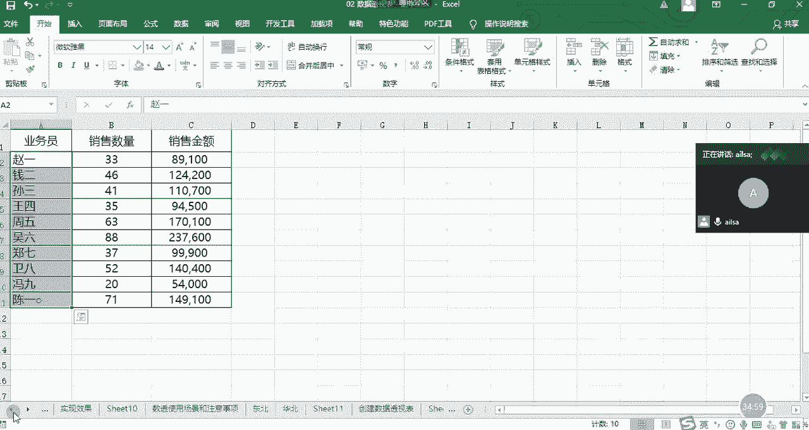

唉你看我在这里面是不是创建了数据透视表啊，啊知识数据透视表，也就是说它就是以表格的形式去呈现的，那数据透视表还可以生成数据透视图，你比如说我们就拿这个销量而言，我们点击分析看到没有，这里没有数据透视图。

我们点击它诶，好我们这边选择柱状图，最简单的，因为我们还没有讲图表，所以说我们就拿最简单的举例哈，这个先删掉，这个时候我们可以看一下这个图表，我告诉大家对于数据透透视图它有什么优点。

首先它可以实现动态的显示，在这里品牌是可以筛选的，比如说啊我取消掉啊，就选择奥迪和宝马，点击确定，点击确定，它就会只显示这两个内容，就是它可以实现动态的啊，去啊呃去显示我们所想要的效果啊，这是一个。

然后第二个的话它会显示整个的一个啊，就是它整个的一个版面的话会比我们的啊，普通的啊报表的话会更呃更好看一些啊，色彩会更柔和一些啊，这样的一个东西啊啊数据透视表啊，跟我们的这个数据透视图它们都是打包好的。

然后以及跟我们excel当中，明天要讲的图表都是极其类似的，我们先知道它有这样的一个功能就可以了，OK啊那我们这个就讲完了哈，我们把这个全选啊，这样很难看确定，OK啊，那这就是我们的数据透视图。

简单提一下哈，啊，我们来回顾一下，我们今天下午都讲了哪些东西哈。

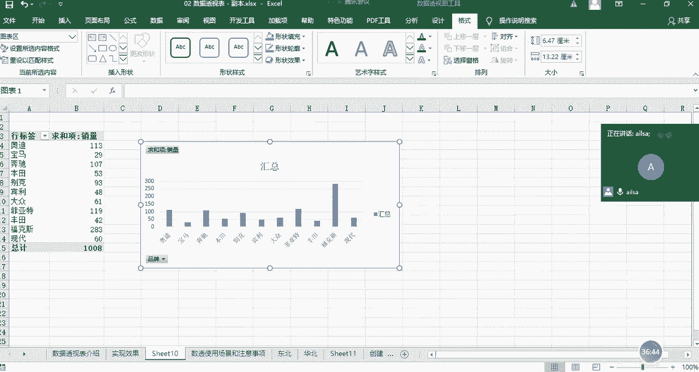

好首先我们回顾了数据透视表啊，这样的一个优势场景注意事项，那我们讲了他的哪些功能啊，我给大家总结一下，第一个就是它的啊更新功能啊，就是说我们可以对数据啊，如果有需要进行数据修改的话，我们可以进行刷新。

大家应该想起来了，刷新啊，第二个就是如果说数据源发生了变化，特别是对于边缘啊，就是我们的区域外的数据进行一个新增的话，我们需要更改数据源，好那第三个的话啊，就是我也给忘了哈。

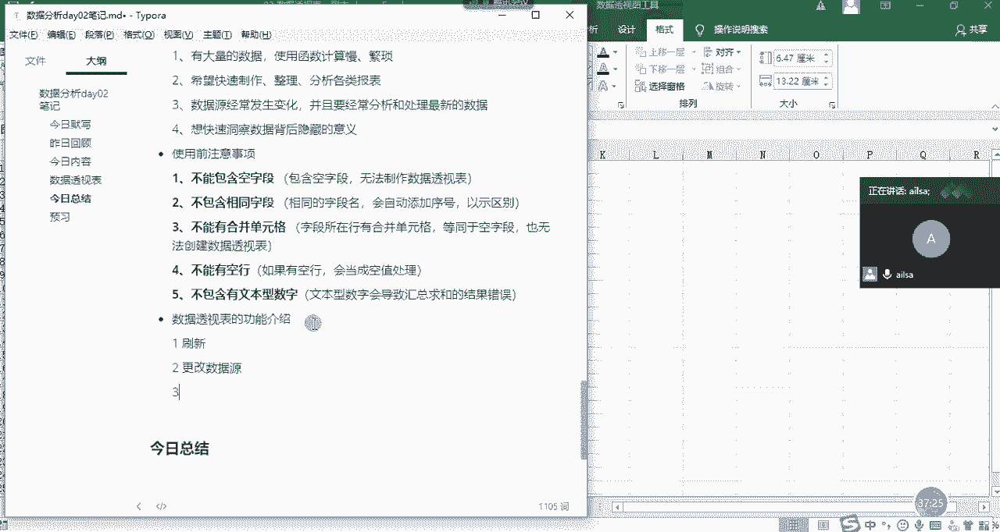

第三个。

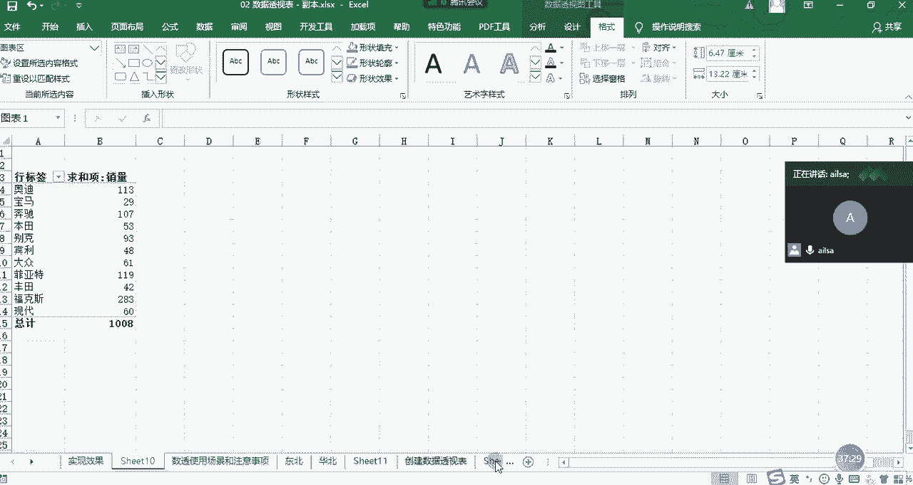

看一下第三个啊，就是我们可以对它进行一些智能的排序哈，第三啊可以实现数据透视，数据透视的排序很少有人知道哈，数据透视排序啊功能，那第四个啊，就是我们可以对它进行一个新增字段的设置。

也就是添加啊添加计算字段啊，第五个是添加字计算项，一个是针对列，一个是针对行啊计算项啊，第六个啊，就是我们可以进行一个报表或者是图啊，那个透视表啊的优化，透视表的一个啊外观的优化啊，展示这样的。

第七个啊，就是我们可以啊实现切片器啊的功能对吧，切片器进行一个动态的数据筛选，嗯切片器这个词很高大上哈，啊大家一定要学会这个词啊，你别人说诶，你在数据透视表中都用了哪些功能啊。

唉你说其实数据透视表示什么什么啊，进行一个快速的分类汇总啊计算，然后呢他这边可以实现排序，可以实现动啊，切片器实现动态的一个啊数据展示啊，然后还可以进行多重合并啊，多重合并啊啊以及它还可以建立啊。

就是比较啊比较灵活的灵活的数据啊，透视图这样的一个功能啊，这几个就是我们要讲的，数据透视表的常用的功能哈，跟大家说你掌握了这些，基本上你的数据透视表就已经玩得很溜了哈。

真的这个数据透视表是我讲的比较全的了，很多人我告诉告诉你们。

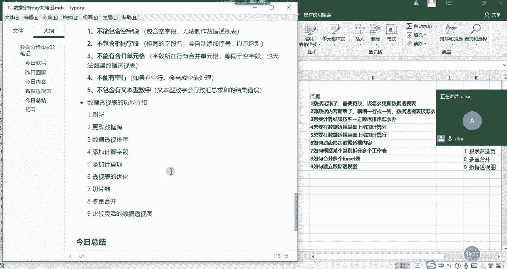

在公司当中，很多人都停留在只会见这样的一个东西，甚至说你这个呃就是就是大家问的一个问题，你这个字段列表啊消失了，怎么去显示，很多人都不知道，因为它只要实现它最基本的功能就可以了。

没有人这么有像我似的有闲工夫去研究，研究的那么深哈哈，所以说大家今天把数据透视表学完了之后啊，相当于是它的常用的功能啊，包括一些不常用的也都掌握了啊，好吧，那家大，那大家对于这个啊数据透视表啊。

目前讲的所有的内容还有什么问题，没有没有问题，我们就休息了，啊没有问题给我扣一，OK没有哈没有，我们就休息10分钟。

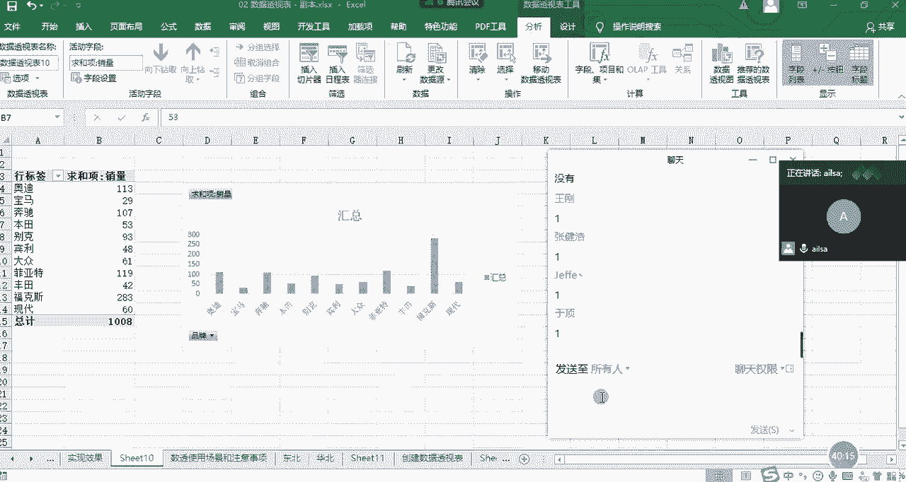