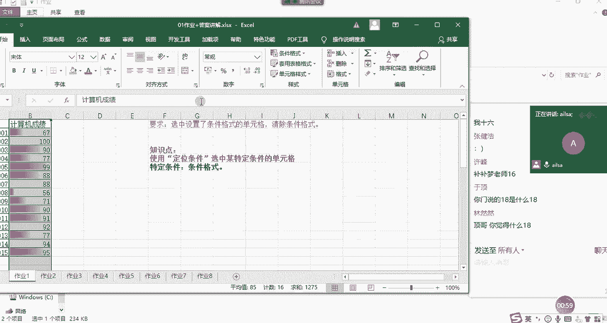
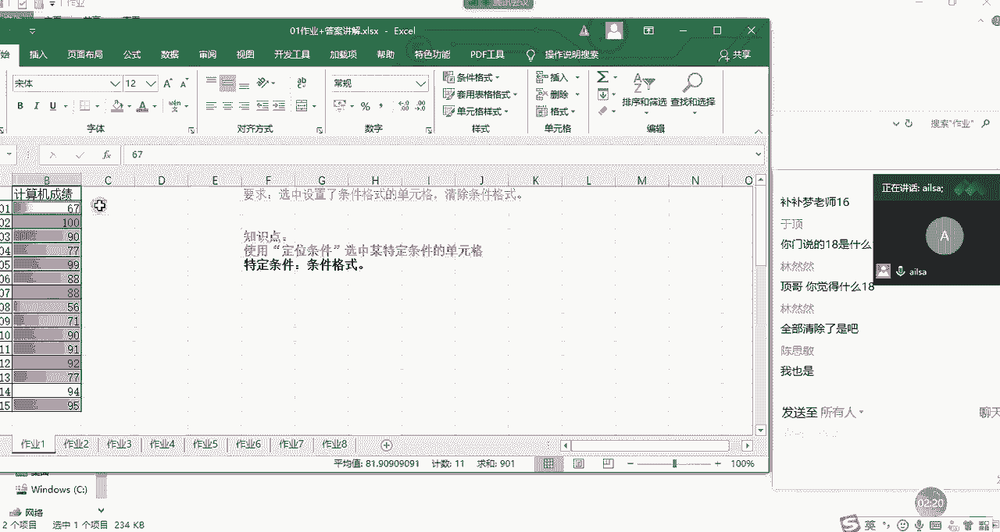
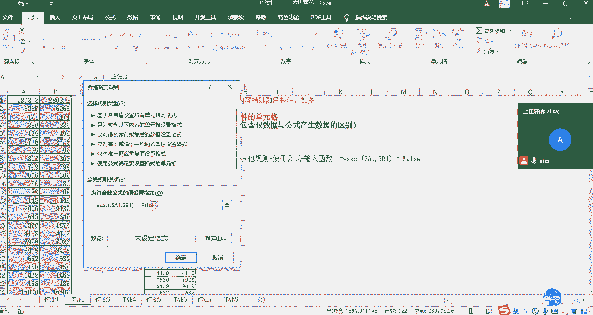
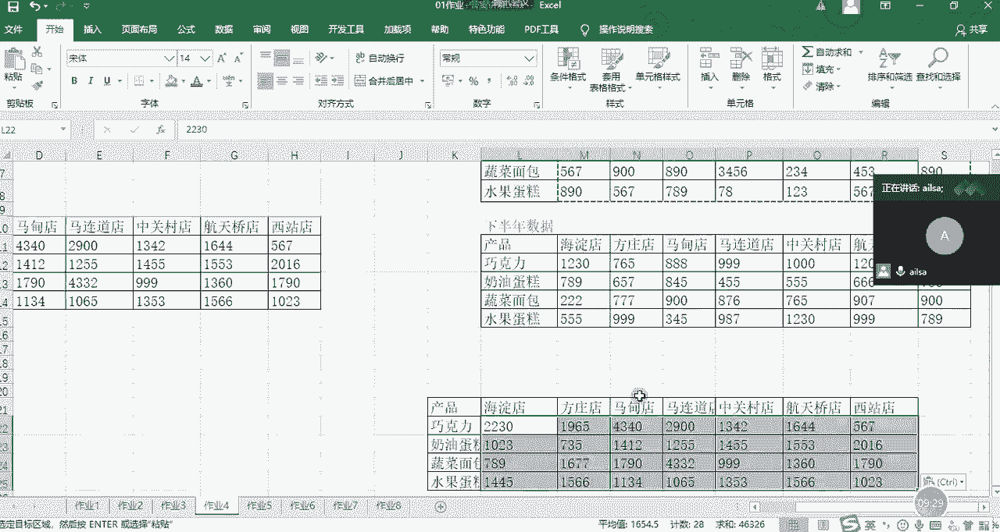
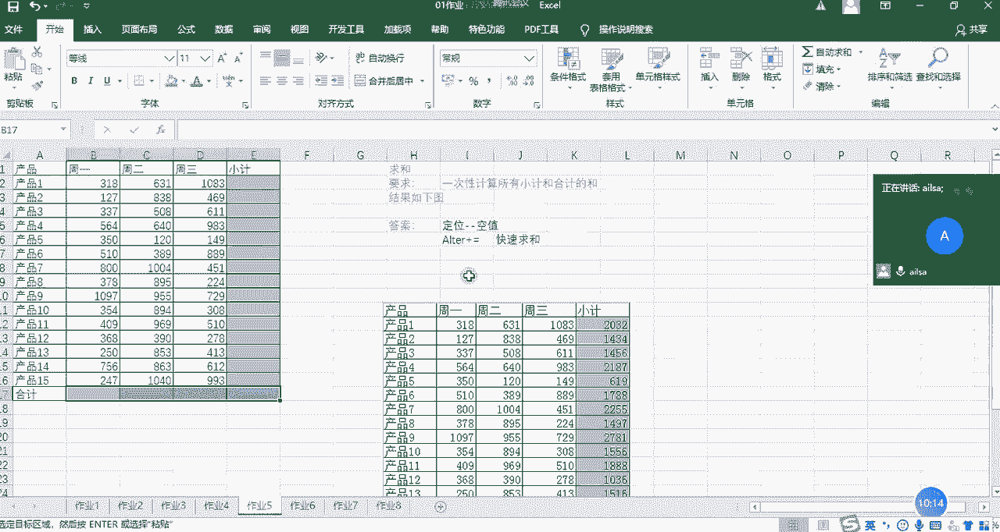
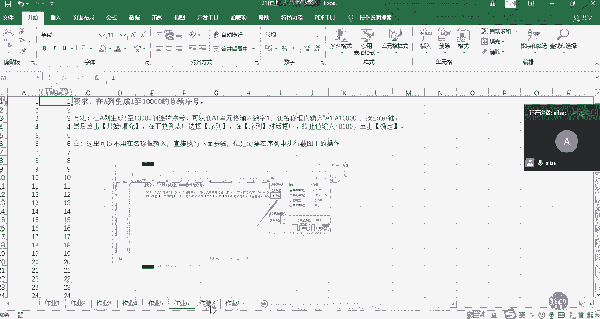
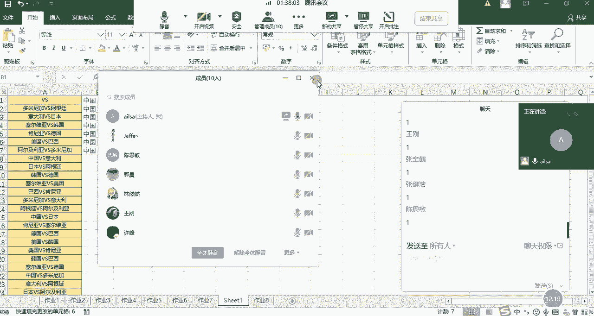
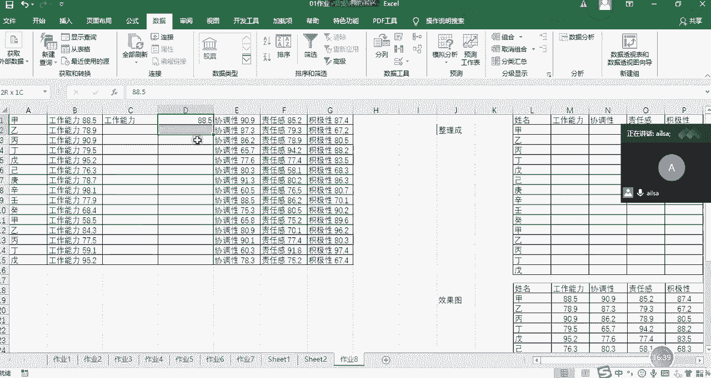
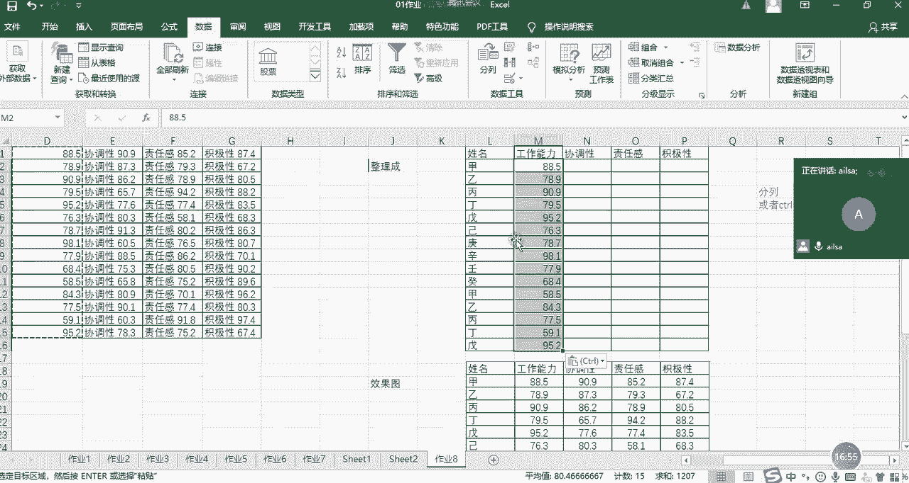
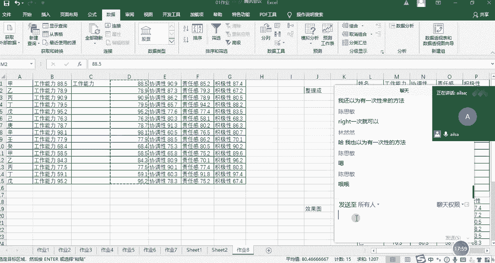

# 强推！这可能是B站最全的【Python金融量化+业务数据分析】系列课程了，保姆级教程，手把手教你学 - P49：13 day01作业讲解 - python数字游侠 - BV1FFDDYCE2g

讲讲昨天的作业，昨天的作业相对来说比较简单哈，而且量也不大，总共八道题啊，那我们一个个来看哈。

哎这个时候我需要给大家互动一下，不然的话还讲不出来了，好嘞，我们先看第一道题啊，他说的我们先看题目要求，就是选中了设置条件格式的单元格，然后清除条件格式，也就是说在它这里面呢，有一些是没有条件格式的。

有一些是有的，对不对，那我要把有的清除掉，没有的保留，大概是这个思路哈，如果说啊我先说我的第一个思路哈，就是我在日常工作当中啊，遇遇到这种问题，我才不管他372 11什么有的没的。

我直接啊选择我的还数据选项卡下面啊，啊开始选项卡下面的一个条件格式哈。

啊它这个是缩了之后确实不好用条件格式，然后下面有一个清除规则啊，我会把啊，我所选中的单元格的规则。

全部给它清除就可以了，我就这么改啊，怎么简单怎么来啊。

对啊就这么干，然后的话但是哈我们要根据题目的要求哈啊，因为我们一般工作当中没有人给你这么啊，这么这么限制它的意思是什么意思呢，我大概理解一下，就是说假设这里面有其他的格式啊，比如说哎这是黄色背景的。

现在呢我想让你保留这些格式，只要把这些有条件格式的删除就可以了，他可能是想表达这个意思，那我该怎么去操作呢，我还是选中啊，然后这个时候我们就采用了我们的定位条件，选择好选择定位条件。

然后这个时候我们选择的是条件格式好确定，哎，什么意思啊，选中，然后CTRL加G定位条件不是条件格式对吧，确定哦，对我已经选中了哈，sorry哈，我这个定位是选中哈，傻了，然后这个时候我们要把格式给清除。

对不对，那我就把格式清除一下，在我们这个清除里面有一个清除格式啊，清除掉就可以了，所以说你看我既保留了原来的格式。

也把有条件格式的给清除了，是这个意思啊，好OK作业一明白了吗，明白了，扣一，好嘞啊，我们看作业二啊，嗯只有两个人，三个人啊，大家加速哈，我们尽快快点讲，快点讲完之后，大家赶紧写作业。

因为今天作业有点多哈，好OK我们看第二道题。

第二道题是什么意思呢，就是说因为我们在有时候啊，我们会进行两列数据的一个对比，比如说我们在这这一列的数据，是我们手口算的哈，假设是我们口算的，这一列数据是我们用系统算的，那我们想看一下我们口算的数据。

对不对的时候我们可以通过突出显示，然后这样的一个方式进行一个呈现，那这个的话它也可以用定位来实现哈，我先把它里面的格式全部都清除一下啊，这也是条件格式里面的啊。

我要给它清楚哈啊，请大家知道我们的条件格式，一定要在这里去清除啊，所选单元格的规则我清楚了之后，我们先看第一种做法哈，第一种第一种做法就是使用的定位CTRL加G，然后选择行内容差异的单元格。

它只是选择上哈行内容差异啊，这个里，然后确定就是他会选择它，然后我们给它加上特殊的颜色就可以了，这就是我们使用定位显示不同的颜色，那昨天呢有同学就说诶，我也可以用条件格式来进行实现。

然后我是这么来实现的，但你用条件格式的话，有可能两个都加上了颜色哈，我们看一下怎么来实现啊，我在这我在这里面已经写好了，我的一个操作方式哈，首先也是先选中啊，然后使用条件格式啊，突出显示单元格的规则。

然后选择其他规则，然后我们在这个下面选择最后一个使用公式啊，怎么是使用公式呢，然后这里的话我们是不是要判断A列和B列，它两个值是否相等啊，如果相等就不用设置格式了，如果不相等就设置格式。

那这个函数是怎么来写的呢，他在这里面要写等于啊exact ex AC t，这个是精确的意思哈，然后在这里面啊，在这里面我们只要选择一个A1和B1，它就能识别到整列了，所以说啊啊因为我们的列是不发生变化。

行发生变化，所以说列方向上是加了刀乐符，这是一种写法啊，大家不用去，这就是去研究诶，他为什么这么写啊，啊这是B12这样的一个形式，那它这个精确它返回的是true和false，什么意思呢。

就是说如果这两行啊，这如果说啊这两列啊，同一行的这两列的值是相等的，就会返回返回处，如果不相等，就会返回false，这个时候我们只提取false的值，只提取false的值。

然后对它进行一个格式的调整，比如说我们设置为填充为黄色的。

点击确定啊，点击确定，哎它你看它也显示出来了，这就是我们所想要的效果，但是我们会发现诶好像有点问题哈，你看这里的呃，这里的27。6和27。6，这边是不一样的，我们看一下句子的值，这是一个公式里面计算的。

这是一个啊，那这里的话我们把它粘贴过来之后，它应该是应该是基于小数位数的一个计算啊，我们看它应该是精确的，不仅仅是27。6，还有可能会更多，所以说它没有显示出来，可以看到啊，我们使用条件格式的时候。

它计算的会更精确一些，而使用我们的行内容差异的话啊，好像啊对这个会更精确一些，而这个不是啊，这个不是呃太精确，好是吧，结果是不一样的啊，大家有发现这个问题吗，嗯大家有发现这个问题没有，它们俩结果不一样。

可能还是因为小数的问题啊，啊知道我们这两种方式就可以了啊，OK好大家给我个响应啊，如果没有什么问题，给我扣个一，自己回去再试一下，嗯这只是两种方式哈，那我们可以看到刚才我第二个操作方式呢。

是在条件格式里面输入的一个公式啊，啊这个的话相当于是有一点点的高级操作了哈，啊这个也没有关系，如果说你想实现某个效果的时候，你完全都可以去把百度啊，别人就会告诉你，你该怎么去操作。

你只要把你的需求描述清楚就可以了啊，这是我们的作业二啊。

作业三我们看一下唉，所以三呢它其实就是把两列合成一列啊，然后呢但是他们中间会有空空白，就是交叉的地方，现在啊它们的交叉点不会存在重复的现象，就是这里有值，这里也有这个现象不存在。

那我们就使用的就是选择性粘贴，跳过空单元格的一个方法，那怎么来操作呢，首先我先把这某一列的值粘过来啊，这个就因为有控制，所以说我们在进行区域选择的时候就会出现啊，就是断层的情况。

所以我们要啊下拉的这种方式，我们先选择过来，然后我们再选择这一列啊，进行CTRL加C，然后把鼠标定位到这里，右击选择选择性粘贴，然后选择跳过空单元格，点击确定，然后就实现了我们所想要的效果，对吧啊。

这个应该也没有什么问题，OK我们再往下讲啊，作业四啊，作业四的话它其实就是合并上下啊，上半年和下半年那个数据啊，我们第一种方法啊，我们今天讲了公式与函数之后，在这里我们就可以使用公式与函数了。

那这个表它巧在哪个地方呢，就是说它的格式一模一样啊，所以说我们可以直接使用这样的公式，进行一个啊拖动就可以了，而且完全不要不需要加啊，我们的绝对引用或者是混合引用。

我们还有一种方式就是用我们的啊选择性粘贴，直接粘贴加号就可以了，那怎么来操作呢，唉你比如说现在我把这个数据复制出来啊，这个数据复制出来放在这里啊，这个时候我复制这一部分数据，CTRL加C。

然后把鼠标定位到这里，右击选择选择性粘贴，点击加号确定。

那么它就粘贴过来了对吧，这我们在课上讲过了啊，这个就也比较简单。

那第二种方式的话就是使用公式啊，是M5加上M12，它在往右拖动的过程当中都相应的发生变化，所以说啊这边可以直接进行一个实现啊，因为它的格式完全一模一样，这是作业四啊，啊大家对于前啊三和四这两个作业啊。

有什么问题没有啊，没有问题给我扣个一没好的啊。

看来大家掌握的都还可以哈，我们看作业五好，作业五我就不讲了哈啊我们在课上讲过了，就是我们啊先选中快速定位到我们这个空值，然后进行一个自动求和啊。

快速求和这样的一个方式啊，我们看作业六啊，作业六的话是自动生成啊，A列到啊，就在A列当中自动生成一到啊，是1万个连续序号哈，这个的话因为我们昨天也讨论了啊，今天考试也考了，其实特别简单。

我们先在这里面输入一个一，然后呢啊在我们的呃填充这里啊，输入啊向下啊这个序列哈序列，然后选择在这里选择列，然后步长为一，然后中指值为啊11万，然后点击确定啊，它就出现了我们所想要的效果啊。

这个也是我们填充序号的一种方式啊，大家知道就可以了啊，如果说真有人问到这个方法了啊，你可以给别人炫一下技哈，你看唉我可以这么去实践，是不是很简单，这是我们的作业六啊，今天也考过了。

所以说就不啊进行一个呃讲解了，OK我们看作业七哈，好作业七和作业八都会用到分列啊，我们看作业七，啊这一期呢我这边啊，我这边要求就是可以，第一步可以尝试一下CTRL加E，如果CTRL加E实现不了。

你就可以在啊，就是在尝试呃，就是我们的分裂啊，因为它都有一个vs嘛啊，对不对，然后我们把它先拿出来看哈，我们把它拿出来看，我们用CTRL加E先试一下，嗯什么情况，CTRL加E试一下，OK那我们看一下。

然后是中国啊，我们把这个粘出来，中国啊粘出来，然后是R吉利亚，吓我一跳，我还以为没录呢，阿尔及利亚这两个值对吧，我们站出来之后，然后我们先试一部分哈，CTRL加E唉，好像实现不了对吗，大家实现了没有。

哦大家实现了CTRL加E能实现吗。

嗯过个响应分裂的是吧，CTRL加E好像实现不了，没关系，那我们就采用分裂的方式好分裂也可以啊，再撤销一下，OK我们采用分裂的方式，插入啊不对啊，我们直接在数据下面有一个分裂，嗯我们看一下哈。

我们哦选择其他，我们试试vs哈，我还没有这么去试过啊，好像可以哈，用V然后去给它进行一个拆分，点击下一步，应该很多人不是这么干的，很多人是不是先把vs给替换掉啊。

大家有没有啊这么去操作过，啊你是这么干的哈，只能V然后SOK大家可以把vs替换成逗号啊，替换成逗号之后，然后以逗号隔开也是可以的啊，啊我们可以这样哈，我们可以CTRL加H，然后把vs。

啊刚才那种方法也行，但是你可能要需要进行一个二次处理哈，不过每一种方法好像都需要二次处理一下逗号，然后我们点查找全部试试。

OK啊都是可以的哈，CTRL加A全部替换，是不是我就替换了啊，替换了之后我们再进行一个分裂啊，这个时候我们可以选择分隔符号啊，选择逗号啊，下一步啊完成啊就可以实现了。

然后去虫的话，大家一定要注意，去虫的话，我们一定是，因为他有可能把你这边的力可以删掉了，所以说你要把它单独啊啊单独拿到一边去啊，我们可以再放到一个这个地方啊，然后在这里面单独对着。

因为他把这一类比如说这两列重复了，他把你这边的值也删掉了，所以说我们选中它，然后在我们的好，在我们的这里啊，删除重复项啊，我们只有一列，所以直接点击确定啊，是不是保留了这么多。

然后我们在这里再进行一个重复制的删除啊，还是一列点击确定，OK就可以了，这就是我们的一个啊分裂加删除重复项的啊。

一个操作就实现了对吧。

哎就跟这个是一样的，这就是我们所想要的效果，大家大家对于这个有什么问题。

没有好空格也可以啊，中国啊，空格也可以，OKOK好的哦，你的意思是说用个空格对吧啊，间号是这个意思吗，没关系哦，不是是吗，没关系，我们可以私下再沟通，你可以把你的呃。

我等会儿可以给大家发一个动图的录制啊，动图录制的一个软件啊，大家有什么问题都可以把它啊录制下来啊，录制下来，然后的话我们就可以去动态的去展示行，那我再私下的跟简浩再沟通一下，是吗，嗯我这边有我这边有。

我等会儿给大家分享，那我们私下再沟通哈，简好嗯。

唉我们讲完了第七题，我们看第八题哈，第八题的话啊，其实没有什么特别好的方法，分裂也可以，CTRL加E应该也能实现，我们先试一下哈，我们先试一下啊，就是我看看啊，嗯反正得一列一列来啊，只能这么说。

没办法一次性的去实现所有的操作啊。

所以说啊这边要加两列啊，然后是工作能力也可以分列，都是一样的工作能力，然后是88。5，我们试一下啊，工作能力就不需要了。

直接就这个就行啊，好像可以对吧，然后我们把这个值弄出来之后，直接复制到我们这个地方就可以了，因为它的顺序是一样的，那协调性和责任感，积极性等等，这些也是这么来实现的啊，呃这是CTRL加E分类的话。

就是以他们中间有个空格，沿着空格去分裂就可以了啊，当然你也可以用函数哈，因为我们会发现啊，它前面的啊长度是一样的，对不对啊，它后面的好像也是一样的，你也可以用我们的文本函数来进行实现，也是可以的啊。

啊大家可以尝试一下，我们今天学完了函数之后，都可以试着啊用一用嗯，OK哈，那我们还挺快的哈，啊不到20分钟就把我们作业讲完了，没毛病，用函数的话是可以的，没毛病，对的嗯，因为你用啊，你用函数的话。

你可以拖动，所以说它可以一次性实现啊，因为我们昨天没讲嘛，我们昨天没有讲函数，所以说我说他不可能一次性全部都实现，如果讲了之后，那你这个就可以实现了啊。

因为你看啊，我给大家演示一下吧，啊想一次性实现也可以啊，我先把它删掉啊，然后这个时候我把它清除哈，然后说等于啊啊我们看一下，我们直接write吧，R i g h t right，然后我们选择我们的文本。

然后我们截取1234，没有空格吧，四我们看一下，OK没有问题，这个时候我们直接往下拖动就可以了对吧，哎它实现了，然后我们再往下拖动啊，刚才是往右啊，往下拖动它也能够实现对吧，就一次性实现了。

因为它这个表跟这个表的结构是一模一样的，所以说完全可以哈，没毛病，方法有很多啊。

方法有很多，我绝对不会说哎一个功能的实现它就一种啊，看你习惯采用哪个就可以了啊，当然越多越好，看你心情，今天用这个，明天用那个啊都可以好。

