# 强推！这可能是B站最全的【Python金融量化+业务数据分析】系列课程了，保姆级教程，手把手教你学 - P52：03 图表2 - python数字游侠 - BV1FFDDYCE2g

好嘞，那我们接着讲解我们的呃图表诶，我们之前讲了散点图，折线图啊，还有条形图，柱状图啊，这四种图形，然后下面是下面的这个呃，为气泡图哈，我们讲解气泡图，气泡图跟散点图是类似的啊。

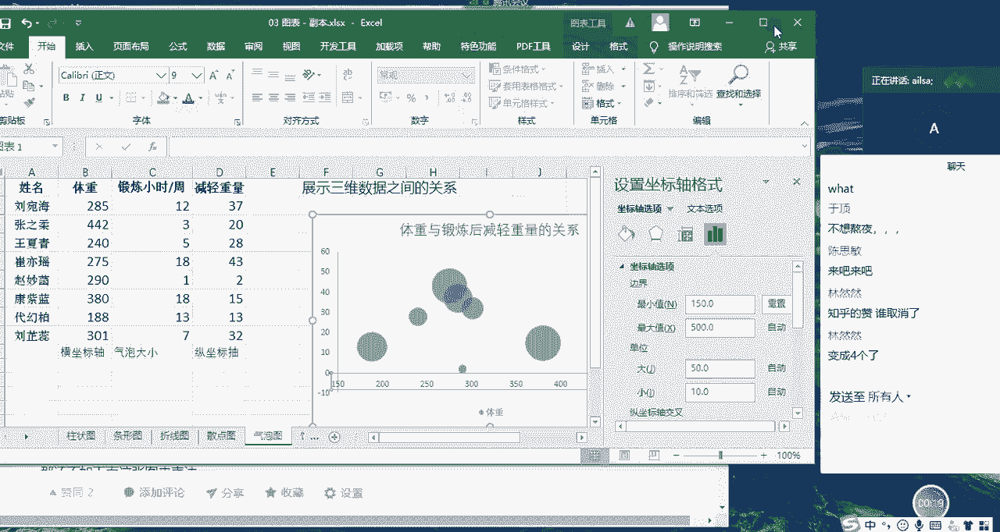

我跟大家说一下啊，它们之间的区别在于哪里，你看散点图是二维啊，也就是两类数据之间的一个相关关系，而气泡图它展示的是三维数据之间的相关关系，也就是三类数据之间的相关关系，那我们就在想它怎么来呈现呢。

你看它的它只有两个坐标轴，一个是水平轴，一个是垂直轴，水平轴，如果代表体重的话，那垂直轴代表减轻重量的话，那第三个维度锻炼的小时的时长，这个是通过什么来体现的呢，大家看一下这个气泡图跟散点图。

唯一的差别在哪里啊，是不是在于气泡的大小啊，那它这个大小A就反映了他这个锻炼小时的，一个呃呃呃一个时长的一个大小，就是气泡越大，时长越长，气泡越小，时长越短，那也就是说我们通过啊，通过横纵坐标来体现。

前两个维度的数据之间的关系，然后再通过气泡的大小去体现第三个呃，数据类型，它们三者之间的一个关系，这种情况就可以通过气泡图来实现，我们看一下怎么来操作的哈，我们还是选择我们所有的数据。

然后点击插入啊推荐的图表，然后这个时候我们在所有的图表当中选择，你看我们找了一遍哈，都没有散点图，对不对，那这个时候我们就把都没有气泡图，sorry哈都没有气泡图，那我们就要定位到散点图。

大家看到没有啊，这边有气泡图啊，所以说我们可以选择它，我们选择的是第二种哈，也就是说呃呃是这种一个呈现。

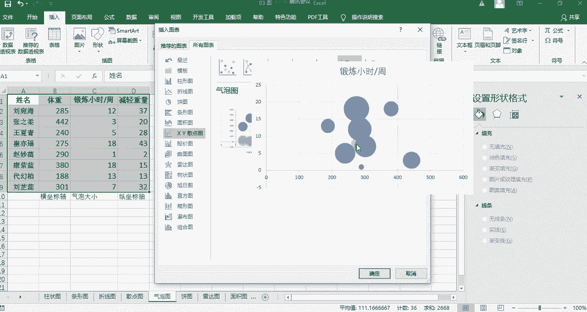

我们点击确定唉，确定了之后，我们会发现好像跟我们原来做的这个不太一样，我们来分析一下哈，分析一下哎，他这个啊他这个放在这里哈，他这个呃我们把这个呃把这个图例啊，锻炼小说时长。

OK我们再把我们的哦看一下哈，这个是我们明显看出来是我们的体重对吧，那这个哎我们看一下他是不是我们呃，它默认是我们的锻炼小时的一个时长啊，对不对，你看他最高才是25，那肯定是这个数。

而不是减轻体重这个数，但是现在我们想给大家展示的就是呃，呃横坐标是我们的体重，而纵坐标是我们的减轻体重，那这个气泡的大小，我们来给它体现锻炼小时的一个时长，我们该怎么去修改呢，啊这个时候我们可以右击。

然后选择我们的数据看一下。

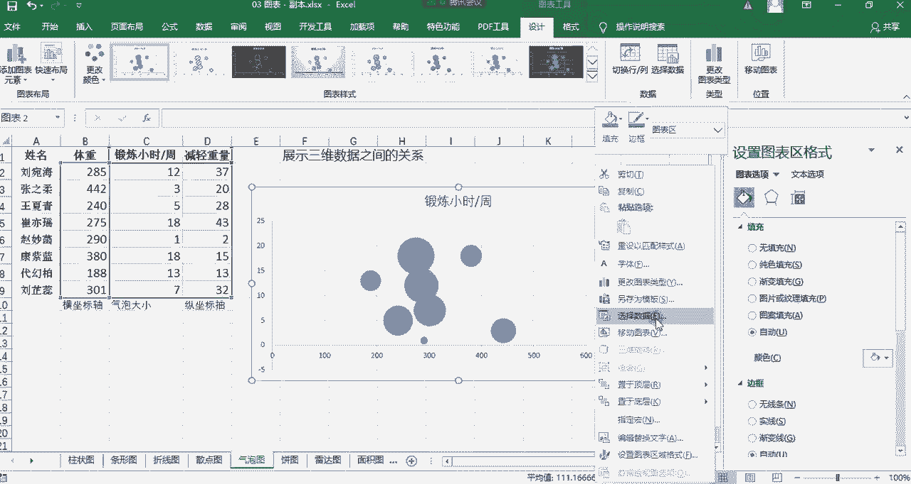

哎，在这里呢有个锻炼小时的时长，我们编辑一下哎，这里有一个编辑序数据序列，那在这里我们就可以去修改它们，三者之间的关系了，我们一个个来看哈，我们不用看这个系列名称，我们直接看X轴，X轴就是我们的水平轴。

水平轴是我们的体重哎，我们看一下水平轴啊，X轴就是B2到B9没有问题，是我们的体重哈，那Y轴系列它这边显示的是C对吧，就是锻炼小时的时长，这个时候我们需要给它改成什么呀，改成减轻体重。

也就是D那我们就给它改成D啊D啊D2，然后到第九，这个我们可以根据自己的一个需求，然后进行一个修改，那气泡大小我们希望体现的是锻炼小时的时长，这个时候我们再改成C啊，C就是我们的锻炼小时的时长。

改成C就可以了，点击确定，点击确定。

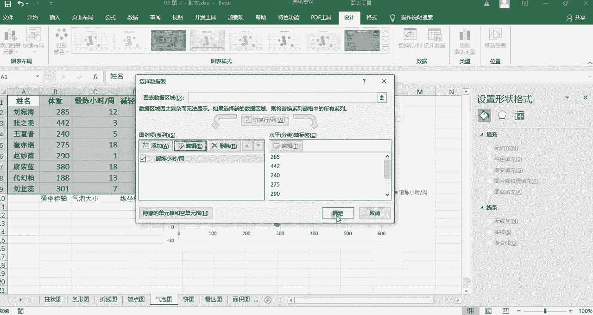

OK这个跟我们原来的图形就有点相似了，但是还有点不太一样，因为我们并没有发现，就是特别明显的发现他们之间的一个呃，就是线性关系或者相关关系，但是我们会知道说你看他这个体重，其实最D的一个值大概是188。

我们这从零开始的话，它这个趋势就不够明显，对不对，那我们可以对这个坐标轴进行一个设置，我们点击它这边就出现了设置坐标轴格式，那我们选择我们的呃，就是这个最后一个选项啊，这样的一个东西。

然后我们选择坐标轴选项这边有一个边界哈，最小值我们可以看到是为零，那现在呢我把它改成150哈，188是最小值吗，改成150，然后这个时候点击确定哈，唉我们就会发现它整个的一个趋势啊，有一点明显了哈。

那我们分析一下这张图想表达的意思哈，首先这个随着体重的不断的增加，它的一个减轻体重的一个变化趋势，对吧啊，那图这个呃气泡的大小代表它锻炼的时长，那气泡越大代表它锻炼的时长越长啊。

那如果说这个气泡的位置越高，代表它减轻的体重就越大，对不对，那我们看一下这个啊这个气泡，这个气泡，气泡所在的位置是大概300多斤的人哈，300多斤的人，然后他锻炼的时长也不小。

但是他减轻的体重对应的还是比较低的，对不对，那我们再看这个气泡，这个气泡的话，它的体重对应的体重大概是2~300之间啊，二百五左右哈，啊不对啊，250~300之间，应该是二百二百六，二百六七左右。

但是他锻炼的时长也不小，对不对，源泉也是挺大的，跟他差不多，但是他减轻了体重也不小，说明他这个啊达到的效果还是不错的，对不对，那我们就可以通过这种形式，然后去发现说这个体重与减与他这个锻炼时长。

还有他减轻体重之间的，一个呃存在的一个关系啊，就可以通过气泡图来进行一个体现。

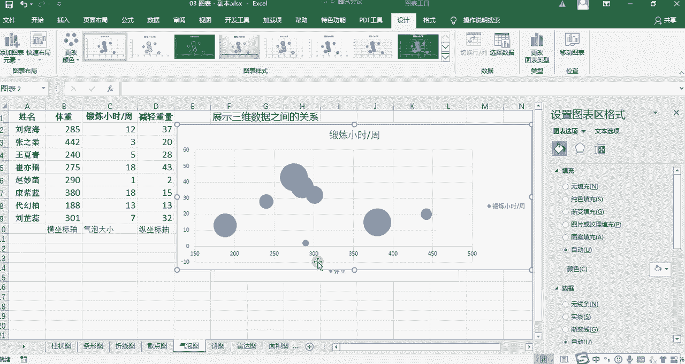

嗯大家现在在自己嗯啊什么意思。

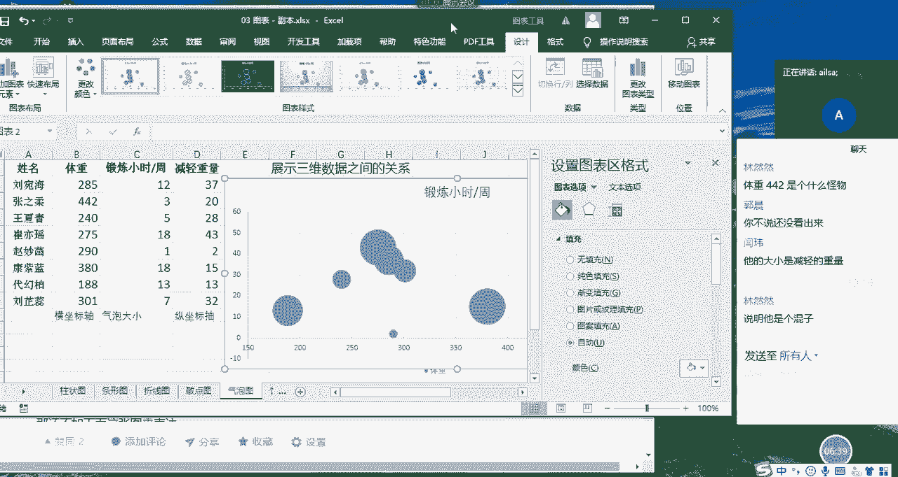

什么体重442，什么怪话啊，那大家现在啊自己手动的操作一遍，然后看能不能创建这样一个气泡图，如果可以的话，然后完成了之后，然后也听明白这个的作用了，然后我们就扣个一啊，我们一般情况下创建气泡图的话。

用的还是啊不多哈，我们用的常用的是散点图，okay哈嗯，啊其实从这个图表中当来说的话，其实这个啊，这这个人他它的效果还是比较明显的，你看他锻炼的时长也不是特别多，但他减的体重却比较多啊。

说明它的效果还是可以的，但是他你看他锻炼了这么久，还没有人锻炼这么久减的多呢，是吧啊，所以说我们会发现一个，就是就是从他俩来说的话，可能体重基数越大，相对来说啊减的就会更猛一些啊，但但并不是绝对的。

你看这个人啊体重基数也很大，但是他锻炼了这么久，减的还是比较少的，嗯他这个其实没有特别大的一个啊，就是并不是说你锻炼的时长越长，你的体重就减得更明显，我们很明显看出来，它整个的一个相关性并不是特别强。

OK两个人建出来了，其他人呢，好的我再等半分钟哈，对于图表的一个，其实讲解的话稍微是有点枯燥的哈，因为他这个嗯他这个以呃，它这个必须结合到一个实例当中，然后去一步一步去操作的话会更明显一些。

那就是单独拎出来的话啊，稍微是有点小小的断层哈啊，但是但是也没有关系，我们也是结合实际的啊，一些情况进行了一些分析哈，啊这是我们的气泡图，那接下来我们看一下饼图，还有我们都知道饼图哈，一张大饼。

然后分给多少个人，那我们从这个啊，饼图的一个直接概念上来说的话，他肯定是想表达是某一类群体当中，某一些类别的一些占比情况啊，所以说那饼图主要是描述部分与整体，它们之间的一个关系。

这样的一个作用我们就可以使用饼图来体现了，你比如说你某一款啊，就是某一个呃公司吧啊或者是那个分部哈，公司就是专门卖手机的，哎我们都知道哈啊，然后它每一款手他们公司会有很多个手机售卖。

那每一款手机的一个销量，然后构成了他们整个公司的一个销量，所以说我们想分析一下，到底哪些手机比较畅销的时候，我们就可以通过饼图来实现。

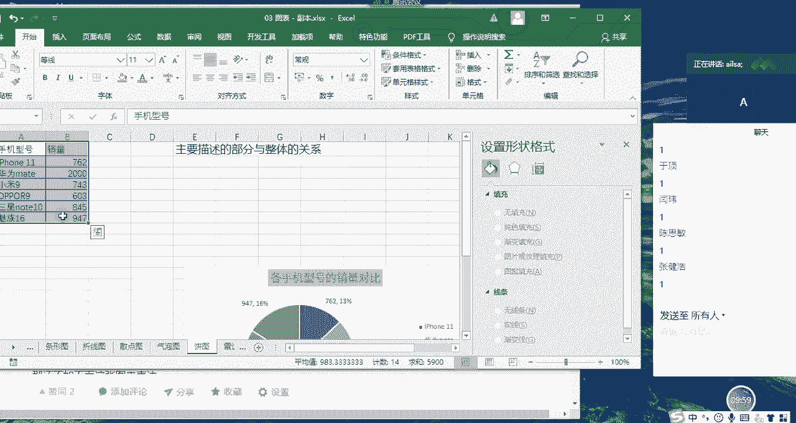

那饼图呢也是先选择数据插入，然后啊推荐的图表。

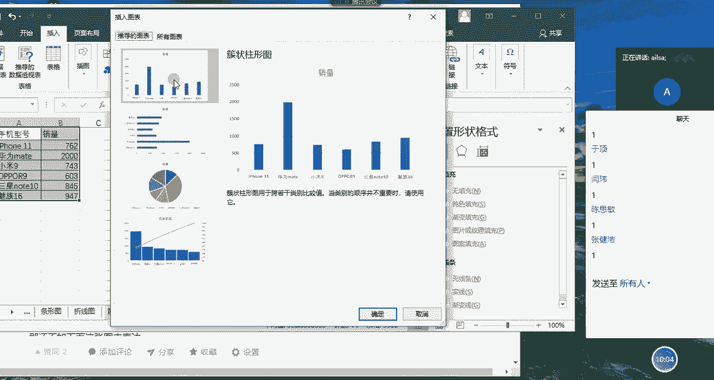

然后在这里面选择饼图就可以了，那对于饼图的话，它有一个跟其他的图表并不是特别一样的地方，就是它的显示的数据标签哈，我先给大家111的去显示，那我们知道了创建了这个饼图之后呢。

我们肯定是想知道它每一个饼图的一个，数值情况对吧，我们添加数据标签诶，添加完了之后，我们发现它在里面，我们可以给它设置一下啊，把它设置到啊数据标签Y哈这样的一个形式。

但是我们可以从我们原来的图表当中发现说，哎你这里啊是不是还设置了一个百分比啊，其实我们很想知道的就是这个啊这个类别哈，我们可以把它的啊土粒放在它的右手边啊，这样会更直观一些。

你比如说我想知道IPHONE762个销量，它到底占了总体的多少个百分比，唉这才是我们所想要的一个效果，那我们就可以啊对它进行一个相应的添加，怎么添加呢，就不是在我们的数据标签里了啊，他这里没有。

那我们需要给它设置格式里面，然后在我们的设置，数据标签格式当中的最后一个，然后有一个标签选项，然后大家看到没有，这有一个百分比诶，我们选择它，这时候它就会显示每一个类别，它所对应的销量以及它所占比情况。

我们可以看到这个好，这个华为的手机还是比较厉害的哈，华为的手机占到了34%，然后它的总销量为2000，这就是我们饼图想表达的意思，就是总体呃呃部分与总体之间的一个关系，一个占比情况来去分析某一分类。

它的呃它的一个优势啊，或者是说所有的产品当中，它每一个产品的占比，哪些是畅销的产品，哪些是呃就是呃这就是销就是滞后的，或者是叫卖不出去的产品，这样子，哦这后面怎么还带百分号呢，你的没有吗，可以设置。

这本来就是百分比啊，900%多，你这选的有问题吧，我们点这个啊，我再说一下哈，我们的百分比是在数据标签下面，然后选择百分比和值啊，中间是逗号，对中间是逗号啊，不是点儿哈啊，不是点前面显示的是你的销量。

你比如说我们看这个IPHONE11，它是不是762，762的销量，然后占13%哦，是这样的哈，是这样的啊，对我们再放大一下哈，它这个是百就是762的销量啊，啊然后逗号有一个百分比。

但是如果说哈有的人就说，那我可不可以不要这个前面的销量，然后只要后面的百分比呢也是可以的，我们也是在设置数据标签，选项里面有一个数据标签，我们把值取消掉，它也就不显示了，明白了吗。

也就是说饼图跟其他图形相比，它是有一个值和百分比的，一个同类的一个选择的，就是你都选上它就都显示，如果你不选其中的值，它就不显示了好吧，那对于饼图来说，然后大家有什么问题没有没有问题给我扣一啊。

并且你已经完成了饼图的一个制作啊，好的没有问题哈。

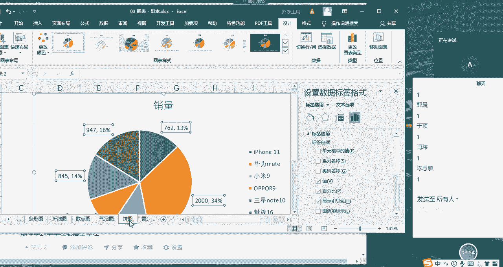

那我们接着看雷达图哈，哎一听这个雷达图好像很高大上的样子哈，其实啊它制作起来也是比较简单，它就是为了分析啊分析，然后不同维度哈，在不同维度某一些分类它的一个对比情况，你比如说最简单的呃。

对能力图是经常用雷达图来实现的啊，就是比如说两个员工，然后我们要对他进行一个嗯选拔吧，就是呃选经理，然后我们想知道啊到底选哪个好，那我们就可以给它分不同的一个类别，让他去整体的去看一下哪些啊这些人啊。

这两个人在这些能力啊，或者是这些方面到底是一个呈呈现怎么样的，一个效果对比，这个时候我们就可以用雷达图，那我跟大家演示一下，怎么来实现选择我们的数据插入，然后一样的操作。

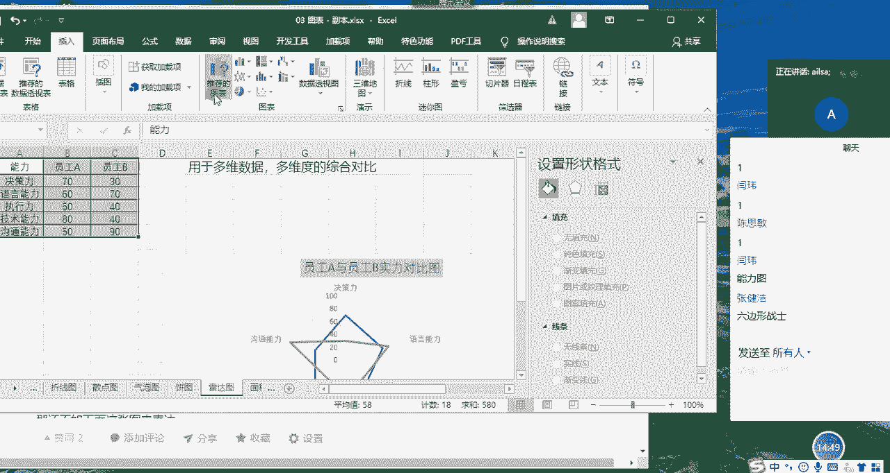

然后选择所有图表，选择雷达图，点击确定。

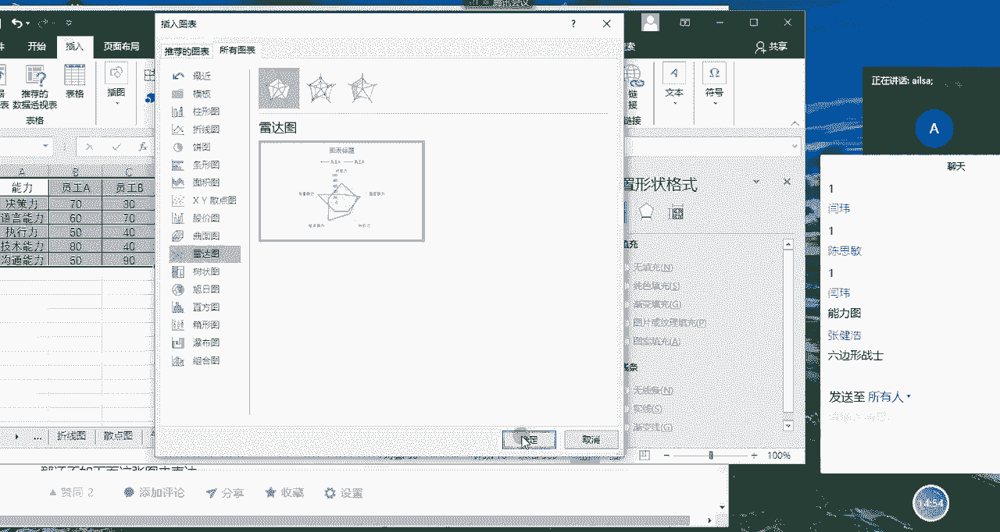

你看现在的图表还是比较智能的，它就能根据你所想要的效果来实现，那就是我们可以看出分析一下这个结果的话啊，就是这个来把这个图里放边上哈，图里，不是放右边哈啊，那我们可以看出来说嗯。

就是呃B员工他在沟通能力上是非常强的，就是说离中心点越远，他的能力越强，那这个A员工呢，他在技术能力方面也是比较强的，那说明A员工偏技术，B员工偏沟通能力，那如果说你想提拔的是一个管理者啊。

那你可能就要提拔啊，提拔B员工了，如果你想提拔的是一个技术技术啊，技术领导，那你可能提拔的就是A员工，所以说很明显他们有自己一些哪些突出优势，就立马就呈现出来了，这就是我们的雷达图，就是啊多维度的啊。

多维用于多维数的多维度的综合对比啊，这就是雷达图啊，大家明白了吗，明白给我扣一，啊，其实这个图形放到，如果说我们做一些分析的时候，放到那个我们整个的一个报告里面，还是很美观的哈。

哎就觉得如果因为有些人他他不会的话哈，他会觉得说嗯嗯他会觉得他会觉得说哎，你这个啊还不错哈，你这个还挺厉害，其实也特别简单是吧嗯那我们看一下面积图哈。

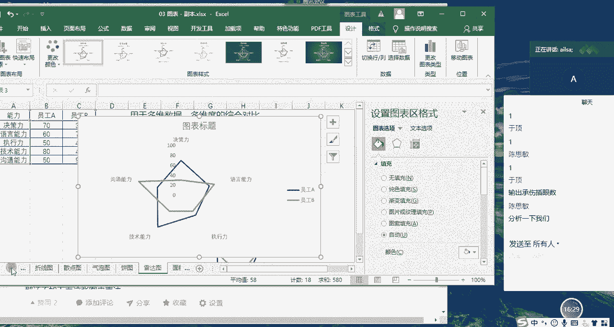

面积图呢它其实也是对于啊，它其实也是对于我们不同的一个数据维度，进行一个面积大小的一个度量，也就是说面积越大，代表它在这个维度数据量就越大，面积越小，它代表它在这个层面数据量就越小啊。

我们就拿啊不同城市它的一个销量对比来啊，来去做一个分析哈，啊还是选择这些数据，然后选择插入推荐的图表。

然后我们选择的是啊，这个哈就是我们的堆积面积图。

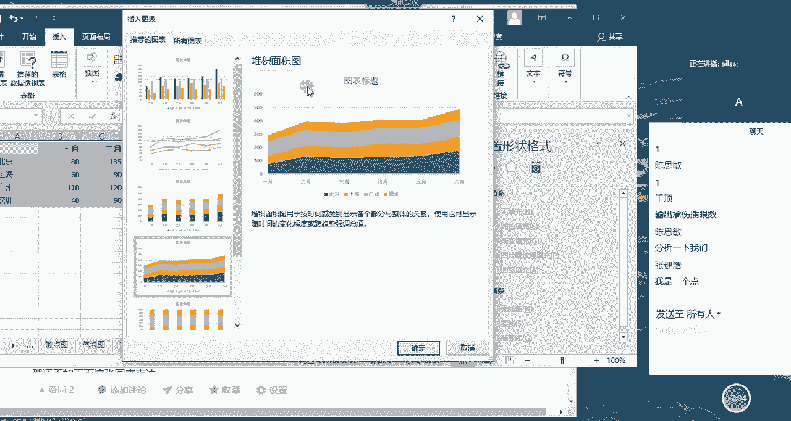

点击确定，嗨，那这个图形代表什么意思呢，我们可以看一下哈，嗯首先我们先把图例放到啊，放到右边啊，啊是在右啊，放到右边，然后我们知道这个不同的颜色代表不同的分类，对吧，哎深圳广州上海北京。

然后这个水平坐标轴是代表日期的，也就是说在1月份的时候，我们会发现说广州啊，广州的数据量是最大的，所以说它的面积也是最大啊，看到没有，然后深圳是哦不对，深圳是最小的，对深圳是最小。

所以它的面积也是最小的，然后随着时间轴的变化，它有一个折现的一个变化趋势，所构成的这样的一个面积形成的一个对比，那你比如说6月份的时候，我们很明显6月份的时候北京啊，北京它的整个的一个销量是最好的。

所以说它整个的一个面积，会逐渐的进行一个扩大，那如果说我们把这个面积去掉，其实它就是一个折线图的一个变化趋势哈，但是它又通过不同的一个面积堆积来表达，它整个的一个大小来呈现的，嗯啊所以说这个是面积图哈。

啊这个没有什么特别难理解的吧，啊大家做出来没有做出来，给我扣个一，嗯好的面积读不常用啊，不常用，如果你想用也OK啊，因为它还有不同颜色的去构成，还还还算美观吧啊只能说还算美观。

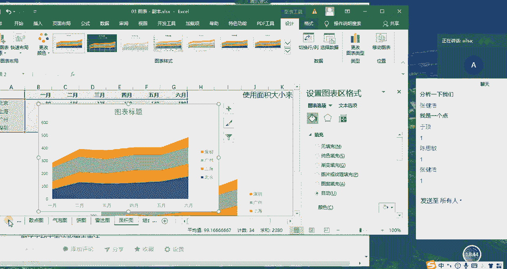

那我们看最后一个组合图，什么是组合图呢，你看我们前面讲的雷达图啊，面积图啊，气泡图啊，折线图啊，这都是单个图形对吧，单个图形，那组合图呢它就代表的是两个及以上啊，两个两个或者是两个及以上。

但是我们一般情况下两个就够了哈啊，那什么时候我们需要用两两种啊，不同的图形进行一个对比呢，那就是当两个就是两个维度的数据，差别很大的时候，你比如说啊你这是每个城市的一个销量啊，还是超销量哈，销量对比。

然后这是它的一个销量的一个总计啊，就是在不同的年份进行一个加和，然后这个呢又是它的一个占比情况，就是说这个销量占这边，所有城市的一个占比情况，还有是一个0~1的一个值。

如果说你想对这两部分数据进行一个对比的话，嗯那这个数据由于相对很少很少，所以说它的柱状的那个那个高度啊，就会特别特别的小，你几乎就看不出来，这样你就没办法知道每一个城市，它的一个占比情况。

所以说我们就可以采用组合图的形式，那它这个数据量比较小，我们就可以让他用折线图，然后用哦一另外一个坐标轴来去呈现，另外一个坐标轴来去呈现，然后这个这个销量呢就用原始的坐标轴去呈现，我给大家演示一下。

我们选择我们的数据，然后再把我们的分类选上。

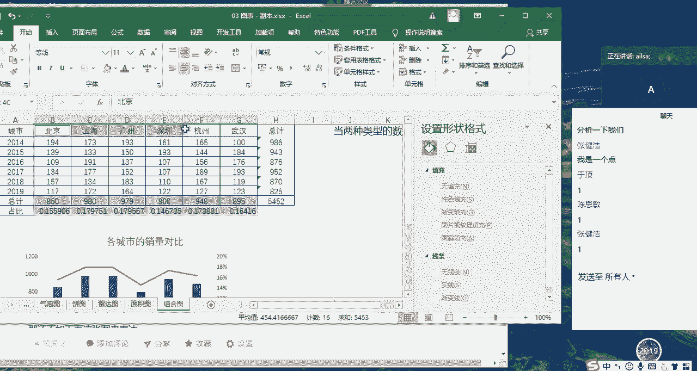

然后点击插入选择推荐的图表，然后我们最后有一个组合图在组合图这里的话，我们有一个设置什么呢，你看系列一啊，跟大家说，系列一这边默认的啊，就是我们的一个销量啊，所以说他是用柱状图。

我们是默认的那系列二呢我们默认是折线图，大家看到没有，在这个示例当中折线图非常非常的低，那是因为我们给它使用使用的是统一的坐标轴，那它是零点几，那它当然就是贴着地面走的哦。

我这就是这就不是我们所想要达到的，达到的效果，那我们就想让它啊，就是直接在上面走一个变化趋势，那我们就可以把它设置为次坐标轴，我们看一下，我们设置为次坐标轴了之后，这边还是它的主坐标轴。

然后次坐标轴是0~1之间，然后去体现这个变百分比，那我们从这个折线图当中，我们就可以看得出来，每一个地区的一个占比的情况，你我们明显发现深圳是最低的对吧，广州和上海啊就是比较高啊对吧。

这样的话呈现出来会比较美观一些。

这就是我们的组合图啊，大家现在创建出来了没有啊，创建出来并没有什么问题，给我扣个一，OK然然没问题了，私密没有问题了，其他同学呢，好嗯OK那我们啊我们在等其他同学的时候，我先跟大家说一下。

我们图表到这里就已经讲完了，然后我再带大家去回顾一下我们每一个图表。

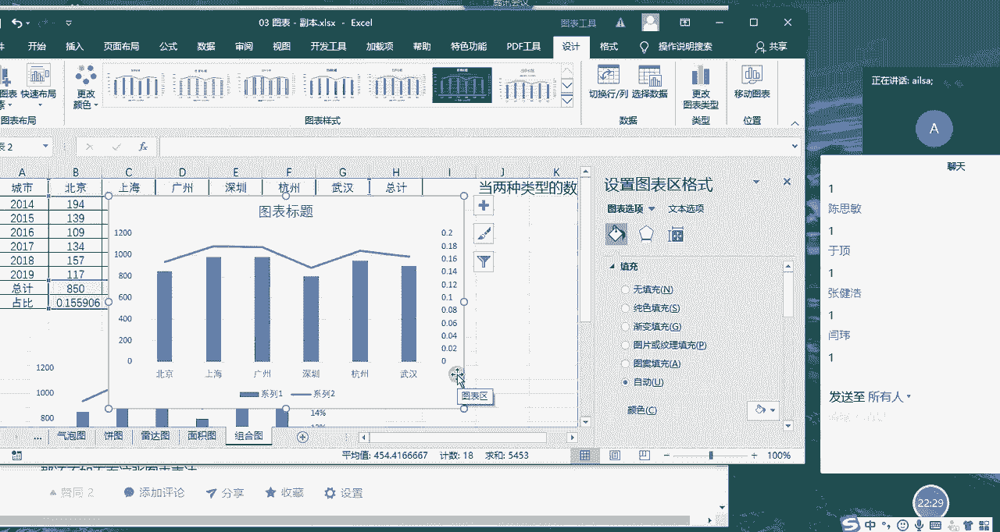

在这里做一个总结哈，好在这里做一个总结，让我们看一下我们啊，这个不是我们讲了我们图表的所有的内容，我们的图表的结构啊包含什么呢，哎我们可以看一下哈，图表的结构。

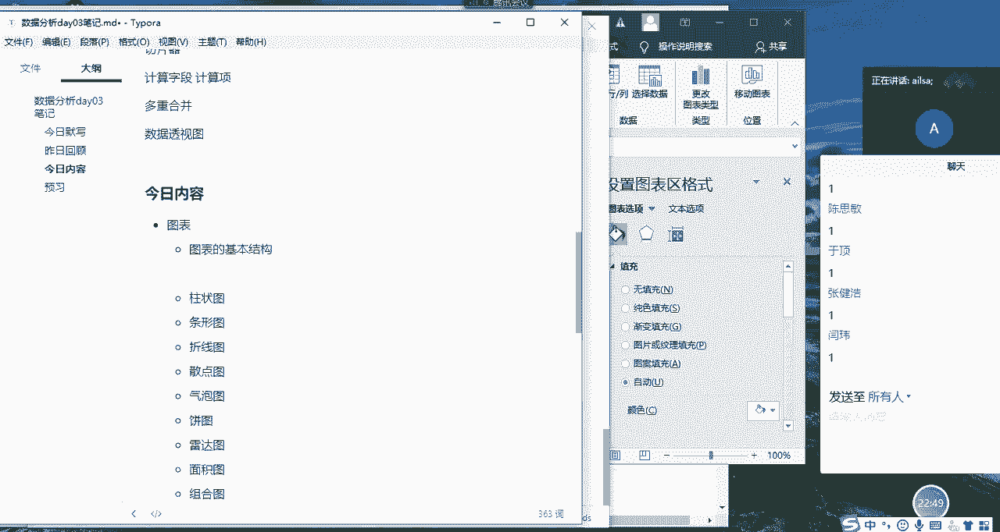

再回顾一下，我们图片的结构包括标题，坐标轴对吧，还有我们的绘图区啊，以及我们的系列值啊，绘图区图例啊，数据标签啊。

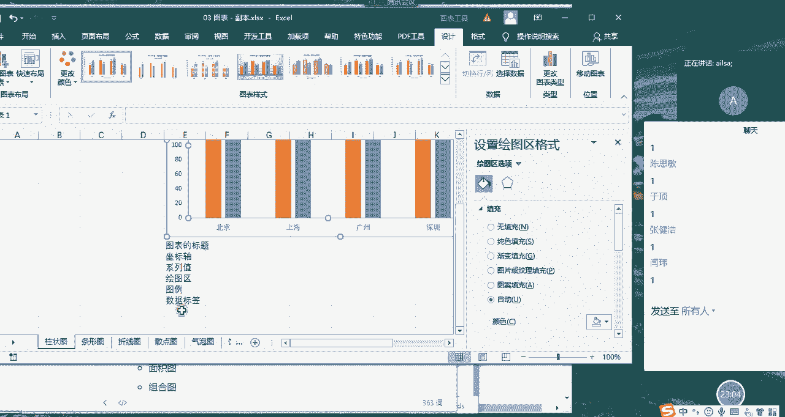

那我们的图表包含的就是标题啊，绘图区好，以及我们的啊坐标轴啊，这大的方向哈，坐标轴啊，坐标轴，还有就是我们的啊图例啊，数据标签这几个啊，可能你们现在在进行操作的时候，还没有遇到什么问题哈。

但是有时候啊我跟大家说。

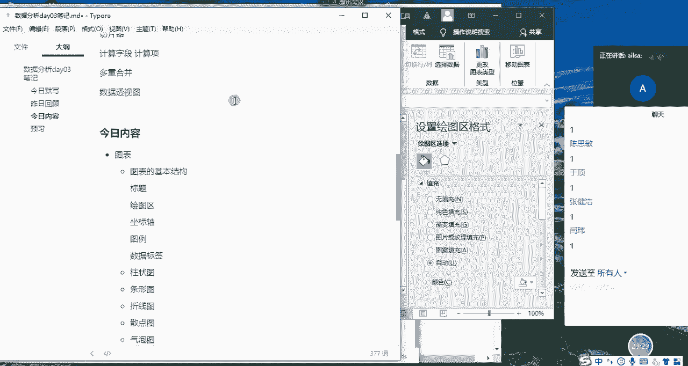

有时候你在进行选择的时候，你比如说你想定位到这个数据标签或什么的，时候啊，不是你想定位到这个坐标轴或数据标签，什么的时候，有可能你定位不到的时候啊，或者是说你想定位到这里，他非给你偏偏跑到这里的时候。

那有的人该说我我该怎么办呢，啊其实也有方法是在这里哈。

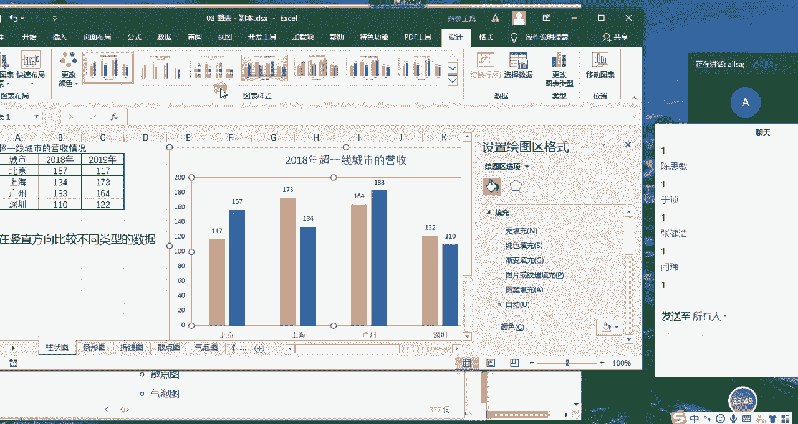

大家看格式哎，点击格式这里啊有一个好。

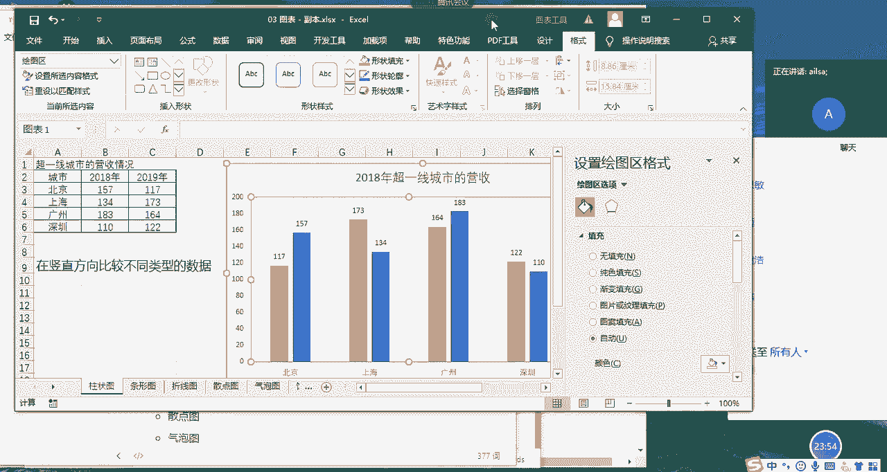

有一个这个这个地方，这里面所有的就是我们的区域的选择了，我们可以不用在这里面点点点，比如说我想我想点图表标题，我一点他就定位到我的图表标题了，然后我点击我的图表区，它又定位到整个的一个图表区了。

然后我点击我的啊图例啊，它就会定位到我的图，看这里面设置格式都跟着发生变化了啊，啊就在这个位置我们就可以选择啊，我们想要的数据区域，或者是我们的图表区域进行一个相应的设置啊。

好吧唉这是我们的一个区域的啊。

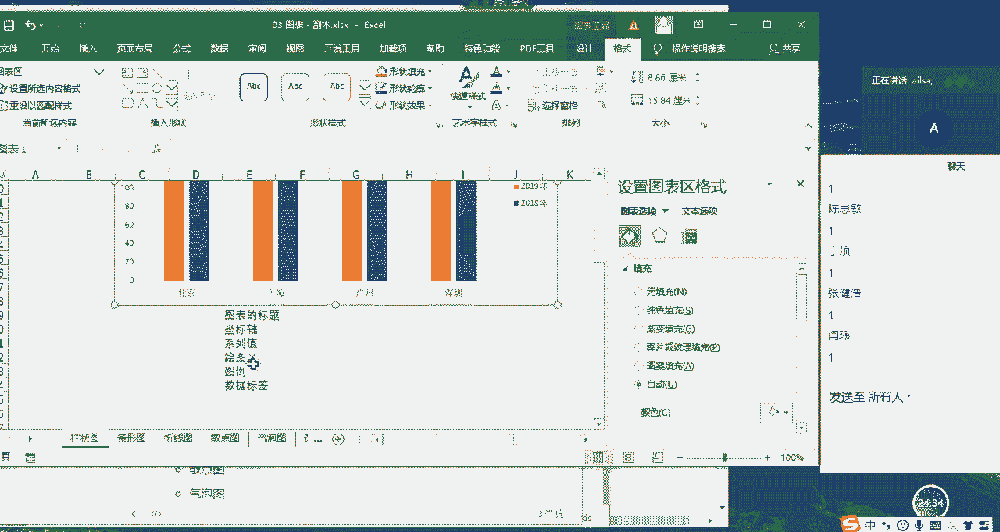

讲解，那接下来我们还讲了什么，我们还讲了条形图啊，柱状图，条形图，柱状图呢它是我直接在这想，它是在啊垂直垂直方向，方向的一个数据数据对比对吧，或者是分类对比啊这样的一种作用。

然后条形图它是在水平方向的分类对比，常用于啊，常用于分类分类的内容啊，比较常识显示更加美观啊，这个看个人的一个习惯，他们都是用来做对比的，垂直方向和水平方向，然后折线图是主要用于反应一段时间内数啊。

某个某一个或多个类型的数据变化趋势，它主要反反映的是一个趋势，这是折线图，然后散点图它主要是反映啊两维啊，两类或者是两维两维，稍等哈，两维嗯，两维数据的啊，一个相关关系啊，这样的一个展示啊。

气泡图它就是反映的是三维了哈，反应三维，三维数据的一个呃一个内在联系吧，我们不能说是相关关系了，它只能是内在联系啊这样的一个东西，然后饼图主要是反映啊部分啊，部分与整体之间的关系，它占比情况。

啊占比情况，OK那雷达图它其实就是反映的是某某两个或，某多个维度啊，某多个类别啊，在多个维度的对比分析啊，这样子，然后面积图其实也是对于数据啊，通过面积大小来对比分析数据。

来对比分析数据数据大小这样的一种方式，组合图的话就是对于啊数值差异比较大的啊，数值差异比较大的两种两种类型啊，进行的分析展示，啊这样的一个呃一个成果哈，所以说我们讲这个图表呢大概也就这么多分类。

这是基础的图表哈，你在工作当中啊，基本上这些也都够用了，但是嗯但是就是说我们可以自己有兴趣的话，可以再找找其他的图形啊，就是说比较高大上的工作，工作当中不怎么常用，但是可以用来显摆的那种啊图形啊。

比如说什么旭日图啊什么的啊，反正我是没用过嗯，啊那个的话就有点像炫技了哈，或者说面试的时候，你跟别人说，哎我做过什么什么图形，用来解决什么什么问题哈，啊这样也是可以哈，但是我们前期的话。

先掌握这么基础的一个图形哈，啊这种图表的话基本上在你工作当中是常用的，在面试的时候，他可能会问你啊，动态图表是怎么来实现的啊，它基本上不会这这些最简单的哈，动态图表的话。

我们可以通过函数的那种形式来给它操作，数据的变化来达到这这个想要的效果，还有一个就是我们的数据透视图，它不是有下拉的选项嘛，它也可以实现动态的一个效果，这个动态的效果指的是你那个图表里面的内容。

可以发生变化啊，就是啊对添加控件对没有问题哈，添加控件来实现你所想要的效果哈，在excel当中添加控件，选择不同的内容，展示不同的图表的效果，这就是属于动态，OK那我们图表的内容带大家回顾完了之后啊。

我们呃excel部分的内容就已经讲完了，我再啊说一下我们excel的几大组成哈，嗯回顾一下哈，我们讲了excel的啊知识点综合我们讲了什么呢，我们讲了操作啊，有基础操作和操作技巧啊，我们直接写操作。

然后操作主要是对于我们进行数据啊，清洗处理等等这些来实现的，那第二个的话我们讲了公式与函数，公式与函数的话，它一部分是用来计算的，你比如说统计函数它就是用来计算的嗯，那你还比如说我们的文本函数。

它可能就是用来，还是用来对数据进行一个清洗啊处理啊，还有我们的日期函数，它是不是用来规范的啊，规范数据的这样的一个啊啊效果啊，这是我们的公式与函数，那我们讲了数据透视，数据透视的话。

它主要是快速啊对数据进行啊分类汇总，也是类似于计算哈，也是类似于计算，因为我们不用数据透视，我们用函数也能够达到我们所想要的效果啊，这是我们数据透视，那最后一个就是我们的图表，图表的话就是数据可视化。

也就是说在前面这些步骤操作完了之后，你如果想对数据进行一个呈现给别人，表达一些你个人的观点的时候，你就可以需要对数据进行一个可视化，这四部分组成了我们excel的四大模块啊的知识。

它每一个都是一个大的模块哈，里面有很多内容，我们主要讲的是最主要的那个内容啊，那到这里为止，excel部分内容就讲完了，讲完了之后，那接下来相应的对于大大家的要求，就是说。

那现在我给到你任何一个excel的数据或者文件，然后我告诉你我想要实现什么样的一个效果，我想要数据怎么去呈现的时候，其实你已经完全可以给我实现了啊，因为你前面的东西已经都学完了啊。

那为了检验大家是否能够，实现这样的一个效果啊，我们这边接下来需要结合一个案例，然后我先带着大家去实践一遍哈啊，呃然后我们再去看一下呃，但但在实现这个步骤之前，我要先给大家讲一下在实际的工作当中。

我们是如何进行数据分析的啊，学完了这个之后，我们再进行呃那个实操的练习，好吧。

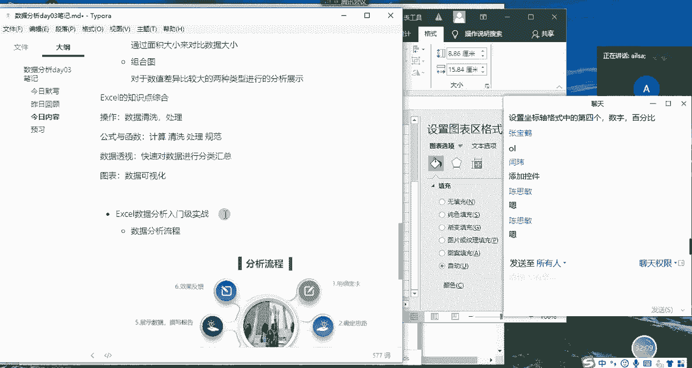