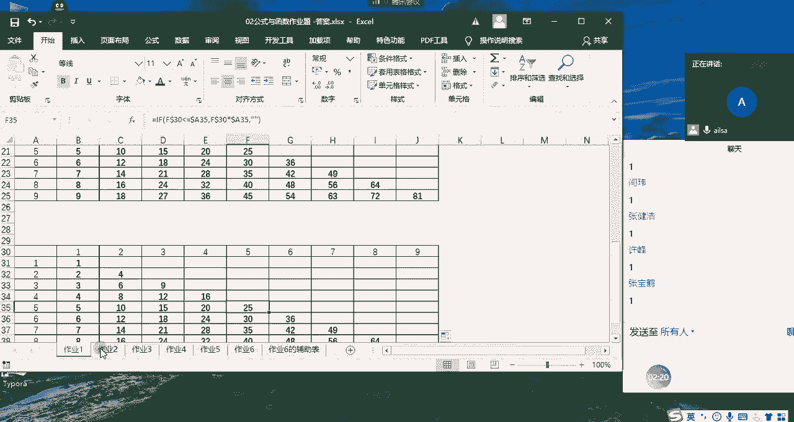
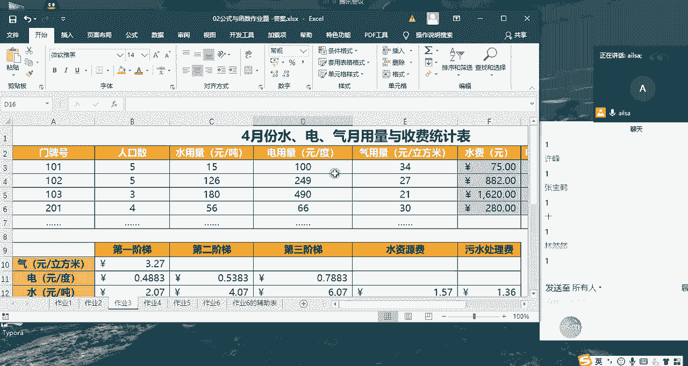
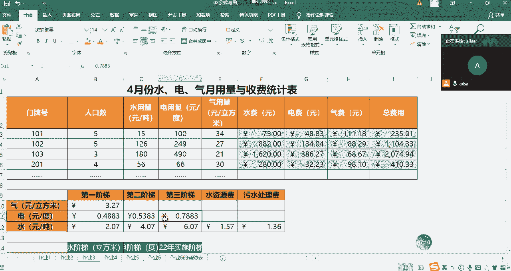
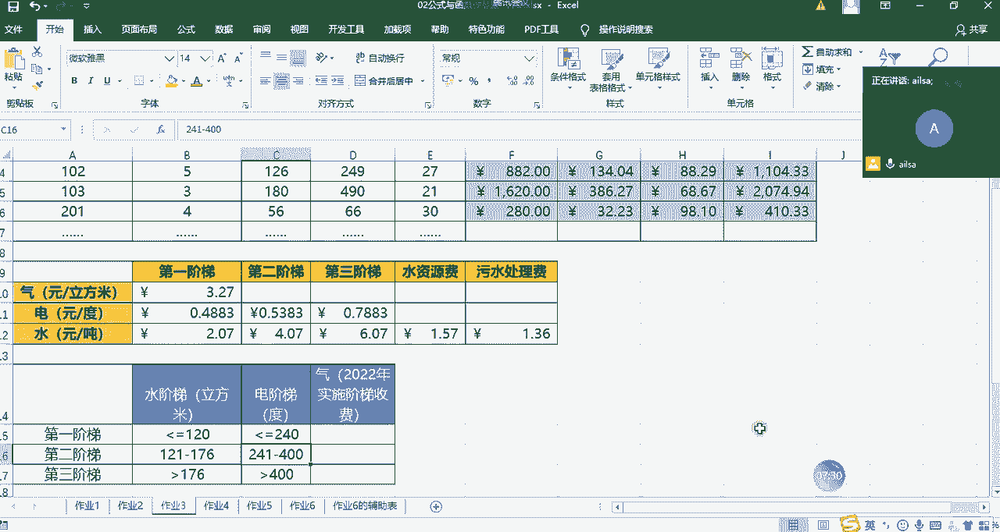
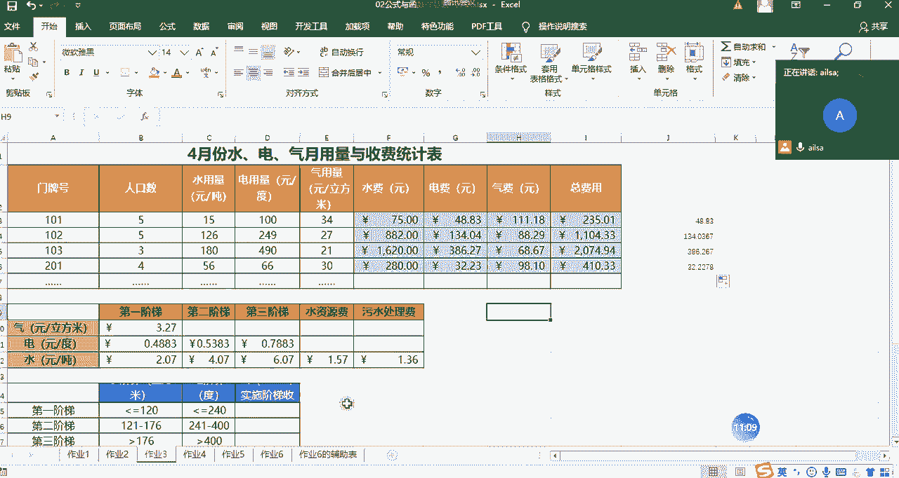
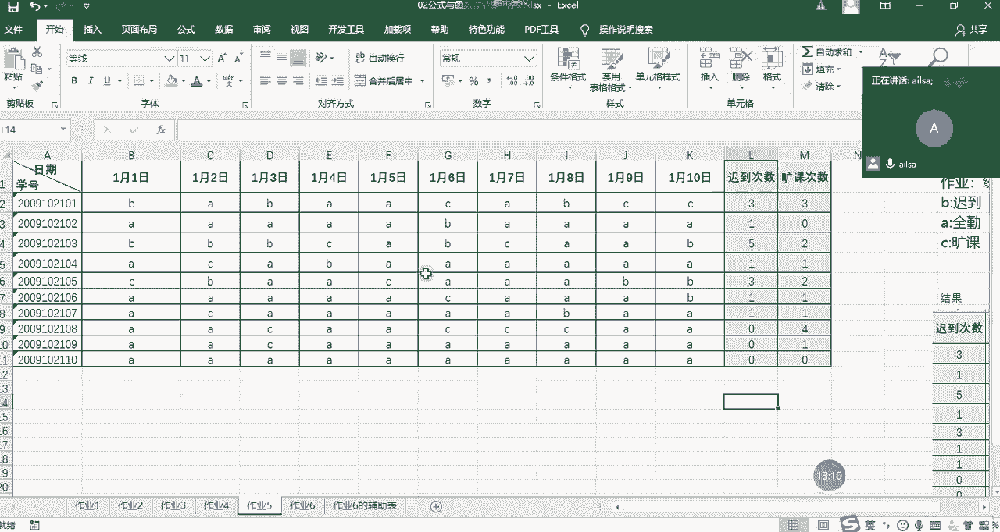
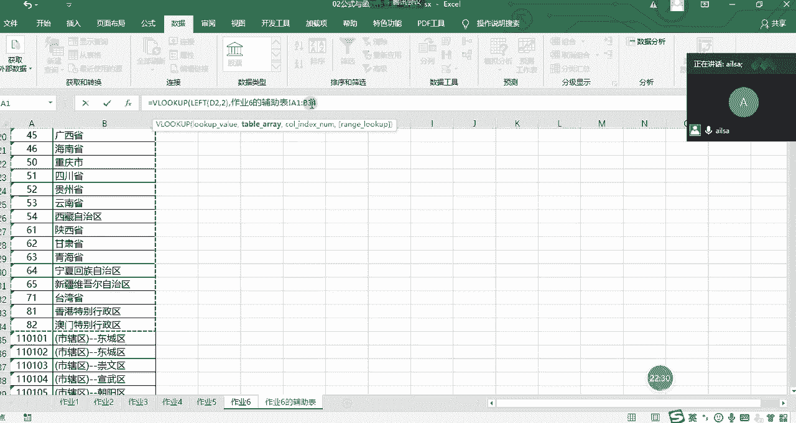

# 强推！这可能是B站最全的【Python金融量化+业务数据分析】系列课程了，保姆级教程，手把手教你学 - P56：07 公式与函数作业2 - python数字游侠 - BV1FFDDYCE2g

OK啊那我们刚才做了这样的一步操作了之后啊，因为我们的公式啊，我们的乘法表一般都是这样的一个形式对吧，那我们可以看到这个单元格为空的条件是什么，我们来分析一下啊，我们来分析一下这个一和一是相等的。

那一跟二一是小于二，小于三，小于四，对不对，那到这个单元格之后，二是小小于等于二的，然后小于等于三，小于等于四，小于等于五，但是它是大于一的，对不对，那三呢是大于一，大于二，小于等于三。

也就是说我们会发现这个单元格，小于等于这个单元格里面的内容的时候，它就会显示，如果不是它就为为空，对不对，那我们就可以根据这个条件来进行判断，就是如果说B30小于等于A31。

然后我们就让它显示我们计算出来的值，然后否则的话就为空对吧，那因为我们这边要进行进行一个拖动，所以说我们还跟我们后面的这个结果一样，就是在我们的列方向上在竖啊，在我们的数字啊前面加到了福。

我们不希望它的数字往下拖动的时候发生变化，那对于这个行方向上，我们希望它的行发生变化而列啊啊，我们希望它的啊行发生变化而列不发生变化，所以我们在列方向上加了dollar符，唉这样的一个结果。

我们再重新拉拖动一下，往右拖动，然后再往下拖动，就实现了我们所想要的效果，那九九乘法表呢，它是一个很好的来理解我们混合引用的啊，一个题哈，那相信大家在学Python的时候，我记得应该是大家的课程。

应该在第二天的时候就会用嗯，用Python来实现九九乘法表的一个算法对吧，也是用if if的判断它俩之间的一个值的大小，然后进行一个计算啊是吧，是吧，同志们，这道题听懂了吗，听懂给我扣个一。

嗯好的哈好的，嗯好的，那我们看作业二啊。

作业二的话，它其实啊就是一个还是一个条件判断，也就是说我们啊这是一个班级的成绩哈，我们都知道我们上大学都有不同的科目，然后呢现在要计算一下三门均通过啊的啊，如果说这个人三门都通过了，他返回的是true。

如果不是它返回的就是false，那还有一个就是他三门只要有一个通过了，就会true，有呃如果说都没有通过啊，三门都没有通过才为false，那就是if and的一个联合使用。

以及if if和or的联合使用，我在这里跟大家写一下哈，那它就等于首先我们要写一个if对吧，然后我们的条件就是他这三科当中，只要三门都都要通过，也就是什么叫通过呢，就是大于等于60分，我们就叫及格。

然后那我就可以选择啊，我们先把我们的and写上哈，and啊我们的函数，然后里面的条件用逗号隔开就可以了，我们选择数学大于等于60啊，然后是计算机大于大于等于60嗯，然后是我们的英语大于等于60啊。

这样的一个结果我们啊啊没输入完哈，Sorry，然后这是我们的and啊，就是我们的条件输入完了之后，如果它成立，我们就返回true啊，在这里面应该是我想想啊，应该是啊，如果说我们想返回一个字符串的话。

我们就输入true啊，然后否则的话是返回的false，大家一定要记得用啊，双引号哈啊不像我们在写Python的时候，单引双引都是一样的，在这里的话是不一样哈啊我们拉动看一下O啊。

跟我们想要的结果是一样的，那如果说啊有1/3啊，就是只要有一个通过的话，我们是用的or写法是一样的，我们只要把我们的and改成or就可以了哈，复制到这里，然后我把这个and改成or，就可以了啊。

OK那这就是我们所达到的一个效果哈，这个就比较简单，我们在课上已经讲过了哈，没有什么问题啊，然后我再接着往下讲，我们第三道题啊，第三道题其实嗯其实不难啊。

他就是逻辑上啊稍微有点复杂而已啊，这种的话在我们的工作当中也比较常见哈，你不要觉得说啊。

你不要觉得说你在工作当中啊，就真的啊就会处理一些特别简单的数字哈，有一些还是挺复杂的啊，这要换了啊，在这OK我们把它拉近一些，然后去看哈啊我们看这个数据，就是我们先看标题哈，4月份水电气啊。

每个月的用量与收费的一个统计表，也就是说啊，这个表里面是每一户人家，他的整个的一个呃人口数量，水的用量，电的用量和气的用量，现在想让你算一下他们每一个月，他们这个呃4月份需要交的水费电费。

气费分别是多少，然后以及总费用是多少，这样的一个呃呃呃这样的一个应用场景，那我们在计算不同的费用的时候，它有不同的标准，那都分为哪些标准呢，我们看一下啊，对于气而言就比较好算了对吧。

气的话直接就只有一个价格，那我们在这里面算气啊，就直接是等于A它的弃用量啊乘以啊，它的一个价格就可以了，我们按的键看一下是不是，但是我们要往下拖动，所以说我们的这个价格是不发生变化的。

我们直接在这加上一个dollar符就可以了对吧，然后我们再往下拖动，看一下是不是跟我想要的啊，效果是一样的，那这就是我们的气费的一个计算方式啊，我在这删掉就可以了，然后接下来我们看电费的一个计算方式。

它分阶梯的啊，第一阶梯啊，如果说你达到第一阶梯是这就是这个价格，如果你达到第二阶梯，就是这个价格，如果达到第三阶梯就是这个价格，那其实就是一个逻辑判断啊，那它是分三种情况。

所以说我们需要用到if函数的嵌套，我们看一下是额电费的话，他的一个的它的一个啊计算的标准，哎我们看电费啊，电费是240啊，有一个阶段，400，有一个阶段，那这个时候我们就要写我们的逻辑判断。

我先把表稍微缩小一下啊，放到一个框里去写，OK啊，放不到，OK啊240啊，400和啊，240和400这两个阶段哈，现在我们计算以下的是电费啊，我们先写等于F，然后我们先看一下我们的条件。

我们的条件肯定是电费的一个用量，我们去给他做一个判断啊，我一般习惯性是从大到小哈，你也可以从小到大都可以哈，假设这个它的用量大于啊大于400啊，大于400，那它的一个呃电费的计算方式。

就是100乘以它的一个价格是多少呢，它就达到了是啊，第三阶梯对吧，那电费的第三阶梯是这个价格，我们乘以它就可以了，那如果说它小于400的话，它又分两种情况对吧，分两种情况，一种是小于等于240的。

那这个时候我们又需要加一个if if函数，进行一个逻辑判断，就是我们这个电用量，然后如果说它小于是400啊，然后呢它大于240啊，大于240，大于小于等于400，大于240，240啊。

这样的一个结果的时候，它返回的就是我们这个电容量乘以啊啊，第二阶梯的一个价格，否则就是我们的电容量啊，就小于等于240的时候，就乘以的是我们的第一阶段的价格，这就是我们所想要的效果。

但是在这里我们需要往下拖动，所以说我们这个价格是死的，所以我们需要给它加上刀乐福，就是我们整个的一个11啊，就是我们的价格都需要加上绝对引用的符号，这样的话才不至于说我们往下拖动的过程当中。

它的数据发生变化，OK我们输入完了之后，我们需要加两个括号，第一个括号对应的是呃内内部的if f函数，再加一个括号，对付的是外部的一个函数，其实这个啊这个逻辑判断对于我们而言，真的是太简单了。

因为你没用Python写的时候，if f lf lf等等好多好多个判断，我们这个其实就嵌套了几层而已，然后我们看一下结果啊，是一样的对吧，OK没有问题，这就是我们的电费的计算，那接下来我们看水费的计算。

水费的计算呢跟电费的计算是类似的，它也分三个阶段，但是呢他后面还有一个水资源费和污水处理费，这个的话是什么意思呢，就是说嗯啊水费什么，OK他就是说我前面计算了一堆之后。

我还要把我的啊把我的这个啊水啊看啊，水费的啊，这个用量乘以啊，我的啊我的污水啊，水支援费和污水处理费，这也是按吨来计算的，所以说我需要在前面进行逻辑判断之后，还需要单独加上随机水资源费和污水处理费。

那这个的话我就不给大家做演示了哈，因为它跟前面是一样的逻辑判断嗯，他这边的分阶段的话是，176和120啊，176和120，作为一个分界点来进行了一个计算的嗯。

那大家对于作业三有什么问题没有啊，没有问题的话，给我扣个一，嗯好的啊，我讲的应该是算比较详细了哈，OK那我们看作业四哈，嗯作业四的话，嗯我嗯作业四其实没必要去讲了，我再跟大家说一下作业四。

它就是说我想统计一下，我想统计一下我这个啊这个清单里面啊，带介字儿的啊，带借字的一个的额金额的计算，以及就是借方和贷方，他总共的一个金额的分别计算，那我们相当于是一个条件的求和。

我们的条件是我们的借和贷，我们的求和区域是我们的金额对吧，然后按照我们some if的一个啊三个组成部分，第一个就是我们的条件区域，第二个就是我们的条件，第三个就是我们的求和区域啊，这个就比较简单了。

那贷方也是一样，我们的条件区域条件啊，求和区域啊，这个样子好，这个我就不详细讲了哈，然后我们看一下作业五，作业五的话嗯，作业五的话他用的是我们的条件计数啊，条件计数我们看一下它这个它记录了啊。

我们的啊统计迟到和旷工的次数呃，呃A代表全勤，B代表迟到，C代表旷课，那你就是一个条件计数，因为它没办法求和呀，它是数，它是文本，对不对，那我们就是嗯条件技术的一个组成部分，就是条件啊条件区域条件。

那我们的条件区域就是我们这啊，这么多日期当中的一些数字呃，呃内容哈内容，然后我们的条件就是B对吧，旷课的话就是啊我们的C，然后我们这边写完了之后进行一个计数，就可以达到我们所想要的效果对吧。

这是count if的一个考察。

然后我们再看作业六，作业六的话大家遇到的一个问题在于什么呢，在于这个出生日期哈，因为出生日期，我们是从身份证号码当中提取出来的，提取出来的时候有可能它不是日期格式，然后我们啊来一一演示一下这个东西哈啊。

首先我们要提取我们的呃那个出生日期，那我们是要使用密的函数，因为他要从中间去提取对吧，然后我们知道它是从第七位吧，123456对，第七位啊，第七位开始，然后取八个啊，这样的一个内容，然后按enter键。

哎我们看到他已经有了，对不对，1980年3月23号，然后我们把它选择了之后，我一般建议我们先把公式去除掉，我上回教大家的是选择性粘贴，直接粘贴数值就可以了，那我今天再教大家一种更简便的方法。

嗯嗯大家看好了哈，看仔细了哈，我把鼠标选中这一列，然后啊然后大家看到没有，嗯你这个也没有问题，同志们刚才是不是卡了啊，现在能听到我的声音吗，能听到哦，可以哈，OK好的嗯，你这个也没有什么问题啊。

可以的啊，因为你是呃你是把年月日提取出来之后，使用date来实现的，完全OK哈，很好，我给大家演示我这种方法哈，听我讲完，然后我们选择这一列，然后在当鼠标出现，大家看到没有，当鼠标现在是我这个状态。

也就是说四个方向的箭头的时候啊，也就是选中边边上四个方向箭头的时候，我按住鼠标的右箭不放，向左拖动一下啊，向右拖动一下，然后再拖动回来，这个时候我们选择仅复制数值啊，它就变成文本了。

嗯啊就可以直接把公式都去除掉，你看在这里啊，直接去除了，然后我们把它变成日期格式就可以了，也就是我们的数据分裂嗯，然后点击下一步，点击下一步选择日期输出完整，OK他已经变成日期了哈。

如果大家不想要看到这样的一个形式，我们直接输出这样的格式也是可以的。

看到没有，这个已经啊就是我们想要的日期格式啊，那接下来我们看一下后面的一个要求年龄啊，年龄怎么计算呢，就是我们的当前的时间对吧，当前的时间减去我们的出生日期啊，他就是我们的呃年龄。

那返回的是一个年Y对吧嗯这是年龄的计算，这个倒没什么问题，但是前提是你这个这个一定是日期格式哈，不是日期格式，它是识别不了的，这就是为什么我告诉大家，在我们计算表的过程当中，一定要是日期格式。

然后工龄是怎么来计算的，就是当前的一个时间减去入职日期，就是我们的工龄，但是我们的工龄是以年作为统计单位，那这个有什么不好的点呢，就是说如果他不满，你看它这个我们计算一下哈，啊现在是2020年6月。

那他这个入职日期是2003年1月啊，也就是说他算整年的话是17年，但是他是17年多点，不足一年呢，他就直接舍去了啊，是这个意思，现在我们要计算到呃，工龄精确到月的时候，我们还需要把工龄计算出来。

然后再看他的月份是多少，这里的话我们采用的是这样的一种方式，就是我们把它的月份差值计算出来之后，除以二，它整除啊，整除整除12得到得到的那个余数哎，那个余数就是它剩余的这个月份，那他整除的那个。

比如说它除以它那个值得到的整数，就是它的年啊，嗯hello，同志们信号弱吗，啊在吗，都，呃信号好吗，因为我这边一直显示信号弱，OK没有问题哈，啊信号没问题，OK我这边一直显示信号弱好嘞。

那这就是工龄的一个计算方式啊，啊还有我们的一个工龄的月份的计算方式，但大家对这个有疑有疑问没，有没有even给我扣个一，OK啊嗯，嗯可以，你想直接相减吗，相减得出来的应该是添吧，我可以试一下嗯。

你如果不用did df的话，你想用什么呢，哦你你想要还是想用函数的话，最好还是用dd哈，它是一个嗯它是一个很好的处理时间差的啊，这么一个函数嗯，嗯我我最后再啊再说一下，很多人说嗯你说有一个结果的呈现。

我到底是用函数好呢，还是用操作好呢，啊我跟大家说一下，如果说你用函数的话，因为函数它的底层封装的还是代码，所以说它的它对于系统，对于这个函数的处理的话，相对于操作而言会慢一些啊，啊会慢一些。

我看一下烟味啊，Date df，然后，减去是减去啊，i 2×12，所有的嗯excel里面啊都不会啊，data data是一个隐藏函数啊，是一个隐藏函数，也就是说它不会它它如果你呃如果你不使。

如果你使用它，它是没有提示的啊，但是据我所知的话，嗯除了零三版，我不知道零三版有没有，但是零七版之后都是有的啊，如果眼尾这边计算的结果是没有问题的，也是可以的啊。

啊只是我们的一个相当于是一个公式的问题哈，啊DDDP至少在零七版机以后都是有的啊，这点我可以保证，OK那接下来是我们的一个呃省直辖市啊，县的这样的一个计算方式哈，这个嗯好，我先问一下。

但大家对于这个目前的一个呃呃呃掌握了吗，啊就是说我们we look up的时候，我们的目标啊，我们的目标是通过前面的一个身份证号码，去提取的，相当于是一个嵌套的使用啊，嵌套的使用OK啦是吧。

嗯对嵌套嵌套的使用我提取出来啊，然然没有搞定吗，这个所在的直辖市和地区是吗，是的，OK那我重新演示一下哈，我以为可以呢，OK啊，那接下来我就告诉大家我们该如何通过啊，提取我们身份证号码的前几位。

然后去匹配我们这个表里的所对应的啊，所对应的啊，是啊和啊这个对应的呃省市吧，啊就是对应的省和市，我们看一下哈，呃那我们先研究一下哈，先研究一下我们这个身份证号码，我这边的公式里面写的是啊D2的前两位。

前两位是三七哈，我们先啊做个试验哈，三七，啊它这个前面啊前面是代表的是省，然后后面代表的是我们的啊，对应的一个区啊，什么什么的，这样的哈，我们试一下，我们先试一下哈，等于啊we look up啊。

We look up，第一个是我们的查找内容，假设现在我们只提取前两位，那我们就是learn啊，我们从啊left是吧，left哎我们这个表的身份证号码，然后我们提取前两位，前两位之后。

我们得出来的就是对应的是我们省的编码啊，就是我们要找省的编码在哪个地方去找呢，在我们的辅助表里面去找哈，辅助表里面去找，这个时候我们选择的时候，我们只要选择我们两位的啊东西就可以了，我们试一下啊。

然后我们选择这一部分数据区域。

然后加上绝对引用，选择我们我们的数据区域之后，我们是在我们选择区域的啊，第二列啊，要的值对吧，我们要的是省，然后返回零啊，精确查找enter键，我们试一下，双击进来。

是不是就是我们所达到的一个想要的效果了，对吧，哎这样的一个呃一个结果啊，呃那个然然听明白了吗，你这边卡在哪了呢，啊你问他啊，知道自己的问题所在就可以了哈，啊没加刀了是吗啊，这个一定要加，这个一定要加。

不然的话区域会发生变化啊，一定是如果说我们某一个区域是不变的话，你在拖动的时候一定要加dollar f，那对于曲线的一个选择，我就不做演示了，是一样的哈，也是这么来操作的。

那其实你会发现说我们在用函数的时候，并不是说一个单一的函数，而是说我们要把一些小的函数和一些大的函数，进行一个嵌套的使用，然后来达到我们所想要的效果，所以说大家对于函数的一个了解的啊。

组成部分呢以及以及它的功能啊，一定要了解明白，然后才能够进行一个融会贯通的使用，好吧。