# 强推！这可能是B站最全的【Python金融量化+业务数据分析】系列课程了，保姆级教程，手把手教你学 - P58：09图表作业 - python数字游侠 - BV1FFDDYCE2g

嗯啊下面呢我们看一下啊图表的作业题，然后我们先看第一题啊，第一题呢是展示不同类型的销售额对比，这里面的类型写错了，应该是类别哈啊不同类别的销售额对比情况。

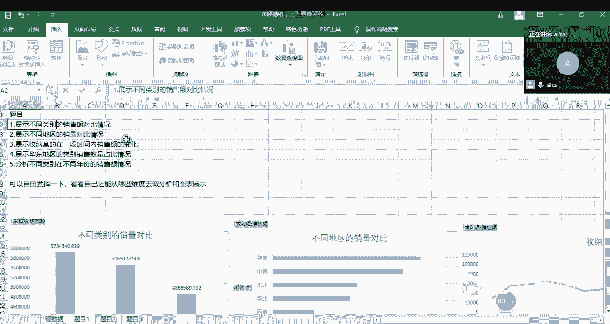

那我们要使用的是先对它进行一个分类汇总，也就是说我们先使用数据透视表啊，对它对不同的一个类别进行一个汇总，我们把类别拖到我们的行方向，然后再把我们的销售额拖到我们的啊直方向，然后在这里面呈现了之后。

我们再进行一个数据透视图的一个创建。

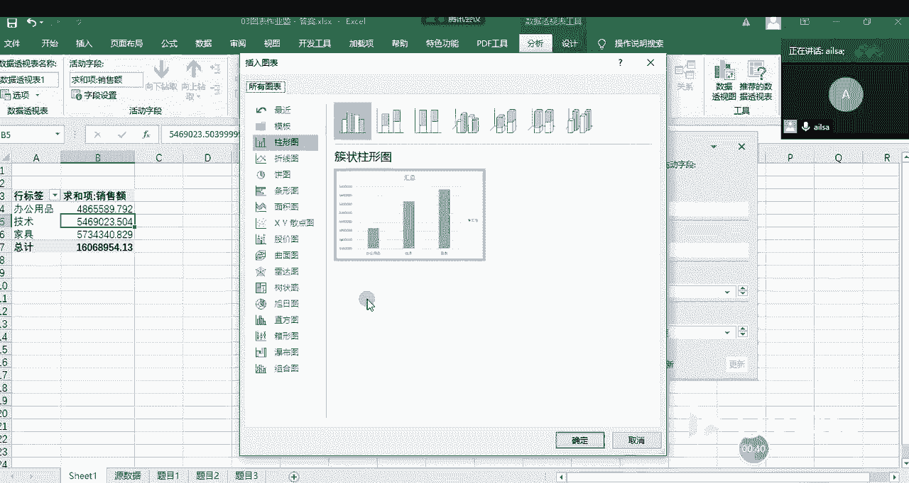

然后我们点击确定啊，这个时候其实就已经做完了啊，特别简单，然后我们加上我们的数据标签哎就可以了，这就是我们不同类别的，它整个的一个销售额的对比情况就已经做完了，唉我们看是不是也比较简单，OK好。

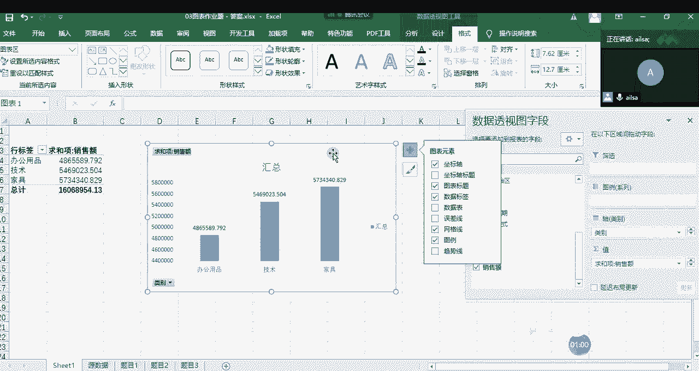

那我接着演示下面的啊，题下面的题的话。

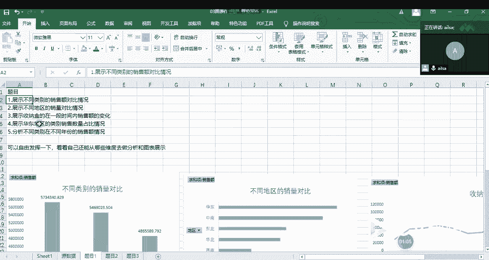

第二个是展示不同地区的销量对比啊，其实这个也比较简单哈，不同地区我们把类别去掉，然后我们找到地区啊，有这样的一个分类，然后把它拖到行方向，它要展示的是销量，对不对，那我们把销售额拖出来。

然后再把我们的数量拖进来，这个时候就是不同数量的一个对比了，然后我们再加上我们的图啊，就可以了，我们可以是柱状图，也可以是条形啊，折线图啊，也可以是条形图哈，折线图不合适啊，啊调整图啊。

这样的一个结果啊就可以了，那如果说你这样看不不是特别好看，我们可以先对它进行一个排序啊，进行一个啊降序吧啊，按照数量进行一个降序排列，这个时候我们再对它进行一个图表的创建，大家看到没有。

它就会按照一定的顺序啊去排序了，这样的话看起来会更美观一些，A这个数据还真的像楼梯一样哈，还真的啊一阶一阶的往上提升啊，这样的啊这样的一个效果，这就是我们的不同地区，它的一个销量的对比情况。

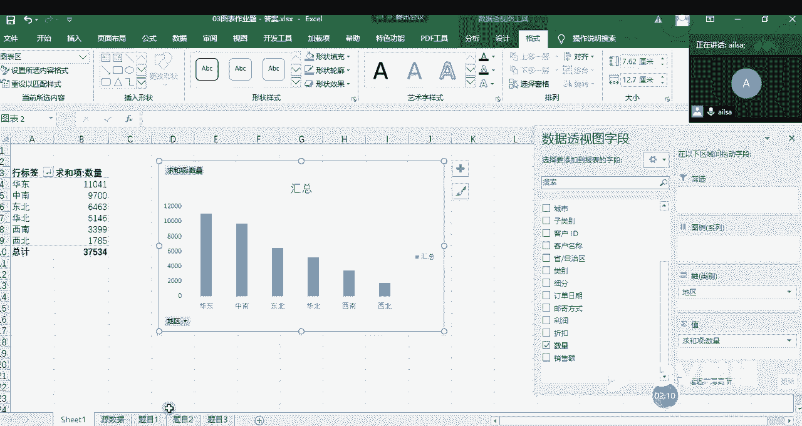

嗯那我们再看第三道题，它是展示收纳盒在一段时间内销售额的变化，那这道题呢我们有两种做法，第一种做法我们把收纳盒的数据复制出来，然后再再展示它在不同时间内的一个啊，销售额的变化。

第二个呢是你用数据透视表做出来，然后做筛选，那我演示第二种哈，用数据透视表去做。

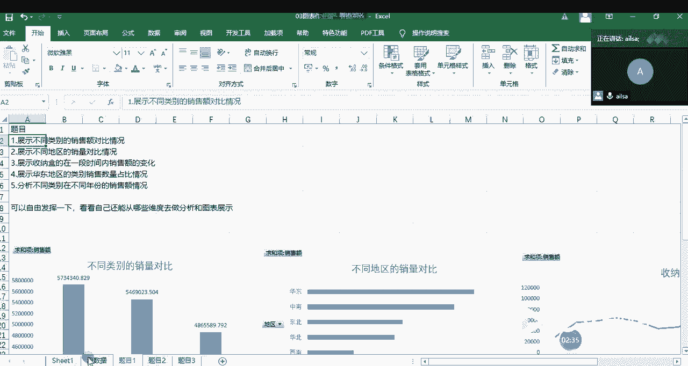

那首先我们要知道收纳盒属于什么，收纳盒的话，它应该是属于啊属于类别类的还是子类别类，OK不是类别类哈，应该子别子类别类子类别类哈，就是我们的收纳盒哎，在这里，那我们就先把它拉出来啊。

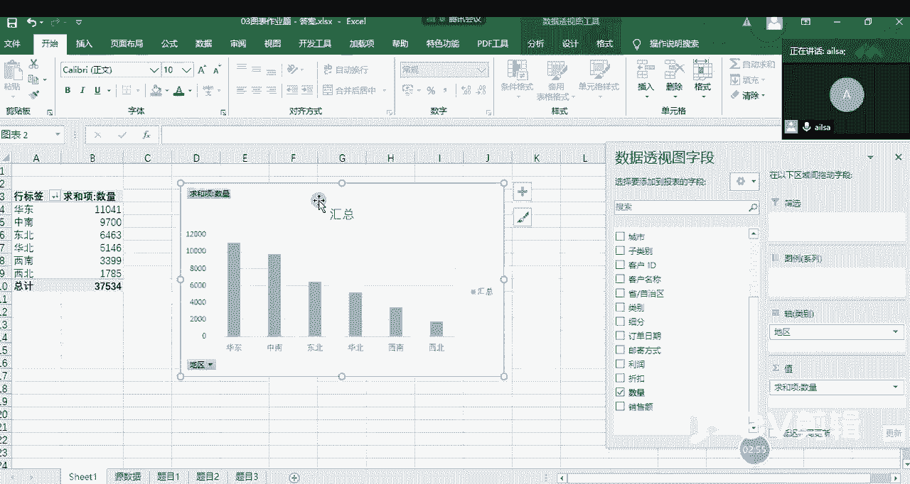

嗯他求的是什么啊，销售额的变化。

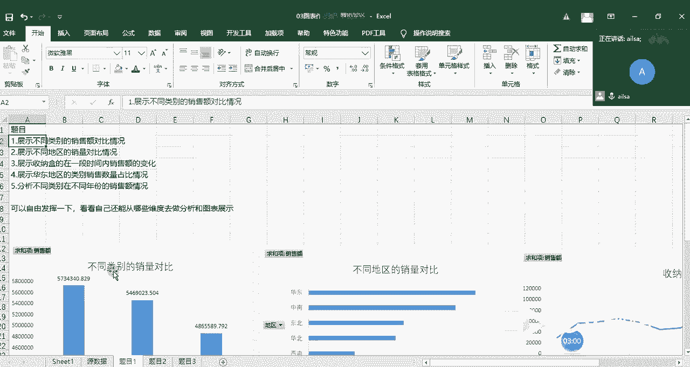

所以说我们需要把销量先去掉，然后D区也去掉，然后是我们的子类别先拖到行方向啊，这类别拖到列方向，因为我们还有一个在一段时间内的变化，我们把订单日期拖到行方向A啊，这个时候就可以了。

然后我们再把我们的销售额拖到我们的直方向，它是不是显示了所有的子类别啊，那在这里是可以筛选的，我们点击这个筛选选择唉，选择我们的啊收纳盒，点击确定，这个时候只显示了收纳盒在时间啊。

一段一段时间内的一个数据，我们可以把它精确到季度啊，点开就可以了，因为点开之后我们等会儿做图表的时候，它就会出现，我们点击分析，然后点击数据透视图，然后我们点击的是折线图，哎我们点击确定啊。

这个时候它就可以反映在一段时间内啊，我们可以看看所有的数据哈，就是2016年到2019年，它整个的一个啊收纳盒的一个，销售额的变化的趋势，那很明显它随着时间的变化，它整个都是以呈现一个上升的趋势的。

对不对啊。

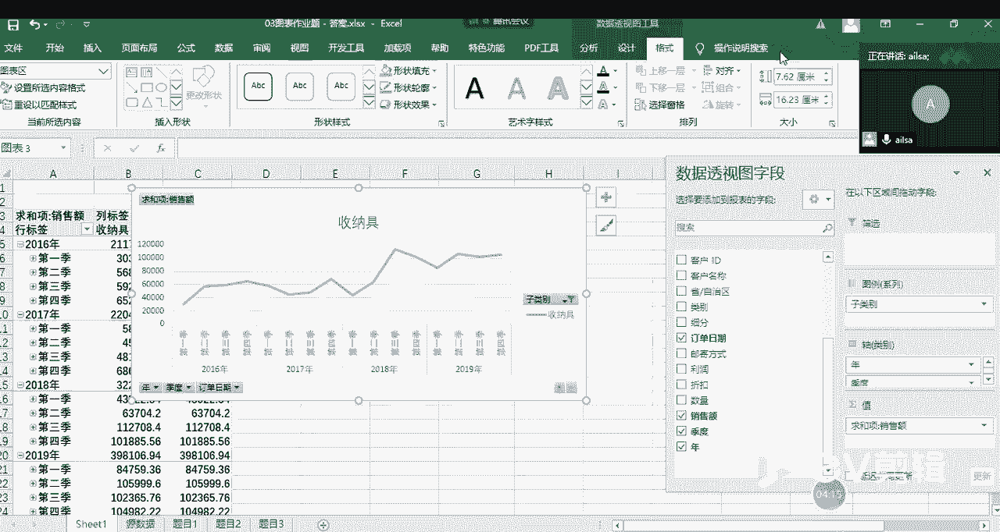

那大家对于这个有什么问题没有啊，没有什么问题给我扣个一，嗯嗯我这边看到微信群啊，有人说啊，这个分类汇总有汇总是吗，你可以去掉就可以了，啊王刚那个实现了吗，你是想表达你那个呃分类汇总啊。

老显示是不是那个是需要去掉一下的，我给你演示一下哈，我看这是哪道题，OK嗯我不我就不以这道题为例了哈，我给你演示一下。

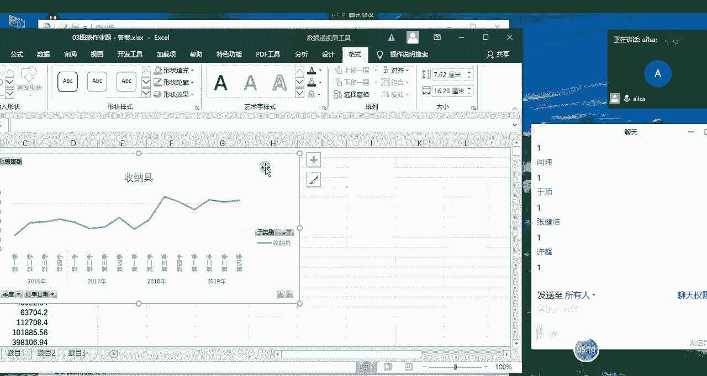

对于分类汇总了之后，然后他如果说你不想要。

该怎么去掉哈，我们先把这个需求啊去掉，嗯OK我们把啊把我们的订单日期去掉，销售额都去掉哈，然后此类别也去掉，然后现在我按啊，我按地区啊，地区啊，然后对它的一个销售额情况进行一个汇总啊，啊不对。

他这个还是哦还是有两层判断，每一个地区啊，每一个地区下面的城市吧，啊城市A哎你会看到这里面有很多，对不对，然后它每一个都会有，不是每一个都会有啊，没有分配的话，设计一下啊，在组组的底部显示分类汇总。

你看这里面是不是有分类汇总啊，然后你如果不想显示的话，你直接啊分类汇总不显示混论费种，它就出来了这样的一个结果啊，直接在这里面设置就可以了，显示的话你告诉它是在底部还是顶部。

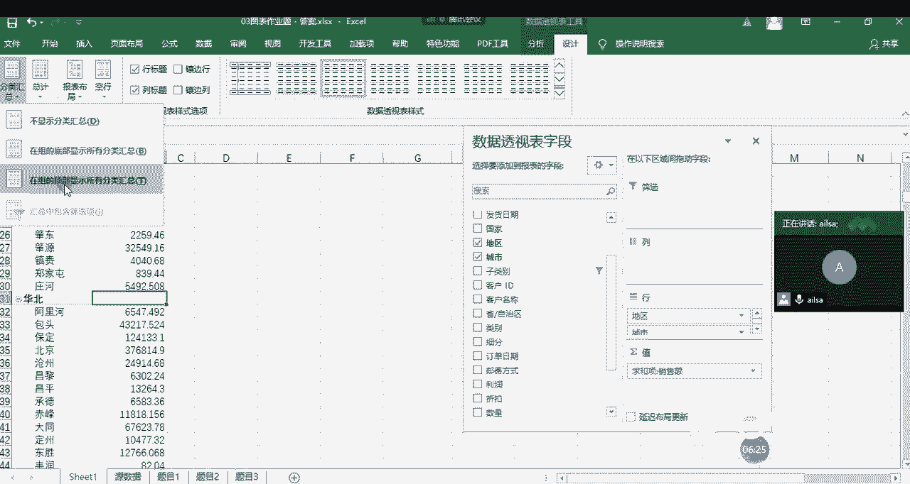

如果不显示的话，直接在这里面设置就可以了啊，王刚明白了吗啊，如果明白，给我扣个一，王刚同学，不不不需要一样哈，不需要一样，你那个差哪儿呢，我看一下啊，你说值吗，是，财务ARTI，不需要一样哈。

这个完全不需要一样啊，这个没有那么死板哈啊，一定要记得这个东西不要学死了哈，千万不要学死了，你不要以为我的就是标准答案，没有啊啊没有标准答案哈，哦是这个没有标准答案的，这个你想按照。

你也想按照你自己的一个效果就可以了，哼我们可以在这儿进行一个调整，什么的都可以哈。

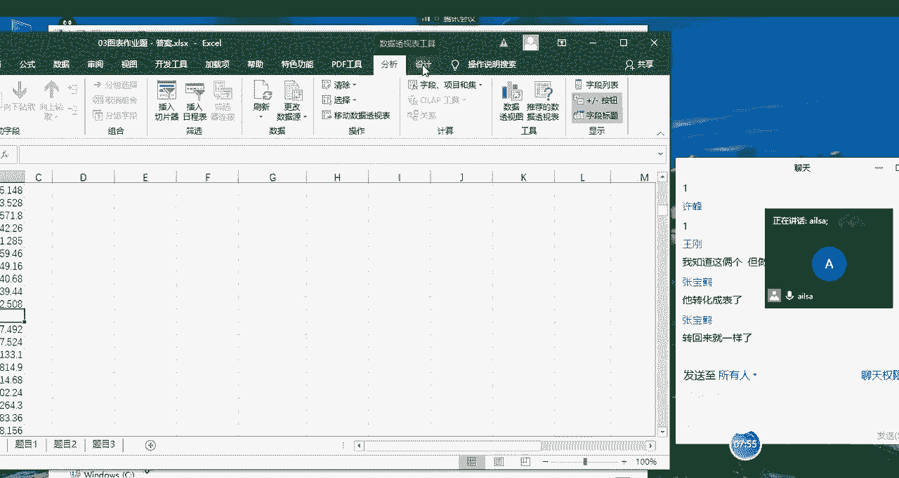

就就这几种，这几个都是进行调整的，你想调整成什么样都可以哈啊你可以试一下。

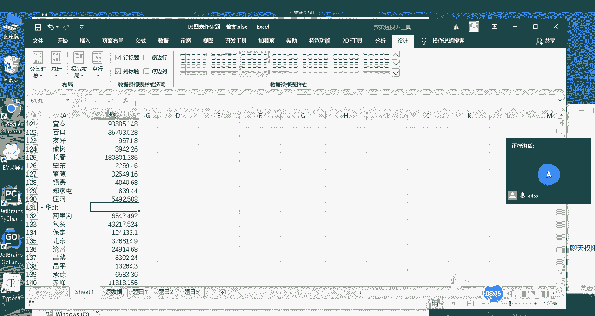

OK好那我们往下讲题目二哈。

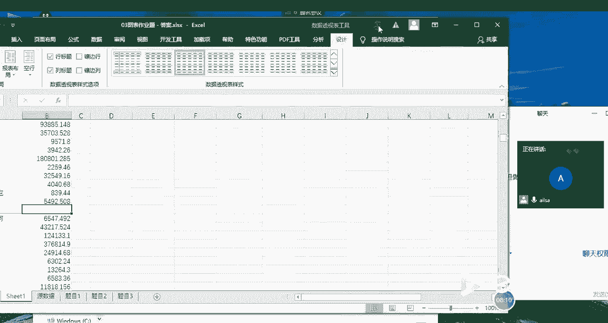

题目一讲完了吗，哦还没有哈，好OK最后一个啊，华东地区啊，还有一个第四题哈，华东地区啊类别的销售数量占比情况。

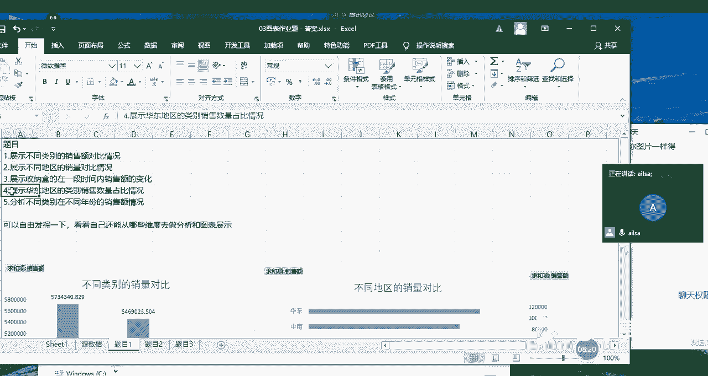

华东地区啊，首先你可以把华东地区的数据筛选出来，然后进行一个销量的一个占比的计算，你也可以直接用数据透视表，然后给它全部都显示出来，然后呢再进行一个筛选啊，啊就跟刚才我那样操作的似的啊，我就不演示了哈。

这个这个没必要再显示了，啊再演示一下吧，华东地区啊。

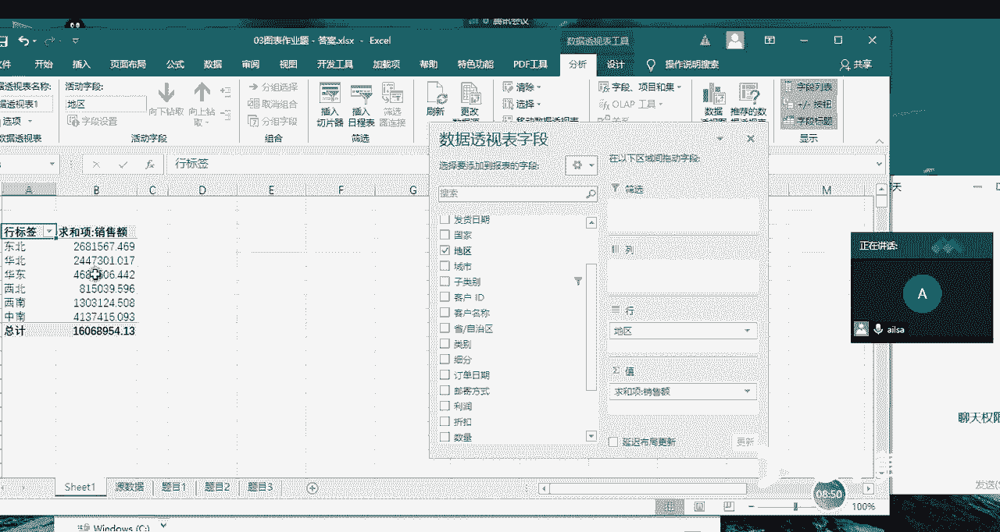

我们再看一下题目啊，华东地区类别销售数量的占比。

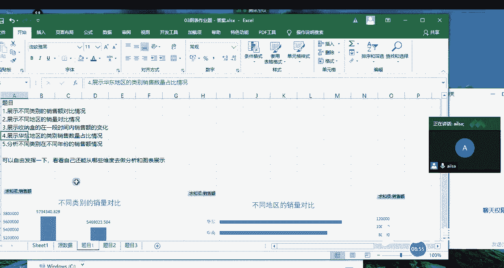

那就是我们先把地区筛选出来，然后再把类别啊类别，好类别放到这里哈啊地区放到列方向啊，这个时候我们就可以对它进行一个筛选了，筛选为我们的华北地区啊，华北地区，然后点击确定。

这就是华北地区它不同类别的一个销量，我们把数量拖进来，就是一个销量情况，然后我给他建一个嗯。

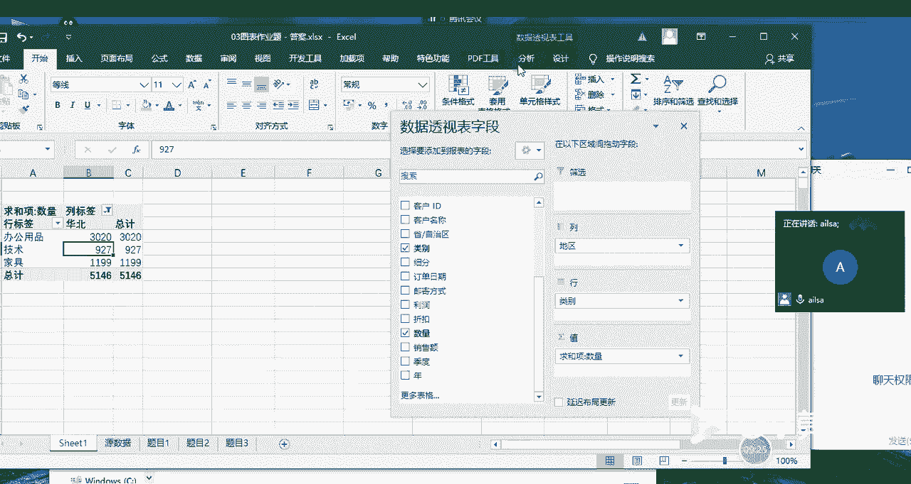

我给他建一个数据图，然后我们选择饼图就可以了。

那在这里的话，它就是每这三个类别的一个占比情况就出来了。

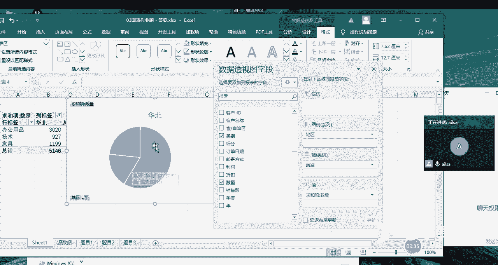

这就是我们的第四题哈，嗯第四题，那第五题的话是分析不同类别在不同年份的啊，销售额情况，我们看一下啊，不同类别在不同年份啊。

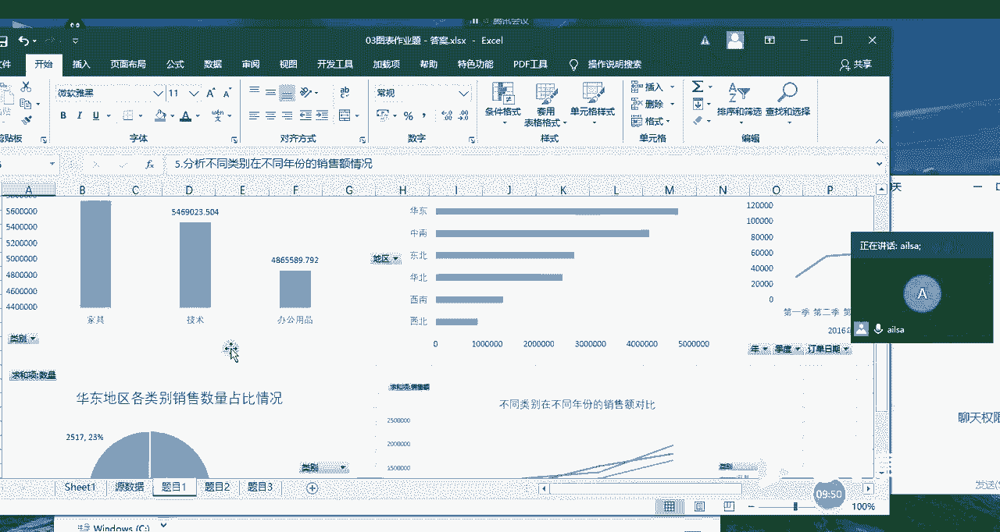

那我们它的就是有一个呃呃维度是类别，一个维度是年份，那我们可以这么来操作哈，我们一般情况下是把年份放在我们的啊，我们的行方向，这样的话它就可以在水平轴去显示了，我们把我们把嗯啊订单日期哈。

订单日期放到我们的行方向，然后把我们的类别啊，类别放到列方向，哎然后我们可以显示到季度啊，我们可以点一下，喜欢到嫉妒他，这个只能一个个去点，我也没有想到快捷的方式，然后这个时候我再创建我的数据透视图啊。

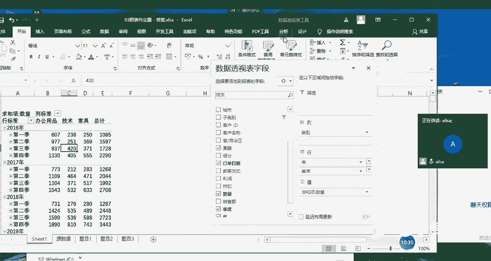

然后创建我们的走势图哈。

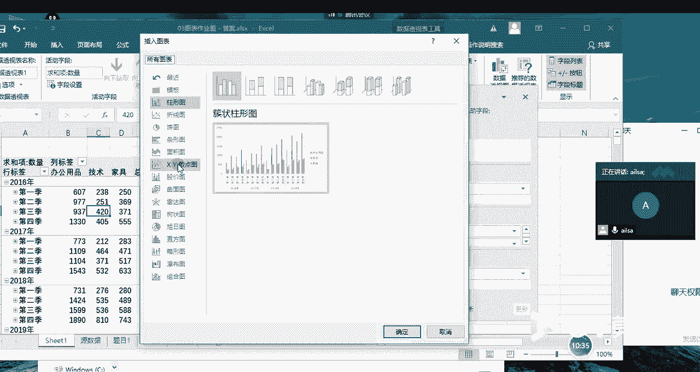

唉折线图唉，这样点击确定它就会出来啊，每啊每一种类别在这段时间内，它的一个变化走势，我们也可以看到它虽然中间会有波动，但它整体是呈上涨趋势的啊，是这样的一个啊分析的结果啊。

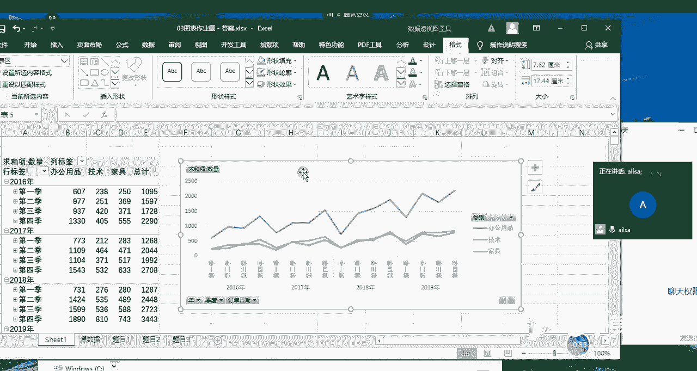

好那大家对于题目一啊有什么问题没有，啊有什么问题没有没有问题给我扣个一，我们就接着讲题目二和题目三，好的好的。

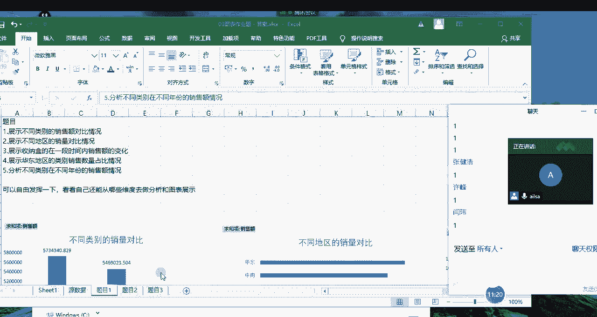

OK那那题目二其实没必要讲了哈，题目二是我们的一个雷达图，他分析每一个用户它在不同的维度，它的一个整个的能力值啊，那离中心越远，代表它这个啊值越好，也就他能力越强啊，这样的一个效果，这个就特别简单啊。

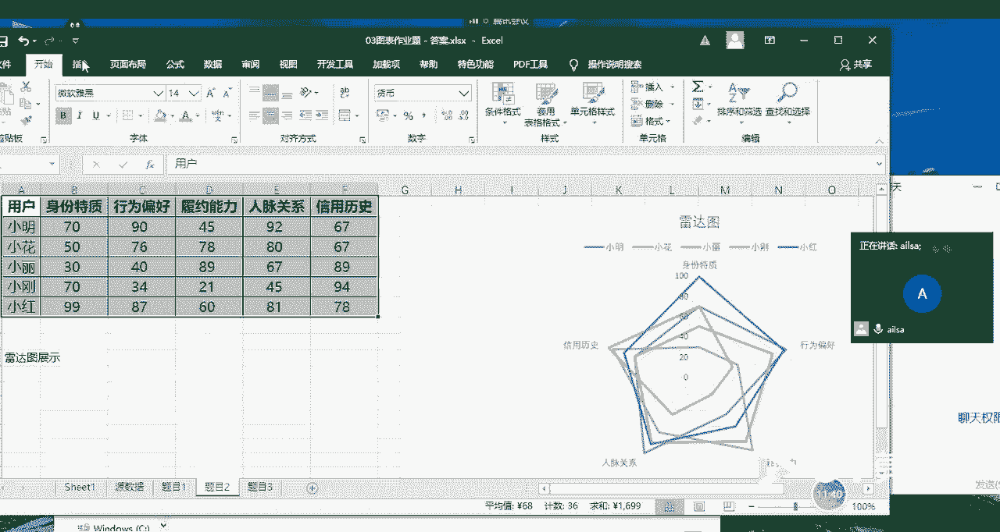

我们就选推进的图表，然后选择我们的雷达图啊。

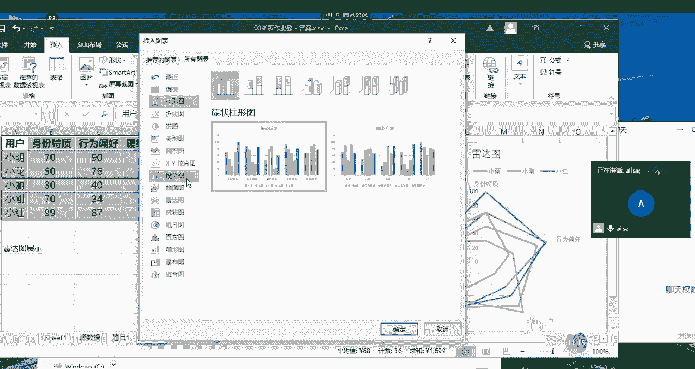

点击确定啊就可以了，就出现我们所想要的效果了，对于这个的话，我一般习惯性把我们的土地啊，图例放到右手边啊。

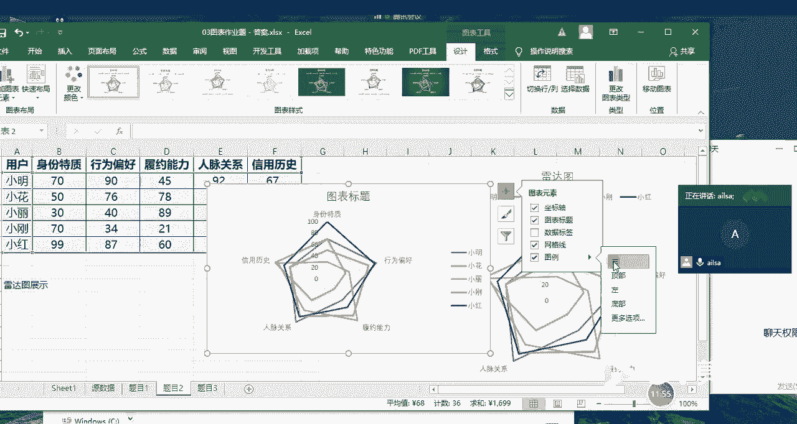

会更好看一些啊，这个就啊简单哈啊这个不用讲了。

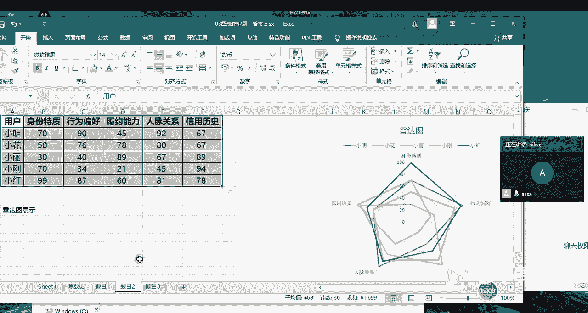

然后我们看题目三好，题目三的话，它给了这样一组数据，然后第一道题问的是比较随意的哈，他说你针对这样的数据提炼能提炼出什么哈，没必要说大家一上来就很容易就发现问题啊，当然了，大家也不可能这样。

我们就可以简单的去提炼啥呢，它既然是费用的啊，每个月的一个费用的一个情况，那我们何不分析一下嗯，它整个的一个费用的占比呢，你比如说这一年当中啊，我到年终的时候，我想统计一下我这一年当中花的钱嗯。

就是都花在哪儿了啊，这有几种的分类哎，我们可以通过这样的一个形式，然后去给它啊，分析一下每个啊每个类型，它这一年当中花的总费用占总体的多少，那我们可以先把它的一个合计计算出来啊，SU啊some函数啊。

相信大家都会了哈，some函数，然后选择我们的区域，然后，下拉下拉完了之后，我们就可以通过这个合剂啊，和这个类别哈费用啊，然后我们进行一个啊饼图也好，柱状图也好，我们就可以对它进行一个简单的分析。

我们看一下，比如说拿柱状图而言，我们点击确定啊，这个时候就是我们画出来张图了，那我们可以看出什么问题呢，我们的啊整个的费用的话，大部分还是给到了谁啊，给到了工资对吧，工资占了很大很大一部分，其次是奖金。

说明还是给员工发的，再一次呢就是我们的租赁费对吧，我们可以把这个值添加上数据标签，哎那再这就是我们的租赁费，然后等等这些其他的一些费用，然后我们可以看到工资其实是啊，占公司很大一个啊组成部分的。

那就要去啊，对于这个情况的话，我们就要去细分唉这个工资到底啊是哪些部门，他花的比较多，他的成本既然付出了这么多，他的收入或者他给公司带来的价值，有没有达到相应的标准，这样去进行一个人效的分析啊。

我们啊就可以啊针对某一个问题啊，深入下去进行一个啊专而精的啊，这样的一个分析维度，这只是一个我简单提的一个想法哈，因为现在我们的数据数据只有这么多，如果你有公司的薪资数据的话，你还可以针对这个问题。

对工资数据进行一个详细的分析，嗯那这是第一个，那第二个的话就是要趋势分析，分析每个费用在12月，12个月当中的一个变化，有无异常数据，那我们就其实我们如果把它们都放在一起的话，是稍微啊有点难看哈。

我们可以直接啊，我们直接可以看总费用哈，总费用试一下啊，我们把这个月份选上，总计选上，然后我们看看总费用会出现什么样的问题，OK我们可以用折线图来代表在某段时间内，数据的变化趋势，诶。

我们会发现一个很大的特点，就是在2月份的时候，它的整个的一个总费用是达到最高的，对不对，在11月份也有略微的啊幅度的大幅度的上升，那为什么在2月份的时候，它的整个的费用突然就高了这么多。

你看到4月份就整体就下降了对吧，整个就下降了啊，这样子，那我们就会在猜测会不会在2月份的时候，公司公司集中发年终奖啊，所以说它整个的一个呃工资，就是费用就高了很多。

那年终奖其实是属于工工资的一个组成部分，我们带着这样的一个疑问，然后我们就可以对工资数据，进行一个趋势的分析，那我们看一下工资数据，在这一年当中的一个变化，这个时候我们点击插入啊，点击我们推荐的图表。

还是我们的折线图，然后点击确定，哎，我们会发现确实啊啊，我们会发现确实在2月份的时候，工资数据达到了最高哈，有史以来最高，对不对，那说明有可能啊，你要去核对哈，你要再去调取呃，更详细的信息。

比如说到底是哪个事业部，哪个部门或哪些人，他的他的费用造成了整体的一个一个一个提高，还是说所有的费用都相比较之前都提高了，如果是所有的费用的话，有可能考虑到是年终奖的问题啊，那你就可以得出来哦。

应该是年终奖的问题造成了成本的一个提高，那我们从公司的角度去考虑，这个年终奖到底发的合不合理啊。