# 强推！这可能是B站最全的【Python金融量化+业务数据分析】系列课程了，保姆级教程，手把手教你学 - P59：01 昨日回顾 - python数字游侠 - BV1FFDDYCE2g

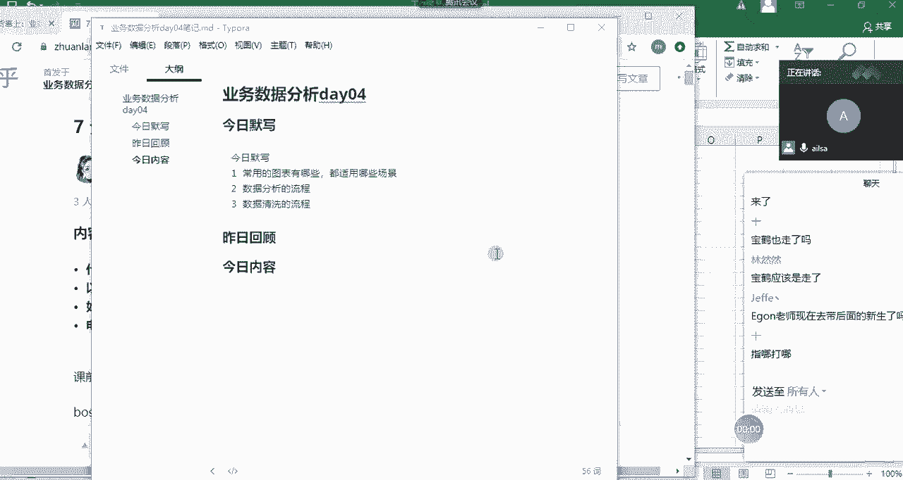

好的同学们，那我们呃就是默写已经完成了，然后我给我给大家说了每个人存在的哪些问题，然后嗯我们在后面注意一下就可以了，然后接下来我就进入到我们的昨日回顾，哎我们昨天讲了什么内容啊。

其实就在我们的默写当中了是吧，所以说我直接来讲就行了，今天的讲课的任务有点重哈，我们就不提问了啊，然后我们昨天主要讲了两个啊内容，一个是我们的图表操作嗯，图表操作。

然后第二个就是我们讲了一个excel的一个啊，实例啊，我们通过这个实例给大家介绍了啊，我们的数据分析的流程对吧，还有就是我们在其中啊，我们在进行数据清洗的时候，它的一个步骤啊。

这样的这些内容啊相对来说是不多的哈，那我们看一下图表，我们都讲了哪些。

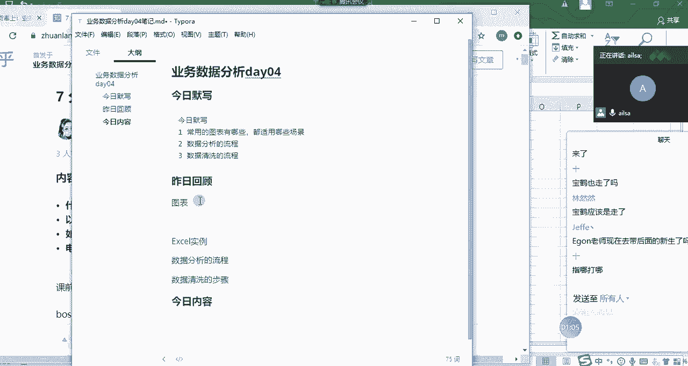

来我们看一下哈，图表我这边回忆一下哈，图表我们讲了柱状图对吧，哎我们首先介绍的是图表的一个组成部分啊，组成部分啊，这是第一个啊，就是它的结构构成，那第二个的话我们讲了不同的图表类型，我们讲了啊。

有柱状图，柱状图啊，还有就是条形图，条形图，然后以及啊我们还讲了是折线图对吧。

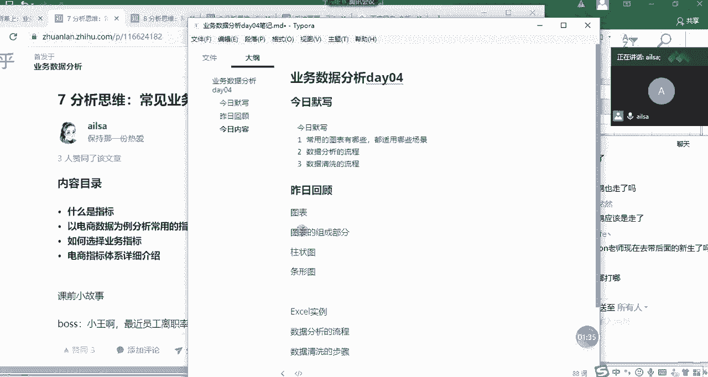

折线图啊。

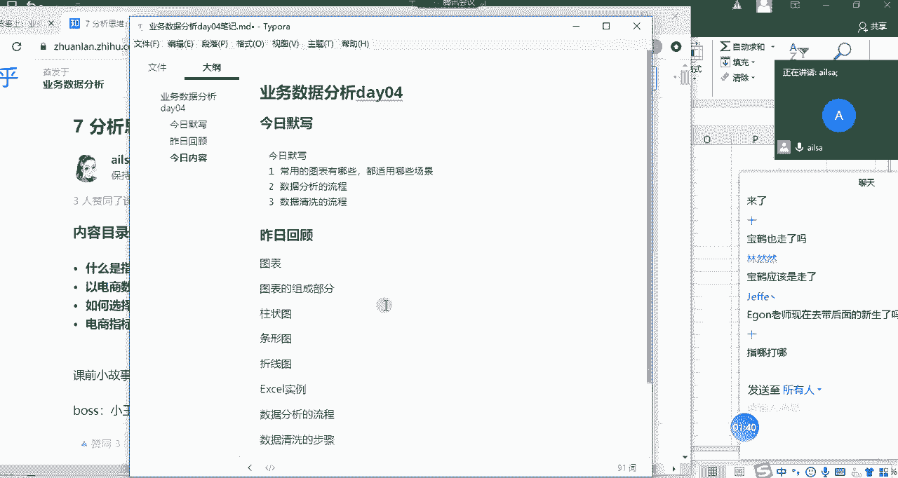

以及我们的散点图，还有气泡图啊。

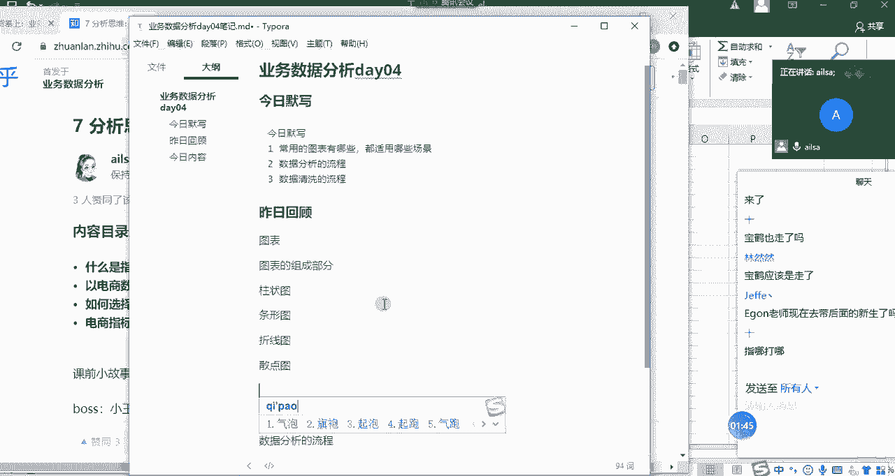

以及我们还讲了我们的啊饼图啊，雷达图啊，还有组合图，大概应该是这么多哈，我记得大概应该是这么多，OK这是我们上一节课当中讲的这些内容，那对于柱状图而言，它是在垂直啊，是垂直啊。

垂直方向啊进行啊不同类型的数据对比，所以说它主要是用来对比的那条形图的话，它是在水平方向好进行不同类型的啊，数据对比，我少个面积图是吧，好嘞，等会啊看一下，OK少了一个面积图啊。

OKOK那折线图它一定要是反映一段时间内啊，某一类型或多个啊类型在呃的一个变化趋势，一段时间内，某一类型或多个类型的一个变化趋势，或叫数据变化趋势，那如果是多个类型的话，它不仅仅能够体现在一段时间内。

它还能够体现这些类型之间的一个对比情况啊，这是折线图，一定是一个变化趋势，一个走势和一段时间内啊，再者就是散点图，它反映的是一个二维啊，也就是说两种数据类型啊之间的啊线性关系哈，和之间的一个相关关系嗯。

相关关系我们是用的散点图来体现的，气泡图的话，它仿它其实跟散点图是类似的，它就多了一个气泡的大小，所以它可以反映三维或者是三种数据类型啊，数据之间的啊之间的某些联系哈，我们只能说是某些联系或某些关系。

不一定是相关的啊，啊三维数据之间的一个某些联系，那饼图呢，它主要体现的是部分与整体的一个关系，也就是部分啊，部分与整体啊，整体的关系，比如说占比啊，就是一个整体有哪些部分组成。

这些部分它的一些数据的一个占比情况啊。

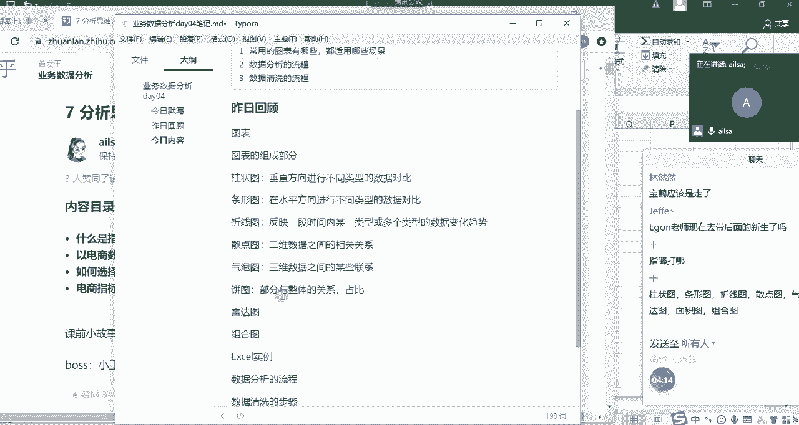

进行一个对比和分析哈，就是饼图，那雷达图它是反应啊，反应不同类型啊，不同类型在啊不同维度，或者在多个啊维度的一个啊综合啊对比啊，综合对比分析，我们也叫能力图，也就是它在多个维度这些维度值啊。

他们啊比如说我们的一个考核，那他会在沟通能力，技术能力，还有他的一个嗯，其他比如说啊学历啊等等这些方面的能力，进行一个综合的对比分析，然后来去评估到底哪个人能力更强，或者说哪个人在哪些方面更具有优势啊。

那还有一个是面积图，嗯面积图的话，它就是通过啊面积的大小啊来哎进行啊，不同类型的数据对比啊，就是面积越大，它的啊整个的一个的数据就会越大，通过面积大小来进行一个对比分析，那组合图主要是啊运用啊两种啊。

两种一般是两种哈，或以上两种不同的图表类型啊，类型就是它组合图肯定是不仅仅一个图标类型，肯定是两个图，两个及以上的图表类型，然后进行的啊进行的一个数据啊展示啊，好分析。

你比如说在什么情况下我们会使用组合图呢，就是说我们在对两类数据进行一个对比的时候，它们相差的啊，它们相差的值特别特别大，我们用一种数据，一种图表类型已经完全体现不出来，它们之间的一个差异了。

也就是说它们之间没有一个可比性，那我们就可以通过啊两种啊数据，两种图表类型来进行一个体现，你比如说啊，我们的销售额跟我们的销售额占比啊，一个是0~1之间的，一个是几千几万啊，近是几10万这样的一个数据。

所以说我们会用到组合图，这就是我们图表啊这些讲的这些内容。

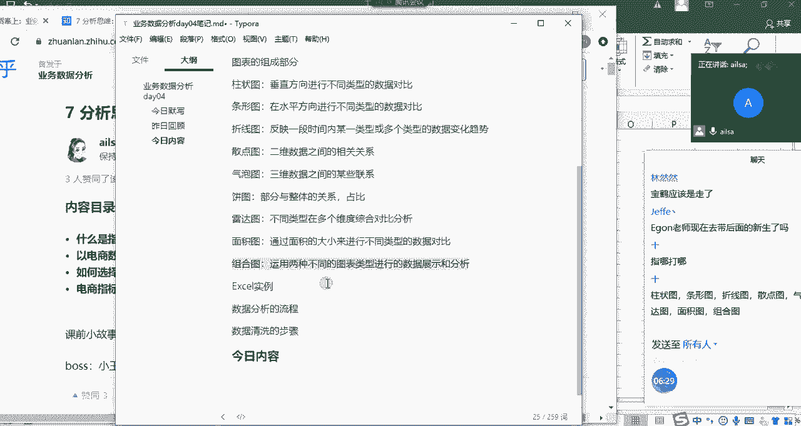

那我们再看第二个我们讲的excel的实例，我们讲了啊，就是通过一个实例来介绍我们数据分析的一个，步骤和流程哈，那excel的数据分析的步骤，首先第一个就是明确问题啊，因为你要对数据进行分析。

你首先要知道啊，对方想要什么，所以说第一个你要把对方的一个需求搞明白，就是要明确问题哈，我们也可以叫明确需求啊，明确需求也可以，然后第二个的话就是你明确了需求，知道对方想要什么，想要解决什么问题。

那第二个就是你要确定你的思路，该怎么去分析啊，如果说你这个的问题比较大，你的思路肯定会稍微复杂一些啊，比如说你先啊从哪个哪些维度去分析，采用什么分析方法啊，然后等等这些，如果说这条路走不通。

你还要再换一条路，然后去啊去确定你的思路这样子，那第三个的话啊，就是我们前面两个工作做完了之后，我们接下来就干实事了，也就是就要做具体的分析了，我们在做任何数据分析之前，都要是先获取数据。

获取到数据之后，不是说这个数据就比较完整啊，比较干净，我们需要对它进行一个数据的清洗哈，我们这里也可以叫数据处理。

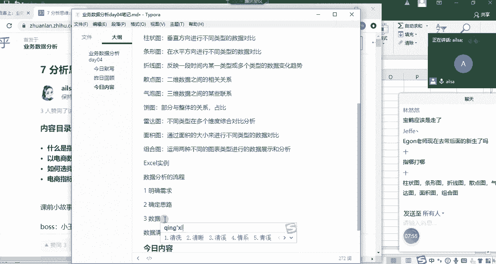

都可以数据清洗，数据清洗完了之后，我们才能啊结合我们的思路，还有我们完整的数据进行一个数据分析。

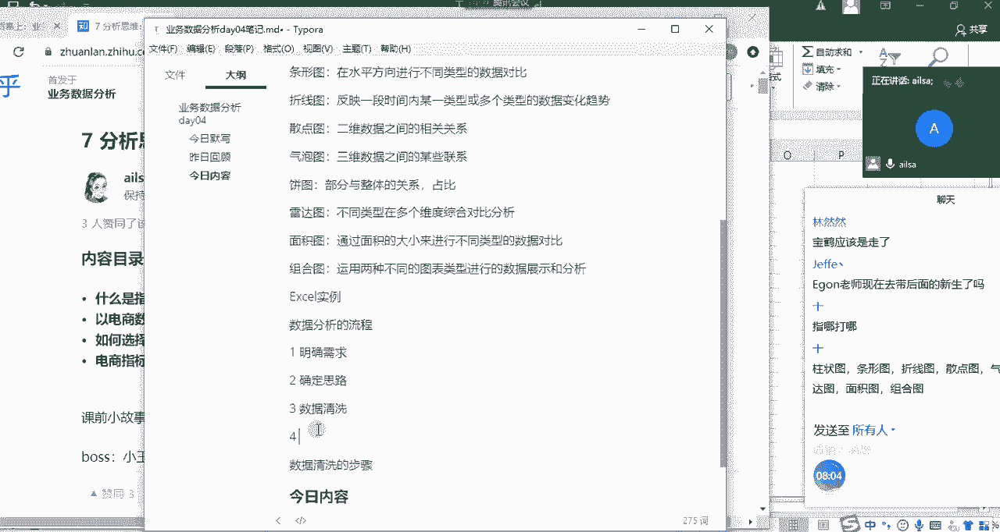

分析完了之后，我们会进行数据可视化啊，数据可视化就是数据呈现，然后如果说呃这个项目比较大，然后我们还需要对它进行一个数据报告的撰写，和数据和那个呃专门开这样的一个会议，进行汇报你的工作成果。

那最后呢我们要提出自己的一个建议方案，然后进行一个落地执行啊，建议方案啊，落地执行，然后还要进行一个跟进啊，跟进啊，效果嗯，根据效果，也就是说你做出来这个分析报告，得出了这样的一个结论。

它应用它到底呃业务方有没有采纳，那采纳了之后，它这个效果怎么样，如果说不好，我们是不是要再重新来一遍，再进行一个更加深入的分析，然后找到问题的原因，然后再一步一步这样去操作。

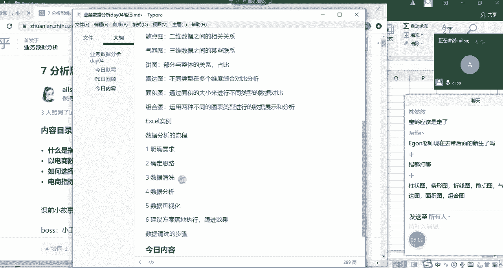

这就是我们数据分析的流程。

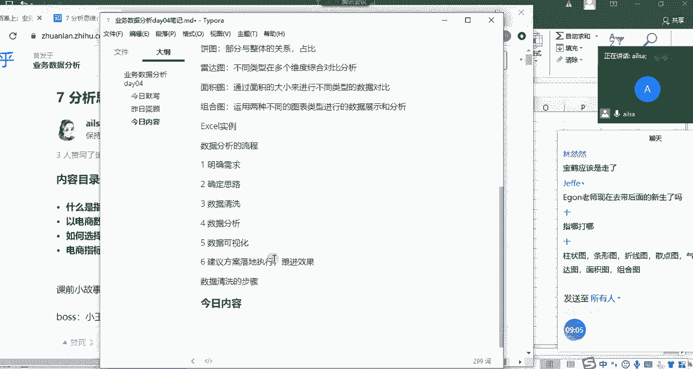

接下来给我们看我们在进行数据清洗的时候，其实是一个非常重要的一环，因为数据清洗，它是占我们整个数据分析的过程当中啊，很重要的一个环节，所以数据清洗的步骤的话，第一个就是选择子集啊，这个其实嗯呃怎么说呢。

呃我只是在这里给大家总结了，我在工作当中有可能会涉及到这些步骤，但绝对不是啊，绝对不是一成不变的，你你必须你必须得先走第一步，选择子集没有哈，如果如果不需要，你就可以不走，那第二个选择子集完了之后。

就是列啊列重命名对吧，我们的列名如果不合适的话。

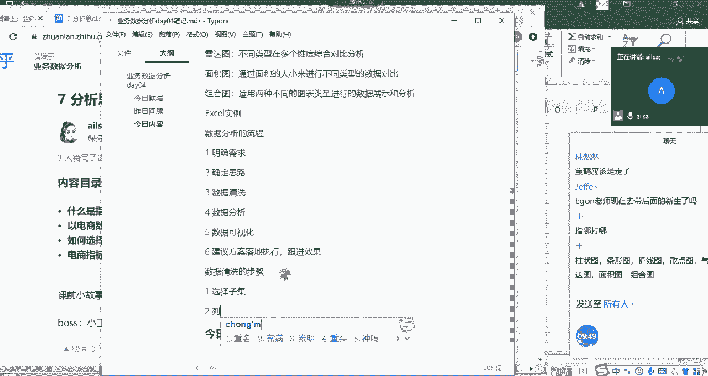

我们需要再进一个重命名啊，第三个啊，列名重命名完了之后。

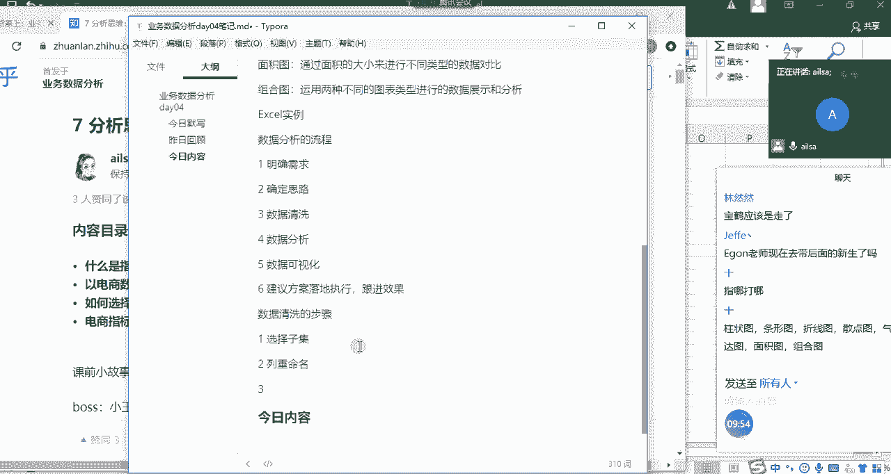

我们看一下哈。

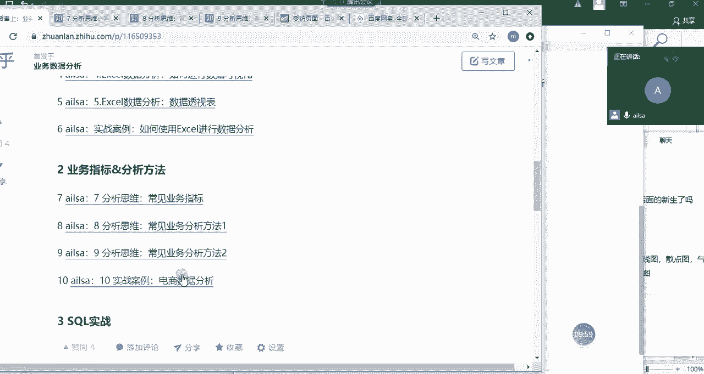

我们的嗯啊我应该是放在这里了哈，二十零三十分。

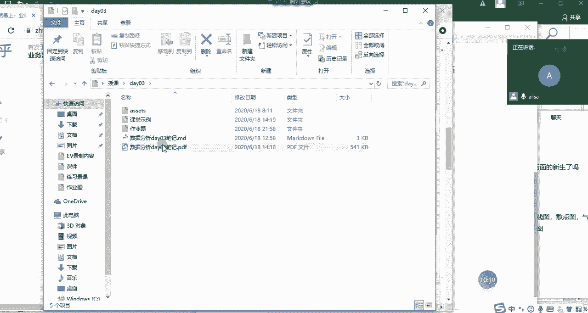

我们之前画了一个图哈啊那我们再进行啊。

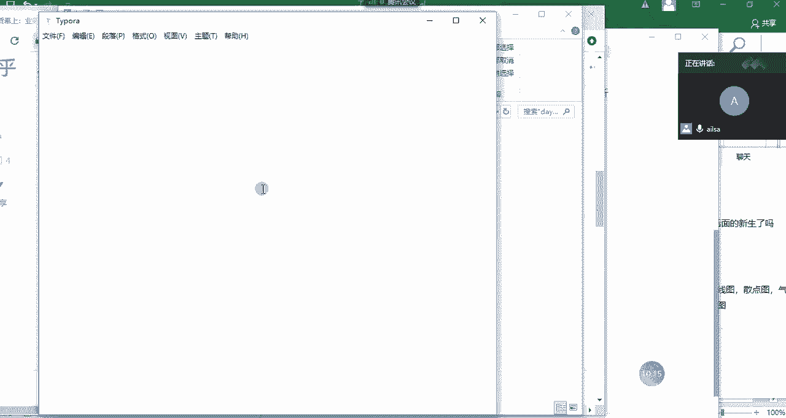

再进行。

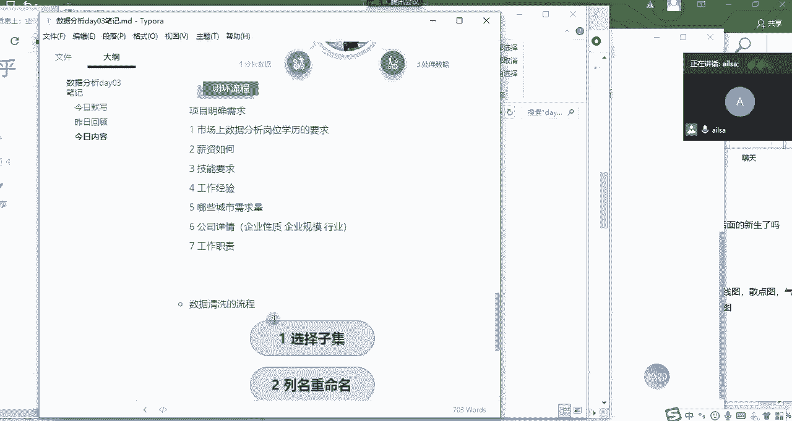

而数据清理的过程当中，就是重复值的一个处理啊，缺失值的一个处理。

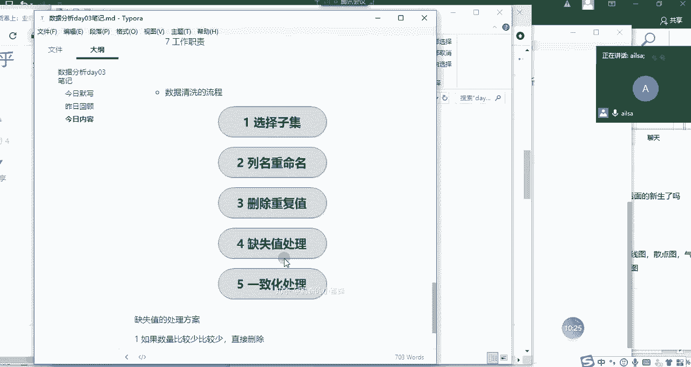

还有一致化的一个处理啊，就是列名额重呃，就是列重命名。

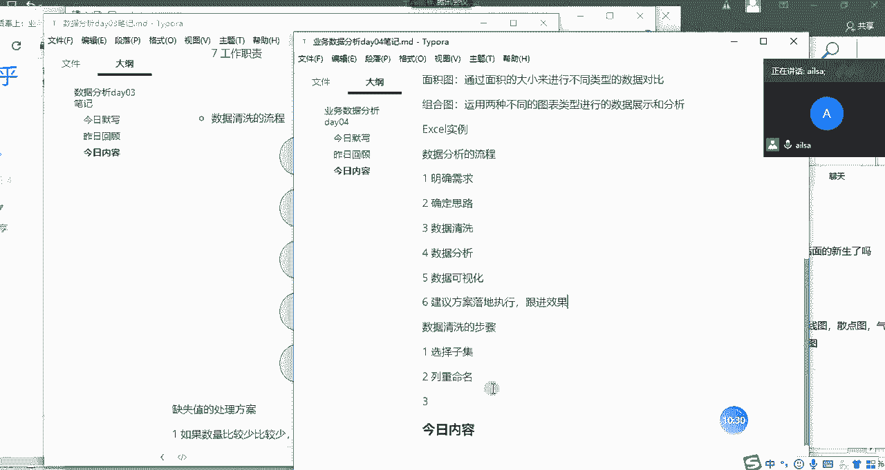

我们需要对它进行一个，如果有这样的一个情况，我们就处理，如果没有就就就算了，然后还有就是删除啊，重复值这个的话是经常用的，因为我们的给的表当中难免会有重复值的存在，所以说删除重复值这一项的话。

我们是要再检查一下的，然后第四个啊，就是啊这是我们的缺失值的处理啊，叫空值的处理，缺失啊，值啊的处理，也就是说我们的数据如果里面有缺失的，那我们该怎么去处理，我们有三个方案对吧。

第一个就是如果额数量不大啊，数量不大，那就直接删除对吧啊，不影响我们的结果，就直接删除，这个数量不大，是相对于你总体的数据而言，它数量不大啊，那第二个的话是什么呢，就是它如果是文本内容的话啊。

呃而且量也不大哈，量啊数量数量也不太大啊，你可以根据其他列的内容进行啊人为修改，也就是说因为列跟列之间，它们之间是有关联关系的，所以说你可以根据其他列的内容去判断，这里面大概是什么内容。

当然它的量如果太大的话，你人为修改起来工作量很大的时候，我们也不建议这么去操作，然后第三个啊，第三个就如果是数值啊内容的话，然后它缺失量比较大的时候，我们可以采取啊采取填充啊，填充我们可以用什么呢。

均值或者是中位数啊都可以哈，但是我们优先是均值，那什么时候使用中位数呢，就是说你使用均值的时候，你会发现这个数据这一类的数据，离散性比较大的时候，也就是说它的数据差异很大，你用均值。

你用均值完全代替不了，它整个的一个水平的时候，你就要需要采用中位数了，这个我们在后面统计学的时候会讲到，均值和中位数的一个差异啊，这就是我们的缺失值的处理，缺失值的处理和删除重复值。

这两个在我们进行数据处理的过程当中啊，几乎是啊都要用到的啊，第五个就是一致化的处理啊，什么叫一致化的处理呢，就是说有一些单元格里的内容它不符合要求，比如说唉我们呃昨天讲到的那个工资。

因为我们要计算他的工资的平均水平，所以他必须是数值型，但是它却是文本型，而且他是一个区间，所以我们要根据啊实际啊情况，对数据进行啊统一规范啊，这就叫一致化的处理，在这里还有一个啊，大家记一下。

还有一个我没有讲叫异常值的处理啊，异常值的处理我们昨天其实也也说到了，就是说我们在对我们的整个的一个啊，采集过来的数据当中，如果不是相关数据分析师岗位的数据，我们是需要给它去除的，那这个就属于异常值哈。

就属于异常值，异常值的去除就是我们需要人为判断哈，人为判断啊去啊去进行删除啊，如果是文本的，就是人为判断，如果是数值呢，啊，数值呢我们比如说嗯，我们可以求一下它的最大值，最小值等等这些。

因为你比如说我们有一个订单的数据，然后它每天的一个每个订单的一个销量撑死了，也就嗯十个左右，或者说一个两个一个订单下的，下载商品的个数哈，一般不会超过十个，但是如果有一条数据，它一下子达到了几千个。

然后造成了你所有的一个啊，你分析的过程当中，都会受到这个数字的影响的时候，它其实就是可能是属于异常值，因为他有可能不是一个人购买的，他有可能是公司集体团购的，那这个对于你的分析来说。

就没有什么重要的一个参考值，而且它直接会带跑偏你整个的一个分析的结果，所以你要把它剔除，所以说数值的话也是需要进行好嗯，怎么说呢，啊进行啊啊进行经验啊，经验的判断吧，啊这样的一个啊就是我们需要对异常值。

然后进行一个关注，看一下它们的最大值，最小值有没有说特别偏的，如果特别特别偏，我们就需要把它给删除啊，就不要这个异常值，因为它会影响我们整个的一个分析结果。

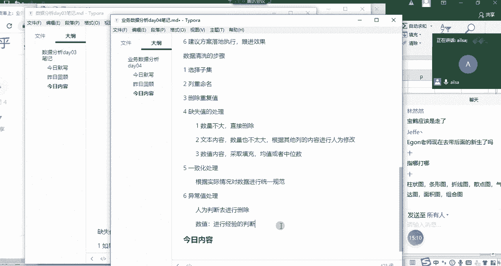

那我们昨天讲的内容大概也就是这么多了，因为昨天我们讲了一个实际的案例。

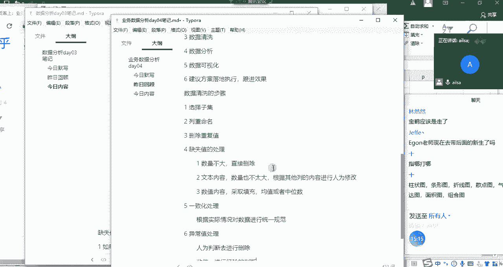

也引入了我们数据分析的整个的一个过程。

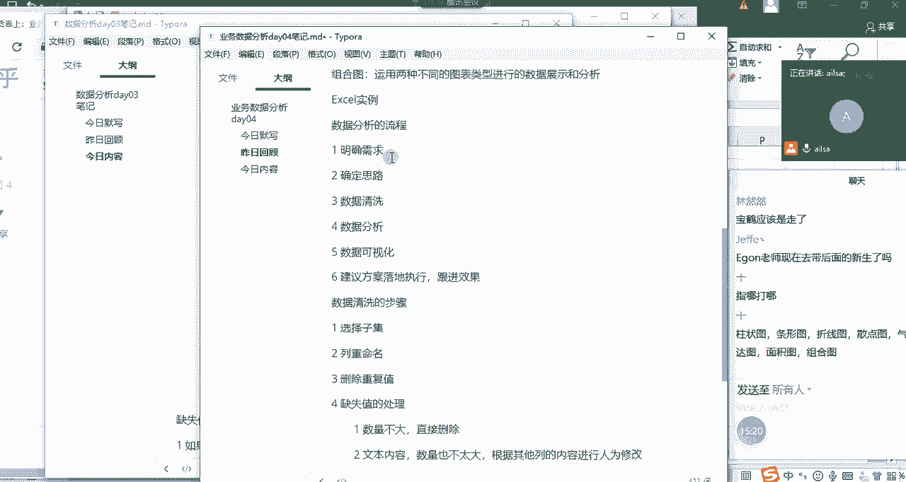

和我们怎么进行一一次完整的数据清洗的流程。

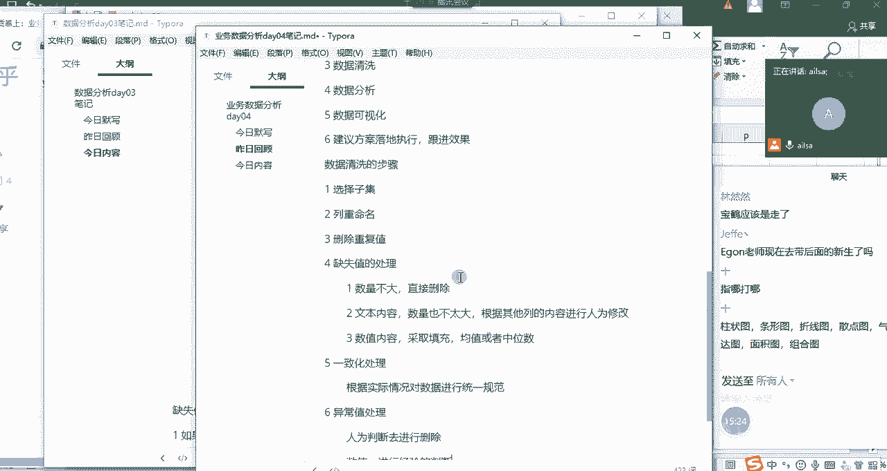

然后大概是这样嗯，OK那我们在啊。

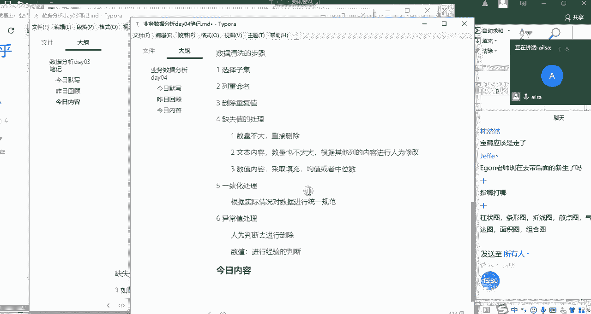

我问大家一下，对于昨日的回顾，大家有什么问题，没有没有什么问题，扣一。

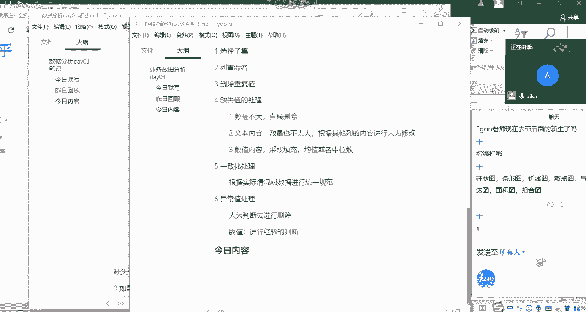

好好的嗯。