# 强推！这可能是B站最全的【Python金融量化+业务数据分析】系列课程了，保姆级教程，手把手教你学 - P63：05 行为维度指标 - python数字游侠 - BV1FFDDYCE2g

数据就简单了哈，我就讲的快一点哈，因为可能我讲的太详细了，好OK啊，首先我问大家有没有啊，有没有听说过PVUV啊，有没有听说过PBUV访问量点击量，HPHP的谁嗯，听过是吗，那我给大家演示一下哈。

你比如说我现在打开啊。

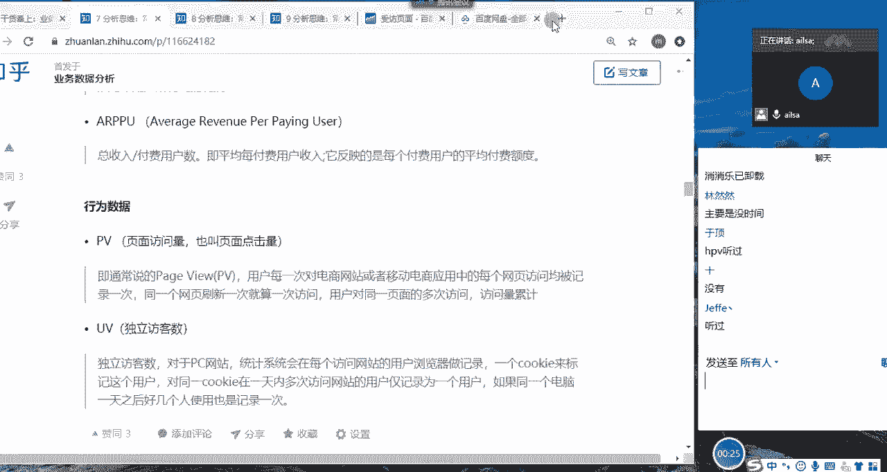

大家想看哪个网站啊。

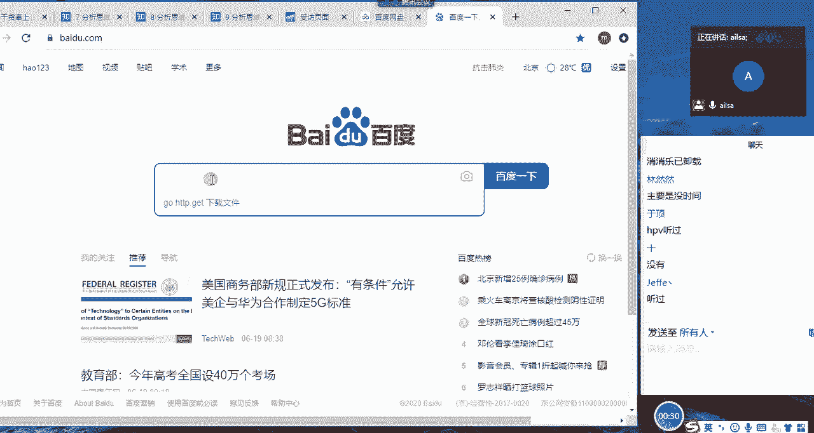

嗯知乎吧啊比如说现在我打开了知乎啊。

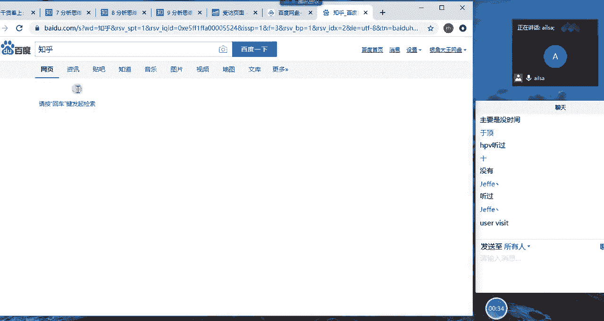

这个时候啊，这个时候那我就相当于是一次点击了啊。

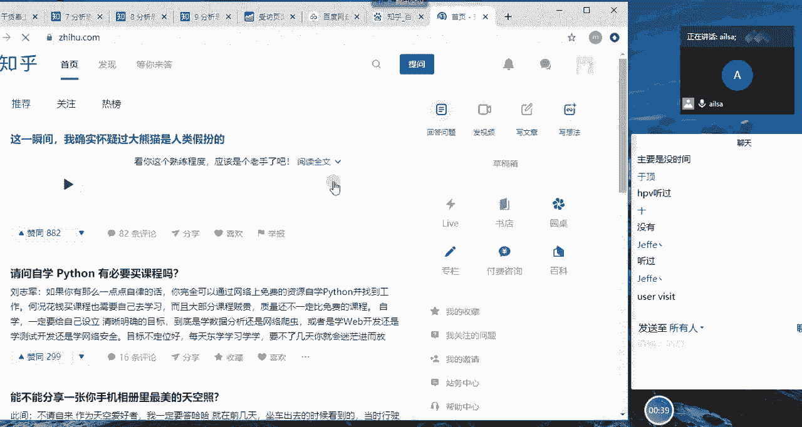

比如说我点击这个详情页啊，这个标题，那这个时候又又对于这个详情页而言，我又算一次点击了，对于整个网站而言，我已经算两次点击了，那接下来诶我刷新了一下啊。

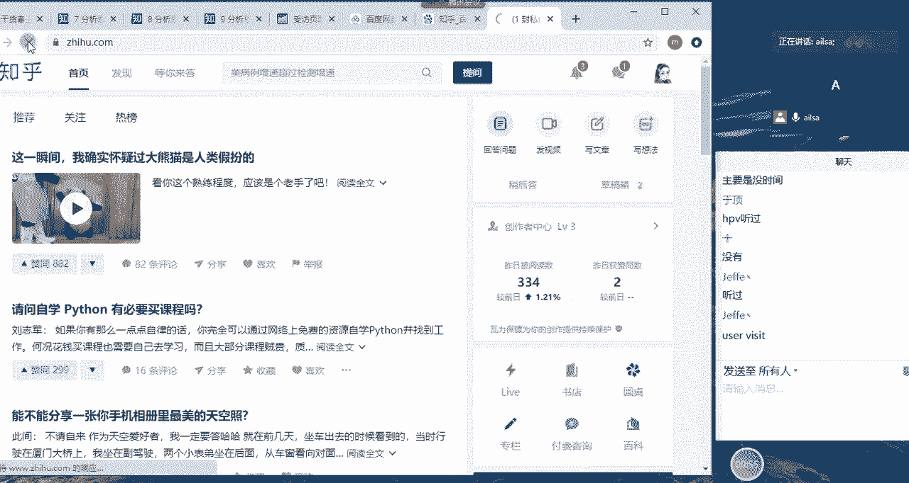

刷新一次也算一次点击，为什么呢，因为我们的点击量的计算指的是前端页面，向后端发送一次请求，就算一次点击，相信大家前端啊后端都学过了，对吧啊，所以说啊，所以说我们的点击量的计算，就是大家从底层的去理解。

就是说我前端页面向后端发送了一次请求。

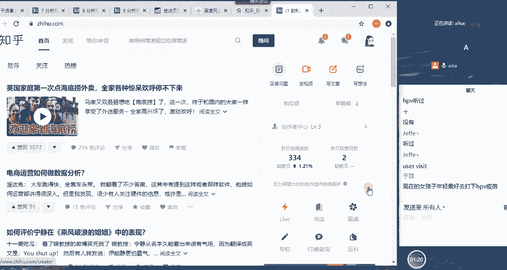

那么它就算一次点击量啊，比如说我点击这个，它肯定会向后端发送一次请求。

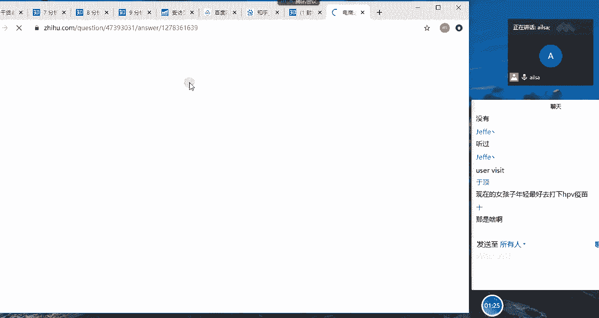

把这个详情的页面给我显示出来，对吧啊，那这就是我们的点击量啊。

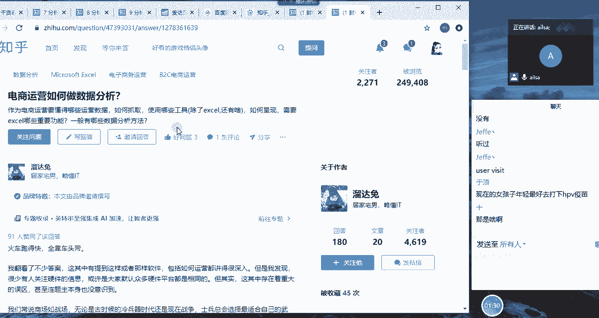

那我们再看第二个好，是我们的UV独立访客数，那是什么意思呢，你比如说现在在我这台电脑上，我有我自己的一个cookie对吧，浏览器都有自己的cookie，然后我在这访问访问。

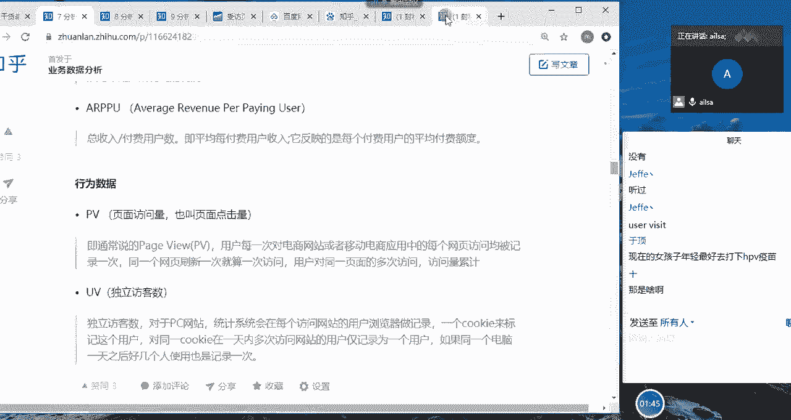

然后就一直在访问知乎里面的一些数据啊，或者是一些内容啊。

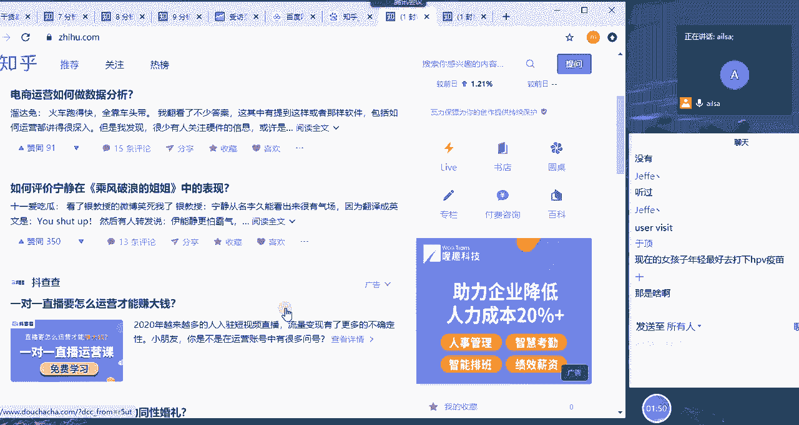

乘风破浪的姐姐啊啊，然后我访问了之后呢，啊这个时候我走了啊。

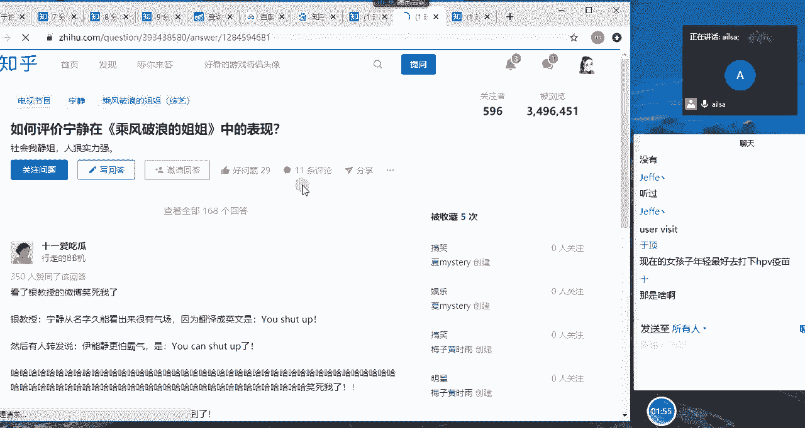

或者说下午的时候思敏过来说，哎我想用一下你的电脑，然后看一些东西啥的，然后他又打开了知乎，那对于呃对于实际的实际当中，我们俩其实算两个客户了，对啊两个用户，但是它能识别到的还是一台电脑。

一个cookie，所以说只能算一个嗯，那如果我们的电脑不但不清除cookie的话啊，就是思敏在用之前不清楚我的cookie的话。

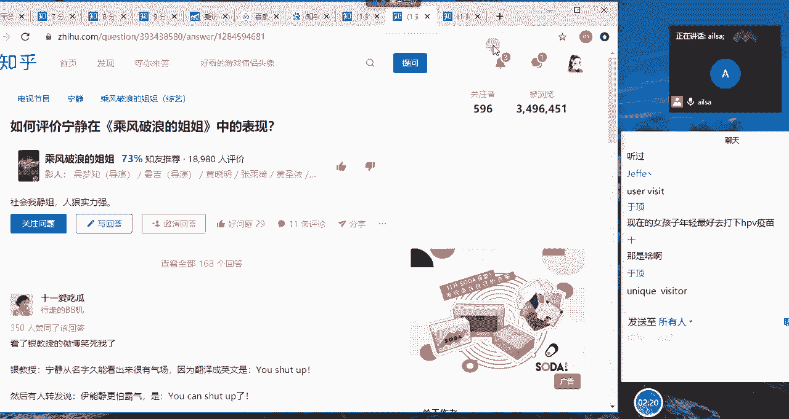

还是那一个啊，是这个意思哈，这就是我们的啊，它主要是以cookie来标记这个用户的啊，就是对同一个cookie在一天内多次访问网站，仅仅为一个用户，如果同一个电脑一天内被好几个人使用，也会记录一次。

就是独立访客数啊。

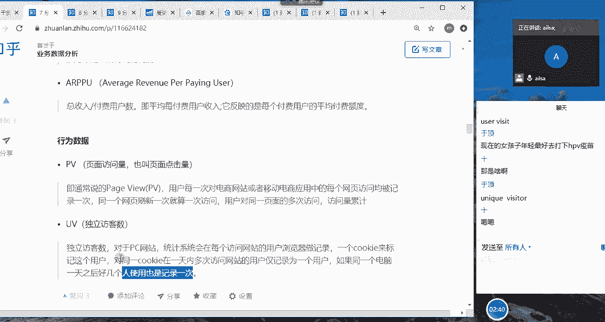

那我们看一下另外一个统计方式呢，叫IP啊，什么意思呢，它它就是为了避免啊，就是说与同一台电脑好几个人使用，它就只记录一次的话，我这个数据会不会不准，所以说它使用一个IP。

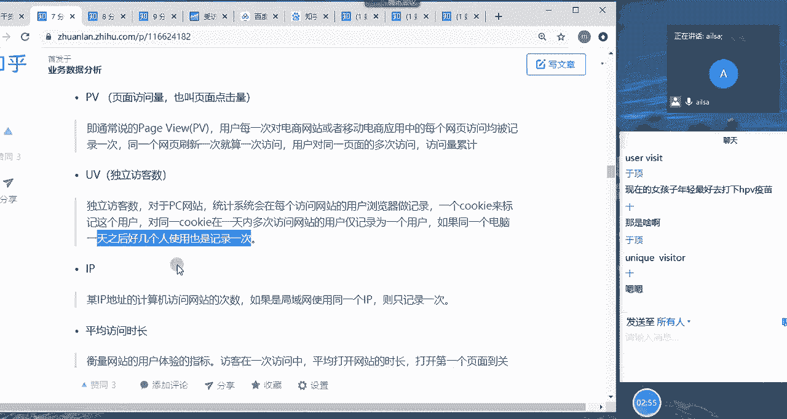

那IP是主要是以电脑啊，电脑的一个IP地址作为统计方式，它这个也会有问题呃，他他这个也会有问题，而且他这个问题会比这个UV还要大啊，你们就不要再讨论这个这个这个东西了啊。

啊这个这个IP比UV这个问题还要大啊，是什么呢，是因为呃比如说局域网大家的IP都是一样的，所以他会算一个客户，而且说如果说啊对于同一台电脑，好几个人使用的话，它的IP也是一个，所以也避免不了这样的问题。

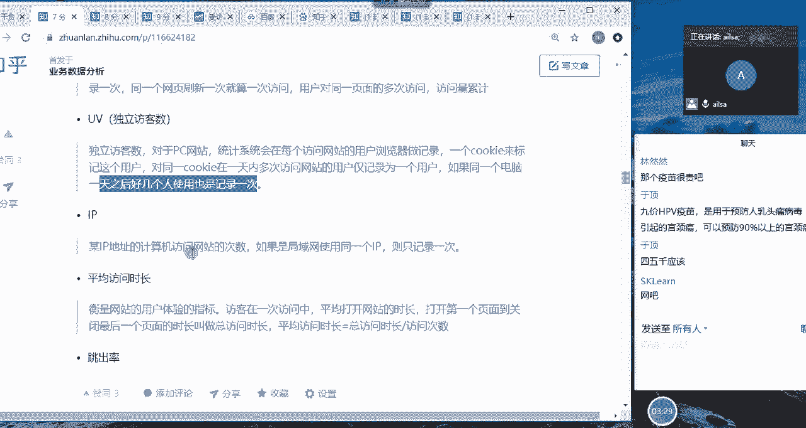

所以我们一般统计用户数的时候都使用的是UV。

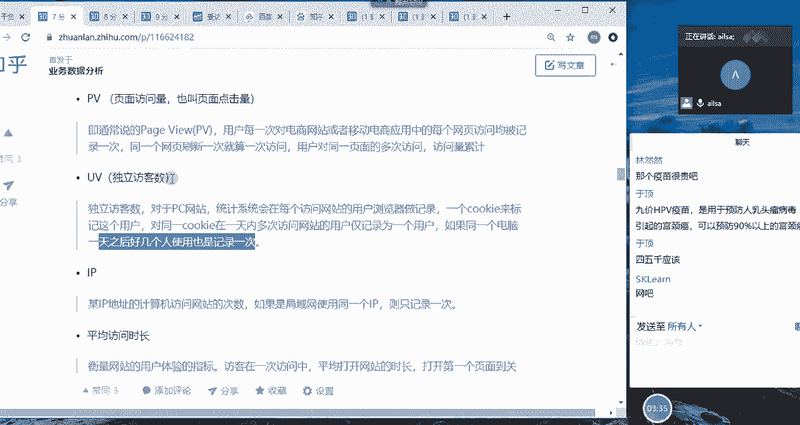

好吧啊好吧啊，然后下面是一个网站的平均访问时长，也就是说我们访问一个网站，从第一次打开到最后一次离开的一个总时长，然后除以我们的访问次数，也就是我们的点击次数，我们可以把它理解为点击次数。

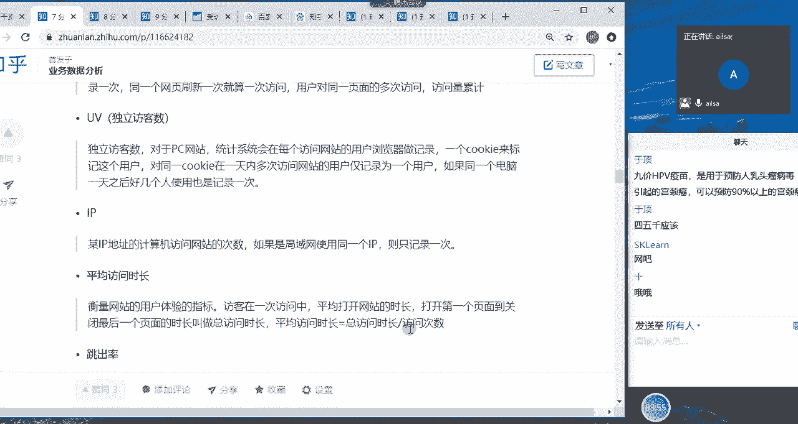

总访问时长除以我们的点击次数次数啊，嗯这是我们的平均访问时长。

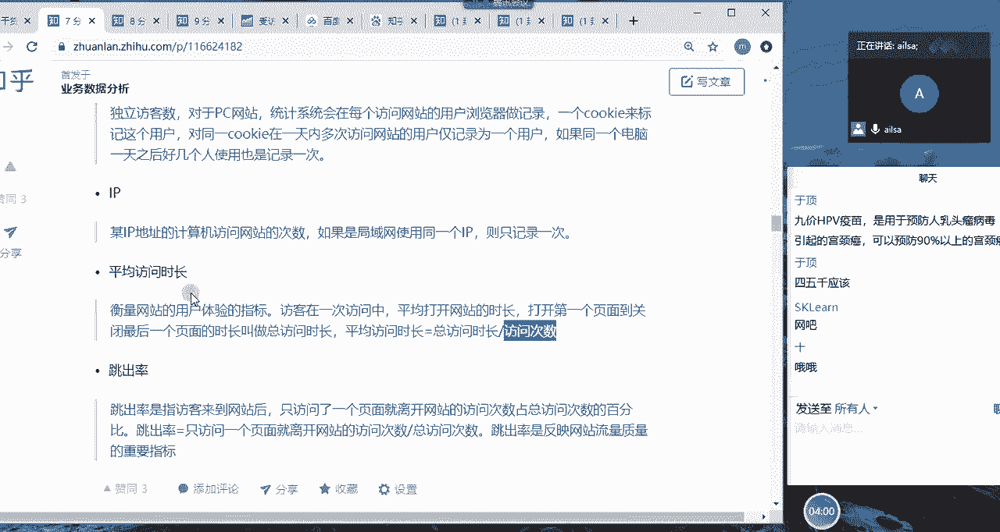

然后还有个跳出率，跳出率是什么意思呢，就是说你来到这个网站之后啊，只访问了一个页面，就离开网站的一个访问次数，占总的一个访问次数啊，这就是跳出率，你比如说好，你比如说你作为一个用户，你过来了之后。

你只访问了一次，然后你跳出了，那你就是它的分子了啊，只访问一次就离开的一个访问次数啊，那总访问次数指的是有一些用户来了之后，访问了很多次啊，所以说作为他的一个分母来进行一个计算的啊。

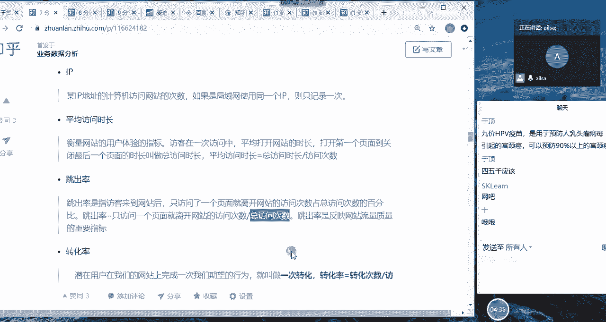

啊这就是我们的跳出率，那转化率就是啊我们在我们的每一次行为哈，就是潜在用户在我们网站上完成一次，我们所期望的行为，叫一次转化，什么意思呢，你比如说我刚才打开了淘宝，那打开淘宝之后。

他是希望我去点不同的商品，比如说有100个啊，100次点击，点100次点击点击了网站的首页，然后只有50次点击了详情页，那它的转化率就是50÷100诶，那呃在这50个人当中，又有十个人点击了加入购物车。

那这个它的转化率就是10÷50啊，啊这样的一个计算方式，明白了吗，就是用我们所期望的啊用户行为，然后每一次啊，每一次它所达到了我们就叫一次转化，然后它的计算方式是转化次数除以访问次数啊。

这是我们的一个转化率的计算，那刚才这几个指标。

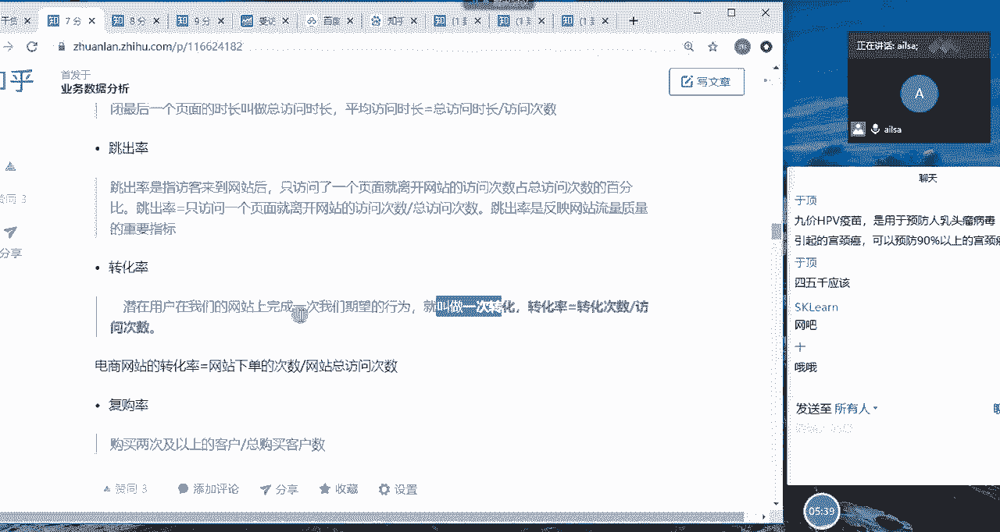

大家很明显发现好像跟网站的关系性很强，对不对，那我们就可以拿一个实际的例子来看一下啊，我跟你说这些数据都是公司内部的数据，都不对外公开的哈，但是咱们公司咱们老男孩还是很大方的哈，直接把账号和密码给了我。

我给大家看一下我们公司后台的数据哈，当然了，这个数据不太好看，因为他这个网站嗯，为了好，就是应该是目前情况下不进行一个运营了。

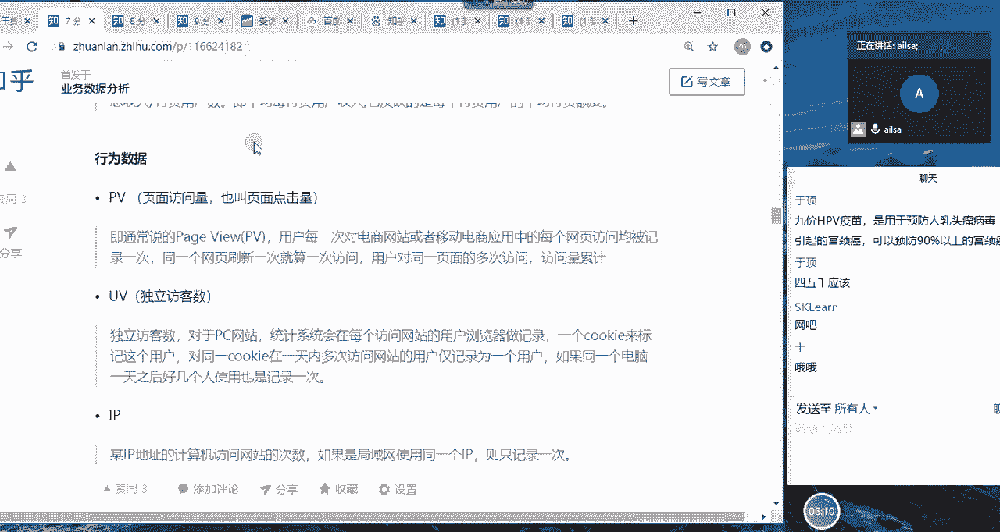

所以说会数据量不是特别好看，我们看一下哈。

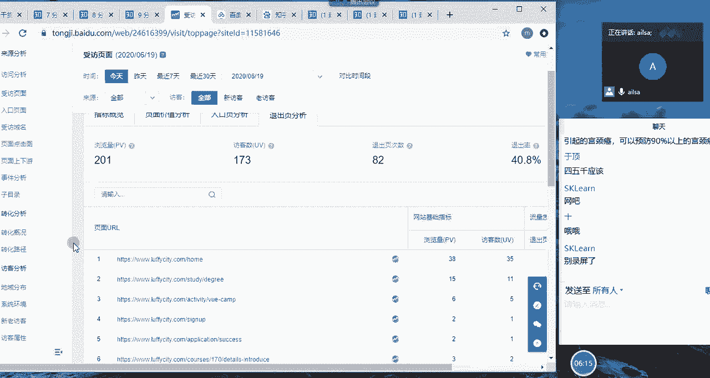

啊OK那我们先关掉哈，好当复购率哈，这个复购率啊其实就是啊我们的呃，那用户啊，在网站上到底购买了几次的一个占占比哈，就是购买两次及以上的用户，占总购购买用户的一个数量，那这个复购率呢。

其实就是如果说你在某一个网站上，别人给你拉新啊，花了很很不少钱拉过来了之后啊，然后你这个啊你这个你就买了一次，那对于整个公司而言，或对于整个产品而言就不太好，他又希望你多多买点，是不是。

所以我们就要看它的复购率，如果他复购率很高的话，说明用户对于他公司的各方面的产品，还是很认可的，说明用户还有一还是有一定粘性的，对不对，所以说这个复购率也是也是要看的，你比如说我们在淘宝上买东西。

我们都不知道买了多少个了，对不对，那说明淘宝的复购率是很高的啊，它的产品还是很认可的，至少人产品比较丰富，然后也有很多很大的一个用户群体，而且用户都愿意在上面去买东西啊，比如说每年的春夏秋冬换季的时候。

大家都要买新衣服，这个时候都会去淘宝上去看啊，这样的一个东西哈，那再比如说还还有一个还有一款app，叫那个我们都知道抢票软件，对不对，抢票软件啊，然后比如说铁友啊什么什么的，指什么智行啊什么，反正那些。

然后只要就是我们没有办法去看，他每天的一个日活用户数，但是我们可以看一下他的复购率，这一年的复购率是不是一到节假日，一到买票的时候啊，大家都会用他的app，如果是的话，那说明他这个app还可以。

那你不能说你看每天的一个日活跃用户数吧，因为你不买票的话，你不是节假日，大家也不会上去上面去买，对不对啊，好的。

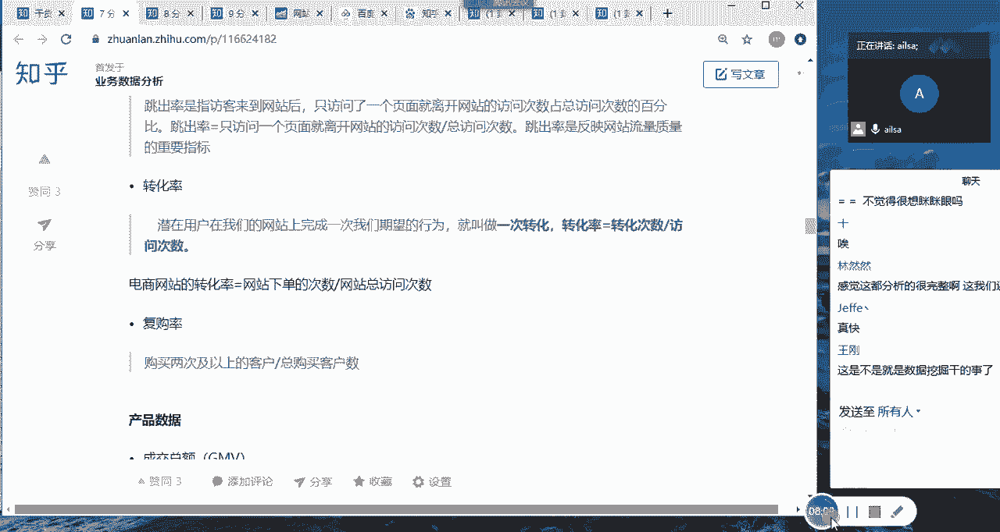