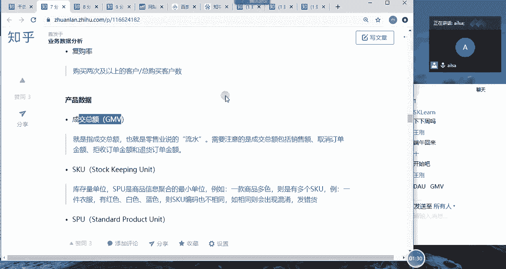
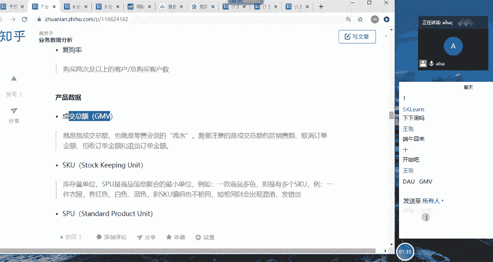
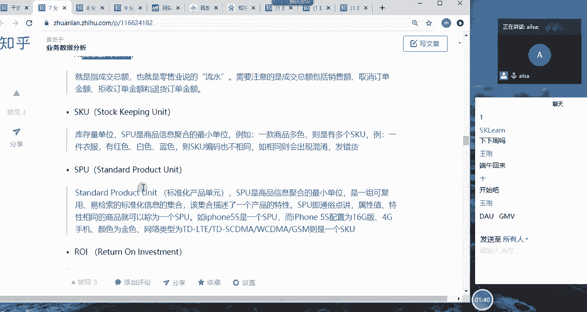
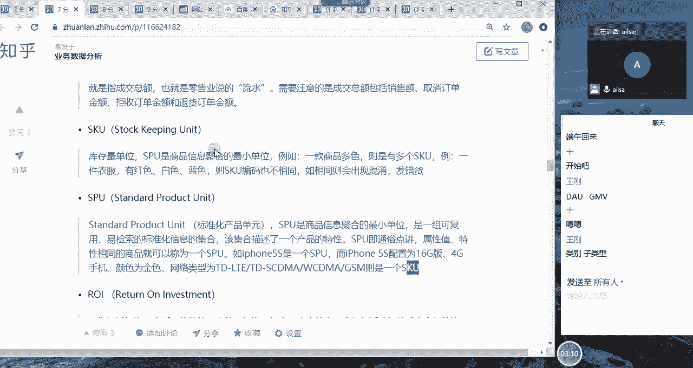
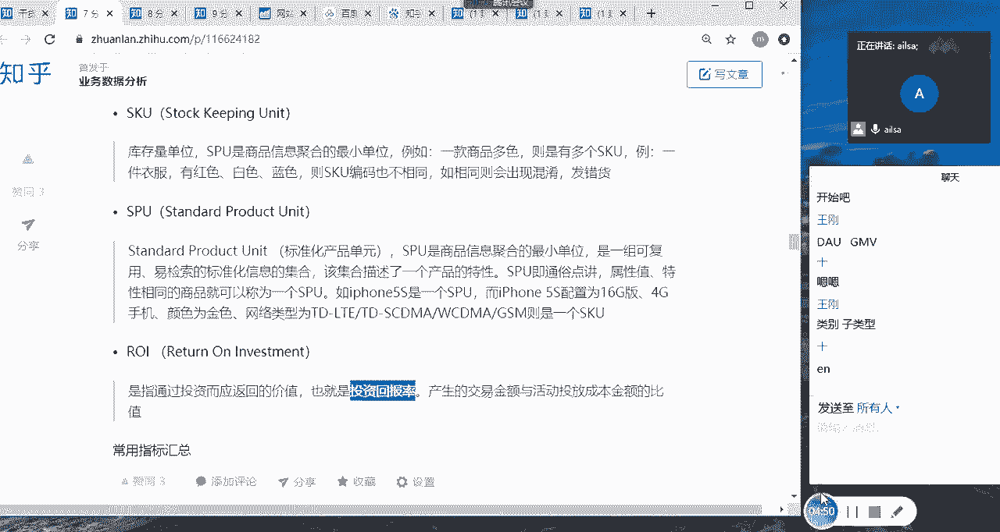
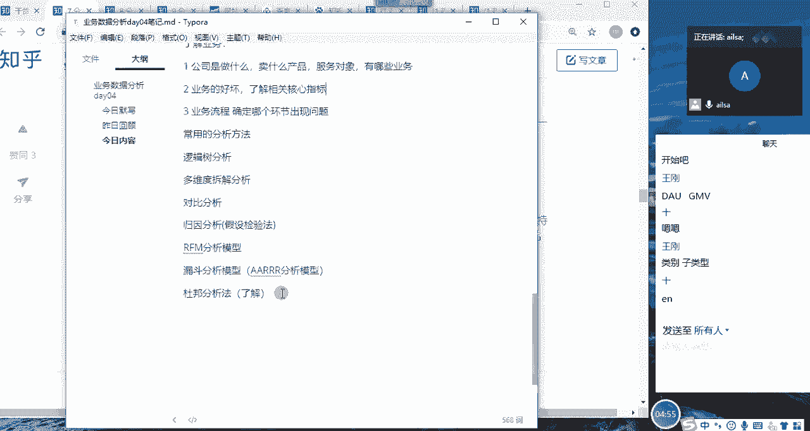
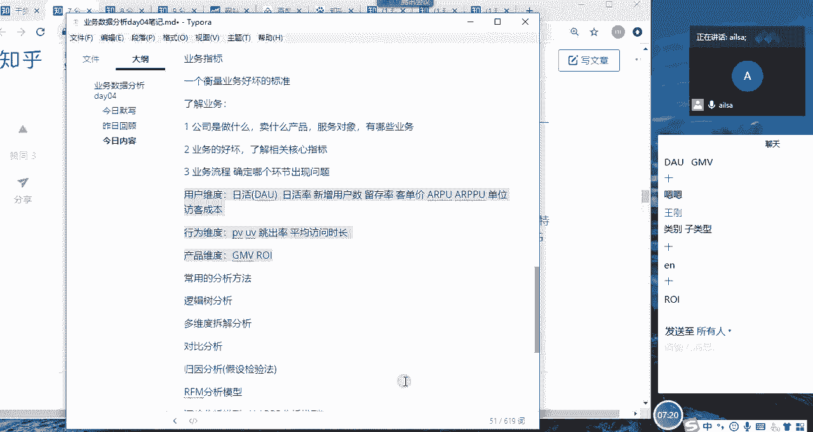

# 强推！这可能是B站最全的【Python金融量化+业务数据分析】系列课程了，保姆级教程，手把手教你学 - P64：06 产品维度指标 - python数字游侠 - BV1FFDDYCE2g

我们刚才讲了用户数据和行为数据，那接下来我们讲产品数据，就是说呃我们最终啊我们最终看产品，看哪些指标呢，其实就是看它卖多少钱，那在这个卖多少钱，有一个非常常用的一个业内的指标叫GMV哈。

GMV这个指标啊非常常用，所以说大家一定要记住，然后它叫成交总额，什么叫成交总额呢，就是也就是我们零售业说的流水，那它不仅仅是包含销售额，它还包含了取消订单的金额和即拒收啊。

定额订单的一个金额和退款订单的金额，也就是你会发现这个流水啊，真的仅仅是流水哈，就是说它里面比如说用户下单了，不满意退款了，那他也算流水，然后用户啊然后下单了，然后他这个呃。

就是他没有付钱或怎样的时候拒收订单金额啊，就他被拒了或怎样的时候，他也是算进去的，所以说这个成交总额的话就就比较水啊，它里面包含了没有进入到公公司的一个呃，内部的收入的这样的一些内容，那这个成交总额。

它反映的是用户与产品产生的之间的关系，你比如说用户下单了，但是他退货了，其实他也是相当于跟产品产生了一次关系，只是这一次关系没有产生价值。

而已啊，所以说GMV一定要记住哈，还要记住一个ARPU和ALPPU也要记住。

然后我们再看一下SQU和PU哈。

sq和SPU是啥呢，就是对于啊也是常在零售行业，那就是S啊，SPU啊，我看一下啊，呃SPU呢它是啊商品聚集的最小单位啊，它有多个SKU啊，就大家就不要看概念了，因为看概念有点有点懵哈。

你比如说一件衣服啊，一件衣服它有不同的颜色对吧，有红色白色蓝色，那它的SQU编码也是不一样的啊，所以说SSKU是唯一识别产品的一个啊标识，而SPU呢它就是一件衣服啊，就是说SPU包含了多个SSKU啊。

这样的一个区分啊，这个唉这个记不记都行吧，了解就行啊，就是在我们的啊服装品牌这些的时候，或者是我们的产品种当中也会有这个，那我们再举一个品牌唉，就是我们的IPHONE啊，对IPHONE55S啊。

这样的是一个SPU，那它的配置呢我们都知道有16G啊，还有那个什么64G128G啊，这样的不同的就是在这个品牌下面啊，这个类型下面还有不同的一些配置，然后这种的话就叫sq啊，sq是唯一的啊。

这样的一个区分啊就可以了嗯。

然后ROI这个也要记一下哈，ROI这个也很重要，这个就叫投资回报率，这个对于公司而言真的非常非常重要，就是他前期你比如说我们就拿好，就拿我们在线教育啊，就拿我们教育行业为例啊，一个在线教育而言。

那它从拉新开始，也就是说他前期投入了很多很多广告啊，包括百度的，然后各种综艺里面穿插的，你比如说我们都知道什么什么VIP kid，什么什么复原辅导什么什么等等这些，然后他们投入了很多广告啊。

那他投了广告之后，他希望能够带来一部分的客户对吧，那相当于是转化嘛啊对转化一部分客户，然后过来了之后呢，他们是希望这个客户啊购买他们的产品，然后给消费的啊，这样的一个过程。

那他的这个这就叫所谓的投资和回报，也就是说产生交易的金额，与活动投放成本之间的一个比值，你比如说你花了啊100块钱，然后你拉来了十个客户，这十个客户购买了都购买了你的商品。

那相当于你这个投资回报率就非常高了，对不对啊，这是这样的啊，我他就是说从最开始投入成本到最终产生价值，带来收益的这样的一个综合的啊指标反馈啊，这叫投资回报率，ROI一定要记住这个ROI。

那我跟大家说一下。

我们需要掌握的指标都有哪些哈。

哎我们看一下我们需要掌握的指标啊，首先我们需要掌握的用户啊，用户层面啊，用户维度啊，我们需要掌握日活对吧，日活DAO它是一样的哈，热火DAUR，啊DU然后还有就是嗯还有就是那个日活率啊。

也需要掌握日活率啊，以及我们的啊新增新增用户数，就是我们前面讲的比较详细的，其实都挺重要的，然后行为维度的话啊，当然还有一个留存率哈，留存率也非常重要，次日留存，7日留存和月留存率，如果你知道这些啊。

大家都知道你是这个行业内的啊，你就是懂这个懂行的人，然后行为的话我们会有什么PV啊，UV啊，IP我们就可以不用记了，还有一个就是跳出率，跳出率啊会有需要，然后一个是啊平均啊访问时访问时长啊。

这个也需要啊掌握一下，然后对于我们的产品数据而言啊，还有就是我们的啊，还有就是我们的客单价哈，啊客单价应该是在用户层面吧，啊这个倒无所谓客单价啊，还有A2PU，ARPPU啊，这样的啊。

以及啊单位啊访客成本，大家还记得多少啊，这个单位访客成本也很重要哈，然后产品维度的话就是GMV，GMV也需要知道，然后就是我们所说的流水啊，GMV你跟别人比，如果说你是电商行业的。

比如说这个月的流水怎么怎么着，或者这个月的gm v怎么怎么着，你不知道哎，那你就是外行了哈啊，我们的gm v，然后还有就是ROI啊，RI这样的一个投资回报率也是非常重要的，所以说这些东西大家一定要掌握。

这就是我们指标要讲的内容啊，指标要讲的内容哈。

