# 强推！这可能是B站最全的【Python金融量化+业务数据分析】系列课程了，保姆级教程，手把手教你学 - P65：07 分析方法1 - python数字游侠 - BV1FFDDYCE2g

漏了嗯嗯我们看一下分析方法啊，这个我大概罗列了啊，就是我们第一步要明确需求，确定思路，数据处理这个例子我就我就不讲了哈啊啊，因为我们在之前的那一个课程当中已经讲过了，那我们直接进入我们的分析方法。

有八大分析方法啊，有一个逻辑数分析方法，多维度拆解好，对比分析，归因分析，还有一个相关分析和两个分析模型，RM rf m啊，这个打错了哈，2FM和漏斗分析模型，还有杜邦分析方法。

我们先看第一个什么叫逻辑数哈，我们先想数啊，先讲树的结构。

它是不是有个根，然后发散那个枝叶啊，对不对，这样的一个结构。

那为什么我们要用逻辑术分析方法呢，你想一下，如果说我现在给你了一个问题啊。

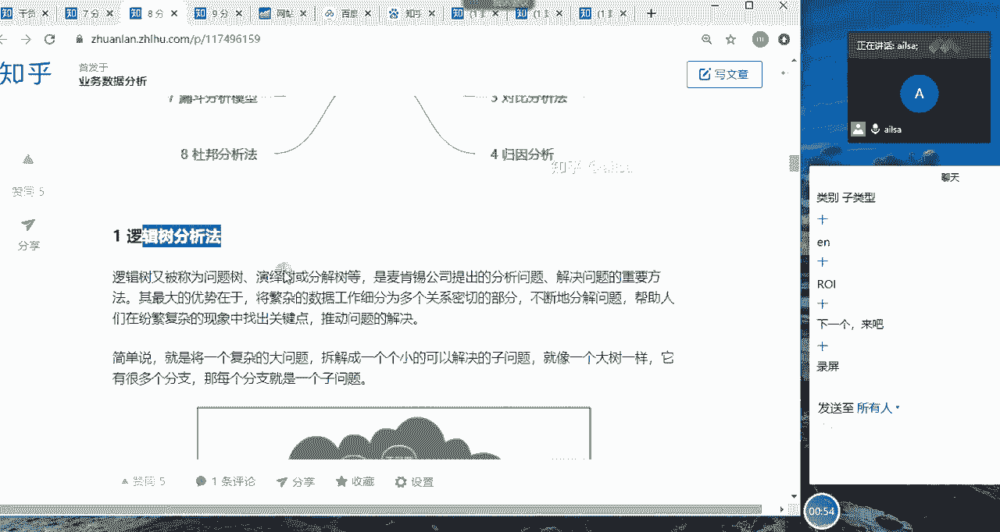

我给了你一个问题啊，比如说我们就举一个最简单的例子啊，减肥这个问题，现在哎我说啊，就是老生不变的一个常谈的问题啊，啊老生常谈的一个问题哈啊减肥，那有啊，比如说我跟思敏说，我说思敏最近该减肥了啊。

啊思明就说啊行啊啊，这个时候他脑子里，就就他这个时候他脑子里就在想我该怎么减啊，我应该少吃点对吧，少吃点多运动啊，对不对，唉那那那具体该怎么干呢，其实好像也没有一个明确的思路，对不对啊。

这个时候我们就可以用逻辑数的一个。

拆解的分析方法了，也就是说我们怎么来呢啊我要减肥了哈，你看特别像斯米哈啊，这个时候我们看思敏的脑海里啊，蹦出了很多个想法哈，隔一小时走一走，好像实现不了哈，因为要上课啊。

但是休息时间可以走一走哈啊不吃肉肉啊，少吃少吃饭啊啊多吃肉对，然后周末出去走走哎也可以哈，周末不上课啊，然后零食啊不要吃了，坚坚决不能再吃零食了啊，她心里肯定想坚决不能再吃零食了啊，好一个OK吃的呃。

这个老师说嗯，光控制吃还不行，我得我得多运动啊，我得啊对课前课前练一练，对不对，课前练一练哎这样，但是你看这个思路就比较什么都比较散，对不对，那我们怎么让它清晰一点呢，这个时候我们就可以拆解。

我们就怎么拆解呢，你看减肥是一个树的根，我们要解决它的话，我们要有两个分支，一个是运动，一个是饮食。

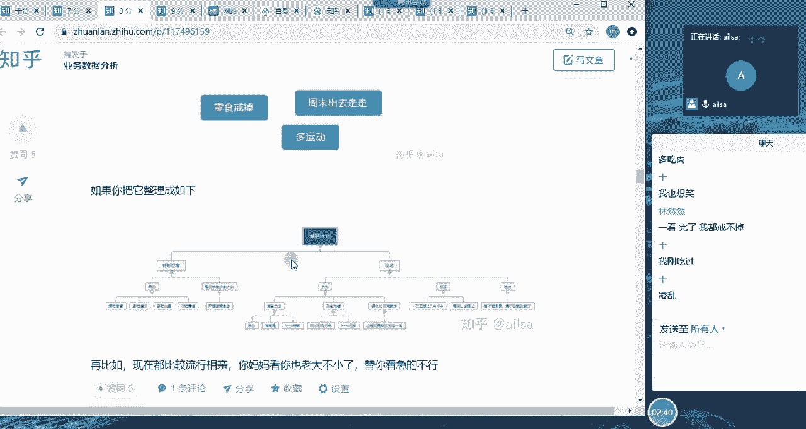

对不对，那这个时候我们就可以把这个减肥计划来，罗列出来了啊。

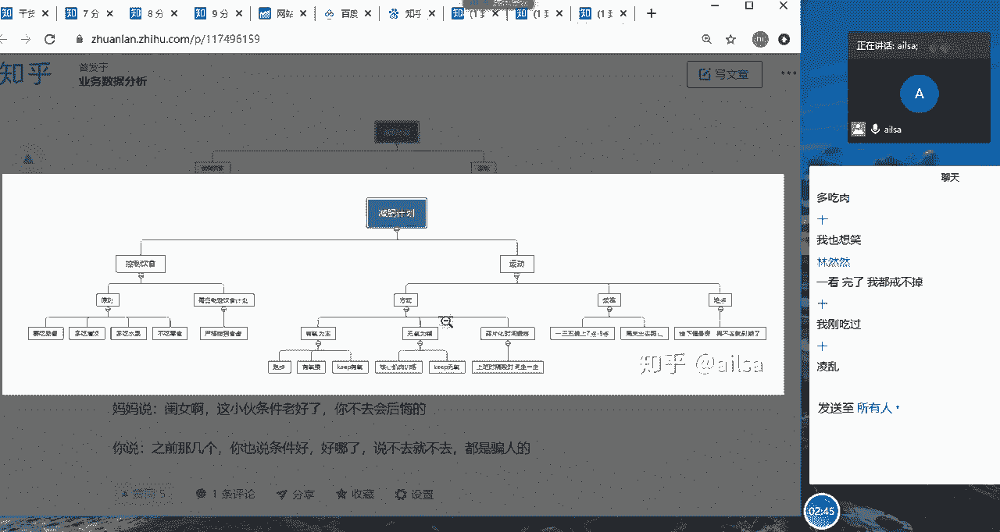

啊他这个没有啊，大家凑合看哈，减肥计划是分为控制饮食和运动诶，你的脑海里已经是有两个方向了，那控制饮食的话，首先啊你应该啊你应该有一个原则啊，什么原则呢，就是说吃早餐，然后多吃水果蔬菜。

然后多吃清淡的对吧，然后然后不吃零食对吧，这样的一个原型，然后啊就是原则哈，然后第二个就是你你又在想，如果说自己控制不住怎么办，我可不可以按照严格的食谱来执行，如果说有食谱的话，你也可以这么去干。

我今天就吃什么什么什么东西啊，这个红薯100克啊，红薯10克啊，鸡蛋一个是吧，胡萝卜怎么怎么着，这样的一个严格的执行的一个计划的话，那相对于来说你已经把减肥计划啊，已经是精确到每一个每一餐上。

哎这样就会比较清晰一些，那说完了饮食之后，你肯定还要啊，还要去还要控制你的整个的一个运动，那我该怎么去运动呢，首先你的目的是减肥，所以对于肥而言的话，肯定是要有氧运动啊对吧。

但是光长期的有氧对身体也不是特别好，所以还要结合无氧，那到底该怎么来运动呢，啊这个时候就有一个运动的方法，哎那我们最常见的一种就是跑步，对不对，跑步然后做一些有氧的操。

然后诶老师不是给我推荐了keep吗，我可以给根据keep上的一些啊视频，然后跟着去练习，那这就是有氧的，那对于无氧而言的话，我这边好像也没有什么太多的经验，所以说啊去健身房的话，好像就是现在这个疫情啊。

现在这个疫情也不让去，所以说哎好像keep上也有一些无氧的运动，然后比如说腹部的核心，然后腿部的训练以及肩部啊等等，背部啊这样的一些训练，我可以跟着去做，他们有一些比较简单的，对不对。

这个时候你已经制定好了，那下面你就该制定唉，我到底是多久去一次唉，那多久练习一次，因为现在家，所以你可以控制到每天都练习，或者是每周两到三次练习，然后每次都要多少时间。

然后是计划早上练习还是晚上练习等等，这些你是不是把你的方案都制定得特别清晰啊，啊这样的一个这样的一个形式的话，对于你这个减肥的话执行起来就非常的高效了，因为你只要执行下面这一步操作就可以了。

因为叶子这一块儿的啊，就是精确到啊这个最底层的这一个操作方式，不然的话，如果说你不按照这样的一个逻辑数拆解的时候，你就停留在减肥计划上，最多也就是饮食和运动。

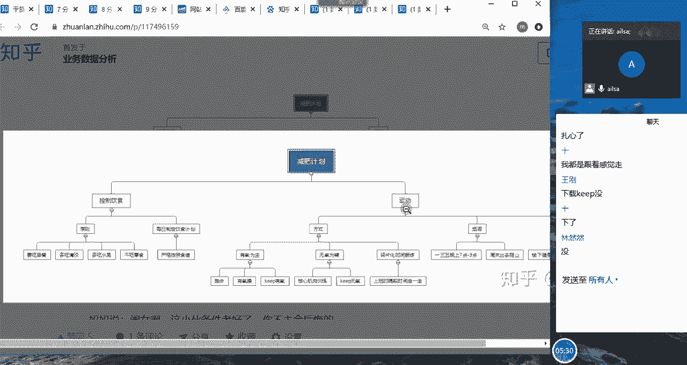

但是你到底怎么做，怎么去评估效果好不好都没有啊，所以说是这样的啊啊啊，这就是我们的一个逻辑数的拆解，那在我们的工作当中啊，哈那在我们的工作当中，我们针对某一项业务问题的时候啊，比如说我刚才跟你说。

唉离职率有点高，你给我分析一下什么原因，那刚才大家就说了啊，那肯定是说工作累，薪资低呗，诶那其实就这两个维度，但是啊但是你想啊，但是你想你接下来该怎么去分析，其实你已经没有思路了。

所以说你要把它罗列出来，从哪些维度，你分为新老员工，那对于新员工而言，你应该从哪些维度，对于老员工而言，你应该从哪些维度，是不是啊非常的清晰，拆解下来，最终你定位到新员工的哪些维度，进行一个可执行的啊。

这样的一个维度去拆解，就拆解到底层才可以，OK啊下面这个相亲的例子，大家大家就回去看了哈，这个这个我就是当时一时兴起写出来的哈。

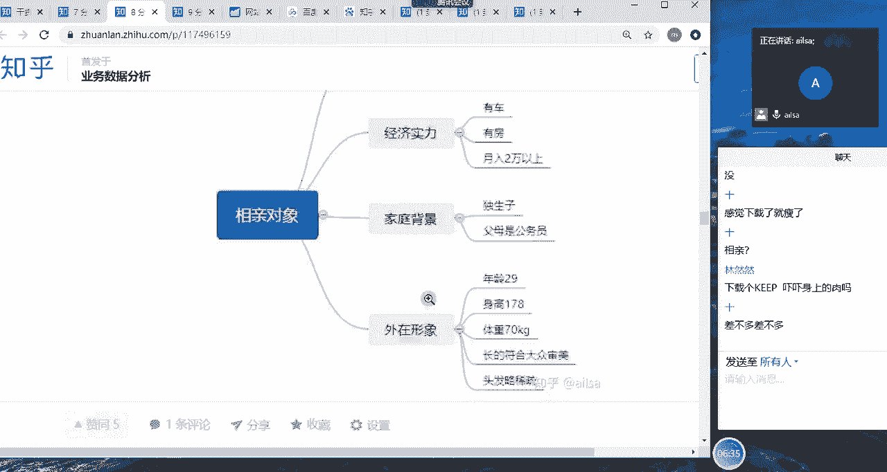

嗯啊我们就不举了啊，那我们在工作当中刚才说完了，就是说我们针对某一项业务问题，那我们可以进行一个详细的把自己零散的想法，或者是说复杂的工作，然后整理下来，一步一步地去执行。

你只要把每一个小的节点执行完了，那你整个大的节点也就执行成功了，对吧哈对然后在我们的面试过程当中啊，面试过程当中会有一个比较经典的啊，是面试题叫费米问题啊，大家有可能还没有参加过这样，类似的一个面试哈。

所以说对这个问题并不是特别清晰。

我给大家举一个简单的例子，比如说现在问你胡同口煎饼摊子，一年能卖多少个煎饼，唉大家对于这个问题畅所欲言，想一想，我该怎么去思考他到底一年能卖多少个煎饼，同志们啊，我喝口水啊，大家说一下。

一年多能卖多少个煎饼，同志们有什么想法没有，如果说我是面试官啊，我是面试官，我现在问你啊，胡同口的煎饼摊子一年能卖多少个煎饼，你现在就告诉我啊，我不要你的过程，我就问啊，有多少啊。

就是你就告诉我大概有多少个，你是怎么想的，嗯我是，嗯1000×365虾，对你知道吗，如果说啊，如果说你面试的时候遇到这样一个情况，你就在想你有病吧，我怎么知道他一年能卖多少个煎饼，对不对啊。

现在不让你问哈，就让你猜啊，就是你看他说你猜一下啊，大概估计估计一下胡同口的煎饼摊子，一年能卖多少个煎饼啊，咱不问啊，咱不问，其实这个，其实如果说你不知道它是费米问题的话，你可能唉你可能就就是说面试官。

你是上帝派来故意刁难我的嘛，对不对嗯，想吃煎饼，来看一下图片啊，更想吃了，是不是，我跟大家说啊，这种问题啊，咱们需要拆解啊啊啊不要这么说，我的哈喇子也流出来了哈，OK啊OK我们面对这啊不能看了哈。

OK我们面对啊这样的问题的话，其实我们需要对它进行一个拆解，首先我们先想一下，一年卖的煎饼的数量，是不是等于一天卖煎饼的数量，乘以365天，假设哈，因为这里面是估计，所以说大家不用去想的特别精确。

你就估计一下，假设他就每天都每天都上班，假设每天都上班，所以说是一年的兼并数量乘以呃呃，就是一天的兼并数量乘以365天，然后那我们的问题就聚焦在，一天到底卖多少个煎饼，那一天卖的煎饼数量。

我们就在想他一天啊，就是他一天工作多长时间，然后做一个煎饼需要多长时间，哎我一除就不就他一天卖的煎饼了吗，对吧，那这个时候，我们接下来就针对这两个问题再进行拆解，一天工作时长我们怎么来算呢，你看兼并类。

它属于饮食类，对不对，它饮食类的话，它又属于小摊儿，所以他不可能一天啊，12个小时都在都在都在做生意，所以说他肯定有一个集中的时间点，你比如说早上七点到九点，中午的12点到14点，晚上的18点到22点。

假设哈我们定位八个小时啊，跟我们的工作是一样的，它有八个小时，我们也八个小时，然后哦那做一个煎饼大概需要多长时间，大家都吃过煎饼对吧，也在那等，就觉得做一个煎饼真的好久啊。

因为太饿了啊啊因为它是胡同口的哈，你要记住这是胡同口，它不是市场哈啊所以说那种那种流动式的嘛，所以说我们做一个煎饼大概也就是2分钟啊，不是太长，最多2分钟也就差不多了啊，两到3分钟啊。

然后那我们就在想诶，那我们知道一天工作时长是八小时，做一个煎饼是2分钟，那相当于一天能做240个煎饼，对不对啊，一天能做240个煎饼，那一年也就是240个乘以365，大概是8万7600个嗯。

但是你在跟面试官去讲的时候，你不用告诉他最终有多少个煎饼，你只要告诉他你的思路就可以了，你跟他说嗯，你跟他说啊，你要问一年能够卖多少个煎饼，那我们就可以聚焦到一天，卖煎饼的数量乘以365天。

那一天卖多少个煎饼，我们可以聚焦到一天工作时长，除以一个煎饼的平均时间，接下来我们只要确定一天工作时间，大概是八小时，做一个煎饼需要两小时，然后进行这样一个计算就可以了，你就说到这里就可以了。

后面的数据都不用出来，面试官已经知道你的思路非常非常的清晰了，知道了吧，所以说我们把刚才这个一年卖的降低数量，然后就把它拆解为一天卖的兼并数量，然后拆解到这两个问题，然后进行一个计算。

再乘以365天对吧，那你我们会发现假设这是一个根，这是树的根的话，这个问题很大，这个问题很大，然后我们没办法去解决，我们可以把它拆成一个个分支对吧，那这个分支再进行一个拆解，切到这个时候的时候。

我们就可以把这个问题解决，我们解决了这些问题，那这个根的问题也就解决了，所以说这就是我们逻辑数的一个分析方法，它更多的是对大家的一个分析思维的训练，也就是看你的思路到底足不足够清晰啊。

啊经常我们在啊看那个招聘简章的时候，都会说，一定要清晰的逻辑思维啊，就是很强的逻辑思维能力，其实就就是它可以通过费米问题，来进行一个考察，明白了吧，所以如果大家再遇到这种看似没有答案。

看似没有什么答案的这些问题的时候，实则它是考察你的一个逻辑能力的过程哈，所以不要啊不要一上来，就你如果说比如说文科生的思维，他就会上来瞎猜啊，就是说哎大概啊我也不知道，反正就猜呗啊啊就猜一下。

但是如果是理工科的思维的话，他会再去拆解这个问题，把它拆到能解决的这样的一个呃情况，明白了吗，OK同学们，逻辑数分析法懂了没懂了，给我扣个一，好的，那我们看第二个多维度拆解哈，多维度拆解好，多维度拆解。

我们看又一个又一个例子是吗，Ok，啊你看我们从我们先从这个例子上去看哈，8月份的销售额下降了啊，销售额下降了啊，我们该怎么去分析呢，啊销售额下降，我们先知道销售额下降，它等于销售数量乘以单价，对不对啊。

那这个时候我们就要就要去分析到底是单价啊，叫到底是单价嗯，下降了，就比如说打折了，然后销量不变，单价下降了，那整个的销售额也会下降，到底还是销量下降了，单价不变造成的一个销售额下降对吧。

我们要去分析到底是什么原因啊，那我们大致的一个思思路是这个样子的，那我们啊这么去分析了之后，其实可能还会存在一些问题，因为我们整个的一个销售额，它到底代表了啊，代表了哪些啊，哪些东西。

你比如说有我们公司的销售额，它的产品不止一个，它有可能会有多个，所以说我们再想一想，会不会说是某些产品的销不是，或者是某些产品的销售额下降了，造成了总体的一个销售额的下降啊，所以我们第一个拆解的话。

我们可以按照产品去拆解，看一下到底是所有产品的销售额都下降了，还是说个别产品的销售额下降了，这是第一个拆解啊，我们就是啊通过产品维度，然后进行一个拆解，那第二个拆解的话。

就是我们一个产品下面肯定有很多个商品，那到底是这个商品，下面所这个产品，下面所有的商品的销售额都下降了，还是个别商商品，相当于对它进行一个二次的拆解，拆解到具体到某个商品。

然后再对这些商品进行一个详细的分析，假设我们发现是某三款商品存在大幅度下降，造成的总体销售额下降，那就要对这三个商品进行一个，更加具体的原因分析了，就要通过渠道啊，运营啊。

产品啊等等这些方面进行一个详细的分析啊，这就是我们的一个多维度拆解，还在聊啥啊，我都快讲完了嗯，这是从我们的整个的一个组成部分，然后去拆解啊，下面呢我们还可以从指标啊，从指标去拆解。

你比如说我们刚才最开始讲的这个嗯啊，产品的一个呃就是啊就之前讲的啥，就是分新老用户这个离职率啊，假设是离职率，然后离职率啊提高了，我们要分析一下原因，我们可以分析到底是新用户的离职率提高了。

还是老用户的离职率高了啊，我们进行一个新老用户的这样的一个拆解，这就是一个指标的拆解嗯，那还有就是从业务流程上的拆解，你比如说网站的订单的转化率啊，你们开始闲聊不太好啊。

我们看一下我们之前讲过进入网站啊，进入网站我们的这个流程就是进入网站，浏览商品，加购物车下单，如果他整个的转化率降低了，我们就要分析在哪个环节降低了，到底是浏览商品到加购物车降低了。

还是加购物车到下单降低了，还是说下单到付款降低了，如果是哪一个环节出现了问题，我们就去聚焦到某一个环节就可以了，因为如果你不对这个流程进行一个拆解的话，你只知道它从用户到从用户金融网站到下单。

整个的一个降低了，那你没办法进行一个详细的分析，所以需要进行一个具体的维度拆解，明白了吧，OKOK大家对于多维度拆解啊，呃有了解没有，同志们，同志们采金矿吗，肯定没好好听，vi1会就让你发言。

我们先呃呃我看一下啊，好好听啊啊其实这个这个这个就这个不难哈啊，而且说我现在给你讲完了之后，你不会用啊，为啥呢，就是因为你没有实际的练习，所以说我尽量快速的去讲，然后我们在做报告的时候或者实例的时候。

大家就就可以应用到了，而且其实这些东西你在实际的工作当中，你并没有觉得说还有呃，就是就是是这么个回事，因为你无形当中你已经从这些维度去分析了，因为很明显嘛，你比如说举一个最简单的例子呃。

我们在上我们在上学的时候，老师经常说整个班级的一个啊，整个班级的一个学习情况啊，大家的平均水平这个平均分都还不错，但是具体拆解拆解到某些人的时候，就会说哎你看最低分还是挺低的啊，这等你进行一个拆解啊。

是我代表最差的一届的学生，对啊，OK这是我们的啊，维度拆解就一定要衬到最细的那一部分，然后进行一个详细的分析，第三个就是对比分析方法，对比分析方法就很简单了，但是呢他又是在我们整个的分析过程当中。

用到最多的，因为我们啊我们无形当中都在进行一个对比哈，嗯你比如说啊我这边举的例子也挺逗哈，哎我上小学的时候数学不好，语文特别好啊啊然后每一次考完试之后，我妈就说你看人家你看人家考90分，你考九分。

你的零去哪儿了是吧，林不是经常说鸡蛋吗，然后你是生吃了还是煮熟了，咋滴啊，所以说你看这就是一个对比，这是对比什么呢，就是说你就是你们俩考试成绩是同一时间的，他和你之间进行一个对比，相当于是同一维度的啊。

一段就是同一时间内，不同维度的进行一个对比啊，这个解这个就是这样的一个对比方式，那还有就是你还可以跟自己去比啊，就是比如说啊到年底的时候啊，啊就是看这一年的一个成绩变化啊，第一次考53分。

第二次考68分，第三次考36分啊，第四次考62分，然后四次大考，这成绩跌宕起伏哈，在平原上呆着不舒服，非要去爬山越岭，对这我妈也挺逗哈，然后就我们就会发现这是针对自己维度。

然后在不同的时间内进行了一个对比啊，这是两个不同的方向，一个是横向啊，这个是横向，就是在一个时间内啊进行一个对比，然后这个是纵向啊，在不同时间内跟自己进行一个对比啊，这就是两种不同的一个对比的方式啊。

那啊其实这两种方式在我们的啊，在我们的整个的一个工作中，生活中啊，各个环境中都会用到啊，真的是唉没有对比就没有伤害哈。

没有对比就没有好坏，没有对比也没有伤害啊，嗯啊然后啊我们刚才讲到横向对比和纵向对比。

那在工作当中的话，我们经常会用到两个词，一个叫同比，一个叫环比，那同比呢它指的就是2019年3月的销售额，比2018年3月的销售额的一个增长幅度，这个就属于同比，这个就属于同比，也就是在同一时间段内。

或者是同一个啊间隔时间内啊，就是相当于是啊，就是怎么，反正就就是这样，就是同比哈，就是去年的3月和今年的3月就是同比，那今天的星期一和下周的星期一，它也是一个同比，那什么叫环比呢。

就是相邻的相邻的之间进行一个对比，你比如说4月比3月啊，销售额下降了2%，这就是属于环比，就是第二季度比第一季度的，销售量增长了8%，这也属于环比啊，这是环比和同比之间的一个差异。

我们在工作当中经常用到的就是环比同比啊，怎么怎么着怎么怎么着啊，然后我们再看一张买家秀与卖家秀哈。

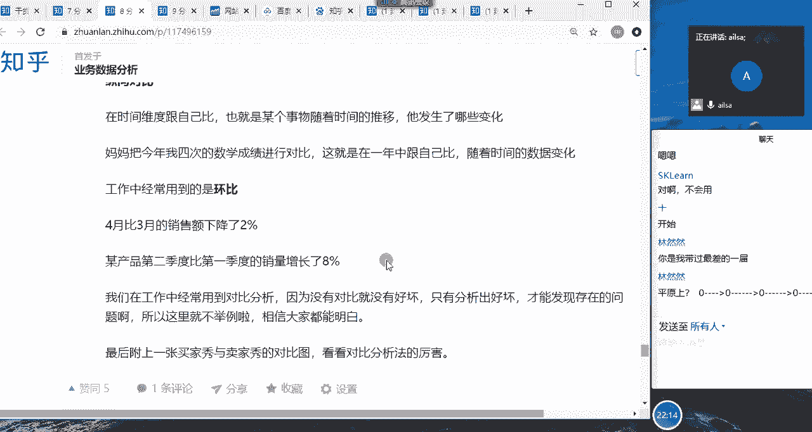

就是这个运动服太吓人了，哈哈这个嘶啊，这个图太不清晰了啊，看着挺挺吓人啊，没有对比就没有伤害啊，这是对比分析方法嗯，大家对于对比分析方法了解了吗，同志们，了解了给我扣一啊，OK好，那我们接下来往下走哈。

我做一个笔记哈，啊做完了啥逻辑数多维度啊，对比啊，加假设检验，啊这几个我看看我们下午可能还要讲，我们先看啊，呃就是假设检验法也叫归因分析法，它俩是一样的哈啊那我们在讲假设检验法之前。

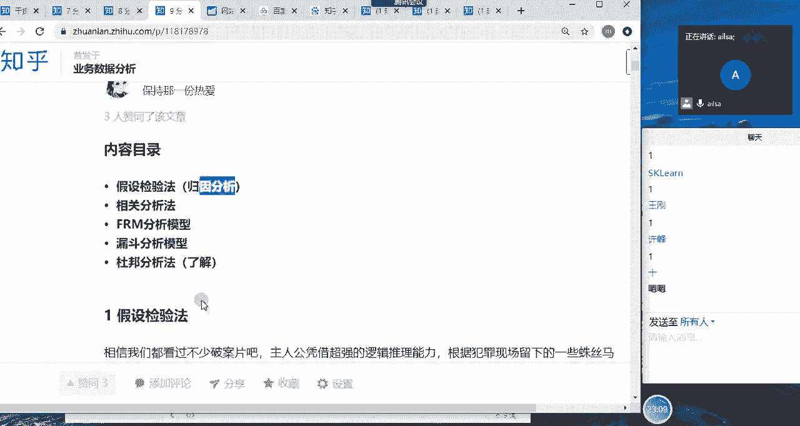

我相信大家啊，大家看到这个图片，就知道是唐人街探案二的里面的一个图对吧，那我们看过很多侦探的片子啊，他们都是通过现场，然后发现了一些蛛丝马迹，然后去推测唉是不是因为什么什么什么造成的，然后就去找证据。

然后证明他们的猜测是对的，是不是这样的一个逻辑，那在我们的工作当中，这个是怎么来使用的呢。

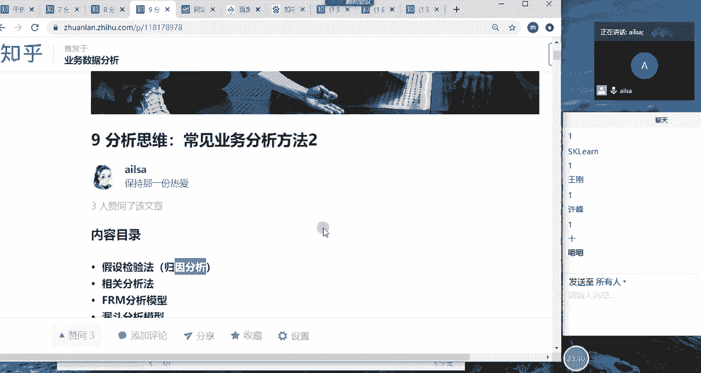

其实是我们对于某一项问题啊，我们对于某一项问题，然后提出假设啊，接受假设之后呢，我们去验证它，我们去收集证据，这个证据就是我们的数据，然后最终得出我们的结论，这样的一个过程啊，你比如说我们还拿啊。

就是这样的一个啊销量啊，某款销量上升，我们看其实在工作当中，我们不仅仅分析不好的现象，我们还会分析好的现象，你比如说某款产商品销量上升了，我们要分析一下它的原因，那商品啊销量上升啊。

我们很直接的一个想法，就是说诶是不是运营那边搞什么活动了，对不对，那我们啊那我们其实就是猜测啊。

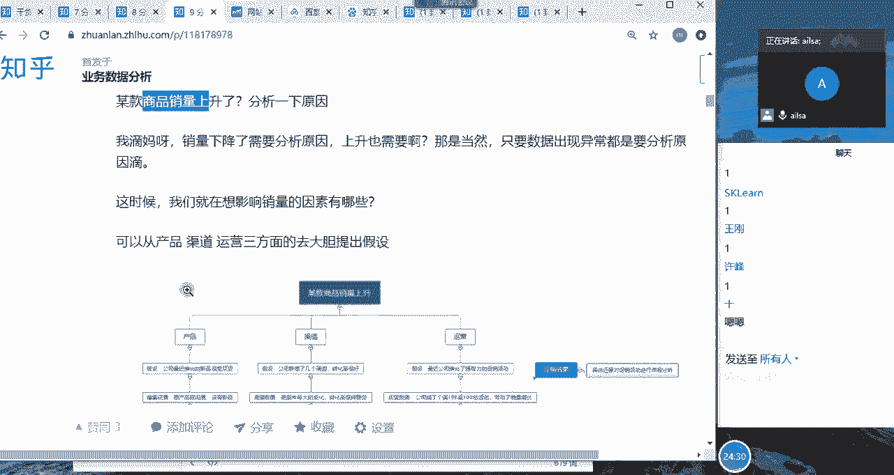

我们猜测说唉，是不是因为啊运营那边搞什么促销了造成的，唉是不是最近公司推什么有强有力的促销活动，那会不会是渠道那边增加了几个，比较给力的渠道，然后造成了啊整个销量的一个上升。

那会不会是产品这边他们又优化了很多产品，然后新增了一些新的呃，呃符合当下需求的这样的一些东西，这些都是我们提出的一些假设，那提出这些假设之后，我们就去搜集我们的数据，去验证我们的假设是否正确。

你比如说运营这边，然后我们把相关的数据给它调取出来，看最近是否有搞活动，或者说直接跟运营人员去沟通，你们最近有什么什么大的动作，没有啊，有没有针对该商品进行一些啊促销啊等等这些，然后去验证我们的假设。

然后还有就是渠道这边，也可以跟他们进行一个沟通，或者是从数据上去体现，或者产品这边也是一样，那我们通过这些去验证，最后得出我们的结论到底是否是正确的，这样的一个过程，其实就是我们假设检验的过程。

因为我们在做原因剖析的时候，很多时候都是我们先呃呃先假设诶，很可能是因为这个问题造成的，但是我们不能盲目的就认为是他，我们要就是搜集我们的证据，去证明我们的想法是对的啊。

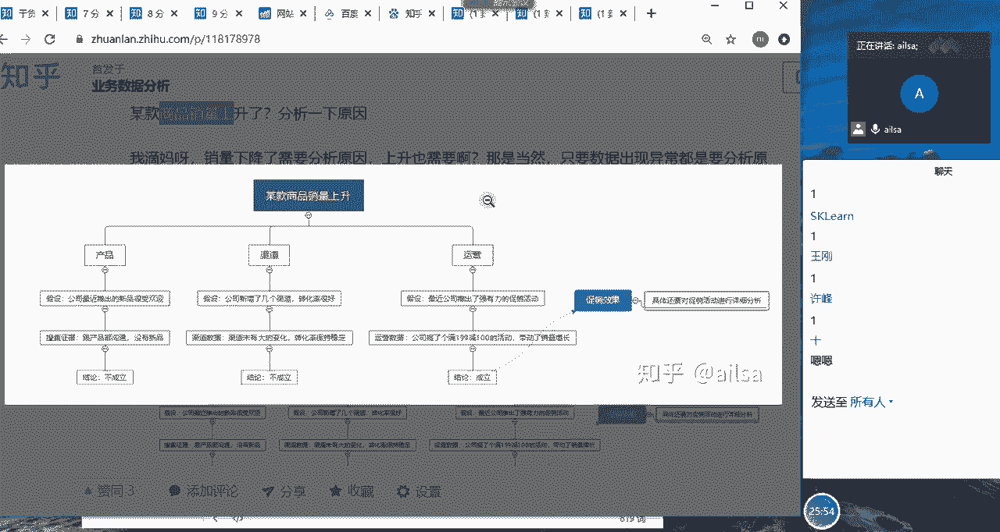

这是我们的一个假设检验的分析的步骤，那我们呃在进行假设检验的时候，它不是单纯的，它不是单纯的用这个分析方法，它还会结合我们的多维度拆解，你比如说我们假设它是因为这个原因。

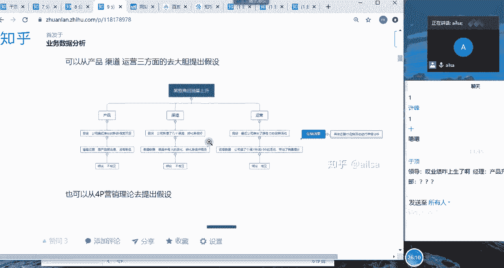

我们在进行分析的时候，我们肯定还会用到对比分析，多维度拆解进行一词，也就是层层剖析，然后这样的一个过程啊。

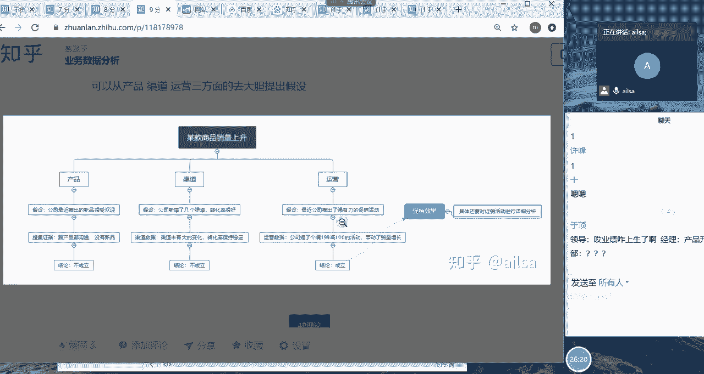

我看讲预定说啥，你想表达什么，嗯啊这是假设检验的分析方法，嗯然后我们看一下总结来说的话啊，就是假设检验法是针对某个问题，根据一些因素大胆地提出自己的假设，然后搜集证据去分析，证明自己的假设，如果成立。

则得出相应的结论，如果不成立，则可排除该因素啊，啊其实这这这是我们总结出来的，这样的一个分析的方法啊，在工作当中我们也经常用，但是有时候真不知道他是教这个方法，要不是因为教学的问题啊。

我还真不知道它它可以称之为归因分析，或者是叫假设检验的分析方法，嗯这样嗯嗯嗯我看一下啊，OK那我们再接着往下讲相关分析方法，嗯这个鱼顶对这个是有问题吗，没有问题的话，给我扣个一吧，我不知道你这个想干嘛。

没有，OK好的，是不是老师不太懂你们的玩笑是在哪，OK我们看相关分析哈，相关分析方法，我们之前昨天在讲图表的时候，我们讲了啊两种数据类型啊，两个变量之间它们有什么关系，有什么相关关系的时候。

我们可以通过啊，相关分析或者相关系数来去体现，那这里也是一样，就是说我们在工作当中啊，经常去分析某个原因产生的影响因素的时候啊，我们就会去用到相关分析方法，因为跟它相关，所以说可能就是因为它产产生的。

但是如果说我们的相关的因素有很多，那我们就要选择影响最大的那个因素，进行一个深入分析，这样这个时候我们怎么知道哪些因素，影响比较大呢，我们就要用到相关分析，也就是判断两个变量之间的一个相关系数。

来决定它们之间的一个相关程度，如果说相关系数很大，那我们就有可能认为它们之间是相关的啊，我只是说有可能认为啊它们之间是相关的，我们只是通过统计学的一个原理来去判断的，但并不是绝对的嗯。

那我们统计学当中我们的相关分两种，一种是正相关，一种是负相关，正相关的话就是一个变量的增长，会引起另外一个变量的增长，负相关当然相反了，一个变量的增长会引起另外一个变量的下降，它的取值范围就是-1~1。

那等于一完全正相关等于负，一是完全负相关，这两种情况都不是我们研究的范围，我们研究的范围是-1~1之间的这些，那如果说它的绝对值大于0。6，代表关系性很强，0。6是个节点，关系性很强啊。

那我们怎么去计算它这个相关系数呢，我昨天已经给大家演示过了哈，我在这里就不演示了啊，身高和体重的一个相关关系的一个介绍，嗯那我在这里啊，我们知道昨天的那个，它们的相关系数高达0。9，说明是关系性很强。

那我在这里给大家主要强调的是，相关并不等于因果啊，为什么这么去说呢，因为我们都知道在实际的工作当中，我们分析他们俩之间相关，很大一部分可能是想得出来，它们之间是因果关系。

也就是说因为这个原因造成的这样的一个后果，我们想达成这样的一个结论，所以说我们配合着哎，我们的整个统计学的一个原理来实现的啊，啊那我们需要注意的是啊，它并不是绝对的，为什么呢，因为A和B相关。

它至少有以下五种可能啊，第一种的话就是A导致B，那就是说呃因为A所以导致了B，它们之间是存在其相关的，也就是呃就是有因果关系的啊，但不是互为因果，因为A导致了B那B导致A就是反过来嗯。

那你看第三个C导致A和B，也就是说A和B互为相关，不是因为他们俩之间有因果关系，而是因为第三方的一个因素而造成的，我给大家举一个很简单的例子，呃这下面有个例子哈，我们看这个游泳溺亡的人越多。

雪糕卖得越好，那游泳溺亡的人和雪糕啊，卖雪糕这样的两两个变量之间，它们真的存在啊，很强的一个相关性，但是他们有因果关系吗，啊他们没有，他们并毫无毫无因果关系，是因为天气炎热啊。

第三方因素C天气炎热造成的游泳的人比较多，所以说游泳的人比较多了，他自然溺亡的人就会多一些，那夏天的时候大家都喜欢吃雪糕，对不对，所以说雪糕卖的越好，但是如果说你把他俩的数据拉在一起。

它们的相关性是非常强的啊，那如果说你把这个C啊，这个C的因素改变一下，他们俩之间就没有任何关系了，你比如说你把这个天气啊原因去掉，把整个一年的啊数据拉出来，你就会发现好像也没有什么太大关系。

这就是因为第三个原因导致的A和B，那还有一个就是我们所想看到的，A和B互为因果啊，那第五个的话就是小样本引起的巧合，这个指的是啊A和B相关的话，是因为样本误差造成的这样的一个呃，一个呃一个结果哈。

嗯OK这个是需要大家注意一下，就是说如果你判断两个变量之间是相关的话，并不是一定断定他就是因果关系啊，只要强调这一点就可以了，嗯就比如说你在做分析报告的时候，你得出来它们之间是相关性啊，很强的两个变量。

你不能直接下结论，说他们就是因为这个原因导致的这个结果啊，你还要再进行一个详细的接，接下来的一个分析啊，这样子啊，当然这边还有个例子说睡眠时间越短的人，收入越高啊，我们想一想，这个其实有点扯了。

为什么呢，它也是因为第三方因素造成的，因为那些比较努力的人，或者说追求上进的人，他有可能花很大的时间用在了学习上，用在了提升自我上，自然而然他的睡眠时间就很少了啊，那他的收入也会相对很高。

但是有些人呢就是为了啊，就是为了就是断章取义，直接把睡眠啊时间很短的人啊，这一部分人的数据拉出来，然后再把他们的收入拉出来，哎一对比发现确实是这样，你睡得时间越短，你的收入越高，那其实这个是样本的问题。

数据啊存在片面性啊，那第二个就是青少年越喜好重金属音乐，越会沾染酗酒的恶习，其实这个还是有一定的相关性的，因为一般喜欢这类音乐的人都比较个性啊，他就希望说能够引起别人的注意，但是啊就是呃就是沾染酗酒。

这样的一个恶习的话，会觉得与众不同啊，会有这样的一个情况，这个是具有相关性的哈，但绝也不是绝对的啊，那相关的一个陷阱啊，陷阱，OK哈OK啊，OK那我们啊还剩一个RFM分析模型啊，RM分分析模型啊。

还有一个我们的漏斗分析模型啊，漏斗分析模型这两个的话相对来说啊，比较重要一些哈，比较重要一些，所以说我们今天应该是啊，上午应该是就不能讲了，我们下午再讲哈，漏斗分析模型，这里面我还加了一个啊。

加了一个ARR分析模型啊，我看一下对加了一个A22分析模型，到时候的话再进行一个详细的讲解，对我们下午三点，啊下午三点接着讲啊，我总结一下哈，因为啊这一块嗯，啊这一块讲的稍微是有点呃有点粗糙哈啊。

因为他也没有一个嗯详细的大纲，和大家实操练习的，大家就是听啊，所以说这个听呢就是相当于掌啊啊，这个相当于是长见识，也就是说我因为我，我们大家对这个行业都不是特别了解，我给大家介绍了我们行业的一些指标。

然后还有就是我们的一些分析方法，它是一个软实力的一种啊，所以说啊不行，我晚我下午还要讲呢，啊我下午还要讲，你们不能不能不能嗨哈。

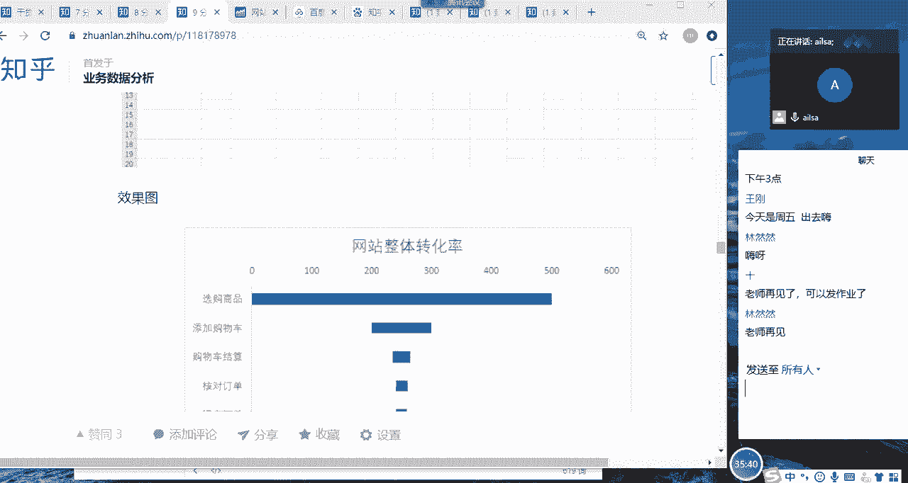