# 强推！这可能是B站最全的【Python金融量化+业务数据分析】系列课程了，保姆级教程，手把手教你学 - P66：08 电商数据分析案例 - python数字游侠 - BV1FFDDYCE2g

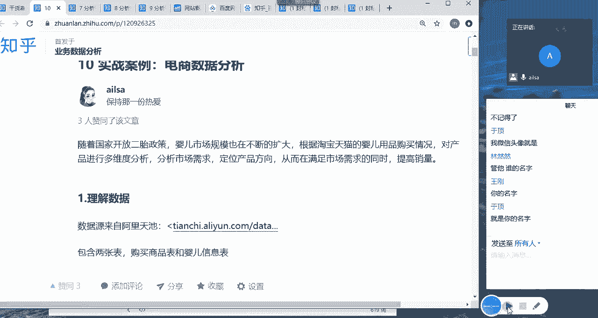

那我们这个大作业啊，就是电商数据分析，它是淘宝天猫的婴儿用品用品的一个购买情况，然后啊我们从这个数据当中。

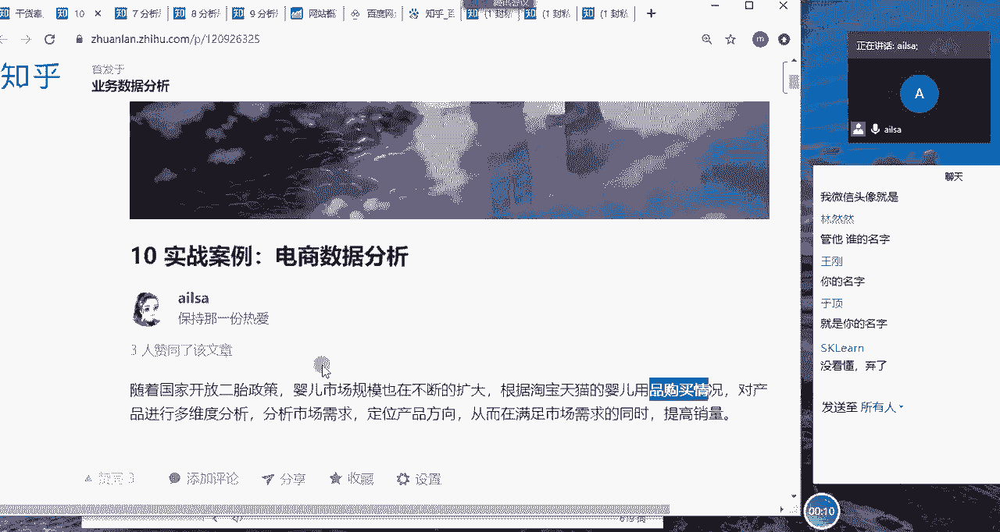

然后需要分析啊一些我们想要的结果啊，但是这个结果大家没必要啊，按照我这个啊我这个提出的问题，然后去分析，大家可以根据自己的思路，然后去做这样的一个按照这样的一个方式。

然后一步一步的把自己的整个的一个结果啊，体现出来，那我们看一下它的数据数据内容哈，它的数据内容有两个表，我这边应该有理解数据啊，他这边数据类型有两个表，一张表就是商品表，一张表是婴儿的信息表。

那这个商品表呢有用户id，商品id，商品二级分类，一级分类商品的属性，购买的日期啊，购买的数量，那婴儿的就是用户的id和出生日期性别，也就是说嗯也就是说这边购买的商品啊。

然后这边是相当于是婴儿的一些信息，那我们从这两张表当中，我们可以知道我们可以分析商品啊，或者购买行为的啊，这样的东西还可以结合用户的一些基本信息，比如性别除日期这样，然后进行一个用户特征的一个分析。

大概是这两个维度嗯，然后如果大家没有太好的一个思路的话，可以在知乎上找一找。

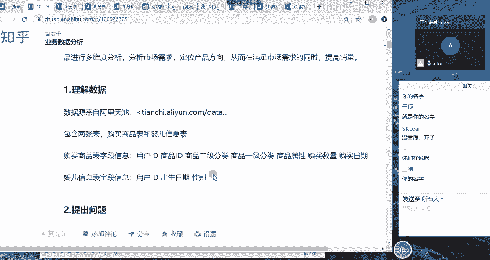

因为啊我在知乎上看过，有不少基于这个案例的分析。

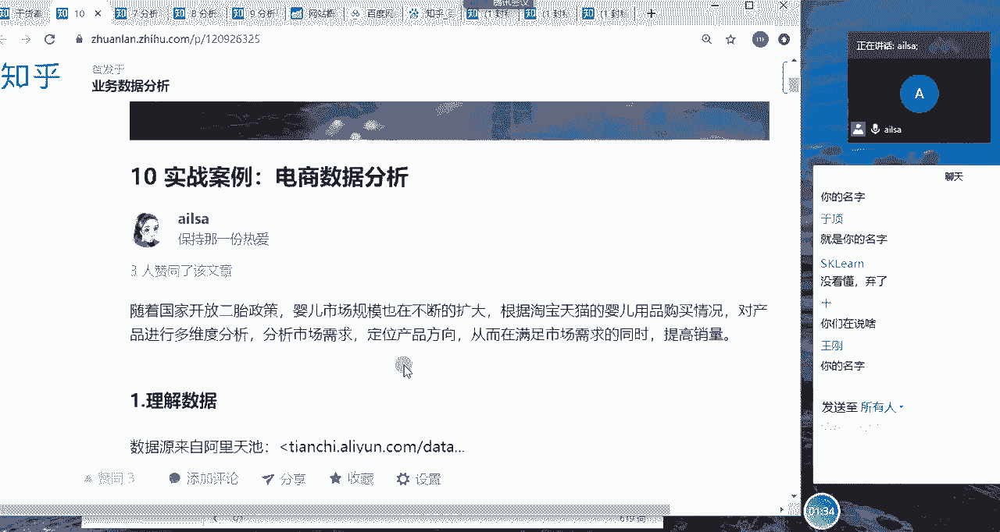

你可以看一看别人是怎么做的。

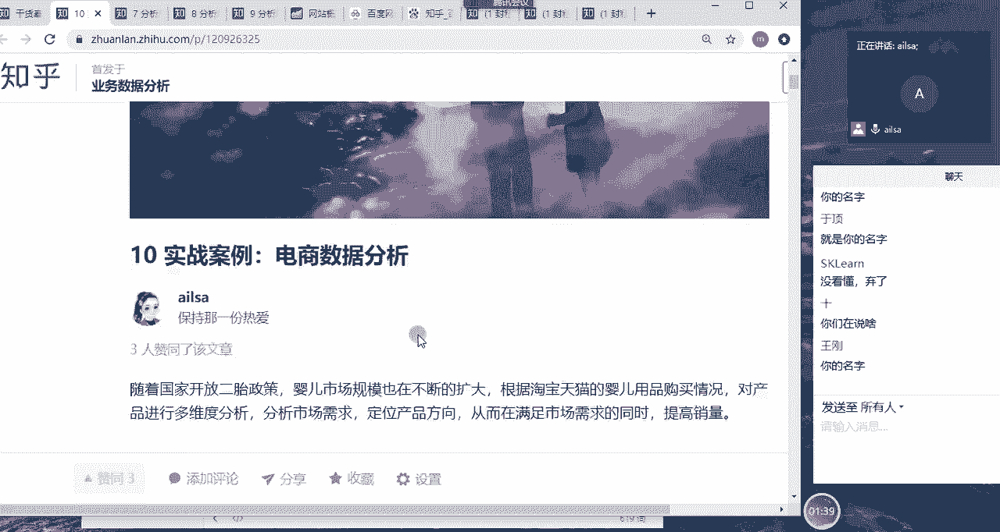

也可以看一看我是怎么做的，然后结合这些把自己的思路写下来，然后包括用到了哪些指标都可以写下来，然后呃一步一步怎么去深入分析的，然后找到了什么样的问题啊。

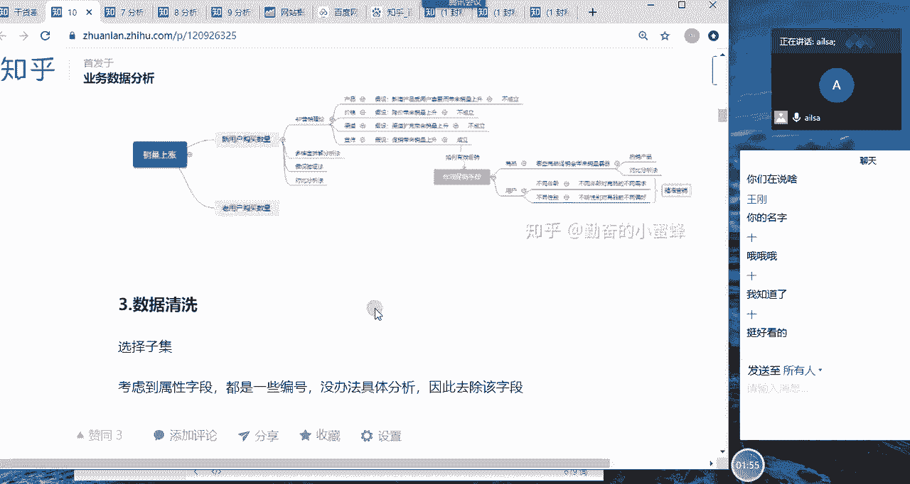

这样的一个结果啊，我们也是从数据清洗开始，然后到数据分析啊。

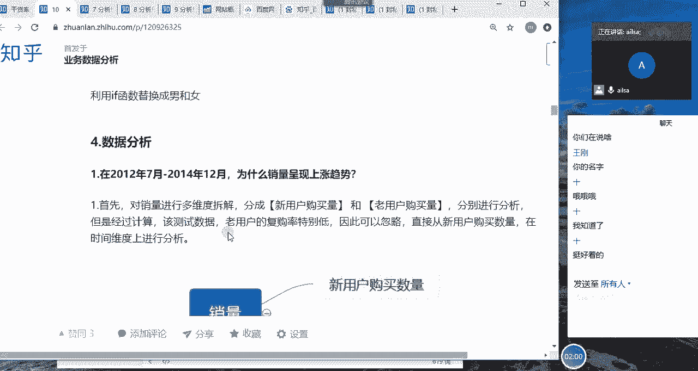

然后到接下来的各个步骤啊，这样的东西嗯。

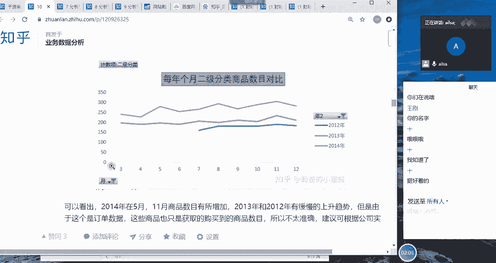

最后要得出结论哈，你分析完了之后。

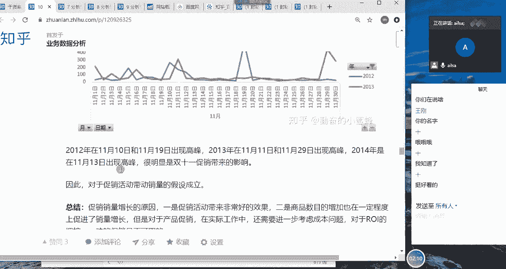

你要有啊，你要有你的结论，我还写了挺多。

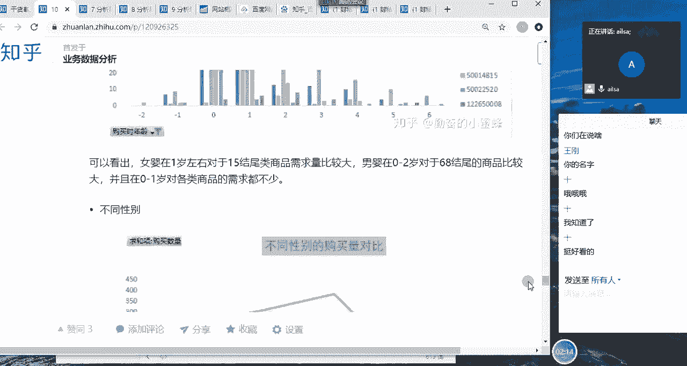

要你的结论啊，结论和建议就是说你做了这么一堆分析之后，你从数据当中发现了什么问题，你提出什么建议。

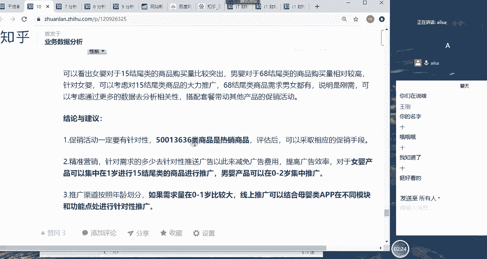

建议谁该怎么执行这样的一个结果啊，大家对于作业了解明白了吗，还在聊电影，啊了解明白给我扣一，好的好的好的，啊这个就交给大家了哈。

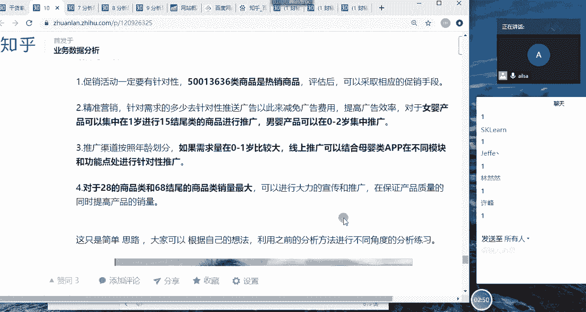

大家写的好的话，就可以放到简历里当中了啊。

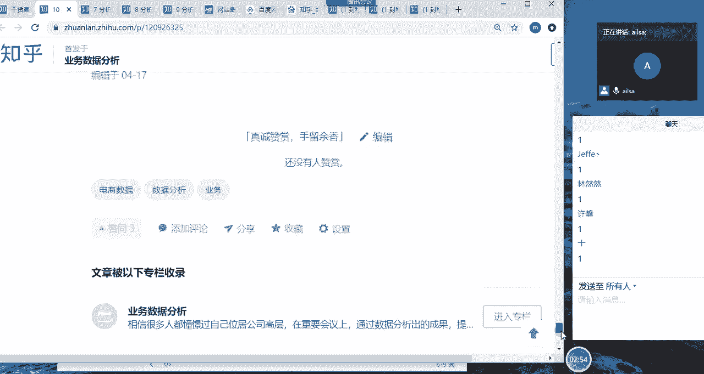

就是我我们公司的一个产品，然后我做的一次分析。

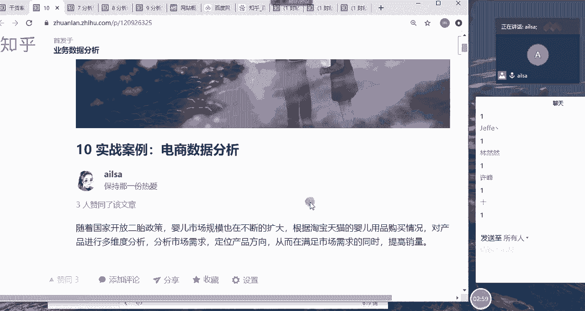

所以大家还是要重视。

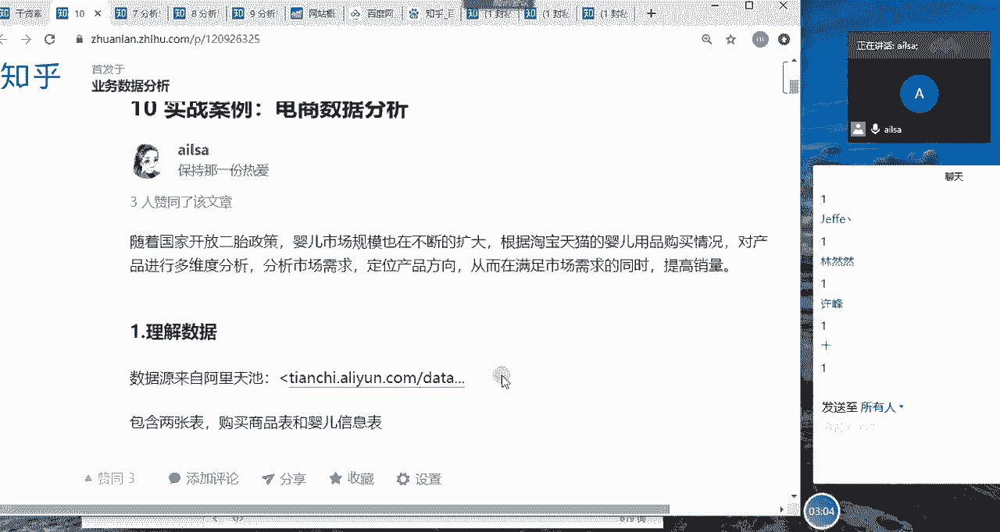