# 强推！这可能是B站最全的【Python金融量化+业务数据分析】系列课程了，保姆级教程，手把手教你学 - P67：09 RFM分析模型 - python数字游侠 - BV1FFDDYCE2g

唉同学们唉我们接下来讲解RFM分析模型，那什么是RFM分析模型呢，它其实就是对用户行为的啊，一个哦分析的模型的评估，那它由三部分组成，一个叫R，一个叫F，一个叫M，那呃选谁。

不等他了啊啊那他的最近一次时间间隔呢，就是啊它的三个指标，就是一个叫最近一次时间间隔，一个叫消费频率，一个叫消费金额，那这三个指标构成了该模型的三个组成部分，我们可以看一下最近一次消费啊。

间隔消费时间间隔啊，它代表的是最近一次消费，然后到当前时间的一个间隔，比如说你在淘宝上买东西，那嗯你在淘宝上买东西，然后你是三天前买的，那你距离当今啊，今天啊，那已经是间隔三天了，如果说你是去年买的。

那你就是相当于已经间隔时间特别久了，如果间隔的时间特别久的话，说明这个客户有可能就已经流失了，对不对，只有他间隔的时间比较近的时候，他才有可能给企给这个呃产品带来价值，那第二个就是频频度。

也就是说我们一般情况下会统计一段时间内，它的一个消费的次数，如果他消费的次数比较频繁的话，说明他这个客户还比较优质的，对不对，如果说他一年买一回，那对于我们来说，其实价值也不是特别大。

我们看第三个是额度，也就是说你消费啊，你消费的次数很多，但是你每一次都是花一两块钱，二十三十五十的，这种其实价值也不是特别大，对不对，我们还要看他最近呃，他最近一段时间内的一个消费金额情况。

如果他的金额特别大，那说明肯定是我们的大客户，对吧啊，那我们就要好好的去维护它，它流失了对于公司的损失还是比较大的啊，这就这三个指标，然后我们再来看就是嗯就是对于不同的用户啊。

就是它对于企业带来的收益啊，也差别特别大，我们都知道啊，你们我不知道，你们知不知道哈，反正我是知道有一个叫二八定律的，也就是20%的有价值的客户，能带来80%的一个收益。

所以说我们要把那20%的有价值的用户，一定要维护好，这也是我们作为RFM分析模型的，一个很重要的价值，就是对于用户进行不同水平的分层，然后去精细化运营，OK就是RFM，我们举个例子哈。

比如说唉小王最近有两个月的一个消费记录，相当于是我们调取了两个月内，他的一个一段时间内啊，两个月作为一段时间它的整个的一个消费情况，那我们看2FM分别是什么，二是最近一次购买时间间隔。

我们看他最近一次购买的时间是3月20号，那就是今天啊，因为我当时写博客的时候是3月30号哈啊，那就是3月30号减去3月20号就等于十天，那那它的时间间隔就是十，最近一段时间内他的消费的频次。

我们可以看到他消费了是三次，对不对，那他的那他消费的金额就是我们这个金额相加，很明显啊，这个就比较简单一些，这就是我们的RFMF模型，我们可以看到，其实计算相对来说还是比较简单的。

那我们该怎么对它进行一个分层呢，你只有这三个指标，我们该怎么对应分对它进行分层，因为我们会有很多个用户。

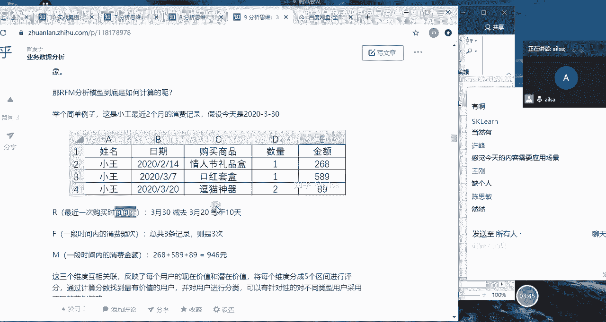

对不对，我们要把这个用户分为不同的层次，哎我们看一下这张图哈，啊这张图哎大家应该是能看清楚的哈，啊我们看一下，就是就是RFM作为我们的一个标准，如果说它的啊，最近一次交易距离当前的时间哎比较近。

或者是你比如说昨天买的，这我们就称之为高啊，最近一次交费的频数啊，就是他这个频率也比较高，那我们也如果次数比较多，我们也是说明他很高，然后最近一次交费的额，交易的金额啊也量也比较大，我们也是定义为高哈。

那如果说三个都比较好的话，数据都比较好看的话，那就说明它是我们的重要价值客户，对于这类客户而言，我们要呃我们要怎么着呢，他就是我们的优优质客户，我们需要保持，那我们可以呃精细化运营的方案。

就是倾斜更多的资源啊，然后要去VIP服务，然后附加一些额外的销售啊，三高对就是三个指标都比较好的时候，它就是我们的，我们就可以把它升级为我们的什么VIP啊，什么什么VVIP啊。

这样的一个呃好的客户去维护他，然后给他再制定一些个性化的服务啊，这是我们的重要价值客户，那第二个就是如果他最近一次消费的一个嗯，距离当前的时间还不错，但是他最近消费的次数有点少，但是它金额金额还在。

说明他最近消费的次数少的话，那它就是我们需要深耕的啊，或者是需要发展的啊客户，那我们该采取怎么样的一个操作呢，就是说我们要给它提供一些啊，呃提供一些啊优惠或者是推荐其他商品。

有可能他是它是对某类商品需求量比较大，但是这类商品还有购买的一个频率，比较低的时候，我们可以给他推荐其他商品，让它的一个交易的额，交易的一个次数提高一下，这样的话对于企业来说，我们也可以赚他的钱。

对不对哈，我们也可以赚他的钱，这就属于我们要深耕和发展的客户，就是针对他交易的频率不高的时候，我们可以提供什么会员忠诚计划，因为如果说这个指标一直是滴一直滴滴着滴着。

他就可能就不在我们的平台去购买产品了，有可能就去别的平台去购买了，那那个时候他就是我们的流失客户了，对于这样一个消费金额比较大的客户而言，对于企业的一个损失还是很大的，所以我们一定要重点发展它。

那第三个就是重要保持客户，重要保持客户，我们看一下它的它的特点，就是它距离啊，最近一次交那个当前的一个时间呢，就比较久远了啊，比较久远，但是他后面的啊，交易的频率和它的交易金额也都比较高。

这种的话就是需要换回，因为它距离当前的一个消费的时间，已经比较久远的，那这种的话它慢慢的就有可能就会流失了，所以说我们要给他发短信，哎，我们给他发那个什么什么，其他的一些提醒类短信。

说哎我们这边搞活动诶，你要不要过来参与一下，让他注意到，或者是让他回重新回到他原来的一个平台上，拉回来，这要换回啊，重要保持客户也叫重要换回客户诶，那第四个就是重要挽留客户，这是什么呢。

就是它的距离当前的一个消费的时，间的天数也比较久远，然后消费的频次也没那么高，但是它的金额还在那，说明唉这个客户就很有大，有很大可能就要走了哈，比上面所有的客户都要危险，因为它也不消费了。

然后消费的频次也比较低，但是它是我们的啊，就是很有价值的一些客户的时候，我们一定要啊就要就要重点去联系和拜访了，要提高我们的留存，不能让他跑了啊，我们可以看到这个前面四个都是很重要的，什么什么客户。

那他的是针对他的呃金额而言比较高，所以说它叫重要客户，接下来的话就是一般的客户的，那你看一般的客户，他的交易的金额都比较低一些，我们看一下，第一个就是一般价值客户，就是它的交易的距离。

当前的时间呢还算呃还算比较近，然后也消费的频率比较高，但是它的金额就比较小，也就是说他就买了十块20块这种的话，那其实它是对于整个的一个产品，或者是app是认可的对吧，只是说他没有。

它不具备这样的一个强有力的购买力，那我们就要给他推荐一些有高价值的产品，说明它有可能啊是我们的一个潜力用户啊，潜在用户，我们深度的去给他推荐一些比较好的产品啊，价值比较高的，说明他也有可能会购买。

因为它对我们的平台是认可的，他相信我们的产品啊，是这样的啊，这是我们的潜力用户，那再要接着往下来说，如果说他距离当前的一个消费的天数比较近，但是其他的比较低的时候哦。

那这个时候我们就可以把它定义为是一般发展，也可以定义为是新客户，就有可能是刚来哎，刚来的话，你这个频率和你这个金额肯定都低，所以说对于新客户而言的话，我们就要给他一些诱导性，唉比如说提供一些啊免费试用。

然后提高客户的一个兴趣，然后创建品牌的一个知名度啊，就是让他逐渐的去认可我们这个平台，就是新客户，然后第呃倒数第二个的话就是一般保持客户了，也就是说它的消费的频率啊是在的，但是它的距离当前的一个时间。

还有就是消费金额都比较低，那这种的话就明显就是他就是每一次过来呃，呃消费呢也频率还可以，但是他的金额啊比较低，而且呢距离最近一次消费呢又也比较久远了，那说明它整个的一个贡献价值，而不是太多啊。

啊我们啊我们可以给它进行什么呢，哎我们如果想保留住这样的一个客户的话，可以采用积分制，因为啊积分制的话就可以让用户啊不断的啊，就是为了为了积积分，然后不断的去消费，然后提高它整个的一个呃距离。

当前一次的一个消费的天数呃，用户的粘性啊，然后呢我们跟他就是打折促销啊，保持联系啊，这样的一些活动，然后尽量不让它流失，那对于最后一个哈，最后一个就是三啊，三个维度都比较低啊，就是用户的粘性。

忠诚度和消费力都比较低的时候，那这个时候我们就就可以把它定义为，是流失用户了，那对于流失流失用户而言，我们要去评估它是否有挽留的价值，如果有挽留的价值，我们就采取啊相应的手段去给他进行挽留。

比如说发短信啊啊，然后什么呃就是广告啊等等这些等等这些，然后去给他挽回，如果说他挽回的成本还没有你，你这个客户自身产生的价值大呢，那就会考虑啊，就会考虑不去挽留了啊。

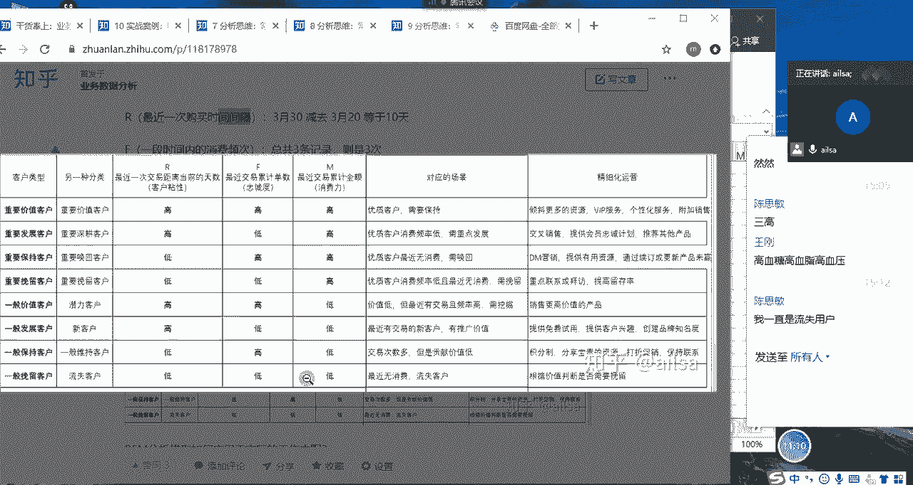

明白了吧，嗯啊这就是我们不同维度的一个客户精细化啊，分层，然后采取不同的一个营销策略，那我们该怎么啊给它进行一个划分层次呢，啊这边采用的方法有啊，有两个哈啊第一个就是评分法，第二个就是啊将用户啊啊。

就是就是就是根据均值进行一个判断哈。

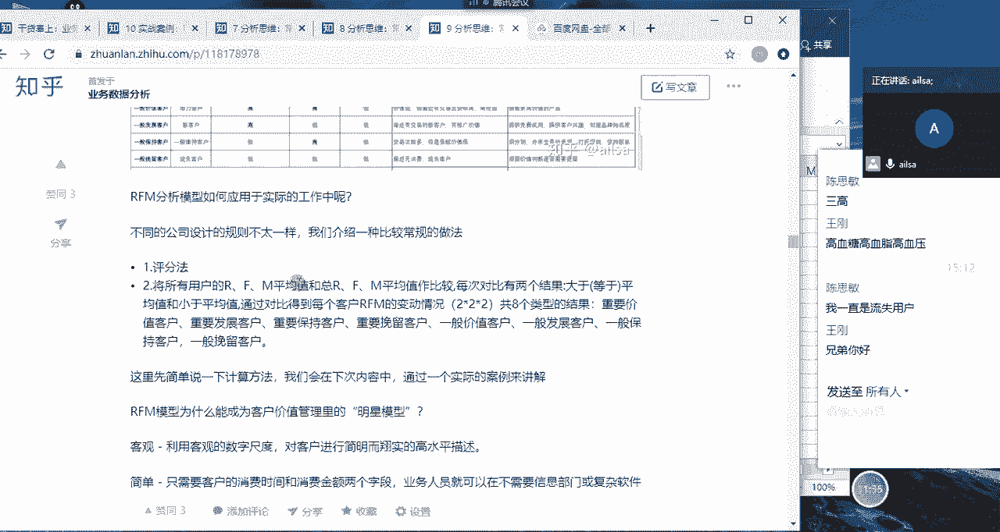

这个我需要简单举一个例子哈，我需要简单举一个例子啊。

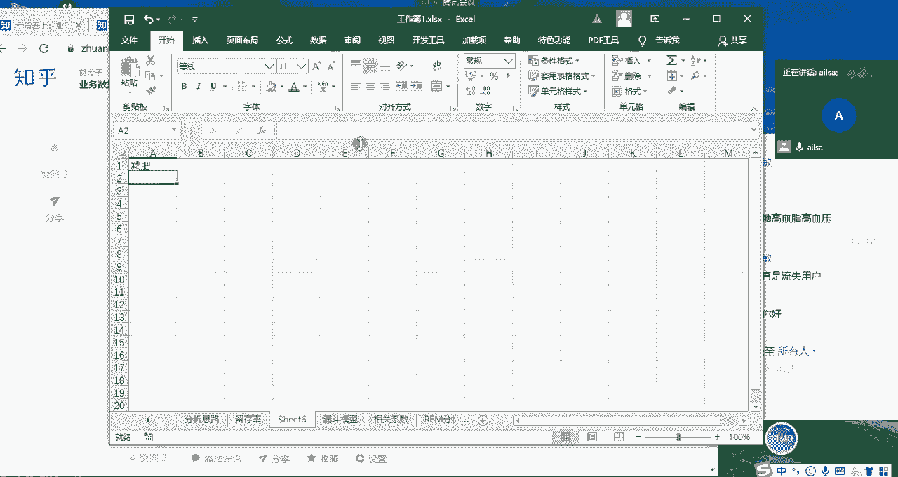

啊兄弟你好，你们俩干啥呢啊，你比如说啊这有这有三个用户哈，张三啊，假设哈，我给他直接写了哈，我们有一个RFM，R f，F m，然后呢，他这个张三的一个最近的一个时间间隔是额，假设哈是十天啊。

然后消费频率是三次，然后消费金额呢是300，哎假设张三是这样的，然后李四李四呢最近一次时间间隔呢是啊18，然后呃他的消费的频率呢是五，然后他的金额呢啊金额是600啊，OK那是啊，再有个王五哈，王五的话。

他的最近一次的啊时间间隔是七啊，然后消费的频率呢是十啊，然后他的金额呢假设是200，OK哈那我们根据这个例子跟大家讲一下，我们该怎么去计算唉，我们的整个的RFM分析模型哈。

就是说我现在要把张三分到哪个层次上去，李四在哪个层次上，然后王五在哪个层次上啊，那首先呢我们的第一种方法叫评分法平分啊，这种就有一定的主观性哈，什么意思呢，你比如说现在这个的一个消费啊。

时间间隔是从呃7~18不等，那我们就把它定义为啊0~10哈，零到啊，0~5吧，0~5啊，我们定义为因为这个0~5之间，它相当于就是频率比较高，我们可以定义为五分啊，就是价值比较大嘛。

然后是5~10哎我们定义为四分啊，根儿刷一下哎呀我们定义为四分哈，它这是文本类型嗯，是5~10啊，我们定义为是四分，然后10~15嗯，我们定义为是三分啊，哎呀什么情况，它识别为它识别为日期了哦。

是十杠15啊，对应的是三分啊，然后十五十五杠20对应的是两分啊，假设哈假设我们是这么来定定义分的，那我们就要去做判断，这个张三在这里面得了多少分，张三是在十，那他又得了三分对吧，然后啊然后李四是18。

然后他又得了啊，他又得了两分啊，嗯然后王五是七，他又得了四分啊，这样的话我们每一个啊分值给他计算出来，然后我们再按F哈，F这边的一个评分啊，假设还是跟这个一样哈，我们假设跟这个一样啊，就是0~55分啊。

5~10是四分，那这个时候他这个是三，他得到的就是五分，然后五他得到的也是五分，然后啊然后这个是十啊，他得到的是四分啊，这样的一个评分，然后我们再看金额啊，金额的话。

我们就嗯我们就给它乘以100就可以了，然后比如说0~500是五分，那这边就是五分，然后这也是五分，然后这个是四分啊，我们打完分之后嗯，打完分之后，我们可以对它进行一个啊计算或者加和，然后按照不同的分值。

然后再进行一个分层就可以了啊，我们在后面真正啊做到项目的时候会给大家讲，唉我该怎么使用这个RFM分析模型，这是其中一个方法，然后我再讲第二个方法，第二个方法就比较简单了。

第二个方法是按均值法哈啊均值法什么意思呢，我先把它的均值算出来，AVERAGE啊，不在吗，咱们人又少了吗，我把它均值算出来之后啊，我跟大家说均值算出来之后，然后如果说这个值小于均值我就记为零啊。

这个均值小于均值我就记为零，你看他是嗯，因为它这个是呃频率哈，它这个频就时间间隔越小越好，所以说这个是比它小的，我们就记为一一啊，嗯然后18是比他大，我们就记为零啊，然后这个七比他小，我们就记为一。

还没有来吗，丁哥啊，然后这个以上这是六啊，六这是频率啊，三次啊，比六次要更少一些，所以就定义为零，然后五也是零，然后十是一啊，然后我们的金额是300，66是平均，那那300的话就是零啊。

然后600就是啊一啊，200就是零，然后我们根据这不同的100001和110，然后去在这里面做判断啊，什么判断呢，我的表呢啊啊这里啊去做判断。

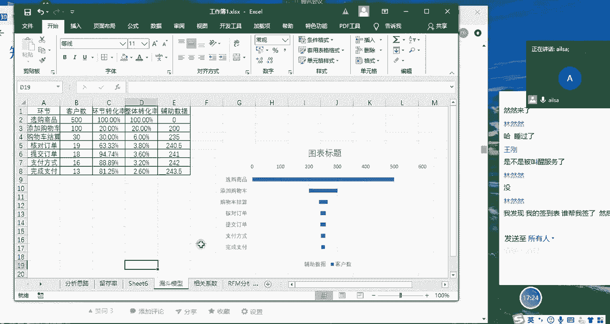

就这里面的高啊，我们就定义为是1D的话，就定义为是零，然后再进行一个逐个的判断。

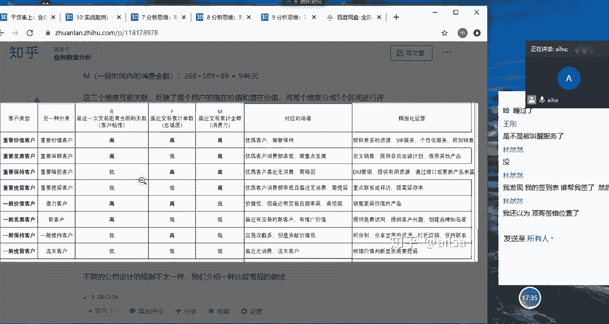

你比如说我们可以啊拿这个实际的例子，这个是100的话。

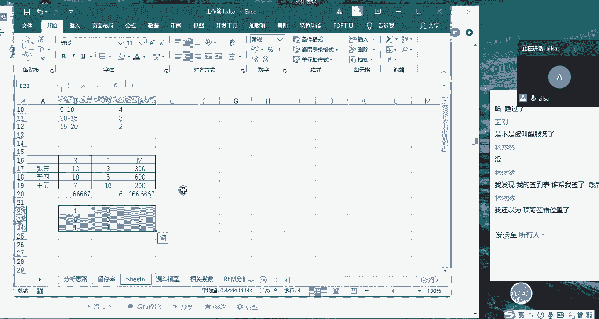

那它就是100，那它就是我们的一般发展客户啊，一般发展后高低低嘛，对不对，然后再往下来走，001啊，001就是我们的重要挽留客户。

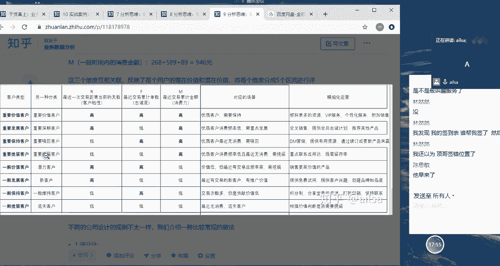

也叫重要啊，重要挽留客户啊，就这一个啊水平的，然后再往下走是110。

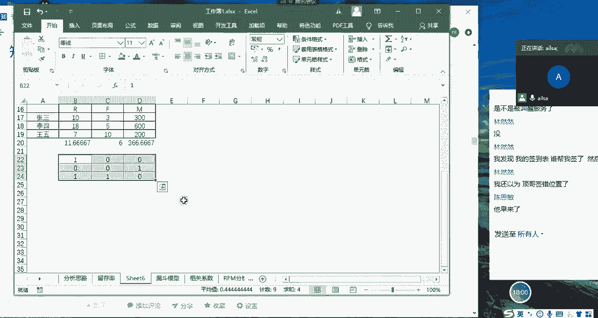

那这个的话就是我们的啊，110就是我们的潜力客户啊。

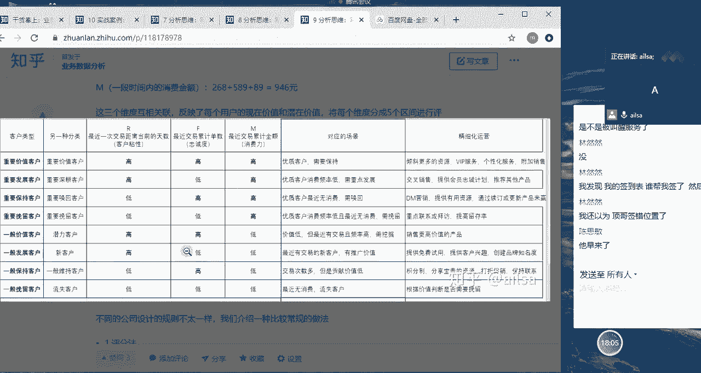

这样子哈啊根据这个标准我们就可以计算，那在这里我只是给你给大家简单进行一个呃，介绍，我们在后面项目当中会专门有实际的数据，来计算我们的RFM分析模型，到时候你们再根据那个去实际的操作，也是可以的。

好吧嗯，大家对于2FM分析模型有听明白吗，同志们听明白给我扣个一，你们在聊啥，确定听明白了哈，嗯它这个原理是比较简单的啊，原理是比较简单的，然后具体当中去计算的话，我们只要有数据。

你们就可以简单的去计算出来啊，这个可能呃也不是一个呃很就是很难的一个点，但是它的意义非常大哈，它也是一个经常常用的一个分析模型，通过这个模型，你能够啊清晰地了解到谁是你最好的客户。

你哪些客户正在流失的边缘，然后谁谁有可能转化为你更有利可图的客户，然后谁是你不需要关注的无价值的客户啊，还有就是哪些客户你需要保留，谁是你的忠实的客户啊，那些客户可能啊。

对当前的一个营销动作做出回应等等，这些，你就可以明确的知道你客户目前处于哪些状态，然后哪些客户是什么样的水平，然后你针对不同的用户，应该采取不同的营销手段，以达到你最呃呃就是你最以最小的成本。

然后获取最大的收益这样的一个目的，OK哈OK那我们2FM2FM说完了哈。

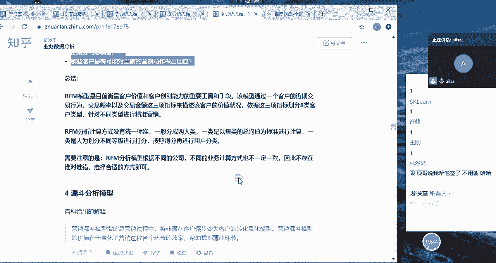