# 强推！这可能是B站最全的【Python金融量化+业务数据分析】系列课程了，保姆级教程，手把手教你学 - P68：10 漏斗分析模型 - python数字游侠 - BV1FFDDYCE2g

我们接下来讲漏斗分析模型，其实漏斗分析模型在我们做一些转化的过程当，中用的比较多哈，那我们看一下啊。

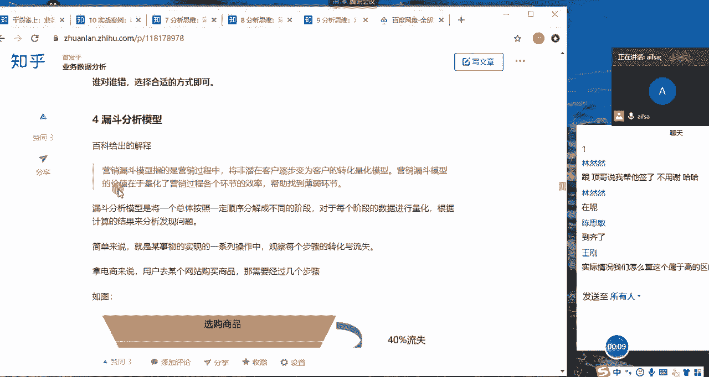

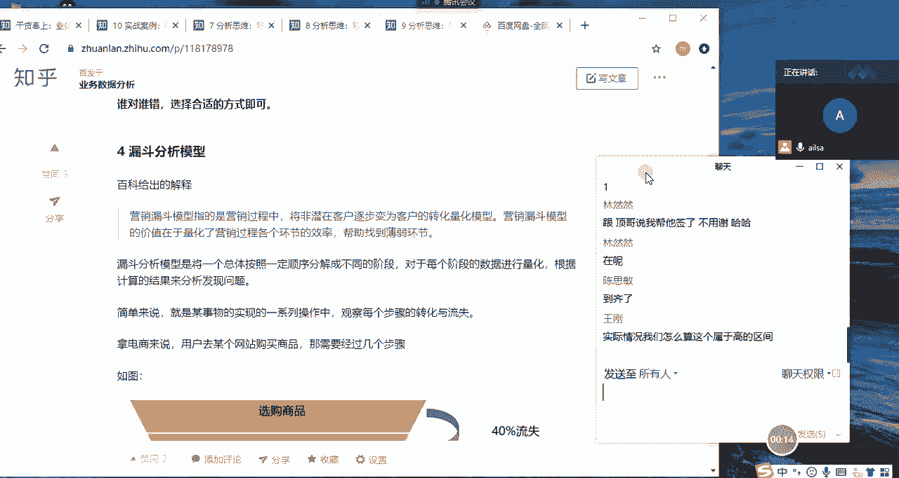

我到后面去给大家讲吧，啊今天因为数据没有，所以说没办法给你做一个现场演示，我们后面呃写SQL项目的时候，是有一个专门啊针对我们的整个的用户分层，然后做的一个模型啊，那个时候再讲也行哈。

啊大家今天主要理解理论啊，而且好像我听说啊，小波老师后面讲的一个基于Python的啊，分析当中也有一个用到RFM分析模型的啊，啊到时候也可以使用，大家先把理论呃听明白了啊，然后漏斗分析模型。

它的百百度百科给的解释是营销，漏斗模型指的是营销过程当中，将非潜在的客户逐步啊逐步转变为客，逐步转化为客户的一个转化，量化模型其实就是它呃这个漏斗模型啊。

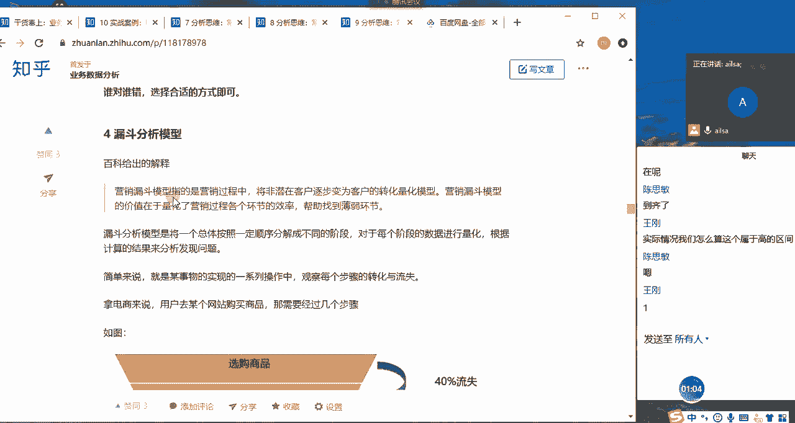

我们简单理解来说，从用户的路径上来去分析的话。

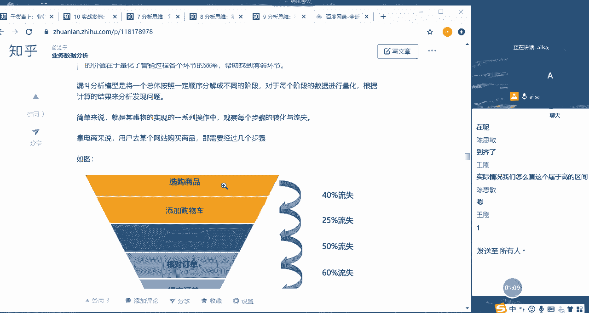

就是一个客户过来了之后，他可能是先浏览网站对吧，浏览网站是一部分用户，然后又其中又其中一部分用户，他选择了选购商品，那又有其中一部分用户，他就添加了购物车，然后啊就是还有一啊就是说往下走呃。

只有其中一部分用户进行结算，进行核对，订单提交订单，支付支付。

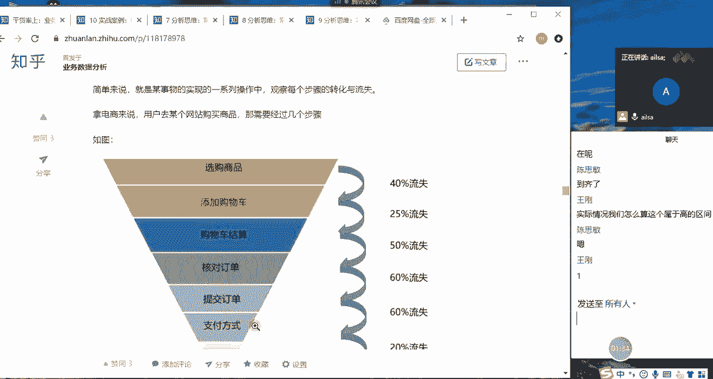

然后最后O那在整个过程当中，他这个客户的数量是逐渐减少的，对吧啊，是逐渐减少的，因为啊浏览客户，比如说是100个客户过来浏览，最终下单的有可能就也就那么5~10个人，那在这个过程当中。

它经过一层一层每个环节，然后像小漏斗一样，然后把最终啊精华啊留到了最后，那这个精华其实就是我们所要想要的效果，那在这个漏斗模型当中，我们最终想要的一个结果是什么呢，就是希望来的客户呃。

就是到留在最后的越来越多啊，我们不希望它流失啊，我们希望他走到最后付钱，然后给公司给网站，给产品带来价值啊，这样的一个过程对不对，那我们如果说我们达不到这样的预期，比如说最后的客户确实是特别少。

那我们就要一层一层一层地去分析。

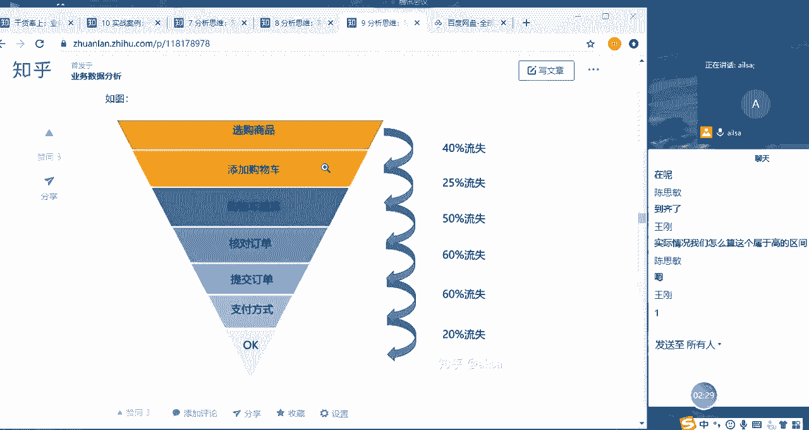

到底是哪个环节出现了问题啊，比如说我们选购商品到添加购物车，那这个环节的一个流失率就很高的时候，或转化率很低，那这个时候我们就要去分析在这个环节当中，到底是什么问题产生的啊。

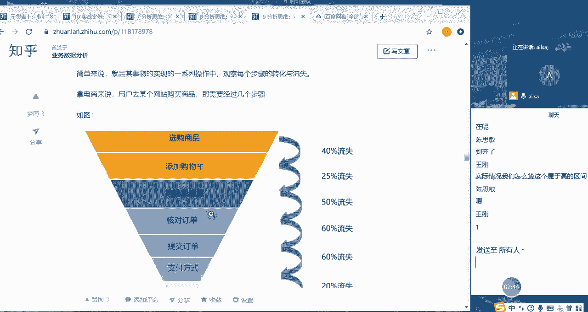

这样的一个过程，嗯啊这就是我们的漏斗模型啊，啊那我们的漏斗模型在excel当中怎么去绘制啊。

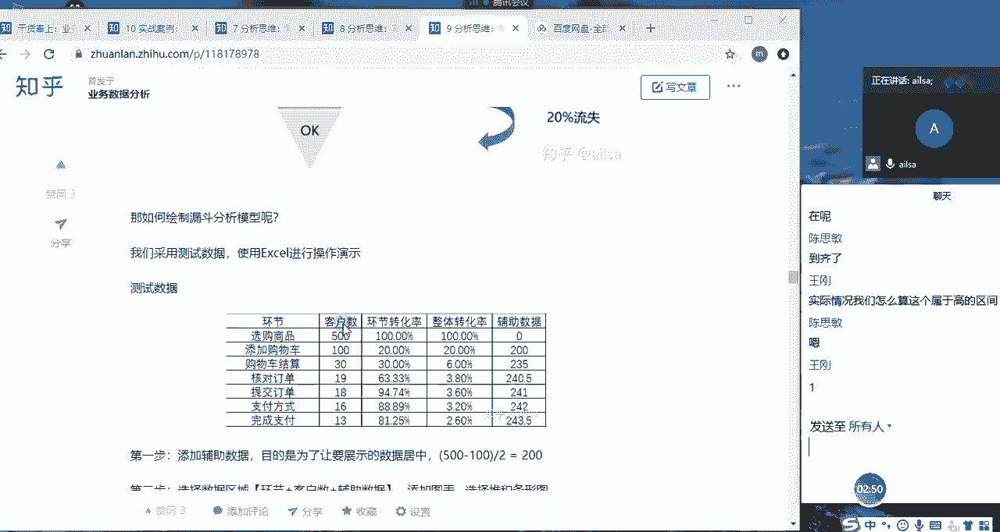

这个因为我们我的版本哈，我的2016版，它没有专门的进行漏斗模型的一个制作哈，我看有高级版本是有的啊，但是我的没有。

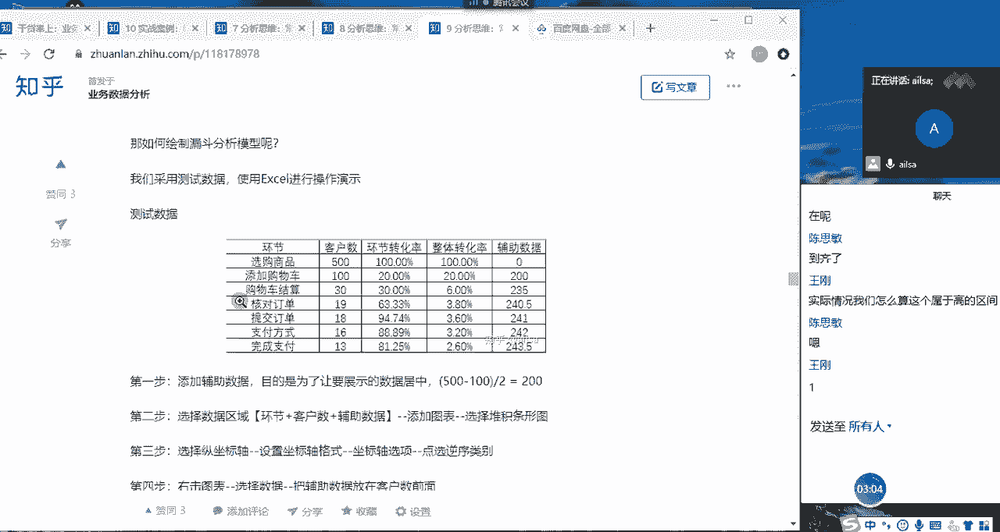

所以说我这边需要进行一个辅助哈，进行一个辅助，大家看一下我的漏斗模型，唉你看做出来其实也挺像漏斗的，对不对，那它这个呢是啊通过环节啊，环节转化率就是每一个环节它的一个转化率，还有一个整体转化率。

就是说整体转化率指的是，相对于第一第一个环节而言，后面都是基于它进行了一个呃呃分母的啊，相除哈，就这个是它们的分子啊，这个是分母啊，这个是我作为我们的分母进行相除，那环节转化率就是说啊上一层除以啊。

下一层哈，这一层除以这一层，呵呵这一层除以这一层这样的一个效果，这是缓解转化率，那这个整体转化率就指的是以第一层为基数，然后每一层跟它进行一个相除啊，这样的一个整体转化率的一个计算啊。

那大家回去可以看一下，我这个辅助到底是怎么来实现的哈，我给大家演示一下啊，首先选中我们的啊环节和客户数，然后还有我们的辅助数据哈，这个就纯粹是为了美观哈，插入我们的推荐的图表。

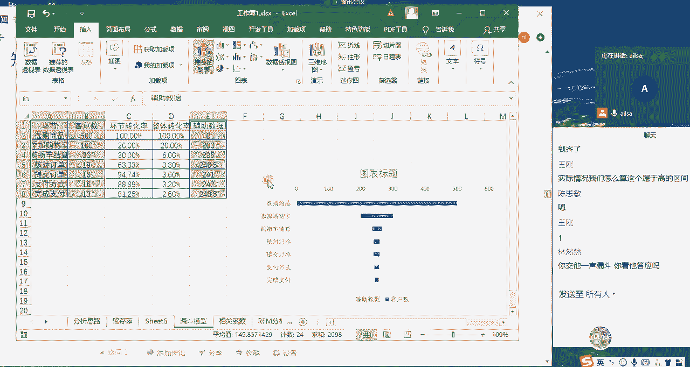

然后选择选择我们的折线图啊。

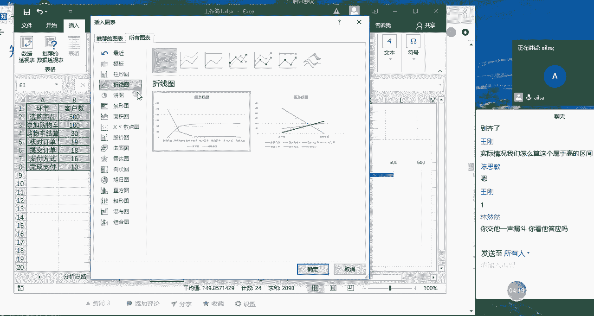

不对，选择我们的条形图，然后选择第二个堆积条条形图，点击确定，哎，这个格式其实不是我们所想要的，所以我们要对它进行一个更改啊，怎么更改呢，是在我们要设置我们的数据区域的格式嗯，我们选择我们的坐标轴。

然后把它在这个坐标轴的选项下面，有一个逆序类别啊，逆序类别点击确定A它回到这边来了，是不是有点像了，然后这个时候还需要再调整调整什么呢。

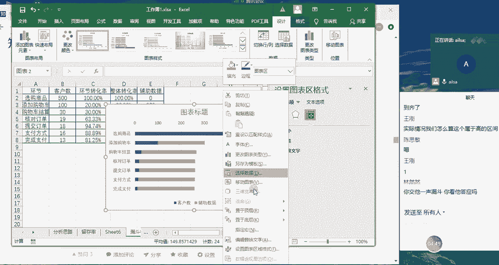

调整它的顺序，我们把辅助数据调到上面去。

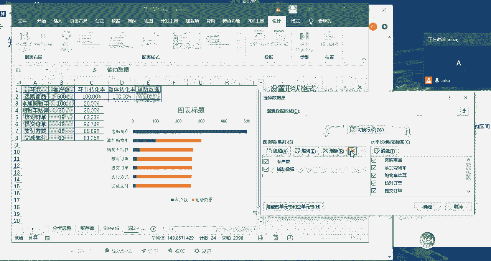

唉大家看一下，我只要把这个颜色啊给它填充为无，哎是不是就实现我所想想我所想要的效果了，对不对，这个完全是为了凑数哈，就是就是为了画漏斗而画漏斗，因为我这个版本里没有漏斗模型，这样的一个图表。

但是这样去做的话，我们也能看得出来他就是个漏斗哈，对吧啊，大家对于这个听懂了没有听懂，给我扣个一，我不叫他漏斗，呵呵为什么要叫他一声。

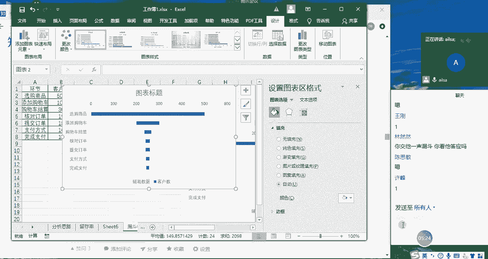

OK我们再往下走哈，嗯那这就是我们呃在做用就是流程类的啊。

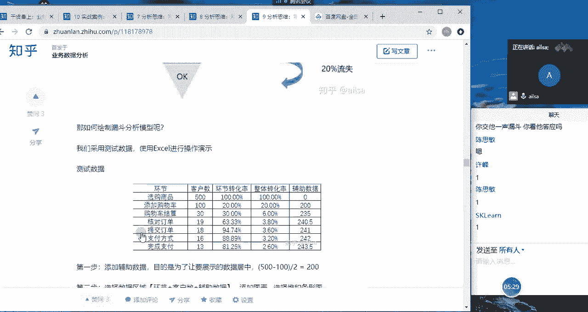

流程类的一些分析的时候会用到这个漏斗模型，我们会分析每一个环节，每一个环节，那我们在后面那个啊用circle做数据分析，那个项目当中啊，就是啊会用到我们的整个的一个转化率啊，这样的一个漏斗分析的方法啊。

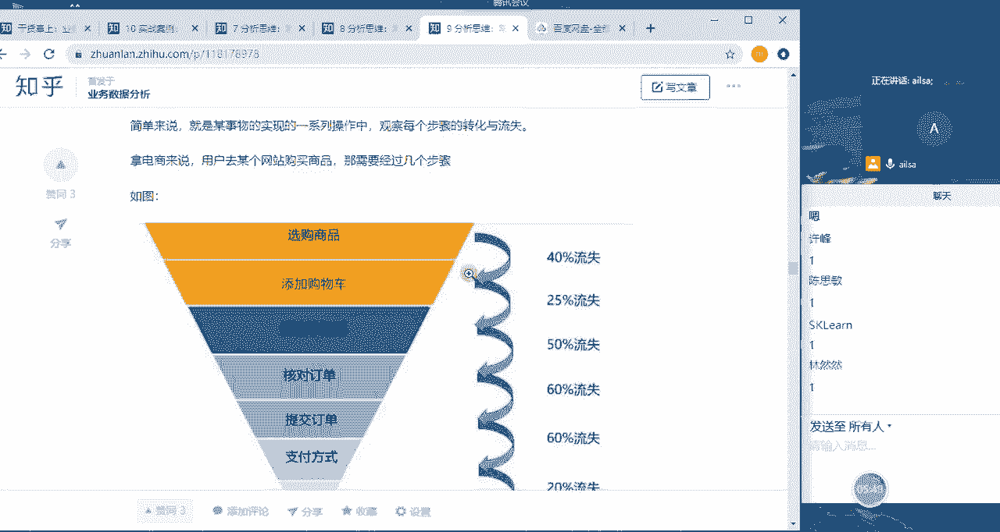

不是今天的那个那个大项目哈，是下周的那个啊大项目。

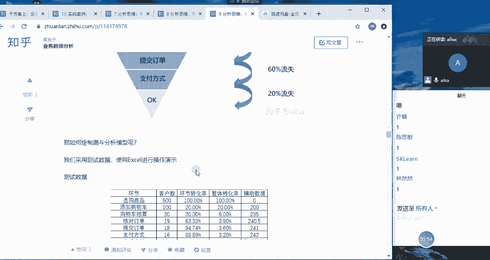

或者是说我也可以把那个啊大家也可以看一下，我那个呃的一个分析，大家如果周末有时间也可以做一做啊。

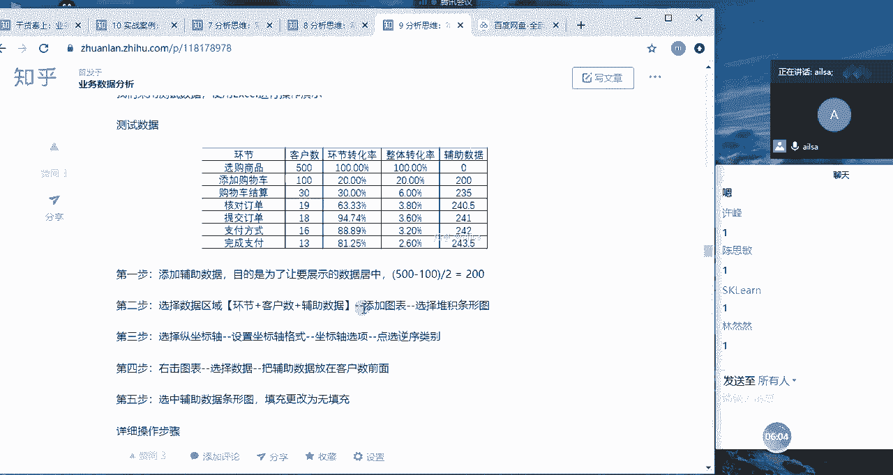

OK那我们接着往下说说哈，这个已经说完了啊，那漏斗分析模型是将一个总体，按照一定顺序分解成不同的阶段，对于每个阶段的数据进行一个量化，根据计算的结果来发现问题，常用于电商分析用户购物行为转化率的分析啊。

啊呃常用于电商分析用户购物行为，转化率的分析，不仅是电商很多啊，就是那种啊就是那种网站消费类的那种啊，都会用到我们的漏斗分析，主要是用来分析转化率的啊，每一个环节的转化率啊。

这就是漏斗分析的一个啊基础的原理哈，那接下来啊接下来我就以app为例啊，来讲一讲对于公司运营过程当中啊，客户是怎么来进行漏漏分，漏斗分析的这个层面就有点高了哈，这个在我们的增长黑客里面。

有一个叫AA222分析模型的。

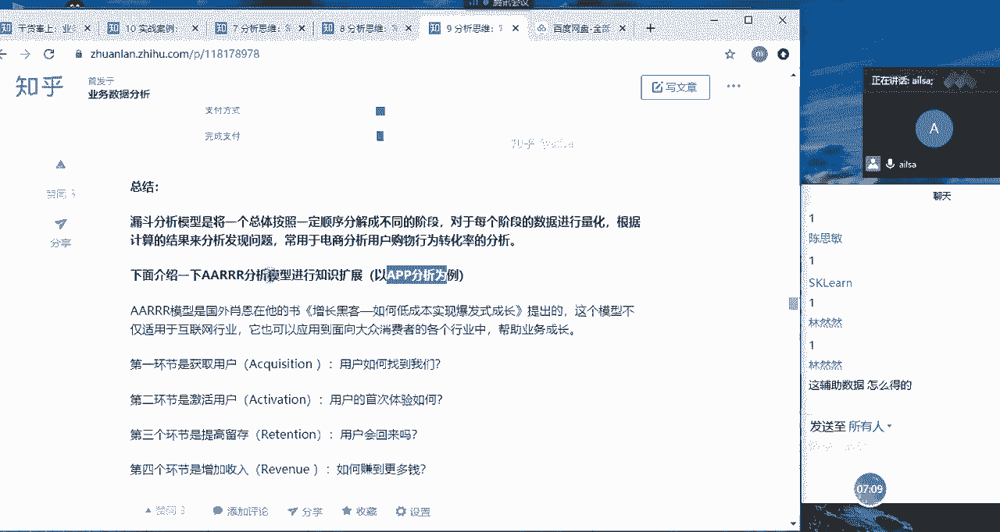

这样的一个啊知识点，它获取用户到最终啊，最终啊成为我们的忠诚用户这样的一个过程啊，然后对用户进行进行了一个啊生命周期，还有各个维度的进行一个分析哈，来我们看一下它是怎么来实现的啊，这个就纯粹是理论哈。

大家可以呃以自己熟悉的一款app，然后作为想象啊啊就是说他们是怎么来的哈。

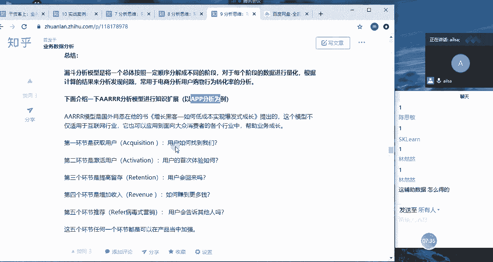

比如说我们想一下，我们假设我们的开发人员做了一款app，而是商业性的app，什么是商业性的呢，就是我们做完了之后，希望是用它来盈利的，对不对，那希望用它来盈利，我们第一个部分肯定是要获取客户。

也就是说啊，那我们没有客户，怎么从他们身上获取利润呢，所以说第一部分肯定是获取客户，那我们怎么让客户找到我们，这就是我们要做的第一个步骤，第一第二个步骤，这些客户找到我们了之后，我们如何去激活这些用户。

你比如说有100个用户找到了我们，或者是下载了我们的app，那我们怎么能够让这个用户啊，呃就让让这个用户下载完注登录，注册完之后就留在我们的app上，然后使用我们的产品啊。

啊然后它中间有一个环节叫激活用户，也就是用户首次的一个体验如何，如果体验特别好的话，他就会留下来，如果如果不好，他也就放弃了，对不对，那第三个环节就是说用户都留下来了，比如说有100个用户找到了我们。

然后有50个用户觉得体验还不错，留下来了，那那你比如说在这个50个当中，我们要继续啊，继续让它留在我们的app里，让他一直用我们的产品，我们如何提高我们的留存啊，也就是说用户如何喜欢上我们的产品。

一直使用它，那第四个环节，如果说用户都留下来了，那我们是不是要哎我们是不是要啊，要把自己的一个最终的一个目的，或者是最终的一个啊想法给发挥出来了，就是我们最终的目的就是为了增加收入。

那我们如何从这些客户啊，我们的一个忠诚的客户身上赚到更多的钱对吧，那我们赚钱的同时，我们还要想这部分客户，肯定它嗯这个量级肯定是有限的，那我们如何无限制的去增加我们的客户呢。

也就是说我们通过这一部分留存的客户，让他给我们去传播，哎你比如说这个app特别好用，就比如我今天的一个行为，我说keep特别好用，那keep没有给我一分钱，我就告诉你们它好用。

那这个时候对于整个app而言，它不需要花一分钱的成本，他就可以获取到你们这些忠实的用户，或者是很很有就是需求的这样的一个用户，对于整个LPP而言，那它的成本就在逐渐的缩小，并且你告诉了其他人。

其他人又找到了对吧，又找到了这个app，然后又进行了这些循环，然后到时候他又可以从这些用户身上去，赚取更多的钱，然后呢再进行一个循环，这就是一个啊循环的过程啊，这就是啊我们的a a arr分析模型。

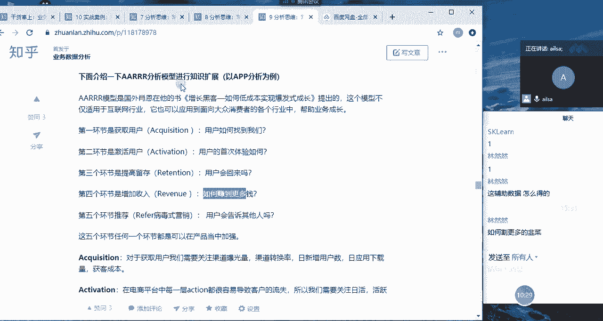

它分五个环节，那我们看每一个环节啊，哈割韭菜是吧，我们看每一个环节它都是怎么来啊。

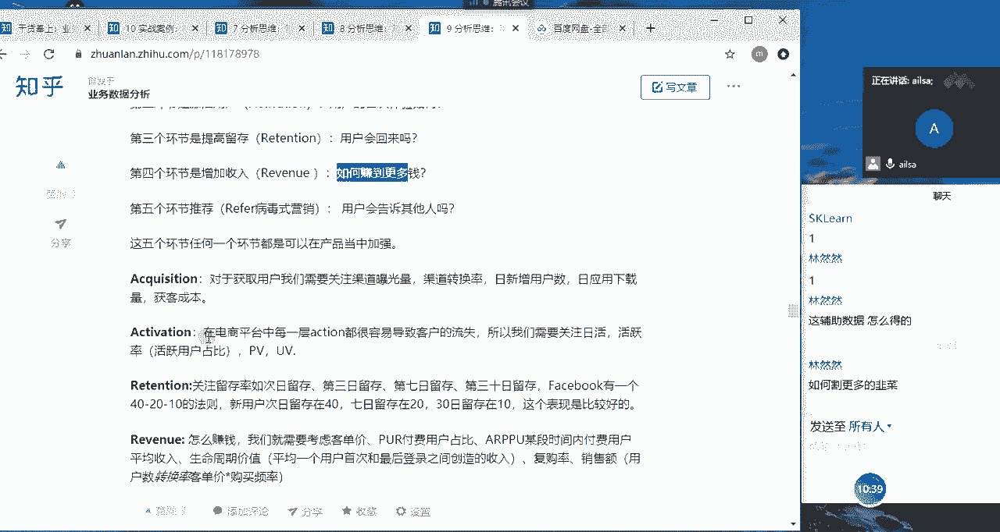

怎么来呃，呃体现的哈。

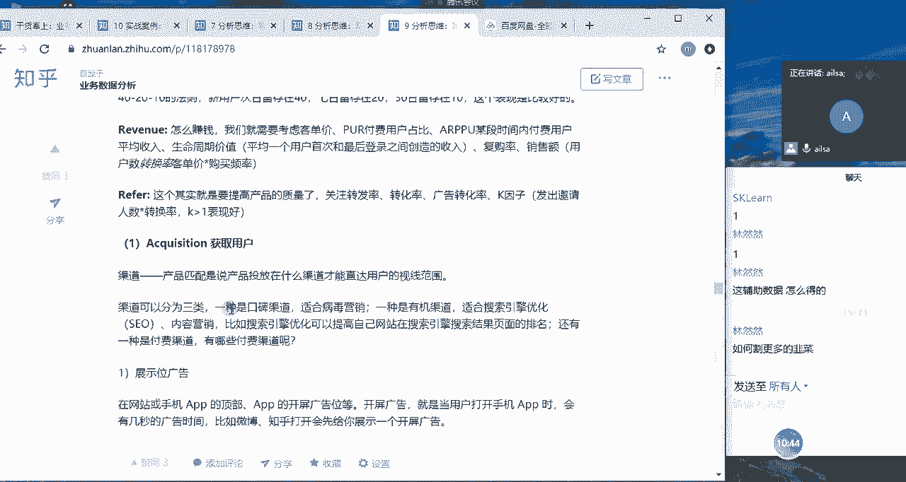

我们先看第一个环节叫获取用户，那我们获取用户啊。

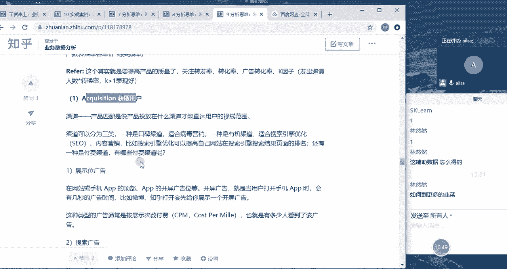

肯定是通过广告嘛，对不对啊，有展示广告位啊，展示广告位就是我们看到的app里面啊，比如说我们打开知乎肯定会有广告，对不对，我们打开网站也会有广告，就是广告位哈，那广告位呢这种也是有很贵的哈，真的很贵啊。

它是按展示次数去收费。

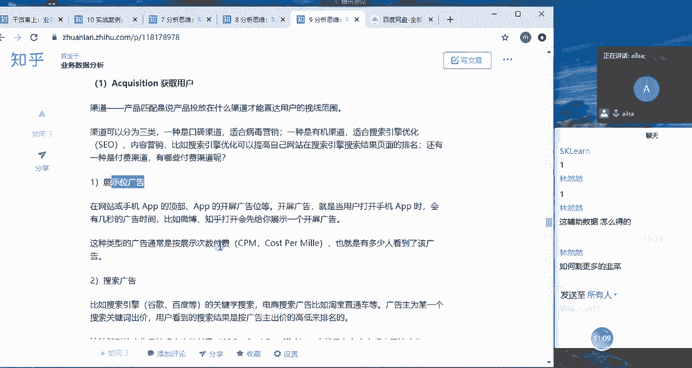

有多少人看了该广告啊，第二个啊，这就是我们的一个广告哈，第二个是搜索广告，也就是我们的百度，谷歌这种这种是啊，这种叫什么不不公开的排名也是很狠的哈，啊这种这种的一个公司的成本也会很高啊。

这个真的百度这个竞价排名真的太厉害了啊，啊那这种类型的广告可以按点击次数哈，因为你比如说呃呃就是我们百度了之后，然后搜索了一家啊广告就是带这种就是就退，就是这个搜索广告的。

那你点击一次你就要付制这一次的钱，明白了吧，大概点一次他们的价格什么5~8块十块，你当时买了多少钱，就是多少钱啊，就是这种。

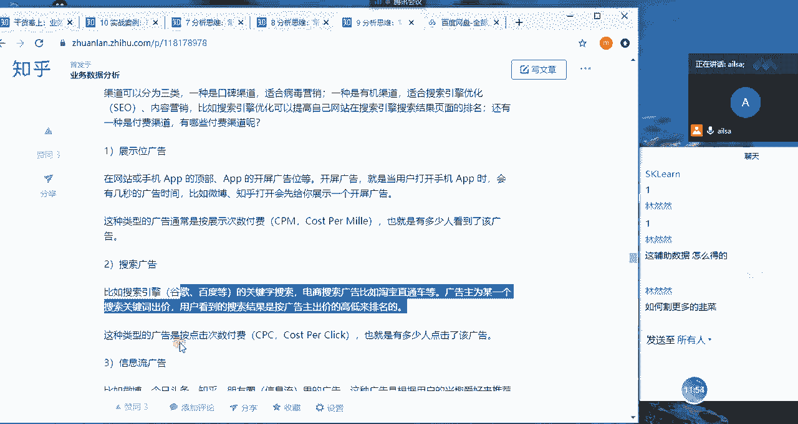

然后还有一个信息流的广告，就比如说我们的知乎啊，朋友圈啊这种这种广告啊，然后就叫信息流广告，它是按也是按点击次数啊，它有不同的一个收费标准，按点击次数啊，或者是按投放的实际效果付费，其实这种的话呃。

实际效果付费就指的是嗯你投放了这个广告，你最终带来多少的一个收益啊，这样的一个啊付费的一个形式哈。

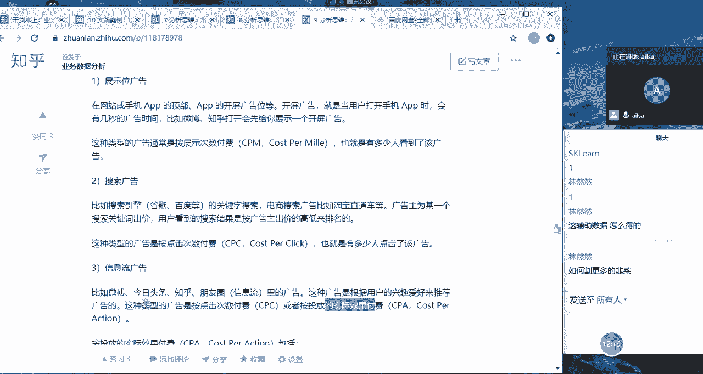

大家对于这个啊简单了解就可以了，因为我们也不是做运营的对吧。

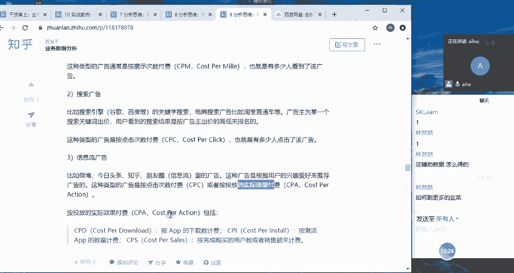

我们也不做运营，我们也不需要知道这个东西，唉你看接下来我就说到keep这个案例了哈。

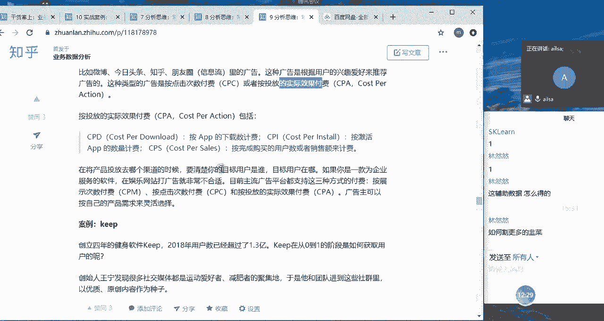

嗯keep这个案例在前期获得客户啊，获客的一个过程是这样的，他不是一上来就发各种广告啊，就是说哎我这keep多多么多么好用，怎么怎么着，他是先啊他是先通过啊。

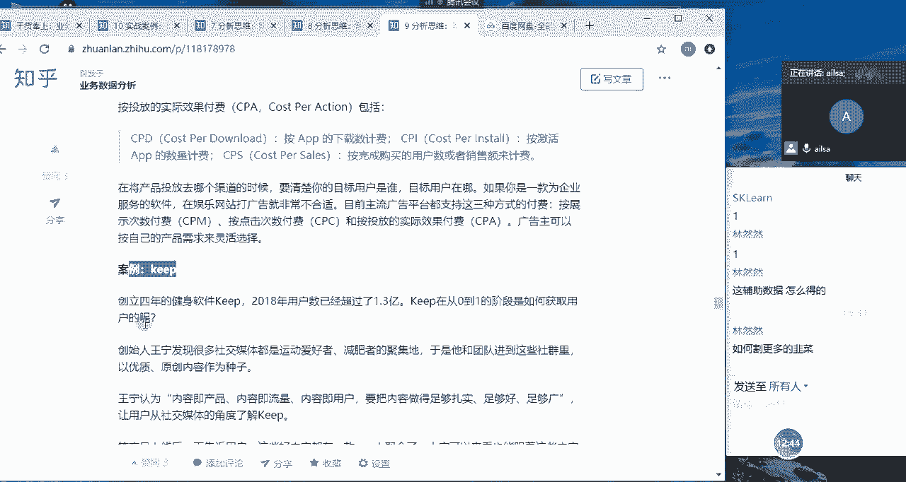

通过把一些有这样运动，或者是啊减肥这些需求的一些爱好者，他把他们聚集到呃社群里，或者是聚集到嗯呃一个一个地方，比如说我们的一个啊有什么圈子啊，或者等等这些啊啊交流的这些地方。

然后发一些比较好的优质的内容啊给他们，然后这个时候他们就会有收获，等到我们的客户群体足够大的时候。

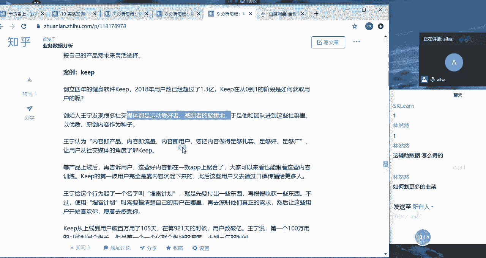

他们就开发开发了这样一款app，然后给我们的目标群体直接啊一推广的时候，他们都觉得特别好用，好像所有的啊好的产品，好优质的内容都啊都在这里了，所以说那你不用这个产品用哪个呢。

就是keep他们当时的一个啊推广方式。

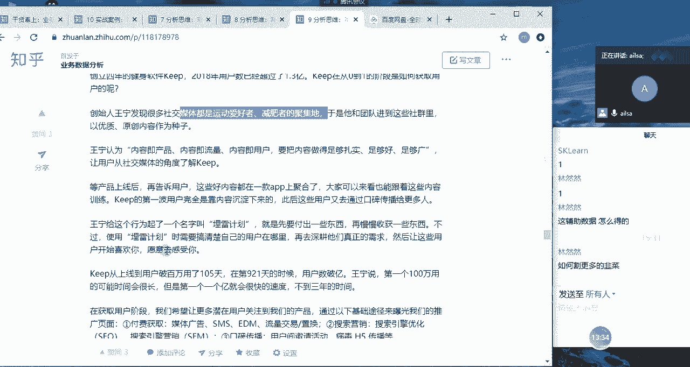

当他们赚到了钱之后，他们再会考虑通过什么推广啊，其他的一个渠道再去对，再去啊，再去做啊，另外的一些东西啊，肯定你你在进行，其实你在进行推广的时候，如果说你的目标群体比较明确的时候。

它带来的一个转化率还是很高的，你比如说嗯你比如说假设哈，假设嗯，嗯假设呃，他们要卖一个关于婴儿的一些用品的时候，如果他广撒网啊，就是啊就是在百度搜索啊等等这些去呃，去做这些广告的时候。

真正有需求的人其实很少，但是如果说他能够在什么啊开的一个啊交流群，或者是什么婴儿交流群，或者是说宝妈妈交流群，然后这样的内部，然后去发送这样的一些啊活动或者广告的时候，那他们的整个的呃。

一个的目标群体就非常明确了，它的转化率会非常高，嗯那它的一个成本其实不高，但它带来的收获却很大。

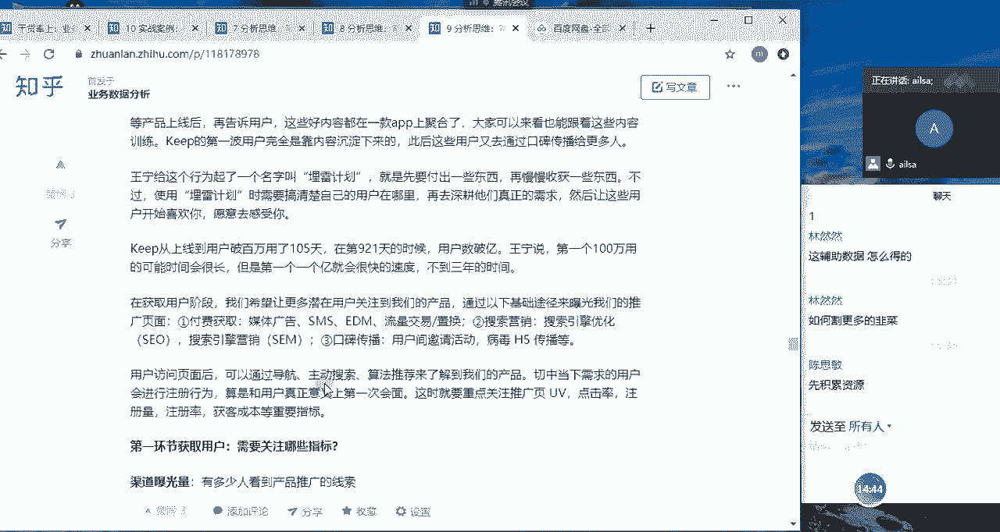

这对于企业来说是啊非常非常好的啊，所以说我们在第一个环节啊，第一个环节我们需要关注哪些指标呢，我们前面也都学过指标了哈，我们需要关注各个渠道的啊，你的曝光量，然后还有渠道的一个转化率。

还有我们的日新增用户数，还有我们的一个什么下载量，还有获客成本，看到没有。

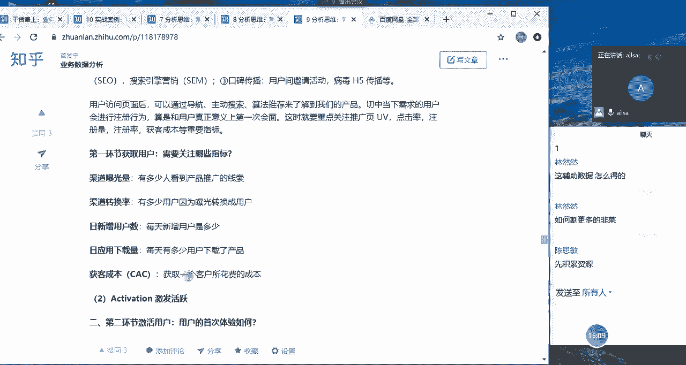

我们肯定是要关注获客成本的啊，啊这是第一个阶段，那对于第二个阶段而言，就是说你把这个客户，比如说你把这个客户获取到了之后，他下载了你的app，但是他觉得不好用，那其实你前期投入的成本已经没有了。

那如何让用户获得首次体验非常好呢。

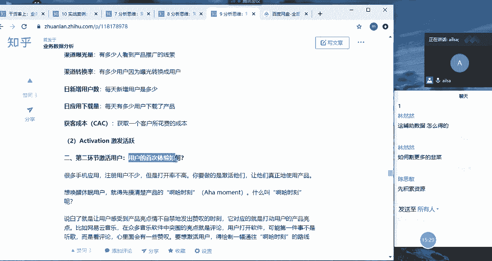

那就是你的产品的优质内容了，对不对，你的产品越好，那它而且是满足他的需求的，这样子他才能够啊去留下来，那我们怎么才能满足用户的一个需求呢，我们就要知道用户喜欢什么，你比如说keep。

那它它在你注册的时候虽然是有点繁琐的啊，就是说你要输入你呃，目前的一个啊健身的水平啊，你的一个目的，你的一个需求，比如说你到底是减脂还是健身，你到底是练哪个部位，他会啊，还有你的身高体重等等这些。

然后他获取到这一部分信息之后，然后他会给你做一些推广啊，或者是给你推荐一些你想看到的内容。

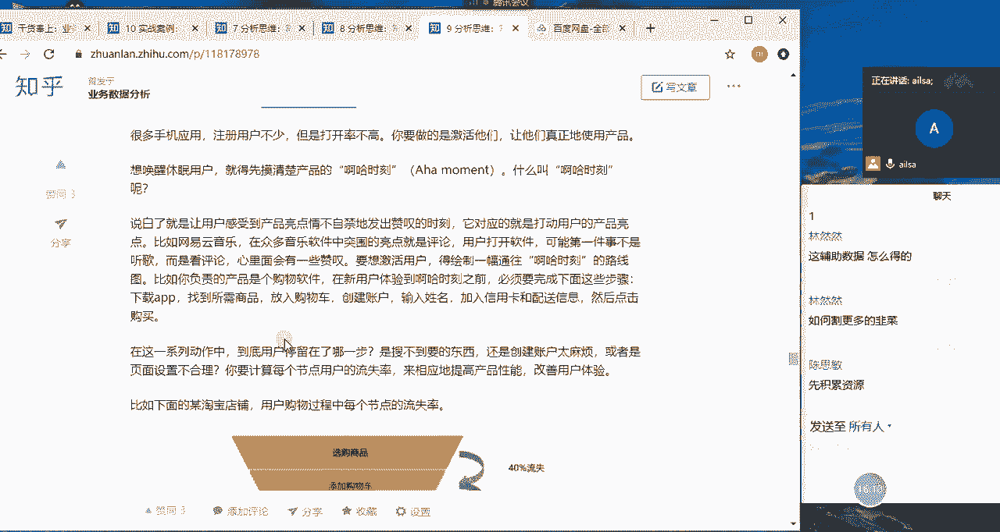

对不对啊，所以说这个第二个就是说如何去啊，就是激活用户，让用户第一次使用就能够爱上这个产品啊。

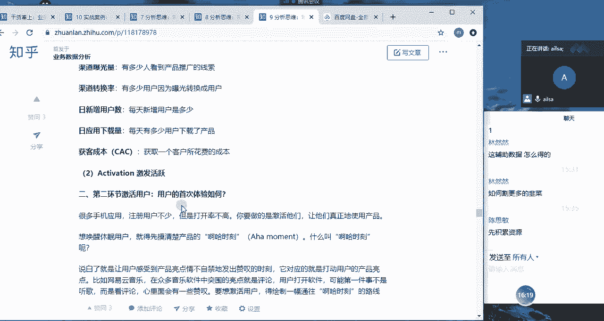

啊，这个时候，我们也可以通过各个环节的一个流失率。

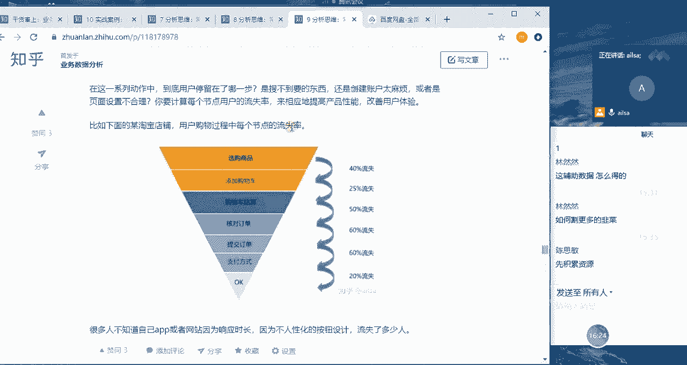

如果不好的话，我们可以通过各个环节的一个流失率，来去分析啊。

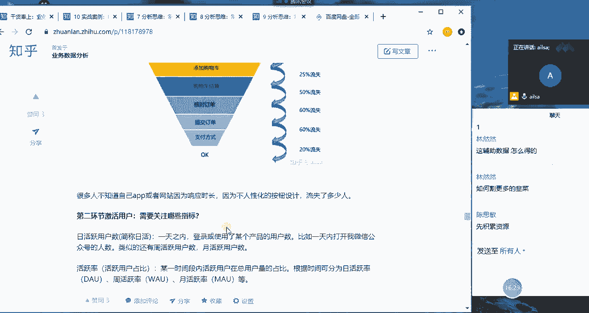

那第二个环节我们需要关注哪些指标呢，就是说这个新用户过来了之后，我们要看它的日活对吧，那日活比较好的话，那说明啊他对于产品还是比较认可的啊。

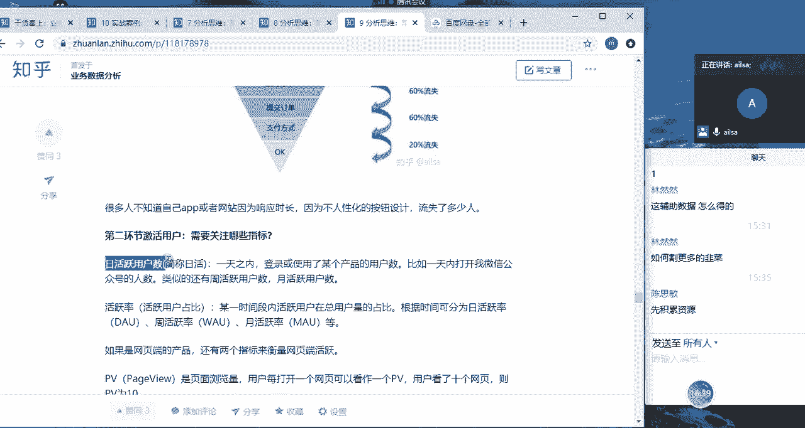

还有这个活跃率啊，以及我们的PVUV啊。

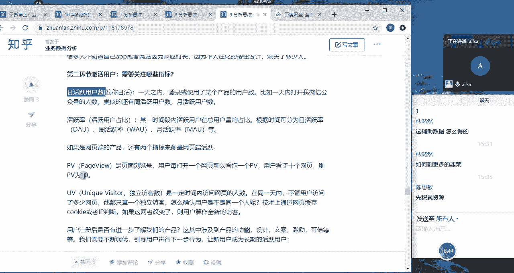

啊PVUV啊这样的一些指标啊，这些我们都讲过哈。

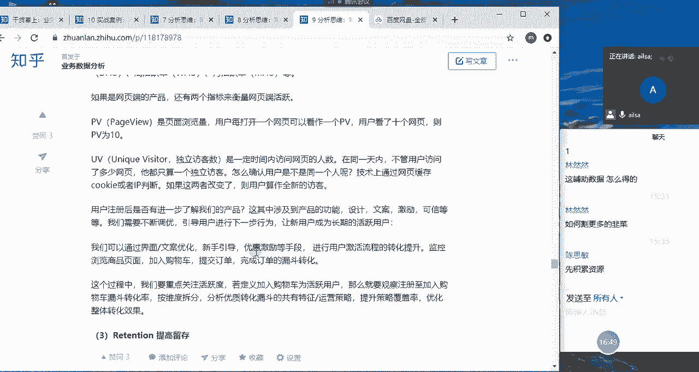

你比如说我们注册了一个网站，它如果点击量非常少的话。

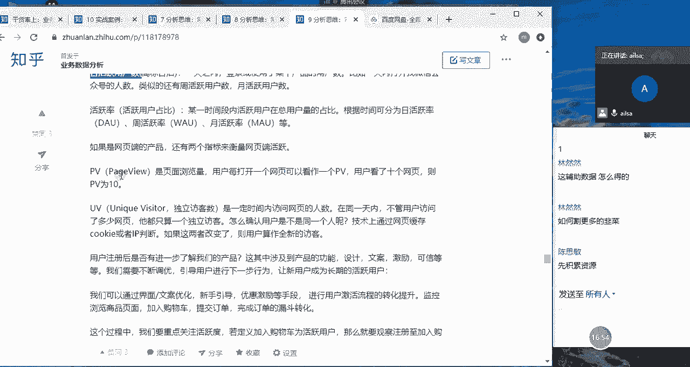

那说明他对于整个网站的一个认可度也不高啊，是这样嗯。

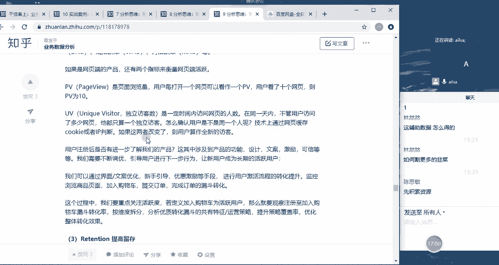

那我们看第三个，既然用户喜欢这个产品并且留下来了，而且还比较活跃。

那我们就要思考，如何进一步去提高用户的一个留存，让用户啊让用户变成我们的回头客，让用户养成一个习惯，就是说我只要买衣服，我就去淘宝，我只要买电器啊，买电子产品，我就去京东，我只要存钱，我就去支付宝。

然后怎样让用户养成这样的一个习惯，他只要这个习惯的养成，只要养成了，那你这个留存率就不用担心了啊。

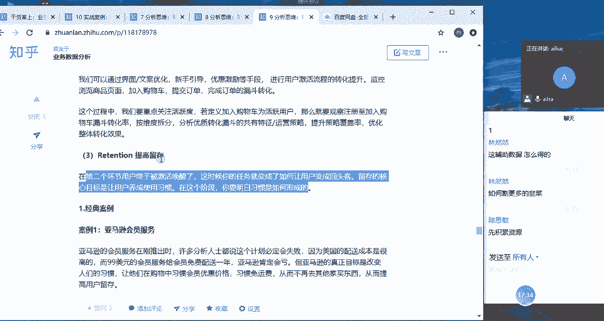

你比如说我们拿支付宝为例，他们有一个他们有一个种树对吧，嗯大家大家都用过没有，大家种过树没有，同志们听我巴拉巴拉这么多，大家种过树没有啊，没有种过树吗，啊啊建啊建浩中过吧，啊建号中国哈。

就是就是你比如说你平常的一些行走啊，啊对蚂蚁森林，你平常的一些行行走，然后你呃你买了东西，然后都会有那个能量嘛，然后你就去浇水，然后逐渐的怎么怎么怎么着，你还可以去偷别人的对吧，你还可以偷你好友的能量。

然后去给自己浇水，你还可以让别的好友去给你浇水，然后其实这个活动看起来好像没有多大的用处，但是它极大地提高了用户的一个留存率，怎么来说呢，因为啊比如说我有一段时间就特别就特别讨厌。

就是别人老偷我的能量啊，然后因为我一天啊走路也挺多的，然后有一段时间还买东西挺多的，然后我能量挺多的，但是我老忘啊，就比如说他应该是早上七点左右，那个时候我正在公交车上，我就老忘。

然后别人就老偷我的能量，我就很生气，然后我就定个闹钟，1~77点钟的时候啊，对一旦一到这个点的时候，我就把我的能量赶紧收了，然后我再去等着偷别人的能量，那这样的话。

其实我之前的话打开支付宝也就是买个东西，但是有了这个活动之后，我一天可能要打开好几次啊，那这个其实就是一个唉，就是你整个你打开网站好几次，相当于就是说你打开这个app好几次。

相当于就是你这个留存就很高了，因为啊我们也不一定每天都都消费，每天都用支付宝，对不对啊，那你啊采用这种方式的话，它就会极大的提高它的留存率了啊，这就是它采用的一种方式，看似没有太大的一个啊能力啊。

看是没有它的一个功能，但是他在这方面做的还是很好的，而且还有一个好好的好处，就是他还可以互相加好友，然后你加了他好友，你才能投他的能量啊，然后还可能够增强好友之间的一个关系嗯。

因为我们都知道之前的时候支付宝他们是啊，他们是有意往啊社交这样的一个嗯能呃，功能上发展的啊，但是他干不过微信呐，对不对，然后后来他就啊对还是还是在存钱上发展，发展还是不错的，但是他也希望能够啊。

就是在支付宝上有更多的好友，然后进行一些啊交流什么什么的啊。

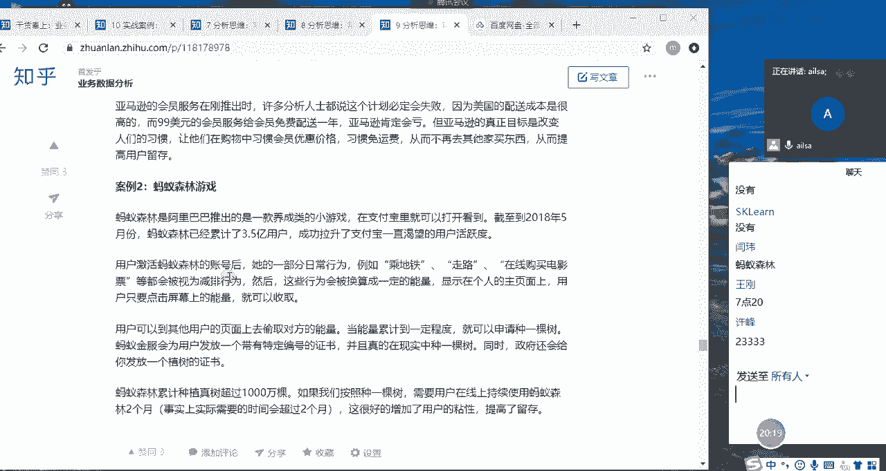

啊这就是我们的第二个环节啊。

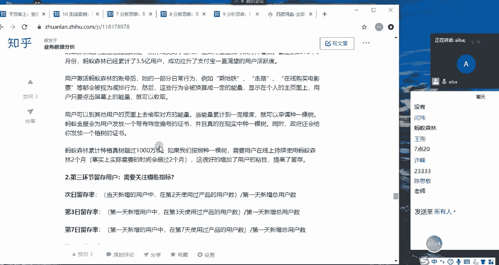

第三个环节哈，第三个环节留存哈，那对于留提高用户留存，我们主要关注的就是留存率了，也就是次日留存，第3日留存。

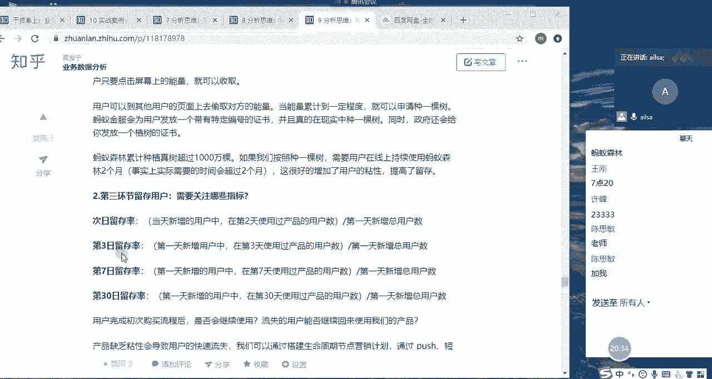

第7日留存和第三是留存率啊，这个留存率其实非常重要，你好不容易花了钱让用户过来了，然后呢用户又走了，对于你来说真的是啊竹篮打水一场空啊。

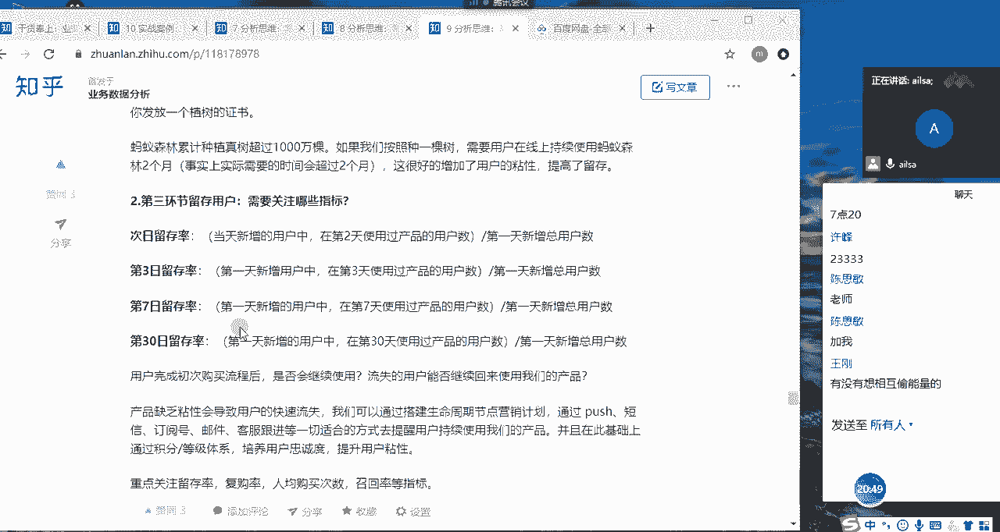

所以说一定要留住它哈，那我们还需要关注的什么留存率，如果是电商的话，然后就是复购率。

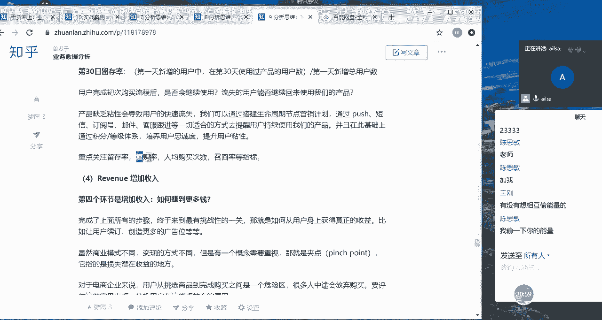

还有那个购买次数，召回率等这些啊，那如果说我们的用户达到一定的水平。

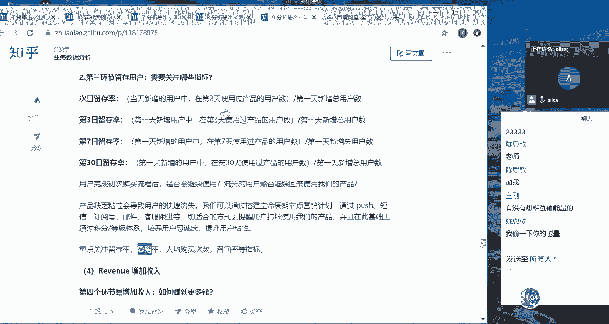

而且能够呃留住它的话，我们接下来就要想该怎么赚钱了啊。

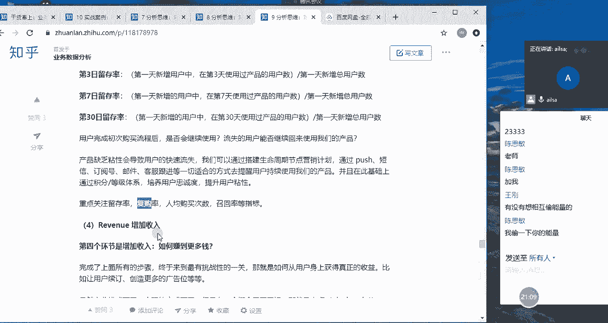

该怎么赚钱呢啊那就是让用户去买东西，对不对，让用户去买东西啊，然后呃，并且对我们它建立在我们平台认可的基础之上，他的买的东西他也是心甘情愿的啊对吧。

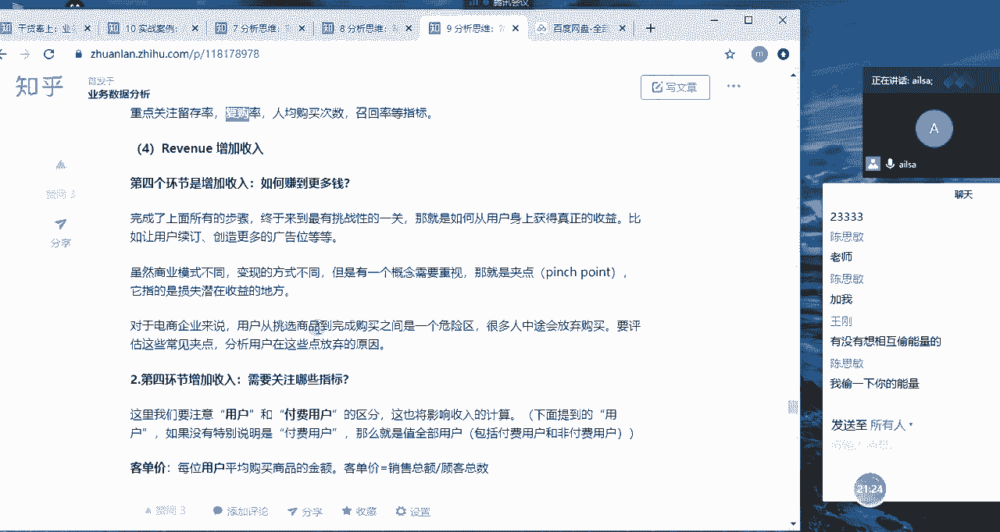

那我们在这个阶段需要关注哪些指标啊，就需要关注的是客单价哎，就是呃每个用户平均购买商品的金额，客单价越高，说明我们的用户质量就越高啊，他买的越多越好，对不对啊，还有一个就是A2PU哈，A2PU好。

还有一个付费用户占比，这也是很重要的一个点哈，叫PU2啊，PU2付费用户占比。

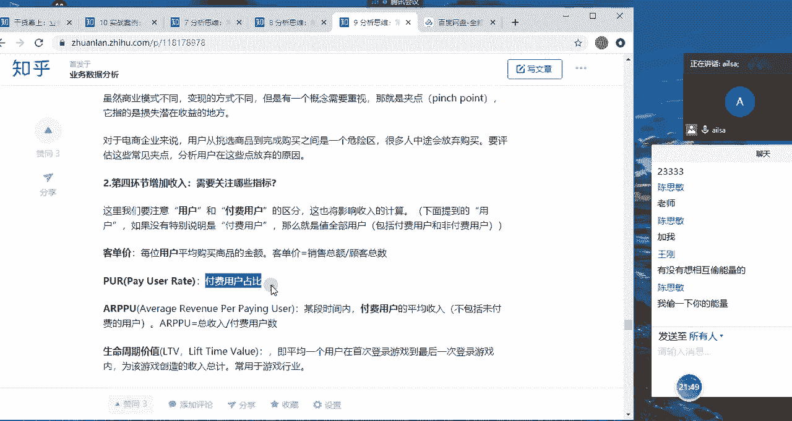

然后是A2，PPU和A2PU都是我们所要关注的一个点啊，好还有就是复购率啊，呵爱能量我不知道。

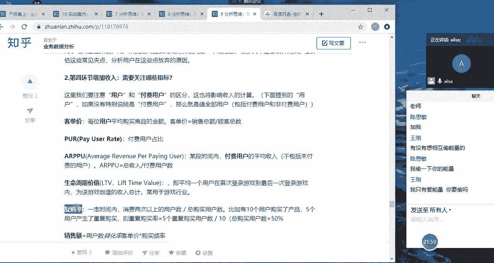

我不偷了啊，复购率，然后还有销售额，销售额也是我们对于结果的一个。

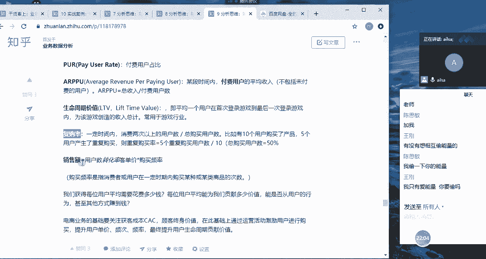

很重要的一个关注对吧，那相当于第四个环节就是我该怎么赚更多的钱，那我赚更多的钱，我该从哪些指标上去衡量啊。

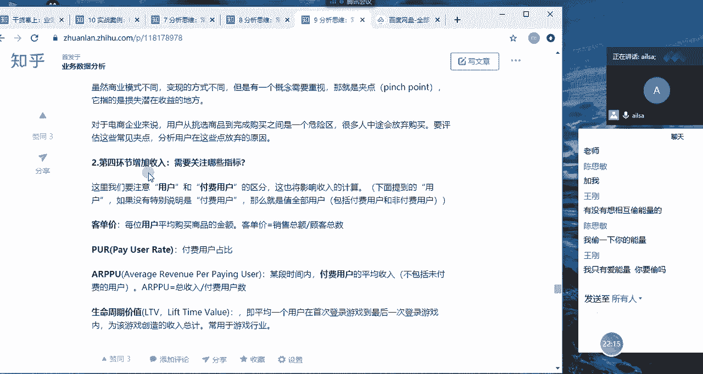

这样子，我们看第五个哈。

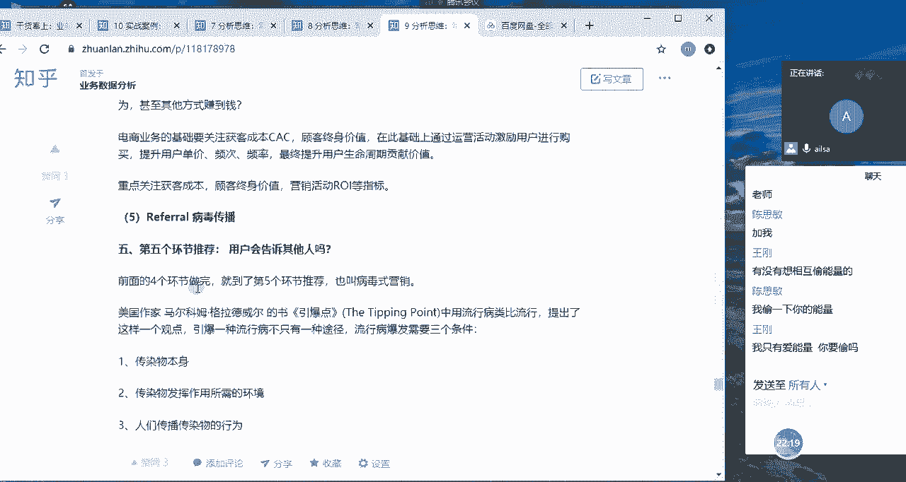

第五个就是病毒传播，什么叫病毒传播呢，这个病毒传播啊，就是你看这个这个相当于是app，发展的比较成熟的时候，然后才会出现这种情况，哎，就是呃我觉得这个呃，app或者这个产品也特别好用。

然后我也习惯了用它，然后呢，我也愿意在这上面花一些钱去购买一些东西啊，然后呢，这个时候我就哎我就觉得好东西一定要分享，对不对，那我就会给我的好朋友去分享，这个时候这个病毒啊，病毒传播。

就是说我们要把唉把这个东西啊，通过我们的用户去自传播，这样这个产品不花，不需要花一分钱就可以获得我们的优质客户哈，那我们看一下传播哈，传染传染传染物哈，这个相相信大家都知道哈，你比如说我们现在的疫情。

那真的是一传二，二传二传十的感觉哈，就是非常的厉害哈，所以说如果你的第五个环节做的非常好的话，那你整个app就赚大发了啊。

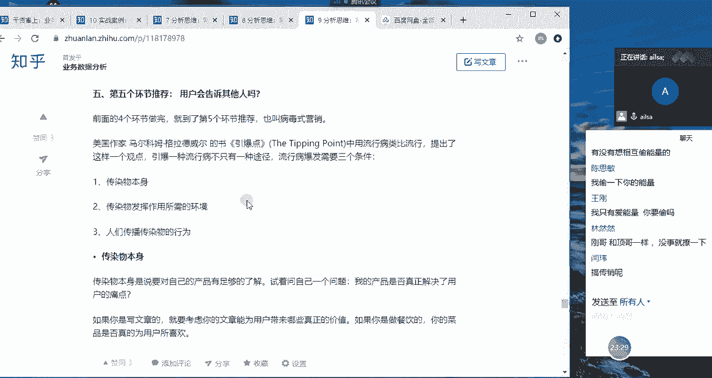

真的嗯，然后我们看一下第五个环节，主要关注的一些指标哈，就是一个是转化率啊，转发率哈，转发率指的什么意思呢，就比如说我们在啊，我们在我们的微信公众号或者知乎平台上，然后看到一篇文章写的特别好。

然后我们可以发我们的朋友圈，然后我们也可以转发给我们的我同事，我们的朋友啊，我们的亲人，然后跟他把好东西分享一下啊，就这个样子啊，叫转发率，转发率越高越好哈，那转化率其实就是我们啊之前讲的。

就是我们的流程啊，各个方面的一个流程的一个转化率啊，这样子啊还有一个广告的一个转化率，看到广告的已进入到广告的一个呃对比啊，还有一个叫K因子的，其实K因子呢就是用来衡量推荐效果的，一个重要的指标。

那他怎么来计算的呢，它就是每个用户向其他朋友发出的要求的数量，然后乘以接收到呃，邀请人数转化为新用户的转化率，好举个例子就是啊，每个用户向20个朋友发出了邀请啊，而平均转化率为10%的话啊。

假设为10%，那K就等于20乘以10%就是二啊，就这样的一个计算，那这个K值呢如果大于一啊，它就很好了，如果小于一，它就不怎么好了啊，就如果大于一，它就会很厉害啊，传播的特别特别厉害啊，啊没有搞传销哈。

这个这个是一个正常态啊，你比如说你就举一举一个最简单的例子，你比如说我们的这个呃教育培训，然后经常会有人说哎，你要推荐你身边的好朋友来啊，其实就是一样的啊，就是因为你觉得你在这边学的好的话。

然后别人也看到你学的啊有成果，然后你就可以，你就会推荐其他的朋友来这边学习嗯，来这边学习的话，对于公司来说的话，其实啊没有什么成本的啊，因为他不需要做前期的一个啊宣传讲解，因为你就跟他说明白了。

就这个意思啊。

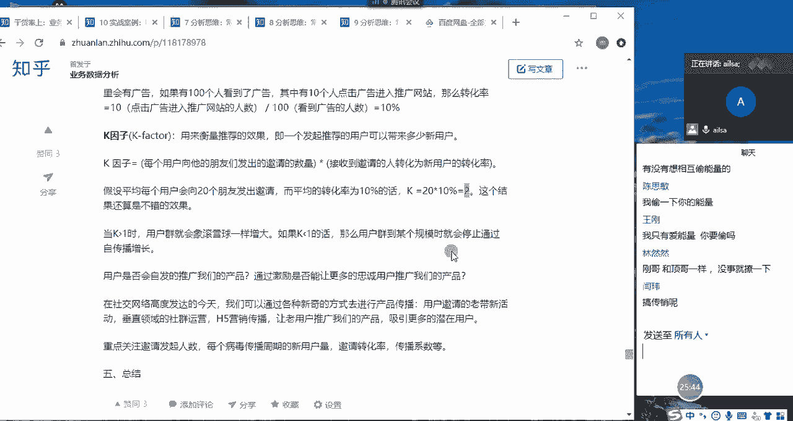

我们最终最终做的都是最后一个环节，希望我们的用户越来越多。

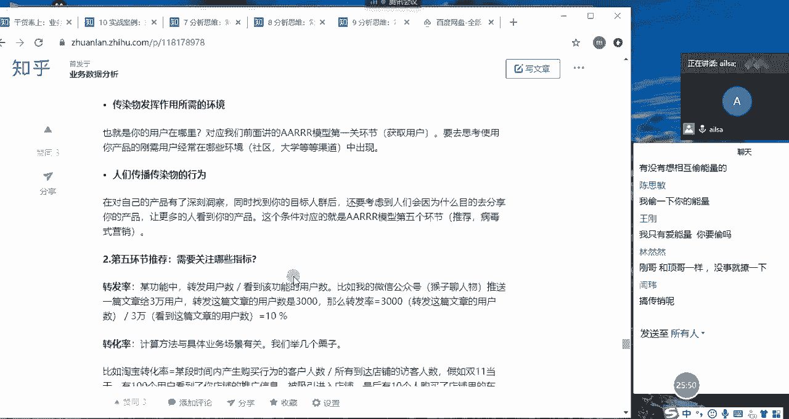

而且是一个高质量的用户，而且是在降低啊宣传成本的情况下啊，去做的这样一个操作啊，那大家知道啊，我问一下大家，大家知道我们前两年过年的时候，支付宝搞什么啊，家庭啊，就是家庭嗯。

就是就是就是亲人团什么抽奖什么的，你们知道他搞这个的原因是什么吗，我们来分析一下，同志们，还在吗，你们说一下，就是我们支付宝，然后在过年的时候搞亲人帐号的目的是什么啊，新增客户哈，嗯嗯你们想一想。

为什么会在过年的时候呢，为什么不在时间其他时间点呢，你这个出发点啊有点问题哈，啊麻烦你是这样的，你要想一下现在支付宝的用户啊，用户量是非常稳定的啊，主要是像九零后这样子对吧，唉对唉，徐峰说对了哈。

像九零后这个样子，因为大家大家现在都是啊支付宝微信去支付，所以说他们的用户群体已经发展到饱和了，但是呢他们想扩充他们的用户群体的话，他们就需要往三四线城市，然后去考虑啊，然后往更高年龄段的人去考虑。

因为小孩子不可能，小孩子，现在他们的钱都不是都不是自己掌握的啊，所以说他们会往啊高龄的去考虑，为什么呢，因为现在家里的孩子都会在教，爸爸妈妈怎么去使用智能手机，对吧啊，去普及这个概念。

这个时候他们就会想到过年大家都回家了，回家了之后都跟自己的爸爸妈妈呃在一起，然后的话绑定亲人账号，你首先得先有这个账号吧，所以说他们会让啊就是爸爸妈的手机，然后注册一个支付宝的账号，那对于支付宝来说。

他们的用户群体就扩大了，这是他们实行的第一步，但是不一定说还我们的父母都会使用啊，智能手机，这个时候他们呃，呃就是到后面还要看他们整个的一个呃，后续的一个活动和安排，然后教他怎么使用啊。

这个支付宝进行支付等等这些啊这个样子啊，所以说他们使用了亲人账号啊，然后进行一些活动的绑定啊，知道了吧啊这个懂了吗，同志们，嗯嗯我们啊如果说你们学呃数据分析，或者是说在后面从事了数据分析。

这个岗位了之后，你要知道有一些企业搞一些活动，他们最终的目的是什么啊，他们最终啊想要通采取哪些方式来迂回的，或者是经过哪些步骤达到我们最终想要的效果，所以说你要透过透过现象看本质啊。

不要仅仅就停留停留在那个层面，那我们再说像这种传播的形式，其实大家很常见的，你比如说我们都点外卖对吧，点完外卖我们都会发那个呃发红包对吧，发红包，然后大家大家就去领，然后这种的话其实也是一种啊。

也是一种，然后拉拢就是拉新的一个过程哈，就是推荐的一个过程，然后其实做的最好的应该是说呃拼多多了，拼多多的一个团购哈，以及啊大家应该也都体验过砍价这个东西，然后经常呃有段时间。

经常有朋友让我给他给他砍价，然后说哎呀你给我砍一刀吧啊，怎么怎么着，然后我打开这个链接之后，他直接提示我让我下载，你说我我不想下载，但是没有办法啊，我只能下载，我下载完了之后，然后给他砍了一刀啊。

然后就完事了，所以说为什么在一开始的时候，拼多多就敢说他们是四有三个亿的用户，你想一下，那个时候我才第一次知道拼多多，他就有3亿用户了，其实他这种手段就非常非常的厉害，但是它不能保证这些客户都是优质的。

但是他却能明目张胆地说，我的租车用户数就是3亿多啊，这个完全没有问题，就是放在那儿了啊，他这种团购啊，他们还会有一些就是呃，包括现在淘宝上也会有一些团购啊，就是说呃成团的这种这种呃。

这种那个呃买东西的一个行为，也就是说达到多少人我才能去购买，那这样的话其实有一些人是被拉来的，因为他可能不需要这个东西，但是为了朋友或者是为了自己的男朋友，或者是自己的女朋友，或者是为了自己的同事啊。

哥们儿啊，姐们儿等等，这些就啊就会去拉拢唉，对那那个用的东西如果真的不需要，也就无所谓了，但是吃的东西也因为你说你不吃啊，你说你不吃也行，你说你吃也行，所以说啊就会拼在一起，那这个拼多多在就在零食啊。

水果呀这方面拼的还是挺多的，嗯还有一些农产品啥的，反正他们的东西都还比较便宜一些，啊他们做的也是非常好的啊。

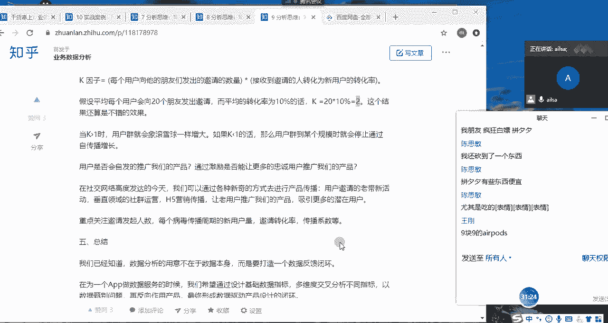

九块九的，OK哈。