# 强推！这可能是B站最全的【Python金融量化+业务数据分析】系列课程了，保姆级教程，手把手教你学 - P69：01 mysql8.0安装 - python数字游侠 - BV1FFDDYCE2g

嗯好嘞啊，我又忘录屏了，好嘞，同志们，我们接下来是呃演示一下如何安装MYSQL的8。0。

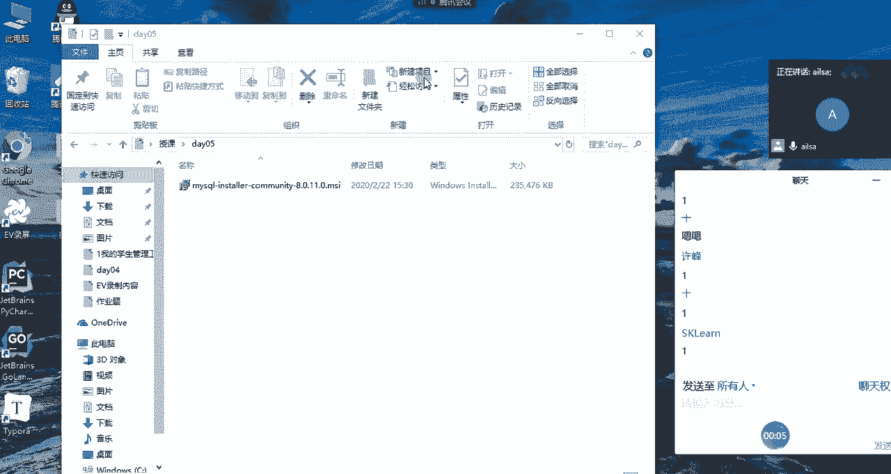

然后我们我再说一下我，我为什么让大家去安装这个东西哈，为我们之前学了MYSQL的啊，5。7版本，那为什么我还要给他给大家讲安装8。0呢，啊其实是这样的，就是在目前的公司的嗯，公司当中用5。

7版本的相对还是比较多的，因为啊比较稳定啊。

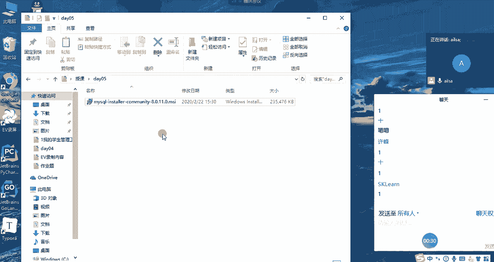

那呃讲8。0的原因是，因为我们在学习我们的数据分析的过程当中。

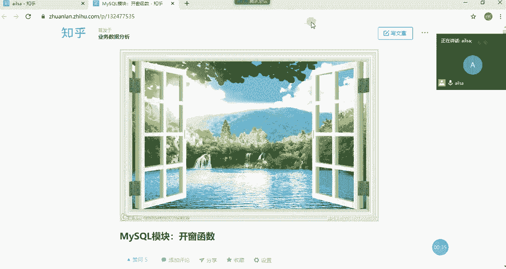

有一个很重要的模块叫开窗函数啊，也叫窗口函数啊，我不知道大家听说过没有好有人听说过吗，同志们嗯开窗函数或者窗口函数有听说过吗，啊没有听说过是吗，啊这个的话就是嗯在其他的比如说SQL server啊。

他们是有啊，是开窗函数的，然后用起来比较简单和方便，就是在某些我们在进行联表查询的时候，它用起来是非常方便的，那MYSQL当中它在5。7版本的时候，它是没有的，它只有在8。0以后啊，8。

0以后的版本当中才新开了这个功能模块。

那这个功能模块在我们后面就是我，我在我的工作当中做数据的分析和调取的时候。

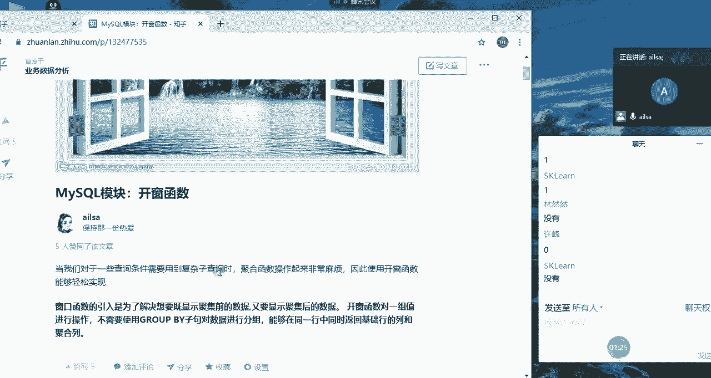

经常会用到开窗函数。

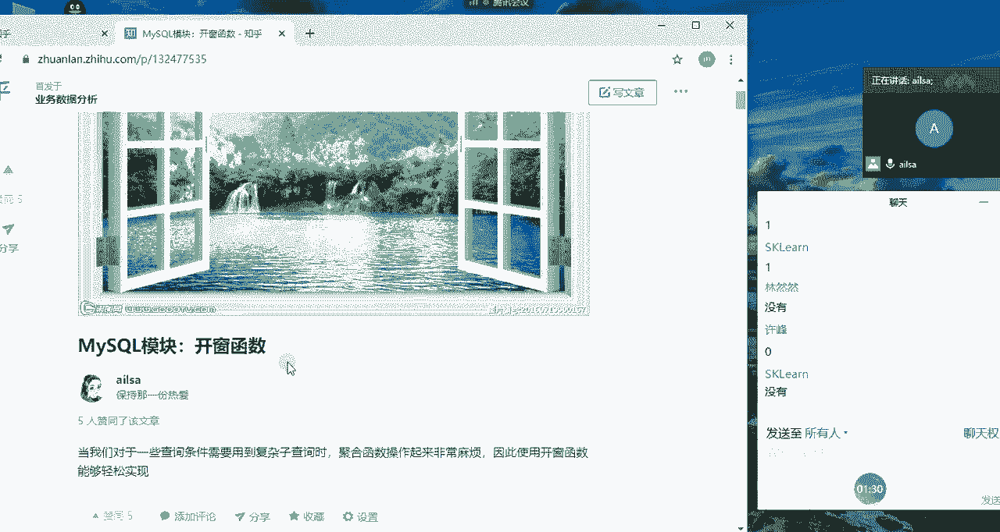

所以说我这边就觉得说啊，我应该把这一块的内容给大家新增进去。

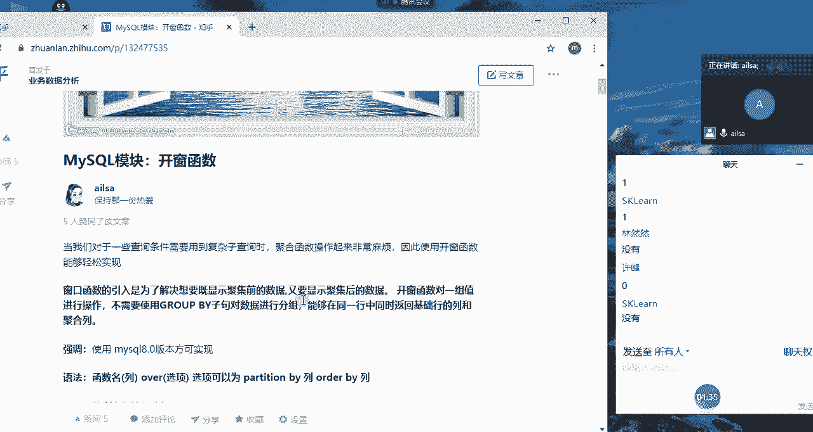

给大家讲进去啊，而且说嗯就是一方面他在工作当中是经常用的，另外一个方面就是我们在啊面试的过程当中，如果说你面试的是数据分析方向的一个呃好呃，一个工作内容的话，它在很大可能上是会考你的开窗函数的啊。

他就会问你哎你在工作当中有用过开窗函数吗，啊就是如果用过的话，会考你几道题，而且都比较简单，但是如果你不知道的话。

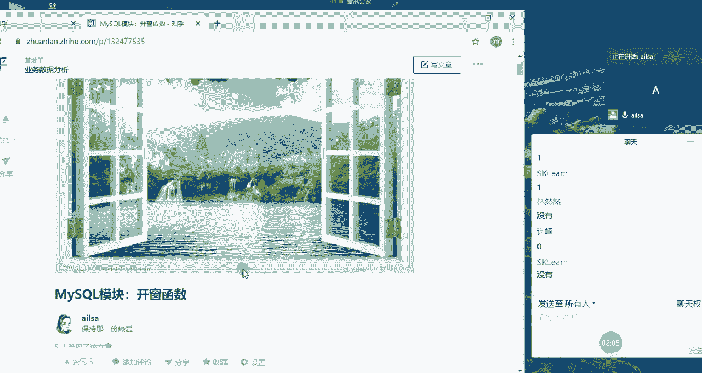

就就比较不太好了啊，是这个原因哈，我们在明天的时候会讲这个开窗函数。

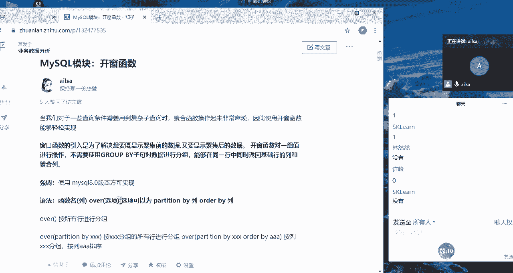

那接下来我就带着大家去安装一下啊。

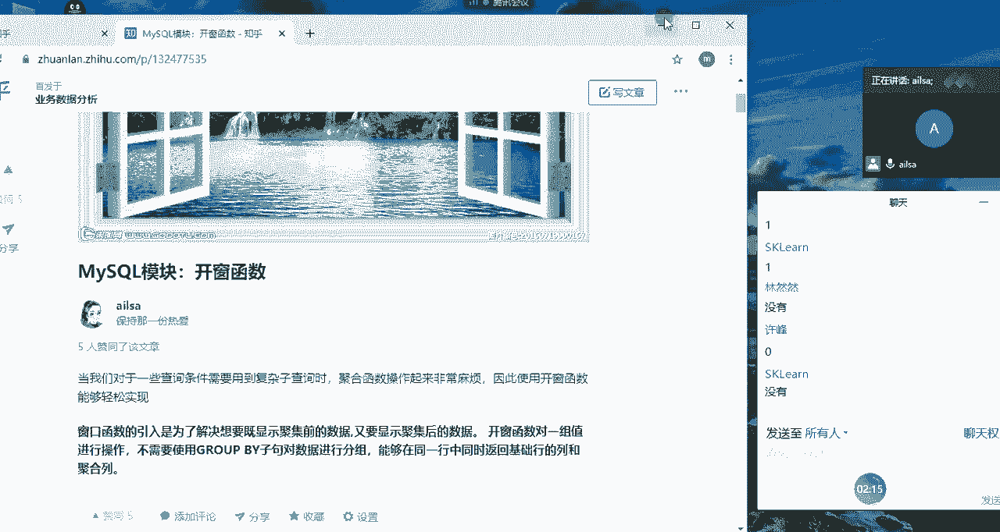

我们首先就是直接双击，双击我们这个MSI这样的一个啊形式哈，嗯大家跟着我一起去双击哈，我的电脑的反应速度应该还好，我不知道我这边会不会出现什么问题哈，因为我是之前是已经安装好了啊。

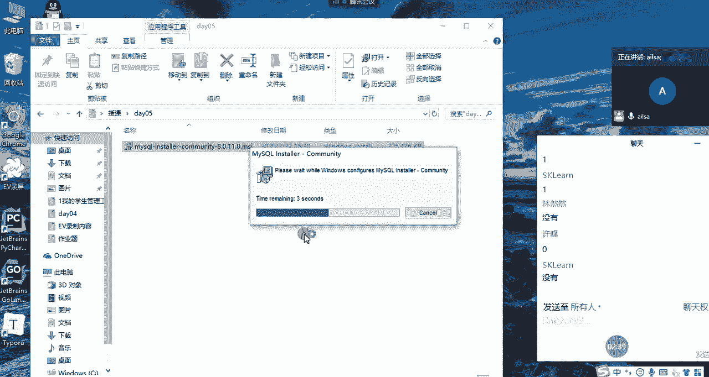

现在重新卸载的。

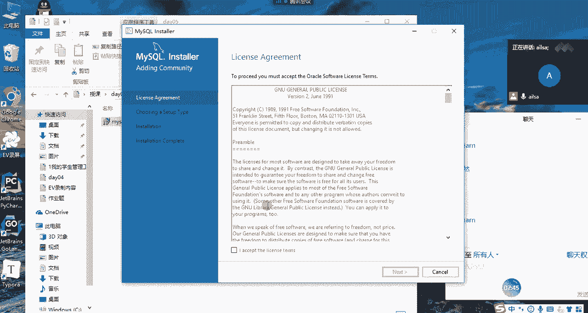

OK大家现在到这个界面了没有，如果到这个界面给我扣个一，嗯到这个界面了，给我扣个一，我一步一步带着大家去安装好的啊，嗯就一个人好了，好我们稍等一下哈，因为我们今天也没有课哈，所以说我们就慢慢来，好的哦。

思敏不在是吗，在应该在吧啊思敏在好的，哦这是64位的，你们的是32位的吗，你看他只有64位的，现在电脑应该都是64位的吧，还有32的电脑吗，好的建浩你都OK了吗，哦哦OK那我们不等了哈。

这个时候我们最开始的一步操作就是啊，就是点agree啊，对i accept the alliance terms，还有就是我同意啊，I agree，然后点击它next，好的。

你是不在电脑旁边是吗啊行点击next，这一点很重要哈，大家不要着急往下点哈，这个这个它嗯他这个因为我们用的是MSI，所以他安装的打包的东西会很多啊，我们这边只点击server only哈。

我们只安装MYSQL啊，这样的一个呃，呃服务端好点，只安装MYSQL啊，只安装MYSQL，点击完了之后，我们点next啊，这个时候我们出现了这个界面的话，呃，它就是告诉我们的。

我们的产品的话是mysql server8。0。1的版本，然后644位的，然后这是你默认的安装的哦，跟我的不一样，哪一点不一样，呃上一步应该还是一样的吧，这一步还是一样的吧，server only有吗。

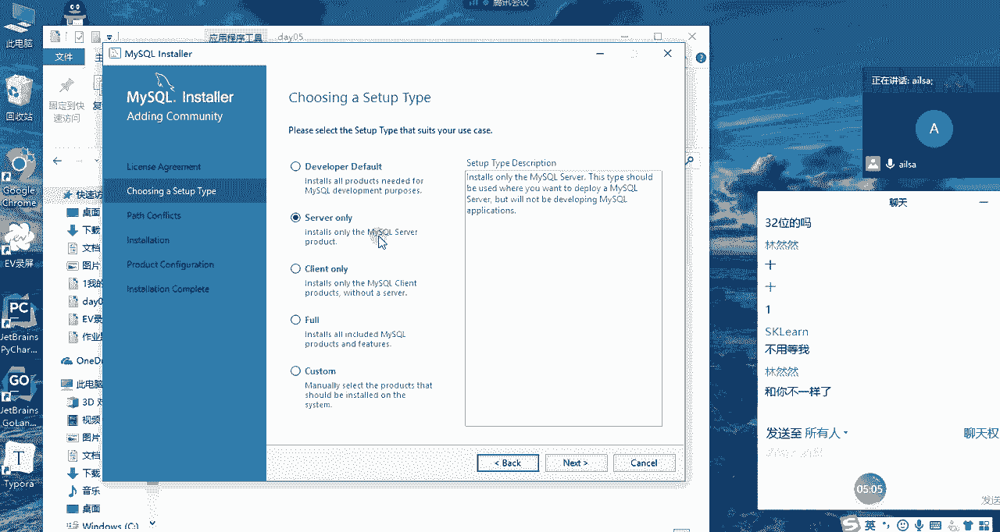

好的稍等看。

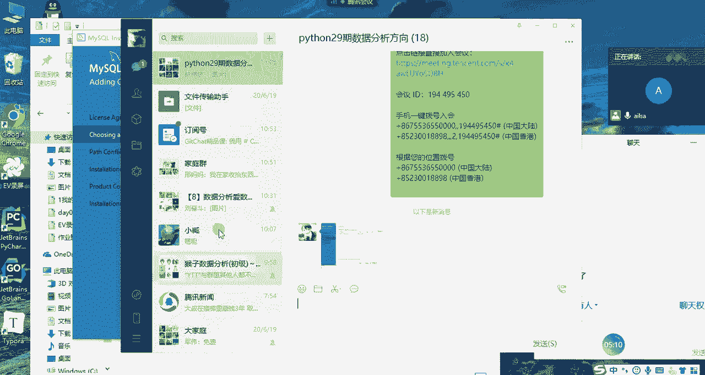

哦没有关系没有关系，你这之前应该是安装过的感觉，你这跟我呃。

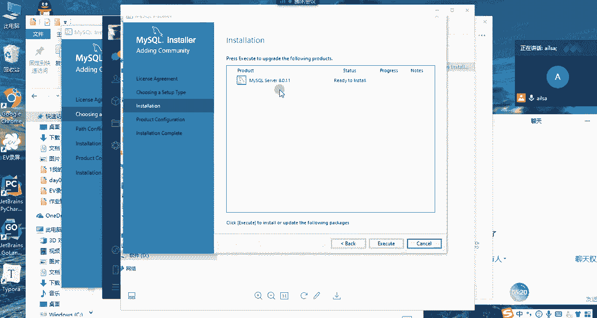

跟我的那个好像有点像，你之前安装过吗。

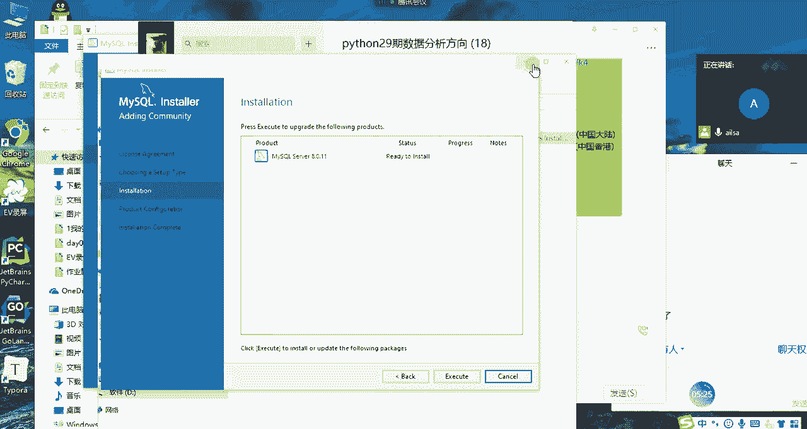

没有是吗，行那你先跟着我去走，看他后面会不会出现什么问题，OK啊没关系啊，然后这个是我们的产品，就mysql mysql server8。0。1，然后这是我们的安装的目录哈。

你们一般情况下默认的就可以哈，默认的就可以，因为它默认就安装在这个下面也可以啊，如果你想选择不同的文件的路径也可以哈啊，OK那我们往下操作next的优秀的吗，嗯应该是我原来的文件当中是有的。

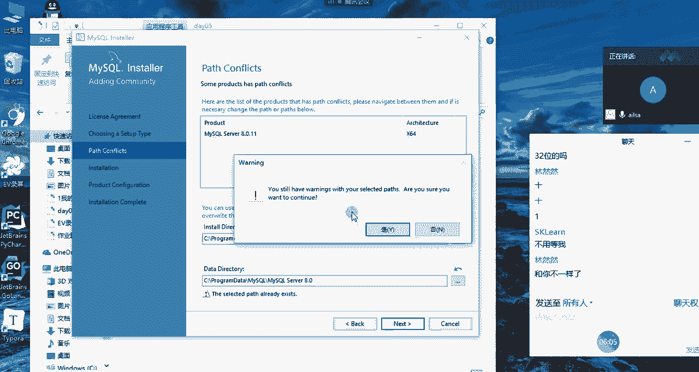

我先看一下哈。

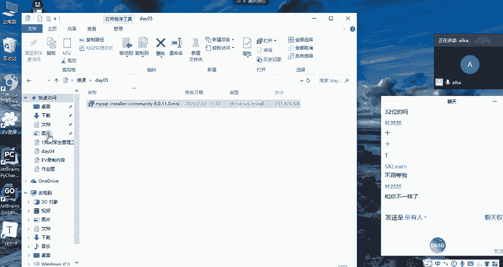

稍等OK我们直接点next啊，点击是，然后大家看到出现这个界面的话，这个就是跟那个呃然然的是一样的哈，然后我们再直接点击这个运行就可以了啊，点击这个运行嗯，大家现在等一下哈，OK哦完成了哈。

完成了我们再点next啊，这个时候就是我们的产品啊，已经差不多了，我们再点next，OK啊，OK到这个界面了啊，大家看一下哈，到这个界面的话很重要哈，我要等着大家一下，如果说大家到到到这个界面之后。

然后给我扣个一，安装路径啊，没关系，应该是默认的，就是如果你没有看到，应该就是默认的啊，默认的那个profile，然后什么买circle什么的，因为我们有一部安装路径，你那边是跳过的，不知道怎么回事。

OK到这个界面没有，啊到这个界面我默认选这个哈，默认选这个啊，我还以为这个是要有所更新的啊，OK我们再点击下一步next，这个时候到这个界面哈，到这个界面我们需要改点东西哈，嗯我们需要啊好好看看啊。

而这个界面好像也不用动，也不用动，我这边的端口，On number，3308，你们应该是3306，没关系哈，这个它可能会提示啊，端口可能会冲突，我看看啊，TCPOK下。

你们这个part number是多少啊。

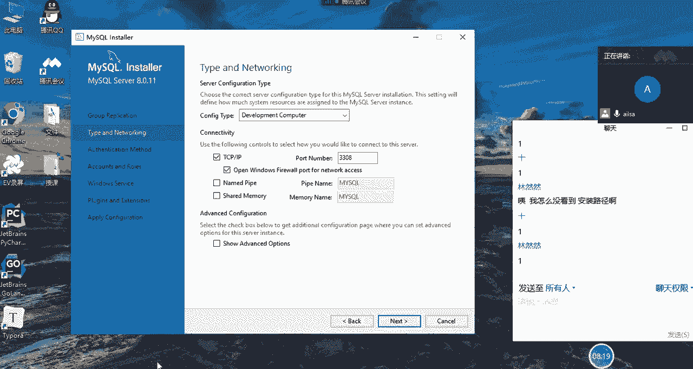

什么啊，那改成三三啊。

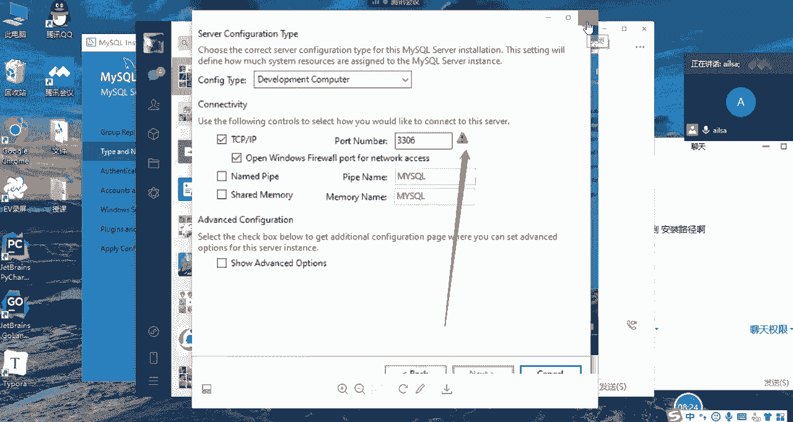

你们要改一下，因为这个端口跟5。7的冲突了，啊要改，我这边改的是3308啊，你们改一下吧，它可能会冲突，这个无所谓哈，这个只要说你不占用其他的，其他的你的程序端口就可以了，我改到3308。

目前没有任何的问题，OK那我们再点击下一步，点击下一步之后，在这个界面哈，在这个界面我们不选择默认的了，我们要选择这个，这是我们的密码加密方式哈，加密方式我们不用它这个。

因为他这个你看strong password怎么怎么的就比较啊，就是你选这个也可以，但是我们在后面连的时候就比较费劲啊，就比较费劲，所以我们选择第二个啊，大家到这一步了，给我扣个一。

嗯大家到这一步了之后，给我扣个一，OK那我们接着往下走，点击next，在这里面大家一定要输入啊密码，这个密码就是你的root的密码啊，mysql root password啊，等会我们登录的时候。

这个密码一定要记得哈，所以说你这边设置一下啊，啊如果说怕自己记不住，就设置123456啊，Repeat password，123456，OK啊密码比较弱哈，没关系哈，好这边是添加用户的。

我们可以先不添加哈，啊大家录着呢录着呢啊，OK大家到这一步了没有，密码设置完了吗，同志们，密码设置完给我扣个一，Ok，OO是谁，ok next啊，到next之后啊，然后我们的这个啊。

我们的这个MYSQL，你们的看叫什么名字，如果跟原来的MYSQL冲突了，你可以写上八零或什么的，OK大家这个地方有冲突吗，My circle，这这个地方如果有的话。

可以改成MYSQL8或MYSQL80这样子，OK啊，这个改好了吗，对没有感叹号就没有什么问题啊，没有感叹号就没有什么问题，但是你尽量为了去识别我们就知道呃，原来我们安装5。7的时候。

应该默认是你应该默认的名字是MYSQL啊，然后如果它有冲冲突的话，它会有一个叹号啊，如果没有叹号的话，就没有什么问题，因为我这之前安过一回啊，所以说啊所以说他这个没有叹号哎，我们再往下走哈。

OK到最后一步嗯，最后一步啊，这个地方我们看一下我们的端口，我们看一下哈，我们的端口选择这个啊，33060port number，我看一下啊，啊其实也不用，因为我们之前已经改过了啊。

我们之前已经改过了嗯，My circle as a document store point，那我们之前改成了3308等等之类的，不用添加用户，我们用root就行哈，我们用root就行，嗯我看看啊。

open windows fire防火墙，Port for necess，点一下吧，点一下这个吧，我也不知道会不会出什么问题，OK点一下这个吧，点一下这个嗯，然后我们在next看一下哈。

然后啊到这个界面之后，直接点这个啊，它就会下载相关的啊应用，OK如果说完事了之后就finish了啊，然后我再教大家如何在NAVCAT里面去启动它啊，嗯如果说已经如果说啊，如果说已经呃已经OK了啊。

然后就可以先把自己的navy cat打开，我这电脑有点慢。

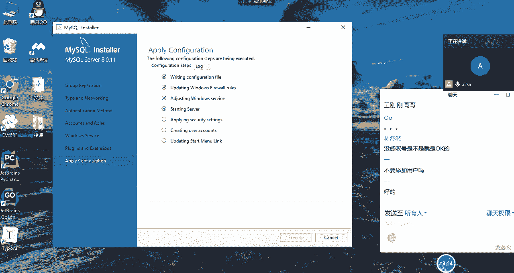

我说在这里面安装完了之后，然后点击finish，我们就完成了。

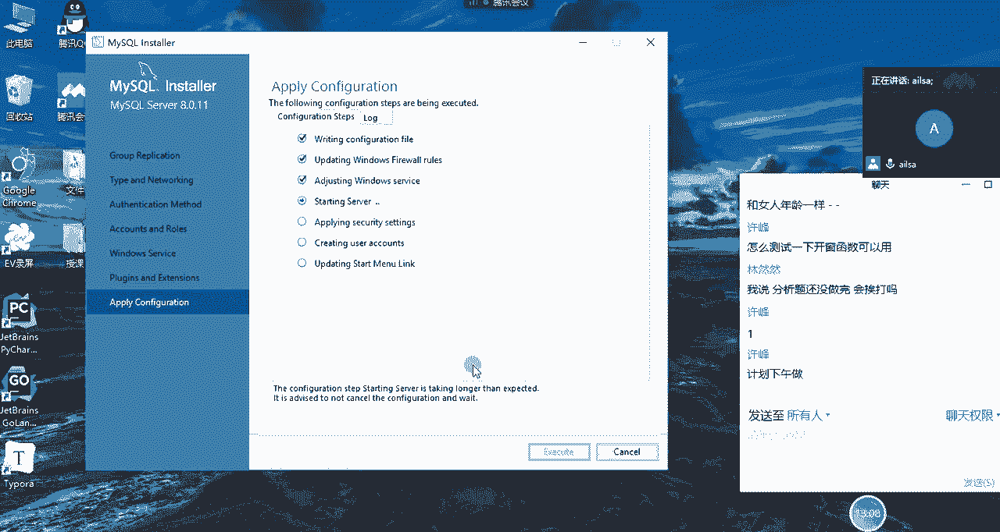

完成了之后我们就打开我们的navy cat，然后在这里面连接啊，连接MYSQL输入啊，就是你自己命个名，比如说MYSQL8。0或者是什么什么都无所谓，然后把我们刚才设置好的啊，3308这样的端口。

或者你自己设置的，跟之前的5。7版本不冲突的那个端口，输入进来，然后这个密码的话是我们刚才在安装过程当中，设置好的那个密码，然后输入进来测试连接，如果成功，代表你的MYSQL8。0已经安装好了。

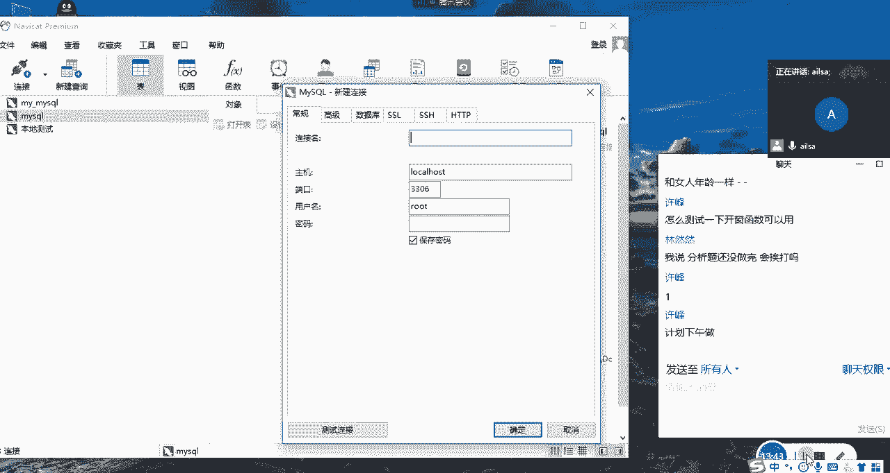