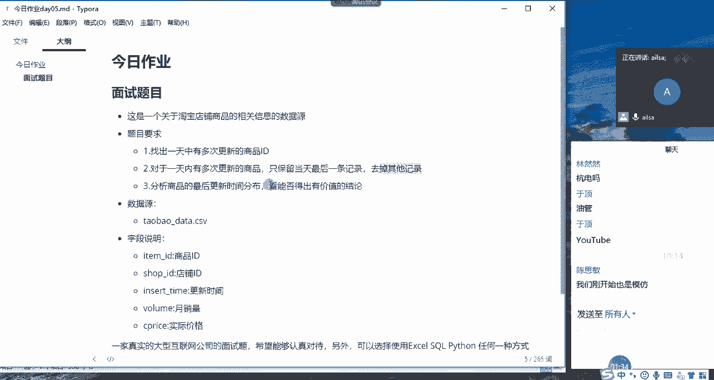
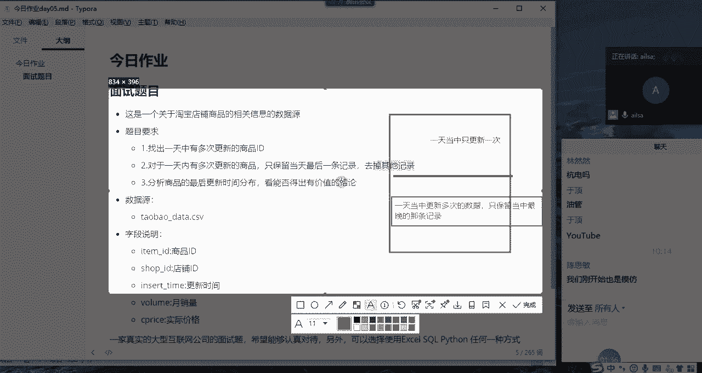
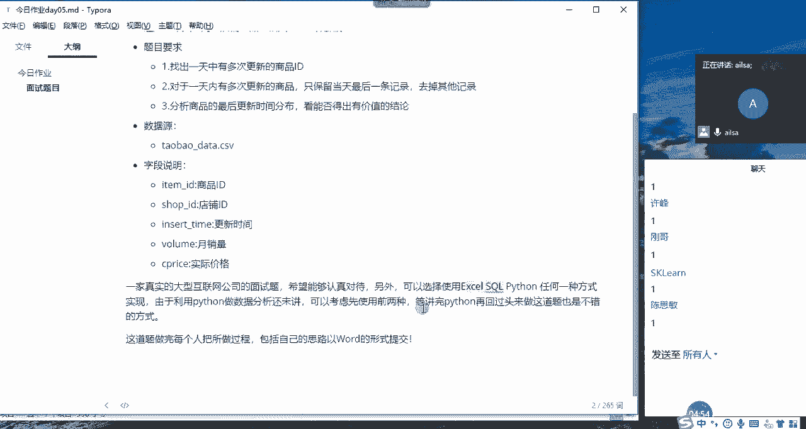

# 强推！这可能是B站最全的【Python金融量化+业务数据分析】系列课程了，保姆级教程，手把手教你学 - P71：03 今日作业介绍 - python数字游侠 - BV1FFDDYCE2g

今天的作业是还是你看，还是电商数据的一个分析哈，它是关于淘宝店铺商品的相关信息的数据源啊，我跟大家说一下这个题目是什么意思呢，就是说我们淘宝啊，淘宝不是有很多个商品，很多个店铺嘛。

那它每一个店铺的下面都会有很多个商品，对不对，因为你比如说一个专门卖女装的，她可能卖短袖对吧，短袖有很多种类，然后短裤有很多种类等等这些，所以说它有很多个商品，那对于每款商品的页面。

它都有可能进行更新啊，都有可能进行更新，这是很正常的，然后他一天当中啊有可能会进行更新多次啊，所以说啊啊我们的题目要求是这个样子的，就是说我们要找出一天当中更新多次的，一个商品id。

就是哪些商品更新了多次啊，然后把这更新这么多次的数据全部都找出来，然后第二个对于一天内更新多次的商品，多次的一个商品，然后只保留当天最后一条记录，什么意思呢，就是说一天从零点开始到24点。

那整个的一个时间当中啊，23：59分啊，多少多少秒，59秒是最大的一个时间，也是最晚的是一个时间，也就是说当天的最后一条记录，然后我们前面的呃，那些都不要只保留最后一条记录就可以了。

也就是日期最大的那一条记录就可以了，然后去掉其他的记录，然后第三个就是分析商品，最后更新时间的一个分布啊，呃简单什么意思呢。

就是我给大家画个图哈，你比如说有这么些数据，然后有些数据是一天当中只更新一次的，我们不动啊，比如说啊这些数据是一天当中，只更新一次我们就不动了，更新一次我们就不动，然后我们把一天当中啊。

更新多次的数据筛选出来，多次的数据筛选出来，筛选出来之后呢，给它去一下重啊，怎么去重呢，就是只保留啊，只保留一天当中最晚的那条记录，只保留一天当中最晚的那条记录，然后保留完了之后。

相当于这啊这些多条记录的它也变成一条，对不对，那这一部分数据加上这一部分数据综合在一起，去分析它整个最后更新时间的一个分布，我们能够得出什么有价值的结论啊，就这么简单的一个问题。

然后大家听明白了没有，大家听明白听明白，给我扣个一，同志们，啊听明白了哈啊这三个问题其实是连贯的啊，也就是说我们从整个分析来说，就是一天当中啊，有多有多次，有一次的，然后一次我先不管。

我先把多次的筛选出来，筛选完了之后，我给根据一定的条件，给他保留一条记录就可以了，然后把这所有的数据放在一起，然后进行一个最后一次的更新，时间的这样的一个分布，然后得出我们有效有价值的结论就可以了。

其他人呢只有余定一个人，明白了吗，OK都没有问题了之后啊，然后大家看我的要求哈，这道题需要每个人把做的过程包括自己的思路，然后以word形式提交哈，啊这个需要交到我这里哈，直接发给我就行，也就是说啊。

这个题这个实现的形式你可以用excel没有问题，你可以用circle也没有问题，如果你会Python也没有问题哈，你用Python也可以，当然这三个都可以实现哈，我这边采用的是Python来实现的。

因为你们还没有教Python数据分析，所以说应该大家都不会哈，我们只要选择前两种形式就可以了，如果你有时间，我建议你两种都选择一下，如果我们在面试的时候，别人给发了这样的一道面试题。

如果你分别用excel circle和Python都做出一套来，那说明你还是挺厉害的，明白了吗啊，或者说你直接采用circle和Python也是可以的啊，因为excel的话相对来说嗯。

相对来说必备技能哈，啊所以说啊，所以说circle和Python更能体现你的优势啊，我们可以选择后两种，你在面试的时候，如果说你在实际的工作当中，大家啊实际的训练当中哈，大家对excel还不太熟的时候。

可以采用这三种方式的，前两种先采用前两种，然后学完Python数据分析，再回过头来把这个做一遍。

然后就可以了啊。