# 强推！这可能是B站最全的【Python金融量化+业务数据分析】系列课程了，保姆级教程，手把手教你学 - P72：04 mysql库和表的操作 - python数字游侠 - BV1FFDDYCE2g

重讲解哈，刚才给大家稍微啊稍微的介绍了一下啊，OK我们介绍今天的数据库部分哈，那我们在讲数据库啊，我们之前已经学过了哈，所以我们讲的速度会快一些哈，啊我们会中间嗯会有提问哈，所以说大家认真听讲啊。

那我们之前讲数据库，我们都知道什么是数据库啊，数据库其实就是科学的组织和存储数据，然后高效的获取和维护数据，什么意思呢。

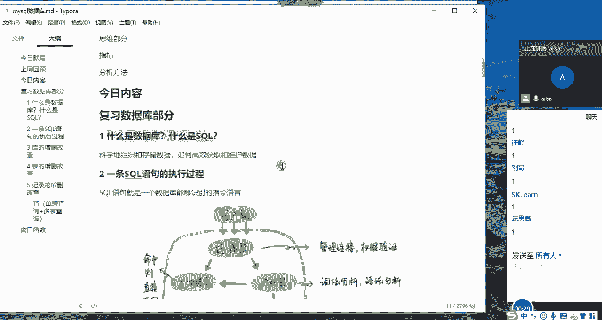

就是说我们之前没有数据库的时候，我们是不是用文件对吧，我们是用文件来操作的啊，那文件啊文件有一个什么问题呢，就是它其实是放在本地的，对不对，那如果说别人想用这个文件，别人你还得给别人拷过去，对不对啊。

如果说是我们独立做一个项目的话，那这样实现肯定是不行的，所以我们需要一个什么呀，我们需要一个单独的服务器对吧啊，我们需要一个单独的服务器啊，然后我们把我们所有的数据都放在这里对吧，放在这里之后啊。

然后我们通过什么呢，通过socket，大家都学过socket哈，我们通过socket，然后让我们的客户端都来访问它，都来访问他，都来访问他对吧，这是我们的客户端啊，客户端都来访问它。

然后大家共同在这个数据上去，在这个台服务器上去获取我们所想要的数据，然后去返回回去这样的一个过程，那我们把数据放在这里之后，我们再对数据进行一个增删改查的时候呃，如果说啊。

单独用我们整个的一个socket来实现的话，其实还是比较慢的，那我们应该开发这样的一套软件对吧，开发这样的一套软件，专门用来管理数据库来啊，就是实现并发呀啊，然后等等各方面的一些操作。

来达到我们啊对数据进行增删改查的一个，效率的最大化，那这个啊这个软件啊，这个软件或这个系统就叫数据库哈，数据库管理软件啊，数据库啊，数据库好管理啊，软件啊。

我们所说的数据库管理软件呢就是指的是MYSQL，Sql server，oracle哈这样的一些关系型啊，只关系型数据库，那还有非关系型数据库，也就是我们的啊MONGODB对吧，release啊。

这样的非关系型数据库都是可以的哈，那我们在学习的过程当中，今天所学的都是关系型的数据库，我们讲过的就是MYSQL啊，那关系型数据库啊，我们学习关系型数据库的话，需要再学一个知识叫什么呢，叫circle。

为什么要学习circle呢，啊我们想一想，那既然说它是一个管理软件，我们可以高效地实现数据的一个哦组织和存储，并且能够啊方便地进行数据的增删改查，那我作为一个客户端，我该怎样对这个数据管理软件进行一个。

正删改查呢，它们之间有什么暗号没有，对不对，我不能往这一站说中文对吧，我不能说哎，你给我一下学生表里面id为一的数据，我不能这样，对不对，那他们之间应该是有行话的，这个行话就叫circle对吧。

也就是说一个数据库管理软件，能够识别的一个指令就叫circle SQL语句哈，只有关系型的数据库哈，关系型的数据库才会有circle，那对于不同的数据库而言，你比如说MYSQL，Oracle。

Sql server，他们的SQL语句几乎都是差不多的，只是有略微的差别，类似于普通话和方言的差别哈，类似于普通话和方言的差别，所以说你只要学会了circle，这样的一个标准的语言哦。

你就可以基本上可以操作各个不同类型的，关系型的数据库，OK那大家对于数据库和circle都了解了吗。

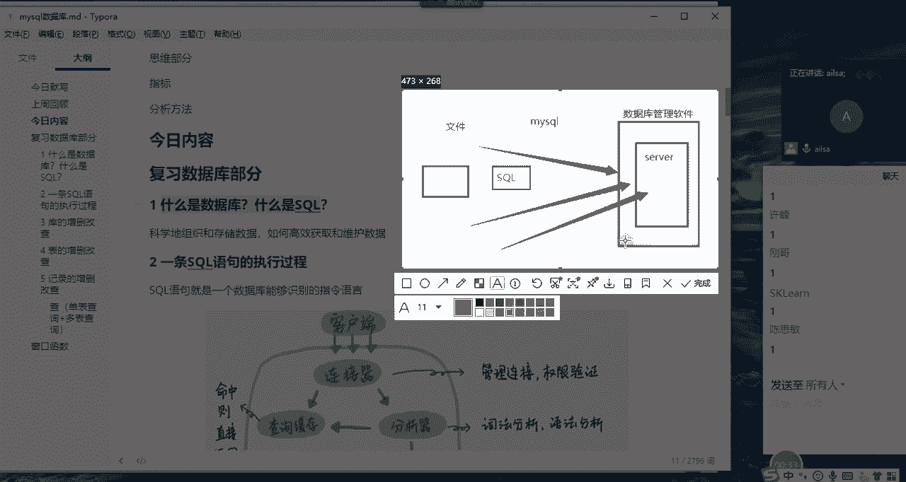

啊谁俩差别啊，嗯同志们对于数据库和circle了解了吗，粤语听不懂是吗，我只是简单举个啊，举个例子哈啊因为在呃SQL server和oracle当中，他们确实是略略有差别的哈。

啊就那你就类似于啊啊普通话和河北话吧，因为河北话跟普通话特别像啊，就有点像普通话和方言这样的一个差别哈，就就近的差就近的方言吧，你比如说粤语，闽南语，还有那个待遇什么的，那咱们就不说了哈。

你这个有点跟我较真了哈，我只是简单举个例子啊，橘子，哎呀妈呀，我差点没有get到你们的点哈，OK嗯下回我举个南瓜好吧，让你们看清楚一些嗯，OK那既然我们讲明白了数据库和circle之后，我再介绍一个啊。

我们一条SQL语句，它的执行的过程是怎么来实现的哈，你比如说啊其实我不知道大家有没有好奇过哈，在我在我了解到数据库了之后。

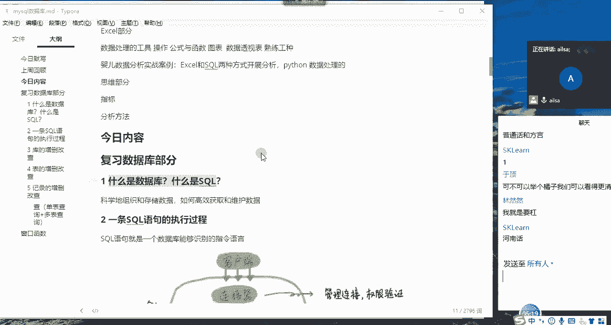

然后我就会在想，你这个作为一个数据库管理软件，比如说你是MYSQL对吧，你是买circle，然后你发我作为一个客户端，然后我发送了一条指令啊，发送了一条SQL语句哈啊发送了一条SQL语句啊。

他是怎么来工作的呢，就是他怎么他怎么就能够说哎，它就能识别到这个SQL语句，然后再给我返回一个结果给我，这里呢其实我还是挺好奇的啊，所以说因为这个好奇心呢，所以说我研究了一下。

我研究了一下一条SQL语句的执行过程，那这边呢主要是针对查询哈，select啊这样的一个SQL语句的执行过程，因为对于更新啊还不是特别一样哈，那我们先说查询是怎么来实现的。

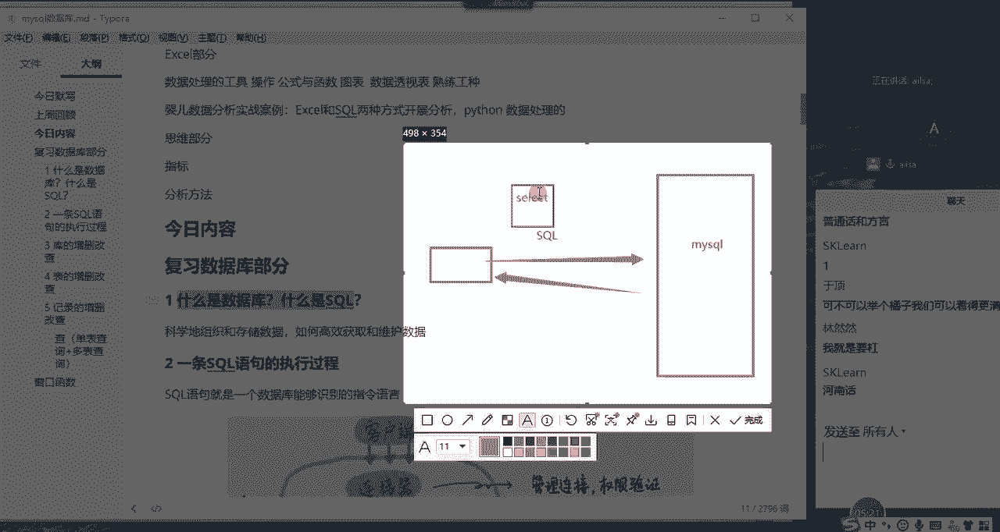

因为查询比较简单，我们看一下哈，首先呢哎这个我们要先建立连接，对不对，你只有二者建立起连接了，你才能够相互通信，所以说我们要客户端跟我们的服务端建立连接，那在我们的实际的操作过程当中，是怎么建立连接呢。

哎你比如说现在给大家演示一下。

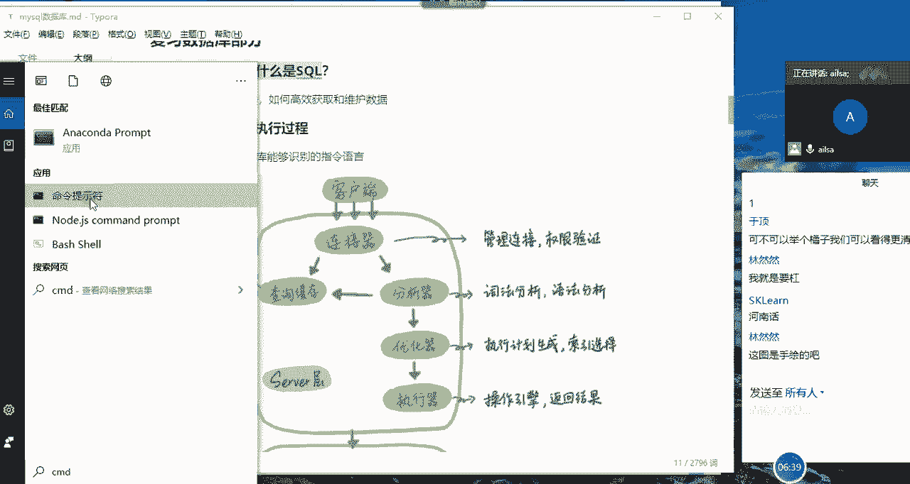

嗯那我现在考一下大家吧，我们怎么建立连接。

同志们，如果说现在我想连接我的mysql server端，我该怎么办，Ok mysql，然后我的用户名和密码，然后还有我的端口，对不对，因为我整个的一个8。0的话，它的端口跟不是默认的3306了。

所以说我要加上我们的端口，也是杠UROT对吧，杠大P啊，3308啊，然后是杠小P啊，我为了不让大家看到我的密码，所以我在这里面输入密码，OK哈这个时候我是不是已经建立好连接了。

那就是我们的MYSQL杠U啊，就是输入我们的账号啊，设我们账号输入我们的密码，输入我们的端口啊，这样我们就可以好，这样我们就可以打开我们整个的一个，额数数据库的一个客户端了，相当于我们已经跟服务端啊。

已经建立好连接了哈，因为我的MYSQL服务端是启动计算机的时候，自动启动的哈，所以说就不用开服务了，大家也知道我们在哪开服务是吧，在我们的服务里面。

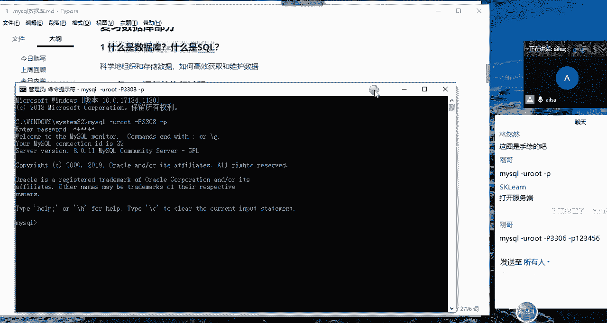

在我们的服务里面是可以开的哈，OK那现在我启动了之后。

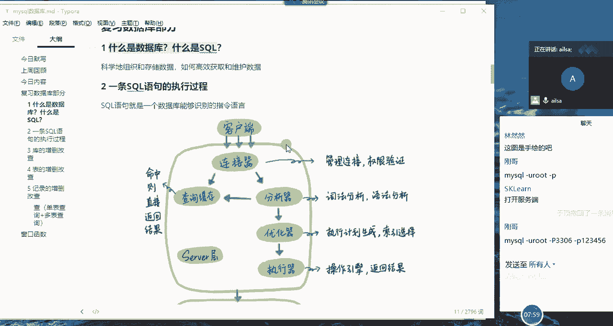

相当于我建立好连接了，然后我在这里面写了一条哈，这个时候我们需要定位到数据库，对不对，我们看一下有哪些数据库哈，show data basis还记得吗啊，是不是很熟悉，Should the visit。

看一下哪些库哈，假设现在我使用的是STU杠info哈，use哪个数据库，STU杠info，好的啊啊这个时候我们聚焦到这个数据库下面，然后修tables，看一下这个表里有哪些内容。

OK有我的学生的相关信息表，现在我发送一条是select语句，selection from from s t u s t u表，where i d啊，应该是SIID等于一啊，我们看一下能不能成功哈啊。

OK可以的是吧，你看我这边发送了啊，一条SQL语句，select新from s to VR啊，SIID等于一哈，大家看到这个这个数据，怎么感觉跟自己看的不太一样哈，这个STU是一个视图哈。

啊我在我们等会儿会讲哈，i t u d e n t student表哈，OK唉这个时候我就找到了我的一个学生哈，啊啊一个学生的啊，S a d，然后性别，然后他的整个的一个班级的id。

还有他的他的一个姓名哈，叫理解哈，这个这个名字起的哈，OK那我发送了这条SQL语句，它是怎么给我返回过来的呢，哎我们看一下它整个的一个执行流程哈。

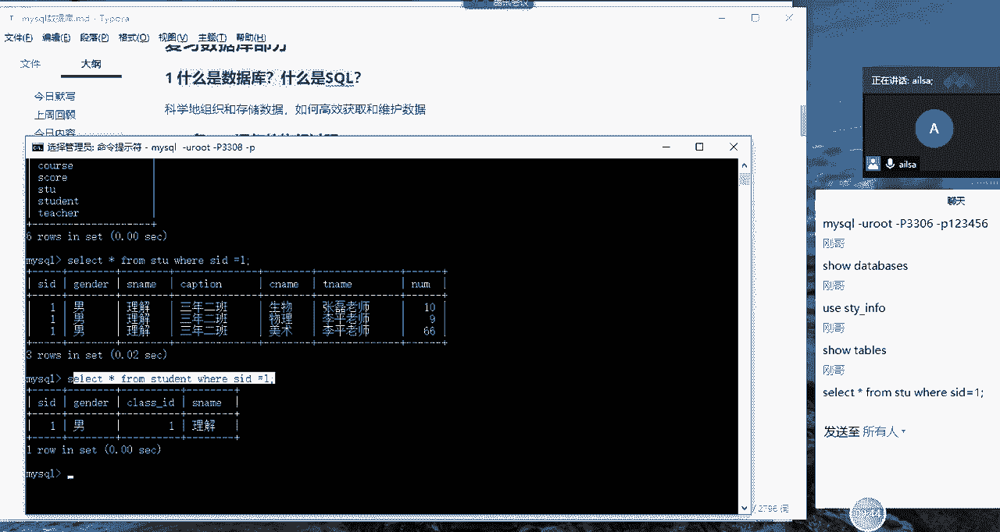

首先啊他会先去缓存里面去查一查啊。

什么意思呢，就是说他看看我之前是否有这样的一个。

查询的语句的结果，如果有的话，它会放到缓存当中，那那如果我在查询的时候，缓存里面刚好有的话，它就会直接返回结果，但是我跟大家说一下，但是我跟大家说一下，这个缓存里面的一个命中率是非常低的，为什么呢。

是因为我们想一下，缓存肯定是基于上一次的查询结果，那如果说这个数据里面的内容是有更新的，同样一条查询语句，缓存里面是获取不到的，你比如说你查询的呃。

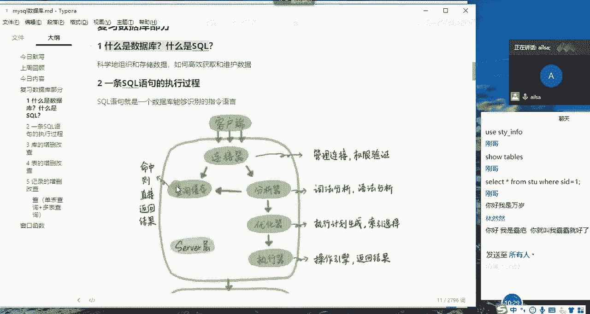

打假设哈，你查询的class id为一的，假设你在第一次查询的时候是这样的一个结果，后面你对数据库进行了一个更新。

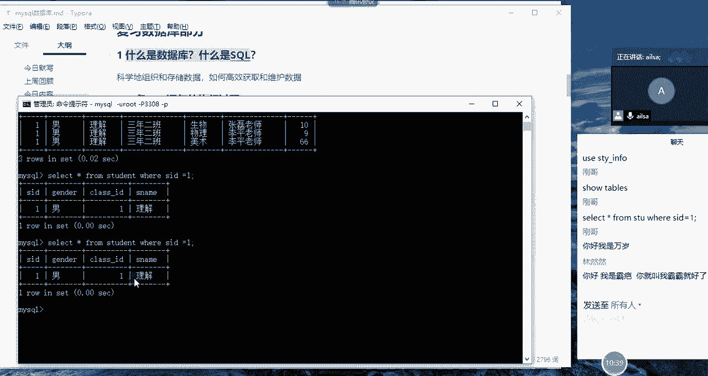

那在缓存里面它肯定不会更新的，但是他只要判断出来你这个数据class跟id啊，这个数据是有更新的话，那你这条查询语句，然后他在缓存里一看，诶，这个数据是不全的，然后他就不会命中，它又会跑到这里面去执行。

那所以说我们数据库当中的数据，你想一下，它是基于每每每一个项目而建立的，整个的一个内容，所以说每个项目也每次都就是，它是在线上跑着的，所以说它的数据是不断产生的，它整个数据都是处于更新的状态。

所以这个查询缓存的命中率是很低的，它的效率也不高，所以说基本上走这一步都是白走啊，所以你知道就好了，这个查询缓存的命命中率不高，但是它也会走啊，然后如果说在缓存缓存里这边查不到。

然后他会走接下来的这一步操作，就是他先到分析器，分析器里面去看一下你的词法分析和语法分析，什么意思呢，什么叫词法分析呢，就是他过来之后是看一下你到底是select呀，你到底是update呀。

你到底是呃什么什么这样的关键词诶，他想知道你到底是想过来干嘛的，然后这是词法分析，如果是语法分析，就是他看你的这个整个的一条SQL语句。

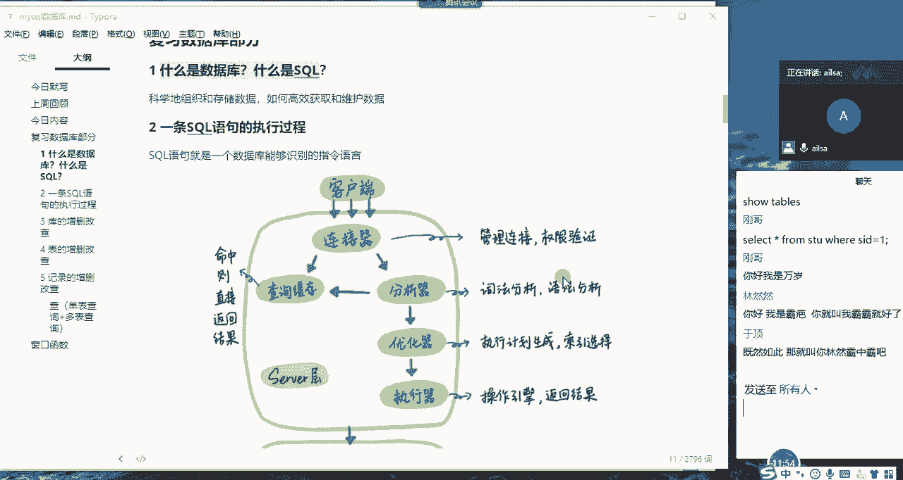

写的是否正确，你比如说你在这里面写select xing from student，然后where你少了一个E唉你看他会报错诶，你这个有have an error in your circle啊。

这就是语法的意思哈，呵呵SNTX是语法的意思。

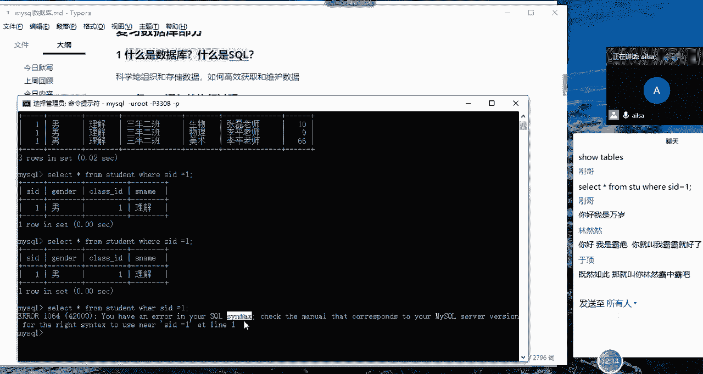

哎你这语法有错误啊，你回去自己再看看吧，相当于是我们走到这里就返还回去了，因为他这边一分析出来你语法有问题啊，所以就给你报了一个语法错误，那如果说你这边啊语法没有问题之后，他接着会往下走。

走到优化器这里，就是它会根据你整个一个select语句，然后它会直它会生成一个最优的执行计划，生成完了之后，它会给到执行器，然后执行器跟存储引擎进行一个交互，就是到存储引擎这边去获取数据。

然后再返回回去，然后一步一步再返回到，我们的整个的一个客户端啊，应该不不是一步步返回哈，就是获取到数据之后，然后就返回啊，直接在执行器这里直接返回给客户端，这样的一个结果就实现了。

那其实这个就是一条SQL的执行的过程，明白了吧，那你比如说存储过程，这里大家应该也学过，就是说我按索引去查找，对不对，假设你的整个的一个VR条件上，索引索引来实现的，那它的查找的效率就会高一些。

就会在这里去实现，如果说而你的索引没有命中它，整个查找的一个速度就会慢一些啊，是在这个过程里面去执行的过程当中去实现的，也就是说执行器走到这里之后，它会给到存储引擎，存储引擎去发动啊。

发动它的能量或者帮它的动能，然后去获取到这个数据，具体是怎么获取的，就是根据B加数的原理来获取的，获取到之后返回什么叫接口呢，就是他给到这个他给到他的需求，然后他返回结果给到这个执行器。

执行器再直接给到我们，我们就获取到我们所想要的结果了啊，大家对于一条SQL语的执行过程都听明白了吗，之前老师有没有讲过，之前老师讲过吗，同志们，讲过不相信，呵呵啊，今天听明白了吗，今天听明白了吗。

哪点不明白我可以再讲，嗯同的吗，是不是没听明白，都没有人说话，啥意思啊，这是还是没听明白吗，没听明白哪哪没听明白，你不能让我再讲一遍啊，嗯都没听明白吗，听明没听明白过，抛出一个问题，然后如果听明白了。

给我扣个一，哎呦什么情况是大家卡了吗，嗯嗯那我再简单的串一遍哈，再简单的串一遍啊，也就是说啊。

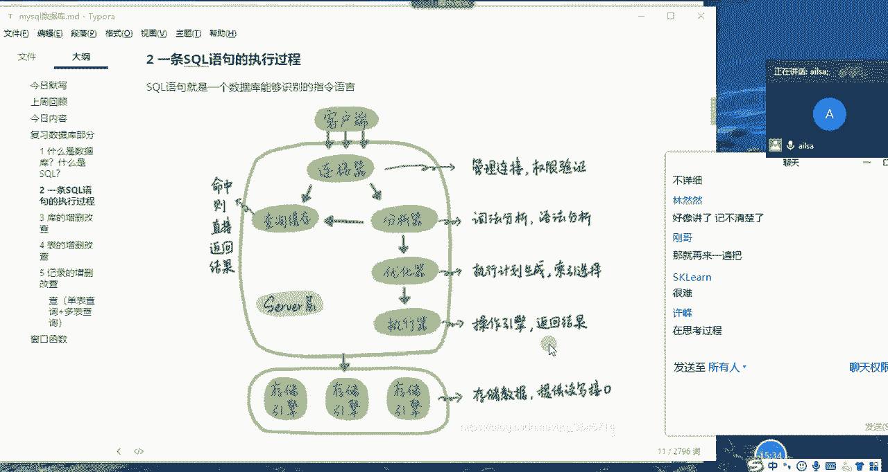

也就是说啊我们作为呃客户端啊，我们作为客户端啊，然后我们发了送了一条SQL语句，叫什么呢啊，叫select啊，X啊，From s t u d n t student，然后where id等于一。

OK我们发送了这样一个SQL语句，然后给到我们的server端啊，通过我们的socket底层，通过我们socket来实现的，给到server端之后，他第一步过来之后，他第一步先分析你的词法和语法。

什么是词法呢，就是select，就是它主要分析的是关键字，select啊，where啊，这样的关键字，比如说update什么等等这些，他先分析这些东西，看你到底是想干什么，大概判断一下你此次来的目的。

然后判断完了之后，他大概知道了你想干嘛之后，然后再看你的一个语法分析的情况，也就是说他看你这条语句写的有没有毛病哈，你比如说你这个select少了少了一个T，或者少了一个E，然后V2少了一个E。

少了一个R等等，这些如果说有问题，他会直接返回回去，告诉你语法在某个什么什么附近，哎有问题，你比如说啊我刚才给大家看了哈，有问题，然后这个时候你走到这一步就已经结束了，但是如果说你语法没有问题。

它会到优化器这里什么，大家不用去太过于深入的去研究这个东西，因为它底层你想一下my circle或者是circle，server和oracle这些，它是一个系统，是一个软件。

是别人在不断地进行优化迭代的过程当中，实现的高效进行数据管理的一个工具，所以说它整个的一个代码含量，比咱们所做的系统要复杂很多，它中间的功能是我们想象不到的，或者说是我们目前无法去探究的。

那它到优化器这里之后呢，它会执行计划生成，也就是说它大概嗯，他大概知道自己该怎么干了啊，比如说我到底啊到底是嗯哪走哪一步，走哪一步啊，所以你的选择，然后就以最优的那种方式，然后去执行。

他自己大概有这样的一个思路了啊，就跟我们做分析似的，我大概的分析思路已经已经已经设计好了，设计好了之后呢，我就开始干活了，哎就是操作引擎啊，就是说我要执行的时候，我是给到存储过程，让存储过程啊。

把我需求给到存储过程之后，存储过程通过它整个的一个呃存储的原理啊，存储的原理，数据存储原理是不是我们的B加数的啊，inno dB就是不B加数的原理，它通过这样的一个存储引擎的操作方式。

然后把数据结果获取到，获取到之后给到执行器，然后执行器返回结果，那它就会返回我们刚才所想要的这个结果啊。

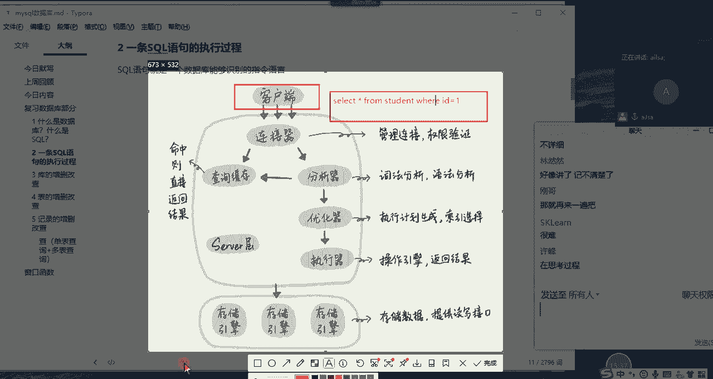

就是我们刚才啊select星from student，Where r s i d01，这样的一个结果就给到我们了，这就是整个的一条SQL语句执行的过程，执行器就是按此法操作存储引擎更新删除进去，哦对啊。

其实这个这个不是的。

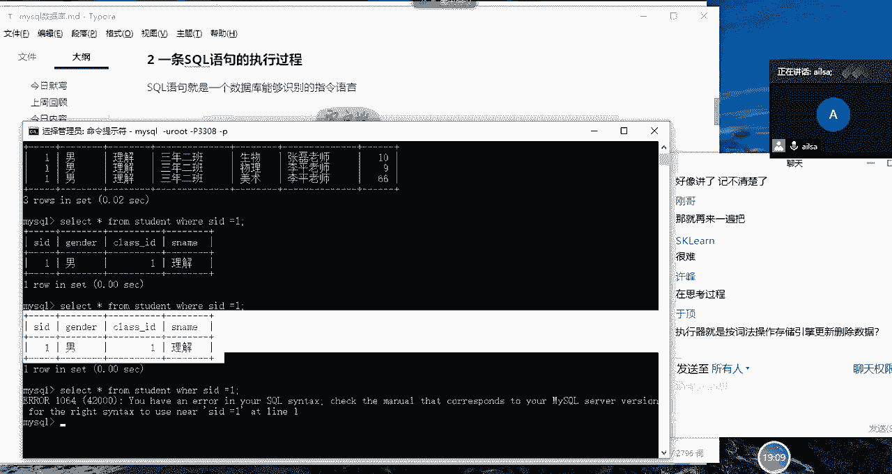

其实这个词法分析和语法分析呢，就是唉怎么说呢，它就类似于啊，它就类似于呃，呃嗯大家都知道我们一条SQL语句的执行，就select的新from什么什么表，where什么什么go或by什么什么。

它是有顺序的，知道吧，他是按照一定顺序去执行的，那这个时候其实就是通过词法分析来实现的，然后他分析一下整个的一个过程，然后按照最优的那种执行方式，比如说你的整个的查询语句，还有联表查询。

比如说left join，Right join，以及内连接整整过程，它它会有一个方案确定到底先查哪个表，结果出来了之后，我再查哪个表，然后这个词法分析，就类似于说我就是先过来之后。

我先看看你整个的一个呃，就是要调用我哪个哪哪些功能，类似于这样啊，就是你到底想干嘛啊，然后我就会在后面的时候，就是说我执行的时候，我就调用我这一部分功能就可以了。

比如说你是过来select的还是过来update的，还是过来delete的啊，这样的一个过程不用去详细的，不用去详细的去探究这些东西，只要知道这样的一个执行过程就可以了啊，你在跟面试官描述的时候。

就按照我这个思路啊，完全是没有问题，而且很少有人去探究，整个一个一个个的操作步骤啊，啊这个明白了吗，明白给我扣个一，嗯同志们没明白又没讲明白，啊明白了明白了明白好嘞好嘞好嘞啊，你就讲比较浅显的就行啊。

底层的咱们也没办法去探究太深哈，OK那我们讲了它整个的一个原理之后，那接下来我们就通过啊库的增删改查，表的增删改查，以及记录的增删改查这三个不同的维度，然后带着大家然后去简单的回顾一下哈。

首先哈首先我们先看库库就比较简单了啊，啊那我们直接就看第三个。

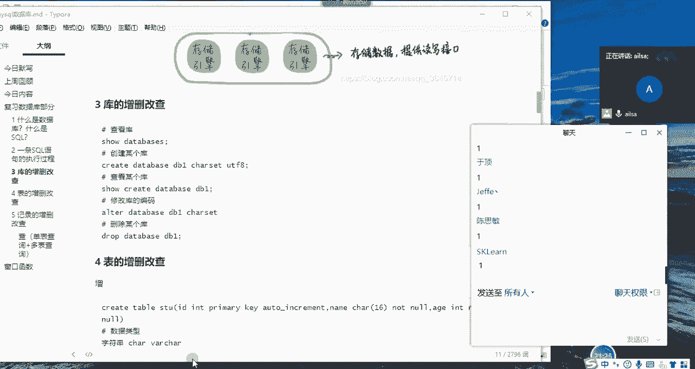

就是说我们如何创建一个库呢，嗯我们如何创建一个库啊，我们都知道，对于DDL的这样的一个操作方式的话啊，create c r e a t e啊，create啊，放这儿了。

对create database哈，嗯create database啊，Database create database，然后是我们的库名对吧，比如说我们要唱day啊，对零一，然后我们创建数据库的时候。

可以指定我们的编码叉set，然后UTF8对吧，我们可以指定编码，也可以不指定，那我们在修改数据库的时候，也是只能修改编码名称是无法修改的，嗯这个时候我们在修data bases。

这should it the basis，就是查看啊所有的库，哎我们看啊，day01已经出来了，对不对，那我们想查看某一个库该怎么去操作呢，show啊，Create，啊然后是day01哎。

是不是这样子的，哎，这样的话，我们就查看了这个call库的一些基本的信息，你比如说它默认的编码是UTF8，这样的查看和创建，然后我们看如何修改，修改的话就是out啊，对于DDL这样的一个操作语句。

就是out修改out data base啊，Database，然后是day01啊，我们只能修改它的啥呀，我们只能修改它的啊，它的编码对不对啊。

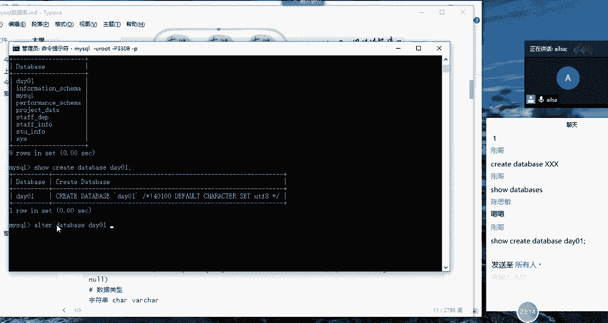

看一下啊啊，outdatabase db1char set哈。

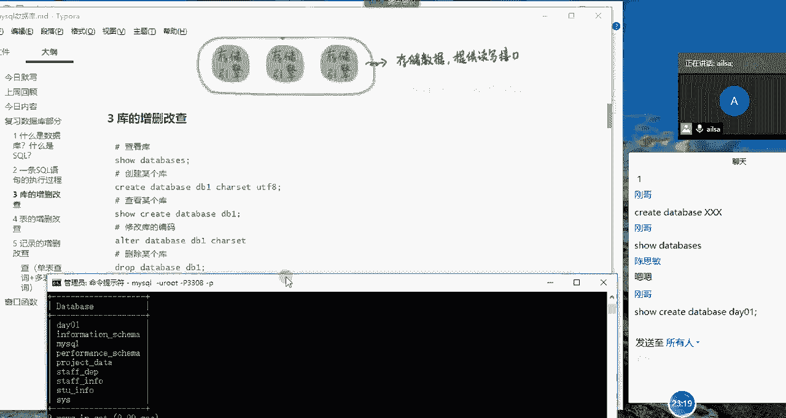

Char set，Char set u t f8，因为我这边只能改成拉丁什么，还有一个是吧，好GBK也可以GBK，OK唉我们再一次修create database dB，201。

这个时候它的编码就变成了GBK啊，那我们如何删除一个库呢，其实就是drop d r o p，Drop database，好database，Day，零一，Drop database day。

零一哪里错了呢，database drop打错了哈，DROPOK啊，然后我们再修修databases，看一下D啊，day01已经没有了，对不对，那这是我们在呃整个的一个终端。

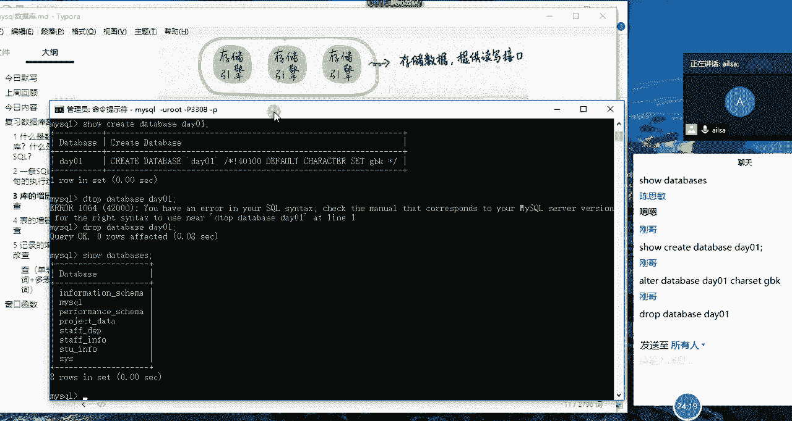

也就是我们的客户端进行编码操作的时候啊，你看大家都还记得哈，说明啊还可以哈，没有忘完啊对啊，那对于整个的一个啊库的啊，数据库的一个操作的话，我们呃新增是create，然后我们修改的话是out。

但我们只能修改编码名称是无法修改的，然后嗯删除的话是drop对吧啊，还有什么增删改查的话是show databdatabases，是查所有的库，然后show create database啊。

什么什么啊，是查某一个库，那这是在终端进行一个代码编写的时候，是怎么来操作的，可以看得出来啊，就是还是需要大家去记一下的。

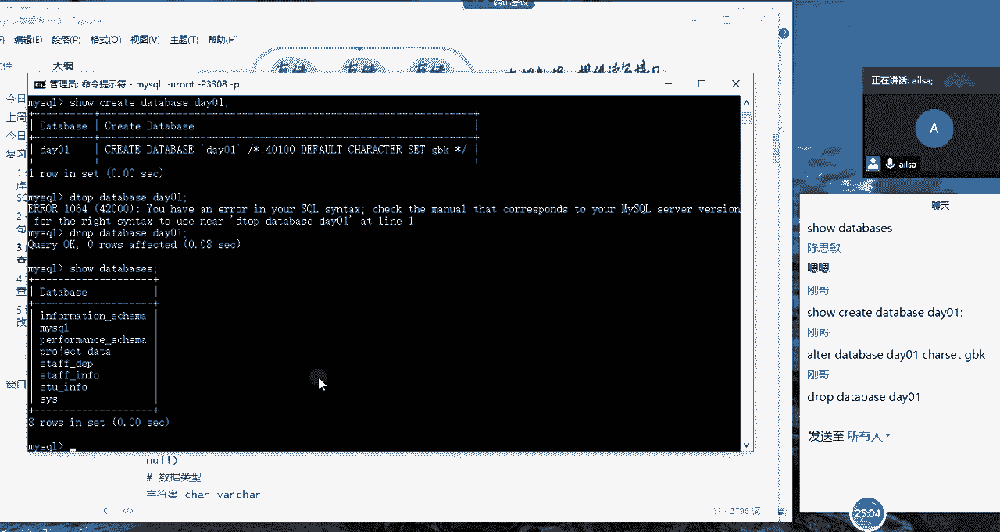

对不对，那如果说是在NAVCAT这样的一个啊，我跟大家介绍一下，navy cat是一个啊是一个开发好的工具类的，关于数据库的啊，这样的一个可视化的啊操作软件啊，所以他就是为了方便我们在工作当中嗯。

工作当中呃，就是嗯就是降低我们编写代码的一个难度，然后提高我们整个的一个SQL编写的速度啊，这样的一个啊这样的一个工具啊，很好用，那我们在哦NAVCAT里面如何创建一个库呢，有机啊新建数据库。

然后把名字一写啊，这个可以选择默认的，也可以自己选，是不是就完事了，非常非常的简单哈，所以说啊所以说我们在工作当中，大家看一下整个难度系数还是比较低的哈，但是为什么说老师在讲的时候。

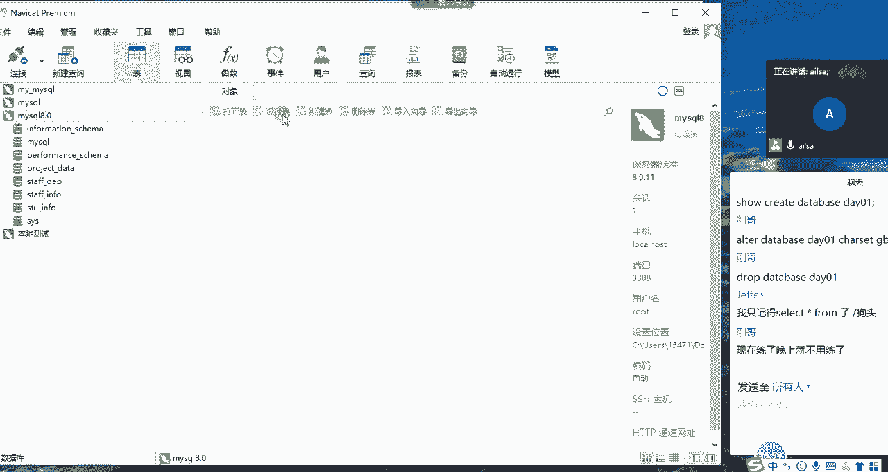

一上来就给你用终端呢，其实就是为了练你哈啊嗯哼对。

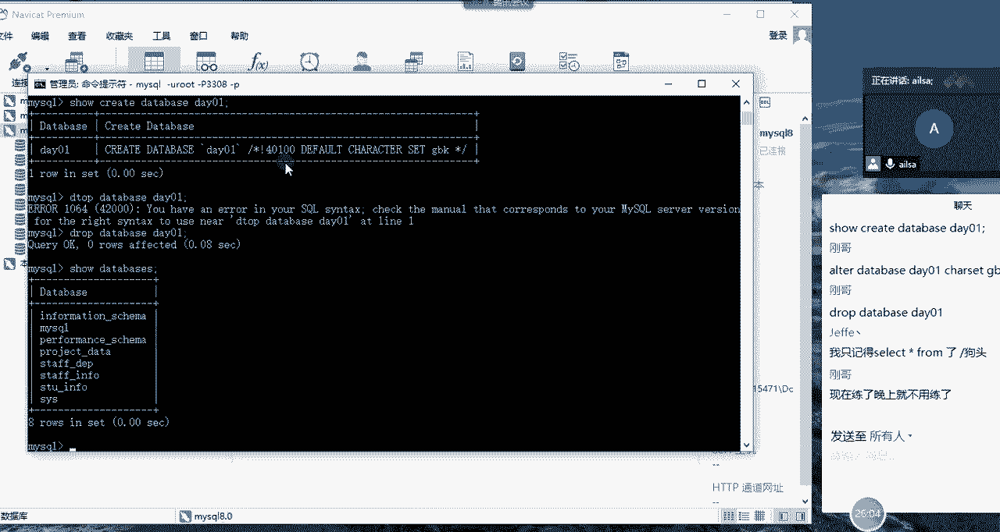

就是为了练啊，如果说你一上来用never cat，你的整个编码你都忘完了，所以说还是要用终端啊，我现在也比较习惯性的用终端哈，呃但是我们作为数据分析师，用NAVCAT也多一些。

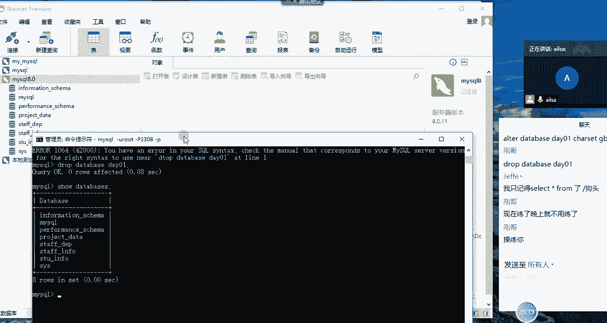

也会有很多公司都在用哈，对就是练你哈，OK那我们这是库的操作。

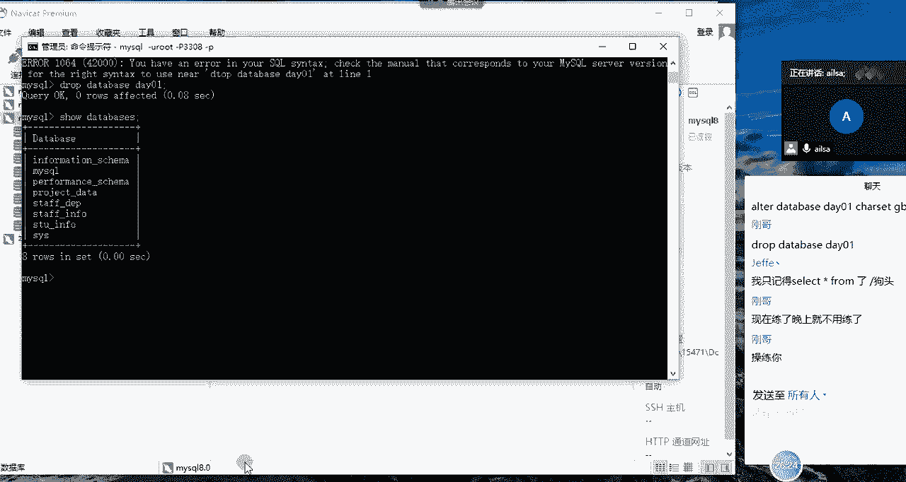

我们就讲到这里哈，比较简单，我们的增删改查也就讲完了。

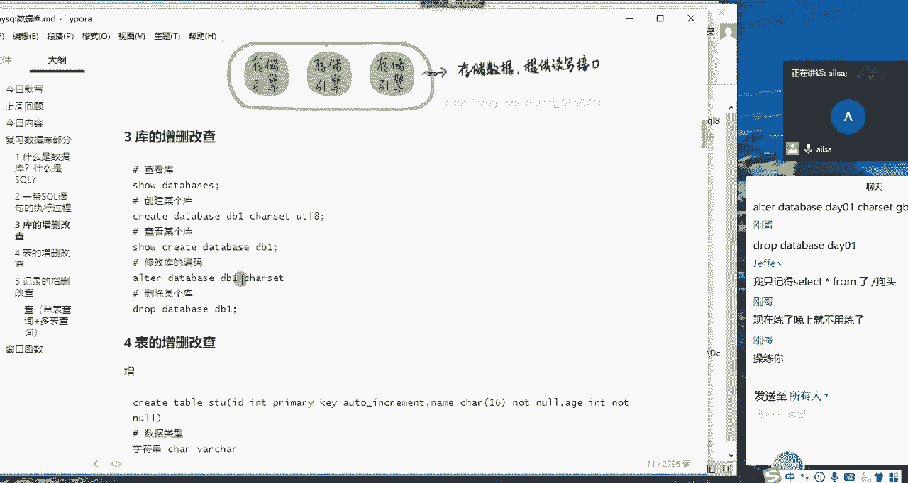

然后我们看表的操作哈，表的操作的话，唉你比如说现在我再新建一个哈，create啊，C r e a t create data base，零一哎我们创建一个这样的库，然后我们创建表啊。

大家现在都可以跟我一起去打这个东西哈，啊不要看笔记哈，create啊table，我看谁写的比较快哈，create table啊啊day01，OK这是创建库create table，然后是表明对吧。

比如说我们创建一个STU吧，student哈表明，然后啊我们后面跟的是字段，对不对，那首先基本上先跟一个id，id是字段名，后面跟它的数据类型，然后再跟他的约束条件。

p r i m a r m a r y primary key哈，我们还可以给它设置成自增auto increment，不知道大家还记不记得哈，auto increment哈，这是自征。

然后我们再设置个name啊，name是char，我们可以设置成差啊，类型基本上16应该够用了哈，然后我们还可以设成age，age是int类型，我们可以给它加个约束条件，not none对吧。

我们还可以再加一个BCE啊，force gdata啊，出生日期它可以是data的数据类型对吧，诶那这么多之后，其实我们就差不多了，哎语法错误我们看一下哪有错哈。

呃near birth这样啊可没有加逗号啊，这个其实啊这个会很常见一些，再加个逗号，然后我们再看OK这already已经存在了啊，我们看一下哈，稍等啊，我用的这个库不是刚才已经删完了吗。

哦刚才已经创建了是吧，Show tables，因为刚才报错，他刚才给创建库了哈，我用的哦，我没有切到哦，我没有切到这个day零一下面，我现在还在嗯这个STU杠info下面，所以我要切一下哈。

yd day01啊，这个时候我再进行创建，OK就可以了对吧，没有一个人能跟得上哈啊都在写是不是，OK大家都可以跟着我一起写哈，我们这个时候再show tables t a b l e s。

OKOK这个时候我已经有ss to这样的一个表了，那我有了这个表之后，唉，我是不是要往数据里面插入数据哈，这就是我们的啊，insert into啊，插入数据，OK刚刚写出来了，我看一眼。

Create table，until i defrout increment啊，不OK没有问题，跟我的一样哈，好那我们接着往下插入数据啊，这他是insert哈，insert啊，into啊。

into表是我们的STU对吧啊，然后如果说我们想每个字段都插入的话，直接写values就行了，我们如果想指定字段的话，我们可以在这里面指定，因为我们的id是自增的，所以我们在这里面就不写了。

直接写name啊，name age对吧，还有一个birth birth gdate，Forth gdate，OK哎这三个有没有加逗号，edge没有加逗号，OK这中文的OK啊，加完了之后。

我们后面是values对吧，values我们可以加啊，什么呢，嗯刚哥啊，然后刚哥的年纪，刚哥是九五的是吧，那应该是嗯嗯25嗯，然后出生日期九五的，那就是2021995，杠02959595995几月嗯。

几月让大家知道你的生日，回头记着一下，暗恋的人可以给她过生日了，刚哥几月的2月30啊，跟我妈最近202啊，谁认识刚哥的，一定要记得他的生日哈，啊阴历阳历啊，日期是不是要加双引号，好像要加双引号。

1995杠，不加双引号吗，我试一下哈，杠哦，2月30啊，我们先我们先弄一个哈，弄一个进去试试，OK啊，出了问题，VR values v a l有values v ALU e s，这写错了。

所以他报语法错误的时候，你要看它VA，Oh you，Yes，OK又错了，是在bss data里面错了，那就是不加双引号，没关系啊，我们报错的话就去找原因就可以了，OK又错了。

On burst gudata，我写错了吗，2月没有30号，对呀，2月没有30号骗子，我看啊，先别着急，19values increment，1963，哦不好意思，2月28先，哦1973，我看看啊。

1973four birth，boss刚data，我看看我的表DDISCDSCITU，看看啊，大家找一下引号的问题吗，加引号吗，不是不加吗，我加了吗，我没加呀，我看啊稍等一下，OK啊那嗯好嘞哈。

那刚才报错的这个原因是，因为我们在输入日期的时候，是要加上双引号的啊，所以说啊刚才一直报错哈，OK现在就可以了哈，我们插入了两条数据，因为这里我们的主键是我们的主键是id，所以说它会自增啊。

然后我们再查询一下数据哈，嗯select，Ok set to you，然后看一下是不是两条数据已经进来了，那我们插入数据这样的一个呃，语法就是insert into啊，表明然后就是指定的字段名。

如果不指定字段名，就默默认是全部都有，你后面都需要填，如果你指定了部分字段名，你就只只需要填部分就可以了，然后带一个values啊，这是我们的插入数据。

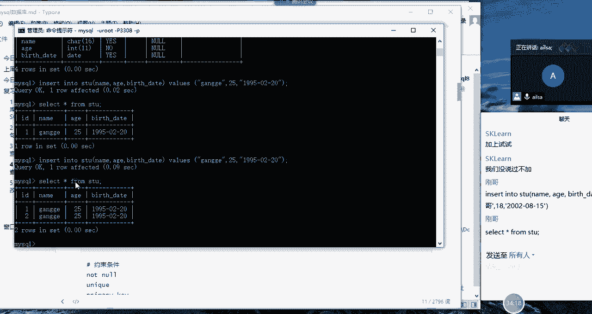

然后嗯那我们创建啊，创建表了之后，那接下来我们看哈啊，那我们在创建整个表的过程当中啊，我们会发现我们需要啊，需要回顾的有两个知识点，一个叫数据类型，一个叫约束条件啊，那对于数据类型而言。

我们啊应该讲了大概这么几种哈，一个是字符串叉和挖差，我在这里面就不举例子了哈，因为之前已经讲的很详细了，然后整形是int啊，小数呢是float，DESEAL和double double啊。

一般情况下用的是float，然后它的组成的话是这样的，一定要记住这一点，首先第一个组成部分是它的它所有的啊，数字的长度，你比如说我写了一个五，然后小数部分你写了一个二代表总共长度是五，小数部分是二。

那也就是整数部分为三嗯，然后第3M的话，它实际的本质存储内容是字符串的形式，所以说它能够实现非常精确的一个实现效果，但是我们也不需要实现这么精确哈，那double跟float相比而言。

double更精确一些，但是我们也不需要，所以说float足够了啊，在我们的啊，在我们整个的一个数据存储当中，float足够啊，那日期呢我们分date和date time啊，这两个就没必要去讲了啊。

date的话就是到日期，date time就是日期加时间，那还有一个枚举in new enne，还有一个set，两者的区别在于一个是单选，一个是多选，也就是啊，你在如果他设置的是set里面的类型的话。

他可以选择其中的呃，任意多个啊，一个两个三个四个都可以哈，那ENNE呢它就是只能二选一，你比如说性别哎，你就可以用这个类型，那你比如说爱好，你就可以用这个类型哈，用set类型。

set本身代表集合的意思哈，还ENNEW是枚举的意思，OK这就是我们的数据类型，那在对于数据类型而言，常考的就是我们的字符串啊，字符串呢分叉和挖差，那它两者之间有什么区别呢，首先第一个啊就是它的啊。

它的一个呃存储的呃存储的长度吧，我们可以这么去理解，一个是定长，一个是不定长，什么意思呢，那差他如果说嗯都是，比如说你指定的是同样啊，同样二者啊，假设二者指定的都是六哈，二者指定的都是六。

那它们的区别在于什么呢，那差这里面如果你的内容是小于六的，那他也会按六去存储，不足的会空格去填充，那挖差呢它是按照实际的长度去存储的，比如说你这个是三，那它要存储的是三啊，它要小于六的话。

它是存储的实际的长度，那二者如果说存储的内容都大于六的话，大于六的话，如果我们设置的整个的一个circle mode哈，circle mode哈，我相信你们还能想得起来哈，SQL杠mod。

也就是我们的模式如果是严格模式会报错，如果是模糊模式，它就会截断自己回去再看看啊，SUPERMOOD哈，会截断啊，会截断，也就是说模糊的这种话，他就认为你只取前半部分就可以了啊，那第二个区别在于什么呢。

它的存储的底层原理，那差呢它其实就直接存的是内容，那挖差呢其实它分了一到两个字节，给到它实际的存储的长度啊，你比如说它前面一到两个字节存储的是啊，这个内容是三哎，设四或怎样。

然后给它一定的长度的一个存储，以便它按照它实际的一个长度去存储，那I2者最终啊效果上啊对爆头，那没问题哈，那二者最终效果上有什么差别呢，差更快啊，挖差更节省空间啊，这只是相对来说哈。

只是相对来说没有绝对的，如果说你的内存不不足或怎样的时候，你可以使用挖差，如果说你追求效率，你可以使用差，那以目前的一个啊条件来说啊，磁盘的内存已经不是一个问题，所以说越来越多的人采用差。

作为我们整个的一个效率提升的关键，然后也就是所谓的嗯一啊空间换时间啊，以空间换时间来发展我们想所想的效果哈，这就是我们数据类型，我就介绍到这么多，然后约束条件我们讲过的有not none啊。

就是不为空啊，unique唯一也就是驱虫的操作，那primary key也就是我们的主键啊，foreign key是我们的外键，对于主键而言，它跟索引哈，它跟索引密切相关啊。

那跟索引相关就会跟查询效率啊密切相关啊，啊所以说大家知道这个啊，你相信也都已经讲的很详细了哈，所以说我在这里就不进行一个详细的讲解了啊，那这就是我们对于新增而言啊，表的新增而言，我们需要掌握的内容。

那对于差和挖差的区别，我刚才也已经讲过了，好吧，OK那我们看一下表的操作哈，啊我刚才啊表的更改操作哈，我们新增啊是create，那我们修改一个表，唉，那就是还是AL哈alter哎我们来试一下哈。

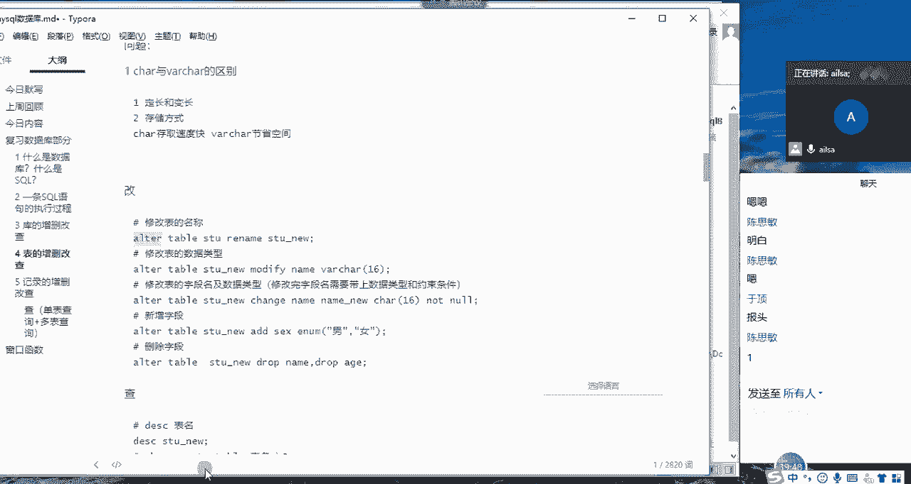

嗯比如说啊现在我只修改哈大的，我因为表的操作的话，可能很多人记得不是特别清楚了哈，啊比如说现在我想修改一个表的嗯，这个表的数据类型指修改啊，它的数据类型应该用什么out table哈，STU啊。

只修改一个表的类型，我们用model y m o d i f y对吧，Model fy，然后比如说我们想修改age的数据类型啊，我们修改它为差二哈，假设哈我们修改它为知符串，然后差差几呢，差四啊。

这样应该是可以的吧，嗯我们看一下啊，我们的设计的应该是没有问题的，然后我们按按键试试，OK错了哈，我们看一下我们最开始设计的，它的整个的一个嗯age啊，它还有一个not none哈。

因为我们在这边修改嗯，应该不至于吧啊model fy可以修改它的数据类型，需要加上not now吗，Uum o d i f y。

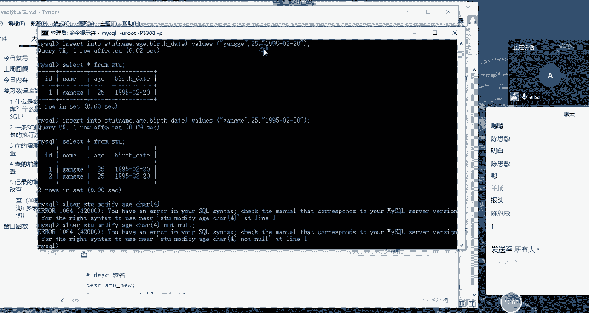

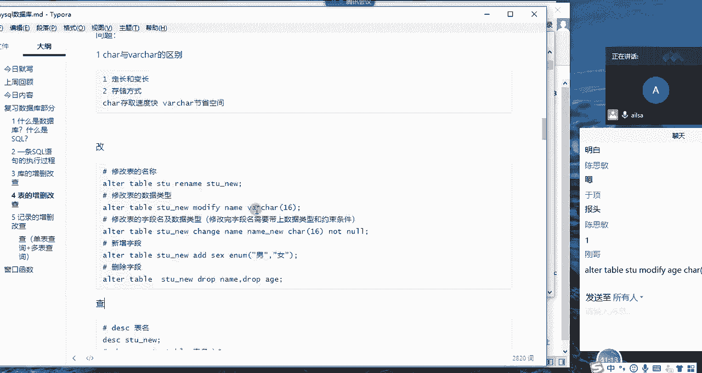

Alter table，Model m o d i f y，我看哪错了table，然后要加上table，sorry啊，out table啊，我以为是table名，我说呢out table啊。

我们要加上table啊，跟alter database是一样的哈，Alter table s t u，那就是我们的表明，然后model y，然后后面是我们的字段，然后是我们的约束条件A啊就可以了。

这个时候我们再看d e s c table，好table，D e s c，How to you。

查看表的查看我都不会了吗，DSC哦。

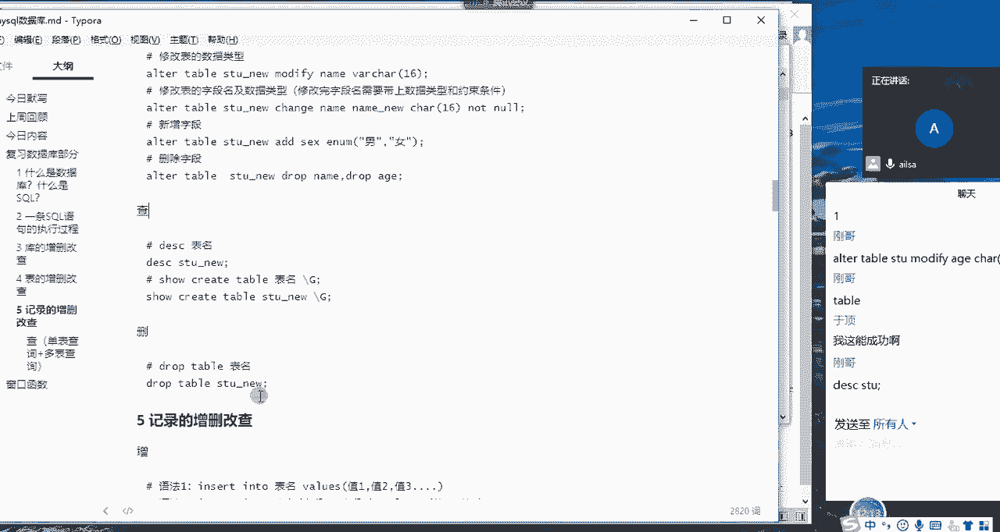

不用加table，我被你们搞混了哈哈尬的一批啊，OK哈DNC表明就行了哈，刚才少加了个table，我现在又一脑子里只有table这个词了哈，OK我们再看一下这个age的数据类型，是不是改成了叉啊。

那这就是我们第一个改，我们的数据类型的操作哈，那接下来我要改字段名诶，或者是啊加上我的数据类型，或者不加我的数据类型都行啊，这个时候我应该用哪个啊，哪个单词，大家想一下，我要改整个的一个字段名了。

out table哪个单词不用打全字了，out table奥特曼，i t u change哈，change是可以改字段名的，而MODEFY呢它只能改数据类型，我不知道当时你们老师讲的时候。

有没有区分过这个哈，因为我自己确实是试了试，发现确实是这样哈，Change，比如说我现在啊改我的age哈，改成age1啊，我试一下是不是这个哈。

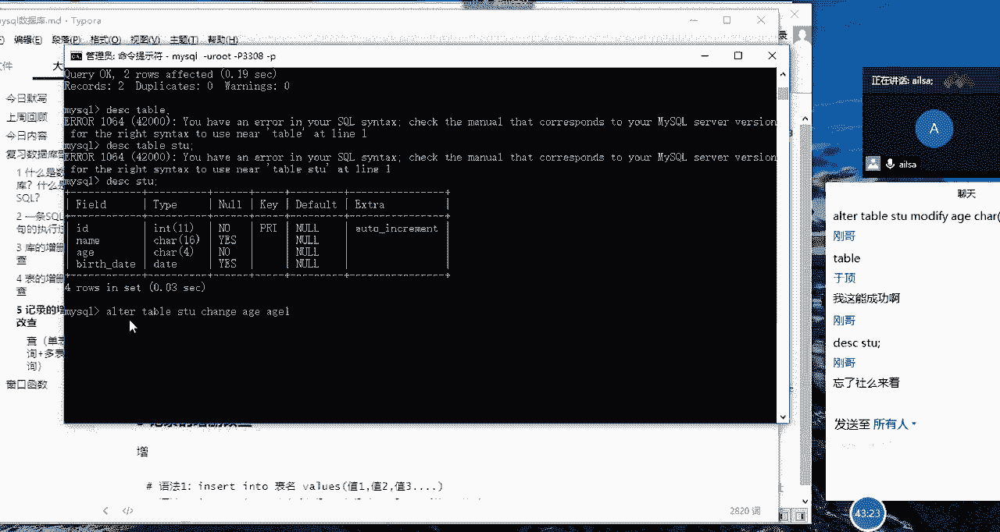

现在我只改啊字段名。

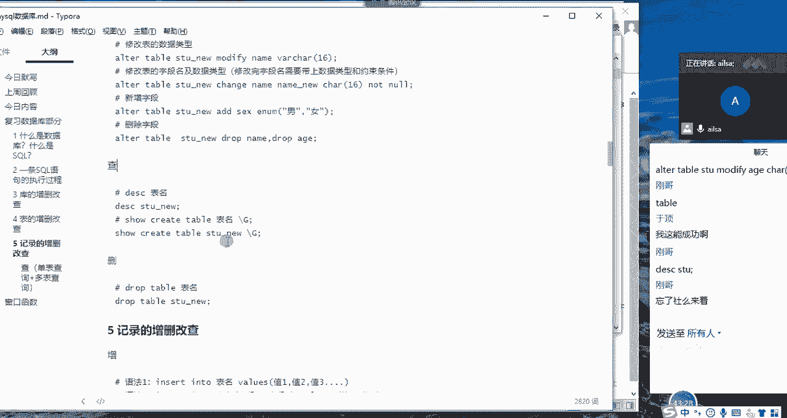

change我要指定它的数据类型才行吗，啊我们这边把它改成int ok是可以的哈，那也就是说你要改它的一个字段名的时候，你要指定它的数据类型，然后如果说你指定一个新的数据类型，代表你改了它啊。

就是连字段名和数据类型都改了，如果说你要指定原来的数据类型，相当于就是说你只改了它的字段名数，类型还跟原来的保持一致，但是你需要写上啊，你需要写上啊，因为你不写的话，你看刚才不写，它就报错了哈。

它报错了自己可以会试一下，因为这个确实是用到的不多哈，我们主要用到的是表的查询哈，我看我今天能翻几次车哈，烦的我都出汗了，OK啊这是我改表的字段名啊。

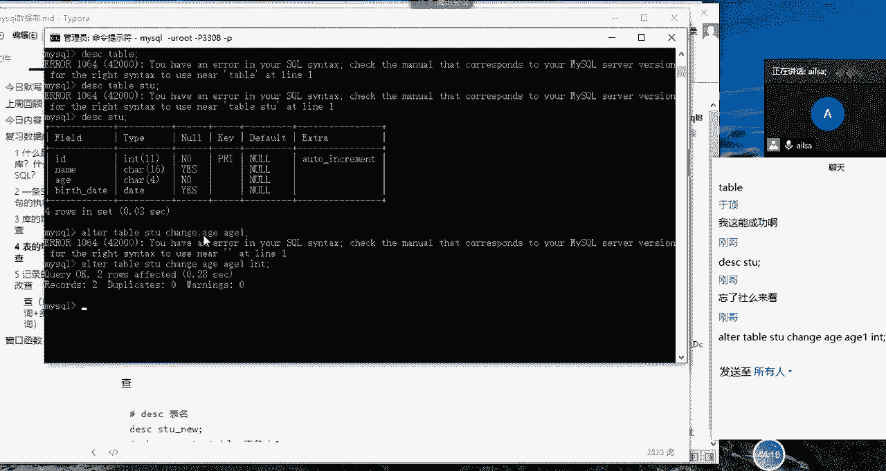

然后以及我的数据类型，那接下来啊，我们还可以对表进行一个新增字段啊，新增字段的话就是挨着啊添一个字段哈。

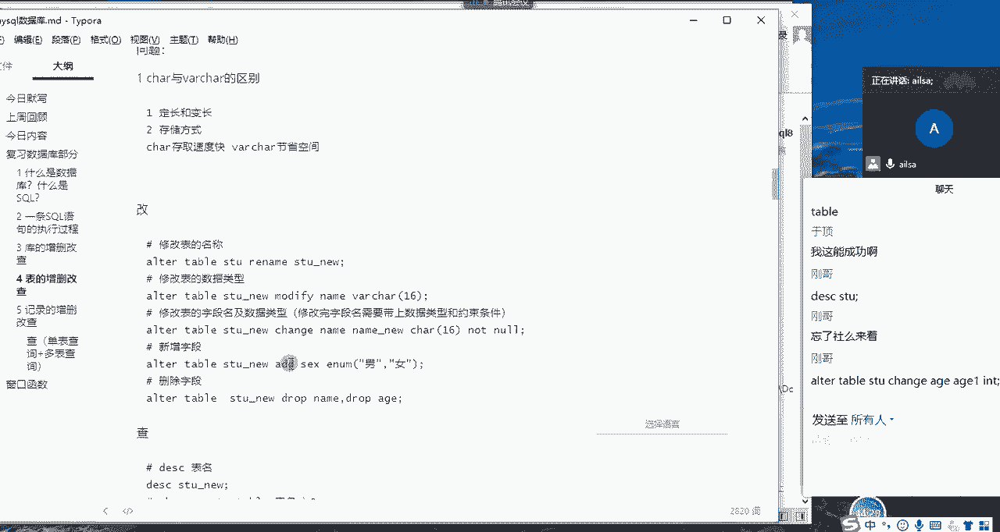

比如说现在alter table table i t u，然后ADDADD哪个呢，我们添一个，我看添一个sex是吗，添一个sex啊，然后嗯这是我们的字段名，它的类型是我们的枚举，然后是男女吧，男，女啊。

OK我们试一下哈，OK可以了，这个时候我们在DNCITO哎啊。

这边的话S嗯，那个它整个新增一个字段名就出来了啊，这是新增一个字段名。

那我们删除呢啊，删除一个字段名，就是还是我们的drop哈，alt table啊，Table s t u，然后drop啊，我们把刚才那个字段名删掉，也就是sex试一下，哎这样就可以了。

然后我们再DIC看一下是不是已经删除了，那其实这就是表的啊，一个呃就是修改的话，我们可以新增，然后我们可以修改修改它的哦，字段名，修改它的数据类型啊，求数据类型啊，还有个默认是没有问题的。

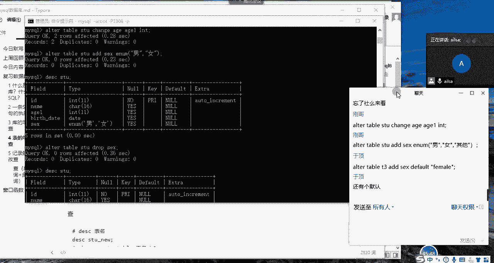

对有个default是默认的，OK呃那这是修改操作，那接下来我们看一下查的操作，查的操作主要有两个，第一个就是我们常用的DC。

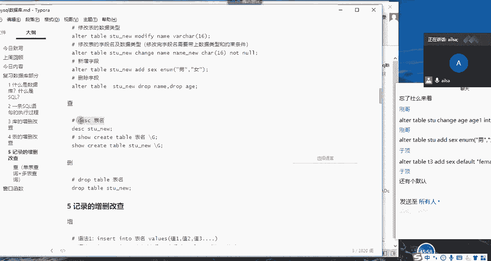

那第二个的话就是show create table，表明哈这个跟我们的数据库是一样的，show create table啊，STU啊，这个时候我们看一下唉，大概出来这个结果不好看对吧。

我们还可以对它进行一个格式化，或者是那个内容的优化，就是杠G看一下唉，这样的结果就出来了，对吧啊，这样的一个显示啊会更加的规范一些，我们可以看到它那个内容会更详细一些，包含它每一个字段的数据的哦。

类型约束条件，以及它的存储引擎，还有它的哦，它的啊编码对吧啊，它的编码这样子嗯，自征啊，自征啊，大概是这样啊，这就是我们查看一个表的结果，那删除一个表啊，删除一个表就是drop啦。

Drop table t r o p d r o p，Drop table s t u，OK啊就删除了，那我刚才所有的操作就已经完事了哈。

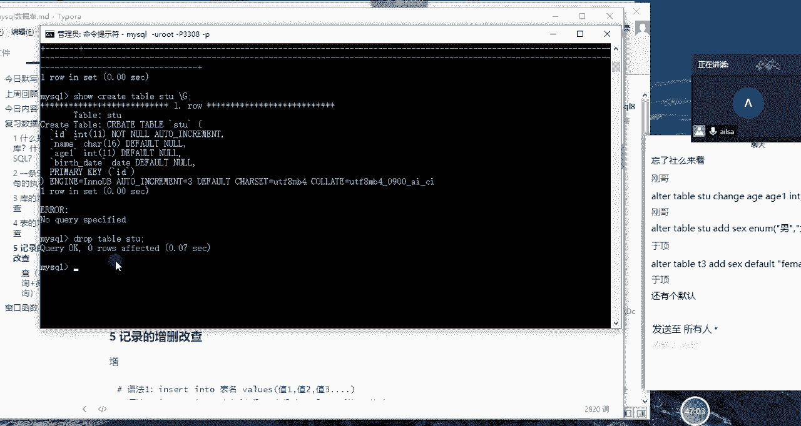

增删改查，我们再看一遍嗯，那额就是先看呃，新增的话就是create create table对吧，就怕这人就大街上，OK我们新增是create table，然后修改的话就是out table。

然后我们可以改表的数据类型啊，我们还可以改表名哈，rename我可以改表名rename，然后改改表的数据类型是model fy啊啊，然后改表的字段名和数据类型是change。

但是改的时候需要带上数据类型和约束条件，你看修改完善就需要带上数据类型和约束条件，说明我当时在自己做测试的时候，应该是踩过这个坑哈，然后新增字段是ADD otable ADD。

然后删除字段是out table啊，out table表明，然后drop啊，drop一个字段逗号，再drop一个字段，两个字段都可以删掉，这样的一个结果，那ADD其实也一样哈，他在里面可以加个逗号。

然后再ADD啊，新增这样的一个内容哈，不是一下子可以ADD多个哈，你要单独添添加一个A1个A的，新增一个啊，这样的一个结果，然后查询的话就是DC表明，然后修curt table，表明杠G这样的一个结果。

删除是drop drop table，这个就比较简单了，那以上就是我们库和表的操作，相对来说还是说比较简单一些哈，其实难点在于记录的增删改查哈，难点在于记录的查哈，增删改都不难哈。

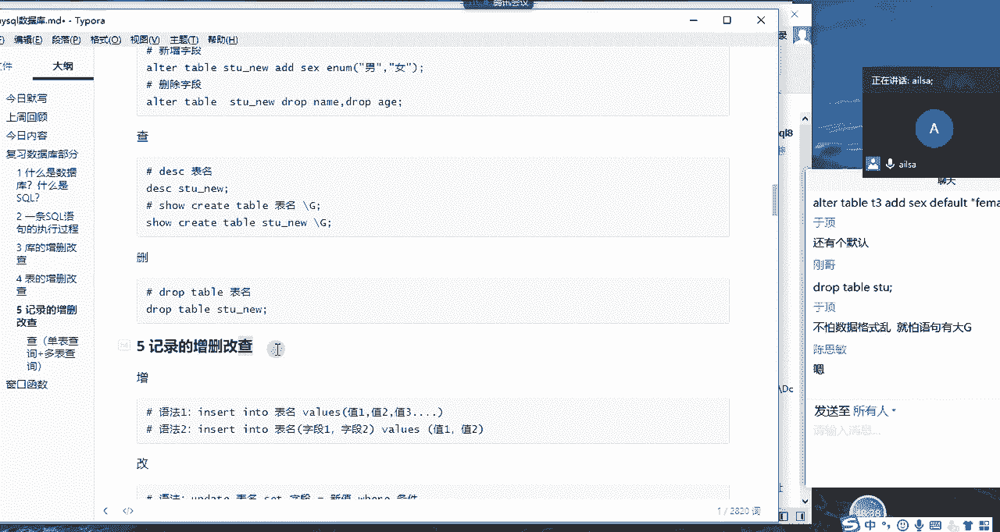