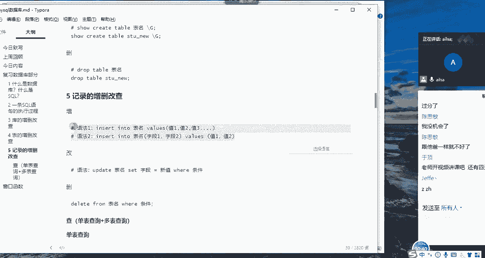
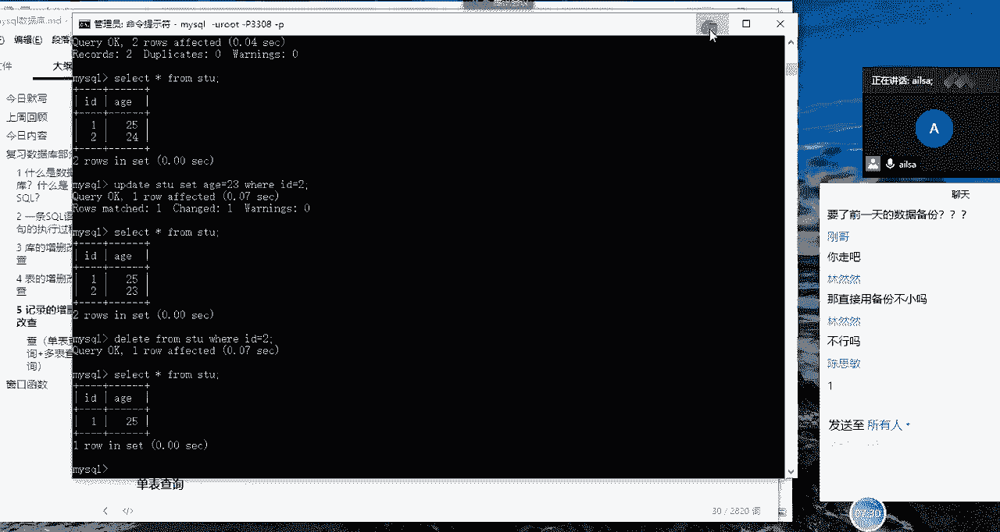
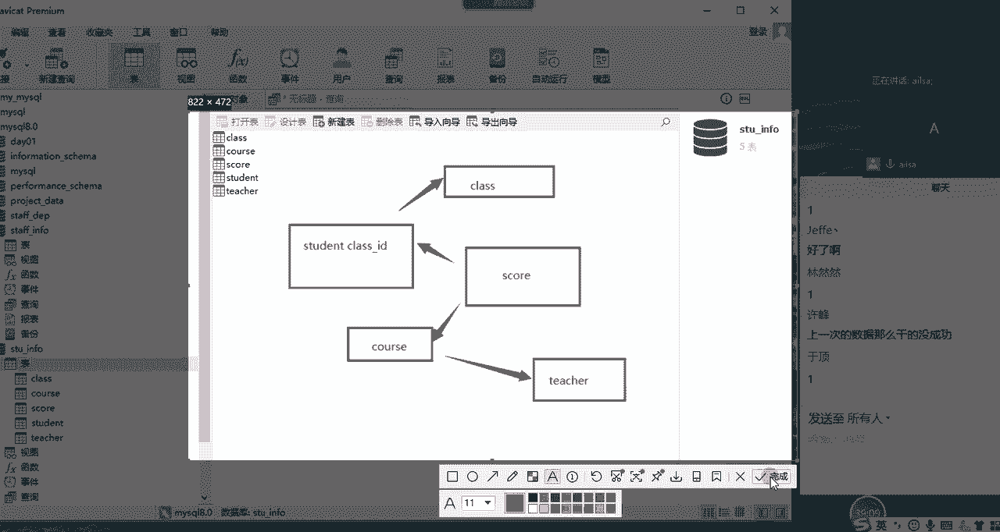

# 强推！这可能是B站最全的【Python金融量化+业务数据分析】系列课程了，保姆级教程，手把手教你学 - P73：05 mysql 窗口函数引入 - python数字游侠 - BV1FFDDYCE2g

好那接下来我们讲解啊，我们讲解表的啊，表的查询哈，什么表的查询，我们讲解记录的增删改查哈，记录的增删改查啊，增改删都好说啊，主要是查查这边会比较复杂一些，所以我们会分为单表查询和多表查询。

我们先看记录的增删改，查记录的征啊，我们刚才讲过了哈，insert into表明values，这是一种写法，就是说默认所有的字段都加上内容，第二个就是insert into表明，然后字段指定字段嗯。

好values，然后之一之二之三不能这样子的一个结果哈，这个字我就不讲了哈。

第二个改哎，我们说一下改哈，嗯我把表删了是吧，OK哈我真厉害，哎呀我的妈呀，没关系哈，我们把刚才的内容再学一遍哈，create database啊，创建一个数据库叫day01啊，Day01。

Create database，Day01，Can't create database day，定义好，因为存在哈，那没关系，我们就use the day，定义啊，好我们先看一下它有表没。

Two tables，OK没有表是吧，然后我们create c r a cretable s t u嗯，那我们创建一个id int primary key，PRMLY啊。

Prime p r i m l y primary key，然后加上一个age a值是int，OK我们只要两这两个字段哈，OK我们创建了一个表，那接下来唉insert啊，into啊STU。

然后我们插入内容一啊，然后name叫刚哥哈，刚哥啊，这是一条记录，如果我想插入多条直接逗号，然后再来一条就可以了，啊啊哦二，然后是4米哈，思思啊，Ok，为什么没有人提示我忘加values的。

我这个values values ok，哦它是int型啊，我写成了字符串，他没有name哎，OK那好吧，没关系哈，我们直接干个25嗯，然后思思是思思应该是24吧，OK可以了哈，我们select新什么。

Select thing from stu，我们看一下哈，哎内容是有了哈，哎刚才思敏说他的呃年龄我写错了，对不对，那现在我想更新一下这条语句，那就是update。

然后我们的表叫s t u set set什么呢，age等于23对吧，然后我们要更新哪条数据呢，VR啊，id等于二的对吧，这条记录啊，因为思思的id为二，哎我们看一下是不是更新成功了，然后我们再进行查询。

A这个数据就变成了23哈，对这就是update一个最简单的更新方式，set age等于啊，然后where给定一个条件，我们在进行更新操作的时候，包括删除操作哈，大家一定要记得啊。

最好是先把where条件写好啊，不然的话你把整个表都更新了，而且它更新是一次性的，是什么意思呢，啊就是你没有撤销这个功能哈，你更新了就是更新了，你数据就是改完了，然后你想改回来就很麻烦了。

那如果说你在工作当中误操作了，真的你把所有这个表的所有的A值都改成二三，该怎么办呢，赶紧找你的DBA，因为他每天都有数据的备份，然后去跟他啊，向他请教，赶紧把这个事情告诉他该怎么去解决啊，一定要及时哈。

这个数据对于公司来说影响非常大啊，知道了吗，知道吗，而且而且还好，而且对于我们整个数据分析师而言的话，更新啊，像这种更新操作，删除操作等这些的话，我们的权限是有限的哈，在很多情况下啊，在很多情况下啊。

就是呃我们整个的呃权限是在一定范围内，而且有很多时候，我们是没有更新和删除操作的哈，老师干过没，老师没干过，老师的徒弟干过啊，我带的徒弟给我干过，哎呀我的妈呀，那个搞了一个下午啊，差点没被领导骂死哦。

对我干过一回，我干过一回，我想起来了，我有一回啊改数据库，然后啊就是就是那个条件啊写的不够啊，不够，具体也就是改的改偏了啊，就是就没有全部啊都改，而且是改了其中一部分，然后还好我有判断条件。

就是我可以根据其他的列，然后再给他判断回来啊，所以说我当时本来说那那件事情，5分钟就可以做完，然后我为了改回来，我花了两个小时，而且我还专门把然还跟DBA要了，前一天的一个数据备份。

然后还进行了数据的核对等等这些，然后发现没有问题了之后，然后我赶紧又跟领导汇报了一下，我跟他说，我这边有个误的操作，然后我这边已经修改好了，马领导说那修改好了就没事啊，不然的话哎吓死个人啊。

然后我们删除操作就delete哈，delete from表啊，一定要加where哈，一定要这叫清除表哈，清除表的内容哈，delete delete from表明，然后VR id等于二。

比如说把私密的数据删掉，哎，哎这样就可以了，你要不加where的话，整个数据就已经全部都清空了哈，全部都清空了，直接用备份啊，是这样的，是因为你在因为你看你家，假设你是当天早上去做这个操作的话。

它它基本上也是可以的，但是你这个数据库里的数据一直在跑，它不是说就是说昨天的数据就是最新的，因为他今天就，你不可能一大清早都过来修改数据，你一般都是上午的10。11点，或者下午的三四点钟。

这个时候监听的数据已经进入一部分了，好这个时候你在进行，如果你用昨天的话，今天这一部分更新的数据你就用不到了啊，所以说肯定要进行数据核对的啊，而且这个到底用哪个的数据，然后怎么找回等等。

这些还得啊就是跟DBA，就是跟我们的数据库管理员一起，还有领导一起去商量啊，怎么怎么怎么去弄，所以说会麻麻烦一些啊，但是在我们公司还好啊，一般我权限没有给那么大，嗯那这个表的啊，呃蒸啊删啊。

这样改这样操作我已经讲完了，下面我讲查哈。

查这个操作啊，我们分单表查和多表查，接下来大家就跟跟着我一起来去操作哈，我等会会把数据发给大家，然后你们啊在自己的8。0上，我们直接在八点上去演示哈，那在这个查询之前，我先说一下我们的关键字。

以及我们的查询的语句，好吧嗯，带大家去简单的回顾一下，那我们的语句就是select啊，就是这个distinct是我们的查重对吧，驱虫，然后字段名，然后from表名，where条件，go by按什么分组。

heavy啊，分组后的条件筛选，然后order by按什么排序，然后limit你到底取几条数据嗯，那它的优先级是什么样子呢，首先呢他会先找到哪张表，比如说你是呃查s st表。

他会先找到根据from找到这张表，找到这张表之后，根据你的VR条件去筛选出这个表的部分数据，筛选出来完之后，如果你用group by，它会根据group by进行一个分组计算。

计算完了之后才会select把最终的结果查询出来，根据这个查询的结果进行一个查重，进行一个条件的过滤，还要进行一个数据的排序，进行一个到底提取多少，前多少条数据的一个limit的限制。

也就是说这就是他查询的优先级嗯，那根据这个优先级，我给大家出一道面试题，就是为什么heavy后面可以跟聚合函数，而where却不可以跟聚合函数，现在大家来回答一下，在我们的聊天里直接打出来就可以。

为什么为什么having后面可以跟句号函数哎，Well well，不可以，想一想，嗯还有其他答案吗，其他人呢嗯via只能查数据库，having是在查询前面出现的字段，包括别名，没有说到点子上。

我知道你想表达什么意思，where没有结果，where你写where后面跟据和函数它会报错的，大家一定要说到点子上，嗯这个有可能会面试的时候就会问，其实我们都知道什么意思啊。

但是你们却没有get到这个点，为什么呢，首先你想一下啊，我们先确定啊啊啊，你你其实想表达的意思，还没有在点子上想表达的意思，首先第一个我们的VR条件，它只会针对数据库当中单条记录而言。

也就是也就是那个建号所想表达的，只能查数据库啊，只能查数据库里面的字段啊，它其实指的是它只能查数据库里面一条一条，对于数据库里面，一条一条的数据进行一个过滤啊，原始数据进行一个过滤，这是第一个原因。

第二个原因是因为执行顺序的问题，你想一下啊，VR是在格尔不败之前进行执行的，那只有GRY分组了之后才会出现聚合函数，那在这个之前它是完全没有聚合函数的，你在这里面使用聚合函数肯定是不对的。

那having呢，它其实是在它就是跟GRY进行一个联合使用，它就是针对分组后的数据进行一个条件的限制，它就可以使用聚合函数，也就是说为什么having后面可以跟聚合函数。

第一个原因是因为执行顺序的问题啊，V2在格Y之前，那聚合函数一般都是对于啊，你想一下什么叫聚合函数啊。

什么叫聚合函数，我们做数据透视大家都知道吧，啊数据透视大家都知道，这是一条一条一条的记录，比如说这个记录的啊啊记录的姓名吧，name啊，姓名稍等哈，这是记录的姓名都是张三啊，都是张三啊，都是张三。

我们对张三进行一个分组，那在分组之前我们就执行了VR，因为先把这个表查出来，他对于这里面的啊，对于这里面的每一条啊，每一条记录进行一个条件过滤，比如说他这边过滤的条件是where啊。

比如说这边有个number哈，这边有个number，比如说where are number，大于好大于二诶，第三个是等于一，那第这条记录就不算了，对不对，它过滤的是数据库当中一条条的记录。

那这是第一个原因，第二个原因就是好，第一个就是因为它执行顺序在grl by之前，所以说它不能哦使用聚合函数，第二个就是having是在group by之后，它是可以使用求和函数。

因为你group by了之后，你是对整个数据库的结构，数据库表结构发生了变化，它直接把张三变成了一行啊，他把张三变成了一行，然后后面比如说跟的整个的一个结果是啊，结果是三啊，假设哈计数哈结果是三。

那那你想一下where，他根本就找不到这条记录，因为在他执行这个之前，他也是都没有，所以说是这个原因嗯。

啊这个嗯我看一下大家说的哈，VR是在分子OK没有问题，私密表达的没有问题，VR是在分组之前的条件筛选，它只会针对数据库的每一条记录进行筛选，那heavy呢是在分组之后进行筛选。

它是针对grp by之后的啊，那个呃的条件进行一个二次过滤，唉这样就没有问题了啊，就是就是很明显就是因为执行顺序的问题对吧，所以我为什么会放在这里给大家讲这个面试题，就是因为我们刚才说完了这个执行顺序。

唉，是这么这么这么来执行的，那你说这个问题之后，比如说你说是因为执行执行顺序的问题，然后把私密刚才这个话说完了之后，你可以再加上一句，你说在数据库当中哈，在MYSQL数据库当中。

那它的执行顺序是从where where，然后from哪个表，然后where查询哪个条件，在这个基础之上啊，过滤完我们想要的结果之后，再进行一个gf by进行一个having的呃，分组后的数据条件过滤。

然后order by的一个排序，以及limit的一个前多少条的限制，这样的一个执行过程，你可以再总结一下啊，那通通过这样的一个过程而言呢，我们就知道VR它是在分组之前的一些操作。

那KEVIN是在go by分组之后的操作，所以说having后面是可以根据和函数，而where不可以啊，这样的一个完整的逻辑就表达出来了，说明你不仅仅知道这个问题的答案，而且你对于数据库当中啊。

这样的一个执行顺序也是了解的明白了吧，一定要把我们整个的一个东西说的完整一些，OK哈那我就不说这个了哈，接下来我们就看单表查询哈，我先把这个数据发给到大家，这个数据发给了大家。

然后大家进行一个呃数据内容的创建哈，可以在navy cat里面执行哈，知道怎么执行吧，执行完了之后给我扣一，然后我接着往下讲，大家可以打开NAVCAT，然后把整个啊可以建一个啊，我想想我建哪了。

应该在这里啊，可以建一个啊，我们的查询，然后新建查询指定你的整个的一个数据库呃，就是我们的server端，还有我们整个的一个库，然后把整的语句往这一粘，然后一执行啊就可以了，嗯如果数据已经好了。

给我扣一，我接着往下讲，OK那我说一下这道题该怎么去操作啊，重新讲一遍哈，嗯首先呢我们可以啊，我们想一下，我们用SUBSTRING的话，我们用SUBSTRING哈，先不用reverse emp啊。

刚name我们用SUBSTRING，然后它的整个的一个函数的组成部分，第一个叫文本，也就是你要对，因为它是字，你看string是不是字符串的意思啊，所以说它是对字符串的一个截取的操作。

所以第一个是我们字符串唉的内容，第二个就是起点的位置，就是说比如说你想截取这个字符串的第一个啊，第一个值，那你就得起点，就是从一开始哈，就是我们可以当做下标哈，但是它的下标是从一开始的哈。

所以就是起始的位置就是一，然后你只想截取第一个值的话，长度就是长度的意思就是你截取多几个字符哈，这里面的中文英文都还有数字都默认是一个，大家明白了哈，然后我只想截取一个，那就是一啊这样的一个操作。

但是现在我们的题目是要求你取末尾的值，但是这个末尾啊，我们要告诉它从第几个位置的时候，它的长度不一，所以说我们就没有办法去指定，到底从哪个位置开始起取，但是我们可以用到reverse对吧。

我们把它转制一下，把末尾的这个值转到第一个，那我们就从第一个去取，然后取一位不就取到了吗，所以说我们用reverse，二V2se reverse这样的去操作哈，把这个把这一列然后转置一下。

然后去到他的第一个位置的第一个啊，字母就可以了，唉这么去实现是不是就已经实现了，这是一步操作，那还有一步操作就来的比较简单粗暴了，就是说你既然取最后一个位置，我可以直接用一啊，对不对，我用一试一试。

看能不能实现我所想要的效果，哎发现是可以的哈，啊这里我跟大家解释一下，这里面我也自己去尝试了啊，什么意思啊，这里面我也去尝试，然后输入一之后，然后后面再输入一啊，它的结果好像是一样的啊，一样的啊。

我看我输入二试试啊，别着急啊，它也是一样的，所以说我就不明白，就是这个啊到底是属是使用一了之后，它后面的哦默认是后面的全部是吗，但是你写上了它还是不变的啊，所以我不知道这个一到底有什么魔力。

造成了这样的一个结果哈，啊因为你写了肯定是指定了啊，你写肯定是指定的，那你写这个一就默认是后面最后一个好，现在只能是这么去解释好吧，好吧，还有什么问题没有哦，建号可以回去再试一下，为什么输入一了之后。

后面不管输入多少HAMOON都是最后一个，因为你要说你最后参数不写，它默认是最后，就是所以后面所有的倒也能理解嗯，其他人有没有实现，实现了，给我扣个一，而且明白了，思密明白了没有，还没有吗。

也要那你这么去解释也是可以的嗯，一已经到最后一个了，所以说他他肯定方向，后面截取的长度还是往后走，所以说他往后走的话也只有一个，所以你写多少都是一啊，因为它就那么长了啊，他后面没值了啊。

那这么去解释也就能解释明白了啊，因为我这个需要再问一下哈，建号于顶啊，刚哥啊，你写零写零的话就没必要去截取了，你写零什么意思呢，许峰呢自己是，曲风OK哈，最后一个参数写零会达到什么样的效果。

这样试一下吗，SAN你就是截取不到了吧，对啊，你写零肯定是没没东西啊，你叫人写零没有什么意义啊，你本来就要获取值呢，结果你写一个零，你干哈呢啊，画蛇添足吗，给我看看，然然呢哦然然可以了哈好嘞。

且夫一是往前取，OK这个是有疑议的哈，我们自己私下再试一试，然后呃讨论讨论，二的话它是往后数二啊，就是从倒数第二个往后数两个，知道了吗，好这个这个这个是个小点哈，我今天的核心还没有讲到啊。

我只是想给大家介绍一下这个suffer street，因为我之前看到别人说有有问过这个问题哈，OK那接下来我再讲一个啊，讲一个查询，就是以章开头的三个字的员工信息，这个主要考察的是他大家的什么呀啊。

查询的用到的啊什么啊，查询用到了什么，快告诉我三个字，这个需要用到查询当中的一个什么知识点，模糊匹配对吧，那我们在啊，如果说是指定长度的这种模糊匹配，我们啊需要用到的是什么，比如说指定就不指定长度。

应该是对，like like后面哎，比如说三个字的，我们是对，然后如果不指定长度的是什么，还记得吗，下划线对，那我再问在excel当中哈，我们进行模糊查找的时候啊，模糊查找的时候是怎么来实现的啊。

星代表啊，我们先说一个个哦，对问号代表一个，然后星代表零个或多个对吧，哎一定要区分一下，你看他其实还是有差别的，对不对，那我们先解决这个问题哈，查询一张开头的三个字的员工信息，大家跟我一起敲哈。

这个我就过了哈，呃我们如果说还有异议，大家私下讨论哈，课上我们不能再花这个时间了，select xing啊，From e m p，然后where啊，Imp m p，然后杠name啊，like对吧。

Like，然后以什么哦，张cat的三个字的员工信息对吧，那就是张啊，杠杠对吧，我们查一下哎，没有没有吗，应该是有的呀，我这个表里为什么没有数据不加，Where，你们有吗，我记得是有张哦。

姓程成成开头的sorry，成开头的应该是有的，唉所有的对吧，成开头了，大家改成成哎，那就是三个字的，程咬金，程咬程咬，程咬银，程咬铜，程咬铁，我去金银铜铁啊，嗯就是这就是我们用的这个下划线。

代表单个字符，那我们再看一下啊，呃百分号啊代表啊零个或多个，比如说以Z开头的员工信息，那就是select啊，Sing from emp，where r e m t杠name，like啊，百分号张啊。

Z百分号就可以了，OK哎是不是实现了大家大家这两个实现了，给我扣个一啊，我们接着往下讲了啊，这个值大家带大家回顾一下，我们的这个同模糊查找啊，这个通配符的一个使用哈。

excel当中和circle当中啊是怎么来实现的，OK啊这就是单表查询哈，计算每个部门有多少人，计算每个部门有多少人，大于六个人的部门有哪些，算完了这个开始写这个SQL语句哈，跟我一块写哈。

计算每个部门有多少人删掉哈，计算每个部门有多少人，我们用到的是应该是聚合函数啊，进行一个分组啊，我们先select新front，and poor看一下这个表都有哪些内容，那我们的post是我们的部门。

对不对，那计算每个部门是多少人，按post的进行一个分组计数嗯，就可以了，然后我们再进行一个post，然后count比如count什么呢，Count m m p gone name。

然后哦这就是我们的人数，Group bye，Cover by post，来看一下，唉我们算出了每个部门有多少人，现在他说，然后部门人数大于六人的对吧，哎部门人数大于六人的部门有哪些。

这是我们直接用heavy having什么呢，啊having我们的呃count对吧，我们这个函聚合函数哎已经用到这个了哈，我们这个就不能用where了哈，大于大于六，哎我们看一下哎。

这个时候只有teacher这个部门是八人，所以说满足我们所需要的条件，大家做完的给我扣个一嗯，OK嗯，我现在先给大家哦，大家铺一个知识点哈，或者是埋一个伏笔，也行吧，嗯那我们再稍微等一下啊。

稍微等一下下啊，峰哥好了吗，然然，峰哥然然，OK嚷嚷好了，峰哥，眼眼尾好啦，好好，那我们看一下哈，我们先分析一下，我们使用gogo by哎这个东西啊，我们先我们先不加过滤条件哈。

啊先把这个heaven去掉，问题我们看一下哈，这个我们对它进行狗腐败之后，唉我们原来的啊，原来的我们的数据结构已经发生了变化，问号是分号的问题吗，OK我们看一下结果一和结果二。

我不知道大家看看得清结果一和结果二，我们看一下，原来我们的数据结构是这个样子的，然后我们经过对部门进行一个分组，计算出来的结果是这个样子的，很明显它跟我们的数据透视是非常像的，就是我们把原来的表结构。

然后进行一个分类汇总得出来这样的一个结果，那原来的表结构的一个样式，已经完全发生了变化，这也就是为什么好，这也就是where和having的一个区别，where are是在这里面进行一条一条的过滤。

而having是这在这里面进行一条条的过滤，这个听明白了吗，嗯听明白，给我扣个一，好一定要把这个点记得很清楚哈，就是go不by他，肯定是对原来的数据结构发生了一个，很大的变化。

然后进行一个简简单的按照需求的啊，分类汇总啊，这个样子哈，好的我看有的人已经写完了哈，我们再接着往下走哈，那计算每个部门的部门的平均工资，从高到低进行排序，这个也非常简单哈，部门的平均工资。

然后从高到低进行一个排序，好select部门，那肯定是按部门进行分组av g哈，这是我们的平均工资AVG，然后我们是按工资salary s a l a r y，salary from m m p啊。

Gil y，go buy什么呢，Gil by force，哎我们看一下结果，哎那结果就出来了，这个是as a v g杠，OK那我们的平均工资就写完了，对不对，大家写完了没有嗯，写完了给我扣个一。

然后我再给大家铺一个点，好的，那我现在问大家一个问题，我按部门进行一个分组的，对不对，那现在呢哦先看一下这个表有什么啊，现在如果说我在这个表里面啊，就是在我分组好的这个表里面，我在前面查的时候。

我想看一下id，然后我在进行查询的过程当中，他这个id的结果对应的到底对不对呢，大家说一下是对还是不对，这个id，分组的第一个，我按post进一个啊排序啊，显示什么我们看一下啊，嗯其实这个id啊。

他就是说他其实是为了显示不同的人嘛，对不对，不同的人他在不同的部门，然后所对应的一个数据，然后现在如果说我在这里面加了一个id，加了一个id，那再进行对它进行一个分组啊，显示的时候它其实你看14。

我们可以看一下是不是他第一个呀，就这个分组的第一个，然后这个sell是九是九，然后teacher我们看一下teacher哈，往下走，teacher是一，所以它显示的是每个分组的第一个，那我就问大家。

这个id有意义吗，啊我问大家这个id有意义吗，有有吧，那你说我这个部门对应这么多D，我选哪个不行，他为什么要选第一个，我选15不行吗，我选16不行吗，我选17不行吗，18不行吗，他都行啊，对不对对啊。

还有意义吗，老师应该都讲过吧，我们我们哎对，如果说啊我们如果使用聚合函数，我先问一下大家，老师有没有说过，我们使用聚合函数的时候，聚合函数后面的分组跟前面的查询要保持一致，说过没有，你后面按什么分组。

你前面就只能查什么东西，你按部门分组，你就是对你就是部门，那你按id分组，你就是id，如果说你后面的group by这个字段没有，但是在前面进行查询了，不好意思，它没有意义。

所以说girl y进行分组的时候，你一定是指定了这个列名，然后前面才能够查询，如比如说我在这个地方再改一个哈，改一个特别特别明显的，我写了一个name，在这里好，我再进行查询，它有意义吗。

你说这个部门这么多人对吧，我只选了一个作为他这个代表嘛，没什么意义，对不对，所以说你当你对某一个列进行分组的时候哦，然后你只能显示分组的这个列，然后你查询的时候就不能有其他的。

这也就是说我们在使用grp by的时候，一个局限性，比如说我想看我想看name的时候，我还需要进行一个嵌套，然后把部门啊，比如说我现在再举一个特别简单的例子，现在我说把还人数大于六的这些部门里面。

所有人进行一个展示的时候，我们还需要再加一个嵌套，然后把我们的部门in啊，什么条件，部门in这些东西才能够进行一个二次的查询，这也就是聚合函数的一个一个局限性所在，就是它的分组跟他的查询必须保持一致。

如果有不理不一致的出现，不好意思，它没有意义啊，这点儿听明白了没有啊，因为它这个分组的话就是这样的一个限制条件，也就是它所在的关键意义所在啊，如果说这个点听明白了，给我扣个一，嗯嗯四，五，还有两个人。

还有一个，那个人是谁，OK区分好了好，每个人都听明白了啊，一定要记住这个点哈，我们在后面讲开窗函数的时候，它就是为了弥补这个点来出现的哈，我们接着往下走哈，啊那这个也实现了，我们看更新哈。

更新这个我就不讲了哈，update啊，这个是训练的啊，我就不讲了啊，啊因为我们时间有点慢了哈，我们讲多表查询哈，我们讲多表查询，然后啊这个数据需要大家导入一下，这个之前我看一下啊，这个这个不能再讲了。

这个没时间了，我们直接上大题哈，我们直接上大题，这个数据相信我们在做，就是大家最后就应该是老师在最后布置那个，一什么100道50道大题的时候，所用的原数据啊，你们应该都有哈啊我们稍等我康复了，68。

你也没全吗，明天看下全了没，insert68到这儿稍等，我给你们复全啊，大家把这个数据弄进去啊，弄好了扣一，然后接着给大家讲，那我现在啊针对这个原数据哈，也就是我们的呃学生的信息哈，不是这个表。

这个I9啊，这个表这几个的数据，相信它们之间的关系大家也都知道了哈，也就是我给大家画一下关系哈。

跟大家画一下关系哈，嗯首先嗯就是啊太大了，这是学生表，STUDNT啊，学生表它里面有一个啊class d对吧，class杠id，然后它是跟什么呢，它是跟我们的class，就是这个学生在哪个班级啊。

是联系在一起的，好我们先看一下表结构哈，class v s s class啊，连在一起的，它是单连啊，它俩是关联的，然后啊这边还有一个中间表，中间表是我们的score。

c o r e score表里面它是跟学生表进行连接的，它这里面有学生id啊，然后他还跟另外一个表叫什么呢，另外一个表叫好，我们的course课程啊，我写这啊啊叫课程，C o u r s e。

C o u r s e，我们的课程啊连在一起的，那我们的课程呢，它其实有跟我们的老师连在一起的，因为每一个课程都要有老师嘛，对不对啊，所以说他是跟我们的teacher表是连在一起的。

teacher表是连在一起的，所以说大概是这样的一个结构，就是学生表跟class表啊关联起来，他就是知道了这个学生在哪个班级，然后思考表啊，思考表呢它是一个成绩表，它关联两个，一个就是学生。

一个就是课程，那课程呢它又关联了每一个老师，他在哪个啊，哪个的一个啊，老师的这样的对应的课程当中啊，稍等一下哈，你们是你们在群里发的吗，OK哈嗯那大概是这样的一个流程啊，我们知道就好了。

嗯我们看一下哈，呃那我这边需要啊，稍等我把微信退一下啊，我把微信退一下啊，那我们这边啊，我们这边的话呃，需要创建一个视图来简化，来简化我们整个的一个操作的步骤，大家知道怎么建视视图的吗。

鸡哥讲那个模型怎么弄来着，嗯怎么建仕途的，还记得吗，啊不是新疆大右击啊，试图我们要用语句啊，不要太low好吗，create啊，view我们起个名字叫STU，然后as啊。

as接下来就是我们整个的一个联表查询，也就是我刚才说的那一堆的关系哈，我这边已经创建好了啊，就是select好select呃，呃select我们的整个的一个表，然后对应的连的class表啊，call表。

cos表，提取表这样的一个结果啊啊，我刚才看微信主要是为了给大家发东西哈，好这就是我们创建好的一个视图，因为我这边已经创建好了哈，大家可以根据我这个结果，然后去创建一下，看一下啊啊，我这边应该是有的。

我重新创建一下吧，我搜一下，Select shine from s t u，啊我这边是有的好，我这边创建好了这个视图嗯啊大家也可以，大家如果之前是创建过的也没问题哈，啊我们就根据这个视图来去做这道题哈。

我们看一下，我们看一下这道题该怎么去做哈，啊就是查询成绩最好的前两名的学生，这是呃我们先看这个思路哈，大家先按照我的思路去走，我的思路会更严谨一些，首先查询啊成绩最好的前两名学生。

如果说我们不用开窗函数的话，我们用普通的函数的话，我是这么一个思路，我先啊爬出来啊，最成绩最好的就是第一的成绩第一的啊，然后啊把成绩第一的排除，成绩第一的就是第二了，但是有的人就说你为什么这么麻烦呢。

你直接实际也很简单呀，是不是你直接select啊啊，select星from呃，你现在是不是叫STU，然后你直接order by number number，是不是我们成绩啊number。

然后limit name me的二不就行了嘛，对不对，前两名对不对，是不是这么是不是这个意思，大家是不是这么做的，同志们，是这么做的吗，是ZM这么弱的，给我扣个一，啊是断了吗，有是这么想法哈。

out by这个应该是按DC哈，我们念继续啊，那个降序排列对吧，是不是这么做的，唉唉那那有的人就说你看你这个一百一百，他俩并并列，说明不能用limit2，我们再看看这个数据对不对。

唉我们发现说好像100的有好多个，对不对，99的才是第二名，所以说我一数哎大概是对吧，你数一下12345678哎，八个你就limit8哎，这样不就行了嘛，是不是哎你看我前两名是不是出来了。

是不是这个想法啊，这样做是不是不是已经满足要求了，对不对，大家认为这样做对吗，不对，为什么呢，为什么呢，再其实啊要不好意思啊，其实是因为你这么去做了之后，首先我们写代码是有可扩展性的啊。

首先我们的数据不是死的，你要明白，比如说你这个数据在不断的更新，如果说他前两名变成了，比如说它变成了十个，变成了12个，14个，你这个数要一直改吗，写死是完全不符合要求的，你要具备一定的适应性。

而不是说你现在这个数据的源，就是就是像死水一样，我们的数据库的数据都是不断更新迭代的，所以这么做肯定不对，我们肯定要把它做到灵活化，灵活化，那我们该怎么实现呢，该怎么实现哈，该怎么实现。

那这就有学问了哈，首先我们在想就按照我这个思路去走，就没有问题，我们先查出来第一个，然后呢我们把第一个排除是第二个，然后再把这两个数据给它unit一下，连一下不就出来了吗，啊这样是比较稳妥的。

这是我能想出来的一个方法，那我们先看怎么查出来第一名呢，那就是使用max函数，是不是select好max好，max number对吧，Mac number from e啊，From s u。

哎我们看一下结果，唉结果是100，对不对，那是100的话，就是最大的一个成绩是100，咱们想一下，那我只要怎么着呢，我只要把100所对应的number就都等于100的，这些人找到不就可以了嘛，对不对。

我们order by一下，Order by，少了个o order by order by number哈，你看我既然最大值是100，那我只要把，Select shine from mattia。

OK我只要把等于100，就是number等于100的这些人找到不就可以了吗，那我直接用select星from stu where VR啊，然后呢啊121VR啊，number等于我刚才写的这个嵌套的。

你看它的数据虽然在不断的不断的迭代更新，我写了一个啊，我写了一个select的一个子查询，是不是就能够满足我所想的条件啦，对不对啊，这个时候其实我们这个就可以去掉了，那他不需要奥特曼，我们查询一下诶。

是不是我把所有100的都查出来了，对不对啊，大家大家理解这个思路吗，理解给我扣个一好理解，给我扣个一，嗯OK理解哈，那我们第一名查出来了，我们如何查第二名呢，这个会稍微再麻烦一些哈，怎么去查呢。

你首先想一下啊，我们先把啊第一名的这个查出来，我们还是放在这哈，我们先把第一名的查出来，查出来之后啊，查出来之后我们想一想，想一想我们是不是就是在这里面的时候啊，加一个where条件好，什么条件呢。

就是我们的这个number啊，小于最大值就可以了，那这个最大值呢我们还是给它加一层嵌套好，这个可能有点难理解喽，我们试一下哈，比如说我们select，我们可以先不select的拿出来拿出来拿出来。

啊放到这儿改上面去了，稍等啊，不get他，嗯先不开它，这是我们刚才说的结果哈，别着急啊，OK这是我们刚才出来的结果，这是我们的第一名，然后啊，然后我们select x哈，select星。

from我们的表，然后where，你们想一下啊，where我们的哦，不对不对，老师给蒙了哈，稍等，那就那我们先看这个啊，我们先查出来，我们再啊进行一个最大值的进行计算，但是在这个最大值的过程当中哈。

过程当中我们把我们的number小于它这个最大值，哎我们看一下这个结果哈，有点难理解哈，哎是99，也就是说比这个100小的是99，我们先分析一下哈，我们先分析一下，首先我查出来了一个的最大值。

这个最大值呢就是100，然后我再重新对这个表进行一个最大值的查询，但是我一个条件就是我的这个number小于最大值，它就会取啊，取次最大值，也就是第二最大值这样的一个结果哈，我我我害怕把大家给讲蒙了哈。

四最大值就是第二第二数，哦大家能听明白吗，哎能听明白哈，我就是想表达的意思，就是说你比如说现在我不加VR条件，它的一个最大值肯定是100，现在我给它加了一个最大条件。

就是说你这个筛选出来的数据比100小，但是呢它比100小之后，它取得的最大值诶就是99对，是有点绕哈，然后我取出来之后，然后我再进行一个对，我再进行一个联表查询，也就是说嗯我现在找出来的这个是99。

那我就从这个表里去啊，不是这个表哈，是稍等哈，是我们的原表当中哈，是我们的原表当中等于99的这些值，那就需要进行一个连表，就是啊不对，进行一个子查询。

as they are is select flag啊，然后是哦flag啊，select我们的呃，Xing from s t u，然后我们要加一个条件，where啊。

where我们的呃number等于99嘛，等于99，那这个99是怎么来的呢，就是这个的一个系统，哎呀我终于想明白了，这个有点绕哈，有点绕啊，然后我们再查询一下结果哈，唉你看这就是99的数据。

然后我把两者u n I/O n you name一下，you name or哈，因为它们不用重复，它们不用去重，因为它们是唯一的，然后我们再查询A这就是啊，因为我就加了分号啊。

好然后这就是我所想要的前两名的数据，他不一定不一定是99，有可能他第二名是90，因为它的最大值和最小值它并不是一的间隔，你明白吗，它不是一的间隔，你要看它值是多少，因为你这个数据是在不断的变化的。

如果它没有99，就98呢，说所以你还要进行一层一层判断，对不对，那其实啊，我们刚才其实这个这个题是最简单的哈，这最就是说我们有都没有按照，我们都没有按照那个啊这个啊科目，进行一个分组计算。

它整个每个科目的前两名，我们只是计算他所有成绩的一个前两名，我们就需要用到啊这种比较绕的一个思维方式，而且我这边对，我这边还使用了STO这样的一个视图，如果我不使用视图的话。

我们还要进行一个多个联表查询去实现，那通过这种什么形式啊，我先问第一个问题，然后大家这种形式听明白了没有，因为有点难讲啊，思路应该是有的啊，听明白了没有，听明白，给我扣个一嗯，OK哈听明白了哈，OK啊。

这你从代码上来说可能没有这么复杂，但是因为这边我用到了视图，所以说会精简一些，但是他这个思路还是比较绕的，但是这个数据出来，首先它是可扩展的，就是啊对啊，这个这个数据是有可扩展的，因为不管你的数据啊。

就是只要说它符合这个要求，你过来之后他都可以自适应，你不用去修改，这是一个，然后第二个的话就是他整个逻辑来说还OK，然后是比较严谨的，所以它比较麻烦的，然后大家可以看一下我写的第二道题。

然后就是每门功课最好的，前两名的学生会更绕啊，自己回去看，这个我就不讲了哈，可以会更绕，而且这边的代码还缩减了很多，因为用到了视图，所以我们可以看到用这种啊普通的函数啊。

或者普通的SQL语句去写的时候会比较麻烦一些，那我们有没有其他简便的方式哈，终于引到了今天的主题哈，今天主题就是用窗口函数哈，我在这里就是只讲现今天上午只讲，为了解决这个问题。

比如说为了解决我如何查出所有成绩的前两名，这种问题，我该怎么使用简便的方简便的方式去实现哈，首先我们把这个先删掉哈，我实在不想看哈，OK那首先呢我们如果使用窗口函数。

那我们想一下我们的思路其实是这样子的，什么样子呢，我们先把这个数据查出来，Selection from s still of something，已经废了啊好啊，然后我们希望啊。

我们希望我们把我们希望的结果来写出来哈，d e NC i order by哈，order by number DC啊，Dc，然后我们执行一下，OKOK然后我们希望它能达到这样的一个效果。

大家看是不是会简单一些啊，他在这里面给我排个名，111111，然后在这里面2234对吧，给我排个名，然后呢我只要去前两名就行了，然后你要前十名我都pk，我都可以给你找到，你要前20名。

前30名你要多少名都行，我只要排个序啊，按照他这个需求排个序能够实现，我直接不就可以调取了吗，对不对，那为什么说为什么说我们使用聚合，我们使用刚才的普通函数会这么难呢，其实是因为我们改变了它的数据结构。

我们不断的对它进行max，不断的进行对它进行一个汇总啊，就是计算计算完了之后分组，分完组之后，我们要找到匹配这个值，所以比较麻烦，但是我们有另外的方式。

当然这种方式只能在MYSQL8。0以后才能使用哈，包含8。0，然后怎么去实现呢，大家先跟着我的思路去走哈，他这个使用的是排名的方式，select s e LEC t select精啊，我们直接使用精。

然后后面啊它的语法是函数名，然后我们这边用的是啊dance啊，dance刚rank啊，我们下午的时候会讲它怎么用哈，然后我们直接输入这个东西啊，相当于是函数名加括号，然后是over啊。

over这是我们的语法，后面呢有一个p a r d i t I/O n partition，by是分组的意思，你根据哪个字段进行分组，我们这边没有需要分组的。

因为我们直接对所有的数据进行一个number的排名，就可以了，所以我们这边直接写的是order by all the by number啊，DSC啊，DIC写完了之后啊，写完了之后，我们直接from啊。

from我们的STU，我们看一下会出现什么样的效果哈，我在这里面写上as啊，重命名as dance啊，Dance gurank，排名，OK哈，然后我们看看会出现什么效果，OK拉到最后，大家看到没有。

是不是给我排好名了，是不是我想要的那种效果，123，那这个就简单了呀，我直接再嵌套一层啊，直接再拼到一层，怎么着呢，我直接我直接就死啊，这中文当然看我激动的都不知道说啥了，对不对。

我直接就因为我们对这个函数进行计算了之后，我们不能直接在这里面加加条件哈，我们需要再判断一下FLECT啊，然后呢我们还是经，然后呢是我们的dance DNS e rank，因为它这个字段名已经出来了哈。

Rank，然后排名啊小于等于二不就行了吗，对不对，小于等于二啊，不在这儿写哈，sorry啊，我一激动，不知道在哪写了啊，我们直接select星哈，直接select星，然后在我们的相当于是一个表嘛。

这是一个表，对不对，我们把它写成一个表，as随便as e as e，然后where啊，there啊，我们的dance啊，dance排名啊，大于啊小于等于二，哎我们看一下，你看一下啊，好语法错了啊。

还as1，稍等啊，别着急，少的from哈，From，哎看一下哈，是不是我们所想的效果，是不是，你看这多简单啊，对不对，这也太简单了，这完全对吧，他这种效果我们该我们要分析一下哈，同志们。

我们要分析一下他这个是怎么来实现的，来我们分析一下，它这个跟我们的聚合函数有什么样的差别，你看啊，把这个东西拉一下，我们是把这东西拉一下诶，你看一下它是不是原来的数据结构是什么样，他都没有做任何的改变。

它只是在后面加了一列，对不对，他只在后面加了一列，我们所想的效果，我们原来的结构都没有发生任何的变化，所以说啊开窗函数是，就是说比如说你在这里面查询的时候，你看我刚才使用聚合函数grp by的时候。

我是不是只能查询我group分组后的那些内容啊，其他我都不能查，但是你用窗口函数的时候，你都无所谓了，因为它原来的结构就是那样的，然后你只是在后面填字段内容而已，你看多随意是吧，就很简单了。

所以说窗口函数对于排名，特别是对于排名类这种的，使用起来是非常非常非常非常方便的，这也就是为什么我非我非要给你们讲这个内容，的一个很重要的价值哈，因为大家应该知道我们在做啊。

我们在做之前的一个查询的时候啊，像这种题啊，我估计很多人都做不出来，然后当时我做的时候，我基本上是嗯当时我代班少，然后我基本上是往那一坐坐一下午，然后我写的SQL语句都都可以，比得上你们敲代码了。

真的就写的可长了，有时间可以看一下我的笔记啥的，写得可长了，但是你看你如果把那种情况换成啊，窗口函数的话就比较简单了啊，而且窗口函数不仅仅在MYSQL里面也有啊，MYSQL里有，在SQL server。

其他的也有哈啊所以说还是很厉害的，而且窗口函数在面试的时候，有时候有时候会问到算是我们进行SQL查询的啊，比较啊。

中高端的这样的一个方式，明白了吗。