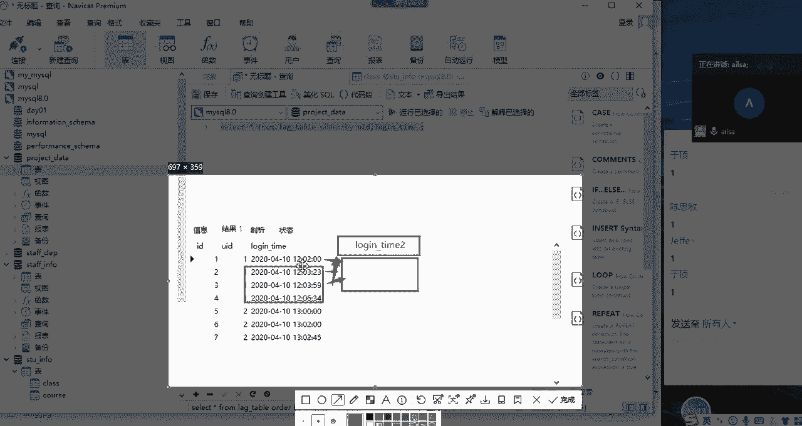
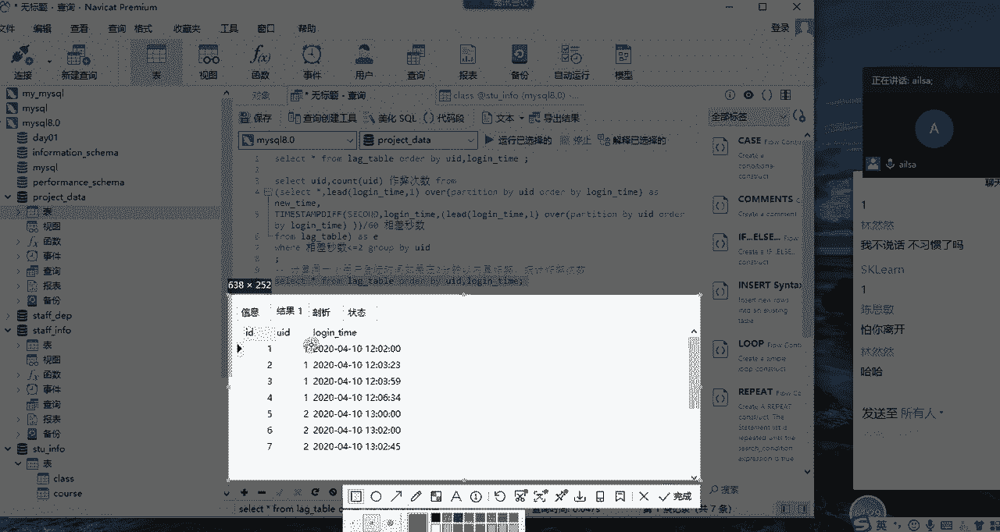
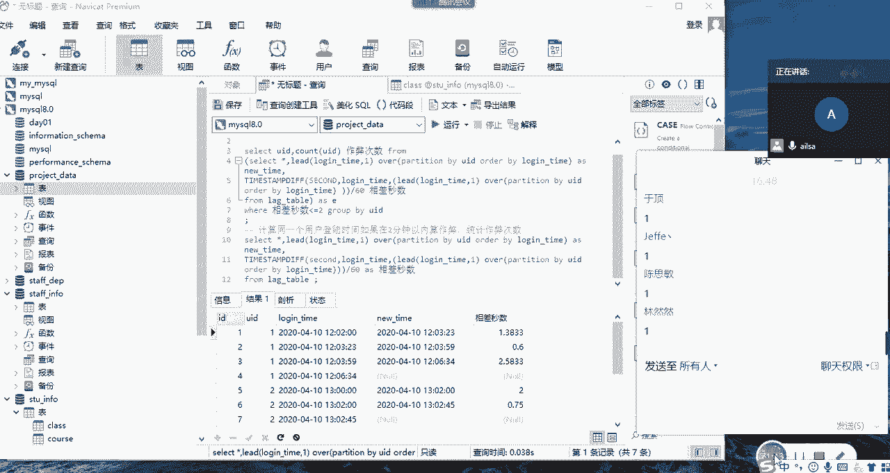

# 强推！这可能是B站最全的【Python金融量化+业务数据分析】系列课程了，保姆级教程，手把手教你学 - P74：06 mysql开窗函数 - python数字游侠 - BV1FFDDYCE2g

再讲一遍啊，我们今天上午啊讲的内容，主要是对于数据库部分的一个复习，那我们讲了什么是数据库啊，什么是circle，讲了一条SQL语句的一个执行的过程，以及呢我们分别讲了库的增删改查，还有表的啊。

增删增删改查，以及啊记录的增删改查，那在这个记录的啊增删改查当中，查这一部分非常非常的重要，所以说我们又分别讲了单表查询和多表查询，那我们在进行啊查询的过程当中呢，我们会发现有一些题目非常难。

你比如说我们要查询什么成绩，前两名的哎这种的一些内容的时候，我们写普通的SQL语句是比较啊繁琐的，那这个时候我们就可以引入到我们啊，一个新的啊呃一个新的模块，也就是我们可以使用啊。

开窗函数或者叫窗口函数，来达到我们所想要的效果，那我们下午的课程就是针对啊，开窗函数进行一个详细的讲解，那在讲这个之前，我要先介绍一下视图，因为上午的时候有同学说。

对视图的整个的一个啊了解已经很模糊了哈，那我跟大家再简单的去介绍一下视图，什么是视图呢，它其实是一个虚拟的表啊，什么叫虚拟的表呢，就是说你看我们存在数据库当中的，这一张张的表哈，这一张张的表。

每一张表这种表，这种表，这就是实表，实实在在的存在我们数据库当中的，而且里面也有记录对吧，也有每一条每一条这样的一个记录，那视图是什么呢，其实它就是啊我们通过SQL语句。

你比如说现在我通过这一帮SQL语句，是不是通过联表查询哈啊通过联表查询，然后查出来呃，查出来这样的一些啊，so so sorry啊，我看一下，只能看不能改啊，其实也能改哈。

嗯my circle staff info，until info啊，这个时候我要选择对应的库哈，啊这个时候我查询出来这样的一个数据，结果之后，它其实是联合了我这边所有很多个表，很多个表。

然后的内容给他联合了一张虚拟的表，也就是说啊我为了呃临时的去看这张表，那我们在每一次啊每一次写SQL语句的时候，你想一下SQL语句在进行联表查询的时候，它都是从不同的真实的表里去摘取，我们所想看的数据。

那对于一些表而言呢，我们需要啊每次都要进行一个联表查询，比较麻烦，这个时候我们可以把我们写好的SQL语句，去存起来诶，存起来，然后作为一个临时的视图啊，就是create view，一个名字。

as里面的内容，就是把它作为一张一张看似虚拟的表，而实在是存在的这样的一张表放在这里，我们下一次直接调用STU，就可以代表我们这些SQL语句，所查询出来的结果啊，是这个意思啊，这就是我们的视图。

大家听明白了没有听明白，给我扣个一，好同志们，听明白，给我扣个一嗯，OK嗯，还有一个人应该，还有一个人没回答，啊是吗，啊，好的好的好的，那就没有什么问题，好像就是上午许峰说。

他对于这个啊仕途没有什么概念了，我讲了一下，他又不在哈，OK没关系哈，那明白了之后呢，啊那我们就是这个它其实就是很简单，然后我们再说一下视图的啊，一般情况下啊，一般情况下我们不进一切试图哈。

好不建议见视图，大家知道为什么吗，啊对我就说还有一个人，大家知道为什么我们不建议建视图吗，第一个是它不能操作，因为它主要是来用来查的啊，我们也我们也尽量的不要对视图进行一个，增删改的操作。

因为没什么意义，它本身啊它本身就是一个虚拟的表，那还有一个问题就在于它整个的一个视图的话，它这个效率不高哈，它这个效率不高啊，效率不高，而且他这个啊呃灵活性也不够强，什么叫灵活性呢，啊。

就是说比如说你这个查询的语句有所更改的话，你还要跑到视图里面去更改啊，啊你还要跑到视图里面去更改，然后这样的话就比较麻烦一些啊，所以说哎你你要什么update，然后怎么怎么着，然后把这个语句改完了之后。

然后他才可以，所以说它这个灵活性也不强，啊灵活性也不强，所以我们不建议去创建视图呃，呃当然了，如果说你有一些查询的呃内容，你是用的频率是非常非常非常高的，而且说它整个的一个呃呃数据的量啊。

以及它整个的一个涉及的内容，不是特别多的时候，你可以使用视图，这个时候它不影响我们整个这个查询效率，就可以了，好吧，OK那视图我讲完了，接下来我们就进入，进入到我们今天真正讲的窗口函数啊，怎么了，这是。

刚哥不在是吗，看一下刚哥是在的呀，在哈在OK那我们先讲啊，大家听我说哈，不要闹哈啊，我们先讲哈，我们的窗口函数的完整的语法，因为我们上午已经讲了一小部分哈，我跟大家说它的完整语法是这样子的哈。

完整语法是啊哦是一个函数名哈，函数名啊，函数名，然后加一个括号，然后里面可以写字段啊，根据实际情况哈，根据实际情况，它可以指定字段，也可以不写，然后后面是over，它语法特别简单，over啊over。

然后后面还是一个括号，括号里面呢分两个，一个叫分组，partition by啊，T i t i o n ttin by，它是分组，意意思类似于我们聚合函数里面的group by哈，ttin by段名。

这个part in by也是呃，如果你没有分组，你可以不用写，如果你有分组啊，你就写上order by是排序的意思，order by根据哪个字段啊进行一个排序，字段名啊，这样的一个语句就可以了，很简单。

那我先我这就是它的语法哈，这就是它的完整的语法，完整的语法，完整的语法就是这个样子的函数名，加括号里面的字段啊，需要的时候就用啊，不需要就不用，那over好加括号，然后里面是分组，是排序啊。

就这两个内容就可以了，那我接下来就通过不同的实例给大家讲解，我们如何使用开窗函数，那第一种情况就是我们的聚合开窗啊，什么叫聚合开窗呢，就是说我们是使用聚合函数的，你比如说啊我们经常用到的sum啊。

count啊，还有哦还有我们的ABG哎，X平均，然后还有我们的max啊，mean啊，类似这样的一个聚合函数，那我们在开窗里面也可以用啊，也可以用哈，那我们该怎么用呢，啊来我举一个简单的例子哈。

我们看到我们的博客哈，你看语法是函数名列啊，over选项选项可以为part in by列order by列over啊，over是按所有的行进行一个分组，里面加了party by。

就是按照你给定的啊列进行一个分组啊，这样子order by是排序啊，OK那这个数据还是我们啊，还是我们原来不要不要不要瞎瞎说了哈，还是我们原来的内容，然后我们再看一下它的啊一个实例哈。

比如说现在我想计算每个学生的，及格的科目数诶，我们呃先使用普通的聚合函数看一下，然后再使用我们的开窗函数，去看一下它到底是怎么来实现的哈，每个学生的及格数目哈，每个学生的及格数目题目一。

大家跟着我抄哈啊，题目一，题目一计算每个学生的啊及格啊，科目数啊，我们这个时候我们可以直接啊，用我们的呃那个视图啊，select我们先用普通的聚合函数哈，select啊，呃什么呢，学生是吧，S啊。

s name我这边应该是s name哈，S name，然后啊是count啊，基数哈，count啊，s name嘛，s name啊，然后from s t u啊，gf by group by啊。

s name对吧，这个时候我们看一下结果，哎出现了每一个学生他啊还要加一个条件哈，their啊，number大于等于60，及格的科目数嘛，对不对，及格的科目数好，嗯我想想啊啊girl by放后面哈。

Sorry，唉我们来进行执行一下，诶，它又出现了每一个学生它满足条件的个数，那那这个意思就是代表他的一个及格的个数，那我们看一下原数据哈，select xu啊，From s t u。

Order by his name，我们看一下，分析一下我们整个视图哈啊，我们试图指的是每一个学生啊，S name，每一个学生它对应的班级以及它的不同的啊，不同的科目，不同的科目，他的一个成绩对不对。

那我们根据这个人进行一个分组，他这边满足几个条件，就代表他这个number啊是及格的，有几个科目对吧，是这个意思，所以说我们这么去写是没有问题的，这是我们普通的聚合函数的写法。

那接下来我演示一下我们使用开窗函数，它出现的结果是什么样子的啊，好flag啊，select啊，这个时候我们可以完全所有数据都选择哈啊，然后我们可以啊，直接也可以选择s name。

然后呢我们选择我们的聚合函数是count count，我们要对哪个列进行一个基数呢，其实无所谓哈，s name啊，我们要对姓名进行一个基数，然后是over啊，over啊，我们这个时候啊。

我们的分组依据是我们的s name，我们要对s name进行一个分组计数，所以是over partition嗯，partition by啊，S name，然后我们这个时候其实不需要order by。

因为我们不需要对它进行一个排序，对不对，那OK那我们就写四组就可以了，然后我们写完了之后，from s t u啊，V啊，v number啊，大于等于60，哎我们看一下我们出来的结果是什么样子的。

我们在执行，哎，你看到没有，它就出来了啊，我把这个重命名一下哈，这叫什么呢，就叫这个啊，及格及格的个数，这个的个数啊，估计这个你们看的应该不是特别清楚，我直接按星就好，OK哎我们看一下。

这就是他最终出来的一个及格的个数，然后我们按姓名进行一个排序啊，order by啊，姓名好，我这个时候我们看一下结果，哦ice s name，Sorry，Ice s name，对。

诶我们可以看到你看如花啊，如花是不是有三条记录啊，三条记录，然后他这边啊的及格数是不是三，如果你用格数八的话，它只会出现一条记录，比如说如花它的几个个数是三，对不对，但是我们用开窗函数之后。

你看它有三条记录，也就是说它不，它不会对你原来的数据做任何的操作，如果说它是属于同一组的，他会他会去重复去显示这个东西对吧，重复去选择这个东西，这就是我们用普通的聚合函数来进行开窗的话。

它出现的结果就是这个样子的，很显然这个结果啊跟我们想象的还是有点出入，我们反而会发现，使用啊，普通的聚合函数才是我们最终想要的结果，对不对啊，是不是这个意思啊，如果是的话，大家给我扣个一。

OK哈嗯那我跟大家说一下，就是我们在进行普通的聚合开窗的时候，然后如果说像这种结果不是你所想要的时候啊，比如说你就想对每一组进行一个分组计算，类似于这样的一个形式的时候，你完全没有必要去选择开窗。

我这边只是告诉你，他也可以这么去干啊，如果说你想要的还是这种啊这种比较啊，比较我就是分类汇总这样的一个结果形成的话，你直接使用普通的聚合也就可以了，也就是说他们两个不存在谁更好的一个情况。

也就是说谁更适合哪种与情况而已，那我再给大家出一道题，大家可以想一下，这个时候我们该用什么哈，比如说现在想让你计算一下每个人啊，每个人啊与啊，每个人的成绩啊，与自己啊，女子想啊想想啊。

嗯与自己啊总的平均分的差距啊，是说你比如说我们不分科目了哈，因为分科目的话会稍微难一些，我们不分科目，我们就计算一下每个人的成绩，就是说各科的科目的成绩，跟他所有各科的成绩的一个平均值的一个差距。

的时候，其实我们就可以选择使用开窗函数了，那我怎么来实现呢，大家看一下哈，第一个步骤，我们先把它的平均分算出来，怎么算呢，那我们select啊，flag菌啊，在这经，然后我们是啊，这个时候是算平均分。

对不对，那我们直接AVG对吧，AVG就可以了啊，平均分，然后是对谁进行一个平均呢，啊是对谁进行一个分组呢，是对姓名进行一个分组。

a RT i t I/O n part in by parting by his name对吧，S name，然后啊我们之间啊as a b g钢丝co，啊前面少了一个O啊，AVG啊。

这边sorry哈AVG我们对谁进行一个求平均呢，我们是对number啊，Sorry sorry，我们是对number进行求评取。

然后over o v e r over parting by s name，对s name进行分组，然后我们给它起了一个别名对吧，from from我们的STU对吧，哎这样的一个形式。

然后我们需要给它加一个过滤条件，就是where嗯，number大于等于零吧，如果没有成绩的话，在这里会啊，在这里会影响我们的结果，然后我们再进行一个查看，会出现什么样的效果哈，OK嗯我看哪里出了问题。

Select xaverage，大家帮我看逗号的问题吗，Party by s name as average，方，我先执行这一步操作啊，这些操作有问题，这个逗号是中文的吧，OK再试一下，OK可以了。

逗号的问题哈，这个时候我们看到他啊，这个我们再按照姓名进行一个排列，然后我们再仔细观察一下order by啊，S name，大家仔细观察一下哈啊，OK大家仔细观察一下同一个人对吧。

它的整个的一个分数在这里面去显示，它的平均分是不是已经计算出来，放在这里，而且是一样的，对不对，那我们如果想计算它这个成绩，跟这个平均分之间的一个差值的话，是不是它减一它就实现了。

就实现我们所想要的效果了，对不对，那这个时候其实啊，完全就可以使用的是开窗函数，如果说面对这样的一个需求的时候，你使用聚合函数是非常非常麻烦的，因为两列之间进行一个额差值的一个计算，是很麻烦的哈。

我看一下预定的结果哈啊OK没有问题啊，没有问题啊，大家应该对于这个逻辑已经听明白了，我们前面的是我们的一个聚合函数，后面是over，然后里面是分组，根据哪个列分组，或者是根据哪个列进行排序。

如果有需要就全部写上，如果没有需要就可以完全选择，不写也可以哈，稍等我这里把order by s name放进来，看看会有什么样的效果哈，应该是一样的啊，我没有试过，嗯啊是一样的哈，是一样的啊。

就是这个时候我还是按s name去排序，然后那我们计算对，那我们计算他们俩之间的差值的时候，就直接是87啊，减去87，因为它你看很明显刘花它只有一条记录，所以它的平均分就是87，那我们直接相减就可以了。

然后那这样就得出了我们整个的一个成绩，跟他的一个平均值的差值，那一般情况下呃，嗯一般情况下它更多的时候可能会让你计算，就是这个人的成绩跟他这个科目啊，这个科目的平均分的差值，这个也是可以计算的哈。

因为什么呢，因为他这个它这个的数据呢，是建立在原来的数据基础之上进行一个计算的，所以说原来的数据，数据的一个维度都不会发生变化，你只要把你想要的结果放在这里，如果是同一选项的话。

比如说你按照s name进行分组的，如果是同一选项，它会重复去显示这个值，明白了吗，重复去选显示这个值，然后你就可以进行一个相应的计算就可以了，你比如说现在我改成按照不同的科目的平均值。

那就是它的分组依据就不是姓名了，他的分组依据就是它的计算还是平均值，它的分组依据就变成了CNAME，对啊变成了CNAME，然后按照c name进行一个啊均值的计算，那我们就可以啊，稍等啊啊。

它不叫CNAME哈，我看一下哈，看一下啊，他这个嗯哦我打错了，手太快，有时候OK，那这个他这个计算出来的就是这个科目啊，你看稍等啊，我们的排序我改一下，那这样就看不出来出来了。

嗯这个时候我们会看到这个体育，他等于的平均分就是64对吧，哎按照体育的整个平均分就是64，那它减去它就是呃我看看啊，它们所哦有不同的哈，有他们，那么它们相减，就是这个人对于整个一个科目的平均分。

之间的差值就出来了，唉我们看一下啊，物理对吧，这些人对于物理的一个差值就出来了，那我们就可以计算它们之间的一个啊，就是他力平均分这样的一个差距，这样的一个需求就可以啊。

这就是我们使用开窗函数的一个好处啊，大家这个听明白没有嗯，听明白给我扣个一，同志们，好的啊，扣1OK，OK那我在这里面需要给大家强调的，就是说你呃如果说是普通的聚合的话，就普通的聚合函数类似。

类似于这种的话啊，我们进行分类啊计算的时候，其实我更建议的是采用的啊这种方式，就是我们的之前讲的聚合啊，聚合函数这种方式，然后如果说你要对它进行原来的结构，可以直接相减，可以直接相减。

如果原来的结构不发生变化，你需要添一些数据进来的时候，这个时候你就可以使用开窗函数，开窗函数很大的一个特点，就是不改变原来的维度，然后进行一个数据相应的添加，如果重复的话，它不会只显示一条。

它而是重复的去显示这个东西啊，只要记住这一点，这就是开创函数的一个特点，那它在聚合这里面的话，其实它的优势主要是啊，建立在聚合函数的基础之上，再进行相应的操作的话，它更有优势一些，如果说是普通的。

那它可能优势就一般了啊，当然没有关系，它最大的优势，它最大的优势是建立在排序上的，也就是说我们今天讲的那个东西哈，我把这个啊，我把这个复制到我们的笔记里面，好复制到我们笔记里，然后就是呃聚合开窗的用法。

好聚合开窗用法我就放在这里了，然后这是普通的方式，然后这个是我们开窗的后的开方式，然后这就是我们又按照不同的一个需求，又开始的啊一个内容哈，这个大家回去可以直接啊再进行一个相减，我在这里就不操作了啊。

啊只要明白这个逻辑就可以了，OK那我们接下来看，接下来看第二个啊，就是它啊，你看我这边的一个知乎上啊，显示的就是这么一个对比啊，他们之间的一个对比，OK那我们看第二个问题，就是对于排序而言。

开窗函数是非常非常好用的，而且说呃，就是它相比于相比较于普通的聚合函数而言，它真的是啊占据了绝对绝对大的优势哈，那我们讲一下我们的排序，开窗的话它分四个不同的方式哈，那这四个不同的方式有什么区别。

我们一个个来看哈，好啊，那我们还是啊我们还是基于我们原来的数据，我们基于我们原来的数据进行一个操作哈，啊啊我们直接啊直接就是呃对啊，我看一下啊，稍等啊啊这边应该是啊按照不同的科目啊，按照不同的科目啊。

直接复制过来，因为我们上午已经讲过了啊，我们看一下这个结果哈，我跟大家解释一下啊，他这个呢就是啊他这个我们前面就是筛选的，我们一些字段就不说了，row number啊。

就是排序这里面排序这里面我们有啊roll哦，number啊，Row number，N u m b e r row number，还有我们的rank以及我们的dance啊，Dn f e r rank。

还有我们的until啊，这四种都是我们的排名，然后我跟大家会说，一一说他们的一个区别，那呃他的所有的后面这个括号，因为它是排序嘛，所以它不需要根据啊哪个字段去计算，所以说它括号里面是没有参数的。

然后over啊，这里面的话，如果它的排序是没有分组的，你就可以不用加帕特性by，如果有分组你就加，然后后面out的by是要必须有的，就是对于排名而言，你必须得告诉他，你得把原来的数据先排好序。

然后你才能给大家进行123名的一个添加，所以说如果是升序就直接out by number，如果是降序的话，加个加上个DSC啊，这个相信大家都学过了哈，我们采取这样的一个形式来分别展示一下。

row number rank和dance，rank和我们的until，它们之间的一个差别哈，啊因为这边没有用到视图哈，所以说啊稍稍对来说麻烦一些，不过还好啊，我们看一下啊。

我们看一下它们之间的一个区别哈，你看这个是学生姓名啊，这是他的性别，这是他的课程，我们是按照课程进行一个分组排序的，按照课程进行一个分组排序，那他们的结果有什么不同呢，来我们一一来分析一下啊。

大家看一下，一定要看清楚了哈，首先我们看一下row number啊，我们看就是呃对于啊两个不同的人而言啊，张三和刘三两个人不同，他的成绩却相同，我们进行肉number么排序的时候。

大家会发现他没有去区分啊，它就是什么叫肉number，其实就是一个序号，它就是123456789十十一十二，OK这一个组排完了之后，那在这一组当中它就是进行以依次的增加，它又像序号一样。

所以说这就是row number，明白了吧，RONUMBER明白没有明白，可以给我扣一嗯，它就像序号一样啊，其实他们他对于重复的这些啊，这些呃成绩，它也是直接进行一个呃相继的添加啊。

那这是RONUMBER，那rank它有什么区别呢，我们看一下rank a它成绩相同的时候，它他是成绩是并列的，但是再往下走一名的时候，他其实是占位了，也就是他中间如果说名次相同，到下一位的时候。

他直接会跳，因为它是按次数来走的，这是一类似于这是一这是二，那到这个就是三，所以它中间会存在跳跃性啊，对正确排名啊，中间会存在跳跃性，那如果四第四名有很多，那到下面的话就是第十名啊啊这样的一个节奏。

这叫rank的一个正常的一个排名，那dance rank就是紧密排名，什么意思呢，你看一啊，一第一名有两个，那到第三名的时候，其实他这边写的是二，也就是说他不会根据重名的一个情况，进行跳跃式的排名。

它是直接一个一个紧密相连的，那你看三有这么多，它下面还是四啊这样的一个节奏，所以他要紧密排序，那最后我们再看一下until哈，until稍微是有点难理解哈，大家看这里哈，大家看这里。

我的until里面写了一个六啊，Until，这里面是有点类似于桶的概念啊，桶啊桶的概念什么意思呢，就是说我写这个六代表的意思，就是我在根据这个组哈，根据这个组我给它平均发啊，划分了六个啊。

六个六个相等的一个桶，然后每个桶具体放多少个数据，主要看你这一组当中有多少个数据，你比如说我们看体育啊，我们直接看这个row number，就知道它有多少条数据啊，它有啊，它有它有12条数据。

12条数据按六桶去分的话，每个数每个桶里面应该分两条，所以说它最后的结果是一一啊，相当于是第一个桶，二二是第二个桶，第三三个桶，第四个桶，你看他对于崇明啊，崇明比如说67，他成绩是不是都一样。

但是有的排到了第二桶的，排到了第三桶，对不对，所以说这个until的话，实际的意义也不大，他不看你，他不看你的成绩，前面是否是一样的呀，还是怎么怎么着，他就是相当于是进行等分。

就是按照你的整个一个组里面，总共有多少个数据，然后看你平均划分了几等份，然后他给相应的进行了一个划分啊，这是第一桶，第二桶，第三桶，第四桶这样的一个结论啊，所以说同内部之间。

其实它整个的一个差异性并不是特别的明显，你比如说二筒和三筒，它们之间其实是有值是一样的，但是他不看这个值，它就看你的量啊，走量的不是走它实际的值的啊。

对于这个呃呃row number rank和dance，rank和until这四个啊的一个区分，大家听明白没有听明白，给我扣个一，嗯同志们有不懂的提出来就可以了啊，嗯为什么只有三个人，没事我跟大家说。

我们不用记太多，我们只要记住rank和dance rank就可以了，这两个其实在我们排名当中经常使用的哈，就是这个看你具体的一个需求，你看业务方的一个需求，如果他说你要是进行跳跃式排名，你就选rank。

因为这个也用的也是比较多，在excel当中使用rank也是这样的一个结果，就是他会跳，然后你用dance rank就是紧密排序，比如说我们上午讲的那道例题，其实我们就是希望它能紧密排序。

我们就选出前三名或前两名这样的一个结果，所以说主要就是rank和dance rank，那对于这个的话，我们想记起来还不简单吗，那如果说你有时间和精力，你可以记记一下until和那个row number。

其实row number是比较好记的，until你就记住它是你这里面写了几桶，你就分了几等份，那你是根据什么来分的呢，你是根据分组啊，一个分组当中有多少条数据，平均按照比如说有十条数据，10÷6。

然后没有被均等的话，最后的啊它会相应的去往最后去减啊，这个他们有一套算法，我们倒不用去考究这个事情，比如说有12条数据，那就是12÷6啊，那就是啊每个桶是两条，那就是它它会分为六桶。

然后也就是说他整个的排名会1~6，然后一有两个，二有两个，三有两个这样的一个结果就可以了啊，这就是我们四种啊，四种不同的一个排序方式，每一个的话，我这边都有详细的解释和重点的标注。

大家回去之后要把这个整理下来啊，要把这个整理下来，然后知道每一个的一个区别啊就可以了，嗯嗯OK哈，那这个的一个呃这个的一个结果，我就嗯我就给大家讲明白了，我因为我们今天上午的时候已经讲过了啊。

dance rank整个的一个排名之后的结果啊相相似，跟跟那个聚合函数一比，我们就知道他真的是太厉害了啊啊是吧，他真的是太厉害了，那我们把这个粘到啊我们的笔记当中，这是我们的排名开窗函数。

OK哈这个是非常啊非常经典的，也比较好用的哈啊，接下来我再讲一个非常经典的哈，这个也非常经典哈，这是对于啊lag和lead哈，log和lead哈，我们呃我们可以简称为lag和lead哈。

这第一个是用于统计窗口内往上走N行的值，这个是统计窗口内往下走N行的值，这么去看的话，可能大家不是特别的理解哈，而且它的参数特别简单啊，就两个啊，一个是它的列，一个是它走多少行，好组的号，行的意思。

那啊这个数据大家已经有了吗，啊有了给我扣个一啊，这个数据啊，这个数据我放在哪了，看一下啊，我应该放到项目里面了，OK哦我放到这里了，嗯啊大家这个数据有了，给我扣个一，然后接着往下讲，可以了哈。

那我们看一下，先看一下这张表哈，我跟大家解释一下这个需求是什么，这个需求很好，很实用哈，我不是说为了练思考题，给大家提了这样一个需求，这个需求是非常的啊，常见的哈，leon table哈。

嗯这个在我们的工作当中也会用到哈，啊是这个意思哈，你比如说这是一个呃，记录用户行为的这样的一个表，就是登录的时间，我们呃你大家大家也知道哈，就是我们的网站有有可能会被爬虫攻击，或怎么着的时候。

然后我们的登录时间如果过于频繁的话，登录时间如果过于频繁的话，我们就会怀疑他的作弊，嗯那你比如说这道题啊，这道题说的是同一个用户id啊，UID就是指的是同一个用户id，在2分钟之内重新登录。

则判断为作弊，统计哪些用户行，哪些用户有作弊行为，并计算他们的作弊次数，这个时候我们先把这个数据查出来，然后啊啊我们按那个什么呢，order by啊，我们看一下order by我们的UID哈。

然后再order by我们的login l o g i n login gun time，对吧，DE啊，2on time就可以了，我们按这个去排序，我们查询一下唉，查询一下他想表达的意思是说。

下一个时间减去上一个时间的差值，是不是在2分钟之内，如果在2分钟之内，那他就算一次作弊行为，它减去它，它减去它A你看这下面是另外一个用户了，对不对，那就到这里就结束了，然后就是它减去它，它减去它。

对于这样的唉，对于同一列数据而言，我们要计算它们之间的差值的时候是非常难的，我跟大家说是非常难的，这个在面试的时候会考啊，会考同一列之间的一个计算啊，就是特别麻烦，我们用普通的聚合函数去写的时候啊。

特别麻烦啊，几乎是写不出来，对于对于这道题而言，你只能用开窗函数，用聚合是非常麻烦的。

那我们在想我们应该达到一个什么样的效果呢，我们可不可以这样哎，我们可不可以单独生成一列啊，比如说这个叫啊，这个叫login啊，这个也叫LOGIN啊，Login gun time on time。

二诶那这么一列，我让他怎么着呢，既然是啊，先是下面这个时间减去上面这个时间，我为什么不把它啊，不把它不把这一部分对吧，我把这一部分给它挪到挪到哪呢，好我们把这一部分给它弄往上走一行，走一行之后呢。

那这一部分的数据是不是就变到啊，编到这里了，哎编到这里之后啊，编到这里之后，那它这三行对应这三行，那我就一一对应的去给它减不就行了吗，唉这个减这个这个减这个这个减这个诶，那这样子的话岂不是就实验了。

我们的最终的目标是让它变成两行，进行一个计算，如果可以的话，那我们就可以实现这样的一个效果，我们就可以达到它每次之间的一个时间的间隔。

该怎么去实现，我们这个时候就会用到我们的啊，今天要讲的这个啊，另外的一个两个开窗函数，一个是啊lag，一个是lead，那什么叫统统计窗口往上走N行呢，啊啊还有这就是往下走N行呢，就是说。

现在我们是不是想把它这个值移到这个位置啊，相当于就是说是往下走一行，然后放在这个位置哈，我给大家举一个例子嗯，我们这个这个先啊先放在这里哈，先放这里啊，来来来看我的例子啊。

然后select我们使用的是开窗函数，对不对，我们直接写精，然后呢我们直接写LEAT啊，Lead lead，然后我们第一个组成部分就是我们的啊内容哈，就是我们要对哪个字段进行一个计算哈。

Login gtime，它现在是不是一整列都是这个样子的对吧，然后呢我想让这一行变到这个位置，那它就属于是啊，就是往下的第几行啊，第几行走，那我们往下第一行啊，往下第一行放在这里啊。

然后啊我们是over啊，over partition by啊，我们没有，我们分组是按UID进行一个分组的，对不对，我们按不同的用户进行一个往从下一行往上走，对吧，我们取的是下一行啊。

取的是下一行的值放在这里，所以说叫往下走一行，然后是PARTITION，Put in by u i d uid，我们是按什么排序啊，我们是按啊。

我们的时间out by l o g n login杠time对吧，OK然后我们from啊，from我们的a leg gun table，好的，刚特别我们看一下效果是不是这样子啊，看一下达到什么样的效果。

语法错了啊，Near by order by u i d order by，稍等啊，看一下，哦对吧，partition选错了，PARTI少个T哈，P r t r t n，OK我们再进行选，OK就可以了。

你看12：02分放在这里，12：03分23，唉，我是不是挪到这里了，然后12：03分59，我是不是挪到这里了，然后12：06分34，我是不是挪到这里了，现在是不是就实现了它减去它，它减去它。

它减去它的操作，我把它放在这里，就是它减去它，它减去它，它减去它，是不是啊，那等一下我直接让他先减就可以了，有的人说你这个空着的怎么办，它会不会出错什么的，如果是空着的话，他这边是不参与计算的。

就是我剪出来是没有值的，所以说刚好满足我们这样的一个需求，然后大家对于这个有没有理解，如果理解了，给我扣个一，嗯没有理解，我就再讲一遍，没有理解我就再讲一遍哈，这个没关系的。

讲一遍哈O那我们先讲这个力的啊，这个力的有两个组成部分，一个就是你要对每一列的值进行一个操作，它这个lead代表什么意思呢，就是说啊你看我们选择这个login之后，它本身就比如说这个12。02分。

它是在第一行，这个在第二行，这个我们选择这个单东西之后，它后面的一代表是什么意思呢，我从下取一行就是向下取一行，第一行我不要我往下取一行，放在我的整个的这新的一列当中啊，新的一列当中。

因为我们是按UID进行一个啊进行一个分组的，所以他只会对啊，同相同的UID执行这样的一个操作，执行这样的一个操作，然后执行完了之后，我们这边会空出一个空的，然后接着往下走啊。

一个呃用户的时候他会往下取一个内容，然后放到这里，因为这个是向下取N行啊，下午课都没理解，我下午课才讲了个排序，才讲了个排序啊，没有关系啊，你们可以自己回去尝试一下，尝试完之后我相信大家都能理解了哈啊。

我再讲一遍哈，我再讲了哈啊，就是它向下取一行了之后，相当于第一行它不要它取第二行的值，放到一个新的一列当中，它是新，它这个东西的话是新生成的一列，你看我让它取完值之后。

as一个new time就是一个新的一列，然后我们做完了这一步操作之后啊，这一步操作之后，我们把我们的时间减去我们的login time，就计算他们的一个时间间隔啊，就达到了我们所想要的效果，这边的话。

因为他们呃我这边精确到的是秒，然后用秒除以60得到的是分钟，然后再去判断它小于2分钟的啊，这样的一个结果啊，呃有听明白的没有啊，同志们好，听明白了，给我扣个一嗯，没有人听明白吗，哪一块没明白啊。

现在的加减啊，那我现在我OK4敏听不懂，那我接我，那我接着往下走，加减这个东西哈，呃你你余定，你说的加减指的是哪一道题，这这个我还没有往下讲加减的事，你说的是上一道题的加减吗，看来是难度有点啊。

加大了哈，啊其实是一样的啊，都是相减，那接下来我就讲啊，怎么去用这个值去减去这个值哈，我们在进行时间的进行一个减法的时候，我们需要用到啊，我们在excel当中我们用的是data data。

那在这里面我们需要用到的就是啊，另外一个函数叫time step dave dave哈，你看有点像它的组成部分，其实也很简单，好我们先写下来哈，我们现在要对这两个值进行一个相减哈。

OK那我们相当于要再生成一列哈，因为它是新的一列进行一个相减，OK那怎么解呢，就是我们的login time啊，我们先写上啊，time staff啊，if啊，在这里他们the steve dave。

然后你看它的组成部分总共是三个啊，第一个啊，第一个是我们的单位，也就是说你这个时间相减，你返回的是年，你返的是月，你返回的是日，你返回的是小时，你返回的你返回的是星期，你到底给我返回什么个单位。

其实跟我们那个dd就很像了，这边我们返回的是second，也就是我们返回的是秒啊，秒这个单位，然后后面的话啊我们就把这个去掉就行了，后面的话是你的开始时间和结束时间。

我们的开始时间是login time哈，你永远都是小的在前面哈，login gutime啊，然后我们的结束时间啊，结束时间就是我们这一堆，我不是起了个别名叫new time吗。

因为它们都是同一个啊D方向，所以你用new time是实现不了，我们直接把这个东西粘过来就行了，也就是我们刚才新生成的这个new time这一列啊，这个啊倒比较简单一些啊，OK我们翻过来粘过来之后。

这就是我们想实现的这个效果了啊，来我们执行一下这个叫相差描述哈，因为我们反的是second，我们执行一下，看看有什么问题没有，OK这就是我们计算的秒数，也就是说这个值减去这个值，它相差的83秒。

大家看一下，如果在这里我除以60得出来的是不是分钟啊，啊也为什么我我不直接返回分钟呢，是因为它有可能会有小数，小数的话会四舍五入，有可能会影响，比如说嗯比如说一点嗯，嗯比如说是嗯，怎么说呢，1。8。

然后他又他又会返回二，那返回二它就属于违法了，其实1。8不属于，因为是2分钟之内的，所以我这边为了比较精确，我给它啊先做成秒，再做成分钟会更好一些，然后我们执行啊，这个时候你看1。38A0。6，2。5。

你看明显2。5，它这个二唉，它这两个都是不符合要求的，然后你再看这个值，它其实是空的，就不影响我们的结果嗯，那我们啊这样的结果出来之后，我们就要加过滤条件了，那我们再加过滤条件的时候。

我们需要对它进行一个浅套啊，全套嗯，那我们的过滤条件是什么呢，就是说我们直接select星，select jing from这个表，然后where这里啊我们写上啊，我们直接as s e啊，S e。

然后where啊，where r将它描述叫将它秒数碰小于等于二，哎这个时候我们看一下，我们看一下结果哈，哎啊不不是大于等于啊，哎我看他这个题目是哦，我看他的题目是啊，他的题目是啊。

2分钟之内都算作弊是吧啊啊，2分钟之内重新登录都算作弊，OK那就这么多，然后他现在想要算的是啊，哪些用户有作弊行为，然后并计算作弊次数，这个时候我们就要用到聚合普通的聚合函数了。

那也就是我们根据UID进行一个啊count计数对吧，count u i d啊，然后我们的条件是相差秒数小于等于二，然后group by啊，CRUBY我们的UID哎，我们看一下这个结果唉。

是不是我们就计算出了呃，那个用户UID为一的用户，他作弊两次，UID为二的用户他作弊两次，这就是我们最终想要的结果啊啊同志们，同志们有听明白的没，有不难吧，嗯这是我们的作弊次数。

这就是我们想要的一个结果啊，没有人回我了，Hello，有听明白了没有，余鼎有没有明白一点点，扎心刚哥没听明白，唉终于讲个东西能让你们听不明白了，让你们知道，其实你们还是有不会的地方的啊。

所以所以说我讲的内容也不是说都特别简单，是不是，OK哈那等一下我这个东西呢再重新啊，我我我因为我接下来还要再讲一个啊，leg啊，leg啊，LAG它跟它是相反的，但是由于你们这个都没有听明白。

我在讲这个的话，你们容易晕，所以我等我先不讲啊，我先不讲这个，然后你们把这个弄明白了，其实这个跟他是相反的啊，是一样的啊，所以说就比较简单一些啊，他这个其实啊往上我看是不是我讲的问题啊。

因为充能函数往下提N哈，网上嗯稍等啊，我看是不是我讲的问题，Uhm too late，OK我看一下啊，看一下稍等，我应该是没有讲错的，lead啊，lead是实现这样的一个呃效果，然后会有leg。

我这边讲了leg，OK啊，使用leg啊，leg是，第一行空着，我看啊，稍等一下，我们再看一下first value啊，录着呢，first value和last value这个其实就比较简单了啊。

我直接上例子了哈，什么叫first value和last value哈，我们拿first value举例，好举例啊，来我们直接看这个啊，直接看这个，我们先看一下这个代码。

OK下面我们使用的是first value number，也就是我们的第一个值，什么意思呢，就是这个我现在是不是按照，我这个number进行排序的，那就按然后按照每个科目进行一个分组，按照成绩排序。

那这个first value就代表的是这个科目的最高分啊，这个科目的最高分，然后我再进行一个查询，大家看一下结果，嗯稍等啊，嗯doesn't exact score，哦选错了啊，哦应该是IT再执行一下。

OK大家看一下，我这个体育的成绩最高分是87，所以我选的是最高分是87，然后我们接着往下走哈，看了一看所有的体育成绩的最高分，80G全在这显示，全在这显示，那物理成绩最高分是100。

然后这边是他们每个学生的成绩，这是最高分啊，first value代表显示的是你所啊，你所找到的啊符合条件的第一个值啊，它会重复啊，你的分类相同分类它会重复你，比如说你是不是按照课程进行一个分组。

然后按照number进行一个排序啊，还是降序排列，也就是说你这个成你这个不同的科目，它的最高分啊是多少，就会显示在first value这里面，那如果说对于同一个啊相同的分组的话，它会重复重复的去显示。

这就是first value，那last value什么意思呢，就是它的最后一名其实跟我们的好，max和mean是有点像的哈，比如说现在我把first value改成last value。

好last value这个就比较简单，这个容易理解哈，我们改成last value，再继进行查找，你看这个体育的成绩啊，稍等啊，稍等我需要再改点东西啊，这个时候我们的整个的一个排序就是升序了。

就不能是降序了哈，因为降序它还是87，然后我们再运行诶，你看我体育成绩最低分是43，所以说它显示的都是43，稍等啊，出问题了嗯，体育成绩，Number，还需要改东西哦。

Last value passing by，and我把这个last value复制过来哈，应该是一样的，试一下啊，哎我们试一下last value，OK啊，OK粘过来了，然后last value啊。

我们啊它这边没有排序哈，我看一下什么样什么结果啊，啊这个时候它整个的一个值是87，如果说啊我明白了哈，如果说我们要对它进行一个排序的话，他取的就是第一名和最后一名，如果说我们没有在进行排序。

它取的就是第一个值，应该是这个意思啊，Out by out by memor，看一下，Order by number，按照我们的CNM，我分析一下哈，它显示了43嗯，体育43，然后这边会显示67。

六十八八十七，哎，这个last value有问题啊，Last value number，我再说一下last value跟forth value有一点点的区别哈，last value在进行一个分组啊。

按列名分组和排序的过程当中要保持一致性，如果不保持一致性的话，它有可能会存在问题，那保持一致性了之后，我们看一下我们最终的一个结果，你比如说现在按不同的啊，不同的呃，那个课程进行一个分组。

最后一个值是87，它会显示87，也就最后一个值，这个使用的意义并不是特别的大哈啊，并不是特别大，大家知道这个用法就可以了，然后物理这边最后一个值是77，所以显示的是全部都是77。

因为它是根据c name进行一个分组的，然后生物的话是90，这边就是90，然后美术最后一个值是87，这边就显示87啊，所以这就是last value的一个用法。

那last value我们从字面意思去理解的话，就是最后一个值，first value就指的是第一个值，它就是相对于你的分组和排序而言，所得出来的这样的一个结果，嗯嗯同志们听明白没有。

last value和first value，听明白给我扣个一啊，我们暂且这么去理解啊，如果说呃我们私下可以再去啊，这个其实不是特别重要，如果说你们有兴趣可以私下来找一找老师，这边如果讲了什么问题。

我们到时候再去重新的啊，纠正也是可以的，我这边下去也会再看一下资料，OK啊呃，严伟严伟听懂了吗，yeah i好，今天讲的内容可能你们要自己去练习啊，练习去琢磨，然后才可以啊，得练一下对练。

练着练着你可能就听听明白了哈，这个光自己看可能够呛啊，我把这个说一下，因为我之前应该是我之前自己做测试的时候，应该出了问题，要不然我不会加最后一句话，完了VRIVIUE，OK哈嗯OK嗯，眼尾啊。

眼尾这边没问题啊，再练习，OK那我接下来再回到啊，再回到我们的lead啊这样的一个用法当中啊，去给大家重新再讲一遍哈，重新再讲一遍，我们重新梳理我们的代码，Select je from，选择我们的项目。

OK啊，LNG刚table，我们先看一下我们这个表哈，大家跟着我的思路，或者是说啊，或者是说大家现在可以跟着我一步一步去操作，我讲慢一些好不好啊，现在所有人查询到这个结果没有，所有人查询到这个结果没有。

查询到这个结果，给我扣个一啊，我接着往下讲，好的，我们的目的是计算同一个用户啊，SI啊啊就是登录时间啊，如果在2分钟以内算作弊统计啊，作弊次数，作弊次数啊，这是我们的题目需求啊，这个很重要。

这个我一定要给大家讲明白了啊，OK呃两个人已经OK了哈啊，其他人呢我看然然都没有说话呀，然然呢，这这话说的感觉跟虐待你似的，怎么着，就咱们几个人还要争宠，是不是啊，OK哈OKOK啊，好减号有没有问题啊。

OK我们现在都达到这个程度了之后，现在我们想一下，我们啊我们先对它进行一个啊，先给大家进行一个排序哈，order by啊，order by uid啊，order by跟着我敲哈。

Out by u i d，然后是login l o g i login guti啊，我们对它进行一个对这两列进行一个排序。

按照我的步骤一个一个去操作哈，诶出来了这样的结果啊，出来这样的结果之后，我们想象一下我们该怎么啊，该怎么去统计相邻的两个同一列当中，相邻的两个字字段的一个差值小于2分钟呢。

这个时候我们就在想可不可以这样，我把这个值挪到这里来，把这个值呢挪到这里来好，我们到这里来啊，稍等啊，我给大家画的好看一些啊，我这个灵魂画着。

哎我们先画一个框框，然后呢啊我们有很多个行，对不对，一行两行三行四行好吧，哎有四行，然后比如说这有一个新的一列啊，新的一类哈，新的一列，然后怎么着呢，这个东西呢我让这个数，因为它要要要相减嘛。

在同一列当中相减，对于我来说实在是太难了，臣妾做不到啊，是不是，那我让它变成两列，不行吗，对不对，我们让它变成两列，两列之间相减，咱会啊，对不对，那我们就把它变成两列，在这个地方啊，在这个地方我们把啊。

我们把，啊稍等啊，我们把什么呢，把12点啊，12：03分啊，23秒这个值哈，也就是还是4月10号啊，12：03：23，这个值往上走一行，就是第二行变成了第一行，然后呢我们在这里啊，啊在这里呢把12：

03分啊，零3分59秒跑到这里面，跑到这里啊，然后呢再把什么呢，再把12点，再把12：06分啊，34秒这个值跑到这里，然后这里面就空着了，相当于我们把后面这三个值往上走了一行，走了一行之后。

我让它跟它相减得出来一个值，俩相减等于多少，12：03分减去，那就是1分23秒对吧对吧，1分23秒，OK他在1分23秒内又重新登了一次，对不对，那这个12：03分啊，59秒减去12：03：23。

大概是6223啊，32秒的时间，他又重新登了一回，对不对，这个时候啊啊都要50嗯，我想想嗯，2325333十三十六秒对吧，36秒啊，又重新登了一回啊，那这个时候我让它跟它相减是多少。

那就是呃呃按444分算是2分35秒对吧，好2分35秒，那这样其实我们不就计算出来，这样我们不就计算出来，它整个的一个时间的一个间隔了吗，如果说这个数据还有，那就往下走呗，它主要是相邻两行之间的解。

这就是相减，我只要把后面一行放到前一行上，它不就成为相邻的了吗，对不对，同志们听懂了吗，同志们听懂了吗，下一个只等于上的，对对听懂了没有，我这已经讲的很详细了哈，这个能发图片吗，不能发图片。

我发到咱们群里啊啊咱们是297哈，十297吧，龙王OK啊，你看是不是对于同一个啊同一个啊id而言，然后我只要把它下一个相邻的哈，下一个往上走一行，下一个往上走一行，下一个往上走一行，哎。

到最后一个的时候，我们完全没必要要了呀，因为我们已经啊已经达到我们所想要的效果了，不管你这个数据里面UID，你这个用户有多少条数据，只要按我这种操作方式是完全没有问题的，完全可以实现对吧。

而且我们实现可扩展性是非常强的，那我跟大家说，如果说你们不会这么去操作的话，很很多人就会去判断判断它有多少个UID，然后减多少次，然后怎么着怎么着怎么着，特别麻烦啊，还要循环，还要判断特别费劲。

你看我这种方式是不是特别简单，那我们怎样才能够实现唉，把下一个往上走一行呢，那你看对于整个列而言的话，我是不是说第一个值我没有取，我直接取的第二个值，那我如果对于坐标而言的话。

我不是我是不是向下走了一个对吧，向下走了一行，然后放在了我新的一列，那这个时候我们用到的就是我们的啊啊，这样的lead啊，这样的一个呃功能啊，开窗函数，我们怎么去写呢，就是LLEAT，然后它的组成部分。

第一个就是你要对哪一列进行一个操作，login gtime在这一列进行操作，然后呢操作完了之后，我们是不是往下走一个行，让它放到这啊，那就是向下取N行，N等于一，然后它是个开窗函数。

你看然后over over的话，我们是按照什么进行分组啊，我们是不是给你UID进行一个分组啊，那我的就是partition啊，P a t i t i o n part in by，把他们拜啥呢。

拜我们的UID对吧，然后因为我们这个时间呢一定要有顺序，一定是从小到大的，不然你怎么相减，对不对，所以我们肯定是要order by我们的login啊，gun time对吧，而且我们是升序排列哈。

OK写完了之后，哎as我们的new time，这就是我们所想要的结果，然后我们看一下是不是这个样子的，哎我们看一下诶，好像是我想要的结果嘞对吧，你看这是零3分23秒跑到了这里啊。

零3分59秒跑到了这里呃，十呃12：06：34跑到了这里，那对于最后一个值而言，它就没有什么价值了，那就放在这儿空着，我们在进行计算的时候呢，它也不影响，对不对，那我们计算完了之后啊。

我们需要对它进行一个差值的计算，差值的计算了吗，这边有一个函数啊，函数叫啊嗯time staff def啊，我们利用这个函数就可以了，在这里就不需要排序了啊，OK那我们啊就这样的操作怎么操作呢。

啊我们就加一个time step啊，DAVE跟我们的excel当中是一样的，第一个是我们的单位，你可以写hour，你可以写分钟，你可以写呃，秒都可以啊，啊都可以实现哈。

所以说我们这边写的是秒c o n d i second啊，然后后面呢就是我们的开始时间，这个是我们的结束时间，那开始时间就指的是小的，这个那就是我们的I/O gin login gutime。

然后后面的是我们的大的事件，因为它是属于同一个，你看它没有嵌套吧，所以说在这里的话，你用new time它识别不了，我们直接用原来我们写的这个函数，它就能自动生成一个新的列，所以我们就用它就可以了。

哎那我把它复制过来，哎复制过来，这个时候我们是不是就相减了，这个函数就实现了相减，这个时候我们让它的别名as啊，as什么呢，相差秒数，好这个时候我们在执行我们所想要的结果，试一下唉。

这边就是它想成的描述，然后我们再除以啊，除以啊，除以60诶，不是我们的分钟了吗，对不对，是我们的分钟了，OK15分钟，然后呢比如说你再进行format一下，把它整个的小数保留三位，就是这些都无所谓了啊。

然后你求出来之后，然后你再因为你要进行一个嵌套了，你在这里不能直接进行一个判断，然后你加一个嵌套，然后加上你的girl y，也就是你的分组啊，按照你的UID进行分组，你计算一下小于2分钟的有多少个。

这个应该就比较简单了吧对吧，就能实现我们所想要的结果了，同志们，这回听懂了没有啊，听懂了给我扣一，同志们，哎人呢，嗯123，嗯其他人呢，四还有两个。

