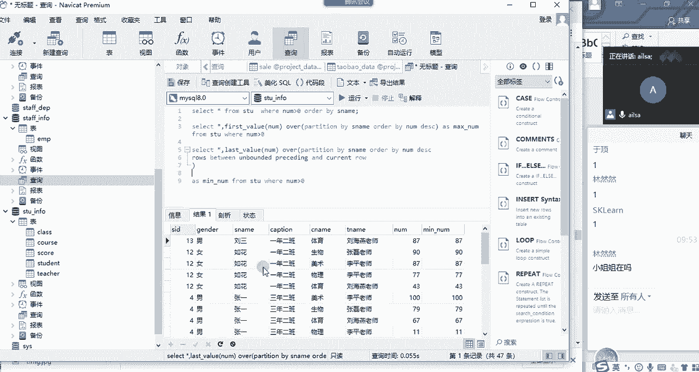
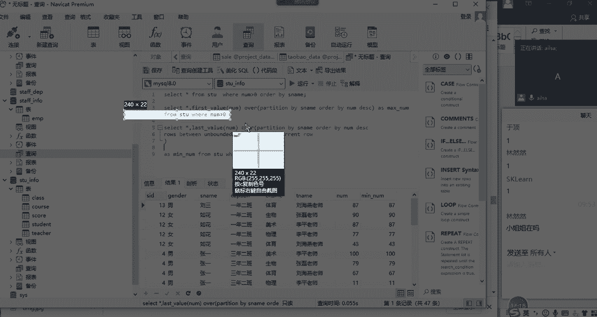
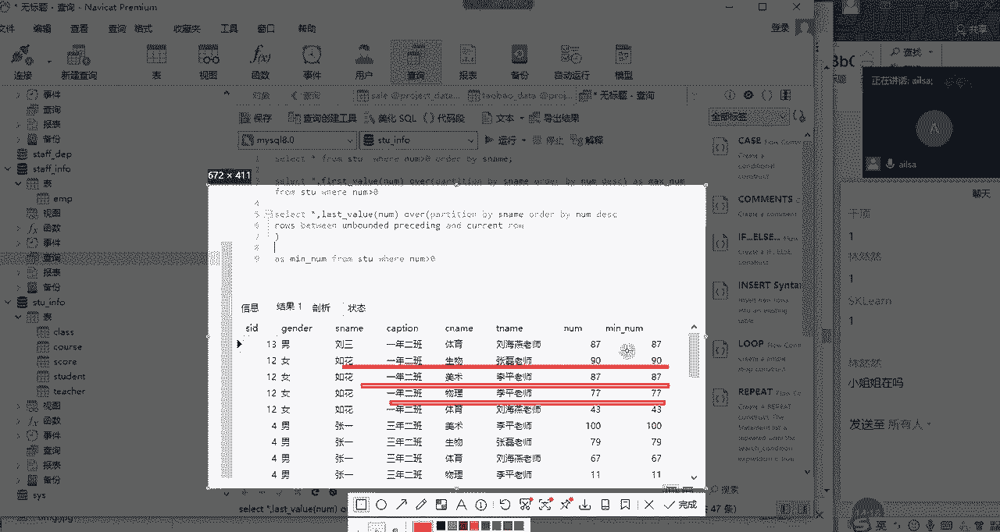
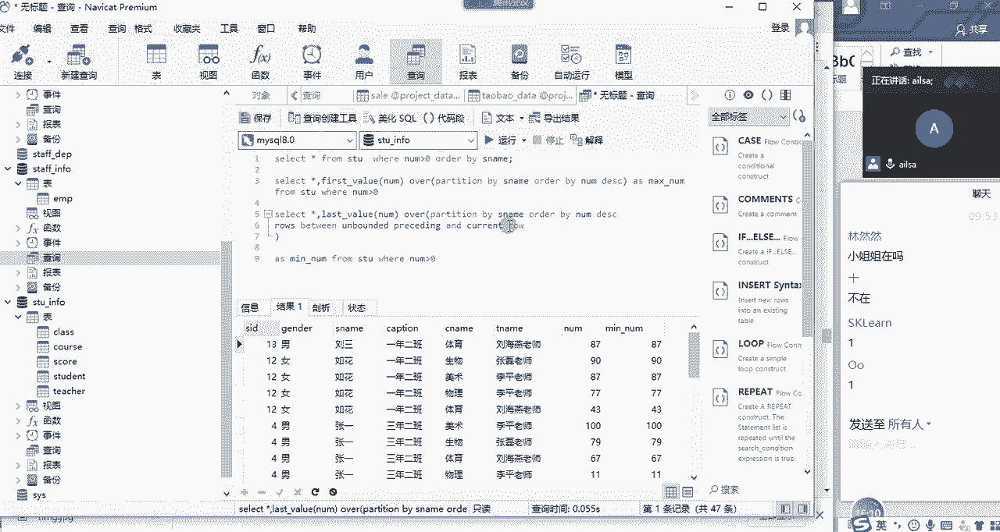
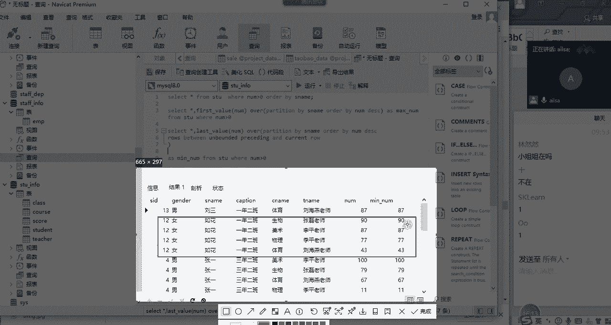
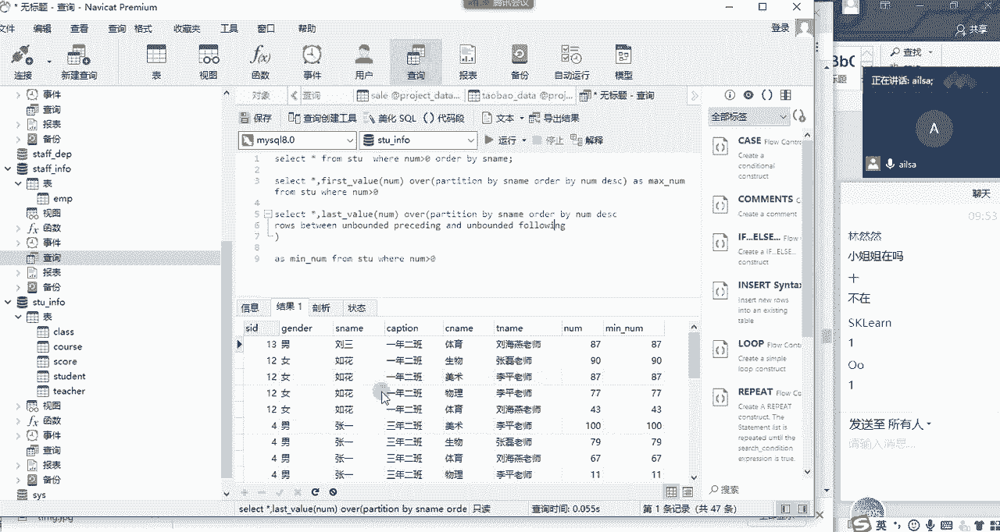
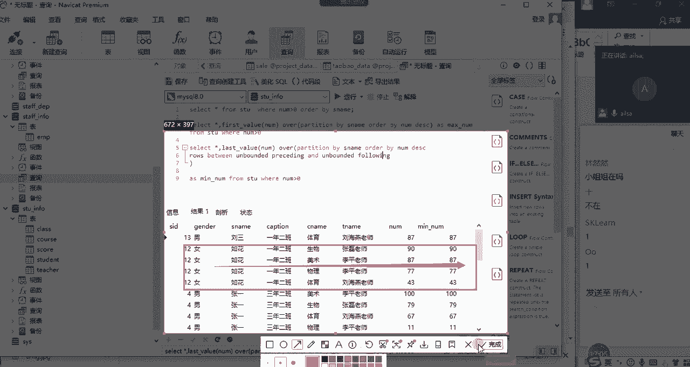
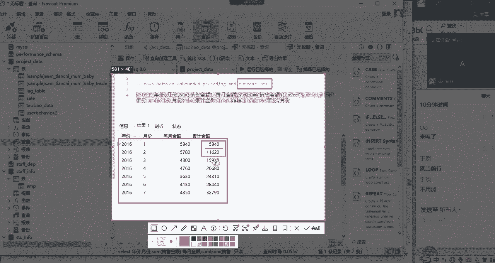
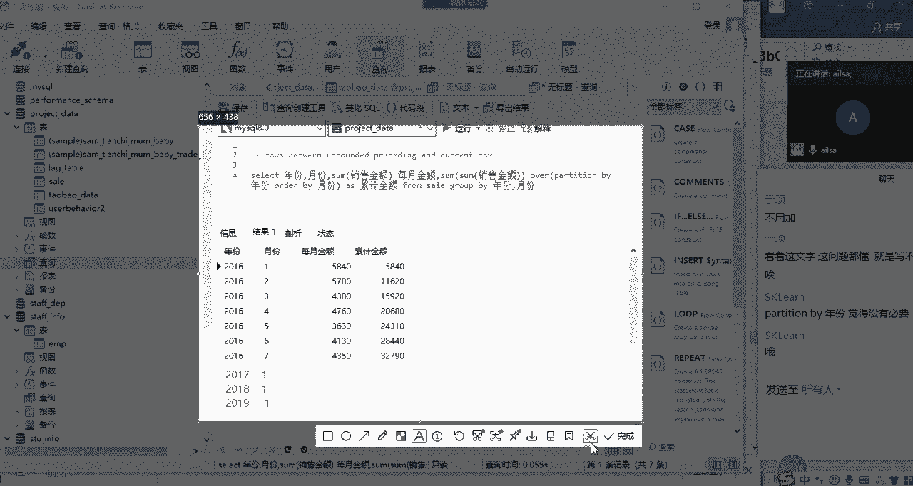
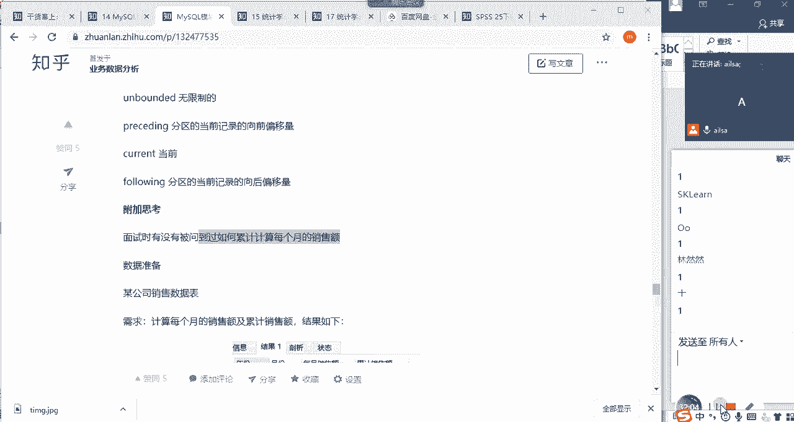

# 强推！这可能是B站最全的【Python金融量化+业务数据分析】系列课程了，保姆级教程，手把手教你学 - P77：03 窗口函数的内容补充 - python数字游侠 - BV1FFDDYCE2g

首先我问第一个问题，就是我们昨天讲了力的函数对吧，唉力的这个开窗函数啊，我跟大家讲了，它其实就是说把这一列数据当中的数据，往下取一行，你如果N等于一的话，就是往下取一行，放到新一列当中的第一行，对不对。

大家这个听明白了没有，就lead函数，昨天看完视频之后都明白了吗，明白了，给我扣个一，嗯一个两个三个，四个，五个，还有同学没有回来吗，好那这个lead函数明白了之后，我们再看leg函数。

这个lag函数呢它什么意思呢，它就是啊它就向上哎，你看这个呃lead，它是往下取一个，放到这个新的里面，然后lag呢它就是往上取，往上取一个，然后放到哎我们能够指定的一个位置啊，看一下哈。

下面啊下面这个哈什么意思呢，你看这是一个整行的数据，然后这个数据我往上取一行，它没有对吧，它往上取一行是为空，所以说哎我往上取一行了之后，它就会变为空，然后再往下取的时候。

才它的第一行数据就是往下走一行哈，那这个时候我们会发现什么呢，如果我们想计算它们之间的一个差值的时候，我只要把这一部分的时间，因为这反而这一部分的时间大了，所以把这部分时间减去这一部分的时间。

就实现我们所想要的效果，它跟力的函数是呃呃方向是相反的哈，那大家不要看这个哈，因为这个没有去改啊，我们可以看到这个啊用的是lag哈，嗯在这里面应该也是lag time，然后去实现的这个效果。

嗯如果说你怕自己弄不明白也没有关系，你直接就记力的函数就可以了啊，不用记它，因为它们都是一个道理，就跟啊left啊，连表和right连表是一样的，好吧啊，那这个听明白没有啊，听明白给我扣个一。

相信你们昨天啊在私下的时候也练了，对不对，如果说有要求我再重新讲一遍的，讲这个lag函数的话，我会再重新讲一遍嗯如果没有问题，扣一，好的啊，没有什么问题哈，这个然然啊，然然打这么多哈，OK没有问题的话。

我们就看最后一个first value和last value哈，这就是我们当时说的是分组内哈，分组内啊一定是如果你有分组，就是分组内的第一个值啊，last value是分组后的第一个值。

我们当时是栽到了啊，last value这里啊出错了哈，所以说唉我们再重新的去看一下，我们整个的一个数据哈，嗯那我们呃单独写一个哈，我们这边啊是使用的是使用的我们的啊，这个to info这个表对吧。

哎那我们啊稍等啊，as to info啊，那我们在这里呢查询一下啊，新建一个查询，然后我们先回顾一下我们的数据，select星啊，From s t u，哎我们看一下我们的视图运行啊。

嗯staff info里面没有吗，哦staff ui still inf哈，OK唉我们这边就得到了，唉我们所有学生相关的成绩，班级科目，然后以及授课老师啊，以他的性别和他的整个一个编号对吧。

哎成绩都在这里了，那下面呢我就对学生啊姓名进行一个分组，然后啊去显示他最大，就他啊这个这个学生他所有的科目的成绩当中，最高啊，分分数最高的那个成绩哈，我们看怎么去写哈啊首先呢我们要先select啊。

那我们取相当于是取一个学生当中哈，一个学生当中，这个时候我out by一下，给大家看一下odd by啊，S s s s s name，然后我们看一下我的逻辑是这样的哈，我们把有成绩的筛选出来。

where嗯，Number，大于零，唉唉这个时候嗯我比如说像如花，她是不是有啊，有四门课哈，物理体育美术生物这四门课，那他分别对的成绩是77，43，827和90，现在我想对这个成绩进一个排序。

排完序之后，我取他最高的这个成绩，90哈，90这个值，那我们可以，我们可以用我们的max这个函数来实现，我们也可以用first value取第一个值，这样的一个逻辑来实现，那我们就是select。

然后呢嗯我们可以直接新啊，后面我们就用开窗函数，它既然是第一个值，那就是first啊，FIRST啊，first gun value啊，杠value，然后这是我们的函数啊。

然后over o v e r over，然后里面是分组呢，是按学生的姓名，所以是partition by嗯，s name啊，然后按什么排序呢，按我的整个的一个成绩进行一个排序是吧。

All the by oder by number，OK我写完了之后啊，这边啊起一个别名as啊，as max杠number啊，最大的这个number，然后from啊，from我们的STU来。

我们再看一下结果是什么样子的，嗯括号是中文的吗，In over，稍等啊，好我们要指定列哈，first value啊，对哪个列啊进行一个啊进行一个取值啊，是我们的number，OK我们进行一个执行。

还要加条件，不然他这个看着太难受了，OK大家看一下我们得到的一个结果哈，我们得到一个结果啊，我这边是升序啊，如果说现在我降序的话，就是取最大值了啊，DIC啊，我们再看一下啊，那对于硫酸而言。

它只有一门功课，所以他没有必要进行一个排序，那对于如花而言，它的整个的一个排序是90，八十七七十七四十三，最高成绩就是90，那这里面取得的就是90，按照这个分组分组内，大家记一下。

first value是指的是分组内第一个值，分组内的第一个值，如果说我这边不不对它进行一个排序的话，它默认的就是说你在这个分组当中，你在整个表当中，它第一个值是哪个，就是哪个啊。

我这边就是给它做了一次排序，所以出来的是一个最大值，如果不排，也就是他就是第一个值，明白了吧，嗯那我这边取得的就是全部都是90，那往下来走，张一啊，我们可以看一下嗯，张一这边的话它最大值是100。

对不对，那他取到的就是100，也就是说在这个原来的表当中哈，我们最后这一列是不是新加的，在原来的表当中，处于张三这个分组内的第一条数据就是100，明白了吧啊，所以说我取到的就是100。

然后再张三这里他是最低条数据，就是99，所以说取到的是99这样的一个结果，大家对于这个听明白没有，这就是我们first value的用法，我们昨天讲过了是没有问题的啊，啊没有问题，给我扣个一。

OK哈OK那现在我们把这个内容复制一下，现在呢我不想求它的这个最大值了啊，我想求它的最小值，也就是说啊，呃也就是说我们还是原来的这样的一个结构，还是原来这样一个结构哈都不变。

然后我想求这个如花的最后一个成绩啊，就是最小的一个成绩43，我想求这个值，那从我们正常人的逻辑来看的话，这个43唉，是就是就是它在整个的一个分组当中的，最后一条记录对吧。

所以说我在这里面直接把first改成last，唉我们直接改成last，然后我们求的是mean啊，最小值哎这样一个结果不就实现了吗，是不是大家昨天这样去操作的时候，有没有成功好，有没有成功。

我们看一下结果哈，我不知道你们试了没有哈，我们看一下结果哎你看这是87，这也是87，没有什么问题，但是你看如花它是一个组，对不对，一个组它的值应该是保持一致，但是你看哎不对，是不是，这这怎么回事啊。

这怎么都没给我分呐，这应该是给我出现的，我们最终想到结果是不是四十三四十三，四十三四十三对吧，然后往下去走的话啊，张一应该是嗯呃张一的最低成绩是11，应该是十一十一十一十一啊，什么情况啊。

这个其实是因为什么呢，这是因为啊假设哈，假设我给大家举一个很简单的例子，假设我把out by去掉，我们不按成绩去排的话，它也不按程序排，我们看一下它是什么效果哈，不按程序排，那不按程序去排的话。

它整个的一个顺序就是默认的一个顺序了，那默认的一个顺序我们看一下哈，我们先看默认的一个顺序，默认的顺序的话就是，如花的第一条记录是77对吧，张一的第一条记录是11，然后往下走啊，张三的第一条记录是77。

这样的一个结果来我们看一下，会出来这样的结果吗，诶好像是诶，你看他第一条记录是87啊，最后一条记录是87，不好意思啊，最后一条记录是87，然后啊如果张一，我们看一下张一的最后一条记录是100，没有问题。

那张三的最后一条记录是99，也没有什么问题，诶但是我们其实是想求最小值，是不是你这不过进行一个排序的话，我达不到我所想要的效果，因为前面整个是一个默认的顺序，那你也其实没有解决我的问题。

所以这个order by还是不能去掉的，是不是，那有的人就就说那不简单吗，你直接按升序排列取第一个值不就行了吗，对不对，但是现在我就想用last啊，杠value我就想用它，我看它到底出了什么问题。

为什么不让我用，他俩明明就是兄弟兄弟函数嘛，到底是哪出了问题呢，啊这个时候啊是因为我们在学开窗函数的时候，少学了一个知识点是什么呢，他如果说你这么去写了之后啊，它的一个。

它的一个呃整个的呃有一个叫什么呢，我也不知道叫什么，反正就是呃它有默认的一个嗯呃就是统计范围，我们可以说它统计范围它是rose between啊，它如果说我们这么去写了之后。

它的一个统计范围默认的是这个样子的，来我们看一下这个值是什么样子啊，嗯我们看一下它是rose代表行对吧，所有的行between and哎，就是在什么什么什么之间对吧，那这个UNBURDED啊。

这个是什么意思呢，就是这个bond bond是有边界的，对不对啊，有边界的，然后unbounded是没有边界的，对不对，没有边界，然后processing啊，Processing，然后指的是向前。

那指的什么意思呢，就是说他这个当然我们是有分组的，就就指的是啊你的整个的包含的行啊，是在该分组范围内向前是没有限制的对吧，这个是没有限制的，这是没有限制的意思，向前没有限制。

and的呢就是你的范围向前没有限制，然后结束啊，前面是开始，后面是结束，结束到当前行，结束到当前行，那也就是什么意思，我给大家解释一下哈，啊我们再把这个数据拿出来啊，OK他是什么意思呢。

就是说你这个87的分组，OK他只有一个，我们没必要去解释，我们再看如花如花，他的意思就是说90OK啊，90嗯，在整个的一天这这个分组当中啊，这个分组当中嗯，然后他截止到当前行啊，只有87这一个值。

对不对，他往前数它没有，因为它是呃它啊，它往前数有啊，如花啊，如花在第一行的时候，它往前数是没有，所以它就呈现的是90，那87啊。

我们看第二行哈，给大家截图哈，就认真听啊，认真听啊。

这个稍微有点麻烦，你看他这个create create now指的是当前行，什么意思呢，就是说我如果是第一条记录的话，我如果是第一条记录，我往前往前是无限的，对不对，那我往前无限制，那永远都是90。

对不对，因为它前面就就只有93，没有前面啊，那到第二行的时候，第二行，那我的一个取值范围是什么呢，我一个取值范围是到当前行，然后是往前当前组往前数无限个，那就90和87，90和87。

你取最后一个是不是87对吧，你的是last value，对不对，它是87，然后到第三行的时候啊，到第三行的时候，这个时候你的取值范围向前是无限制的，唉那也就是说当前组向前有两个数。

然后截止到当前行是77，那你在这三个数当中取最后一个是不是77，对不对，那往下来走还是一样的，你取last value，你永远取到的都是你当前行所在的最后一个，是不是啊。

所以说我们在使用last value的时候，会出现这样的情况啊，有的人就说为什么我first value不出现这样的情况呢，因为你取的是第一个值，你比如说你在第一行的时候，你取第一个值当然是90。

对不对，那到第二行的时候，你取第一个值还是90，到第三行的时候，你取第一个值还是90，因为它即使到当前行，它第一个值永远都是90，而我们在取last value的时候。

它却取到了我们每一个对应的当前行的值。

这个大家听明白了没有，同志们这个听明白吗，OK哈听明白了，这也就是说，那既然这个结果并不是我们所想要的，我们该怎么办。

我们当然是可以改了，我们想要一个什么样的效果，我们想要的是这样的效果嗯，我们想要在整个的一个分组当中啊，分组当中当前行啊，它的一这不是rose，也就我所包含的区域所包含的区域，我不让它截止到当前行。

我让它向前啊，就在这个区域当中哈，就这个分组当中向前是无限制的，向后也是无限制的，那也就是说它包含了整个分组的区域对吧。

包含了整个分组的区域，那我该怎么去做限制呢，当然是and后面改一下就行了，怎么改呢，就是把后面的也改成无限制啊，我们直接把这个地方啊，大家看原来是当前行对吧。

现在我改成啊UNBUNG的following，也就是接下来也是无限制的，向后当前行向后无限制啊。

它的意思它的意思就是指的是，比如说在这个分组当中，假设现在啊到了这一啊，到了这一行，它指的意思就是说向前无限制，向后也无限制，每一行都是哈向前无限制，向后无限制，但是你如果你有分组的话。

是限定在这个分组当中的，也就是说我可以取到分组当中的所有的值，在这个值当中我取最后一个，那是不是就是43我们所想要的效果诶，那我们看一下。

它是不是我们最终想要的一个效果，唉这是87唉，四十三十一是不是唉好了对不对啊，好了好了好了对吧，这是九哎，这就是我们所想要的一个效果，那呃就是对于这个知识点，它就指的是我们在进行啊。

我们在进行开窗函数的时候，它对于整个行区域，行区域的一个默认设置指的是就是向前无限制，向后到截止到当前行，那对于first value而言，它不受影响，但是last value它却受到了极大的影响。

所以我们需要给它改成向前无限制，向后也无限制，那在我们整个的一个使用窗口函数的时候，主要也就这两种情况，一个就是向前无限制，向后无限制，第二个就是向前无限制，向后截止到当前行，就刚才那种情况。

这两种情况都有可能存在，也就是说它并不是说哪个是对的，哪个是错的，只是说你使用的场景不一样而已啊，同志们，我这个讲明白了没有，嗯讲明白给我扣个一都听明白了，给我扣个一，嗯好的啊，听明白非常好啊。

因为你昨天可能刚一一开始，一接受这个窗口函数有点不适应，但是今天整个状态来说是非常好的哈，然后我在我的啊，我在我的那个窗口函数，这一篇文章当中也进行了一个更新啊，你比如说唉我现在出来的这个啊。

那last value，然后我现在出来的结果并不是我所啊想要的，那对于这样的一个结果的话，我们应该啊怎么去修改我们的circle哦，我这边都写完了，然后也都是符合要求的啊，达到我们所想的效果。

然后对于我们这个语句，然后rose between它的语法就是rose between，and在什么什么之间，也就是我们整个窗口函数的一个，数据行的一个范围，那这unbounded的就是无限制的。

就是啊就是你在这个当组当中，昨天啊昨天我是今天啊，我是昨天晚上啊，又自己去找了一下资料，发现这是一个呃知识点没有讲哈，向前无限制啊，processing processing是向前啊，当前区域哈。

当前区域啊的的当前记录向前的偏移量啊，就是范围，然后correct current是当前，然后falling啊，falling是向后啊的一个偏移量啊，我们这个地方啊，还有跟大家说一下。

这个就稍微有点啊那个什么了哈，比如说你在这里边写一个啊三包里，比如说你写一个数字，它的意思就是说你当前行前面啊，当前行所在的前面是无限制的，然后向后包含三行的记录，就是它可以写数字啊。

也不是说非得就这两种情况，他可以写数字，这个地方也可以写数字哈，它是一个语法而已啊，这个我就不讲了啊，这个就看你的一个需求，实际当中，如果说你想要这么去实现，你都可以写数字哈。

我们这是UNBOUNTED哈，OK啊那这个我讲明白了之后哈，啊就是他可以改哈，嗯对这个我讲明白了之后，接下来我给大家出一道题啊，就附加思考哈，附加思考啊，大家想一下啊，就是这个题的话啊。

在工作当中倒没有遇到过啊，但是在excel当中我是做这么去做过的啊，circle当中我没有这么这么去做过，但是面试的时候，就是我听我看人写的面经当中有这这么一道题，就是说你有没有哦要统计过。

被问到要统计累计计算每个月的销售额，对啊没有问题啊啊O说的没问题，就是当前行往下移偏移三行啊，然后这个总的构成的一个区域啊，这样的一个结果嗯，那就是有没有说让你去统计，每个月累计的销售额，什么叫累计呢。

唉我们看一下什么叫累计哈，累计指的是比如说1月份的销售额是这么多，2月份是这么多，3月份是这么多，A那累计销售额指的是，第一行是指1月份的销售额，第二行是指1月加2月的销售额。

第三行指的是123月的销售额，类似于这样的一个累计计算，那在circle当中，这种方式的一个计算非常难好非常难啊，然后如果你用窗口函数去实现的话，就非常简单，然后大家想一下，我现在啊。

我现在给大家稍微一点点的时间，然后去想一下我们这个该怎么去计算，如果使用窗口函数的话，好这个数据可能大家没有哈，我再发一下哈，看一下我们整个的一个数据嗯，嗯数据嗯，数据我给大家发一下哈。

啊只能发QQ了哈嗯，嗯然后大家下载一下这个数据，我现在先暂停啊，暂停我的啊做的讲解，那对于这个题目而言，我们先看一下原数据长什么样对吧，哎我们看一下原数据啊，原数据大概就是说每个年份，然后每个月份。

然后它整个的一个销售额啊，那他这边的话会有很多条的记录，对不对，因为它有不同的门店，所以说我们需要做的啊一件事情就是先啊，先把我们的我应该是放在了我们的嗯，Sell sell。

那应该是project data，哎我新建一个查询来电了啊，厉害了，OK这个时候我先查询一下我这个表，Select from cell，对啊，那我们看一下这个标长什么样，而就长这个样子。

那现在我们知道一个月份会有多条数据，那我们就需要先对它进行一个这样的一个，格式的调整，对不对，那我们需要按照年份和月份进行一个分组，求和哎，some some什么呢，销售金额，嗯然后是年和月对吧。

按年年份，然后是月份月份啊，然后some销售金额from sell，然后再GRY对吧，GROUP啊，大家不要会了，开窗就不会用聚合了哈，他俩有时候会联合去使用这个东西，group by什么呢。

group by年份和月份，对吧啊，然后我们执行一下，哎那我们这边就执行出来了啊，每一年每一个月它的整个的一个金额啊，我们这边写上是每月金额，OK我们再执行一下，好的，每月金额求出来之后。

我们需要在这个表的基础之上再加一列，进行一个累计求和，对不对，那我该怎么去加呢，大家想一想，那我每个月啊对它进行一个求和，其实这个时候因为他这个年呢，它只有一年的数据，所以我们就没必要对啊。

对年份进行一个啊进行一个聚合了，如果说有很多年的话，我们需要对每一年进行一个聚合，对不对啊，那我们这个时候需要使用的是一个开窗函数，怎么写呢，首先我们是some啊，我们肯定是要求和的，对不对。

累计求和嘛，那我这个some里面应该写什么呢，大家想一下，我这个sum里面，是不是要对这每月的金额进行一个求和，所以我们该怎么写呢，因为他这个每月金额已经是一列了，所以说我们只要写上some金额啊。

这个就可以了，我们如果写每月金额，他应该识别不了，所以我们要写成这样，some some定额啊就实现了，然后下面是over over，我们后面是分组，我们可以按年啊，P a r t i t i o n。

如果他有很多年的话，我们是肯定是按年，然后年龄的每个月，然后进行一个排序对吧，然后party in by我们可以直接写年份啊，然后嗯order by哦对吧，因为我要我，我因为我这个累计计算的话。

我肯定是1月啊，1月，然后是一个值，然后2月的话是2月加1月，3月的话是3月加1月加2月，所以肯定是要按照一定顺序的，所以是oder by啊，OBY啥呢，oder by我们的月份，月份，然后写完了之后。

写完了之后相当于这是一个as，假设我们说累计每累计金额哎我们写完了，但是我们不知道这个东西到底对不对是吧，这个时候我们之前不是讲了啊，讲了什么呢，讲了我们的啊。

讲了什么什么我们的rose between啊，什么我们讲了这个东西是吧，我们把它复制过来，哎我要不要啊，我要不要加这个东西呢，我要不要加这个东西，因为它默认的话是它默认肯定不是这个对吧。

它默认的是c o r r e n t CORE accreate，然后roll对吧，默认的是当前行，那我们先看一下，如果说我们不加会怎样来一运行，OK唉我们不加，它竟然实现了，对不对，那是什么意思呢。

唉其实啊我刚才不是给大家讲过了吗。

如果说你不加的话，它默认的啊，它默认的是不是就是截止到当前行啊，是不是截止到当前行，那不是正合你意吗，你看你的分组，你是按照你的年份进行分组，那现在这都是同一年当中，它就是同一个组。

然后你的整个的一个区间的话，它就指的是比如说对于医院而言，它就是1月的数据，那对于2月而言呢，它就指的是往上往前面是无限制的，也就是说那在这个组当中，往前面也就只有1月了。

然后的话截止到往后截止到当前行，那也就是说我我前面的整个的一个啊，计算方式呢是sum，也就是说唉是不是代表的是这两个啊，这两个值相加对吧，那我到3月的时候是不是代表前三个月相加哎。

这刚好符合了我们的累计计算的一个要求，所以说我想跟大家表达的是他这种写法的话啊。

它默认这种写法是有他自己的一个呃优势，或者是是，或者或者是说是有它自己一定存在的意义的，那我们上道题当中，是因为它不符合我们这样的要求，所以我们给它改成了这样啊，这两种用法都有存在的意义。

你看你想要用哪个就可以了，对吧啊，因为对于本题而言，可能没有太大的必要哈，如果说你的整个的一个年份数据比较大，比如说2018年，2017年，这样也有的话，如果你不按照这个进行一个分组的话。

它相当于是所有的都累计计算了，一般情况下我们在工作当中啊，一般是按照年，然后进行一个累计计算，但是如果题目要求没有，那就是说他就说按照一定的顺序啊，进行一个累计计算，那你比如说这有2017年的啊。

这有2017年的一个数据，如果你要对它进行一个排序，如果只有月份的话，它可能会是2016年1月，2017年1月，然后你再进行一个累计，这个的话就稍微看起来，没有那么符合实际的要求啊。

懂了吗啊建号这个能理解我的意思吗，就比如哦对你。

比如说假设我们的数据里面还有值哈，还有值，比如说有2017年啊，1月啊，然后是2018啊，1月哈，假设哈啊假设然后还有2019年啊，1月假设有这3年的所有的1月到7月的值，假设哈。

那你在进行你看你排序的时候，你排序的时候你是不是直接是order by order by月份，如果你这里面有out by啊，年份逗号月份的话也是没问题的，你这边只有月份的话，那它在进行排序的时候。

就会把2017年1月和2016年的1月，放在一起，就不好看了啊，啊就会影响我们整个的一个分析的意义啊，况且是从实际的工作当中去出发的话，我们一般情况下也就是计计算一下，一年的整个的一个累计的销售额。

也就是说我想看一下这一年当中唉，我整个的一个业绩是怎么样子的，或者是说我想看一下，在我的整个的一个数据区域当中，唉我累积的销售额是什么样子的，就可以了啊啊，大家对于这个知识点有没有听明白。

嗯同意吗，听明白，给我扣个一哈，给我扣个一，全部给我扣个一，如果都听明白了，嗯嗯好的，我这边这个这个知识点的话，在我的整个的一个文章当中的最后啊，会写上我们的代码，然后以及啊整个题目的一个介绍啊。

都会有啊，所以说啊这个这个就当以，就就相当于也是我们在面试的过程当中，会问到一个问题哈，但是这个问题真的卡死了很多人，至少说那至少说我在呃上周之前，或者在昨天之前啊，我虽然听说过这道题。

但是我觉得这道题特别奇葩，我觉得应该是实现不了的，所以我也懒得去追究，去研究它该怎么怎么去实现的，因为你要用普通的一个写法的话，是而且特别麻烦，你可能还要再去判断它到底有多少个月。

然后怎么怎么一步一步的进行一个计算啊，就我一想就很头大，所以我就不愿意去想，但是会发现说诶你学了窗口函数之后，他这样去实现的话，还真的是挺简单的啊，好的，那我们呃就是整个的一个补充啊。

