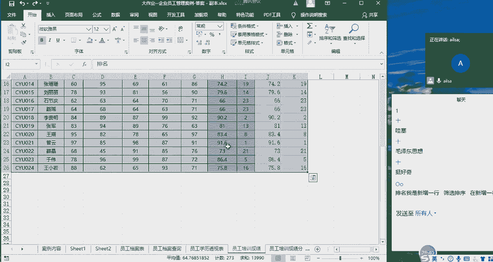
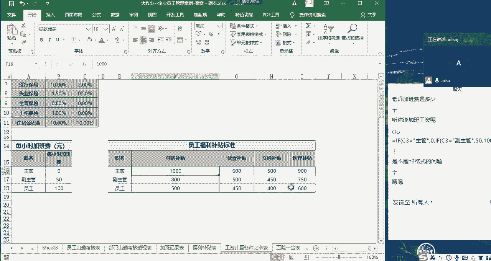
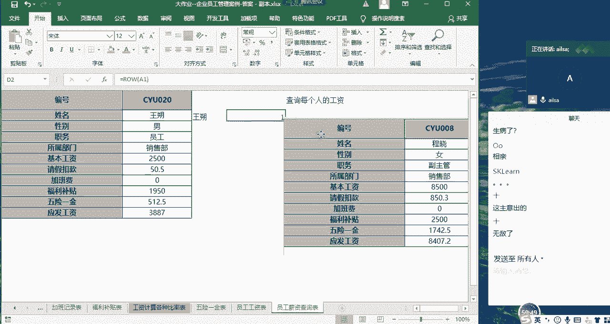

# 强推！这可能是B站最全的【Python金融量化+业务数据分析】系列课程了，保姆级教程，手把手教你学 - P80：06 周末大作业讲解 - python数字游侠 - BV1FFDDYCE2g

嗯写完了给我扣个一，我看有几个写完的。

嗯讲话写完了，唯一一个写完的大作业哈，厉害了哈，还有吗啊，已经写完了，算了不给他打了，思敏嗯，他他不行啊，OK啊那我们先看一下这个大作业，他嗯它的一个实际的意义哈，首先它是统计分析员工的基本信息的。

那在公司当中一个员工的信息啊，员工的一些信息都包含哪些呢，首先就是他的就是你刚入职的时候。

你肯定得有自己的档案吧，就是啊你叫什么名字对吧，你的身份证号，你的性别，你的入职日期，你的职务，你的最高学历等等，这些就是咱们的基本的啊基本的一些信息啊，肯定是要有的，那第二个的话就是说啊。

就是说你整个的一个在员在公司当中。

对于一个员工而言，他的信息也无非以下几种了啊，当然这个是比较简单了，如果说再详细到比如说你的合同，劳动合同的一个签订情况，还有就是啊你的绩效啊，KPI啊等等这些啊，这些都是一个员工他日常的一个表现啊。

那他还有他一些考勤对吧，哎培训的成绩，考勤的成成绩，以及他的一个工资啊方面的一些数据，最后可以做成工资的一个卡片明细，以及员工的一些卡片的明细，他是在实际的工作当中，基于员工基本信息而而形成的一张嗯。

就是excel的一个记录的形式，然后这一张表啊深刻的体现了啊。

体现了什么呢，体现我们整个的excel表之间的一个关联关系，数据的一些啊提取啊，然后以及匹配等等各方面的一个练习啊是吧，当然在这个表当中，你们应该充分学习到的是一个we look up的。

这样的一个函数的使用啊，你好多地方都用它是吧，嗯那我们看第一个员工档案表。

员工档案表呢，然后让你所做的工作就是说啊蓝色部分，然后需要你自己去填写，那我们该怎么来实现，你看出生日期啊，这个的话我们之前已经啊已经讲过了哈，那我这里再重新的讲一遍，然后带着大家去回顾一下。

我们该如何从身份证号码当中提取，我们的出生日期嗯，首先的话我们知道一个身份证号码，他的第第七位哈，123456啊，第七位，然后是他的年月日，那它总共长度是八，所以我们就用我们的文本函数。

mid函数来进行提取，等于me的啊啊mid啊，然后我们的第一个是我们的文本内容，然后我们的开始的位置是第七个，然后长度呢是八诶，我们提起完了之后，右括号，这个时候就出现了我们所想要的效果对吧。

就是我们的一个啊整个的一个啊年龄啊，或者是说出生日期啊，出生日期整个值已经提取出来了，那提取完了之后啊，我们要把先把公式给它去掉哈，一拉一拉拉回来哈，选择复制数值就可以了。

这个时候我们看里面已经是公式了啊，已经已经是数值了哈，当然它是文本型的，因为它数字的话是啊不行的哈，那这个时候我们可以直接对它进行一个，分列格式的转换对吧，我们的分列操作是在我们的数据选项卡下面啊。

数据工具里面有个分列，然后我们什么都不做任何操作，下一步下一步点击啊，输出日期格式点击完成，哎你看它已经是出现了我所想的效果，然后格式呢我们可以微调一下。

调成我们正常的日期的这种格式就可以了，唉这样就实现了我们所想要的效果对吧，这就是我们的出生日期的啊一个显示的形式，OK那接下来我们再看第二个问题，就是他的年龄，那年龄是怎么来计算的呢。

就是现在的时间去减去这个出生日期，不就是当前的一个年龄吗，对吧，那我们看一下是怎么来进行计算的，那也就是说我要计算现在的这个时间，现在这个时间我是不是可以用t o d a y today。

这个函数来实现啊，对吧，哎这个就是当前的6月23号，今天的一个时间，那我让它们之间进行一个相减，取年份不就得出来是我的年龄吗，对不对，那我们就可以对它进行一个嵌套了，我们对于日期之间的一个差值。

使用的是一个隐藏函数，data date哈，DAT啊，DIF他以第一个组成部分是开始时间啊，也就是小的那个时间，那就是出生日期，那第二个时间就是他的啊，结束时间就是它大的那个日期。

然后第三个组成部分就是它返回的计算单位，我们返回的是年年的话，一般是英文是year，所以直接写Y就行了啊，它就能识别出来，然后我们按按键A这边出来了，是一个1990 2月9号，这个是什么鬼东西。

其实它也是一个啊数值哈，我们把它设置成数值格式就可以了啊，数值啊这个时候就出来了，但是有的人就会问嗯，它为什么会显示日期呢，首先哈因为我们刚才设置的这个格式，默认的是日期格式，日期本质上也是数值啊。

本质上也是数值，它是从一九啊，我们在我们再回到刚才这个地方啊，他是从1990年1月1号啊，一九啊，1900年啊，杠一杠一作为一啊，作为一来进行一个加加速的计算的，我们刚才是不是40啊，40啊。

一个月是30天，大概就是一个多月的意思，大概也就是2月9号这样的一个位置，所以说呃日期的本质也是数值，它是从1900年开始进行一个计算的啊，大家这个可以作为一个普及的知识啊，来了解就可以了。

这个时候我们把它改成啊常规就可以了，但是有些人不知道的时候就觉得特别玄乎，是不是自己的公式写错了，然后就开始一个劲的找哈，其实不是哈啊就是它是一个啊嗯常识性的东西，OK那这边年龄就计算出来了对吧。

没有问题，我们把这一列删掉哈，接下来我们再看工龄啊，工龄的话其实它是相对于入职日期而言的，对不对啊，那这个也是说啊，当前的时间跟入职日期进行一个啊计算，然后得出来的一个年份，其实就是它的一个工龄的计算。

那在这里我就不做演示了哈，因为它跟年龄的计算是一样的，也就是我们使用dd，然后我们的开始时间是我们的入职日期，然后我们的结束时间就是当前的时间，我们返回的是年份啊，这样的一个结果就作为我们的工龄。

然后我们再接着往下看，诶，这有一个啊，因为工龄的话，就比如说你不足一年，他直接就给你舍去了，对不对，那我如果说想精确到月份的时候，我可以在这里面再加一个，再加一列，就是说不足一年它到底有多少个月啊。

比如说12个月以内的，你都可以在这里去计算，那这个时候我们就在想，那我们就在想我们该怎么实现啊，这样的一个操作呢，首先啊首先它我们计算出来的整个的一个啊，我们可以把所有的这样呃。

两个时间的所有的月份计算出来，然后除以12进行一个整除，那留下来的余数，其实就是它的不足一年的月份对吧，那我们大概的一个想法，就是说我先还是进行一个啊，两个日期之差的一个计算。

但是呢哎我这边的计算单位发生了变化哈，我们的开始时间是我们的入职日期，我们的结束时间是我们的today t t啊，t o d a y today啊，然后我们的单位变成了M啊。

这个时候我们先看一下我们的结果啊，看一下我们结果哎，它出现的是209个月，然后呢我们把这个值除以12啊，除以12啊，不对，整除以12，它的余数啊其实就是它不足的月份，相信大家这个都能理解哈啊。

嗯那这个时候我们求余数就是mod啊，然后这是我们的值，然后我们的除数是12，唉，得出来的这个结果其实就是它不足一年的工龄，那我们来在描绘这个事情的时候，就说唉李楠这个人，他啊他的目前的工龄是11年啊。

17年零五个月啊，这个意思哈17年零五个月啊，这就是我们第一个对于啊，我们可以看到对员工的基本信息，包括了啊这一些基本的信息职务啊，最高学历所属部门，那这个在实际的工作当中，我们记录员工档案的时候。

必然会包括这些信息啊，但是不仅仅只有这些东西，这些信息还会有很多这些啊，就是啊员工的档案的信息，那我们知道了这些员工的信息之后，我这么去看所有的数据，放在这里是完全没有问题的，但是如果说我在我这边。

想看某一个人的数据的时候，其实是比较麻烦的对吧，哎我还要拉到这一行去看，那我们可不可以给它做成卡片的形式，类似于这样的一个结构，哎类似于这样的一个结构，然后我只要查某一个人，这是我们的一个控件的设置哈。

我只要查某一个人，他就他就能出来它相对应的一个结果，我们在想这个功能到底是怎么来实现的呢，唉嗯我们可以知道，因为这边的信息肯定是根据员工编号进行，匹配过来的，因为我编号一遍，他所有的信息都发生了变化。

对不对，那我们什么样的函数，能够达到这样的一个功能呢，根据这个信息匹配其他的信息，我们想到的就是匹配函数，查找与匹配函数，那就是我们的we look up，我们该怎么写呢，我们可以在这里面去尝试一下哈。

哎在这里面写上等于啊we look up，然后我们的查找对象呢，就是我们的员工编号对吧，那我们的查找区域肯定是我们的员工档案表，我们需要这么多这么多的信息，然后那我们的查找区域。

首先第一列啊是我们的编号，所以编号必须是在我们选择区域的第一列，我们选择我们的区域，因为我们这边还涉及到工龄啊，也就到这个地方，所有的数据我们可能都需要选，选完了之后啊，选完了之后大家看到没有。

这个地方出现了一个info啊，肯定大家都很好奇这个到底是怎么来的啊，我等会儿再给大家做演示哈，那第二个区域就是我们到底要选择哪一列，我们刚才看到的啊，没看到哈，我们刚才假设啊。

假设我们需要选择的是姓名啊，那就是所在区域的第二列，对不对，然后我们再往后走，我们是精确查找，所以是零，然后右括号enter键唉，还真是姓名哈，那这个时候其实我是习惯性想往右拖的。

是不是往右拖的过程当中啊，这个值实在太丑了，哎我这个东西肯定是想往右拖的，但是我拖一行过来之后呢，大家看一下它这个列啊，这个二是不是要变成三了，你看性别在这个区域当中是不是三，然后身份证号是不是四。

入职日期是不是五这样的一个顺序，哎那我哎你看到年龄哈，我们看一下到年龄都是一样的哈，只有这个顺序是完全一模一样的，嗯那我现在要一个改，是不是特别麻烦，那我在想我这个数据里面其实就是二啊，我要写成活的。

对不对，那这个二我该怎么用其他的地方去替换，并且随着我拖动的过程当中，它从二变成三变成四变成五变成六了呢，唉这个时候我们想到了一个函数叫什么呢，叫等于嗯，因为你在往右拖动的过程当中，是列发生了变化。

我们有个函数叫能显示当前列的啊，显示显示当前列的一个叫column啊，引用啊，返回引用的列号，对不对，那这个时候我在这里面输入什么呢，输入C啊，我是我的，我只要是C列啊，行都无所谓啊。

C1C2C三都无所谓，我假设我输入的是C1啊，这个时候它返回的是三啊啊，这个时候我其实我们想要的是二，对不对，那我们可以把它改成B对不对，唉C不行，咱就改成B了，B哎我们看一下是不是二。

那我在往右拖动的过程当中给大家看一下，23456A刚好是我所想要的效果，那我就好说了，我直接把这里面的二替换成column，这个一个嵌套函数对吧，CEO啊COLUMN对吧，然后唉我们的内容是BB1啊。

无所谓，这个行是第几行都无所谓，因为它反应返回的是所在的列嗯，然后我们再往右拖动的过程当中，哎我们会发现又报错了啊，哪里错了呢啊哪里错了，我们看一下，OK我们看一下，B3啊。

我们的info应该是没有什么问题，稍等哈，哦我们的B我们的C3是不是啊，是啊啊，我们的C3是不是在往右拖动的过程中，往它发生变化了呀，对不对，其实我们是不希望这个单单元格发生变化的。

那我需要给它加上什么呀，加上dollar f，对不对，哎加上一个DOLF嗯，哎加上DOLF，我们再往右拖动看一下哈，唉是不是就达到了我所想想要的效果，对不对，那下面这些东西的话。

我们就稍微再改一下就行了，因为他们不在同一行上，哎那我们就把这个公式复制出来，把这个公式复制出来，然后在这里面输入什么呢，啊在这里面输入啊，稍等哈啊，你看我这里的列是不是到达了到达了G啊，G是多少呢。

这个是234567，那这里面应该是八对吧，那G后面应该是H，我们直接在这里改成H就可以了啊，H就可以了，然后我们再往后拖动它是员工对吧，哎我们再往后拖动看一下哎，硕士行政部嗯，联系电话工龄啊月啊。

我们的工龄有多少个月，那这个数据就出来了啊，这就是我们使用way look up当中的列，如果说有一定的规律性，而且是连续性变换的时候，我们就可以这么来操作，嘿同志们，这个听明白了，给我扣个一。

这个听明白了。

给我扣个一哈啊，思敏来了吗，思敏来了哈，哎啊思敏来了啊。

好嘞，思敏下回要定个闹钟哈，嗯等一下啊对还要讲一下info哈，你稍等一下啊，等一下我们呃上完课之后，我跟呃思敏留下，然后教你怎么去啊，安装我们的SPSS哈，这个info是怎么来的呢。

同志们来嗯啊我给大家演示一下哈。

现在啊我需要再新建一个表哈，比如说啊谁吃了什么没关系哈，比如说啊我在这里面输入一个一哈，然后我CTRL加C啊，选中我这部分区域哈，诶啊这部分也要选中哈，嗯假设对于这一部分区域而言。

我经常要用到这一部分数据区域啊，经常要用到，而且我每次选的时候呢都特别麻烦，我还要拖动它一下啊，不好弄，这个时候当我选中它了之后，大家睁大眼睛去看我，鼠标定位到这里啊，输入一个名字叫你好啊，在你好。

这个时候我们看一下我的鼠标，现在光标还是定位在这里的，然后我不要动鼠标，我直接按enter键，然后当下一次我再选择你好的时候，大家看到没有啊，它已经被选中了，这个叫名称管理器哈，名称管理器。

它的整个的功能应该是在公式里面啊。

有一个名称管理器。

哎你看到没有，这是我的info，这是你好啊，这里面你点进来，它就有引用的位置，然后他起了一个名称，那下一次你再输入，比如说我在这里面输入等于v look啊，不管是任何函数都是一样的哈，we look啊。

Up，然后第一个我的查找区域是这个地方啊，查找目标是这个地方，第二个我的查找区域我直接输入你好啊，它稍等啊，还直接输入你好啊，这个时候它代表的就是这个区域了啊，它代表的就是这个区域。

然后啊接着再往下去走就可以了，也就是说你这个啊你这个的一个名称啊，名称管理器，是说你对某一个区域进行了一个重命名啊，或者说不是重命名哈，进行了一个定义啊定义，然后你经常使用它的时候，你直接选择就可以了。

你比如说刚才我是输入的，你还可以怎样呢，你可以在这里啊，不是在这里啊啊好稍等啊，看一下，反正你还可以在这里，然后一选就定位到你好了啊，然后名称管理器我再输入一下公式哈，再试一下，We look up。

然后我们的查找目标啊，我们的查找区域，然后我直接在这里面哦，不是这哈，不是这在这里面输入就行，应该是我选择这个OK啊，选择了之后啊，这样子，然后比如说我们选择第二列啊。

然后另一个哎这个时候因为他找不到哈，比如说我看我的一三在哪里，一三在这是吧，哎你看他是不是找着了，哎这就是我们的名称管理器的用法，然后大家现在自己可以试一下，看能否成功，我再演示一遍啊。

我们选择这一部分数据区域啊，如果说这一部分数据区域你经常使用啊。

你经常使用，你看刚才这个员员工档案档案查询的时候，如果说大家是一个一个输入的，那我们要频繁的输入我们的数据区域，对不对啊，那频繁的输入这个数据区域的时候，那你就比较麻烦，你在选的时候。

你可以完全直接定义。

另外哈，另外如果你定义了这一部分的数据区域之后。

你在进行拖动的过程当中，哎你比如说你没有定义的时候，他是不是要加DOLF啊，因为它区域会变，对不对，但是如果说你你定义了这个数据区域之后，它就是死的了，它不会变，然后它永远都是这一部分数据区域，看到没。

所以它就不会发生变化，这也是我们在使用公式与函数的过程当中，比较便利的一个知识点，好吧啊，一个功能嗯，大家对于名称管理器了解了没有啊，或者说设置成功了没有，如果成功了或懂了，给我扣个一，怎么删压啊。

怎么删是吗。

删啊那当然是在名称管理器里面去删了啊，我们点开这个地方对吧，你看选中它拟好点，用它删除就可以了啊，这样就可以嗯，啊就是任何你比如说我在这里使用的话，它是一个会计的方式，你真正要创创建名称管理器。

应该在这里新建哎，然后编辑怎么怎么着，当然了，你这样做完全也没有什么问题啊，但是你做的熟了，你就可以直接啊在这里选择一部分数据区域，直接唉双双击啊，再单击进来，然后输入个名字。

按enter键就是就结束了，如果说你操作这种形式，你不好操作没有关系，你选择好啊，你直接在名称管理器里，然后选择你的引用的位置，你的区域啊，比如说是这一部分区域，然后给它起个名字啊，还可以写批注等等。

这些都可以呃，批注的话只是为了解释你这个数据区域，是用来干嘛的，它是包含什么数据，类似于这样的一个比较完整的啊，标准的操作方式啊，一般会计的就这么干啊，啊就是啊excel比较熟的人可能会比较喜欢这么干。

OK啊其他人听明白了吗，听明白给我扣个一，嗯好的。

好的哈，都听明白了，那我们这个卡片哎这个功能我们就讲完了哈，讲完了之后，我们接着看下面啊学员的学历特殊透视表哈。

这个就是说我们想看一下不同部门。

他们对应的人员的不同学历的一个情况，然后看一下每一个学。

就是每一个学历所对应的一个人数啊，一个这样的一个透视图，那这个操作起来还是比较简单的。

我们把鼠标定位到我们的啊员工档案表，然后呃插入啊数据透视表，我们选择新的工作表啊，新的工作到表之后，哎他的一个横向维度的话就是我们的部门对吧，我们的部门啊，所属部门投导行，然后呢最高学历拖到列哎。

这个时候他又出现了，我们要对它进行一个人数的计算，所以说我们直接推嗯姓名啊，进行count计数就可以出现了，然后现在呢我们想知道总体的一个好，这就是我们的一个基本的情况，我们想知道总体的一个学历啊。

他的一个情况的时候，很多人应该是不知道我是怎么来操作的，其实就是复制一下啊，复制到啊，复制到下面就可以了啊，啊复制到下面啊，然后把这个总计也复制一下啊，然后复制完了之后啊，再进行一个画图啊。

或者是说啊在这里的话，应该你直接画数据透视图的话啊。

它会还是会分不同的啊。

嗯他画的是条形图是吧，画条形图它还是分不同的部门啊，啊分不同的部门，这样子啊啊我看一下哈啊它是分不同的部门。

所以说并不是我们所想的效果，如果我们想要这样的效果的话，我们需要把它复制出来。

然后插入啊我们推荐的图表，然后选择条形图啊。

然后这个啊就可以了，就出现我们所想的效果了啊对啊，没有什么难度啊，就是他这个就是看你想要什么效果，如果是你觉得你觉得你是，你就想看每一个部门，他的每一个学历的对比情况，然后啊也可以啊，都忘了哈。

你那个没关系，哪种方式都可以，只要实现啊，只要实现这样的一个效果就可以了啊，冉总啊，哎呦妈呀，都都叫老总了哈。

OK你看是不是这样的一个效果哈哈，然后我们啊这个这个OK吧，这个比较简单啊，如果说没有问题，然后给我扣个一啊，好的嗯好的嗯。

那我们看员工培训啊，培训成绩哈，员工培训成绩，这个就是我们在实际的公司当中，其实也会有很多培训哈，我我在原来的公司的时候，好像是每周二下午会有一个小时，是职业的培训啊，就是给你讲一讲啊。

什么什么呃什么呃职业素养啊，还有就是什么爸爸的能力啊什么的啊，反正就是呃就是作为一个职场人，应该具备的一些管理的思想吧，还有一些嗯就是职场的一些东西啊，都会做一些培训，然后我们也是。

然后呃我们也是培训完了之后就会有考试啊，就会有考试，然后考试不合格还还挺难受的啊，但是那个考试就是大部分都是阐述类的啊，就是咱们讲的课，课本上那种好像是具有实践意义的那种。

嗯嗯然后我们也是有这种啊专业的，就是我们职业就是我们岗位，我们有岗位的考试，然后有公司的考试啊，这样子啊，嗯然后是呃之前给我们讲课的，基本上都是人力的培训老师哈，因为人力专门有一个培训部。

负责全公司的一些培训什么的啊，基本上正规的公司的话啊，这些应该都会有，因为它对于员工的发展来说还是比较好的，OK那我们扯远了啊，我们再扯回来哎，就是不同的一个成绩，然后他的一个考试平均分。

这个其实就很简单哈，平均分就等于AV嗯，av12AGE哈，这跟我们的数据库当中稍微略略有不同，我们的是AVG在数据库当中，这个是AVE2A啊，AGE哈，average啊啊数据库就有点简写了。

那它既然是平均分，也就这些科目全部都放在一起，进行一个加和除以它的个数对吧的，整个的一个公式是这么来的啊，uh u a v e啊，选错了，不好意思啊，AVERAG啊。

OK啊我说呢OK这是我们的平均成绩啊。

放在这里啊，我们当时的时候考试还会有啊，有排名是真的有排名，然后还会会让你去上去分享啊，讲课等等之类的啊，这样的，然后还会有定期的颁奖啊啊就搞得特别正式哈，排名的话我们在excel当中没有讲过哈。

我们是rank函数哈，rank啊，rank啊，这是我们今天刚说过的，这是直接选最后一个就可以了，然后它的一个组成部分，第一个值就是说啊我们选这个一个值哈，它是对一列而言，就这个值在所在区域当中啊。

所在区域当中啊，到底排第几啊，这是第二个啊，我们的区域嗯，我们的区域，然后第三个的话就是我的排序的方式哈，我们看一下啊，零是降序，一是升序啊，假设我们是按降序去排列哈，假设按降序排列，哎这是第三名啊。

哎往下走就可以实现了，他这个rank的排序应该是嗯如果有重复的话，应该是跳跃式的哈，啊应该是跳跃式的哦，我这边来做一下判断哈，啊这个是我不知道它会不会影响我的啊，影响我的结果嗯，哦有一个没有没有没有对。

我们看12345678，你看跳跃式的八完了之后就直接是十哈，呃排名我是先新增一行啊，筛选排序，再新增一行一往下拉。

那你是嗯改变了它的顺序吗，我们这个用rank函数的话是不改变顺序的啊，啊我们看一下这个结果为什么会报错啊，我们看一下为什么这个结果会报错啊，嗯这个是H二九十一。6，它的区域是H3到H26。

OK我们还原一下哈，啊OK我们看一下哪个地方报错了。

哎没有报错，可能是刚才我排序的时候，它啊整个把我们的标标题啊给弄弄，弄到最上面了，所以他匹配不上了，因为我们选择区域是从第三行开始的啊，那这个没有什么问题哈，那我们都知道了，这个rank啊是一个啊。

我们在学数据库的时候知道他是跳跃式的，那跟我们数据库啊，excel当中其实是一样的，所以说你会发现哈，你在学的东西越来越多的时候，你会发现它们之间是相通的啊，一定是相通的，所以说你要学会联想和思考啊。

那什么叫联想和思考，就是说如果说你遇到了一个类似的功能啊，类似的功能我在这里面给大家买一个伏笔哈，类似的功能什么意思呢，你比如说嗯你在后面啊，过几天下个月你们学习了Python。

现在我想让你拿Python啊，拿Python做我们今天上午的面试题啊，上午的面试题，那你就要去想，我们上午的面试题的核心在于什么呢，就是如何啊找出的当天啊最晚的那条记录对吧，然后把它筛选出来对吧。

是这样的一个目的，那你用Python的时候，你是不是也可以使用rank函数，对它进行一个分组排名对吧，你对每一天的数据进行一个分组排名，排名出那个呃，比如说你是按降序进行排列的。

那你就取第一个值是不是也有，你猜猜想是不是也有rank这样的一个函数，来达到所想要的效果哈，在这里告诉大家啊，是可以的哈，啊我这边就这么做的哈，你们到时候哦，我如果说有时间。

我会跟进一下你们啊完成的一个效果哈，你会发现啊，excel circle Python啊，包括后面SPSS所有的数据分析的工具，在进行数据清洗的过程当中，都有异曲同工之妙啊，因为啊他们首先都是二维表啊。

今天安装SSPSS，你们也发现了它也是一个二维表，那Python呢它的很典型的一个数据结构叫data frame哈，Data frame f i m e，那他这个也是典型的二维表，也是一行一呃。

一就是这很多列很多个行这样的一个组成的啊，所以说嗯我们会发现，在进行一个数据存储和处理的过程当中，二维表是一个很好的方式，这也就是为什么我们在讲电子表跟历史的时候，198几年的时候。

已经开发出了这样的一个结构形式，用来做数据的一个计算的一个原因啊，好啦我们扯远了啊，我们再往下走哈，员工的成绩这边就讲完了，然后再看唉员工的成绩的分析，也就是最高分，最低分及格人数，及格率平均分。

我们接着往下来走哈，最高分，然后每一个啊类型的一个最高分啊，那我们可以直接在这里面用我们的max，我们的max函数，然后选择我们的数据区域，如果说我们这个数据区域经常使用的话，我们可以怎么着。

我们可以给它设置啊，设置一个哦名称管理器哈，我们把它设置为什么呢，嗯培训的话一般是叫嗯什么呢，哦那就叫培训吧，培训哈哈，然后按enter键哈，这个时候这个时候不要动鼠标，按enter键就行了哈。

这个时候它就识别你，比如说现在唉我选择培训诶，他就选择选择我所想要的效果了哈，然后我在这里面输入啊，等于啊max啊max，然后它的整啊，我其实用的不是整个数据区，我用的是其中一部分了。

因为他要求英语的这一列的一个最大值哈，我们选择英语这一列，哎哎我们右括号括起来啊，这个时候是100分，大家想一下英语办公软件，电子商务，计算机会计知识，是不是跟这边的顺序是一样的呀。

那我在往右拖动的过程当中，是不是，我就无形当中已经满足了这样的一个需求，诶我往右一拖动是不是就达到了我所想的效果，那下面的最低分其实一样的，我只要把max改成什么，改成min就行了哈。

唉等于这个就没有啊，这个就没有什么的啊，我们把max去掉啊，麦克去掉，然后我们再按N键，就是我们的最低分嗯，所以低分往下走，OK哎就可以了，然后还有一个及格人数啊，及格人数相当于是我们要对它进行一个啊。

条件计数对吧，那首先呢他要成绩先及格，才会参与我们的一个人数的统计啊，所以说我们在这里是等于count啊，control c o u n t count if对吧。

哎count if我们第一个是我们的区域，那我们的对于英语成绩，我们选择这一部分数据区域，然后第二个是我们的条件，我们填什么呢，大于等于60，这就要及格了对吧，大于等于60，OK有括号括起来哎。

这个时候我们其实也可以往右拖动哈，哎我们看一下是不是几个人数，24，22，24，23，24没有问题，然后我们再看及格率，那及格率的话其实就是及格人数除以总人数，唉我们看一下总人数大概是多少啊。

OK总人数的话是我们的24个人啊，所以说我们在这里面写上总人数，那它就等于我的及格人数啊，除以啊除以我的啊，总人数在这里，总人数作为分母，我们不希望它发生变动，所以需要给它加上do乐福对吧。

再加上DOLF，我们再往右拖队，哎你看它显示的这个效果并不是特别好，我们可以给它设置成百分比，CTRL加一哈，调取我们设置单元格格式的一个对话框啊。

百分比啊，这样可以了，这个时候我们会发现就跟他一模一样了，最后是个平均分，我就不讲了哈，平均分的话就是我们的average，然后选择我们的区域就可以了啊，大家对于这个培训成绩的分析都听明白了吗，很简单。

听明白了，给我扣个一，同志们，同志们嗯好。

好的嗯，嗯那接下来我们看考勤的变化啊，考勤表啊，来我们看一下考勤表，我们的一个规则是什么，试驾啊，应扣工资，因为你要你请假，迟到了吗，迟到或早退，然后这是请假，然后请假分试假和病假对吧。

然后如果你请事假的话，就是你就是一天的工资嘛，然后病假的话就是一天工资30%，还算人性化哈，然后迟到的话啊，迟到天数啊，这个应该写错了哈，这不是迟到天数哈，这个应该就是迟到扣的钱哈啊迟到费用哈。

迟到FA啊，迟到费用它就等于迟到或者是早出的小时数，乘以0。2，也就是说啊就是比如说你迟到啊，一小时啊，你扣的钱就是呃怎么说怎么说啊，就是一小时00。2元啊，可能这个这个这个这个有点问题哈。

这个可能有点问题啊，但是我们暂且这么去想，因为他这个只是规则的问题啊，所以说计算起来还是一样的啊，嗯如果说我看一下这个哈，如果说是3。5哎，确实是这样啊，确实是这样，然后我们看一下怎么去计算的。

首先我们先想怎么去计算，因为它这个是请假分啊，市价和并假这是两种，所以我们就需要用到AF的判断，对不对，那如果说假设啊，假设什么呢，啊假设我的这个请假类型啊，加价类型等于市价，啊等于试讲市价啊。

如果是市价的话啊，那我的整个计算方式是什么呢，就是当天的工资对吧，那我们这个工资就是总的工资，我们要计算一天的工资该怎么去计算呢，唉啊那其实正常的一个计算方法，应该是总的工资除以啊，除以它的呃。

应出勤天数或实际出勤天数，这样算出来每天的一个工资对吧，那在这里我们没有这个数据，我们占暂且按30进行计算哈，当然这个值不合理啊，因为不可能每个月都出勤三三十天，基本上出勤时间大概是21天。

到23天之间，如果是双休的话啊，那没关系哈，这就是一天啊一天的一个工资，然后我乘以他的请假天数对吧，那我们再把这个括号括起来哈，诶括号括起来，然后再乘以我们的请假的天数啊，世价和病假前加天数。

如果说它不是世嘉，那它就是病假，因为只有这两种情况，所以说如果是病假的话，它就是啊它就是啊啊一天工资的30%，那也就是说我们要成立的这一部分值，然后再乘以0。3就可以了啊，复制过来了吗，来加C乘以0。

3，然后这是我们请假的一个计算的工资啊，那我们再加上我们迟到或早退的工资，那也就是我们整个的一个小时数，乘以0。2就可以了哈，啊我们看一下诶是不是这个值啊，让我们双击下来。

OK就达到了我们所想要的效果啊，就是这样，这个应该是规则的问题啊，这个规则应该写的有点问题啊，在这里我们就不去详细的追究了啊，那这个其实就是简单的if函数的一个使用，没有什么特别的难的地方啊。

大家对于这个有个疑问吗啊应该没有疑问哈，我就不问了，应该是没有疑问的啊，啊没有疑问哈，OK部门出勤考核透视表，这个其实就统计一下每个部门的请假天数，迟到或早退的啊个数啊，我对迟到和早时的小时数哈。

因为这是以小时为单位的啊。

这个也比较简单哈，我们插入数据透视表，然后新工作表啊，我们去演示一下每个部门他的一个请假的啊，请假的天数啊，求和哎有了，然后请假的啊小时小时数应该是这个啊，求和哎都有了。

然后我们画个图哎，数据透视图这样进行一个对比一下，然后这个数据你别看简单哈，它是嗯，他是考核每个部门的一个很重要的一个指标哈，很多啊经理的绩效还有KPI都是跟跟考勤挂钩的，这也就是为什么啊。

你在公司当中，你给领导请假，领导有时候不愿意让你去请的原因，就是如果说你的请假率还有迟到率，达到了一定的标准，或者是他们的呃叫红线的话，他这个绩效有一项是清零的啊，就是关于。

因为你这个员工整体请假率都很高的话，就是整个部门的请假率很高的话，代表整个管理有问题啊，所以说这个考勤数据也是非常重要的啊，我们可以看到销售部啊，嗯哼都是销售部迟到，所以嗯，啊对是的啊。

就是在公司当中啊，能力有能力的人啊，就是有话语权的啊，这个很正常哈，我们可以看到在销售部的话，他这边的一个迟到或早退的现象是非常严重的，那我们也可以想一下，有可能是人嗯。

晚上啊他们的工作时间也挺累的对吧，晚上可能加班了或怎样的时候对，挺辛苦的，这还能够理解，大家都知道销售这个岗位是最难做的，但是他赚钱也是来的最快的。

有很多人说你如果想挣钱就去做销售，如果说你你你吃不了这个苦。

那你就算了啊，对是这样子，每个公司的销售都很苦啊，不是说啊我找一家公司，然后我做个销售，我就可以享清福了，因为销售是以业绩作为导向的，他们真的是就是说你干了，你就你你就说你很用心的去干。

你不一定会有收获，但是你不用心的去干，你是绝对不会有收获的啊，这个这个这个道理，在他们身上验证得明明白白的啊，就有的人特别努力啊，就是说天天啃刻苦很努力，然后再跟客户沟通，再给客户打电话。

然后再介绍什么什么学习各种东西，但是他就是不见成效啊，但是有些人只要你就说你不好好干，你绝对是啊，这个这个是毋庸置疑的啊，但是对于第一种人，他有可能是短时间内见不到成效，如果他坚持下去的话。

也许会有不一样的收获啊，也许他就会在某一天，或者在某段时间突然就爆发了，这个也是很有可能的啊，我见过很多，就是前期的时候啊，领导都认为他不适合做销售，但是他还是很努力，然后到后面就突然突然有段时间。

他整个业绩就爆棚了，你就就感觉是他之前整个的一个积累，然后造成了这样的一个现象，就就是所有的所有的就他周围看不起来的人，都觉得挺厉害的啊，我们之前公司有个销售一个月啊，两个月两个月还是三个月。

然后嗯在天津买了套买，就是在天津啊付了房子的首付，后来又哦后来又去嗯加拿大深造了，还是怎么着，刚开始的时候，刚开始的时候就是哎呀就特别难，就是他也很痛苦，他都一度怀疑自己不适合做这个岗位。

但是人好像至少坚持了一年半啊，快两年的时间啊，后来人做上了主管啊，做上了经理，然后后来人又想自己出国再试，就是再深造一下。

还是挺厉害的，OK哈嗯扯多了哈，接着往下走，加班记录表哈，这个逆袭不是说哎我我就在想哎，我是不我是不是等了一段时间我就逆袭了，这个逆袭谁都想不到，可能他自己也没有想到怎么会这样。

但是他前期确实是努力了很多，嗯嗯OK我们看加班的整个的一个记录表哈，加班情况唉，他有开始时间和结束时间，一般情况下，这个数据是从公司的打卡记录里面去获取的，然后这边的计算的话其实没有教大家。

我们有一个函数叫over哈，不仅仅有这个时间，还有其他的什么秒啊等等这些，然后你可以直接让他俩相减得出我们的啊，一个以以这个单位啊为啊，为计算标准的这样的一个结果啊，等于our看一下，然后直接我们的啊。

我们的选择这个区域啊，应该就可以了啊，不是啊，他俩相减哈，sorry啊，sorry啊，然后是改成减号嗯，OK又错了，为啥呢啊写反了，时间这种负的它识别不了啊，所以说必须得是正的。

他不会说出现一个负的时间，因为时间负的没意义啊，再试一下哎，可以了对吧，好的，那我们的一个加班费是怎么来计算的呢，就是主管啊啊主管好好好那个啥呀，主管作为管理层，他们的薪资也比较高一些。

所以说他们加班都是无偿的啊，啊那对于副主管来说是每个小时50块钱，员工的话是每个小时100块钱，唉这个工资还不错哈，这个公司啊厉害了啊，加一个小时班给100块钱，这一天才多少钱，给的有点多哈。

这一对加1+1个小，加一个小时给50块钱，倒还能理解，OK我们写上我们的加班费的一个对象啊，如果说啊他是职务是啊，职务是主管，那他的加班费是多少呢，他加班费是零对吧，哎如果他不是主管。

那他如果是副主管呢，我们需要用到if f函数嵌套唉，那就是选择他，如果他是副主管，那他的就是每小时啊，每小时乘以50对吧，乘以50元，然后如果他既不是主管，也不是副主管，如果他是员工哈。

假设就只有这三个岗位哈，假设只有这三个岗位，然后那他的结果就是他的加班时间乘以100哎，就可以了，我们需要加两个括号啊，Ok，嗯看一下啊，App on，FC3哦，什么玩意。

我写的等于啊等于主管条件都没写，干哈呢，加班费没有，他们公司没有加班费，主管无偿的主管哈，你们都不仔细看吗，都听我唠嗑了，是不是等于啊等于什么呢，副主管，我这写的啥，图书馆，OK可以了啊，他说什么。

来来来，给我帮看一下错误，让我看一下啊，标的符号是英文的吧，如果C3啊等于主管，没有问题啊，他就返回零，然后如果不等于主管，他就再判断一下C3等于副主管，它返回的是这个结果，如果都不是返回的是这个结果。

等于员工啊，这个是一样的，稍等啊，OK现在我们重新写这个函数啊，这这么简单的函数，我竟然能写错，假如我们的条件哎，这个职务它如果等于等于嗯主管，它等于主管的话，我们的整个的一个返回的结果。

返回的结果就是零啊，就是他没有工资，如果它不等于主管对吧，它不等于主管，那他假设它等于副主管对吧，它等于负数吧，他等于副主管，副主管还是副总管，OK那等于副主管的话，它返回的结果就是啊H3H3啊。

乘以嗯乘以50对吧，然后如果不是啊，既不是主管，也不是副主管，那就是H3100，OK我们这个函数写完了，然后再加一个括号，我们另外一个函数也写完了，好诶奇了怪了哈，不知道啊，你看现在好了。

就刚才写的一模一样啊，我只是说这个等号没有给它，没有给他给他空格的原因吗，不至于吧，我试一下啊，我这也是欠揍哈，没问题啊，刚才是咋地了，唉有时候他会抽筋啊，好的哎，那我们这个其实就简单。

也就是A法的AF函数的一个嵌套使用啊，这个就是我们介绍一个our啊这样的一个函数啊，进行一个啊是啊，就是这个时间一段时，两个时间点之间的一个相减得出来的一个啊，其实他就是返回了一个单位吧。

相当于就是返回小那个小时这样的一个单位，我们再往下看哈，福利补贴哈，福利补贴，然后我们搂眼哈，住房补贴，伙食补贴，交通补贴，医疗补贴还挺好，这个公司真好，什么补贴都有啊，然后啊。

然后我们看一下他这个补贴的标准是什么啊，他还是按不死岗位主管，这个补贴是高一些高一些，然后副主管唉，我们看一下低一些员工又低一些，那其实这个就是判断一下啊，啊对还不是判断哈，这个是根据啊。

根据我们的植物的类型去匹配，去匹配什么呢，去给它对应的一个值哈，这个需要给大家做一下演示哈，啊比如说我们现在we look up一下哈，匹配过来值，比如说现在他是主管，那么他在这边去匹配的时候。

我们看一下匹配到的就是这个数据对吧，这份数据，然后主管的话他就是往后住，住房就是二对吧，我们需要加上一个什么呀，加一个do乐福，哎对了，你咋玩，人家没选择完，Dollar for dolf。

然后我们的住房补贴返回的是二，A返回的是二啊，然后我们是精确匹配，按按键就可以了，那我们写完了之后，是不是要往右拉，因为他这个顺序大家看一样的。

对不对，住房伙食交通医疗，那我在往右拉的过程当中，是不是我这个二要变成三变成四啊，那这个时候是不是用到了我们刚才所学的，COL啊，column这个函数，然后既然是二，那肯定是B列对吧，第二列的值啊。

B列啊，然后我们按按键，这个时候我们再往右拖动，哎我们看一下唉，你看我们整个的一个啊，就是这个C3呢啊是怎么着呢，就是说我们在往右拖动的过程当中，我们不希望它发生变化，但是我们在往下拖动的过程当中。

我们是希望它发生变化的，所以说我们需要在列方的方向上，加上我们的DOLF对吧，列方向上加上到了F，然后我们再往右拖动哎就可以了哈，我们就我就不往右拖了哈，因为它会影响到我这个数据。

我们拖两列大概就知道了，就是我们想要的一个结果对吧，没有问题哈，没有问题，这就是我们进行匹配，we look up又一个练习嗯，大家对于福利补贴表有什么问题没有，没有好完美，OK哈我们再看下五险一金啊。

这个也是一样的哈，这个就是we look up，我们按照不同的啊G2不同的不G啊啊啊，养老保险啊，这个又不一样了哈，这个因为因为是这样的，像这种啊养老保险，医疗保险，失业保险，生育生育保险工险。

住房公积金，那都是一样的啊，都是一样的啊，然后的话它的比例是一样的，但是它的嗯他的每个人的工资是不一样，因为他说他要根据公司对应的一个比例，进行一个计算，对不对，我们先看一下哈啊扣款比例啊，养老保险啊。

个人8%啊，这样的啊，他会根据每个人的基本工资，然后进行一个不同比例的计算，所以这边的话只要把不同的保险啊给他匹配上，然后再让他们每个人的工资乘以它对应的比例，就可以了对吧，对应类型的比例。

你看一下那养老保险的话，我们在这边匹配的其实是这个值啊，然后啊我们看一下哈，我在这里写啊，我们其实用两个就可以了，多了也没用啊，OK啊啊，然后我们看一下哈，它等于we look up。

我们匹配的第一个值是我们的养老保险啊，然后保险呢在这里的话是在这个位置对吧，我选择它，我们计算的是个人，对不对，那我们在这里加上dollar佛，唉，然后我们匹配上了之后啊，匹配上之后。

接下来哎我们找到了这个养老保险，他啊它返回的这个列呢其实是它所对应的比例，对不对，他列应该在第三行和ABC第三行那三啊，3ABCD3行，然后最后查到结果是零啊，这是我们的精确匹配。

我们匹配到这个值之后啊，这个结果哈，这个结果我们还要再乘以唉，我们对应的基本工资就可以了啊，乘以基本工资，然后就可以了，那这个结果就是我们所想要的结果，但是我们要往右拖动。

所以说我们这个G2的前面的这个呃，你看它是不是在横啊，在在列方向上啊，所以我们希望往右拖动的时候，它的列发生变化，而它的行不发生变化，所以需要在二前面加上到了F对吧是吧，OK那我们试一下往右拖动哎。

可以哈啊发生变化了啊，因为我们这个啊我们这个列啊，我们这个列啊拖动一列啊，拖动一呃，拖动一列的话，它这个三要变成变成啥呀。

三要变成啊，四变成医疗保险，是不是，所以说我们这边啊啊是对应的，他没有他没有设置哈，你看投什么，我看一下哈，它匹配的值永远都是三哎，那为什么这个会变成二呢，G2，没有问题啊。

好大家看一下我这边到底出了哪哪个什么问题，到这里面的话是H2哦，H2而肾没有问题，医疗保险对吧，嗯但是我的呃工资啊是不是发生了变化呀，啊因为我这个是F3，然后我在往右拖动的过程当中变成了AG3。

其实我是想变成的是什么F4，对不对啊对啊，不是还是F3哈，F还是F3，所以说我们在往右拖动的过程当中，这个基本薪资啊，这个计算呢啊，我们是不希望它列方向发生变化的，是希望它啊行方向发生变化。

所以我们需要在嗯F啊，这个前面加上dollar for啊，加上DAF啊啊所以说你看还是有学问的哈，所以要一步步步去试哈，不过这个也没有关系啊，你就分析一下不对了，然后就分析下什么原因造成的就可以了。

哎哎这样这个结果就是我们所想要的了对吧，OK啊看来大家都听懂了哈，只有我自己在在迷糊当中哈，我说诶咋不对呢，我后面没看到有一个F3，哈哈好的嗯，那我们接着往下走，看一下员工工资表哈。

那工资表就我们刚才啊我们计算了五险一金，计算了福利比补额补贴，计算了加班，计算了考勤，然后等等这些，他是需要把这个we look up放在一起的，你比如说请假对吧，明天不放假呀，明天上完才放假哈。

别着急啊，你这个明显是嫌弃我的课了，是不是它主要主要是把我们的你看请假扣款，那我们就啊我们就回到我们的呃，考勤表当中是吧，考勤表当中，然后有应扣工资，我们把这个数据根据什么啊，根据什么来匹配呢。

啊根据我们的编号，员工的编号给他匹配过来，然后加班费也是一样，福利待遇，五险一金，因为我们在原来的表都计算好了，这不有合计吗，计算好了，所以我们直接把它匹配过来，然后这个应发工资他就是等于前面啊。

前面这个我看一下啊，好前面的基本工资减去请假加上加班，加上福利待遇，再减去五险一金，就是我们的啊最后的应发工资啊，想请假啊，明天上完课对上完课啊，啊这个啊员工薪资管理表大家听明白了没有，因为我没有演示。

主要用的还是we look up啊，因为这个也没有什么啊，那个啊也没有什么就是啊技巧在里面啊，所以我就没有讲啊，OK我们看最后一个哈，最后一个薪资查啊，查询表我需要讲一下哈。

啊这个就相当于是一个卡片式的啊，跟我们第二页那个员工基本信息表，还是有点类似的哈，我点一下这个，它就会出现一个新的内容，对不对，那我该怎么去实现呢，就你就你脑子就你脑子灵光，你从现在开始请假。

你从上周开始请假，你都可以放假一周了，是不是，OK哈，我们看怎么来实现，我们还是根据编号进行一个匹配对吧，根据编号进行一个匹配，哎呦吓我一跳，我还以为有敲门呢，嗯根据编号进行一个匹配。

然后我们匹配的值呢是我们的姓名性别职务，那也就是我们的这个员工的工资表是吧，哎那我们根据编号进行一个匹配匹配，我们这所有的数据匹配完了之后，我们把这个区域加上dollar符啊，加上dollar符。

你又选了一个插上do乐佛，然后第二个就是我们返回的结果，这个姓名应该在我们所在区域的第二列是吧，返回二，然后再往下走，哎零就可以了，哎那这个就结果就出现了，那现在我们要往下拉拖动，对不对。

往下拖动这个二，我希望它变成三，然后往下就是234567，但是我们刚才是往右拖动的，是不是它是列发生变化，现在往下弄，它是行发生变化，所以我们这个二啊就要用行来实现。

然后我们先介绍一下我们的行函数等于肉，哎其实跟列是一样的哈，比如说现在我输入A1啊，我输入A2吧，我输入A1哈，先输入A1，然后大家看一下它返回的是一。

也就是第一行啊，这个时候我把1A1改成啊啊A1改成B1，大家看一下啊，A改成B还是一，也就是说它只会对行进行起作用，比如说我把B1改成啊B2A它就变成了二，对不对，也就是说你是哪个列无所谓。

你只要是行就可以了，那我们在这里它这个是二，我们就可以替换成RO啊，roll什么呢，呃rob2啊就行了啊，Rob2，然后我们再往下拖动，这个时候它会变成B3B4B5A往下走，唉看又报错了。

那也就是我们的整个的一个查找区域哈，就我们查找对象应该是固定的，按F4哈，让我们再往下拖动试一下，O你看销售部2500是不是数据完全就准确了，这就是我们使用v look up。

结合roll和com函数进行的一些操作，那对于这个大作业我已经讲完了啊，大家有什么问题没有啊。

