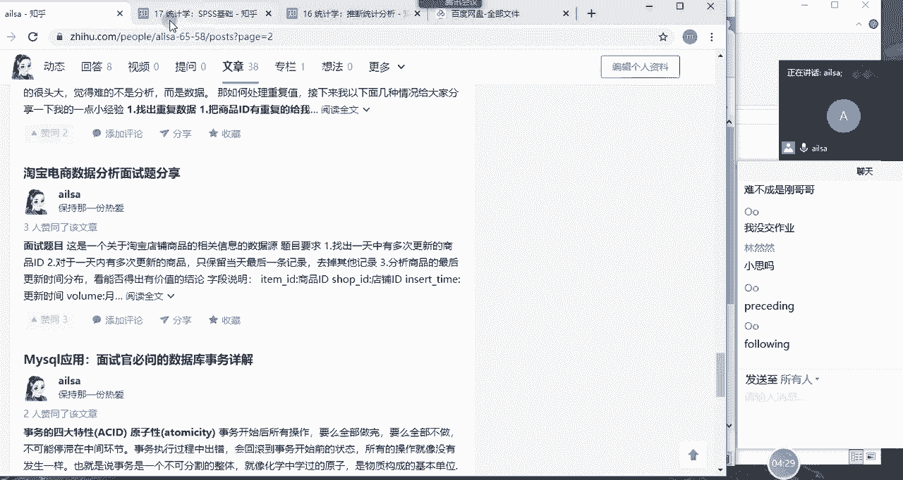
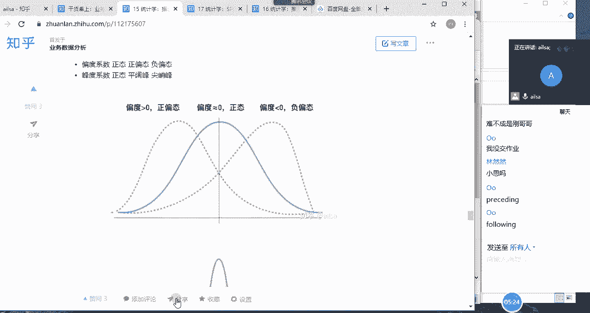
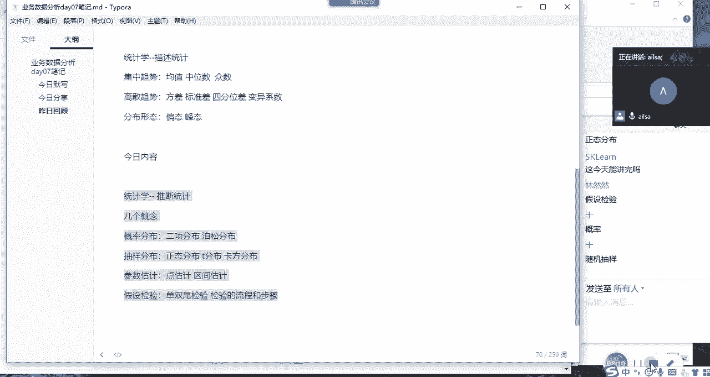

# 强推！这可能是B站最全的【Python金融量化+业务数据分析】系列课程了，保姆级教程，手把手教你学 - P82：02 昨日回顾&今日内容. - python数字游侠 - BV1FFDDYCE2g

哎同志们，我接下来我们回顾一下昨天讲的内容哈，昨天啊昨天我们又把啊sorry哈，昨天我们又把开窗函数的一些重要的知识点啊，给大家啊讲了一下，我们讲了什么rose啊，rose啊，Rose。

然后between and是吧，b t w e e n between and啊，这样的一个判断啊，就是判断整个的开窗函数，它所在的一个范围的啊，这样的一个呃添加的限定条件，它默认的话是啊。

哎呀那个还有点长哈，记不住哈，就是我们向前啊，falling f应该PREPROCESSINGPROCEDING啊。

processing and什么什么following f l o o f l o w following，好这样的一个啊语法哈，前面的话就是如果说是没有边界的话。

就unbounded unbounded啊，然后这个也可以是UNBODIED或者是可create，而肉啊，当前行这样的一个两种语法，两种语法的一个结果，我们补充了这个知识点对吧啊。

然后我们又结合这个知识点讲了一些案例，和我们常见的面试题，那下面的话我们就讲了我们的统计学啊，统计学，统计学当中的描述统计，描述统计啊，那我们描述统计主要讲了哪些知识呢，有一个是集中趋势啊，离散趋势。

还有我们的一个分布形态对吧是吧，集中趋势的话，我们主要讲的是均值啊，中位数啊，然后还有什么呢，还有我们的重数对吧，这些其实都是比较常见的一些知识的啊，离散呢我们讲方差，标准差，标准差。

还有就是四分位差啊，还有就是变异系数，系数啊等于系数分布形态，我们讲了偏态和风态对吧，左偏右偏啊，什么尖翘峰啊，啊什么啊这样的一个啊偏态和风态嗯，然后每一种啊每一种啊的一个知识点。

它的整个的一个啊计算方式，好的哦，PRPRECE是吧，PREPIECE啊，CECEDIGOK没有问题，following f o l l o w ok少写了这么多FLO大。

following following啊，OK啊这样的一个语法，以及我们统计学讲的我们的集中趋势，离散趋势和分布形态，那均值的话，其实是我们在啊描述数据的一个集中啊，集中趋势的一个啊很常用的一个指标。

但是这个均值呢它受极端值的影响，比较啊比较明显，如果说你极端值啊，就是呃就是比较严重偏离的话，它会影响整个的一个数据，看数据的一个代表性，所以说当你使用均值不太合适的时候，你可以选择中位中位数。

那中位数的话就是在一组数据当中，从小到大进行一个排序，位于中间位置的那个数就是中位数，那中位数其实不太会受到极端值的影响对吧，那种数呢就是出现次数最多的那个数啊，然后离散离散趋势。

我们的描述形式就是方差和标准差，就是代表数据偏离均值的，这样的一个程度的一个度量啊，就是我们的每一个值减去均值，然后再括号加平方啊求和，然后再除以它的整个的一个自由度啊，我们叫N啊，就是它的个数啊。

然后四分为差，变异系数，变异系数它就等于啊它的一个啊标准差，除以它的一个均值啊，这样的一个计算方式，以方便对比它们啊两两个不同类型，或者是它整个的一个啊计算尺度比较大的时候，它的呃就是度量方式。

我们可以用变异系数来实现啊，那分布形态的话就是偏态和风态对吧，哎啊大家不知道还记得不记得哈。

啊我没有打开哈，可以看一下啊。

好我的文章好，在这给大家看一下偏态和风态，嗯哎呀我们都已经快讲完了，统计学讲完SPSSS啊，然后再加上个TABO啊，我们就已经完事了，我们的课程啊，再把两个项目讲完，哎我们课程就结束了。

那我们的分布形态就有偏态和风态，偏态的话有正偏负偏和正太，正太就不偏哈，然后风太的话有高尖的，有矮胖的，那高尖的就叫啊尖翘峰，矮胖就叫平阔风啊，啊正常就叫正太啊这样的一个分布的形态啊。

去对数据的一个整体啊进行一个描述嗯，OK那这就是我们昨日的一个回顾哈。

那我们看一下今天主要讲什么内容哈，今天讲的是统计学当中的另外一个模块。

叫推断统计哈，那我们看一下推断统计我们都讲哪些内容啊，啊今日内容，OK我们看一下这个内容，首先我们讲的是统计，统计学当中的推断统计啊，这个有优点就有点知识量比较大哈，而且它有一定难度。

好推量统计我们会讲啊，我们会讲，首先我们介绍统计学当中的几个概念啊，几个概念，然后帮助大家去回忆一下我们统计学的啊，一些度量单位哈啊几个概念，然后还会讲讲概率分布啊，概率分布的话我们会讲二项分布啊。

和泊松分布，柏松还是泊松坡松，我看看波松波松分布嗯，然后我们的抽样分布，还有啊抽样分布啊，我们会讲正态分布啊，还有就是我们的T好看时间哈，T分布啊，卡方分布卡方分布不好打哈，卡方分布啊，参数估计啊。

参数估计大家想一下，参数估计我们都讲什么，点估计和区间估计对吧好，还有一个是假设检验啊，假设检验我们会讲啊，就是呃双尾单尾啊，以及假设检验的步骤和概念啊，单啊双尾还在，双位检验以及检验的流程和步骤啊。

大概是这么多啊，我们整个的一个知识点是串联在一起的啊，大家对于我刚才说的概率分布，抽样分布参数估计，假设检验有没有印象啊，大学当中还都记得多少啊，同志们有印象吗，正态分布昨天就说值啊，今天看情况啊。

如果上午讲不完，我们可能下午会讲一点啊，啊尽量今天去讲完这个东西哈，嗯因为我们的时间就是那个嗯，端午过后就只有三天的时间了，三天时间的话一天啊啊，还有一个我们还会讲分析模型，然后还有一个SPSS是一天。

然后是TABO是一天，然后还有就是我们的项目啊，是一天啊啊可能我还要再申请一天，然后去给我们做答辩啊，做答辩的话，然后可能可能差不多就这这么多了，随机抽样，OK概率嗯，可以哈。

