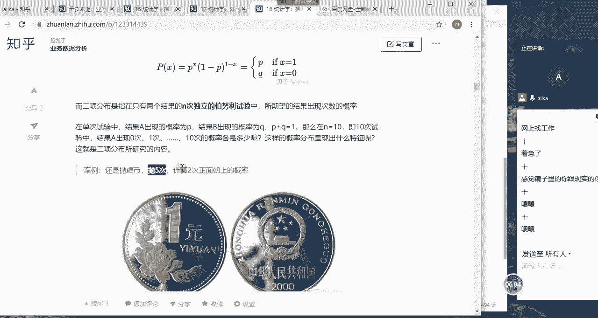
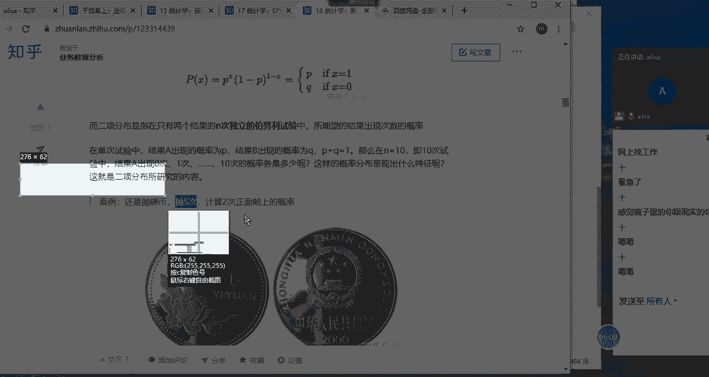
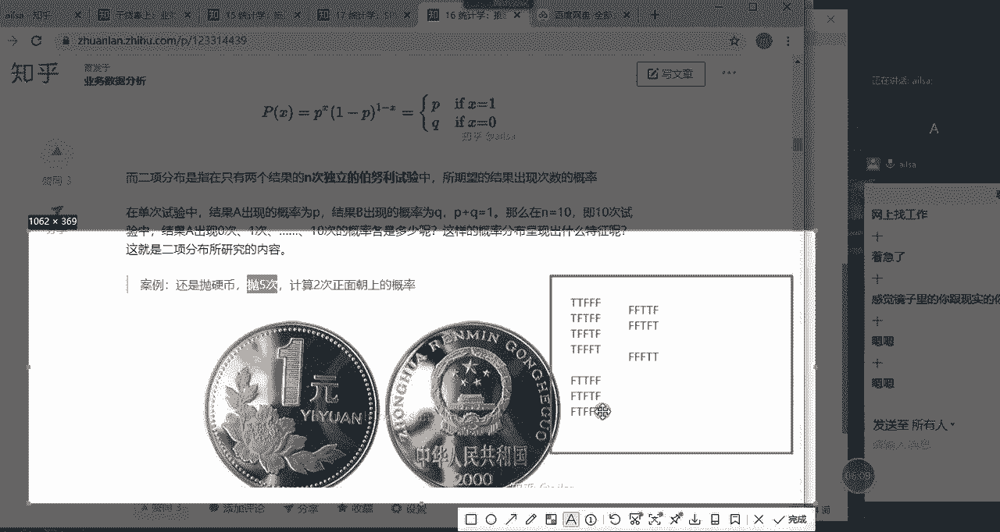
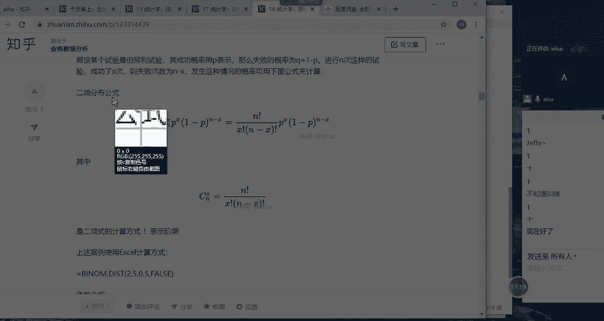

# 强推！这可能是B站最全的【Python金融量化+业务数据分析】系列课程了，保姆级教程，手把手教你学 - P84：04 二项分布 - python数字游侠 - BV1FFDDYCE2g

接下来我们讲解的是概率分布哈，那对于概率而言，我们分离散型和连续型啊，的一个变量的一个概率分布，所以说哎我们先看的是离散型哈，那我们先讲一下什么是概率分布哈，就是说随机变量的概率存在一定的规律的啊。

比如说你看我们随机变量的呃概率啊，也就是说某个随机变量发生的可能性的大小，的一个度量，那就是我们的概率它存在一定的规律，然后这个规律呢我们叫概率分布啊，分离散型和连续型。

也就是说对于离散型随机变量的一个概率，和连续型随机变量一个概率的分布并不相同，所以我们才会进行这样的一个区分，那对于离散型随机变量的一个概率分布的话，我们主要讲的是二项分布和泊松分布。

然后连续型随机变量的概率分布，我们主要讲的是正态分布好吧，那我们看一下第一个离散型随机变量什么呃。

我们讲这个离散型啊，我们主要是啊主要是以抛硬币作为我们的例子，抛硬币的话出现啊正面的一个概率啊，正面的正面，然后我们记为一啊，反面啊，反面我们记为零啊，这又是一个离散型随机变量，一和零。

它们之间肯定是不连着的，对不对，所以说啊它就是属于离散型，然后它的一个概率的话呃，分别是1/2啊，这样的一个概率，OK那我们接着往下讲我们的内容哈。

唉我们讲二项分布之前，我们要先提一下伯努利分布，那什么是伯努利呢，啊非常简单哈，就是说在我们的现实生活当中，很多事件的结果只有两个，大家想一下自己哪些事，遇到的事件只有两个结果啊，啊我们举的例子就是有。

比如说抛硬币正面朝上啊，就是或者是反面朝上，它只有两个结果对吧，然后哦然后我们的检查某个产品的质量，它也只有两个结果，一个是合格，一个是不合格，那购买彩票它也是有两个结果，一个是中奖，一个是没中奖啊。

还有就是表白对吧，成功跟不成功，还有就是拨打女朋友电话，接通或没接通，这些都是啊，这些都是只有两个结果的一次事件，我们称之为伯努利啊，这以上这些事件我们称为伯努利试验啊。

我们看一下伯努利试验的一个概念哈，伯努利试验是单次随机试验，也就是说它只进行一次啊，进进行一次这样的一个呃，结果呢我们就称为伯努利试验，你比如说你抛一次硬币啊，抛一次硬币这样的一个实验。

我们就称之为伯努利实验，那它只有两个结果，一个是成功，一个失败，唉这样的啊，这样的一个东西我们就称之为伯努利实验，然后它是由瑞士的科学家雅各布伯努利，提出来的，所以叫伯努利哈。

那那对于这样的一个试验的一个结果啊，它的概率分布我们称之为伯努利分布啊，也叫两点分布，因为它只有零和一嘛，对不对，它只进行一次实验对吧，然后他的结果要么成功，要么失败，所以说它的概率分布是非常简单的。

你比如说啊，你比如说如果啊我们假设一代表的是啊，出现正面的一个概率哈，成功的一个概率即为一的话，它返回的这个概率就是P对不对，那如果失败了，就是Q那P跟Q之间有什么关系呢，就是P加Q等于一。

因为这个事件只有两个结果，如果P的概率是13，那Q的概率就是23，如果P发生了。

Q就不会发生，对不对，哎这样的一个概率分布的一个规则，那为什么我们讲二项分布，需要提到伯努利分布呢，其实是因为我们的二项分布是只有两个结果的，N次伯努力实验，也就是说你看伯努力实验室进行一次啊。

但是我们的二项分布呢是进行多次哎，我们可以称之为N次这样的一个伯努利实验，那它的结果仍然是只有两个，然后我们所期望结果出现次数的概率唉，我们就研究研究的这样的一个规律，称之为二项分布嗯。

它所期望的结果出现次数的定位概率分布，我们称之为二项分布，那我们看一下，之所以会出现所期望结果出现的次数，是因为我们进行了N次伯努利实验，接下来我们举一个例子哈啊，那你看在单次的实验当中。

结果A出现的概率是P，结果B出现的概率是Q，那它们俩相加为一，这个是很正常，那如果说在十次实验当中啊，十次实验当中，结果A出现的概率啊，结果A出现的次数是零啊，123啊等等啊，都有可能。

那它每一次出现的概率到底是多少呢，我们它的分布又呈现什么特征呢，这就是我们二项分布所研究的内容，你比如说我们还是拿抛硬币来说，哎，我们抛硬币抛了五次哎，是不是进行了N次波动力实验啊。

那我们抛了五次之后计算两次正面朝上的概率，OK同志们，题来了啊，大家现在先想一下，我抛了五次硬币，两次正面的正面朝上的概率到底是多少，我们该怎么来计算，嗯想一想我们该怎么去计算这个概率。

它出现正面出现两次的一个概率啊，是多少，想一下啊，想一下。

抛五次出现两次，那我们可以其实我们可以这么去想啊。

它这个两次啊，他这个两次是什么时候出现的呢，比如说啊啊他这个两次有可能是第一次啊，比如说我们即为啊出现啊，正面的即为T比如说出现两次对吧，总共是出现两次，还有可能是前两次，前两次为正对吧。

后面的啊就就是为反啊，总共是五次嘛，第一次为正，第二次为正，第三次是反反反，那还有一种情况是第一次是为正对吧，那第二次为反啊对吧，第三次为正A然后是反反对吧，这是五次，然后还有一种情况是第一次为正啊。

第二次违反，第三次还违反，第四次为正，第五次违反，哎，我们先把第一次啊这样的一个证先给他定下来，然后我们看第二次出现正面的位置大概有几种，然后第三种情况是第一次出现正面，第二次反面，第三次反面。

第四次反面对吧，第五次正面，这是不是当第一次为正面的时候，那第二次为正面的一个呃，可能的情况大概有这么多对吧，唉我们列出来有啊，有几种呢，一种啊，两种啊，三种啊，四种，OK那接下来我们再考虑考虑什么呢。

如果第一次为反啊，那第二次为正，第三次为正，第四次为反，第五次为反唉这是一种情况，然后还有第一次为证啊，第二次为证，第三次为反，第四次为正，第五次为反对，这又是一种情况，对吧好，我给大家一个个列。

看大家能不能听明白啊，如果第一次为反，第二次为正啊，第三次违反，第四次违反，第五次为正，也就是说我们假设第一次为正的时候，我们看一下第二次为证的一个情况有哪些，然后我们再把第二次为证。

第四呃呃就是第二第二次啊为证，然后接下来那一次为正的一个概率，有123对吧，然后再接下来好，我们应该再再建一个了哈啊，这个我们再接下来看，如果说啊，因为不管是第一次啊，因为这个它是不分顺序的啊。

就是他俩相邻的是不分顺序的对吧，然后我们再来第一次违反，第二次违反，然后第三次为正，第四次为正，第五次违反，这是一种情况对吧，那还有第一次违反违反，然后为正啊，为反为正啊，这样是又是一种情况对吧。

OK那还有吗啊，我们接下来其实第三个为正的结果啊，我已经出来了对吧，第四次或第五次，那接下来还有一种情况就是FFF3个F，然后D4次为正，第五次为正，还有这样一个结果对吧，那我们算一下。

总共是如果说是正面朝上啊的一个次数，大概有123456789十，是不是有这十种好情况，对不对对吧。

同志们，这个听明白了没有，傻嗯听明白了哈，主要是我们是想为了计算它出现正面，出现两次的概率，总共有十次，对不对，那总共有十次的话，它出现概率的为1/2对吧，为1/2，反面的概率也是1/2。

那我们整个在让它就是乘以它的，整个的一个概率，然后得出来的这个结果就是10/32啊，这一次啊出现正面的一个概率就是啊，因为五次实验嘛，五次实验正面的概率是1/2，反面的概率也是1/2。

所以说是二分之1×2分之1×2分之一，乘以二分之1×2分之一，然后这是一次的一个概率，然后再乘以十次，这样出来的就是我们出现两次正面的一个概率，5/16啊，这就是我们首推出来的这样的一个结果。

首推出来这样一个结果啊，嘿啊我我们把刚才那个图对6/15，我给大家发一下哈，嗯那我们就是我们看一下，我们看一下它每一次啊，比如说正面的概率是1/2，那这一个事件，他抛一次硬币之后是1/2对吧。

然后下一个正面它又是1/2，我们就乘以它1/2的概率，然后第三次的时候它是反面，反面的概率也是1/2，所以就乘以1/2，二分之一二分之一这样的一个情况，然后得出来的最终结果就是我们抛一次啊。

这样的一个啊，出现两次正面的概率是三分1/32，然后总共是十次这样的一个可能性，所以说是10/32，这就是我们所要想要计算的这样的一个结果，那这是我们首推出来的，它既然是二二次分布。

它肯定有它自己的公式，因为我不，我不可能这么一次一次来进行一个推算，所以说这边用的是二项式的定理，相信大家也都学过哈，C52也就是说从五次当中啊，有两次出现的一个概率啊。

两次出现的两次出现正面的这样的一个情况，然后乘以它出现正面概率的一个呃，呃一个一个次数吧，你看出现两次正面就是1/2的平方，然后出现反面的一个概率，它的一个次数啊，这样的一个计算的过程。

就是属于二项分布的一个公式啊，大家这个听明白了没有，这个听明白了没有，然后C52这个东西的话就是二项式，它的计算公式的话就是五的阶乘作为分子，然后分母的话就是二的阶乘乘以五减，二的阶乘啊。

阶乘懂吗啊阶层大家都了解吗，同志们，什么是阶层，就是五的阶乘，就是5×4乘以3×2乘以一，就是往它小的地方，一个一个一个去乘这样的一个结果啊，就是我们的二项式二项式，那你看一下。

我们再分析一下我们二项分布的公式哈，首先我们就是从我们整个的一个，实验的次数当中，然后计算它我们所期望结果的这个次数X，然后乘以啊它我们所期望结果的这个概率的啊，次数的次数平方哈哈次数方哈几次方。

然后再乘以它反，因为它只有两个结果，所以说比如说正面啊出现几次，反面又出现啊，就是它的几次的减去，这个就属于它对应的那个值了，对不对，哎这就是我们二项分布的一个公式，相信大家都了解了哈哈。

其中这个呃CNX就是我们的二项哦，R相式的一个扩展啊，就是怎么去计算呢，就是N的阶乘乘以X呃，除以哈，X阶乘乘以N减X阶乘这样的一个结果嗯，那我们在excel当中是怎么来计算，二项分布的结果的呢。

哎来我们看一下哈，我们首先使用的是嗯我们打开我们这个表哈，好首先我们使用的函数啊，十我先把它粘过来哈，给大家演示一下，啊首先我们使用的这个函数叫BINOMM哈，啊这个就是我们计算二项分布的公式。

然后第一个组成部分就是你所期望它呃，比如说我们所期望的是正面正面出现的次数啊，所以说啊两次，然后这个第二个就是你的总的实验的次数，然后第三个的话就是你所期望出现结果的概率。

比如说你我们所希望出现正面的一个，概率是0。5，那最后的话它是代表了你到底是累积累计计算，还是指的是当前计算，什么叫累计计算呢，就是说至少出现两次的概率啊，至少出现两次这样的一个结果值的话。

我们是用的true，如果说你只计算出现两次的一个概率的话，就用的是false啊，一个是包含之前的内容，一个是只包含当前的这个次数啊，如果是至少两次的话，那还要包括零次，一次两次啊这样的结果。

所以这个true和false是限定前面这个值的，明白了吧，OK那我们这计算出来五次啊，抛五次硬币出现两次啊，正面朝上的一个概率的话是0。3左右，那我们之前算的话是5/16，那就等于我们算一下5÷16。

等于啊0。3125差不多对吧，是这个结果哈，那大家对于二项分布啊，懂了的给我扣个一哈，嗯卡住了是吗，现在呢现在应该好了吧，刚才网确实是稍微有一点点卡好，现在好了哈，OKOK好了哈啊现在好了。

OK那我们总结一下二项分布的特征，首先它是进行N次相同条件下，相互独立的重复的实验，你比如说抛硬币，它就是N次相同的条件下，相互独立的重复的实验，第二个是每次实验只有两个结果，成功或者失败啊。

只有两个结果哈，二项二项只有两个结果，那第三个是出现成功的概率为P啊，每次实验都是相同相同的，也就是说每次实验出现成功的概率是等，是相等的啊，然后失败的概率也是一样，然后他俩相加等于一。

那如果符合以上三个条件，它就是属于二项分布，那如果说以上的实验只进行了一次啊，那就叫伯努力实验啊，这也这也就是说，二项分布其实是N次伯努利实验的一个结果啊，它是N次伯努力实验的一个结果啊。

就这样就是我们的二项分布，OK哎，那我们总结一下二项概率分布当中的二项分布，二项分布啊，它的特征就是这几个。

然后二项分布的一个公式啊，然后就是这样子的。

唉这就是我们二项分布的公式啊，这个啊有的人说哈，你学完了这个东西之后，你跟我说这个在公司当中有什么用哈，斯说实话哈说实话我还真没用过啊，就是在工作当中，我从我好像很少会用到二项分布啊。

但是你想一下我们什么情况下和，就是就只出现两种结果的时候，用的二项分布呢啊有可能啊，有可能在赌博的时候哈，赌博的时候，你比如说你中或者不中啊，有可能会涉及到二项分布的一些啊底层。

然后当然是更深层次的一些一些研究了哈，所以说大家如果想去赌场玩一玩，可以在深入的研究一下二项分布的一些知识哈，OK哈啊，这就是我们二项分布的内容，然后接下来就是二项分布的均值和方差，均值呢就是NP哈。

方差就是NPQ啊，P就是它的概率哈，N就是它的它的重复的次数，NPQ也是一样的啊，P就是他所期望的结果，那个概率Q就是它一减P就等于Q啊，然后它会有一个呃变化的一个规律的图啊，这个就属于啊分布啊。

我们的概率分布图啊，概率分布图我们会发现啊月啊，你看这个N等于八啊，P等于0。1，N等于八，P等于0。3，N等于八，P等于0。5，也就是说当这个概率越趋于中间的话，它整个呈现的分布还是偏正态的啊。

那我们在接下来的看，然后当概率是一样的时候，我们随着我们的样本数量的逐渐增大，N等于五，N等于十，N等于30，它整个的一个概，它整个一个概率分布也是偏向于正态的，也就是说当我们的样本量足够大的时候。

我们都可以认为，所有的分布都是趋于正态分布的，这时可以这么认定的，那到底这个足够大是有多大呢，就是在统计学上哈，在统计学上一般认为大于等于三三十，我们就可以默认为，它这个数据是趋向于正态分布的啊。

大于等于30啊，这样的一个分布，当然了，在我们的实际的工作当中哈，或者是啊实践当中啊，这个数值这个这个样本量尽量还是大一些啊，几百几千几万啊，越大越好，这样的数据得出来的会更准确一些。

嗯然后大家会发现一个问题，就是我们在进行统计学上研究的时候，都会给他一些限定条件，比如说啊假设它符合什么什么什么样特征，然后怎么怎么着，然后我们才能够得出这样的一个结论，但是往往在我们的而现实生活中。

我们的数据可能都不具备这样的一个特征啊，所以啊所以有些得出来的结论就不是特别准确，但是我跟大家说，我们后面不是会讲机器学习一些知识的内容吗，为什么他们在进行一些统计模型，或者是一些算法模型搭建的时候。

却没有这么多前提提条件的约束呢，主要是因为它们的数据量足够大啊，它们的数据量足够大的时候，我们就可以忽略掉这所有的啊前提的假设了啊，因为他们这个量就是都是百万啊，百万千万的这种的话其实就比较啊。

就是比较准确了啊，我们就可以近似的认为它就是总体的一些数据，嗯当然了它不是哈啊OK哈，那这是我们的二项分布，那接下来我们看泊松啊，泊松分布哈，这个人啊，这个人叫泊松哈，嗯西莫西莫恩德尼泊松啊。

啊看就是他提出的泊松分布哈，那波松分布它是用来干什么的呢，它其实啊我最好断一下吧。

