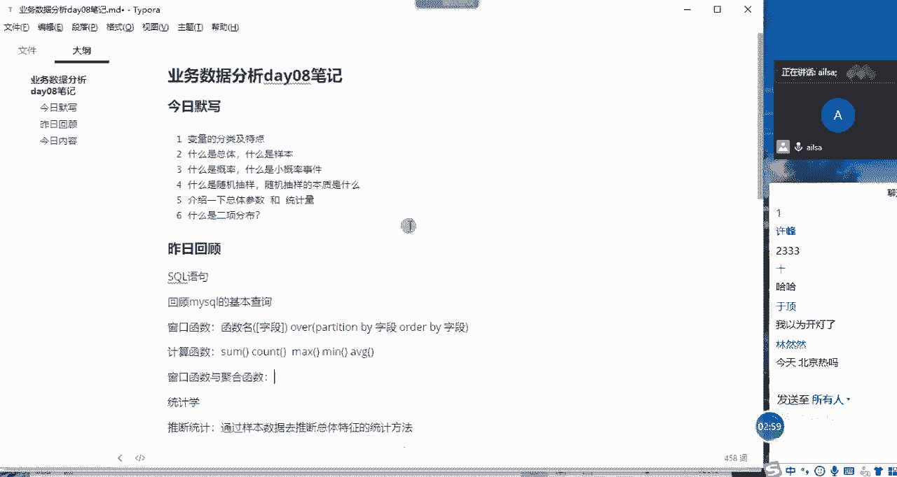
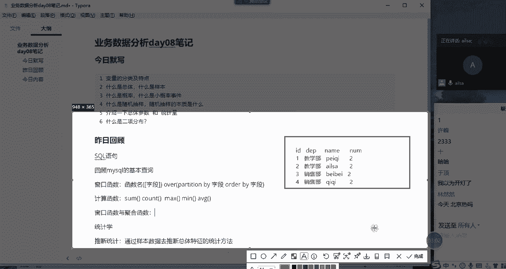
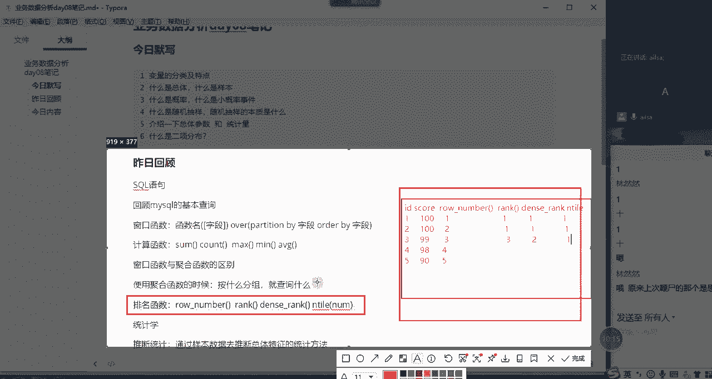
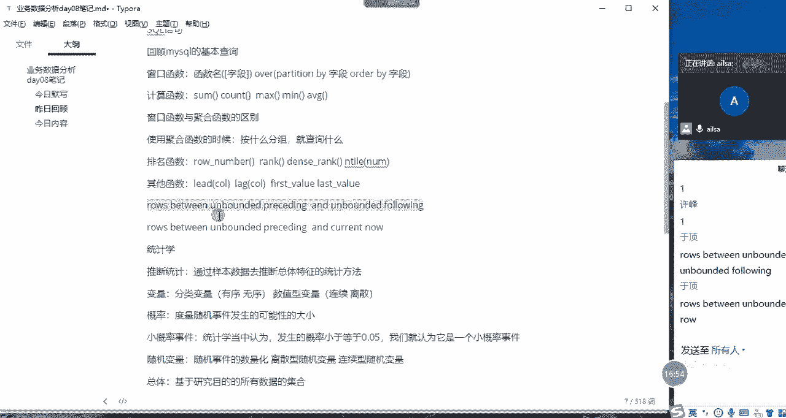
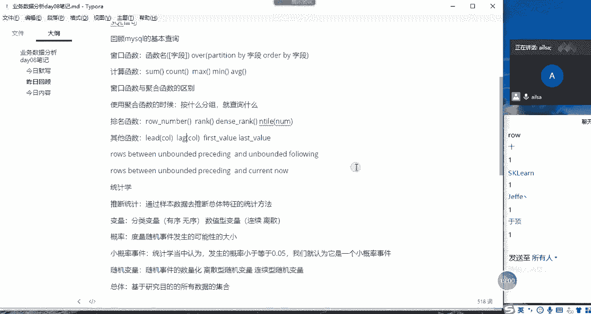
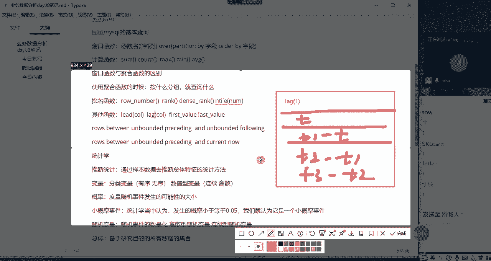
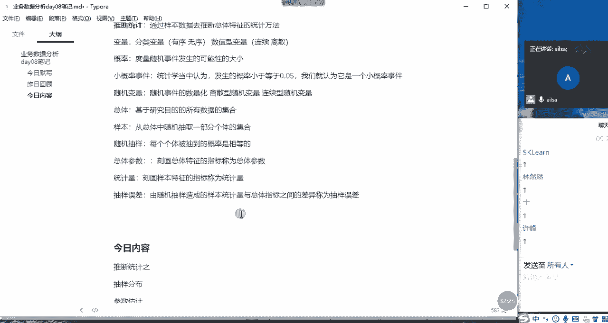

# 强推！这可能是B站最全的【Python金融量化+业务数据分析】系列课程了，保姆级教程，手把手教你学 - P88：01 昨日回顾~ - python数字游侠 - BV1FFDDYCE2g

我们今天的一个讲课的内容呢，可能会稍微有点多，所以说啊我前面就不带着大家去提问了，我直接带着大家去回顾一下，我们前两天讲的内容好吧，我们前两天其实啊我们想一下哈，我们应该是讲了circle对吧。

哎circle circle语句啊，然后还讲了就是我们的统计学的知识，好，SQL语句的话，我们重点啊，我们主要是啊有带大家回顾是吧，回顾啊回顾我们啊之前学MYSQL的一些啊知识哈，MYSQL的啊。

回顾MYSQL的基本啊，基本查询啊，增删改查库的啊，增删改查表的增删改查，以及记录的增删改查这些内容对吧啊，那我们给大家介绍了一个新的内容，叫窗口函数啊，我带大家去回顾一下窗口函数。

然后它的语法是嗯函数名啊，函数名加括号，然后是你这边的字段啊，如果说有需要你就加上，如果没有需要就可以不加，叫字段啊，也可以叫列名哈，在数据库，在数据库当中我们就称之为字段嗯字段。

然后后面的语句的话是over o v e r over啊，然后括号啊，括号里面的话一个是用来分组的，Partition p a r t i t i o n parting by，后面跟的字段的话。

是根据哪个字段进行一个分组，然后还有一个order by啊，根据哪个字段进行一个排序啊，字段啊这样的一个语法，那这就是我们的窗口函数，窗口函数我们主要讲的其实有三算，是三大类吧。

第一种的话就是我们的计算哈啊，你比如说计算啊，就是我们的统计计算，然后计算函数啊有什么呢，哎有我们的sum对吧，some啊就是求和啊啊求和，然后count啊，基数啊，还有我们的啊max啊啊，求最大值。

求最导最小值啊，还有我们的求平均AVG对吧，哎这样的一个啊计算函数啊，这是一种那在使用窗口函数和聚合函数的时候，我们需要做一个简简单的对比哈，窗口函数语句和啊函数，它们之间的一个很大的差别在于什么呢。

聚合函数它其实是针对某一个字段啊，针对某一个字段进行一个分组汇总啊，分组先分组，然后进行一个相应的一个函数的计算，到底是分组求和还是分组计数，还是分组求最大值，还是分组求最小值。

还是分组求平均这样的一个结果，那它出来的一个结果值的话，是对原来的表的一个结构已经已经呃，不是在原来的表结构上进行一个操作了，而是生成一个新的一个表的结构。

你比如说还举一个最简单的例子哈，举个最简简单的例子，比如说哎我们啊有这样的一个表啊，id啊，然后是啊部门DEPARDP哈，还有一个就是name啊，部门里面的员工，比如说id为一，然后部门啊我们称之为嗯。

我们称之为呃呃我们称之为什么教学部是吧，教学部哈好宽松一点哈，宽松一点，这样会好打一些，唉比如说唉咱们老男孩这边有教学啊，教教学部哈，Python教学部，然后比如说哎谁在这个教学部里面呢。

啊佩奇在这里哈，哎佩奇啊，佩奇在这里啊，然后第二个啊还是我们的教学部啊，教学部啊，教学步啊，然后呢是ELSA在这里面哈，AILISARELSA在这里，然后第三呢啊还是呃我们就换个部门吧，好吧。

我们就换一个嗯，我们就换一个什么呢，呃叫销售部哈，销售啊，销售部他们销售部的人名儿都起的是叠字对吧，什么贝贝哎，对贝贝啊啊，然后还有四啊，销售部哎，销售部叫什么琪琪对吧，哎琪琪哎这样的一些人。

那我们如果说对他进行一个聚合的话，唉聚合出来的效果哈，我们看一下我们写到这里哈啊聚合啊聚合，比如说我们现在对每个部门进行一个聚合计数，我们算一下每个部门有多少人哈，每个部门有多少人这样的一个需求。

那聚合函数怎么来实现的呢，就函数实现的效果就是啊，就是你要根据你第一批进行一个分组，那你查询的时候也必然是查询的这个结果，如果你查询其他字段是没有意义的，对不对，咱们之前也说过哈。

所以说你查询的应该结果出来的效果，应该是教学部啊，教学部，然后是两人诶啊，然后是销售部啊，销售部两人是这样的一个结果，对不对，那这是我们聚合函数出现的一个效果，我们很明显知道它根据这一列啊。

这一类有肯定有相同的字段，因为我们要分组嘛，肯定是它存在多个重复的，现在我们只想要一个，然后再对它进行一些相关的计算，所以说出来的是这样的一个效果，你看之前四行的啊，一个数据现在变成两行，对不对。

所以说它在原来的数据结构上并没有啊，在原来的结构上进行生成，而是生生了一个新的啊，汇总计算的这样的一个形式，那开窗函数却不是这样，为什么这么说呢，开窗函数出来的效果是这样的。

它会新在原来的一个表的基础之上，它先生成一个字段，比如说你起名字啊，叫什么呢，叫人数啊，number哈，比如说就叫number，然后的话唉我们把这个往往边上靠一靠哈，然后这个时候教学部哎。

我们知道教学部有两人，是不是它是这么来显示的，它显示的是二，然后下面又是一个教学部，对不对，他还会重复啊，对整个分组进行一个重复的一个计算，然后到下一个之后，唉销售部啊这边的话就是多少，就是也是二。

对不对，二这样的一个效果哈，然后啊那个啊这边销售部也是二，它会在原来的表的基础之上新生成一列，然后把我们最后聚合出来的这个结或计算出来，这个结果给它添进来，如果是同一个分组的话。

就会重复显示这个结果就可以了，很明显啊，我的这个东西呢很明显哈，它跟我们的聚合函数是完全不一样的啊，大家一定要理解这个东西，那我对它进行了开窗了之后，它相当于生新生成了一列，那我们对这个表而言。

我们就可以再次的进行一个查询和过滤了，所以说啊，我们知道开窗函数在使用排名的时候，是非常简单的。

因为它完全都不需要进行嵌套，对不对啊，这样的一个效果哈，Ok，那这就是我们的开窗函数与聚，合函数的一个区别啊，我想问一下大家啊，对于这个问题大家听明白了没有，开窗函数与聚合函数的区别啊。

啊听明白给我扣个一哈，然后在这里强调一点啊，你使用聚合函数的时候啊，啊按什么分组，按什么分组就嗯查询什么啊，你不要多查哈，你比如说你是按你刚才是按呃那个department，就是你的部门进行分组的结果。

你把id查出来了，那id呢它只是说啊，他只是说出现的是我看能不能弄出来哈，他只是说啊弄不出来啊，他只是说出现的是你当前分组的第一个，所以它没有什么意义，所以你尽量不要查它，因为它会影响你这个结果哈。

思敏这个一定要注意一下哈，你啊你在这个地方上犯过类似的错误哈，所以说一定要啊一定要要要明白这个这个问题，就是按什么分组就查什么，如果说不是的话，他查出来的效果没有没有意义，那使用开窗函。

当使用窗口函数就没没有这样的一个忌讳了哈，啊是这样的一个结果，但是一般情况下，如果说我们要对它进行一个汇总计算的话，我们啊我们按我们一般情况下，使用聚合函数会更啊，想让我们达到一个效果啊。

这样的一个东西哈，但是也是论情况哎，这是第一种哈，那第二种的话我们会使用的是排名函数，这个是窗口函数啊，一个非常大的优势哈，我们排名函数分四个哈，有一个是叫row number对吧。

row number啊，不知道大家还记得多少哈，Row number，然后还有一个是我们的rock排序哈，还有一个是dance and dance啊，DNSE啊，啊dense grank啊，紧密排序啊。

还有一个就是我们的until啊，那就是分桶进行一个排序，那这这这四种不同的排序方式呢，它只是在排序规则上有所差差别而已，但是他们都是用来排序的哈，啊都用来排序的。

就看你实际的一个需要role number的话，它是不分重名啊，就是如果说嗯你排序的这一列两个值相等，对于肉number而言是不起作用的，因为它只是按序号123456往下排而已，那对于rank而言的话。

它其实就是那按照实际的一个排名，就是说你比如说你第一名有两个，那到第三名的时候，他其实他应该是第二名，对不对，那我们rank的话就直接跳到三，它中间会有跳跃式，就是遇到呃重名的呃，就是成绩相同的。

它会跳下一个名词，这就是rank，那dance rank就是紧密排序，如果说你的排名有重有有相同的排名的话，它会紧跟着往下走啊，那呃until呢就是分桶，它会根据一个桶的这个number啊。

这里面是有一个number哈啊我们可以叫啊，就是给你一个数字，那这个数字就是你在每一个组当中啊，分桶的一个呃量啊，比如说好比如说啊。

我再给大家举一个简单例子吧，啊因为这个可能时间有点久了哈，我们排名函数啊怎么来说呢，嗯来啊再讲详细一些哈，比如说有一个id哈，有一个成绩啊，我们叫score r c o r e思考，然后后面有一个排序。

我们有几种呢，有roll啊，roll好，ROGUNUMBER啊，ROGUNUMBER第一种，然后第二种是rank对吧，rank啊，第三种的话是dance d e s e dance杠rank啊。

OK放不下他啊，第五种的话就是我们的until哈，until嗯，那我们看一下，我们看一下id为123456，差不多了啊，比如说哎我们的分数的话为100分啊，100分，然后是嗯然后是还是100分啊。

然后第三名的话是我们的啊，就是说我们的99哦，第四名啊，第四名是嗯98啊啊第五名啊，第五名是90啊，第六名啊，不要了，我们这几个就够了哈，你比如说如果说是row number的话。

第一名和第二名他们是它们是并列第一的，对不对，那如果是中number的话，它类似于id哈，它就是row number嘛，就是按行一个一个往下排的意思，它就是啊一啊二二啊，三啊，它不分整个的一个呃。

成绩是否是并列的等等这些，所以说我们会发现中文temple应该用的是少一些，但是如果说你想生成啊，呃生成某一列的一个序号的话，其实你用row number也能实现对吧，哎12345612345。

那对于第二个第二个rank而言的话，它其实啊它的一个效果就是这样的，它一个效果就是啊我看能不能写进来哈，啊好像不能，它的它的一个效果就是啊，如果说他是重名的话啊，就是他的并列第一的话，那就写一。

然后到这里的话啊，也是一哈，也是一啊啊，那到下一个的时候不应该是第二名吗，你看99肯定第二名，但是你用rank的话，他会按照整个的一个呃呃，就是嗯就是它的整个的一个呃个数吧，啊就是到这个他会写出三啊。

它就不没有二了，因为到这是第三名了，然后再往下走也是这样的啊，这是我们rank，那dance rank就是这样的，它就是一啊，到这里的时候还是一啊还是一，然后到下面的时候嗯，他就是紧密联系在一起。

所以他是第二名，他没有跳跃的这种情况，until呢它其实是这样的，就是如果说你整个1~5是一个班级的话，他会把1~5分成啊多少个桶，这个看你给多少个number哈，比如说你现在嗯分成两桶，分成两桶的话。

它会均等区分，你比如说现在是五个数，他有可能分的规则是前两个是一个桶，后三个是一个桶，因为他没办法去把三就就是劈开，所以说它会要么是123是一个桶，四五是一个桶，可能会这样。

那它正额分的一个规则就是一啊，第一名啊，然后啊就是第一名就是第一名会有两个三呃，三个吧啊124就是123是如果是一个桶，它就是一，然后后面的话四五是一个桶，他就得二，就是先把它均等分。

每一个分组里面先均分啊，比如说均分啊两份，那就是总共是有第一名和第二名，然后第一名占多少个，就是123，第二名就是四五这样的一个分法，OK哈我相信这个row number rank和单词rank。

Rank，还有until，我们在之前讲的时候应该都明白了哈，我今天又给大家啊回顾一下啊，这个听懂了吗，我们的排名函数，排名函数在我们的整个的窗口函数当中啊。

是使用非常频繁和高效的啊，OK哈OK大家对于排名函数听明白了没有听明白，给我扣个一，嗯OK那我们还说到了一个啊，就是后面我们还介绍了四个其他的函数哈，其他的函数啊，其他函数我们介绍了什么呢。

我们介绍了力的啊，力的函数啊，lead函数，还有我们的lag函数啊，lag函数这里面是要跟一个COL，也就是我们的列哈，COL就是这个lead呢是往下走多少行啊，然后这个呃log呢是往上走多少行哈。

然后还有我们的啊first f i r s t first gun value啊，还有我们的last gun value，然后我们在这个过程当中，我们给大家教了一个叫什么呢，rose啊。

w i rose啊，between b e t w啊，e e n between啊，什么什么还什么什么呃，呃folly of proceeding哈，Proceeding pr，看我还能拼吗。

PIECEDIND哈，DING啊，PIECEDIG啊，between啊，前面会有个unbounded，然后也就是无限的哈啊就是无限制的啊，但是这个数是个数字，我们可以改。

然后between and and什么什么的叉叉啊，还有就是我们的following f l o o o w i n g啊，following这样的一个限定我们的分组范围的啊，这样的一个语法，它是啊。

我们在使用last value的时候，发现的这样的一个规律哈，如果说是选的默认的情况下的话，默认的是什么呢，哎算了，sorry啊，默认的啊，默认的是我们的correct now。

也就是截止到当前行c u r r e n t correct now，对吧，哎哎unbounded，unbounded u n b o u n d e d哈。

unbounded u n b o u n d e d对吧，unbounded也就是bounded就是边界嘛，UNBONDED就是没有边界的意思哈，bonding我应该没有写错吧，UNBODIED啊。

OK啊那这就是我们之前学的这个语法哈，啊它就是我们在使用last value的时候啊，我们可需要把它改成啊这样的一个形式，不然的话它就达不到我们所想的效果。

我给大家解释一下这个UNBOTHE。

following和UNBOPROCESSING是什么意思哈，我再解释一遍哈，嗯那我们针对于啊这个而言，我们先针对于这两个哈啊，那就是，如果说在我们整个的一个数据区域当中啊，数据区域当中我们有很多个行。

对不对，我们的分组比如说这都是同一个组哈，在这个框框里面都是同一个组，同一个组，然后这是123啊，这是三行数据，然后我对它进行一个哦，分组取last value的时候，分组取last value的时候。

如果说你设置的是correct now，也就是说比如说现在我位于第二行，它的一个取值范围是往上走是无限的对吧，唉proceding unbounded，也就是说不听and是在什么什么之间往上走。

就是这个行的往上是无限的，那也就是取这个分组当中网上的所有的行，然后截止到当前行的最后一个值，肯定是我当前的这个值，所以说我们当时就犯错误了。

嗯那如果说我把它改成i'm on the processing，and i'm bfalling的话，意思就是说在这个分组当中，我往上取无限，往下取无限，那如果说我取last value的时候。

我只要取当前分组当中最后一个就可以了，因为我的取值范围是当前分组所有的数据啊。

是这个意思对吧，唉大家想起来没有啊，这个应该也听明白了吧，我们的rose between unbounded proceding，and correct now啊。

还有我们的rose between unbounded proceding呃，and unbounded falling啊，这样的一个呃我们的一个限定条件嗯，如果说听明白了，给我扣个一哈。

OK听明白了没有，同志们听明白，给我扣个1OK哈，那我再说一下lead和lag，这两个函数的一个用法哈，lead什么意思呢。

就是说它也是，你看我们所有的窗口函数都是新生成一列，对不对，那类的函数是怎么来理解的呢，比如说我现在输入了一个好lead l e AD啊，l e AD lead啊，后面啊。

后面括号里面我输入了一代表什么意思呢，首先如果说我们肯定是针对某一个例哈，我们肯定是针对某一个列啊，然后进行的一个操作，那啊我们是怎它是怎么来实现的呢，你比如说现在啊有啊，我们有这么多行的数据啊。

它有两列，第一列啊，比如说是我们的time哈，time t啊T啊T1T2啊，这是我们的值哈，T3啊，T2啊，T3啊，T3啊，然后现在我想对这一个值的相邻的两个数据，进行一个相减计算的时候。

也就lead和lag，主要是针对某一列数据进行一些计算，而且它相邻的两个进行一个计算的时候，我想让它减去它得到一个值，它减去它得到一个值，它减去它得到得到一个值，这样的一个分组当中相邻的两个列的相差值。

我想得出这样的值，然后进行一些另外一些计算的时候，我们就可以使用力的函数，来达到这样的想要的效果，首先力的一的话代表是向向下取一行，比如说我取到这个值之后，我把它放到新生成的一列，放到这里啊。

这里变成了T1啊，这里变成了T1，然后这里呢依次的变成了T2，依次变成T3，哎到T3之后，我这里面假设这一组只有TT1T二，T3到这没有了，那这个地方就空着就可以了，接着往下一个组来说。

他又开始进行这样的一个操作，既然它生成两列之后，我就可以对它进行一个相减，然后得出我所想要的值，然后再进行一个二次的判断就可以了，那力的函数就是往下取一行，放到一个新生成的一列，这是lead函数。

那我再说lag函数哈，嘿哎呀，sorry啊我在说lag函数哈，我们就在这里去画了哈，lag函数跟lea的函数刚好是啊相反的哈，我在讲课的时候并没有讲哈，嗯嗯大家这个应该OK了哈。

所以我把这个撤了哈啊把这个撤了哈，唉你比如说啊现在啊现在我使用的是leg，不是lead了哈，LAG它是往上取一行，那大家看哎，你说这个这个分组当中，第一个就是T它往上没有了呀，对不对，它往上没有了。

那其实我们就可以默认为空，也就是说现在第一个我们起到T上面这个值呢，没有它就是空，然后那就它就是空，然后我们把T啊，我们把T1啊T1，这个时候我们就该往下排了呀对吧，第二个就取到T1T了。

然后第三个就是T1啊，第四个就是T2，对不对呃，那就是这样的一个啊，达到这样的一个效果，往下走的话就没有了，因为当前分组就是四个值嘛，但是已经满足我们所需要的，这个时候我再进行相减，我再进行相减。

我再进行相减，是不是就达到了我所想要的效果，它只是一个顺序的问题，到底是这边减这边，还是这边减这边的一个问题哈，所以说他俩用法是一样的，我们只要掌握其中一个就可以了。

我以如果说你比较习惯性用lead的话，你就用lead，如果你比较习惯用lag，你就用lag，没必要两个都掌握哈，这里这一点有点类似于，我们在进行circle连表查询的时候的。

left join和right join是一样的啊，看你放哪。

哪个放在左边，哪个放在右边，这个意思嗯，OK同志们，大家对于我们的lead和lag函数，都听明白了是吗，嗯听明白给我扣个一，OK哈，那接下来我们整个的一个窗口函数，我就介绍完了。

然后我给大家出了一道面试题，也就是说我们针对呃就是淘宝店铺，它每天的一个更新时间唉这样的一个面试题，然后取呃当天呃如果有多条数据，我们只取最新的一条，然后根据这些数据。

然后进行一个啊更新时间的规律判断啊，这或者是规律啊，摸索这样的一道啊，就是大型互联网公司的一道面试题，还是很有意义的，所以没有教的同学要抓紧哈，OK那我们哦MYSQL啊啊窗口函数我们就告此段落。

接下来我们看我们在上周讲的统计学哈，统计学我们讲了描述统计和推断统计是吧，那描述统计的话其实就比较简单了，当然了，描述统计也是比较浅显的，因为它就是对我们啊我们所得到的啊，我们所啊研究的啊。

研究的数据整体啊整体上的一个概括啊，概括性的描述对吧，因为我嗯，因为我们在对一组数据进行描述，或者是表达的时候，我们没办法去给他把这所有的数据都读一遍吧，对吧，你读一遍你也没有什么意义。

就比如说我们在上小学的时候，老师经常说嗯大家把这篇嗯做不，大家把这篇课文唉读三遍，读三遍了之后，哎我们都哇哇的在读对吧，读完了之后，老师说谁能告诉我这篇文章的中心思想是什么，对吧啊是吧。

这个其实就是意思，就是说你能告诉我这些数据里面，他想表达的什么意思，它能哪些指标可以代表它整个的一个核心啊，所以说我们这个就是我们对于数据，对于数据一个总体的一个描述哈，有哪些呢。

有数据的一个集中趋势的描述哈，集中趋势哈对吧啊，数据的离散趋势嗯，还有数据的分布形态啊，数据的分布形态，我们从做这三个方面，然后对数数据进行一个整体性的概括描述，那集中趋势的话，我们常用的就是均数对吧。

还有中位数啊，中位数还有我们的啊，种树嗯，那离散趋势的话，我们主要就是方差对吧，方差标准差啊，还有我们的四分位差啊，以及我们的变异系数，变啊E系数对吧啊，那我们分布形态的话就是偏度啊，偏度和峰度哈。

那我在讲描述统计的时候，我有说到每一个啊，每一个呃，呃每一个就是这个参数是怎么来计算的，然后也给大家说了，如果说我们理适用嗯circle的话，我们使用excel当中描述统计，就可以。

把这边所有的数据都可以进行一个指标的计算，对吧，嗯相信大家也都还记得哈，OK哈那这就是我们描述统计的内容哈，它是建立在它是统计学的一个基础，也是比较简单的内容哈，那我们建立在描述统计的基础之上。

比如说我们对数据有个有了一个，大致的了解之后，我们最终的目的，还是要对它进行一些规律性的发发掘和一些呃，就是统计上的一个决策的，所以说我们就用到推断统计的内容，那我们在讲推断统计的时候。

我们知道推断统计，它其实就是通过样本数据去推断总体特征的，一个统计方法，有的人就问我，为什么要通过样本数据去推断总体特征呢，其实是在我们的实际的啊，实际的研究过程当中，包括统计学上的一个研究。

包括我们实际的工作当中，我们研究的目标，或者我们研究的对象，它整个的一个总体数据是很难获取的，你比如说你要研究啊，北京市所有啊所有人的一个工资水平哈，或或者是所有人的家庭的收入等等，这些的时候。

如果说你要调调取到这些，所有人的一些数据的时候，非常精准哈，总体数据是非常精准的哈，那这个过程当中其实需要耗费的人力物力，财力都非常大，那面对这种情况，难道我们就不去研究了吗，当然不是啦。

那我们可以通过抽样的方式啊，当然这个抽样一定是要具有代表性的，那你怎样才能让它实现具有代表性呢，你就要需要对它进行一个随机的抽样，我们通过哎我们通过抽取100家，100个家庭这样的一个收入。

然后得出一些我们想要的一些啊就是数据啊，或者是一些概括性的这些指标，然后去推测总体诶大概是这个样子，那其实这样就可以了，因为呃就是这个我们没有办法去精确啊，去精确到很精准的一个结果的呈现啊。

这个是必然的哈，那我们在讲推断统计的时候啊，推断统计的时候，我们先介绍了一些基础的知识哈啊，或者是一些呃就是概念性的东西哈，我们要先了解这些东西之后，我们才能够进行接下来的学习，那有什么呢。

就是比如说变量啊，今天早上我们也考试了啊，变量我们有分类变量和数值型变量，分类变量分有序和无序，数值型变量分连续和离散，那概率是什么呢，它其实就是度量，随机事件发生的可能性的大小啊。

它其实而是通过很多次的这样的一个，重复的实验，然后去分析出来有这样的一个规律啊，你比如说抛硬币，你抛十次啊，得出正面的呃，比如说你抛十次正面的正面啊，出现正面的次数啊是九次啊，那这样的话你你呃你一算哈。

这样的就是大概一个频率的一个占比，但是当你抛啊1万次啊，10万次或者是100万次的时候，你会发现它整个的一个呃，这占的比例哈大概是趋近于0。5，那这个0。5其实就是我们就可以概括为，就是抛一次硬币。

出现正面的可能性大概是0。5，因为我进行了很多次的试验，发现是这个样子的嗯，那在统计学上，小概率事件为什么要提到这个呢，是因为我们在后面做假设检验的时候，小概率事件是我们一个的。

反正的一个标准哈或者是一个依据，也就是说比如说在一次随机抽样的过程当中啊，发生的概率啊，发生的概率小于等于0。5的时候，就是说我们认为啊，这样的事件在一次的随机抽样中，是很很少发生的啊，可能性非常小。

所以我们就称之它为小概率事件，那随机变量呢啊那就是随机事件的数量化，什么意思呢，就是说唉我们在研究一个随机现象的时候，它的结果有可能是成功，有可能是失败，但是我们如果用文字来记录这个结果的话。

不利于我们做后面的分析，所以说我们就用个数字来做做一个代表，是这意思哈，所以说它就是我们随机事件的一个数量化啊，那总体啊，什么是总体哈，基于研究目的的所有数据的集合啊，这就叫总体。

那样本呢是从总体中随机抽取一部分，个体的集合啊，随机抽取一部分个体哈，那随机抽样，就是每个个体被抽到的概率是相等的啊，就是随便啊，不不是随便哈，是随机抽取哈，啊啊那总体参数的是刻画总体特征指标啊。

统计量呢啊，大家这个这两个概念一定要记清楚哈，就是我一说到总体参数，它指的就是总体啊，总体特征的指标，你比如说总体均值，总体比例，总体方差对吧，那统计量它是指的是样本特征的指标，比如说样本均值。

样本方差，样本比例，这就属于统计量啊，那抽样误差呢，就是说我们哈我们通过抽取样本去推测总体啊，那在这个过程当中，我们必然是通过随机抽取样本啊，来计算样本的一些统计量啊，样本统计量包括什么样本的啊。

样本的什么样本的均值对吧，唉我们通过假设，我们通过抽随机抽取一部分数据，然后它样本的均值与总体均值之间有差异，那这个差异啊是不可避免的哈，我们可以称之为抽样误差啊，这样的一个概率哈。

嗯OK那大家对于我刚才讲的，我们推断统计和描述统计的这些基本的知识啊，都嗯都还有记得吗，有什么问题没有，如果没有什么问题给我扣个一啊，我们今天的回顾就先到这，有问题可以啊，可以提啊，OK嗯其他人呢好的。

没有问题哈，没有问题。