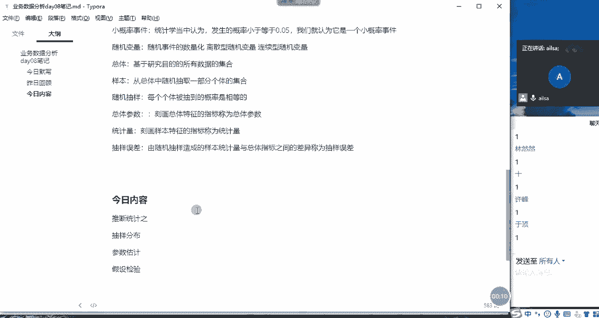
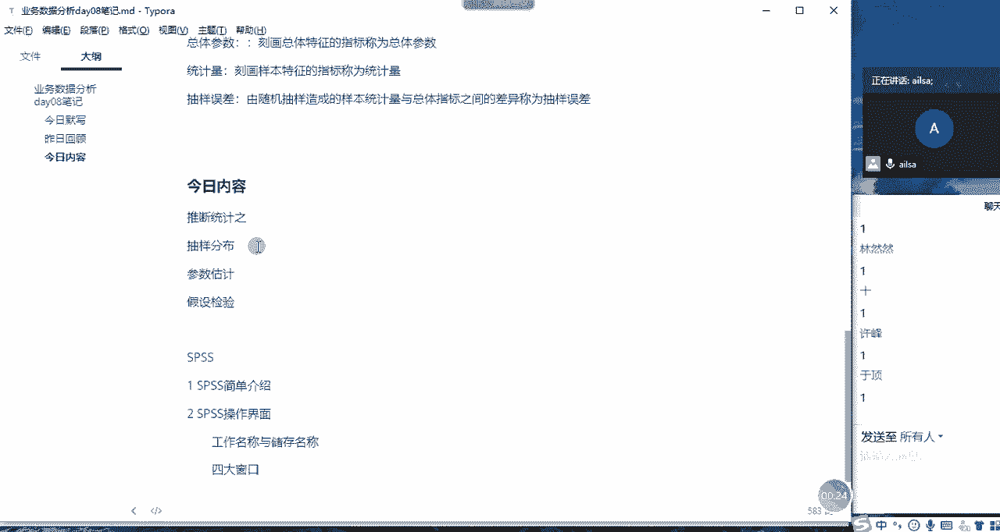
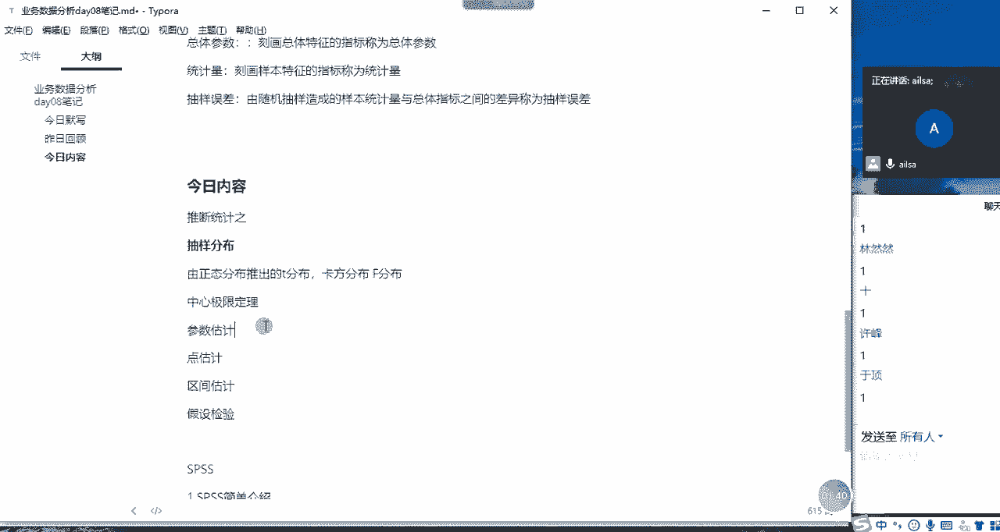
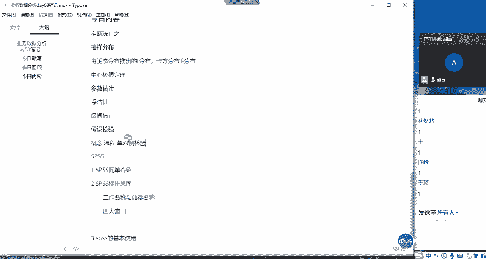
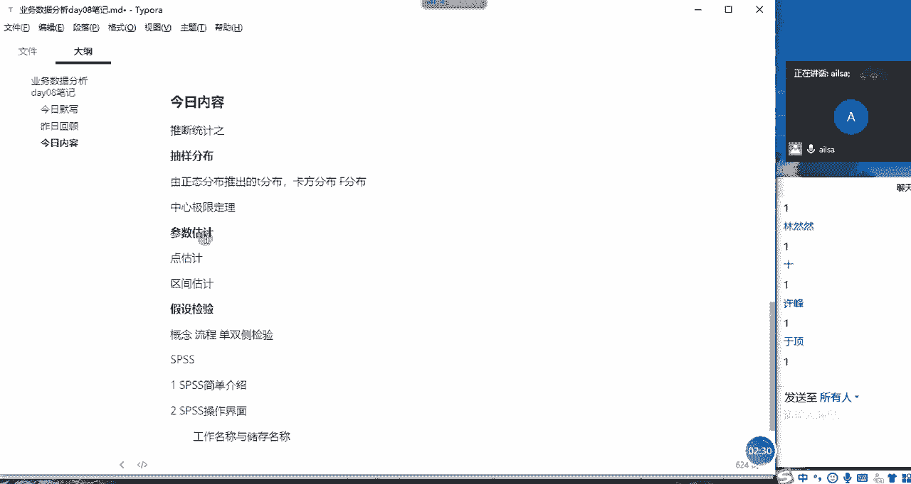
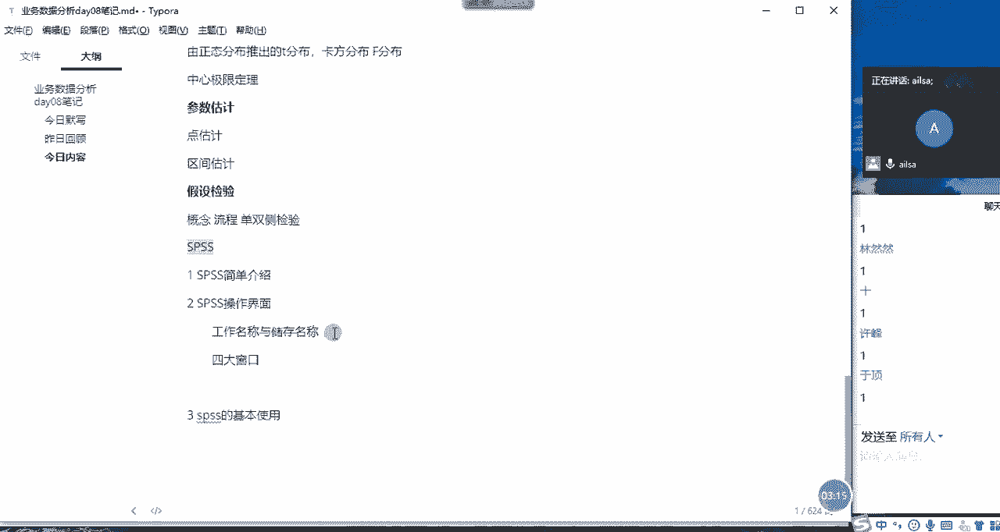
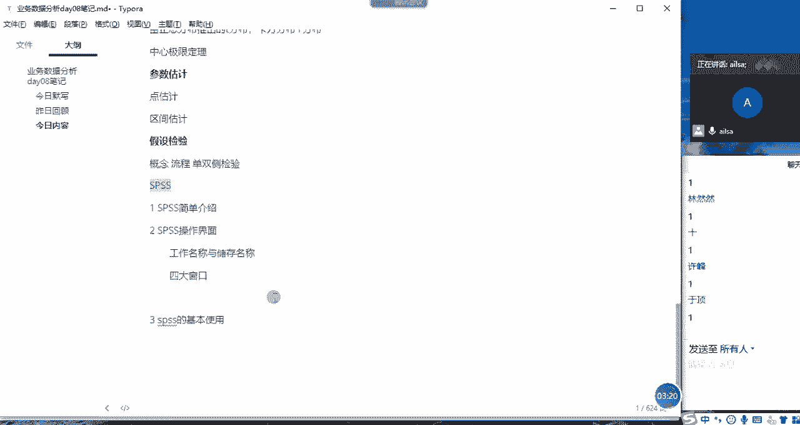
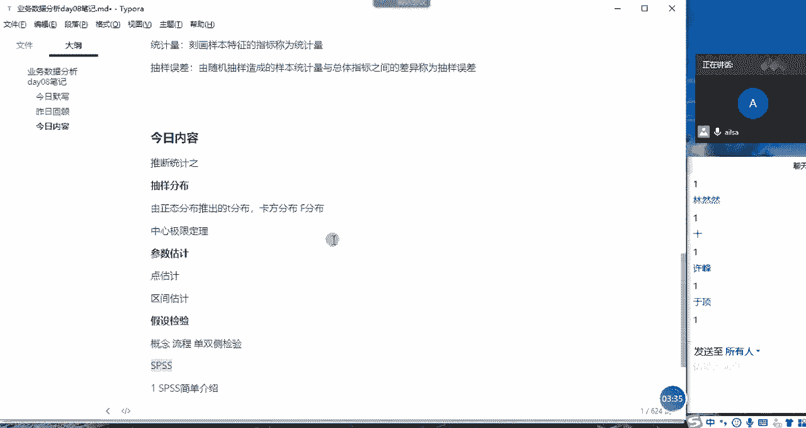
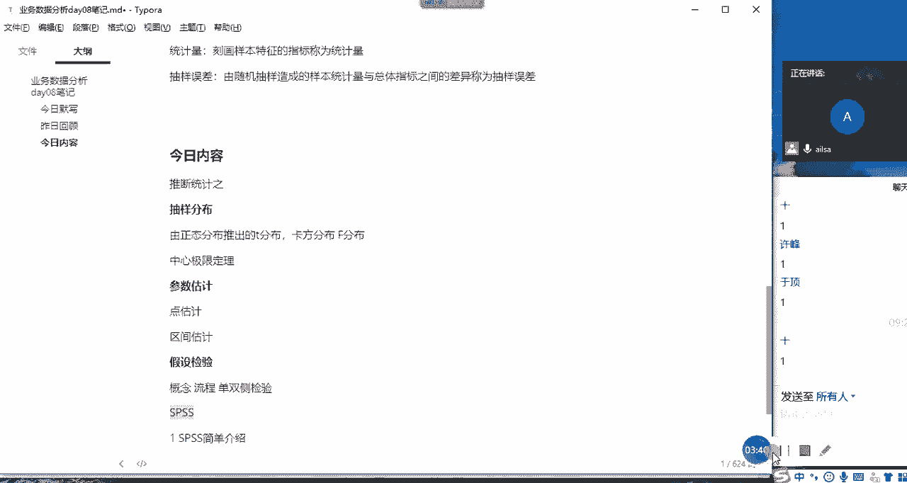

# 强推！这可能是B站最全的【Python金融量化+业务数据分析】系列课程了，保姆级教程，手把手教你学 - P89：02 今日内容~ - python数字游侠 - BV1FFDDYCE2g

OK那我们回顾完了啊，之前讲的内容之后啊，我们开始说今天我们要讲什么。

讲什么内容哈，首先唉我们今天还是讲推断统计的内容。

也就是说我们会讲唉我们上回讲到了，应该是呃抽啊抽样分布哈，抽样分布啊里面的内容啊，呃那我们还会再接着讲啊，抽样分布啊。

我们由正态分布嗯，由正态分布啊，然后引出来的，或者是说啊在这个正态分布的基础之上啊，啊然后推出来的啊，推出的啊，然后是啊T分布啊，T分布啊，卡方分布，还有我们的F分布哈，在这边讲的时候。

我只是基于理论跟大家说一下这几种情况，然后我们在后面做模型的时候，会用到这些分布哈，因为它符合这样的分布，我们就可以用他的公式，然后就可以计算它相对应的一些概率，等等这些东西哈，啊我们会介绍抽样分布。

然后会再再带大家重新再讲一下，我们的中心极限定理哈，上节课没有讲明白中心极限定理啊，再重新讲一下我们的抽样分布啊，嗯然后讲完抽样分布之后，我们会讲参数估计，那参数估计的话。

我们会讲点估计和啊啊加上我们的啊区间估计，区间估计这两个内容哈，参数估计会比较简单一些，那在抽样分布和啊参数估计讲完了之后啊。

我会讲最后一个知识点就是假设检验啊，假设检验啊我们会讲啊啊就是它的概念啊，概概念啊，概念概啊念，然后流程啊，以及我们的啊单双侧啊，单双侧啊，单双侧检验啊，还有我们会结合一个事例来给大家讲一下。

为什么我们要做假设检验，假设检验的流程是什么，以及什么是单侧检验单，就是呃单双侧检验分别是什么，然后单侧检验又分为啊左侧啊，左侧啊，左侧检验和右侧检验哈，左单侧检验和右单侧检验啊。

对这是假设检验的东西，我们讲完了假设检验之后。

那我们的统计学的啊基础知识啊，已经讲完了，我们会再介绍一下啊，引入一下我们的SSPSS会讲啊，我们的一些简单的介绍操作界面，还有它的基本使用啊，这样三个大的不同的点。

然后让大家全面的了解一下什么是SPSS，以及SPSS1些的常用的操作内容，然后我们啊这在这里引进SPSS的目的是，因为我们后面讲哦，分析模型的时候需要用到SSPSS，所以说在这里需要先啊。

把SPSPSI的基础操作引入一下，不然到后面的时候还要再重新讲好吧，这就是我们今天要讲的内容啊。

大概就这么多哈，所以说今天讲的内容还是呃还是挺多的哈。

可能嗯上午讲不完，可能下午还要讲哈，我们必须把这些内容讲完啊，OK哈这是今天讲的内容，大家有什么问题，没有没有问题扣个一啊，嗯没有什么问题，有什么问题没有。

