# 强推！这可能是B站最全的【Python金融量化+业务数据分析】系列课程了，保姆级教程，手把手教你学 - P92：05 假设检验 - python数字游侠 - BV1FFDDYCE2g

好的，我们看假设检验哈，首先假设检验需要了解一些啊简单的流程哈，啊那啊再稍微补充一点哈，稍微补充，sorry啊sorry呃，补充一点，我们对于估计的参数而言，不同的啊，不同的啊。

不同的总体参数用不用不同的一些方法哈，还有不同的一些分布规律，你比如说均值的话，我们一般采用的是Z分布，那主要是针对大样本，大样本指的是我们的样本数量在啊啊30啊，大于等于30啊。

就可以在统计学上定义为大样本，那小样本的话就小于30，对于小样本而言正态啊，总体的西格玛如果是已经知道的，那就他可以采用Z分布，如果是不知道的，就可以采用T分布，我们可以发现T分T分布的话。

其实就是Z分布的一个大小样本的一个区分啊，就是在呃小样本的情况下，正态总体西格玛未知的情况下，我们采用T分布，可见呃T分布就是正态分布，使用不不太好的情况下就采用的T分布，所以他俩都是针对均值而言啊。

明白了吧，然后比例分布的话，我们采用的啊，如果是单样本，我们采用的也是Z分布，然后方差和方差，比方差采用的是卡方分布，方差比采用的是F分布，那这里面的分布代表什么意思呢。

其实就是说我们在处理类似于方差问题的时候，然后就默认为它所的一些参数，是服从卡方分布的，那他既然能够服从卡方分布，那我们在套用公式的时候啊，就是这个公式的时候，我们就用的是卡方分布。

它对应的那个公式就可以了啊，就是主要套哪个公式而已，然后这个F分布也是一样，当使用方差比的情况下，我们就可以使用方差分布那个公式，来去计算它的参数啊，来去估算它的参数，这样的一个方式啊。

你看我们在使用均值的时候，它是大样本，我们就采用了ZZ分布是怎么采用的，我们就使用的，它既然是服从这分布，它就是满足它这个公式，那满足他这个公式，我们就可以套用他这个分布规律，它这个公式。

然后进行一个计算就可以了啊，是这个意思哈，OK我们再说假设检验哈，假设检验其实就是对我们已知的一些结果哈，我们可以看到参数估计，就是我们是用呃样本数据去推估总体总体参数，对不对，那其实假设检验它跟啊。

参数估计会有点不太一样，因为假设检验是在总体参数是已知的情况下，我们去验证一些东西啊，我们看一下啊，是为什么要做检验，是从描述啊，从统计描述结果中发现可能的数据规律，但如果是抽样研究的样本。

此时获取的只是样本的信息对吧，那做研究者所关心的不仅仅是样本，更希望了解相应的总体特征啊，所以说既然你要了解总体特征，所以我们就有了参数估计，然后通过样本数据去推估啊，药剂样本所在总体的特征。

那假设检验呢就是当你推出来这个结果之后啊，然后对提出呃，对提出的一些总体假设进行判别分析，作出统计决测啊，这样的一个过程啊，就是建立在这一致的情况下，我们去检验一下他是不是真的是这个样子的哈。

我们假设检验的步骤啊，首先啊怎么怎么着选择正确的一个分析过程，然后我先进行描述分析啊，然后啊对啊，就是呃然后我们再进行啊其他的推断，统计的相关的啊东西哈，这是我们之前要做的工作，大概是这么做啊。

这么做就是对数据进行一些简单的描述，然后异常值的处理啊这些，然后我们再看一下假设检验的原理哈，假设检验原理嗯，其实假设检验，假设检验的原理就是基于小概率反证法啊，小概率原理啊。

啊就是认为小概率事件在一次抽样，一次随机抽样中不可能发生，那如果发生了，我们就认为它是一个呃，是它是一个就是一个偶然现象哈，我们就呃就就认为它不是一个大概率的事件哈。

小概率事件就是你就记住我们的一个原理，就是小概率反证法，认为小概率事件在一次随机抽象中不发生啊，这样的一个思想哈，这样的一个思想，然后他最经典的案例就是我们最之前说到的，瞎猫碰上死耗子啊。

我们看一下它整个的一个基本思想，先建立一个关于样本所属总体的假设啊，先对样本所属总体假设提出一个假设，考察在假设条件下，随机样本的特征信息是否属于小概率事件，若为小概率事件，则怀疑啊，假设成立。

有悖于该样本所提供的信息，因此拒绝原假设，就是如果说我们在一次随机抽样的情况下，小概率事件发生了啊，我们就认为嗯他这个原假设会存在问题哈，我们举一个很简单的例子好很简单的例子嗯。

你比如说啊一家大型超市啊，大型连锁店上个月接到了几例客户的投诉啊，某品牌60克薯片包装内土豆片太少，然后店方猜想引起这些投诉，原因是运输过程中嗯，嗯总沉积在食品袋底部的土豆片呃，碎屑过多哈。

其实大家都吃过那个土豆薯片哈，都吃过薯片吧，啊思密应该吃过哈，就是有时候我们会啊他那个他的那个比较脆嘛，所以它可能会碎掉啊，所以说有客户投诉了，然后他们可能是首先啊，首先就觉得说应该不是说重量的问题。

应该是说可能碎屑过多，给人的假象上说他是不是啊感觉少了啊，那呃其实为了为了啊，为了做这样的一个东西的话，我们这么去说，顾客肯定不不不认，对不对，那我们可以做一个假设检验啊，进行检验。

我们啊仍然对这批货平均数量进行一个检验，怎么检验呢啊那看一下我们的问题哈，首先我们都知道60克薯片是它的一个均值啊，我们在想60克薯片是它的一个总体的均值啊，这我们的总体均值已经知道了是60克。

然后我们首先要想这几个问题，检验多少包才合适，少了没有说服力，多了成本高对吧，那究竟差异要和60克大到什么程度，才认为是有差异的啊，这时候我们就需要用到假设检验了，那假设检验它主要是由两个原因造成的。

第一个就是样本来源于总体，那它的差别呢是抽样误差，那其实很正常，你比如说我们检验出来第一次抽了之后，检验出来均值是59，那我们就可就呃可能会认为说，他是不是因为抽样误差，带来的这样的一个效果啊。

就是如果抽样误差，那就没有什么问题，那如果还有一种情况，就是它的样本样本所来的总体与已知重力不同，存在本质差异，也就是说那这一批啊，这一批薯片它的总体均值不是60克，也就是说原工厂偷工减料了。

有可能它的总体均值就是59克啊，然后造成这样的一个问题，如果是属于第二个问题的话，那说明就会存在啊原假设不成立的这样情况了，那我们看一下该怎么该怎么去做哈，同志们跟着我的思路去走哈。

首先我们要先建立一个假设啊，根据我们统计推断的目的，而提出对总体特征的假设啊，我们叫原假设，原假设，如果原假设不成立，我们会有一个备则假设哈，那在我们假设检验的这样的一个过程当中。

往往我们的目的就是为了推翻原假设，所以原假设就是我们的枪把子哈，因为既然我对这个问题提出了质疑，我要对他进行一个假设的时候，那就呵呵假设哈，假设如果要提出假设的时候。

那他就啊他我们的目的就是为了推翻它哈，大家知道这个就行了哈，那我们就结合本题而言哈，好我们看一下哈，讲这么多，我们的本题的原假设是什么，看一下哈啊我们本题的怎么没写呢，啊我们本题的原假设啊，在这里哈。

我们本的原假设就是它的总体均值是60克，那我们的原假设就是，假设它的总体均值就是60克，其实我们是想验证一下，有可能不是60克哈，那我们的倍则假设就是它的一个相反的啊，它的一个相反的就是它不等于60克。

现在我们提出了这样的一个假设，我们要就要对它进行一个验证了，还怎么去验证呢，首先我们先确定我们的呃假设检验水准哈，也是阿尔法等于0。05，其实就是类似于我们的一个呃，智信的一个水平哈。

就是啊我们啊零如果说啊，就我们可以把它当成概率哈，概率如果说我们计算出的概率啊，啊我们计算出来概率小于0。05，我们就认为它是一个小概率事件，不可能发生，那我们就可以拒绝原假设了啊啊我们看一下哈。

呃我们可以计算统计量和P值啊，我这个我这个我这个东西写的有点问题啊，没关系没关系，我们一个来看哈，没关系，我们的原假设是我们的均值是60克，然后我们的倍则假设是不等于60克，那从这个角度来说的话。

它应该属于双侧检验啊，你看不等于60度，有可能会大于，可能会小于对不对，所以它属于双侧检验，然后我们啊现在要对它进行啊，呃一个置信啊，检验水准的这个确定，然后我们是用阿尔法。

在我们的整个检假设检验的过程当中，阿尔法是一个很重要的值，因为我们说过小概率事件是小于0。05，我们就默认了它是小概率事件对吧，OK那我们该怎么去计算呢，来看一下啊。

首先我们我们的样本假设我们的样本哈啊，我们看一下它是，我们随机抽取50袋薯片啊，随机抽取50袋薯片，那说明它的样本量是大于等于30的，所以说它应该属于大样本，那属于大样本的话，我们计算的是均值。

所以说我们它应该服从的是一个正态分布，那我们假设计算出来的均值为58克啊，啊这样的一个标准差，它的一个总体的标准差为3克哈，现在我们知道的值大家看一下哈。

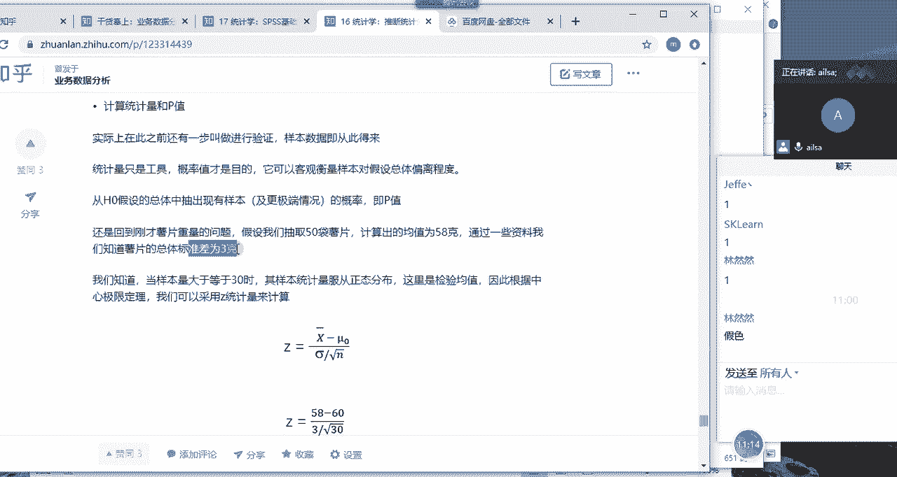

现在我们知道的值都有哪些呢，现在我们知道的只有嗯有啊均值啊，我们的总体总体参数，总体参数是均值为60对吧，然后标准差总体哈标准差为3克哈3克，然后我们的样本啊，样本均值，样本均值为58克，为58克哈。

计算出样本均值为58克，现在哈现在我们计算一下它的什么呢，就是我们带入到我们的标准，正态分布的公式当中，我们计算一下它的Z值，跟0。05这样的概率进行一个对比，然后看一下它是不是属于小概率事件。

如果是属于小概率事件，我们就拒绝原假设来我们代入之后哈，我们呃就这样的一个结果哈。

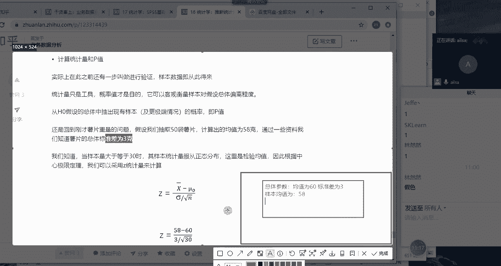

我们代入之后是我们的均值58，减去我们的呃总体的均值60，然后除以我们的标准差，三根号下30得出来的结果为啥是30啊，我看看啊啊写错了，应该是50哈，不好意思啊，应该是五十五十哈，结果应该是正确的哈。

可以我们现在可以算一下哈，我写错了，应该是我最开始的时候应该用的是30，现在我们自己拿计算器算一下哈，看是不是对的，OK我们看一下，58-60=-2，根号30是吧，根号30还不好算哦。

大家算一下等于多少，这边空空，根号50哈，根号50，有没有人算出来的，Uh huh。

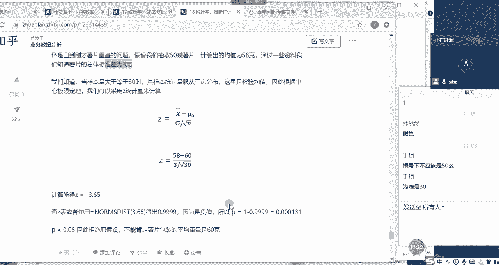

有人算出来吗，我给他是这个意思啊，来我们还是画图哈，好在我们的XY轴上，他这个意思就是说你算出来的，因为我们知道他是双侧检验，所以说如果说两边是零点啊，零点啊，0。05的话，意思就是说好到这儿哈。

到这儿好，26，那两边就是我们对应的概率的话，就是零点啊，这是我这是我这是我们的拒绝域哈，这是我们的拒绝。

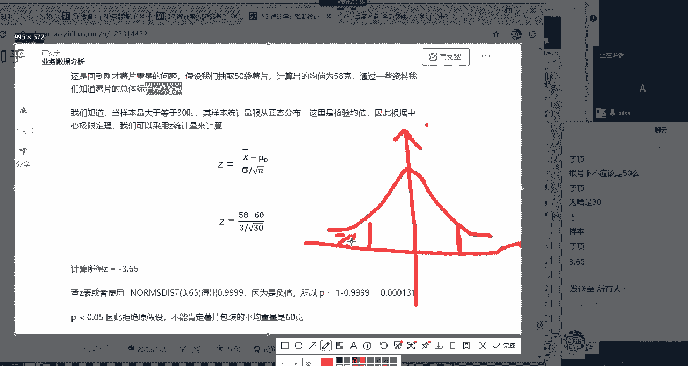

哎呦，我去。

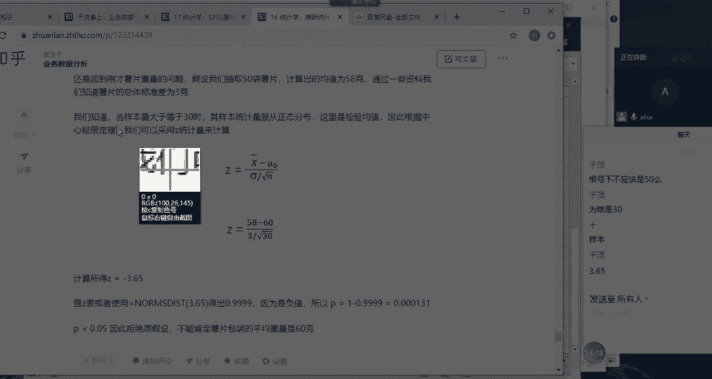

画图画得丑都不给我展示了，大家想一下，我们是这个意思哈，这个意思，现在啊我们弄的一个哦啊，整个的一个阿尔法等于0。05哈，意思就是95%的，如果说我们算出来的Z值落在了这个区域当中。

那它就属于正常的一个情况对吧，因为它涵盖了95%这样的一个呃，呃就大部分的情况，如果它落在这个地方的话，那就他就属于呃就是你测算出来的58，它就属于正常的，没有问题的，但是如果说啊如果说你落在了这里啊。

你落在了这里，这其实是属于小概率事件了，对不对，它属于我们的啊，就是95%之外的啊，0。05这样的一个区间范围，如果你小于这样的一个范围当中啊，你在这个范围当中，那说明你这个事件发生的概率非常小。

我们就可以认为不发生对吧，也就是说呃那你检验为58克啊，你检我们检验的结果是58克，这样的一个现象落在了这里面啊，落在这里面，那说明啊他就不是属于我们均值为均，均值为60这样的一个总体啊。

总体当中我们就会认为它可能啊，它的均值不等于60，为什么呢，是因为95%的情况下，它就不可能小于58，哎这样的结果啊，那我看一下他最终得出的Z值是-3。65，那我们之前也计算过。

如果是95%这样的一个概率值的话，它对应的值大家这个一定要记住哈，是-1。96啊，-1。96大概是二倍的标准差，正1。96，那我们想一下-3。65大概是在这个位置，对不对，那他明眼一看。

它在我们的拒绝与范围当中，那我们就需要拒绝原假设啊，接受备择假设，也就是说他这个啊，它这个检验出来均值为58，这样的一个一次抽样的结果当中，它不属于啊均值为缪，方差为标准差为三的这样的一个总体数据啊。

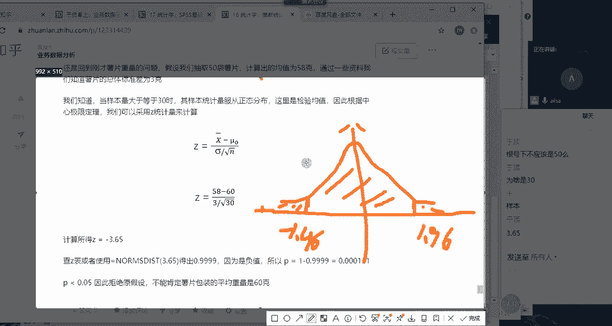

这样的一个结果啊，大家听明白了没有，同志们，大家听明白了没有，如果听明白给我扣个一，其实呃简单来说的话，假设检验就是这样的一个步骤哈。

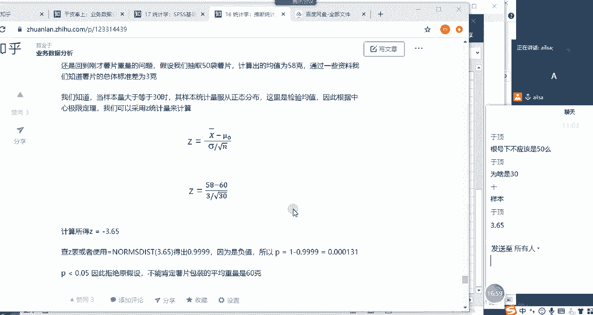

首先我们对总体啊，我们对我们对总体啊总体参数啊提出假设啊，比如假设啊，然后啊我们进行一次随机抽样啊，然后我们计算啊计算最终的结果啊，然后去跟啊，好我们刚才是跟Z值进行一个比较对吧。

跟Z值进行一个比较进行比较啊，或者是我们还可以把它的概率计算出来，因为我们有它的位置，我们是不是可以查这个啊，它对应的正态分布的那个表啊，的概率是非常小的，它的概率是啊0。000131啊。

它的概率如果说小于0。05的话，我们就认为此次啊此次事件啊是小概率事件，我们小概小概率事件，我们就可以认为啊不可能发生啊，其实它有发生的可能性，但是它概率很小，我们愿意啊，我们就认为啊它不可能发生啊。

那它不可能发生，那我们对于此次事件来说，那就不成立对吧，那我们此时的一个原假设它就不成立，比如说我们在这一次当中，它的mu啊，它的mu是等于60，然后我们进行了一次抽样对吧，我们进行了一次抽样啊。

你想一下这个new的60是怎么得来的啊，是不是啊，是不是我们在之前的时候进行了N次啊，进行了N次抽样啊，然后得出来最终的一个啊均值为缪哈，那这个啊，而且我们啊而且我们是在0。05的置信啊，或者是0。

95的啊置信水平下，然后得出来这样的一个结果，对不对，那也就是我们可以断定，如果你进行100次抽样的话，那有95%的这样的一个就是范围，是可以包含这个总体均值的，是不是，对不对，那你在进行了。

你接下来进行了一次随机抽样，如果这次随机抽样的一个结果，属于这个0。95的正常范围，我们就认为他这个均值为60是属于正常现象，如果不是啊，如果属于啊，如果属于小概率事件，也就是说它小于这个0。

05的时候，那我们就认为我们直接就认为不可能发生了啊，认为不可能虽然会有错，但这个错的概率很小，我们愿意承担，所以说那如果不可能，我们就认为这个你在此次检测，检测的这个样本当中，为58克这样的一个均值。

它不属于原来60克，均值为60克的这样的一个总体样本，也就是说也就是说啊说什么呢，就是你的后来的产品中存在偷工，偷工减料的行为，偷工减料的行为啊，我需要你考虑是否考虑是否再合作。

也就是说你在最开始进行一个呃，就是比如说我们在跟商家第一次合作的时候，你检检验出来的整个的均值为60，那再后来啊因为客户的投诉和反馈，然后你再进行这样的一个随机抽样发现啊，等于58克这样的一个均值的呃。

一个概率值是非常小的，那就只能说明什么呢，只能说明它这个样本就是，你在这个你随机抽取这50片所在的，这个总体当中的均值已经不为不为60了，说明它已经存在很大问题了啊，明白了吗。

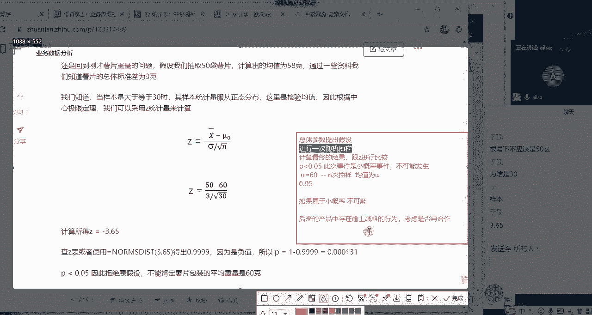

同志们，这个听明白了没有，听明白，给我扣个一，这就是我们假设检验的一个基本的思想，okay嗯，嗯好的，其他人呢哈，我们这个P值应该知道怎么计算吧，我们根据它啊是一减去这个five啊，3。65。

然后得出来这个P值是这个结果，看它如果小于0。05，我们就认为它你看它是一个很小的概率，是个很小的概率，也就是说如果说如果说你这个总体均值为60，你在进行随机抽样的过程当中，抽取。

抽取完计算出来均值为50帕克，这样的一个结果，或这样这样的一次结果当中，出现这样的一个现象，而是非常非常非常非常小的啊，那既然不可能出现，那我们在抽象中它却发生了，我们就认为它这个啊。

我们的原假设是有问题的啊，是我们要拒绝我们的原假设啊，是这样的情况啊，就是它不可能发生，但它小概率事件嘛，他不可能它不太可能发生的情况，它它竟然发生了，那就是有问题的啊。

如果说我们最终计算的P值是大于0。05的，那它就是属于正常的啊，就没有问题，比如说你计算出来的啊，均值为59，然后最后计算出来的P值为零点啊，0。06或者零啊，0。07啊，或者0。10。2。

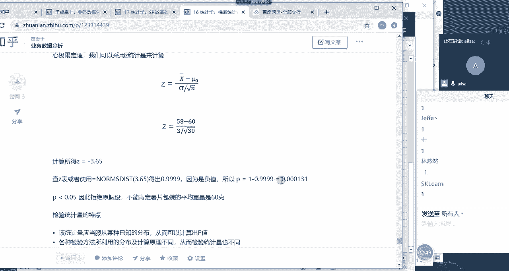

这样结果的时候，它就会落在什么呢，它就会落在这样的一个。

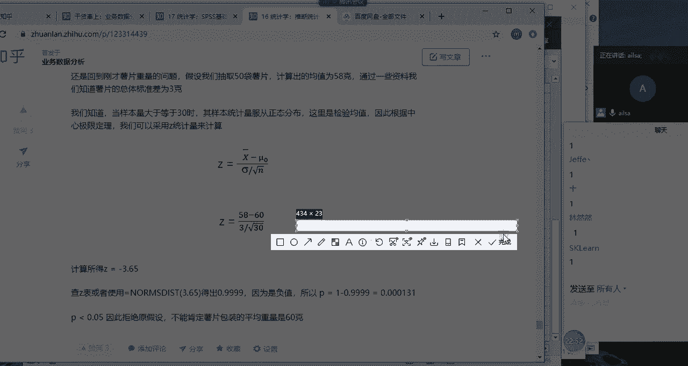

它就会落在，比如说我们再画一个哈，画一个地，你再画一个这样的这样的正态分布，如果说它好啊，它计算的概率，你比如说这个是，好假设这是95%，哈哈我们的阿尔法0。05这样的一个啊，结果然后你计算的概率是0。

1，你看这是0。025对吧，0。1大概是这样的一个范围，对不对啊，这样的一个范围，这样的一个范围，那它都包含了这个正常的一个范，正常的一个95%这样的范围内，所以说那它就属于正常的，它就是有可能发生。

而且是属于啊95%当中，经常发生的这个现象，那就没有问题，但如果它属于小概率事件，就不太可能发生，它却发生了，那就说明他有问题，虽然说我们有可能是误判，因为因为它毕竟有存在的可能性。

但是我们愿意承担这样的错误，明白了吧，我们愿意承担这样的错误。

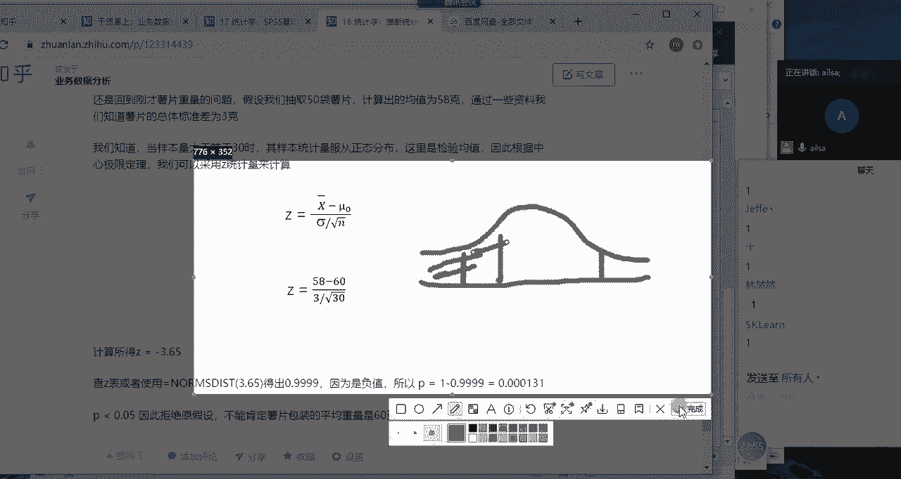

OK那这就是我们的假设检验啊，大家可以回去看一下我们有什么呃，I型错误和二和一就一和二这样的一个哎错误，这样的一个结果，也就是我们到底是不是我们拒绝原假设，有可能会存在错误的风险啊。

嗯那我们假设检验呢也分单双侧哈，那就单侧检验和双侧检验，那我们刚才讲的这种嗯这种啊就是不等于啊，就是它等于mu等于60和缪不等于60，它属于双侧检验，那单侧检验是什么样子的呢，我给大家介绍一下哈，啊。

比如说现在我们还是举一个工厂里面的例子哈，比如说灯泡，我们都知道灯泡的使用寿命哈，啊如果说使用寿命很短的话，嗯那就不太好了，对不对，那比如说根据合同规定，灯泡的使用秘密使用寿命不低于1000小时。

那其实如果说高于1000小时的话，我是不关心的，我主要关心的是那些低于1000小时的人，对吧啊，低于那些1000小时的灯泡哈，那我们看它的数据，已知灯泡的燃烧寿命服从正态分布，标准差为两二百。

然后从总体中啊，总体中哦随机抽取了100个灯泡，然后得知样本均值为960个小时，我们啊，这个时候我批发商是否应该购买这批登宝，我们看一下这个数据，首先它服从正态分布，它总体均值是1000。

然后它总体标准差为200，然后它的样本均值为960，那对于这一现象啊，就是说这里随机抽样的这样的一个结果，我们去判断一下它是否属于小概率事件，如果说是属于小概率事件，我们就拒绝原假设，说明不可能发生。

而它发生了，那说明他有可能它的均值就不是1000，说明它这个灯泡有问题对吧，那我们看一下原假设啊，就是我们的额均值大于等于1000，那我们的倍则假设就是小于1000啊，至于他啊，至于他到底就是呃。

就是他这个啊均值大于大于1000，大于多少，我们不关心，我们主要关心的是小于1000这样的一个结果。

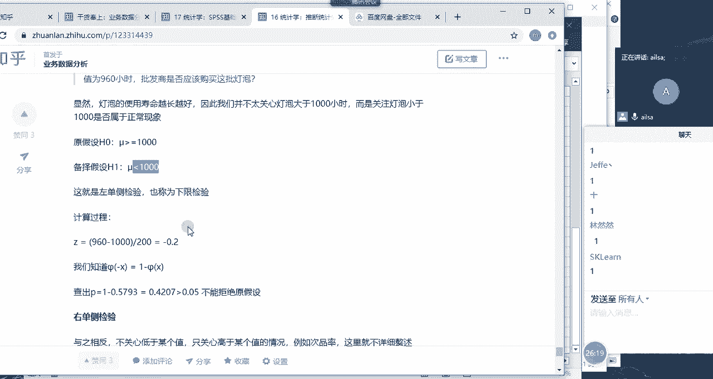

那这种的话就属于左侧检验，什么意思呢，就这样的，我给大家画个图哈，画个图嗯，假设这是我们的正态分布的话啊，这是我们的正态分布的话，然后我们都知道标准值啊，现在不是不是标准正态分布，这是我们的正态分布。

它的均值呢它的均值是1000对吧，均值是1000啊，然后啊方差啊，标准差是多少，标准差是200对吧，这样的一个正态分布，然后我们想分析一下，就是因为我们的原假设其实就是我们的枪罢，我们想推翻它，对不对。

那我们就看一下，小于1000这样的一个取值范围啊，嗯小于签证啊啥呀，小于1000这样的一个取值范围啊，小于1000这样的一个取值范围，是不是啊，是不是在我们的啊，在我们的啊那个小概率事件当中。

如果是的话啊，如果是的话，它就呃它就是属于不太可能发生的情况，而发生了，我们就可以拒绝原假设，就是这样的一个一个结果，大家看大家看这个单双侧的时候，主要看我们是不是两边数据都要考虑，还是只考虑一边。

如果只考虑一边的话，我们主要看备则假设哎，我们想要实现的一个目的哈，被的假设是小于1000，也就是我们就属于左侧啊，左单侧检验这样的一个结果，我们主要看小于1000的情况下。

它整个的一个占的概率值是多大啊，这样的一个结果，那我们怎么去计算呢，首先我们要把它转化为标准正态分布，所以我们就可以用我们的标准正态分布的公式，也就是我们的均值减去我们的啊总体均值。

然后再除以我们的总体的标准差是吧，它等于负的0。2，然后我们根据这个值去计算它的一个概率啊，一个概率大概是0。4207啊，大概是这个位置哈，那大概是呃这个面积哈，因为它这个负的0。2呢，我们都知道啊。

他这个秩序水平也是0。05，所以它这个值的话-1。96对吧，然后0。02应该是在这个位置，大概这个位置哈，所以说它就属于正常的一个范围内啊，那他就是不能拒绝原假设，这样的一个单侧检验的结果嗯。

这就是我们的左单侧检验，那右单侧检验也是一样，就是我们的倍则假设是希望它大于某个值，怎么怎么着而言的时候，就是属于的右单侧检验这样的一个结果哈。

OK大家对于单侧检验啊，左单侧检验这个东西啊，这个案例有没有听明白，听明白，给我扣个一，然后如果没有听明白，给我说一下什么问题，听懵了，根号100是吗，我看一下啊，好像是诶，我好像忘处根号100了。

嗯嗯我想想啊，是我们的标准差除以我们的根号N对吧啊，对我们再重新算一下，看等于多少，如果说除以根号100的话，结果是多少，大家算一下，有没有人算出来我是真，那是我算错了，对我回去改一下，那这个呃我看。

那这个是-40÷200根号下100，是100个样本吧，好100个灯泡对，有人算出来结果吗，二，是，不是吧，根号100不是十吗对吧，哼这这点算不明白了，还是说都睡着了，这不是0。02吗，Five2。

啊除以啊，sorry哈除以啊除以十哈，二对吧，稍等我看一下，OK那我等会再改哈，二啊，二的结果的话，我们想一想哈，二哎，我们查一下表哈，二的我们这个时候需要根据Z值去查P值，对不对，二哦。

那应该是在拒绝域范围内的，我们看一下，因为二跟一加也-1。96，它在它那边二的话是0。9772，0。9772，然后一减去这个东西啊，肯定是小于0。0。05的，那这个的话那我就算错了哈。

那这个就要拒绝原假设了，因为我们其实我们其实如果记得熟的话。

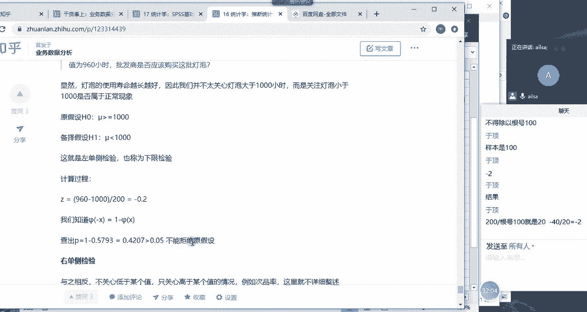

1。96，这个这个这个东西肯定大家一定要记一下哈，你看如果说是这样的话，那我们的那我们，啊那我们这个值是负，假设是-1。96的话啊，-1。96，嗯-1。96，然后他这个是二，大概是在这个位置。

那就是在我们的拒绝域的范围内对吧，在我们的拒绝域的范围内，那说明我们是要它就属于小概率事件啊，那他又不可能发生，也就是说那我们要拒绝原假设啊，他这个灯泡就属于不正常的对吧。

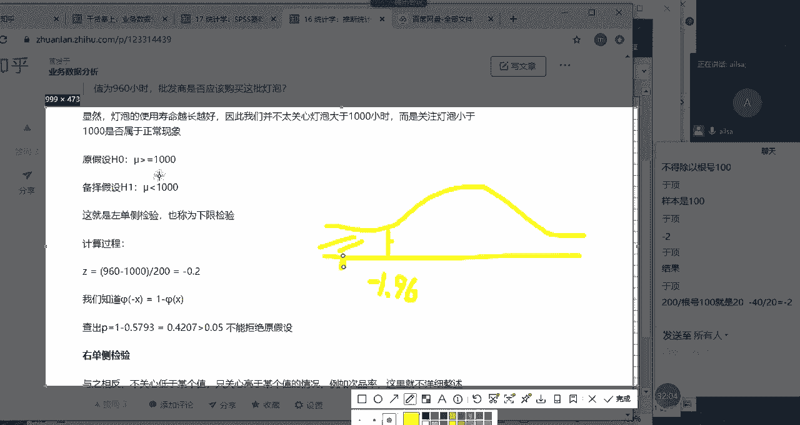

它这个均值为1000小时就满足不了，原原假设跟B的假设均值不都是1000么，哦原假设原假设的均值是大于等于1000倍，则假设的均值是小于1000，那我们得出来的一个结论。

就是说原假设的就是我们拒绝原假设，就是就是说呃我们的灯泡，它的整个的一个平均的寿命，不可能大于等于1000啊，只能这么说，不可能大于等于1000啊，然后啊接受倍的价就有可能是小于1000的啊。

这样的一个结果不是都用1000啊，这个呃听明白了吗。

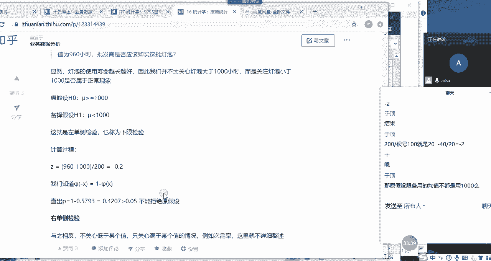

Uh huh。