# 强推！这可能是B站最全的【Python金融量化+业务数据分析】系列课程了，保姆级教程，手把手教你学 - P93：06 SPSS基本操作 - python数字游侠 - BV1FFDDYCE2g

好，那我们接下来讲解一个哦，统计学上非常专业的一个使用软件，就是SSPSS啊，可能很多人嗯就是在国内啊，可能很多人会叫什么SPSS啊，或者等等这些说法哈，嗯就是我这边也也问了一些哈哈。

好像大家都认为说啊，他就是叫SSPSS，没有什么英文的啊，简称啊或者等等，这些都是全拼就可以了，所以说大家以后再出去说的时候，就说SPSS就可以了，当然别人如果说海边，如果说啊SPSS啊。

什么什么等等这些的叫法的时候，你知道什么东西就可以了，然后你也不用去给别人指责说，哎你这个东西不叫SP，不叫spas，应该叫SPSS哈，这种啊没有必要去去说这个东西哈，可能每个人都有每个人的叫法。

我们就统一称称之它为SPSS嗯，啊这个好像啊有一个啊，专门从事统计学很多年的一个啊老师说，他其实就是只教SPSS嗯，OK那我们看一下我们讲SSPSS都讲哪些东西。

首先我们会介绍一下为什么要学习SPSS以及SS，SPSS的一个发展史，还有它一个操作界面，还有它的一个使用方式，还有它的一个常用的操作，嗯好啊，它数据管理相关的一些内容，还有它的制作的图表。

还有我们如何使用SPSS做描述统计分析哈，我看一下哈啊对它的全称非常的长哈，我就不念了哈，OK那我们看一下我们为什么要学习SPSS呢，嗯首先呢它是一个统计分析软件，为什么称之为统计分析软件呢。

是因为它里面很多东西都是基于统计学的知识，然后进行的统计分析模型，然后统计方面的一些啊就是工具啊，内容啊，理论知识啊等等啊，这些的操作，也就是说他的理论层完全是基于统计学知识。

所以说它是一个统计分析软件，然后啊，那我们统计设计它完整的流程包括什么呢，啊它就包括啊搜集搜集整理分析报告哈，和我们做数据分析的流程是类似的，嗯啊这个其实大家简单了解就可以了哈。

嗯SPSS啊在实际的工作当中啊，并不是所有的企业都会使用到啊，啊也就是可能会部分企业在做一些啊模型啊，搭建和呃就是呃一些测试的过程当中，可能会用到啊，可能会用到啊这些知识啊啊用到统计学知识啊。

并并不一定会用到SSPSS，但是你使用SSPSS的话，你一定会用到统计学的知识啊，这个是必然的哈，那我们看一下SPSS有什么好，有什么优点呢，什么功能强大，兼容性好，易扩易用性强啊。

什么什么扩展性高等等这些优点啊，我们其实现在都体验不到，因为我们还没有重新认识这个软件，不过没有关系，等我讲完了之后，你们大概也就能体会到它的优势了，那它的劣势呢就是我们在统计上。

统计的计算速度上相对较慢一些啊，那我们了解一下SPSS的一个发展史哈，他之前啊是最开始的话就叫这个名字哈，刚才有同学发的啊，那现在呢他前面加了一个IBMSSPSS啊。

as as stay statiati哈，Statistic takes，也就是说分析嘛啊就是说为什么加IBM呢，是因为他被IBM公司收购了哈，我们看一下它的发展历史啊，啊60年代的时候。

他是美国斯坦福三位研究生所研发的，然后70年代成立了公司啊，80年代有了一个微型机啊，这个我倒我还真不知道哈，然后90年代开发了windows版的V6到V10好，那在本世纪也就是20世纪的话。

他被I2010年的时候被IBM公司收购，然后版本的迭代更新呢，是从SPSS11到25，目前的话我知道的目前的是最新版本是25，我们使用的也是25版本哈，嗯但是我我听有人说已经嗯有更新的版本了哈。

但是新版本中间可能会存在一些bug哈，所以说呃我们一般情况下就用稍微，稳定性比较好的吧，但是这些bug的问题也不大哈，那他们在迭代更新的过程当中呢，其实啊功能也在不断的完善。

界面也在不断的啊升级优化更加精简啊，简单一些这样的一个呃一个更新哈，那说明其实SPSS还是很厉害的，为什么呢，它版本在不断的一个迭代更新，那说明它整个的一个呃呃呃，就是呃整个一个软件。

还是比较趋于成熟和稳定的，嗯那有的人说啊，嗯可能大家现在对于分析软件的一个了解，还是比较初级的啊，比如我不知道你们有没有听说过啊啊啊啊，嗯这样的一个SAS这样的一个统计分析软件。

他们也是跟SSPSS类似的，来我们来看一下哈，那对于跟SPSS同类的统计分析软件，还有SAAS啊，SARS和二这两种啊，这两种，那SA呃SARS呢它是一个啊也是统计分析软件。

但是它的难度会比SSPSS难，而且啊他是收费的啊，嗯这就是对于专业的统计学，专业的这样的一些呃呃学生或者是呃领域的人，他们可能会用到SARS，那R呢它是一个编程语言，它跟Python是类似的。

也就是我们的啊数据啊，分析的这样的一个编程语言，那R和Python你只要会一个就行了，因为大家都在都会Python，所以说R这边就没必要学了，而且R它并不像Python那么简洁。

也不像Python那么呃就是流畅吧，可以这么说啊，而且其实还是啊有点难度的，就are和SAAS它都是有一定难度的，那相对来说学SPS，S和Python的话还是比较简单一些的，那SPSS它简。

他就是他怎么就说简单易上手呢，其实就是因为嗯我们都下载了SSPS，我们可以简单看一下它整个的一个界面，你打开了之后，你会看它是一个按钮式的操作界面对吧，它跟啊它跟excel是很像的，这些是它的功能区。

然后这些是它的一个二维表，然后这个是它存储的一些啊变量的数据类型啊，大概就这么多，很多人就只能看到这儿了，然后以及它有一个输出的界面啊，对这样的一个东西就没有了啊，所以说其实嗯就觉得也没有什么难度。

然后就是呃一些数据的一些分析呗，对吧，只要你懂统计学，那这个SSPSS还是很简单的，嗯嗯那然后看呃，就是说他现在被IBM收收购了之后，然后与office无缝衔接，也就是说他这边的兼容性做的还是很好的。

而且SSPSS还可以跟python2连接啊，进行一个二次的开发啊，说明它还是比较成熟的哈，啊相对来说嗯嗯很很好用，所以说我们才会讲SSPSS，这是我们啊简单的对SPS进行一个啊介绍哈。

那接下来我们就看一下我们的SSPSS操作界面。

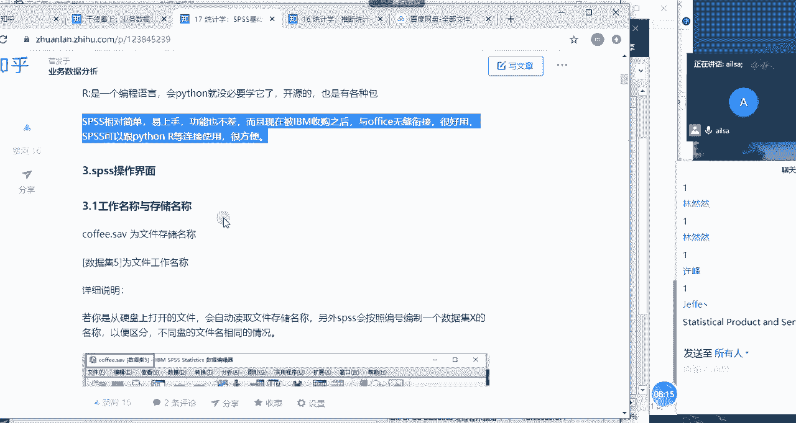

我们在讲任何一个软件之前，我们都会先去讲什么呢。

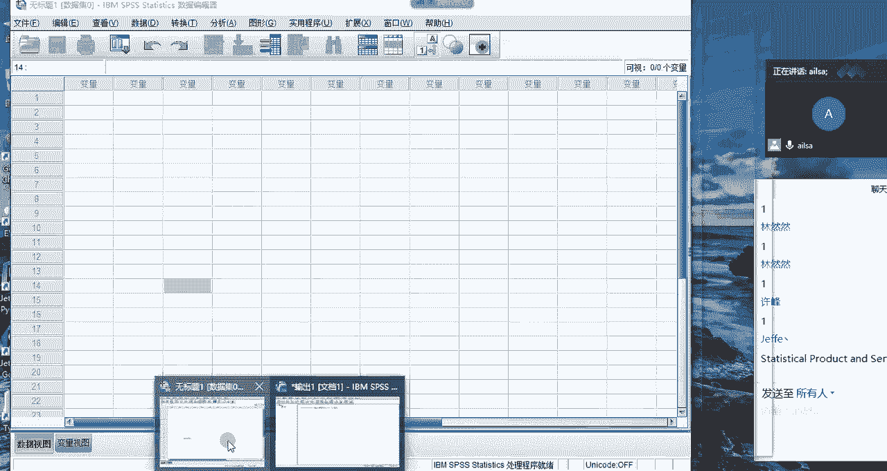

我们先去讲它的一个标题哈，首先我们先看一下SPSS，它的文件的后缀名是什么样子的，是谁有谁能告诉我SSPSS的文件的后缀名嗯，有谁知道，嗯有人知道吗，人知道给我说一下，同志们嗯SAB对啊，SUV是吧。

我们看一下，我们打开一个文件啊，然后它的后缀名就是SPSS，它生成的文件啊，就他自己哈，这个软件生成的文件就是后缀名是SAAV，但有的人就说，那我就只能打开sv av这样的一个文件的呃。

那个呃文件类型吗，其实不是哈啊，就是SIPS也支持啊，你看也支持excel，看到没有，我之前教大家的后缀名是XLS和XLSX啊，这样的后缀名的时候，相信很多人呃，就是呃我也说明了原因。

是因为它是为了区分版本，所以说我们在导入数据的时候，他也会对他特别进行一个提醒，那你看还有CSV啊这样的一个版本，我们在后面使用Python的时候，大家就会发现我们保存了很多，或者说我们使用的很多文件。

它的格式就是CSV格式的，然后它还支持文本对吧，它还可以打开SARS文件对吧，哎你看很多啊这样的一个文件类型，它其实从这个层面去说的话，它的兼容性还是很强的，因为它支持很多这样的一个数据存储的。

格式的呃，文件类型啊，这是一个哈，这那他自己默认的是SAV哈，比如说现在我们打开一个这样的一个文件，哎我们打开嗯。

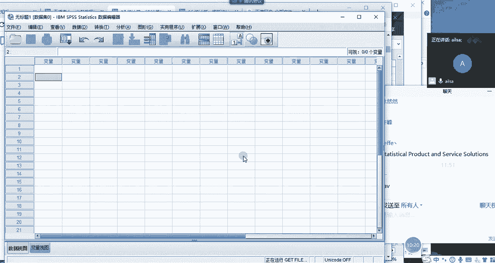

打开之后我们看一下有什么变化哈，啊我打开之后会看到啊这个文件名啊，我的文件名其实叫coffee点SAV，这个是没有什么问题的，大家看到没有，后面变成了数据及一啊，那这个时候我如果再打开一个文件。

再打开一个啊，再打开一个这个。

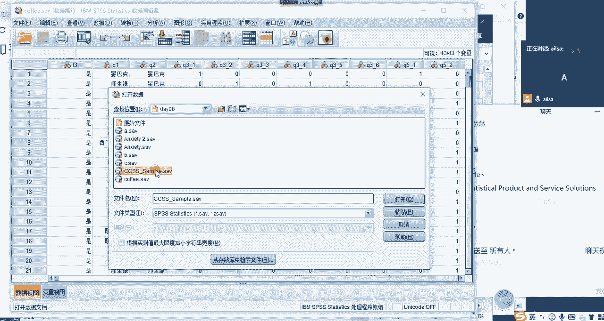

我看看这个文件哈，再打开一个，这个时候我们再会发现它会变成CCSS，这是我的文件名，数据集二，也就是说它通过前面是我的文件名，后面呢我会自动给它加一个，我这个数据集，以数据集为命名开头来进行区分。

数据集基，数据集一，数据集二这样的一个形式来进行一个展示，这就是它的第一个就是我们的文件名，它有两个，一个是文件名，一个是数据集啊，这样的一个名字对啊，这是我们讲的第一个内容，就是工作名称与存储名称啊。

它是由两部分组成啊，一个是啊存储的名称，一个是我们工作的名称，好吧啊，然后我们再看它的四大窗口啊，四大窗口啊，四大窗口第一个叫数据编辑窗口。

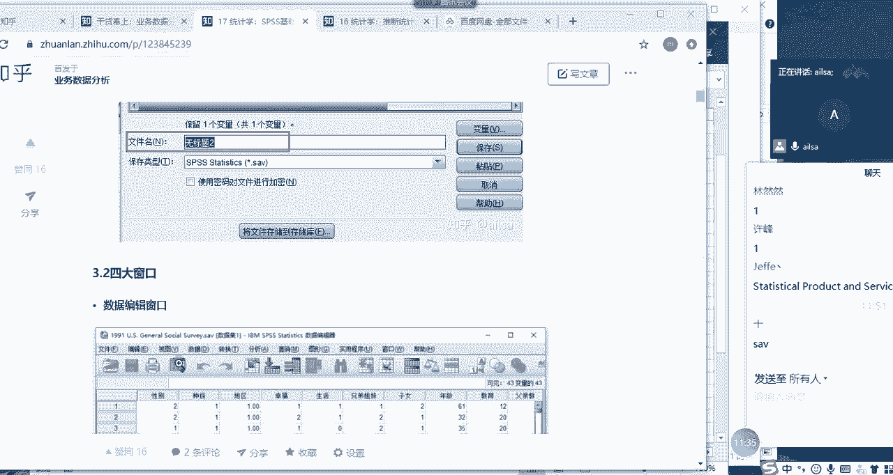

也就是我们的这样的哈，你看它的窗口的话，其实跟excel好像有点不太一样，为什么，因为它有两个，我们看一下这两个分别存的是什么，首先看数据视图，我们可以看到数据视图里面存的都是数据，对不对。

那它到底存了哪些数呢，我们看它的横坐标是数字，纵坐标呢是什么呢，这是什么呢，这是什么呢，好像也没有啊，好像像字段对吧，字段名哎我们过来看一下是什么字段名，哎你看名称，time id什么什么什么什么的。

这些对吧，哎好像这边就是字段名，那我们可以发现就是它跟excel不一样的地方，在于它的行是数字是没有问题，它的列呢没有ABCD是不是它直接就是啊，直接就是我们的列名来代替它的整个的一个列，标题对吧。

为什么是这样呢，其实它是因为它不要，它不需要对单元格的地址进行一个引用，它直接加列名就可以了，那大家再看一下我们的变量视图里面，到底存什么东西哈，哎我们打开之后发现名称类型，类型是不是数据类型啊。

宽度小数位数标签指的什么，我们先不进行一个详细的看，我们会发现这里面是不是对每一列的字段，你看time id是吧，time id对每一列的字段进行了一个不同数据类型，以及它的宽度啊等等之间的一个存储啊。

是不是跟我们的数据库有点像啊。

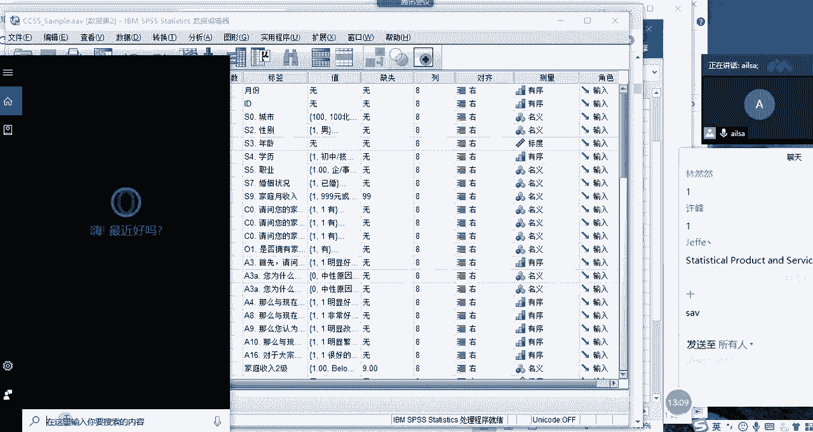

同志们，是不是我们打开我们的数据库看一下啊，跟我们数据库哪点像，大家说一下跟我们数据库哪点像啊，现在跟我互动一下，大家觉得它跟它这个地方跟我数据库哪一点像，嗯同志们，有谁说一下字段对表设计非常好哈。

那我们看一下，比如说现在我们打开我们之前做过的表，比如说淘啊，淘宝杠data点击设计表出现之后，唉，他这里面是不是名数据类型长度，小数点是不是none等等，这些是不是跟这个设计表有点像啊，对不对。

唉那我们再打开看一下是不是哎名称类型，宽度什么什么等等一堆，我们先不看它后面到底有什么，各就是自己存在的嗯，嗯就是不同的地方，但是从整体的一个结构来说的话，我们大概也就明白这个地方。

就是我们数据关系型数据库里面的每个字段，它的一个存储的类型啊，每个字段它的一个表设计的结构的，这样的一个形式对吧，那这个数据视图呢它就是用来存数据的啊，这样的一个形式来构成了整个哦。

SPSS当中的一个主体啊，就是首先你得有结构，第二个你要有视图啊，这样的结构，这就这也是这也是它跟excel不同的地方，那么我们可以间接的发现，它好像啊结合了excel和数据库的一些优点，对不对。

来达成了这样的第一个窗口哈，第一个窗口我们介绍完了，就是我们的数据窗口也是我们打开excel当中，我们第一次看到的这样的一个窗口，那第二个窗口就是我们在打开之后，它会有一个结果性。

你看查看器哈这样的一个结果性窗口，然后这个窗口有什么用呢，来大家看一下，比如说啊啊大家现在手里没数据是吗，啊，稍等啊，啊比如说啊比如说现在我给大家发一个数据哈，我给大家发一个，把这两个给大家哈。

你们打开跟着我去操作哈，来同志们，你们现在打开这个文，这两个文件如果打开了。

给我扣个一，然后跟着我去操作，嗯打开了给我扣个一哈，就是你在你的SPSS当中啊，打开了这个CCSS杠symbol哈，这个数据是对于啊对于某一项调查，什么调查呢，就是对于啊某个城市。

它的一个消费信心指数的一个统计结果哈，什么是消费信心指的信息指数呢，就是说嗯就是大家在买东西的时候，就是，没有登QQ是吧，我没有登微信嗯，然后就是大家在买东西，就是在购物的方面。

然后整个的是希望把钱存起来，还是说希望能够啊进行进行正常消费，还是说呃还是说嗯，就是啊超前消费这样的一些理念，就是啊就是对于目前的一个消费的信心指数啊，到底自己的钱够不够，花这样的一个这样的一个状态。

OK嗯希望钱生钱嗯，我也是希望钱生钱，可是不会投资嗯，OK好了没有好了，给我扣个一哈，打开这个表了之后，我给大家做一次操作演示啊，当然了，我们还没有学这个图表啊，不过也比较简单，我给大家演示一下。

我们怎么啊，这操实现什么样的操作，能够在这里啊实现一些东西哈，可以了吗，可以给我扣个一啊，我们就开始啊，其他人呢好嘞，那现在大家跟着我去操作哈，我们点我们的嗯分析啊，点分析，然后点描述统计啊。

点描述统计，然后点探索，点分析，点描述统计，点探索，OKOK了之后点进来，然后我们的啊因变量列表我们直接选择年龄啊，选择名年龄啊，因变量列表选择年龄，我们试一下哈，哎我们直接点击确定没有涂上啊。

OK那我们就出来了，这样的一个啊描述性的一些结果，大家看到没有，其实我们的SPSS，对于你看，我刚才只是做一个描述统计的一个操作，大家看非常的简单哈，那我操作出来之后。

我们会在这个查看器里面看到我们的一些结果，大家看它整个的格式非常的简洁哈，这个地方是SPSS的一个优势，优势在哪呢，所以看起来比较方便，怎么叫比较方便呢，你比如说现在我点年龄啊。

他要定位到年龄这个地方了，然后我点标题啊，我点标题它丢到标题这里备注，然后活动数以及个数，然后它类似于这样的一个目录式的操作，然后让你去分辨出这样的一个结果描述，你看我点描述。

它就定位到我们描述这个数据当中，那我从这个数据当中就知道我整个年龄，这个字段它对应的一些描述统计的分析的结果，就很简单的去呈现了，然后接着他又按照我的年龄，进行一个敬业图的划分。

然后每个年龄段所对应的啊这样的一个结果啊，啊对这样的一个结果啊，敬业图，然后他还画了一个箱线图给我，是不是感觉特别的专业哈，特别的学术化，我就点了一步探索啊，分析探索，这样。

结果他就给我出来这么多的一些分析的结果啊，非常的好用，对不对，唉就是我们的鼠标点点点点点的操作，就能实现我们所想要的效果，那这个界面哈，这个窗口我要介绍的是这个窗口哈。

这个窗口其实就是我们在前面介介绍一些啊，就是一些操作之后它的一个结果呈现，那它这个结果呈现的一个左边的，这样的一个形式的话，类似于目录式的，给人的感觉非常的整洁，然后也非常的清晰啊，是吗。

大家大家用的是同一个软件呀，啊是同一个软件，它整个的一个啊，它整个第一结果还是就是它这个版本越高的话，它整个的一个效果还是比较好的啊，它你相比较之前的话，它整个的一个啊不就是整个的一个颜色配色。

还有整个一个效果会啊偏向于啊简单整洁啊，现在我们大家现在追求的一种方式，我发现一个问题，就是我们现在不管是生活还是工作，还是怎么着的时候，都追求的是简单粗暴，简单粗暴，什么意思呢。

就是说我们买东西越方便越好，我们用软件啊，就是越简单越好，就是说你比如说大家还记得，当时抖音火的时候吗，就是因为它为啥火呢，就是因为他打开了这个APP之后，你什么事都不用干。

你就能就是你都不用注册登录了，然后你就能看视频，就因为这样一个非常简单的一个操作形式，然后就瞬瞬间受到了大家的一个喜爱啊，这样的一个效果哈，啊我们再扯回正题哈，这是我们的啊，第二个窗口啊。

是我们啊要讲到的啊，叫什么的，结果浏览的这样的一个窗口啊，这个界面，然后我们第三个再看一下语法窗口哈，看完语法时，我们还要看脚本窗口啊，什么叫语法窗口呢，然后刚才我是不是执行了这么多的操作呀，对不对。

那他给我生成了好像有这么一堆的一个语法哈，稍微有点多，然后我们再重新，我们再重新执行一遍这样的一个操作哈，这个时候大家还是按我的操作，我们换一种方式哈，大家跟着我走，然后如果完成了，给我扣个一哈。

我们按描述统计，按频率啊，这个时候呢，我们把城市拖到我们的这个变量当中哈，统计这边的话，我看一下啊，我们就嗯选择平均数就行了啊，其他的先不用选，大家看到没有，这些其实就是我们学过的描述统计的内容。

对不对，点确定我们试一下啊，唉这个时候它就出现了我这个统计啊，你看在这里面又出现了频率相关的一些操作，如果大家有出现这个界面的话，给我扣个一，OK出现这个界面之后，我们会发现它对于城市而言。

它进行了一些频率的统计，北京上海广州对吧，然后有多少啊，有多少个数啊，北京有多少个，上海有多少个，广州，有多少个，各占多少百分比，这样的结果大家看到这个地方没有，这个地方是什么东西呢。

来我们是我们看一下哈，我们把这个东西啊，我们把这个东西复制一下哈，复制一下，然后嗯然后在我们的好稍等啊。

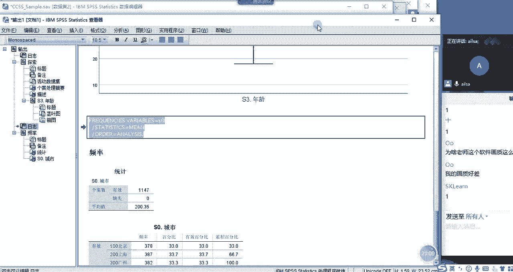

我这个界面有点问题啊，在我们的啊，在我们的啊，在我们的文件新建下面有个语法，大家跟着我操作哈，有个语法，然后我们点进来诶，这出现了我们的语法窗口哈，是我们语法窗口，然后把刚才的语法粘进来。

现在哈大家看到哈，现在我没有做任何的操作。

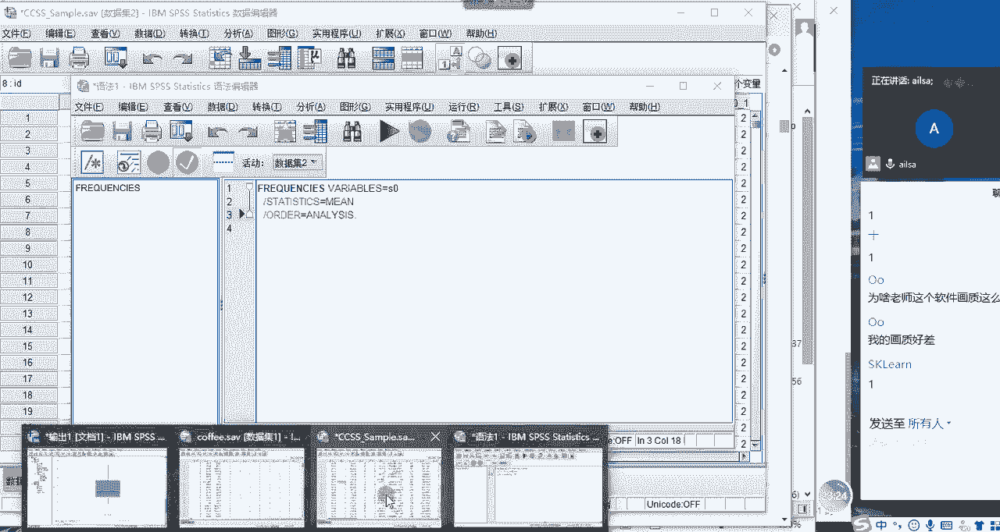

我们看输出的界面哈，输出的界面是不是有个频率啊，现在是不是只有一个频率对吧，我们把它缩一下，哎这是个频率，这是探索对吧，唉这是输出的结果，一个探索一个频率，还有个日志，我们不管哈，接着我不是把我的啊。

我的语法粘到这里了吗，那接下来我点这个大的啊，绿角哈，我们看一看就知道是运行哈，我们点击它，哎，大家看到没有频率，是不是又出现了一次，对不对，唉我们看一下好，我们看一下标题哈。

哎在这里的话它又重新的执行了一遍，我刚才的频率的一个结果，也就是说我们从这个侧面去观察了一个结果，什么意思呢，就是说我在执行了分析啊，苗统计频率这样的一个操作之后，它其实是转化成SPSS自己的语言。

然后利用这个语言去执行我们所想要的效果，那我们其实有时候可以把这个语言啊，或者把它的语法呀，粘到我们的一个执行语法的窗口，叫语法编辑器这样的窗口，然后执行一次，我们就相当于又重新生成了这样一个结果。

大家对于这个窗口的意义明白了吗，明白给我扣个一，OK哈啊，也就是说我们其实语法编译器怎么打开哈，在文件里面新建选择语法啊，文件选项卡下面的新建选择语法啊，就可以了，可以了吗。

啊也就是说大家要明白一个道理哈，所有的软件都是基于代码开发的，对都是基于代码开发的，所以说你看到眼前的一个个按钮，它其实就是封装好的一个功能，也就是它实现的一个代码，明白了吧。

OK那我们讲完了这个语法窗口之后，我们再看一下，SPSS是如何跟其他的编程语言交互的，也就是说你不是说他很兼容性很强吗，那体现在哪一点呢，你比如说现在我打开文件有一个脚本，大家看到脚本这个这个地方诶。

有Python看到没有，这是我们比较熟悉的哈，我们点python3进来，他在这个地方的话啊，具体的做法我倒不给大家做演示，它是属于SP当中的二次开发的内容，也就是说如果你想添加一些自定义的功能。

或怎样的时候，你可以使用这个这样的一个方式哈，但是咱们目前是不会用的哈，也不会讲这个东西，我只是告诉你他有这样的一个接口，那大家看到这个界面之后就比较熟悉了哈，就是我们的Python写脚本的地方。

你比如说我们在第一天啊来到老男孩的时候，好来到老男孩的时候，然后我们学的第一个啊代码是什么，同志们学的第一个代码是什么呀，hello world是吧对吧，是不是是不是啊，同志们有打开这个界面吗。

啊这个打开这个界面跟我一块说哈啊，Hello world，哎，这个时候打印出来hello world了对吧，3+2哎哎五对吧，我们还可以d f funk对吧，我们还可以定义我们的函数哎。

输入一个number对吧，然后比如说我们的代码逻辑代码是啊，是print，直接print吧，相信大家现在都不会用printer number加一对吧，如果输入完了。

我们直接调用函数funk f u NC，然后输入我们的number是五，那结果应该是六对吧，唉这就是我们的整个的一个Python，唉这样的一些脚本的一个接口也可以实现，你在这里面再写一些代码，可以操作。

SPS的话，就相当于是一个二次开发的内容，那我们看一下除了Python，还有其他没有看到有个python2，我们就不说了哈，我们看到一个basic，大家看一下，大家对于这个界面熟悉吗。

有没有人认识这个界面，同志们，sub开头，n n n sub结尾，这是一个什么东西，有人认识吗，我可是在讲excel的时候提过哈，没有人认识是吗，嗯他其实是啊啊VBA的啊对啊，这个XLSM是什么呢。

就是说你如果当前的excel当中有红红文件，它是红文件，就是包含了我们的vb的代码的时候，你要保存为XLSM，不然的话它就保存不了红文件，那它整个的一个怎么使用呢，它就是它输出的。

我们在Python当中输出是输出是print，他在这里面是啊，他在里面是mage box，比如说我们还是hello word，很熟的一个单词啊，这个BBA是我的母语哈，是我第一门学习的语言。

所以说还是很亲切的，那我们在执行的时候还是点这个哈，点这个A你看它出现的是一个窗口，然后点击确定就可以了，这就是它以sub开头，后面是我们的整个的一个代码的名称，然后它这里面是end sub。

那对于VBA而言，它的变量需要首先要声明哈，要声明变量啊，比如说先声明一个edge，然后啊int什么的，你要先声明它，你才能用，它不像我们Python上来就用哈，他这个完全是简单哈啊啊我跟再跟说一下。

建浩说这个录制动作是什么意思哈。

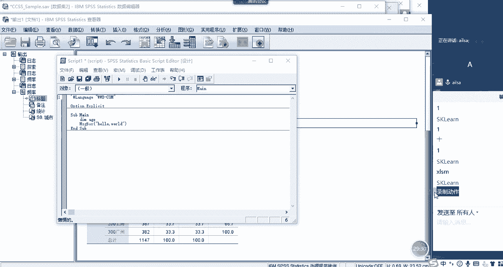

我们简单说一点点哈，你比如说现在我有一个excel的文件，我想给大家展示一下，唉VBA到底在哪个地方的时候，我可以在这里面输入我的VBA语言，VBA编程语言，我们还可以录制宏代码。

然后去帮助我们去学习了解啊，以及啊写这个逻辑啊，写这个vb的编程语言哈，那怎么来做呢，你比如说现在我点击我的开发工具，然后录制宏，大家这个不用操作哈，我只是为了给大家演示一下哈。

确定这个时候呢我在里面输入啊，输入什么呢，你好啊，师姐输入完了之后啊，我把这个鼠标定位到这里，然后选择这些粘贴，然后再选择这些CTRL加D啊，CTRL加二啊，这个时候我大概做了这步操作。

你看我是不是选择了很多单元格，对吧啊，我已经在选了，这也没什么用，对不对，然后这个时候我点击停止录制，他已经在后台给我生成了一些红代码，那我们怎么去看呢，啊我们有两种方式，第一种方式是out啊。

out加IPHONE11，alt加F11啊，如果有FN键的，要按住FN哈，还有一种方案，直接就是查看代码就可以了，哎呀选错了。

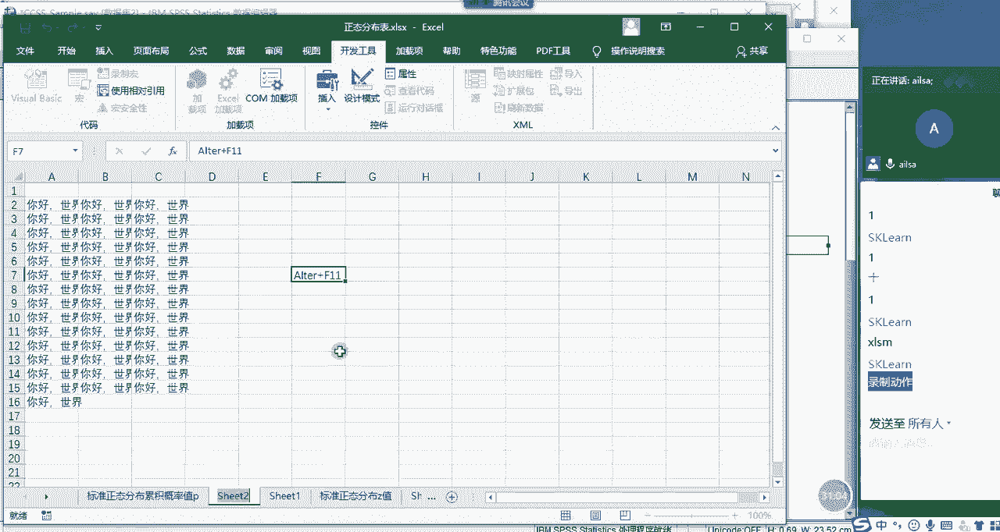

查看代码哎，后台就出来了，打开这个后台之后啊，很多人不知道怎么去找啊，很简单哈，他这个应该是在模块一当中哈，就找着了，因为我之前已经录过了一个叫红一的，然后我在这个单元格里面输入了你好世界啊。

然后呢我又选择了A2，选择了A3到A16进行一个选择，然后进行post啊，这是粘贴的意思，然后我又选择了A2到C15，然后进行一个什么copy对吧，就是copy没有，然后再选择向下填充啊。

向右啊填充的意思哈，向下填充没有成功，然后又选择了向右填充，看到没有，然后我又选择了E12这样的一个结果，这就是我们的啊VBA代码，它是以sub开头，and sub结尾，然后由我们的一个红的名称。

还有加括号这样的一个过程啊，这就是我们的宏代码。

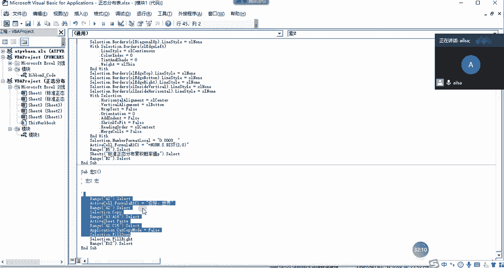

那也就是说excel本身而言，你前面执行的这所有操作。

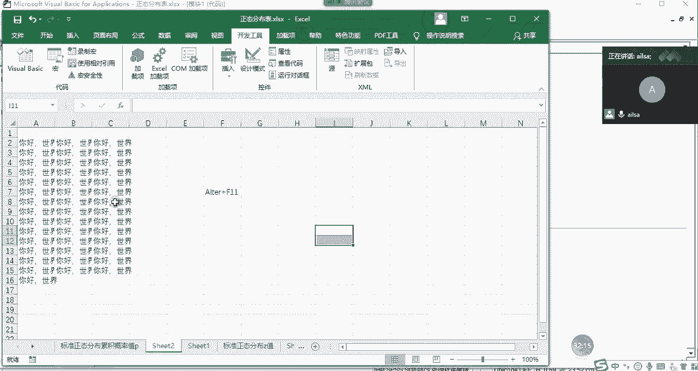

它都是要生成代码，然后生成代码再去执行这样的一个过程对吧。

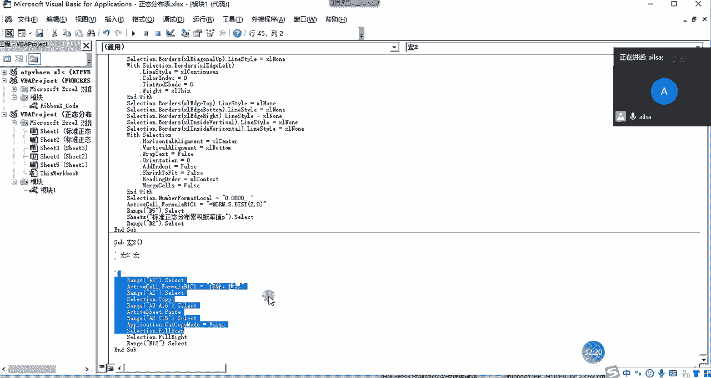

所以说唉每一门儿啊，每一门软件它都是有代码的哈啊对VBA啊，alt加F4F11哈，我试一下，alt加F11哈，不是F4啊，alt加F11对，这个叫BBA啊，呃呃跟大家说，其实BBA在进行啊。

excel的数据自动化处理方面还是不错的，也就是说你要对，因为它可以它是依附于excel而言的，所以说你要选你，它可以定位到某个单元格，然后进行一些自动化的操作，然后比如说函数啊等等这些他都可以啊。

它还可以触发事件嗯，触发事件大家学前端的时候应该啊应该学过哈，触发事件它也可以，比如说你点击这个对话框，点击这个单元格，然后你下拉选择什么内容，它下面会自动会变啊，它也是可以实现的。

只要事件的触发它也可以，而且它还可以实现数据的自动计算，然后数据的合并，数据的拆分啊等等，这些啊就是编程语言都是有很大的好处，在于它可以实现数据的自动化，自动化的方式啊，啊用Python也可以也可以。

Python也可以跟excel进行交互啊，啊也可以excel进行交互，所以每一款啊，大家大家都说，之前的大家都说excel非常的很简单对吧，但是如果说你要能够达到VBA那一层的话啊。

也也也也也也不简单哈，也挺难的，也挺难的啊，所以说不要小看任何一个软件哈，学到精髓啊，学到啊就是无人能及的时候，那就是你的境界了哈，OK我们扯回原题哈，扯回原题，那在我们的SPSS当中。

也是有这样的一个语言的啊，有这样的一个语法的啊，那他也他也有自己的一个。

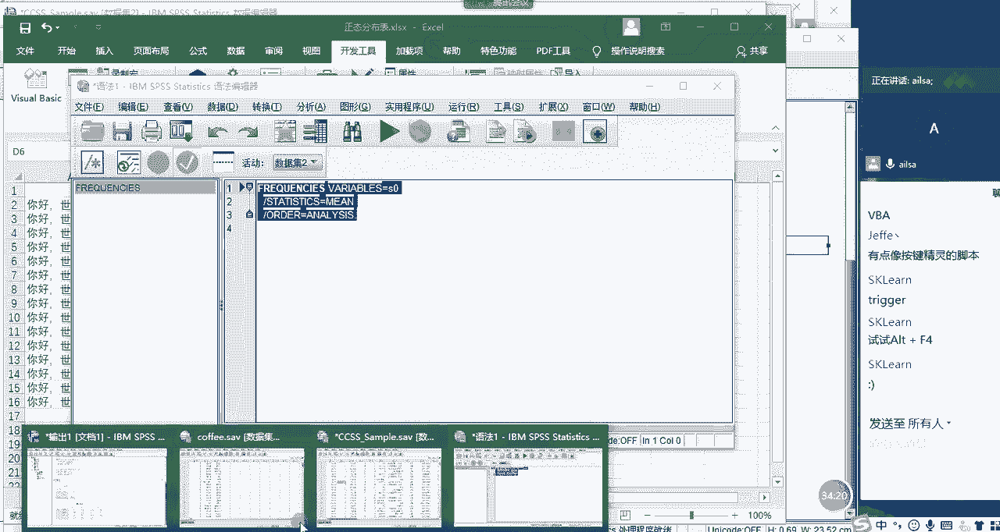

因为我们在这里啊，在这里你打开脚本的话，说明它是可以跟其他语言进行一个交互的，对不对，唉这样的一个形式哈，这就是我们要介绍的啊，窗口我们介绍了四大窗口。

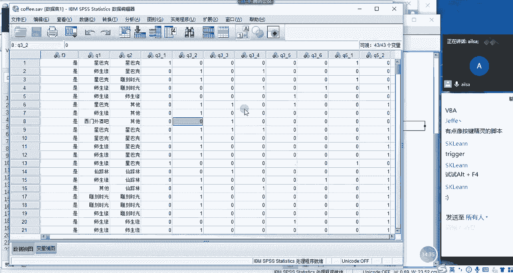

一个是就是我们的数据窗口，一个就是我们的结果输出窗口，还有就是我们的啊语法窗口，以及我们的啊我们的一个脚本窗口哈。

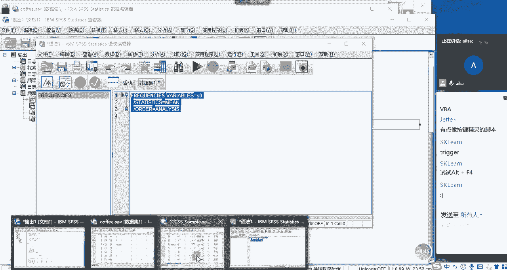

脚本窗口，还有可以跟Python，可以跟BBA进行交互的这四大窗口，那我们讲完窗口之后再来看一下啊，再来看一下我们SPSS的基本使用方式哈，啊那首先第一个什么叫菜单式对话框介绍哈，什么是菜单式呢。

大家看一下。

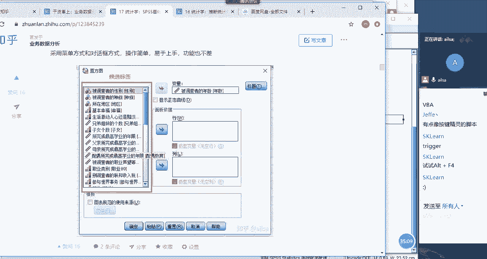

我在SPSS当中，所有的操作，几乎都是经过对话框的形式来呈现的，你比如说我点击分析描述统计，然后点击描述哎，它就会出现这样的一些字段，然后选择变量，然后这个时候它会一些选项选项。

这里面就是让你选择你想要体现的这些值，那从这些内容来看的话，当它都是基于统计学方面的一些知识对吧啊，标准差，方差离散对吧，然后风度偏度啊，显示的顺序等等，这些啊就是我们想要达到的一个结果。

然后样式啊其实就还显示这个这个倒不重要啊，等等这样的一个形式，我们啊通过一个比较详细点的，比如说看探索，然后他就会因变量因子列表啊，等这些我们再看统计啊，是不是啊，这些其实特别统计学啊，特别偏统计学啊。

这样的结果，可能很多人看到这些都不是特别的明白哈，没有关系，我们不是所有东西都要掌握哈，就跟excel似的，还有很多很多个函数，我们没必要所有的掌握，但对于SSPSS而言，它就是有很多的功能。

我们也没必要去掌握哈，那这边的话大家看到没有，我们接下来有几个选项，第一个叫确定，我们就不讲了，第二个要粘贴，它粘贴的是什么东西呢，其实它粘贴的啊，我们可以看一下粘贴什么东西啊，应该是粘贴的。

我们的语法大家看到没有，我把语法粘贴到这里了，也就是说你刚才执行的这一步操作，如果你点击粘贴的话，你这个语法就过来了啊，就是意思是就是粘贴的语法啊。

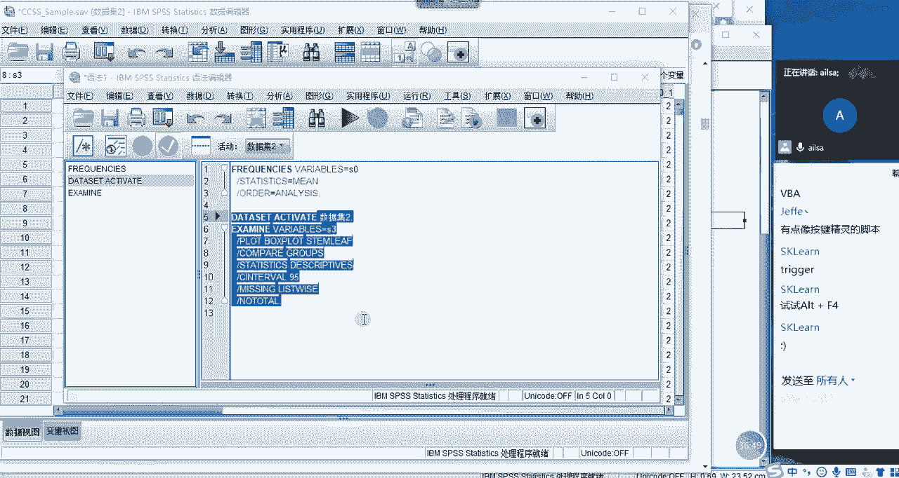

明白了吧，然后我们再看一下还有其他按钮嗯，再看一下啊，还有重置，重置的话就是你选了年龄，点击它就会重置啊，取消和帮助，这个就没有什么可说的了，这是我们的对话框式的一个按钮方式。

然后的话它每一个下面就会有很多个选项，然后供你去自由的选择，这也就是说它涵盖面它涵盖面很广啊，它涵盖面很广啊，你只要根据自己自己的一个需要去选择，就可以了，那也从另一个另外一个侧面，就是说嗯。

他这个统计学上的一些东西还是比较复杂的，对不对啊，什么什么这个那个的啊，还有就是每个人的说法也不太一样，还有可能是这样哈，就是没有一个统一的啊一个方式啊，每个人都有自己的一个道理，所以说都放在了这里啊。

这样一个也有也有这样的一个原因哈，OK啊，这是我们的基本的一个对话框的展示形式啊，跟大家解释到这里啊，然后我们看啊，这是我刚才介绍的东西哈，然后我们再看它的整个啊变量存储的类型啊，变量存储的类型的话啊。

其实呃主要是数值，日期和字符串，那这三个的话我们在excel当中也是经常存的哈，数值就是数字嘛，日期就是日期格式，然后字符串就是文本格式对吧，嗯就这三种会用的比较多一些哈，好这三种用的会比较多一些。

那呃我们啊刚才有说到啊，有说到我们整个的一个变量视图，这里面我会我们会发现它跟excel当中啊，或者跟数据库当中会略有不同，那我们看一下它分别是什么意思哈，我们刚才说到数据类型对吧。

我们主要是数字日期和字符串啊，这些我就不说了，然后宽度也就它能存多大呗，小数位就还有多少个小数呗，对吧，这个无所谓，然后标签和值大家要看一下哈，大家要看一下标签，其实就是我这一列代表什么意思对吧。

你看相当于是一个解释说明，哎我这个id啊是月啊，我这个time是月份的意思，我这个id就id我这S0就代表城市，S2代表性别，对不对，那这是我就是对这一列进行一个解释说明的，这样的一个内容。

然后我们再看值值是什么呢，大家看一下，大家看这是我们选择这个城市哈，大家看到没有，它其实是用数字来代表的，你看100代表北京，200代表上海，300代表广州，它其实是对于一个分类数据用数字去体现。

他为什么要用数字去体现呢，是因为我们在做统计分析的过程当中，需要数字化啊，因为你文本的话不太好去表述，对不对，但是有的人就说你在这里面写了100代表北京，那我在前面看的时候，我怎么知道呃。

就是有这么多数据呢，对不对，你比如说现在我点一下AS0，你看S0是不是代表城市，那你在这里的话，我怎么弄，唉我就是看到一堆数字，岂不是挺眼晕的吧，那我该怎么办呢，其实统计学啊。

或者是SPSS这边做的还是非常好的，大家看一下，大家现在可以跟随我的脚步哈，跟随我的手法再点一下这个东西，你看E和A之间的一个关系哈，值标签来，我们点一下诶，它是不是变成实际的一个值了。

那我们再点一下诶，它是不是变成数字了啊，那这个地方就很好的为我们的用户解决了，我们不知道这一列到底代表什么值的，这样一个问题，它既解决了我用数值来进行分析，又解决了我们查看的问题，非常非常的智能哈。

是不是大家大家对一个对于这个功能，应该是还是挺挺觉得，就是他对他不管是在excel方面还是在拍呃，数据库方面，他做的都是非常的好，因为你只要点一下它，它就会显示数字，你就不用去管任何东西了。

你再点一下它，你就可以去看整个那个表的内容了，那我们接下来可以看性别这一类，其实它也是用数字来进行代表的，你看我们看他这个一代表男，二代表女，对不对，那我在数据这里面的话，我们就看到男男女女这样的值。

那我们一点A就变成了这样的一个结果，那他在进行分析的时候，大家放心，他还进行它在进行分析的时候，完全使用的都是数值，所以没有问题啊，这样的一个结果啊，包括后面的所有的这些东西都能够啊。

只要说他在这里面有用数字代表文本内容的，一个形式的话，它就可以这么去实现，它只要在这个值里面有进行一些说明，就没有问题，那我们会发现，其实男女这个是属于分类数据对吧，OK没有关系啊，这就是标签。

是用来解释说明这一列到底什么意思，那指的就是为了显示这个列，当中它不同的分类代表不同的值，这样的一个结果啊，这是缺失，我们就不说了，列我们也不说了，对齐啊，无所谓了哈，我们要需要看一下这个测量。

大家看一下测量是什么意思，它有三个啊，我们大胆的来猜一下同志们，标度有序和名义到底什么意思啊，来有谁可以猜出来，现在你们手里也有数字，你们可以发现啊，发现一下什么规律，来同志们什么什么是有序。

什么是名义，什么是标度，大家现在想一想，我们就同通过我们的啊，表里的数据进行分析一下，你看月份是有序啊，id呢也是有序，然后城市是名义，城市是名义，然后年龄是标度，年龄是标度哈，然后学历也是有序啊。

然后职业啊，职业是名义，那我们会发现诶好像名义是不是代表无序分类，对不对，名义代表无序分类，因为你看职业他就没有顺序对吧，它但它是分类数据对吧，那他可能是代表无序分类，而有序呢，你比如说学历，还有初中。

高中啊，大学啊，那个本科博士啊，硕士博士他是不是有序的呀，所以这这应该代表的是有序分类，那标度什么意思呢，标注的意思是年龄对吧，对应的年龄，那它应该是一个连续性的数值型的变量。

对吧啊对标注就是连续性的数值型的变量，所以说我们从这个类当中我们分析出来啊，什么呢，我们分析出来我们的啊，我看我有没有写哈，没有写啊，没有关系啊啊在这里我再给大家演示一下，我们可以分析出来。

我们的有序指的就是有序分类变量，然后名义指的是无序分类变量，然后标度指的是我们的数值型变量就可以了啊，啊数值型就可以了啊，这么去理解就可以了，嗯数值型的就是标度，然后有序和名义分别都是分类啊分类。

然后分为有序分类和无序分类啊，大家对于这个知识点明白了没有，明白了，给我扣个一，好的嗯好的好的，那你看啊，我们对于啊，对于整个的一个呃嗯SSPSS最简单的啊界面啊，以及它的内容。

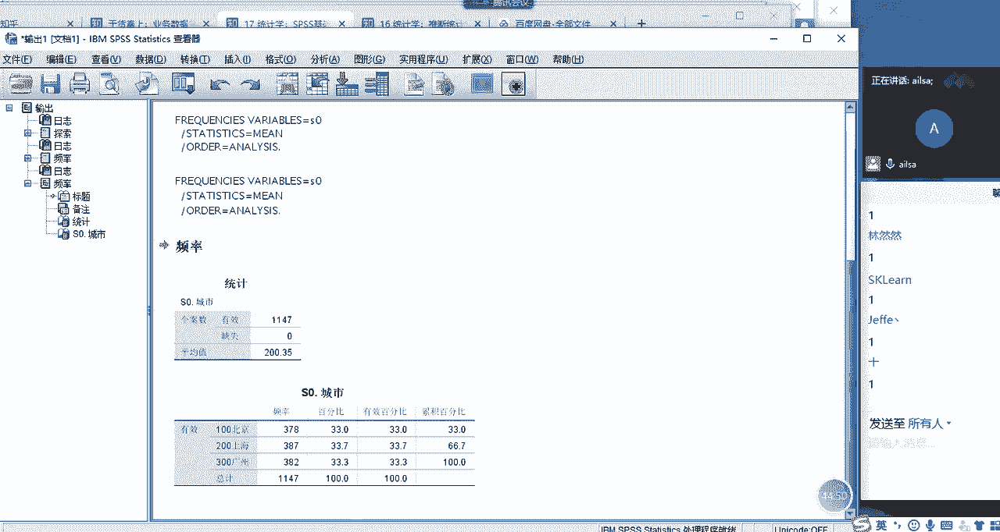

还有它的窗口进行了一个最简单的了解哈，啊没有关系。